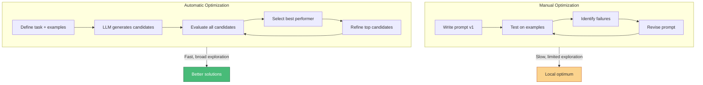
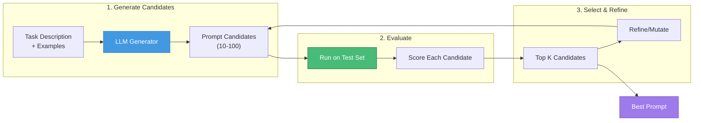
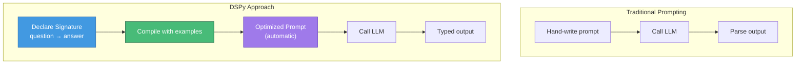
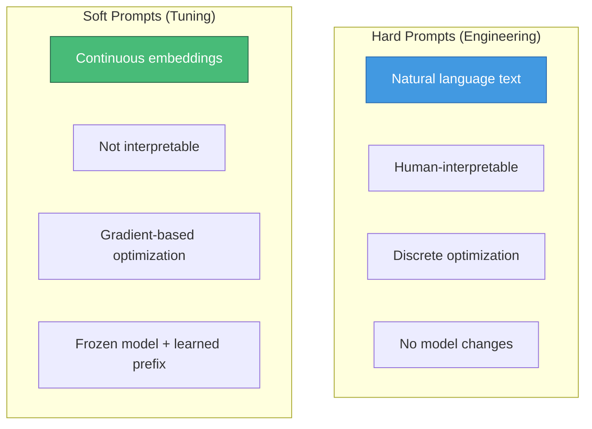
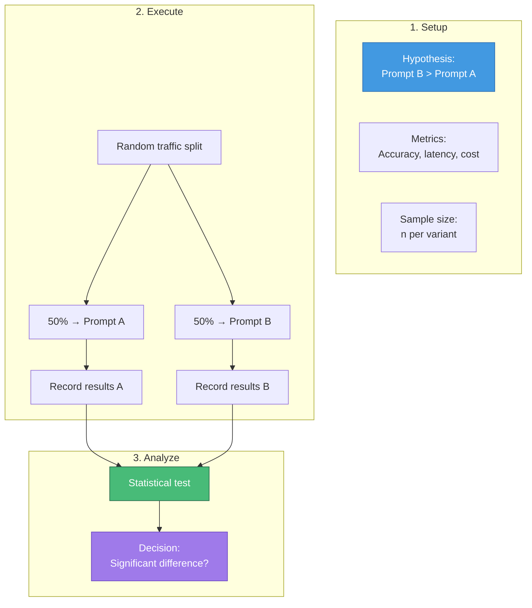
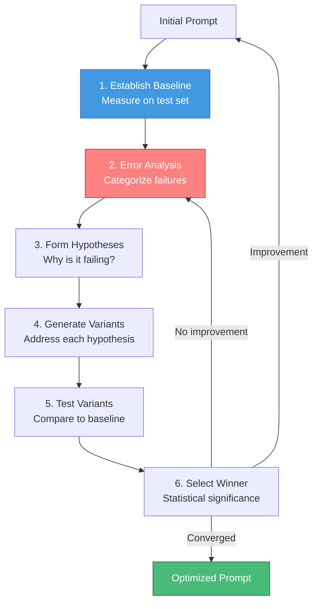

# Prompt Optimization

> Systematic approaches to improving prompt performance, from automated search to programmatic optimization frameworks.

---

## Learning Objectives

- **Understand automatic prompt engineering (APE)** and LLM-driven optimization
- **Apply DSPy** for programmatic prompt optimization
- **Distinguish prompt tuning from prompt engineering** (soft vs. hard prompts)
- **Design A/B testing frameworks** for production prompt evaluation
- **Implement iterative optimization workflows**

---

## The Optimization Challenge

Manual prompt engineering is time-consuming and often suboptimal. Different wordings can yield dramatically different results, but the search space is vast.



---

## Automatic Prompt Engineering (APE)

APE uses LLMs to generate and evaluate prompt candidates automatically.

### APE Pipeline



### APE Implementation

```python
def automatic_prompt_engineering(task_description, examples, n_candidates=20):
    """Generate and evaluate prompt candidates automatically."""

    # Step 1: Generate diverse prompt candidates
    generation_prompt = f"""
    Task: {task_description}

    Examples:
    {format_examples(examples[:5])}

    Generate {n_candidates} different instruction phrasings that could
    achieve this task. Each should be a complete prompt instruction.
    Be creative and try different approaches (direct, step-by-step,
    role-based, etc.)

    Output as numbered list:
    """

    candidates = llm.generate(generation_prompt)
    candidates = parse_numbered_list(candidates)

    # Step 2: Evaluate each candidate
    results = []
    for candidate in candidates:
        score = evaluate_prompt(candidate, examples)
        results.append((candidate, score))

    # Step 3: Return best performer
    results.sort(key=lambda x: x[1], reverse=True)
    return results[0][0]

def evaluate_prompt(prompt, examples):
    """Score prompt on held-out examples."""
    correct = 0
    for input_text, expected in examples:
        full_prompt = f"{prompt}\n\nInput: {input_text}"
        output = llm.generate(full_prompt)
        if matches_expected(output, expected):
            correct += 1
    return correct / len(examples)
```

### APE Techniques

| Technique | Description | Best For |
|-----------|-------------|----------|
| **Forward generation** | LLM proposes instructions | General optimization |
| **Backward generation** | Generate instruction from examples | Learning from demos |
| **Iterative refinement** | Mutate and improve top prompts | Fine-tuning best candidates |
| **Monte Carlo search** | Random sampling + selection | Large search spaces |

::: info Research Insight
APE-generated prompts often outperform human-written prompts. In the original paper, APE achieved 50%+ improvement on some tasks compared to carefully crafted manual prompts.
:::

---

## DSPy: Programmatic Prompting

DSPy treats prompts as programs, replacing hand-written prompts with declarative signatures that are automatically optimized.

### DSPy Concept



### DSPy Core Concepts

```python
import dspy

# Define a signature (what, not how)
class AnswerQuestion(dspy.Signature):
    """Answer a question with a detailed explanation."""
    question = dspy.InputField()
    answer = dspy.OutputField(desc="detailed answer")

# Create a module using the signature
class QAModule(dspy.Module):
    def __init__(self):
        super().__init__()
        self.generate = dspy.ChainOfThought(AnswerQuestion)

    def forward(self, question):
        return self.generate(question=question)

# Use the module
qa = QAModule()
result = qa(question="What causes seasons on Earth?")
print(result.answer)
```

### DSPy Optimizers

| Optimizer | Description | When to Use |
|-----------|-------------|-------------|
| `BootstrapFewShot` | Auto-generates few-shot examples | Starting point, small datasets |
| `BootstrapFewShotWithRandomSearch` | + random search over demos | More exploration needed |
| `MIPRO` | Multi-instruction proposal | Complex tasks |
| `BayesianSignatureOptimizer` | Bayesian optimization of signature | Computational budget available |

### Compiling Prompts

```python
# Prepare training data
trainset = [
    dspy.Example(question="What is photosynthesis?",
                 answer="Photosynthesis is...").with_inputs("question"),
    # ... more examples
]

# Compile the module (automatic prompt optimization)
from dspy.teleprompt import BootstrapFewShot

teleprompter = BootstrapFewShot(metric=exact_match_metric)
optimized_qa = teleprompter.compile(QAModule(), trainset=trainset)

# Now use optimized module
result = optimized_qa(question="What is gravity?")
```

::: info DSPy Philosophy
DSPy separates the "what" (signature) from the "how" (prompt implementation). This allows systematic optimization without manual prompt tweaking. The prompt becomes a learned artifact, not a hand-crafted string.
:::

---

## Prompt Tuning vs. Prompt Engineering

### Hard Prompts vs. Soft Prompts



### Prompt Tuning Mechanism

```python
# Conceptual implementation of prompt tuning
class PromptTuning(nn.Module):
    def __init__(self, frozen_model, n_prompt_tokens=20, embed_dim=768):
        super().__init__()
        self.frozen_model = frozen_model
        # Learnable soft prompt (continuous embeddings)
        self.soft_prompt = nn.Parameter(
            torch.randn(n_prompt_tokens, embed_dim)
        )

    def forward(self, input_ids):
        # Freeze the main model
        with torch.no_grad():
            input_embeds = self.frozen_model.embed(input_ids)

        # Prepend learnable soft prompt
        batch_size = input_embeds.size(0)
        soft_prompt_batch = self.soft_prompt.unsqueeze(0).expand(batch_size, -1, -1)
        combined = torch.cat([soft_prompt_batch, input_embeds], dim=1)

        # Forward through frozen model
        return self.frozen_model(inputs_embeds=combined)
```

### Comparison

| Aspect | Prompt Engineering | Prompt Tuning |
|--------|-------------------|---------------|
| **Requires training** | No | Yes (gradients) |
| **Model access** | API only | Weights needed |
| **Interpretability** | Human readable | Opaque embeddings |
| **Flexibility** | Change anytime | Fixed after training |
| **Performance** | Good | Often better |
| **Portability** | Works across models | Model-specific |

::: info When to Use Prompt Tuning
Prompt tuning requires model weight access and training infrastructure. Use it when:
- You have consistent task types (not ad-hoc queries)
- Performance gains justify training cost
- You control the model (open-source or self-hosted)
:::

---

## A/B Testing Prompts

### Testing Framework



### A/B Test Implementation

```python
import numpy as np
from scipy import stats

class PromptABTest:
    def __init__(self, prompt_a, prompt_b, metric_fn):
        self.prompt_a = prompt_a
        self.prompt_b = prompt_b
        self.metric_fn = metric_fn
        self.results_a = []
        self.results_b = []

    def run_test(self, queries, n_per_variant=100):
        """Run A/B test on queries."""
        for query in queries[:n_per_variant * 2]:
            # Random assignment
            if np.random.random() < 0.5:
                result = self.evaluate(query, self.prompt_a)
                self.results_a.append(result)
            else:
                result = self.evaluate(query, self.prompt_b)
                self.results_b.append(result)

        return self.analyze()

    def evaluate(self, query, prompt):
        """Evaluate single query with prompt."""
        output = llm.generate(f"{prompt}\n\n{query}")
        return self.metric_fn(output)

    def analyze(self):
        """Statistical analysis of results."""
        mean_a = np.mean(self.results_a)
        mean_b = np.mean(self.results_b)

        # Two-sample t-test
        t_stat, p_value = stats.ttest_ind(self.results_a, self.results_b)

        return {
            "mean_a": mean_a,
            "mean_b": mean_b,
            "difference": mean_b - mean_a,
            "p_value": p_value,
            "significant": p_value < 0.05,
            "winner": "B" if mean_b > mean_a and p_value < 0.05 else
                      "A" if mean_a > mean_b and p_value < 0.05 else "No difference"
        }
```

### A/B Testing Best Practices

| Practice | Rationale |
|----------|-----------|
| **Sufficient sample size** | Avoid false conclusions from noise |
| **Random assignment** | Eliminate selection bias |
| **Control for confounds** | Same model, temperature, time |
| **Multiple metrics** | Accuracy, latency, cost, user satisfaction |
| **Sequential testing** | Stop early if clear winner |

---

## Iterative Optimization Workflow

### Systematic Prompt Improvement



### Error Analysis Categories

| Category | Example | Potential Fix |
|----------|---------|---------------|
| **Format errors** | Wrong output structure | Add format examples |
| **Reasoning errors** | Wrong logic | Add CoT, break down steps |
| **Knowledge gaps** | Missing facts | Add context, use RAG |
| **Instruction confusion** | Misinterpreted task | Clarify, use delimiters |
| **Edge cases** | Fails on unusual inputs | Add diverse examples |

### Optimization Log Template

```markdown
## Prompt Optimization Log

### Version 1.0 (Baseline)
- Prompt: [text]
- Accuracy: 72%
- Failure categories:
  - Format errors: 15%
  - Reasoning errors: 10%
  - Other: 3%

### Version 1.1 (Format fix)
- Change: Added explicit format specification
- Hypothesis: Format errors due to unclear output requirements
- Result: Accuracy 85% (+13%)
- Format errors: 2% (down from 15%)

### Version 1.2 (CoT addition)
- Change: Added "Think step by step" + reasoning examples
- Hypothesis: Reasoning errors due to compressed inference
- Result: Accuracy 91% (+6%)
- Reasoning errors: 3% (down from 8%)

### Final Version: 1.2
- Accuracy: 91%
- Key improvements: Format specification, CoT prompting
```

---

## Interview Q&A

### Q1: Explain how automatic prompt engineering (APE) works and when you would use it.

**Strong Answer:**

APE automates the prompt optimization process using LLMs themselves:

**How it works:**

1. **Generation phase**: Given a task description and examples, an LLM generates multiple candidate prompt instructions. The generation prompt asks for diverse approaches: direct instructions, role-playing, step-by-step, etc.

2. **Evaluation phase**: Each candidate prompt is tested on a held-out evaluation set. Metrics like accuracy, format compliance, or task-specific scores are computed.

3. **Selection phase**: The top-performing prompts are selected. Optionally, these can be mutated/refined and re-evaluated in subsequent rounds.

**When to use APE:**

- **Large optimization space**: When many phrasings could work and manual testing is impractical
- **Limited prompt engineering expertise**: APE can find good prompts without deep expertise
- **Standardized tasks**: When you have clear evaluation metrics
- **New model deployment**: When migrating prompts between models

**When NOT to use APE:**

- **One-off queries**: Overhead not justified
- **Highly creative tasks**: Hard to evaluate automatically
- **No evaluation data**: APE needs examples to score against

**Example workflow:**

```python
# Task: Sentiment classification
task = "Classify the sentiment of movie reviews as positive or negative"
examples = load_evaluation_set()  # 100 labeled examples

# APE generates 50 prompt variants
# Tests each on examples
# Returns best: "Analyze the following movie review and classify
#               its sentiment as exactly 'positive' or 'negative'.
#               Review: {text}"
best_prompt = automatic_prompt_engineering(task, examples, n_candidates=50)
```

In practice, APE often finds prompts 10-30% better than initial human attempts, though the best results come from combining APE exploration with human refinement of top candidates.

---

### Q2: Compare DSPy to traditional prompt engineering. What problems does it solve?

**Strong Answer:**

DSPy represents a paradigm shift from "prompts as strings" to "prompts as programs."

**Traditional prompt engineering problems:**

1. **Brittleness**: Small wording changes cause large performance swings
2. **Non-transferability**: Prompts optimized for GPT-4 may fail on Claude
3. **Manual iteration**: Tedious trial-and-error optimization
4. **Coupled logic**: Prompt contains both task description and optimization details

**How DSPy solves these:**

| Problem | Traditional | DSPy Solution |
|---------|-------------|---------------|
| Brittleness | Manually test phrasings | Auto-compiled from signatures |
| Transferability | Rewrite for each model | Recompile with new model |
| Manual iteration | Human tweaking | Automatic optimization |
| Coupled logic | All in prompt string | Signature (what) vs. teleprompter (how) |

**DSPy key concepts:**

```python
# 1. Signature: Declares WHAT, not HOW
class Summarize(dspy.Signature):
    document = dspy.InputField()
    summary = dspy.OutputField(desc="3 sentence summary")

# 2. Module: Composable building blocks
class SummarizeAndAnalyze(dspy.Module):
    def __init__(self):
        self.summarize = dspy.ChainOfThought(Summarize)
        self.analyze = dspy.ChainOfThought(AnalyzeSentiment)

    def forward(self, document):
        summary = self.summarize(document=document)
        sentiment = self.analyze(text=summary.summary)
        return summary, sentiment

# 3. Teleprompter: Automatic optimization
teleprompter = BootstrapFewShot(metric=quality_metric)
optimized_module = teleprompter.compile(SummarizeAndAnalyze(), trainset=examples)
```

**When to use DSPy:**
- Building systems with multiple LLM calls
- Need reproducible, testable prompts
- Planning to iterate on model backends
- Team collaboration on prompt development

The key insight is that DSPy treats the prompt as a *learned parameter* rather than a *hand-coded artifact*, enabling systematic optimization and easier maintenance.

---

### Q3: How would you design an A/B testing framework for prompts in a production system?

**Strong Answer:**

A robust prompt A/B testing framework needs several components:

**1. Traffic splitting**:
```python
class PromptRouter:
    def __init__(self, variants, weights=None):
        self.variants = variants  # {"control": prompt_a, "treatment": prompt_b}
        self.weights = weights or {k: 1/len(variants) for k in variants}

    def route(self, user_id, query):
        # Deterministic assignment based on user_id for consistency
        variant = self.get_variant(user_id)
        return self.variants[variant], variant

    def get_variant(self, user_id):
        # Hash-based assignment for reproducibility
        hash_val = hash(f"{user_id}_experiment_123") % 100
        cumsum = 0
        for variant, weight in self.weights.items():
            cumsum += weight * 100
            if hash_val < cumsum:
                return variant
```

**2. Metrics collection**:
```python
@dataclass
class ExperimentResult:
    user_id: str
    variant: str
    query: str
    response: str
    latency_ms: float
    accuracy: float  # If ground truth available
    user_rating: Optional[int]  # If collected
    timestamp: datetime
```

**3. Statistical analysis**:
- Sample size calculation: Ensure enough data for significance
- Sequential testing: Allow early stopping with corrections
- Multiple comparison correction: If testing >2 variants

**4. Guardrails**:
```python
class SafeABTest:
    def __init__(self, control, treatment, guardrails):
        self.control = control
        self.treatment = treatment
        self.guardrails = guardrails  # e.g., max_latency, min_quality

    def should_serve_treatment(self, metrics_so_far):
        # Check if treatment is clearly worse
        if metrics_so_far.treatment_quality < self.guardrails.min_quality:
            return False  # Fall back to control
        return True
```

**5. Reporting dashboard**:
- Real-time metrics visualization
- Statistical significance indicators
- Segment breakdowns (by user type, query type)
- Winner recommendation

**Key considerations:**

| Factor | Approach |
|--------|----------|
| User consistency | Same user always sees same variant (hash-based) |
| Novelty effects | Run test long enough to see steady state |
| Segment analysis | Check for heterogeneous treatment effects |
| Cost tracking | Include token cost as a metric |
| Rollout plan | Define criteria for 100% deployment |

This framework ensures statistically valid conclusions while protecting user experience through guardrails.

---

## Summary Table

| Method | Type | Requires Training | Best For |
|--------|------|-------------------|----------|
| **APE** | Automatic search | No | Broad exploration |
| **DSPy** | Programmatic | Compilation (no fine-tuning) | System building |
| **Prompt Tuning** | Soft prompts | Yes (gradients) | Maximum performance |
| **A/B Testing** | Evaluation | No | Production validation |
| **Iterative Refinement** | Manual + systematic | No | Targeted improvement |

---

## Sources

- "Large Language Models Are Human-Level Prompt Engineers" (Zhou et al., 2022) - APE
- "DSPy: Compiling Declarative Language Model Calls into Self-Improving Pipelines" (Khattab et al., 2023)
- "The Power of Scale for Parameter-Efficient Prompt Tuning" (Lester et al., 2021)
- "Prefix-Tuning: Optimizing Continuous Prompts for Generation" (Li & Liang, 2021)
- "Prompt Programming for Large Language Models" (Reynolds & McDonell, 2021)
