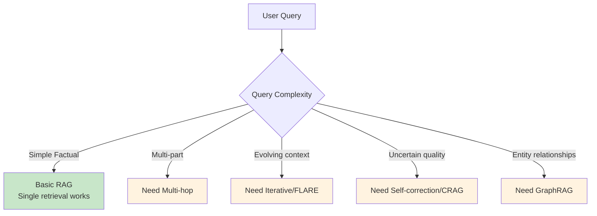
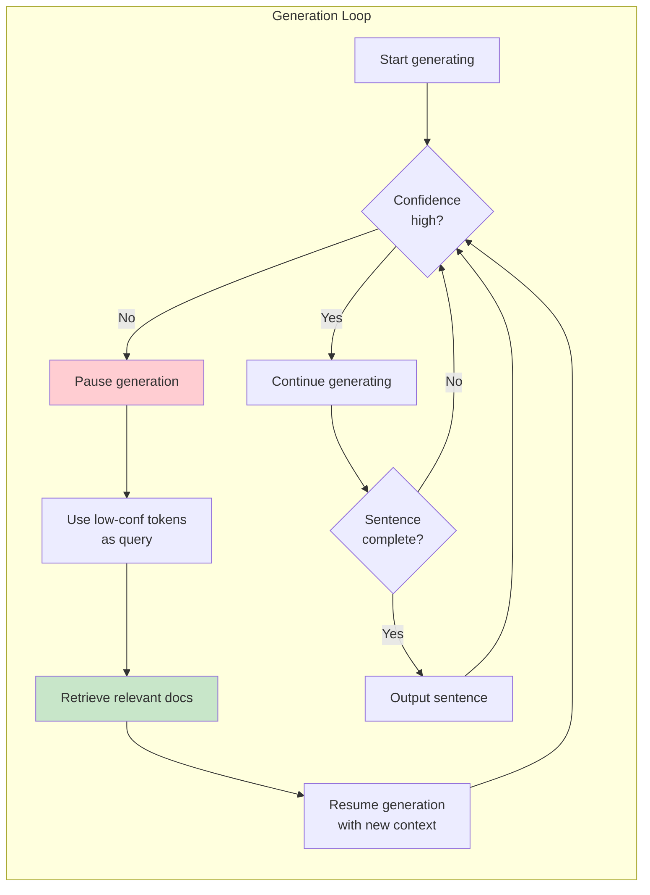
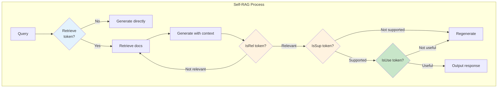
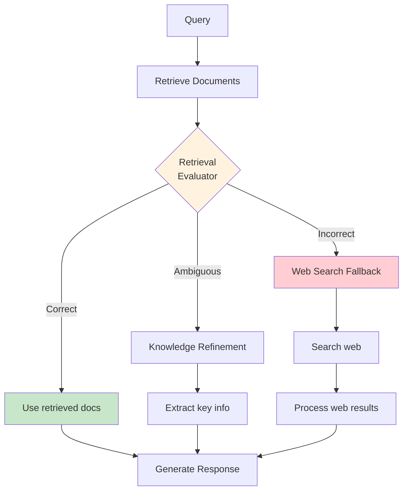
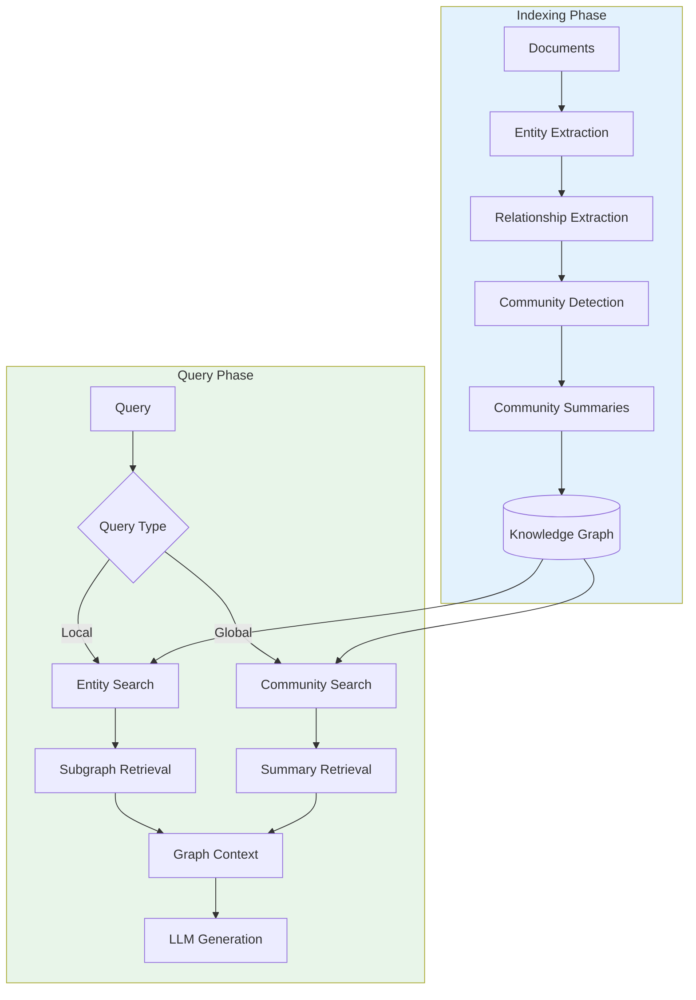
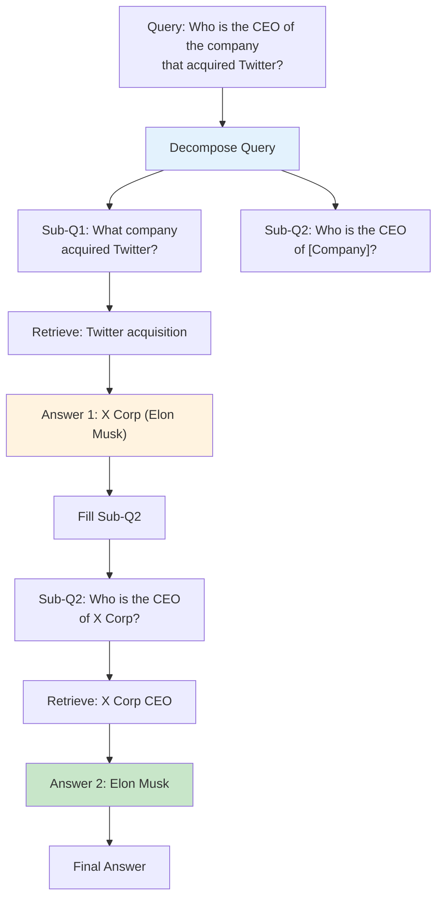

# Advanced RAG Patterns

Beyond basic RAG, several advanced patterns have emerged to address specific challenges: iterative retrieval, self-correction, and complex reasoning over knowledge bases. This module covers FLARE, Self-RAG, CRAG, GraphRAG, and multi-hop retrieval architectures.

## Learning Objectives

- **Understand when basic RAG falls short** and advanced patterns are needed
- **Implement FLARE** for iterative, generation-guided retrieval
- **Apply Self-RAG** for self-reflective retrieval and generation
- **Use CRAG** for corrective retrieval with web fallback
- **Build GraphRAG** systems for relationship-aware retrieval
- **Design multi-hop retrieval** for complex, multi-step questions

## When Basic RAG Falls Short



### Limitations of Basic RAG

| Limitation | Example | Advanced Pattern |
|------------|---------|------------------|
| Single retrieval miss | Complex query needs multiple lookups | Multi-hop, FLARE |
| Retrieval noise | Irrelevant docs hurt generation | CRAG, Self-RAG |
| No self-correction | Wrong answer with high confidence | Self-RAG |
| Missing relationships | "Who worked with X at Y?" | GraphRAG |
| Context evolution | Long-form generation needs different context | FLARE |

## FLARE: Forward-Looking Active Retrieval

FLARE retrieves dynamically during generation, when the model is uncertain about what to say next.



### Implementation

```python
from typing import List, Dict, Tuple, Optional
import numpy as np

class FLARERetriever:
    """
    Forward-Looking Active REtrieval augmented generation.

    Key insight: Retrieve when the model is uncertain, using
    the uncertain tokens as retrieval queries.
    """

    def __init__(
        self,
        llm,
        retriever,
        confidence_threshold: float = 0.5,
        lookahead_tokens: int = 64
    ):
        self.llm = llm
        self.retriever = retriever
        self.confidence_threshold = confidence_threshold
        self.lookahead_tokens = lookahead_tokens

    def generate(
        self,
        query: str,
        initial_context: str = ""
    ) -> Tuple[str, List[Dict]]:
        """Generate response with active retrieval."""

        context = initial_context
        generated_text = ""
        retrieval_log = []

        while True:
            # Generate next segment with confidence scores
            result = self._generate_with_confidence(
                query=query,
                context=context,
                generated_so_far=generated_text
            )

            new_tokens = result["tokens"]
            confidences = result["confidences"]

            # Check for low confidence spans
            low_conf_span = self._find_low_confidence_span(
                new_tokens, confidences
            )

            if low_conf_span:
                # Use low confidence tokens as retrieval query
                retrieval_query = " ".join(low_conf_span["tokens"])

                # Retrieve additional context
                new_docs = self.retriever.search(retrieval_query, top_k=3)
                retrieval_log.append({
                    "trigger": retrieval_query,
                    "docs_retrieved": len(new_docs)
                })

                # Update context
                context = self._merge_context(
                    context,
                    [doc["text"] for doc in new_docs]
                )

                # Regenerate from low confidence point
                generated_text = generated_text[:low_conf_span["start_idx"]]

            else:
                # High confidence - accept generation
                generated_text += " ".join(new_tokens)

                # Check if complete
                if self._is_complete(generated_text, query):
                    break

        return generated_text, retrieval_log

    def _generate_with_confidence(
        self,
        query: str,
        context: str,
        generated_so_far: str
    ) -> Dict:
        """Generate tokens with token-level confidence scores."""

        prompt = f"""Context: {context}

Question: {query}

Answer so far: {generated_so_far}

Continue the answer:"""

        # Get logprobs from LLM
        response = self.llm.generate(
            prompt,
            max_tokens=self.lookahead_tokens,
            logprobs=True
        )

        tokens = response["tokens"]
        logprobs = response["logprobs"]

        # Convert logprobs to confidence (probability)
        confidences = [np.exp(lp) for lp in logprobs]

        return {"tokens": tokens, "confidences": confidences}

    def _find_low_confidence_span(
        self,
        tokens: List[str],
        confidences: List[float]
    ) -> Optional[Dict]:
        """Find first span where confidence drops below threshold."""

        for i, (token, conf) in enumerate(zip(tokens, confidences)):
            if conf < self.confidence_threshold:
                # Found low confidence - return span
                span_end = min(i + 10, len(tokens))  # Include some lookahead
                return {
                    "tokens": tokens[i:span_end],
                    "start_idx": i,
                    "avg_confidence": np.mean(confidences[i:span_end])
                }

        return None  # All high confidence

    def _merge_context(
        self,
        existing: str,
        new_docs: List[str]
    ) -> str:
        """Merge new retrieved docs with existing context."""
        # Simple concatenation with deduplication
        all_context = existing + "\n\n" + "\n\n".join(new_docs)
        # Could add summarization for long contexts
        return all_context[:8000]  # Truncate if too long

    def _is_complete(self, text: str, query: str) -> bool:
        """Check if generation is complete."""
        # Simple heuristics - could be more sophisticated
        return (
            len(text) > 100 and
            (text.rstrip().endswith('.') or
             text.rstrip().endswith('!') or
             text.rstrip().endswith('?'))
        )
```

::: info FLARE Key Insight
FLARE retrieves **during** generation, not just before. This is powerful because:
1. The model knows what it doesn't know (low confidence)
2. Retrieval queries are more specific (generated tokens)
3. Context stays relevant as generation progresses
:::

## Self-RAG: Self-Reflective Retrieval-Augmented Generation

Self-RAG trains the model to decide when to retrieve and to critique its own outputs.



### Implementation

```python
class SelfRAG:
    """
    Self-Reflective RAG with critique tokens.

    The model generates special tokens:
    - [Retrieve]: Should I retrieve? (yes/no)
    - [IsRel]: Is retrieved doc relevant? (relevant/irrelevant)
    - [IsSup]: Is response supported by docs? (supported/partial/none)
    - [IsUse]: Is response useful? (1-5 scale)
    """

    def __init__(self, llm, retriever, critic_llm=None):
        self.llm = llm
        self.retriever = retriever
        self.critic_llm = critic_llm or llm

    def generate(
        self,
        query: str,
        max_iterations: int = 3
    ) -> Dict:
        """Generate with self-reflection."""

        for iteration in range(max_iterations):
            # Step 1: Decide whether to retrieve
            should_retrieve = self._decide_retrieval(query)

            if should_retrieve:
                # Step 2: Retrieve documents
                docs = self.retriever.search(query, top_k=5)

                # Step 3: Filter by relevance
                relevant_docs = self._filter_relevant(query, docs)

                if not relevant_docs:
                    # No relevant docs - try without retrieval
                    response = self._generate_without_context(query)
                else:
                    # Step 4: Generate with context
                    response = self._generate_with_context(
                        query, relevant_docs
                    )
            else:
                # Generate without retrieval
                response = self._generate_without_context(query)

            # Step 5: Critique the response
            critique = self._critique_response(query, response, docs if should_retrieve else [])

            if critique["is_supported"] and critique["usefulness"] >= 4:
                return {
                    "response": response,
                    "critique": critique,
                    "iterations": iteration + 1,
                    "retrieved_docs": relevant_docs if should_retrieve else []
                }

            # Not good enough - modify query and retry
            query = self._refine_query(query, critique)

        # Max iterations reached
        return {
            "response": response,
            "critique": critique,
            "iterations": max_iterations,
            "warning": "Max iterations reached"
        }

    def _decide_retrieval(self, query: str) -> bool:
        """Decide if retrieval is needed."""
        prompt = f"""Determine if external knowledge retrieval is needed to answer this query.

Query: {query}

Consider:
- Is this a factual question requiring specific information?
- Is this about recent events or specific entities?
- Can this be answered from general knowledge?

Output only: RETRIEVE or NO_RETRIEVE"""

        response = self.llm.generate(prompt, max_tokens=10)
        return "RETRIEVE" in response.upper()

    def _filter_relevant(
        self,
        query: str,
        docs: List[Dict]
    ) -> List[Dict]:
        """Filter documents by relevance."""
        relevant = []

        for doc in docs:
            prompt = f"""Is this document relevant to answering the query?

Query: {query}

Document: {doc['text'][:500]}

Output only: RELEVANT or IRRELEVANT"""

            response = self.critic_llm.generate(prompt, max_tokens=10)
            if "RELEVANT" in response.upper():
                relevant.append(doc)

        return relevant

    def _generate_with_context(
        self,
        query: str,
        docs: List[Dict]
    ) -> str:
        """Generate response using retrieved context."""
        context = "\n\n".join([doc["text"] for doc in docs])

        prompt = f"""Answer the query using the provided context.

Context:
{context}

Query: {query}

Answer:"""

        return self.llm.generate(prompt)

    def _generate_without_context(self, query: str) -> str:
        """Generate response without retrieval."""
        prompt = f"""Answer the following query:

Query: {query}

Answer:"""

        return self.llm.generate(prompt)

    def _critique_response(
        self,
        query: str,
        response: str,
        docs: List[Dict]
    ) -> Dict:
        """Critique the generated response."""

        context = "\n\n".join([doc["text"] for doc in docs]) if docs else "No context used"

        prompt = f"""Evaluate this response:

Query: {query}
Context: {context}
Response: {response}

Evaluate:
1. Is the response supported by the context? (fully_supported/partially_supported/not_supported)
2. How useful is this response? (1-5, where 5 is very useful)
3. Any factual errors? (yes/no)

Output as:
SUPPORTED: [value]
USEFULNESS: [1-5]
ERRORS: [yes/no]"""

        critique_response = self.critic_llm.generate(prompt)

        # Parse response
        is_supported = "fully_supported" in critique_response.lower() or "partially_supported" in critique_response.lower()

        import re
        usefulness_match = re.search(r'USEFULNESS:\s*(\d)', critique_response)
        usefulness = int(usefulness_match.group(1)) if usefulness_match else 3

        has_errors = "ERRORS: yes" in critique_response.lower()

        return {
            "is_supported": is_supported,
            "usefulness": usefulness,
            "has_errors": has_errors,
            "raw_critique": critique_response
        }

    def _refine_query(self, query: str, critique: Dict) -> str:
        """Refine query based on critique."""
        prompt = f"""The previous response to this query was inadequate.

Original query: {query}
Issues: Usefulness was {critique['usefulness']}/5

Generate a refined query that might get better results:"""

        return self.llm.generate(prompt, max_tokens=100)
```

## CRAG: Corrective Retrieval-Augmented Generation

CRAG evaluates retrieval quality and corrects with web search when needed.



### Implementation

```python
class CRAG:
    """
    Corrective RAG with retrieval evaluation and web fallback.

    Key components:
    1. Retrieval Evaluator: Scores retrieval quality
    2. Knowledge Refinement: Extracts key information
    3. Web Search: Fallback for failed retrieval
    """

    def __init__(
        self,
        llm,
        retriever,
        web_search,
        confidence_thresholds: Dict = None
    ):
        self.llm = llm
        self.retriever = retriever
        self.web_search = web_search
        self.thresholds = confidence_thresholds or {
            "correct": 0.7,
            "incorrect": 0.3
        }

    def generate(self, query: str) -> Dict:
        """Generate with corrective retrieval."""

        # Step 1: Initial retrieval
        docs = self.retriever.search(query, top_k=5)

        # Step 2: Evaluate retrieval quality
        eval_results = self._evaluate_retrieval(query, docs)

        # Step 3: Route based on evaluation
        if eval_results["action"] == "correct":
            # Good retrieval - use as-is
            context = self._extract_knowledge(query, docs)
            source = "retrieval"

        elif eval_results["action"] == "ambiguous":
            # Partial retrieval - refine knowledge
            refined = self._refine_knowledge(query, docs)
            web_results = self.web_search.search(query)
            context = self._merge_sources(refined, web_results)
            source = "hybrid"

        else:  # incorrect
            # Bad retrieval - fall back to web
            web_results = self.web_search.search(query)
            context = self._process_web_results(web_results)
            source = "web"

        # Step 4: Generate response
        response = self._generate_response(query, context)

        return {
            "response": response,
            "source": source,
            "retrieval_score": eval_results["confidence"],
            "action_taken": eval_results["action"]
        }

    def _evaluate_retrieval(
        self,
        query: str,
        docs: List[Dict]
    ) -> Dict:
        """Evaluate if retrieved documents are correct for the query."""

        if not docs:
            return {"action": "incorrect", "confidence": 0.0}

        # Score each document
        scores = []
        for doc in docs:
            prompt = f"""Rate the relevance of this document for answering the query.

Query: {query}

Document: {doc['text'][:500]}

Rate from 0.0 (completely irrelevant) to 1.0 (perfectly relevant).
Output only the number:"""

            response = self.llm.generate(prompt, max_tokens=10)
            try:
                score = float(response.strip())
                scores.append(min(max(score, 0.0), 1.0))
            except:
                scores.append(0.5)

        # Aggregate scores
        avg_score = np.mean(scores)
        max_score = max(scores)

        # Determine action
        if max_score >= self.thresholds["correct"]:
            action = "correct"
        elif avg_score >= self.thresholds["incorrect"]:
            action = "ambiguous"
        else:
            action = "incorrect"

        return {
            "action": action,
            "confidence": avg_score,
            "doc_scores": scores
        }

    def _extract_knowledge(
        self,
        query: str,
        docs: List[Dict]
    ) -> str:
        """Extract relevant knowledge from documents."""
        combined = "\n\n".join([doc["text"] for doc in docs])

        prompt = f"""Extract the key information from these documents that's relevant to answering:
Query: {query}

Documents:
{combined}

Key information:"""

        return self.llm.generate(prompt)

    def _refine_knowledge(
        self,
        query: str,
        docs: List[Dict]
    ) -> str:
        """Refine partially relevant documents."""

        # Decompose into sub-queries
        prompt = f"""The query may need multiple pieces of information.
Break it into sub-questions:

Query: {query}

Sub-questions:"""

        sub_queries = self.llm.generate(prompt).strip().split('\n')

        # Extract relevant parts for each sub-query
        refined_parts = []
        combined_docs = "\n\n".join([doc["text"] for doc in docs])

        for sub_q in sub_queries[:3]:  # Limit sub-queries
            prompt = f"""Extract information relevant to this sub-question:

Sub-question: {sub_q}

Documents:
{combined_docs[:2000]}

Relevant information (or 'Not found'):"""

            part = self.llm.generate(prompt)
            if "not found" not in part.lower():
                refined_parts.append(part)

        return "\n\n".join(refined_parts)

    def _process_web_results(self, web_results: List[Dict]) -> str:
        """Process web search results."""
        # Filter and clean web results
        cleaned = []
        for result in web_results[:5]:
            cleaned.append(f"Source: {result.get('url', 'Unknown')}\n{result.get('snippet', '')}")
        return "\n\n".join(cleaned)

    def _merge_sources(self, retrieval: str, web: List[Dict]) -> str:
        """Merge retrieval and web sources."""
        web_text = self._process_web_results(web)
        return f"From knowledge base:\n{retrieval}\n\nFrom web search:\n{web_text}"

    def _generate_response(self, query: str, context: str) -> str:
        """Generate final response."""
        prompt = f"""Answer the query using the provided information.

Information:
{context}

Query: {query}

Answer:"""

        return self.llm.generate(prompt)
```

## GraphRAG: Knowledge Graph-Enhanced Retrieval

GraphRAG uses knowledge graphs to capture entity relationships and enable relationship-aware retrieval.



### Implementation

```python
import networkx as nx
from collections import defaultdict

class GraphRAG:
    """
    Knowledge Graph-based RAG for relationship-aware retrieval.

    Based on Microsoft's GraphRAG approach:
    1. Extract entities and relationships from documents
    2. Build knowledge graph
    3. Detect communities for global understanding
    4. Query via local (entity) or global (community) search
    """

    def __init__(self, llm, embedding_model):
        self.llm = llm
        self.embedding_model = embedding_model
        self.graph = nx.Graph()
        self.entity_docs = defaultdict(list)  # entity -> document chunks
        self.communities = {}  # community_id -> summary

    def build_index(self, documents: List[Dict]) -> None:
        """Build knowledge graph from documents."""

        for doc in documents:
            # Extract entities and relationships
            entities, relationships = self._extract_graph_elements(doc["text"])

            # Add to graph
            for entity in entities:
                self.graph.add_node(
                    entity["name"],
                    type=entity["type"],
                    description=entity.get("description", "")
                )
                self.entity_docs[entity["name"]].append(doc)

            for rel in relationships:
                self.graph.add_edge(
                    rel["source"],
                    rel["target"],
                    relationship=rel["type"],
                    description=rel.get("description", "")
                )

        # Detect communities
        self._detect_communities()

        # Generate community summaries
        self._generate_community_summaries()

    def _extract_graph_elements(self, text: str) -> Tuple[List[Dict], List[Dict]]:
        """Extract entities and relationships from text."""

        prompt = f"""Extract entities and relationships from this text.

Text: {text[:2000]}

Output format:
ENTITIES:
- name: [entity name], type: [person/org/concept/etc], description: [brief description]

RELATIONSHIPS:
- source: [entity1], target: [entity2], type: [relationship type], description: [brief description]

Extract:"""

        response = self.llm.generate(prompt)

        # Parse response (simplified - use structured output in production)
        entities = []
        relationships = []

        # Parse entities section
        in_entities = False
        in_relationships = False

        for line in response.split('\n'):
            line = line.strip()
            if 'ENTITIES:' in line:
                in_entities = True
                in_relationships = False
            elif 'RELATIONSHIPS:' in line:
                in_entities = False
                in_relationships = True
            elif line.startswith('- name:') and in_entities:
                # Parse entity
                parts = line.split(',')
                entity = {}
                for part in parts:
                    if ':' in part:
                        key, val = part.split(':', 1)
                        entity[key.strip().replace('- ', '')] = val.strip()
                if 'name' in entity:
                    entities.append(entity)
            elif line.startswith('- source:') and in_relationships:
                # Parse relationship
                parts = line.split(',')
                rel = {}
                for part in parts:
                    if ':' in part:
                        key, val = part.split(':', 1)
                        rel[key.strip().replace('- ', '')] = val.strip()
                if 'source' in rel and 'target' in rel:
                    relationships.append(rel)

        return entities, relationships

    def _detect_communities(self) -> None:
        """Detect communities in the knowledge graph."""
        if len(self.graph.nodes()) > 0:
            # Use Louvain community detection
            try:
                from community import community_louvain
                partition = community_louvain.best_partition(self.graph)
                self.node_communities = partition
            except ImportError:
                # Fallback to connected components
                components = nx.connected_components(self.graph)
                self.node_communities = {}
                for i, comp in enumerate(components):
                    for node in comp:
                        self.node_communities[node] = i

    def _generate_community_summaries(self) -> None:
        """Generate summaries for each community."""

        # Group nodes by community
        community_nodes = defaultdict(list)
        for node, comm_id in self.node_communities.items():
            community_nodes[comm_id].append(node)

        # Generate summary for each community
        for comm_id, nodes in community_nodes.items():
            # Get subgraph
            subgraph = self.graph.subgraph(nodes)

            # Describe community
            node_descriptions = []
            for node in nodes[:10]:  # Limit for prompt
                data = self.graph.nodes[node]
                node_descriptions.append(
                    f"- {node} ({data.get('type', 'unknown')}): {data.get('description', '')}"
                )

            edge_descriptions = []
            for u, v, data in subgraph.edges(data=True):
                edge_descriptions.append(
                    f"- {u} --[{data.get('relationship', 'related')}]--> {v}"
                )

            prompt = f"""Summarize this group of related entities and their relationships:

Entities:
{chr(10).join(node_descriptions[:10])}

Relationships:
{chr(10).join(edge_descriptions[:10])}

Write a 2-3 sentence summary of what this group represents:"""

            summary = self.llm.generate(prompt)
            self.communities[comm_id] = {
                "nodes": nodes,
                "summary": summary,
                "size": len(nodes)
            }

    def query(
        self,
        query: str,
        mode: str = "auto"  # "local", "global", or "auto"
    ) -> Dict:
        """Query the knowledge graph."""

        # Determine query mode
        if mode == "auto":
            mode = self._classify_query(query)

        if mode == "local":
            return self._local_search(query)
        else:
            return self._global_search(query)

    def _classify_query(self, query: str) -> str:
        """Classify query as local (specific entity) or global (broad topic)."""

        prompt = f"""Classify this query:

Query: {query}

Is this asking about:
A) Specific entities or their direct relationships (LOCAL)
B) Broad themes, summaries, or aggregate information (GLOBAL)

Output only: LOCAL or GLOBAL"""

        response = self.llm.generate(prompt, max_tokens=10)
        return "local" if "LOCAL" in response.upper() else "global"

    def _local_search(self, query: str) -> Dict:
        """Search for specific entities and their relationships."""

        # Extract entities from query
        prompt = f"""Extract entity names from this query:
Query: {query}
Entities (comma-separated):"""

        response = self.llm.generate(prompt, max_tokens=100)
        query_entities = [e.strip() for e in response.split(',')]

        # Find matching nodes
        matched_nodes = []
        for entity in query_entities:
            for node in self.graph.nodes():
                if entity.lower() in node.lower():
                    matched_nodes.append(node)

        # Get subgraph around matched nodes
        context_nodes = set(matched_nodes)
        for node in matched_nodes:
            # Add neighbors
            context_nodes.update(self.graph.neighbors(node))

        # Build context from subgraph
        subgraph = self.graph.subgraph(context_nodes)
        context = self._subgraph_to_context(subgraph)

        # Add relevant document chunks
        doc_context = []
        for node in matched_nodes:
            docs = self.entity_docs.get(node, [])
            for doc in docs[:2]:
                doc_context.append(doc["text"][:500])

        full_context = f"Graph context:\n{context}\n\nDocument excerpts:\n{chr(10).join(doc_context)}"

        # Generate response
        response = self._generate_response(query, full_context)

        return {
            "response": response,
            "mode": "local",
            "matched_entities": matched_nodes,
            "context_size": len(context_nodes)
        }

    def _global_search(self, query: str) -> Dict:
        """Search across community summaries for broad understanding."""

        # Find relevant communities
        community_texts = [
            f"Community {cid}: {data['summary']}"
            for cid, data in self.communities.items()
        ]

        # Embed and search communities
        query_emb = self.embedding_model.embed([query])[0]
        comm_embs = self.embedding_model.embed(community_texts)

        # Find top communities
        similarities = [np.dot(query_emb, ce) for ce in comm_embs]
        top_indices = np.argsort(similarities)[::-1][:3]

        # Build context from top communities
        context_parts = []
        for idx in top_indices:
            comm_id = list(self.communities.keys())[idx]
            comm_data = self.communities[comm_id]
            context_parts.append(
                f"Theme: {comm_data['summary']}\n"
                f"Key entities: {', '.join(comm_data['nodes'][:5])}"
            )

        context = "\n\n".join(context_parts)

        # Generate response
        response = self._generate_response(query, context)

        return {
            "response": response,
            "mode": "global",
            "communities_used": [list(self.communities.keys())[i] for i in top_indices]
        }

    def _subgraph_to_context(self, subgraph: nx.Graph) -> str:
        """Convert subgraph to text context."""
        lines = []
        for node in subgraph.nodes():
            data = subgraph.nodes[node]
            lines.append(f"Entity: {node} ({data.get('type', 'unknown')})")

        for u, v, data in subgraph.edges(data=True):
            lines.append(f"Relationship: {u} --[{data.get('relationship', 'related')}]--> {v}")

        return "\n".join(lines)

    def _generate_response(self, query: str, context: str) -> str:
        """Generate response using context."""
        prompt = f"""Answer the query using the provided knowledge graph context.

Context:
{context}

Query: {query}

Answer:"""

        return self.llm.generate(prompt)
```

## Multi-Hop Retrieval

Multi-hop retrieval answers complex questions requiring information from multiple documents.



### Implementation

```python
class MultiHopRetriever:
    """
    Multi-hop retrieval for complex questions.

    Approach:
    1. Decompose complex question into sub-questions
    2. Answer sub-questions iteratively
    3. Use answers to inform subsequent retrievals
    4. Synthesize final answer
    """

    def __init__(self, llm, retriever, max_hops: int = 3):
        self.llm = llm
        self.retriever = retriever
        self.max_hops = max_hops

    def query(self, question: str) -> Dict:
        """Answer complex question through multi-hop retrieval."""

        # Step 1: Decompose into sub-questions
        sub_questions = self._decompose_question(question)

        # Step 2: Iteratively answer sub-questions
        hop_results = []
        context_so_far = ""

        for i, sub_q in enumerate(sub_questions):
            if i >= self.max_hops:
                break

            # Fill in any placeholders from previous answers
            filled_sub_q = self._fill_placeholders(sub_q, hop_results)

            # Retrieve for this sub-question
            docs = self.retriever.search(filled_sub_q, top_k=3)

            # Answer sub-question
            sub_answer = self._answer_sub_question(
                filled_sub_q,
                docs,
                context_so_far
            )

            hop_results.append({
                "sub_question": filled_sub_q,
                "answer": sub_answer,
                "docs": docs
            })

            # Update context
            context_so_far += f"\nQ: {filled_sub_q}\nA: {sub_answer}\n"

        # Step 3: Synthesize final answer
        final_answer = self._synthesize_answer(question, hop_results)

        return {
            "answer": final_answer,
            "hops": hop_results,
            "num_hops": len(hop_results)
        }

    def _decompose_question(self, question: str) -> List[str]:
        """Break complex question into simpler sub-questions."""

        prompt = f"""Break this complex question into simpler sub-questions that can be answered one at a time.
Use [ANSWER_N] as placeholder for answers from previous questions.

Complex question: {question}

Sub-questions (one per line):"""

        response = self.llm.generate(prompt)
        sub_questions = [q.strip() for q in response.strip().split('\n') if q.strip()]

        # Clean up numbering
        cleaned = []
        for q in sub_questions:
            # Remove leading numbers/bullets
            import re
            q = re.sub(r'^[\d\.\-\)\]]+\s*', '', q)
            if q:
                cleaned.append(q)

        return cleaned if cleaned else [question]

    def _fill_placeholders(
        self,
        sub_question: str,
        previous_results: List[Dict]
    ) -> str:
        """Replace placeholders with previous answers."""

        filled = sub_question
        for i, result in enumerate(previous_results, 1):
            placeholder = f"[ANSWER_{i}]"
            filled = filled.replace(placeholder, result["answer"])

        return filled

    def _answer_sub_question(
        self,
        sub_question: str,
        docs: List[Dict],
        context_so_far: str
    ) -> str:
        """Answer a single sub-question."""

        doc_context = "\n\n".join([doc["text"][:500] for doc in docs])

        prompt = f"""Answer this specific question using the provided information.

Previous context:
{context_so_far}

Retrieved information:
{doc_context}

Question: {sub_question}

Answer (be concise, just the key information):"""

        return self.llm.generate(prompt, max_tokens=200)

    def _synthesize_answer(
        self,
        original_question: str,
        hop_results: List[Dict]
    ) -> str:
        """Combine sub-answers into final answer."""

        reasoning_chain = "\n".join([
            f"Step {i+1}: {r['sub_question']}\nAnswer: {r['answer']}"
            for i, r in enumerate(hop_results)
        ])

        prompt = f"""Based on the following reasoning chain, provide a final answer to the original question.

Original question: {original_question}

Reasoning:
{reasoning_chain}

Final answer:"""

        return self.llm.generate(prompt)
```

## Interview Q&A

### Q1: Explain FLARE and when you would use it over standard RAG.

**Strong Answer:**

**FLARE (Forward-Looking Active REtrieval)** retrieves dynamically during generation based on model confidence.

**How it works:**
1. Start generating response
2. Monitor token-level confidence (via logprobs)
3. When confidence drops, pause and use low-confidence tokens as query
4. Retrieve relevant documents
5. Continue generation with new context

**Use over standard RAG when:**
- Long-form generation where context needs evolve
- Questions that span multiple topics
- When you can't predict all needed context upfront

**Example:**
```
Query: "Explain the history and impact of the internet"

Standard RAG: Retrieves once, might miss economic impact details

FLARE:
- Generates history confidently
- Drops confidence on "economic impact in developing nations"
- Retrieves economic data
- Continues with accurate statistics
```

**Tradeoffs:**
- Pro: Better accuracy for complex, evolving topics
- Con: Higher latency (multiple retrievals)
- Con: Requires logprob access (not all APIs provide this)

---

### Q2: How does Self-RAG improve upon basic RAG?

**Strong Answer:**

**Self-RAG** adds self-reflection tokens that let the model decide when to retrieve and critique its own outputs.

**Key reflection tokens:**
| Token | Purpose |
|-------|---------|
| [Retrieve] | Should I retrieve? |
| [IsRel] | Is this doc relevant? |
| [IsSup] | Is my answer supported? |
| [IsUse] | Is my answer useful? |

**Improvements over basic RAG:**

1. **Selective retrieval**: Doesn't retrieve when unnecessary (saves latency)
2. **Relevance filtering**: Discards irrelevant retrieved docs
3. **Self-critique**: Catches unsupported or low-quality answers
4. **Iteration**: Can retry with refined queries

**When to use:**
- High-stakes applications requiring answer verification
- When retrieval quality varies significantly
- When you need confidence signals for downstream systems

**Limitation:** Requires fine-tuning the model for reflection tokens, or simulating with prompts (less reliable).

---

### Q3: Compare GraphRAG to vector-based RAG for a knowledge management system.

**Strong Answer:**

| Aspect | Vector RAG | GraphRAG |
|--------|------------|----------|
| **Retrieval basis** | Semantic similarity | Entity relationships |
| **Query types** | "How does X work?" | "Who worked with X at Y?" |
| **Context** | Independent chunks | Connected entities |
| **Global understanding** | Poor | Strong (community summaries) |
| **Setup complexity** | Low | High (graph construction) |
| **Best for** | General Q&A | Relationship-heavy domains |

**GraphRAG excels when:**
- Questions involve entity relationships ("How is A connected to B?")
- Need aggregate understanding ("What themes emerge in these documents?")
- Domain has clear entities (people, organizations, concepts)

**Vector RAG is better when:**
- Questions are concept-focused, not entity-focused
- Documents lack clear entity structure
- Simplicity and speed are priorities

**Hybrid approach:**
```python
def hybrid_query(query):
    if has_entity_relationship(query):
        return graph_rag.query(query)
    else:
        return vector_rag.query(query)
```

---

### Q4: Design a multi-hop RAG system for answering complex analytical questions.

**Strong Answer:**

For complex questions like "What was the revenue impact of the acquisition announced by the CEO of the company that bought Twitter?"

**Architecture:**

```python
class AnalyticalRAG:
    def answer(self, question):
        # 1. Decompose
        sub_questions = self.decompose(question)
        # ["What company bought Twitter?",
        #  "Who is the CEO of [ANSWER_1]?",
        #  "What acquisition did [ANSWER_2] announce?",
        #  "What was the revenue impact of [ANSWER_3]?"]

        # 2. Solve iteratively
        answers = {}
        for i, sub_q in enumerate(sub_questions):
            # Fill placeholders
            filled_q = self.fill_placeholders(sub_q, answers)

            # Retrieve
            docs = self.retrieve(filled_q)

            # Answer
            answer = self.answer_atomic(filled_q, docs)
            answers[f"ANSWER_{i+1}"] = answer

        # 3. Synthesize
        return self.synthesize(question, answers)
```

**Key design decisions:**

1. **Decomposition strategy**: Use LLM with few-shot examples of decomposition
2. **Placeholder system**: Reference previous answers with [ANSWER_N]
3. **Retrieval per hop**: Each sub-question gets fresh retrieval
4. **Context accumulation**: Pass previous Q&A pairs to inform current hop
5. **Synthesis step**: Combine all findings into coherent answer

**Handling failures:**
- If sub-question fails, try rephrasing
- If hop chain breaks, fall back to single-hop on original question
- Track confidence at each hop for quality monitoring

## Summary Table

| Pattern | Key Innovation | Best Use Case | Complexity |
|---------|---------------|---------------|------------|
| **FLARE** | Retrieves during generation on low confidence | Long-form, evolving content | Medium |
| **Self-RAG** | Self-reflection and critique tokens | High-stakes, verification needed | High |
| **CRAG** | Retrieval quality evaluation + web fallback | Variable retrieval quality | Medium |
| **GraphRAG** | Knowledge graph for relationships | Entity-heavy domains | High |
| **Multi-hop** | Iterative sub-question answering | Complex analytical queries | Medium |

## Sources

- [FLARE Paper](https://arxiv.org/abs/2305.06983) - Active Retrieval Augmented Generation
- [Self-RAG Paper](https://arxiv.org/abs/2310.11511) - Learning to Retrieve, Generate, and Critique
- [CRAG Paper](https://arxiv.org/abs/2401.15884) - Corrective Retrieval Augmented Generation
- [GraphRAG Paper](https://arxiv.org/abs/2404.16130) - Microsoft's GraphRAG approach
- [Multi-hop Question Answering](https://arxiv.org/abs/2101.00436) - Survey and methods
- [LlamaIndex Advanced RAG](https://docs.llamaindex.ai/en/stable/examples/query_engine/advanced_rag/)
