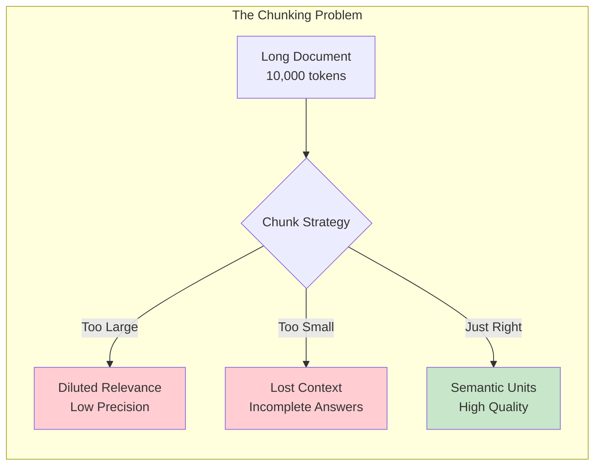
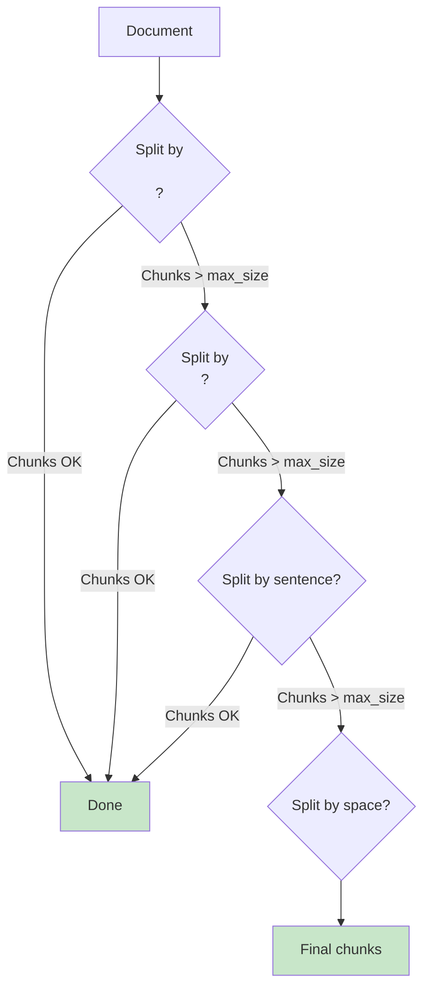
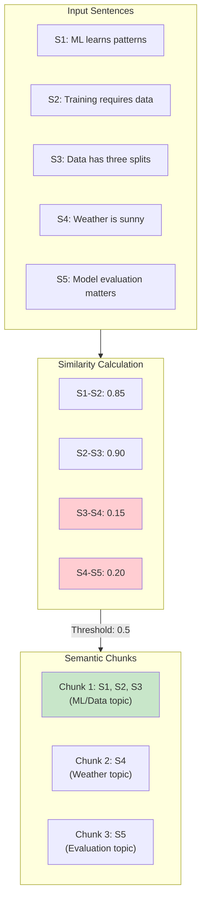
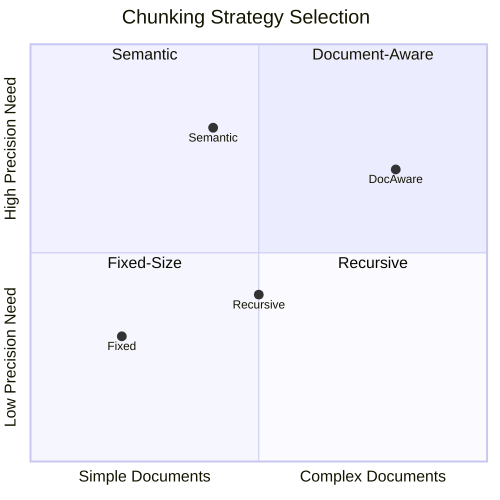

# Chunking Strategies

Chunking is the process of breaking documents into smaller pieces for embedding and retrieval. The right chunking strategy significantly impacts RAG system quality - too small and you lose context, too large and you dilute relevance. This module covers the major chunking approaches and when to use each.

## Learning Objectives

- **Understand why chunking matters** for RAG retrieval quality
- **Implement different chunking strategies** (fixed-size, recursive, semantic, document-aware)
- **Choose the right chunk size** based on embedding model and use case
- **Handle edge cases** like tables, code blocks, and multi-modal content
- **Optimize chunking** for your specific document types

## Why Chunking Matters



### Impact on Retrieval

```python
# Demonstration: chunk size affects retrieval
def demonstrate_chunk_impact():
    document = """
    Machine learning models learn patterns from data.
    They require training data, validation data, and test data.
    The training process involves optimizing a loss function.
    Gradient descent is commonly used for optimization.
    Learning rate is a critical hyperparameter.
    """

    query = "What is the role of gradient descent?"

    # Small chunks - loses context
    small_chunks = ["Machine learning models learn patterns from data.",
                    "They require training data, validation data, and test data.",
                    "The training process involves optimizing a loss function.",
                    "Gradient descent is commonly used for optimization.",
                    "Learning rate is a critical hyperparameter."]
    # Retrieved: "Gradient descent is commonly used for optimization."
    # Missing: WHY it's used (loss function context)

    # Large chunks - one chunk for everything
    large_chunks = [document]
    # Retrieved: entire document
    # Problem: includes irrelevant information about data types

    # Optimal chunks - semantic groupings
    optimal_chunks = [
        "Machine learning models learn patterns from data. They require training data, validation data, and test data.",
        "The training process involves optimizing a loss function. Gradient descent is commonly used for optimization. Learning rate is a critical hyperparameter."
    ]
    # Retrieved: Second chunk with full optimization context
```

## Fixed-Size Chunking

The simplest approach: split by character/token count with overlap.

```python
from typing import List
from dataclasses import dataclass

@dataclass
class Chunk:
    text: str
    metadata: dict
    start_index: int
    end_index: int

class FixedSizeChunker:
    """Fixed-size chunking with configurable overlap."""

    def __init__(
        self,
        chunk_size: int = 500,
        chunk_overlap: int = 50,
        length_function: callable = len  # or tiktoken for tokens
    ):
        self.chunk_size = chunk_size
        self.chunk_overlap = chunk_overlap
        self.length_function = length_function

    def split(self, text: str) -> List[Chunk]:
        """Split text into fixed-size chunks."""
        chunks = []
        start = 0

        while start < len(text):
            # Find end of chunk
            end = start + self.chunk_size

            # Don't cut in middle of word
            if end < len(text):
                # Find last space before chunk_size
                space_idx = text.rfind(' ', start, end)
                if space_idx > start:
                    end = space_idx

            chunk_text = text[start:end].strip()

            if chunk_text:
                chunks.append(Chunk(
                    text=chunk_text,
                    metadata={"chunk_method": "fixed_size"},
                    start_index=start,
                    end_index=end
                ))

            # Move start, accounting for overlap
            start = end - self.chunk_overlap

        return chunks


# Token-based chunking using tiktoken
import tiktoken

class TokenBasedChunker:
    """Chunk by token count for precise context window management."""

    def __init__(
        self,
        chunk_size: int = 256,
        chunk_overlap: int = 20,
        model: str = "gpt-4"
    ):
        self.chunk_size = chunk_size
        self.chunk_overlap = chunk_overlap
        self.encoder = tiktoken.encoding_for_model(model)

    def split(self, text: str) -> List[Chunk]:
        """Split text into token-based chunks."""
        tokens = self.encoder.encode(text)
        chunks = []
        start = 0

        while start < len(tokens):
            end = min(start + self.chunk_size, len(tokens))
            chunk_tokens = tokens[start:end]
            chunk_text = self.encoder.decode(chunk_tokens)

            chunks.append(Chunk(
                text=chunk_text,
                metadata={
                    "chunk_method": "token_based",
                    "token_count": len(chunk_tokens)
                },
                start_index=start,
                end_index=end
            ))

            start = end - self.chunk_overlap

        return chunks
```

::: info When to Use Fixed-Size
Fixed-size chunking works well for:
- Homogeneous documents (novels, articles)
- Quick prototyping
- When semantic boundaries aren't critical
- Consistent chunk sizes for batching
:::

## Recursive Character Chunking

Split hierarchically by different separators, preserving document structure.



```python
class RecursiveChunker:
    """
    LangChain-style recursive character text splitter.
    Tries to split on larger units first, then progressively smaller.
    """

    def __init__(
        self,
        chunk_size: int = 500,
        chunk_overlap: int = 50,
        separators: List[str] = None
    ):
        self.chunk_size = chunk_size
        self.chunk_overlap = chunk_overlap
        self.separators = separators or [
            "\n\n",  # Paragraphs
            "\n",    # Lines
            ". ",    # Sentences
            ", ",    # Clauses
            " ",     # Words
            ""       # Characters
        ]

    def split(self, text: str) -> List[Chunk]:
        """Recursively split text."""
        return self._split_text(text, self.separators)

    def _split_text(self, text: str, separators: List[str]) -> List[Chunk]:
        """Internal recursive splitting."""
        final_chunks = []
        separator = separators[-1]
        new_separators = []

        # Find appropriate separator
        for i, sep in enumerate(separators):
            if sep == "":
                separator = sep
                break
            if sep in text:
                separator = sep
                new_separators = separators[i + 1:]
                break

        # Split by found separator
        splits = text.split(separator) if separator else list(text)

        # Process splits
        good_splits = []
        for split in splits:
            if len(split) < self.chunk_size:
                good_splits.append(split)
            elif new_separators:
                # Recursively split large pieces
                if good_splits:
                    merged = self._merge_splits(good_splits, separator)
                    final_chunks.extend(merged)
                    good_splits = []
                other_chunks = self._split_text(split, new_separators)
                final_chunks.extend(other_chunks)
            else:
                # No more separators, just use what we have
                good_splits.append(split)

        if good_splits:
            merged = self._merge_splits(good_splits, separator)
            final_chunks.extend(merged)

        return final_chunks

    def _merge_splits(self, splits: List[str], separator: str) -> List[Chunk]:
        """Merge small splits back together."""
        chunks = []
        current_chunk = []
        current_length = 0

        for split in splits:
            split_len = len(split)
            if current_length + split_len > self.chunk_size:
                if current_chunk:
                    chunk_text = separator.join(current_chunk)
                    chunks.append(Chunk(
                        text=chunk_text,
                        metadata={"chunk_method": "recursive"},
                        start_index=0,  # Would need tracking for real index
                        end_index=len(chunk_text)
                    ))
                current_chunk = [split]
                current_length = split_len
            else:
                current_chunk.append(split)
                current_length += split_len + len(separator)

        if current_chunk:
            chunk_text = separator.join(current_chunk)
            chunks.append(Chunk(
                text=chunk_text,
                metadata={"chunk_method": "recursive"},
                start_index=0,
                end_index=len(chunk_text)
            ))

        return chunks


# Usage with custom separators for markdown
markdown_chunker = RecursiveChunker(
    chunk_size=1000,
    separators=[
        "\n## ",    # H2 headers
        "\n### ",   # H3 headers
        "\n\n",     # Paragraphs
        "\n",       # Lines
        ". ",       # Sentences
        " "         # Words
    ]
)
```

## Semantic Chunking

Split based on semantic similarity between sentences, not arbitrary boundaries.



```python
import numpy as np
from typing import List, Tuple
import re

class SemanticChunker:
    """
    Split based on semantic similarity between sentences.
    Inspired by Greg Kamradt's semantic chunking approach.
    """

    def __init__(
        self,
        embedding_model,
        breakpoint_threshold: float = 0.5,
        min_chunk_size: int = 100,
        max_chunk_size: int = 1000
    ):
        self.embedding_model = embedding_model
        self.breakpoint_threshold = breakpoint_threshold
        self.min_chunk_size = min_chunk_size
        self.max_chunk_size = max_chunk_size

    def split(self, text: str) -> List[Chunk]:
        """Split text at semantic boundaries."""
        # 1. Split into sentences
        sentences = self._split_sentences(text)

        if len(sentences) <= 1:
            return [Chunk(text=text, metadata={}, start_index=0, end_index=len(text))]

        # 2. Get embeddings for each sentence
        embeddings = self.embedding_model.embed([s for s in sentences])

        # 3. Calculate similarity between adjacent sentences
        similarities = self._calculate_similarities(embeddings)

        # 4. Find breakpoints (low similarity = semantic shift)
        breakpoints = self._find_breakpoints(similarities)

        # 5. Create chunks from breakpoints
        chunks = self._create_chunks(sentences, breakpoints)

        return chunks

    def _split_sentences(self, text: str) -> List[str]:
        """Split text into sentences."""
        # Simple sentence splitting (use nltk/spacy for production)
        sentences = re.split(r'(?<=[.!?])\s+', text)
        return [s.strip() for s in sentences if s.strip()]

    def _calculate_similarities(
        self,
        embeddings: List[np.ndarray]
    ) -> List[float]:
        """Calculate cosine similarity between adjacent sentences."""
        similarities = []
        for i in range(len(embeddings) - 1):
            sim = np.dot(embeddings[i], embeddings[i + 1]) / (
                np.linalg.norm(embeddings[i]) * np.linalg.norm(embeddings[i + 1])
            )
            similarities.append(sim)
        return similarities

    def _find_breakpoints(self, similarities: List[float]) -> List[int]:
        """Find indices where semantic shift occurs."""
        breakpoints = []

        # Method 1: Percentile-based threshold
        threshold = np.percentile(similarities, 25)  # Bottom 25%

        # Method 2: Gradient-based detection
        for i, sim in enumerate(similarities):
            if sim < max(threshold, self.breakpoint_threshold):
                breakpoints.append(i + 1)  # Break after this sentence

        return breakpoints

    def _create_chunks(
        self,
        sentences: List[str],
        breakpoints: List[int]
    ) -> List[Chunk]:
        """Create chunks from sentences and breakpoints."""
        chunks = []
        start = 0

        all_breaks = breakpoints + [len(sentences)]

        for end in all_breaks:
            chunk_sentences = sentences[start:end]
            chunk_text = " ".join(chunk_sentences)

            # Enforce min/max size
            if len(chunk_text) >= self.min_chunk_size or end == len(sentences):
                if len(chunk_text) > self.max_chunk_size:
                    # Split large chunks
                    sub_chunks = self._split_large_chunk(chunk_text)
                    chunks.extend(sub_chunks)
                else:
                    chunks.append(Chunk(
                        text=chunk_text,
                        metadata={"chunk_method": "semantic"},
                        start_index=0,
                        end_index=len(chunk_text)
                    ))
                start = end

        return chunks

    def _split_large_chunk(self, text: str) -> List[Chunk]:
        """Fall back to fixed-size for oversized chunks."""
        fixed_chunker = FixedSizeChunker(
            chunk_size=self.max_chunk_size,
            chunk_overlap=50
        )
        return fixed_chunker.split(text)
```

## Document-Aware Chunking

Preserve document structure like headers, sections, tables, and code blocks.

```mermaid
flowchart TB
    subgraph Document["Markdown Document"]
        H1["# Main Title"]
        P1["Intro paragraph..."]
        H2["## Section 1"]
        P2["Content..."]
        CODE["```python\ncode block\n```"]
        H3["## Section 2"]
        TABLE["| Col1 | Col2 |\n|---|---|"]
    end

    subgraph Chunks["Document-Aware Chunks"]
        C1["Main Title + Intro<br>(with header context)"]
        C2["Section 1 + Content<br>(preserves hierarchy)"]
        C3["Code Block<br>(kept intact)"]
        C4["Section 2 + Table<br>(table preserved)"]
    end

    Document --> Chunks

    style CODE fill:#fff3e0
    style TABLE fill:#e3f2fd
    style C3 fill:#fff3e0
    style C4 fill:#e3f2fd
```

```python
import re
from typing import List, Dict, Optional

class DocumentAwareChunker:
    """
    Chunk while preserving document structure.
    Handles Markdown, HTML, and code-aware splitting.
    """

    def __init__(
        self,
        chunk_size: int = 1000,
        chunk_overlap: int = 100,
        preserve_code_blocks: bool = True,
        preserve_tables: bool = True,
        add_header_context: bool = True
    ):
        self.chunk_size = chunk_size
        self.chunk_overlap = chunk_overlap
        self.preserve_code_blocks = preserve_code_blocks
        self.preserve_tables = preserve_tables
        self.add_header_context = add_header_context

    def split(self, text: str, doc_type: str = "markdown") -> List[Chunk]:
        """Split document while preserving structure."""
        if doc_type == "markdown":
            return self._split_markdown(text)
        elif doc_type == "html":
            return self._split_html(text)
        else:
            return self._split_generic(text)

    def _split_markdown(self, text: str) -> List[Chunk]:
        """Markdown-aware splitting."""
        chunks = []

        # Extract and protect special blocks
        protected_blocks = {}
        text, protected_blocks = self._protect_code_blocks(text, protected_blocks)
        text, protected_blocks = self._protect_tables(text, protected_blocks)

        # Split by headers while tracking hierarchy
        sections = self._split_by_headers(text)

        for section in sections:
            section_text = section["content"]
            header_context = section.get("header_path", "")

            # Restore protected blocks
            for placeholder, block in protected_blocks.items():
                if placeholder in section_text:
                    # Check if block should be its own chunk
                    if len(block) > self.chunk_size * 0.8:
                        # Large block - make separate chunk
                        before, after = section_text.split(placeholder, 1)
                        if before.strip():
                            chunks.extend(self._chunk_text(before, header_context))
                        chunks.append(Chunk(
                            text=block,
                            metadata={
                                "chunk_method": "document_aware",
                                "type": "code_block" if "```" in block else "table",
                                "header_context": header_context
                            },
                            start_index=0,
                            end_index=len(block)
                        ))
                        section_text = after
                    else:
                        section_text = section_text.replace(placeholder, block)

            if section_text.strip():
                chunks.extend(self._chunk_text(section_text, header_context))

        return chunks

    def _protect_code_blocks(
        self,
        text: str,
        protected: Dict
    ) -> Tuple[str, Dict]:
        """Extract code blocks to protect them from splitting."""
        if not self.preserve_code_blocks:
            return text, protected

        pattern = r'```[\s\S]*?```'
        matches = re.finditer(pattern, text)

        for i, match in enumerate(matches):
            placeholder = f"__CODE_BLOCK_{i}__"
            protected[placeholder] = match.group()
            text = text.replace(match.group(), placeholder, 1)

        return text, protected

    def _protect_tables(
        self,
        text: str,
        protected: Dict
    ) -> Tuple[str, Dict]:
        """Extract tables to protect them from splitting."""
        if not self.preserve_tables:
            return text, protected

        # Simple markdown table pattern
        pattern = r'\|[^\n]+\|\n\|[-:\s|]+\|\n(?:\|[^\n]+\|\n?)+'
        matches = re.finditer(pattern, text)

        for i, match in enumerate(matches):
            placeholder = f"__TABLE_{i}__"
            protected[placeholder] = match.group()
            text = text.replace(match.group(), placeholder, 1)

        return text, protected

    def _split_by_headers(self, text: str) -> List[Dict]:
        """Split markdown by headers while tracking hierarchy."""
        sections = []
        pattern = r'^(#{1,6})\s+(.+)$'
        lines = text.split('\n')

        current_section = {"content": "", "header_path": ""}
        header_stack = []

        for line in lines:
            header_match = re.match(pattern, line)

            if header_match:
                # Save current section
                if current_section["content"].strip():
                    sections.append(current_section)

                # Update header stack
                level = len(header_match.group(1))
                header_text = header_match.group(2)

                # Pop headers of same or lower level
                while header_stack and header_stack[-1][0] >= level:
                    header_stack.pop()

                header_stack.append((level, header_text))

                # Create new section
                header_path = " > ".join([h[1] for h in header_stack])
                current_section = {
                    "content": line + "\n",
                    "header_path": header_path
                }
            else:
                current_section["content"] += line + "\n"

        if current_section["content"].strip():
            sections.append(current_section)

        return sections

    def _chunk_text(self, text: str, header_context: str) -> List[Chunk]:
        """Chunk text section with optional header context."""
        chunks = []

        if len(text) <= self.chunk_size:
            chunks.append(Chunk(
                text=text,
                metadata={
                    "chunk_method": "document_aware",
                    "header_context": header_context
                },
                start_index=0,
                end_index=len(text)
            ))
        else:
            # Fall back to recursive chunking
            recursive = RecursiveChunker(
                chunk_size=self.chunk_size,
                chunk_overlap=self.chunk_overlap
            )
            sub_chunks = recursive.split(text)
            for chunk in sub_chunks:
                chunk.metadata["header_context"] = header_context
            chunks.extend(sub_chunks)

        return chunks
```

::: warning Common Pitfall
Don't split in the middle of:
- Code blocks (breaks syntax)
- Tables (loses structure)
- Mathematical equations
- Numbered lists (loses ordering context)
- Quotes and citations
:::

## Chunk Size Optimization

```python
class ChunkSizeOptimizer:
    """Tools for finding optimal chunk size."""

    @staticmethod
    def recommend_chunk_size(
        embedding_model: str,
        avg_document_length: int,
        use_case: str
    ) -> Dict:
        """Recommend chunk size based on parameters."""

        # Model-specific max context
        model_contexts = {
            "text-embedding-3-small": 8191,
            "text-embedding-ada-002": 8191,
            "bge-large": 512,
            "e5-large": 512,
            "all-MiniLM-L6": 256
        }

        max_context = model_contexts.get(embedding_model, 512)

        # Use-case recommendations
        use_case_sizes = {
            "qa": (256, 512),      # Precise answers
            "summarization": (512, 1024),  # Broader context
            "code": (1000, 2000),  # Preserve functions
            "legal": (500, 1000),  # Clause-level
            "chat": (200, 400)     # Conversational
        }

        min_size, max_size = use_case_sizes.get(use_case, (256, 512))

        recommended = min(max_size, max_context - 100)  # Buffer for safety

        return {
            "recommended_size": recommended,
            "min_size": min_size,
            "max_size": min(max_size, max_context),
            "overlap": int(recommended * 0.1),  # 10% overlap
            "reasoning": f"Based on {embedding_model} context ({max_context}) "
                        f"and {use_case} use case"
        }

    @staticmethod
    def evaluate_chunk_sizes(
        documents: List[str],
        embedder,
        retriever,
        test_queries: List[Dict],
        chunk_sizes: List[int] = [128, 256, 512, 1024]
    ) -> Dict:
        """Empirically evaluate different chunk sizes."""
        results = {}

        for size in chunk_sizes:
            chunker = FixedSizeChunker(chunk_size=size)

            # Chunk all documents
            all_chunks = []
            for doc in documents:
                chunks = chunker.split(doc)
                all_chunks.extend(chunks)

            # Index chunks
            embeddings = embedder.embed([c.text for c in all_chunks])
            retriever.index(embeddings, all_chunks)

            # Evaluate on test queries
            recall_at_5 = []
            mrr = []

            for test in test_queries:
                query = test["query"]
                relevant_ids = test["relevant_chunk_ids"]

                retrieved = retriever.search(query, top_k=5)
                retrieved_ids = [r["id"] for r in retrieved]

                # Calculate metrics
                recall = len(set(retrieved_ids) & set(relevant_ids)) / len(relevant_ids)
                recall_at_5.append(recall)

                for i, rid in enumerate(retrieved_ids):
                    if rid in relevant_ids:
                        mrr.append(1 / (i + 1))
                        break
                else:
                    mrr.append(0)

            results[size] = {
                "avg_recall@5": np.mean(recall_at_5),
                "mrr": np.mean(mrr),
                "num_chunks": len(all_chunks),
                "avg_chunk_length": np.mean([len(c.text) for c in all_chunks])
            }

        return results
```

## Comparison of Strategies



| Strategy | Pros | Cons | Best For |
|----------|------|------|----------|
| **Fixed-Size** | Simple, fast, predictable | Cuts mid-sentence/thought | Homogeneous text |
| **Recursive** | Respects some structure | Still arbitrary boundaries | General purpose |
| **Semantic** | Preserves meaning units | Computationally expensive | High-precision RAG |
| **Document-Aware** | Preserves structure | Complex implementation | Technical docs, code |

## Interview Q&A

### Q1: How do you determine the optimal chunk size for a RAG system?

**Strong Answer:**

Optimal chunk size depends on several factors:

**1. Embedding Model Constraints:**
- Most models have 512 token limit
- OpenAI models support up to 8K tokens
- Leave buffer: use 80-90% of max context

**2. Use Case Requirements:**
```python
chunk_size_guidelines = {
    "factual_qa": (256, 512),      # Precise, focused answers
    "summarization": (512, 1024),   # Broader context needed
    "code_search": (500, 2000),     # Preserve function boundaries
    "conversational": (200, 400),   # Quick, relevant snippets
}
```

**3. Empirical Testing:**
- Create evaluation dataset with queries and relevant passages
- Test chunk sizes: [128, 256, 512, 1024]
- Measure Recall@k and MRR
- Choose size that maximizes recall while maintaining precision

**4. Document Characteristics:**
- Short documents: smaller chunks (256)
- Long-form content: larger chunks (512-1024)
- Technical docs: document-aware chunking

**My approach:** Start with 512 tokens, 10% overlap, then tune based on retrieval metrics on a validation set.

---

### Q2: Explain the tradeoffs between semantic chunking and recursive chunking.

**Strong Answer:**

| Aspect | Semantic Chunking | Recursive Chunking |
|--------|-------------------|-------------------|
| **Mechanism** | Embeds sentences, splits at low similarity | Hierarchical split by separators |
| **Computation** | O(n) embeddings needed | O(n) string operations |
| **Cost** | Higher (embedding API calls) | Lower (no ML) |
| **Quality** | Better semantic coherence | May split mid-topic |
| **Latency** | Slower (embedding overhead) | Faster |
| **Chunk Sizes** | Variable (semantic units) | More uniform |

**When to use Semantic:**
- High-precision RAG where quality justifies cost
- Documents with unclear structural markers
- When chunks must be self-contained

**When to use Recursive:**
- Cost-sensitive applications
- Documents with clear structure (headers, sections)
- High-throughput indexing needs

**Hybrid approach:** Use recursive chunking as primary, then merge/split based on semantic similarity post-hoc.

---

### Q3: How do you handle documents that contain both text and code?

**Strong Answer:**

Mixed text/code documents need special handling:

**1. Detect and Protect Code Blocks:**
```python
def handle_mixed_content(text: str) -> List[Chunk]:
    # Extract code blocks
    code_pattern = r'```(\w+)?\n([\s\S]*?)```'
    code_blocks = re.findall(code_pattern, text)

    # Replace with placeholders
    for i, (lang, code) in enumerate(code_blocks):
        text = text.replace(f"```{lang}\n{code}```", f"[CODE_BLOCK_{i}]")

    # Chunk text normally
    text_chunks = chunker.split(text)

    # Handle code blocks separately
    code_chunks = []
    for lang, code in code_blocks:
        if len(code) > max_chunk_size:
            # Split code by functions/classes
            code_chunks.extend(split_code_semantically(code, lang))
        else:
            code_chunks.append(create_chunk(code, type="code", lang=lang))

    return merge_and_order(text_chunks, code_chunks)
```

**2. Add Context to Code Chunks:**
```python
# Include surrounding text for context
code_chunk.metadata["context"] = preceding_paragraph
code_chunk.metadata["language"] = detected_language
```

**3. Language-Specific Splitting:**
- Python: Split by function/class definitions
- JavaScript: Split by function/component
- SQL: Split by complete queries

**4. Embedding Strategy:**
- Use code-optimized embeddings (CodeBERT, StarCoder)
- Or include language tag in text embeddings

---

### Q4: What's your approach to chunking very long documents (100+ pages)?

**Strong Answer:**

For very long documents, I use a hierarchical approach:

**1. Document-Level Summary:**
```python
# Create document-level embedding for coarse retrieval
doc_summary = summarize(full_document)
doc_embedding = embed(doc_summary)
```

**2. Section-Level Chunks:**
```python
# Split by major sections (chapters, H1 headers)
sections = split_by_major_headers(document)
for section in sections:
    section_summary = summarize(section)
    section_embedding = embed(section_summary)
```

**3. Passage-Level Chunks:**
```python
# Fine-grained chunks within sections
for section in sections:
    passages = semantic_chunk(section, max_size=500)
    for passage in passages:
        passage.metadata["section"] = section.title
        passage.metadata["doc"] = document.title
```

**4. Multi-Level Retrieval:**
```python
def hierarchical_retrieve(query):
    # Step 1: Find relevant documents
    relevant_docs = search_doc_level(query, top_k=3)

    # Step 2: Find relevant sections
    relevant_sections = search_section_level(
        query, doc_filter=relevant_docs, top_k=5
    )

    # Step 3: Find relevant passages
    relevant_passages = search_passage_level(
        query, section_filter=relevant_sections, top_k=10
    )

    return relevant_passages
```

**5. Metadata Enrichment:**
- Page numbers for citation
- Section hierarchy for context
- Document title and date

## Summary Table

| Aspect | Key Points |
|--------|------------|
| **Fixed-Size** | Simple, fast, good for homogeneous content |
| **Recursive** | Hierarchical splitting, respects some structure |
| **Semantic** | Best quality, splits at meaning boundaries |
| **Document-Aware** | Preserves tables, code, headers |
| **Chunk Size** | 256-512 tokens typical, tune empirically |
| **Overlap** | 10-20% overlap prevents information loss at boundaries |
| **Metadata** | Track source, position, headers for context |

## Sources

- [LangChain Text Splitters](https://python.langchain.com/docs/modules/data_connection/document_transformers/)
- [LlamaIndex Node Parsers](https://docs.llamaindex.ai/en/stable/module_guides/loading/node_parsers/)
- [Greg Kamradt's Semantic Chunking](https://www.youtube.com/watch?v=8OJC21T2SL4)
- [Chunking Strategies for LLM Applications](https://www.pinecone.io/learn/chunking-strategies/)
- [Unstructured.io Documentation](https://unstructured-io.github.io/unstructured/)
