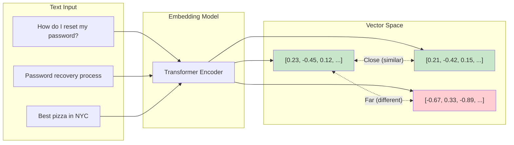
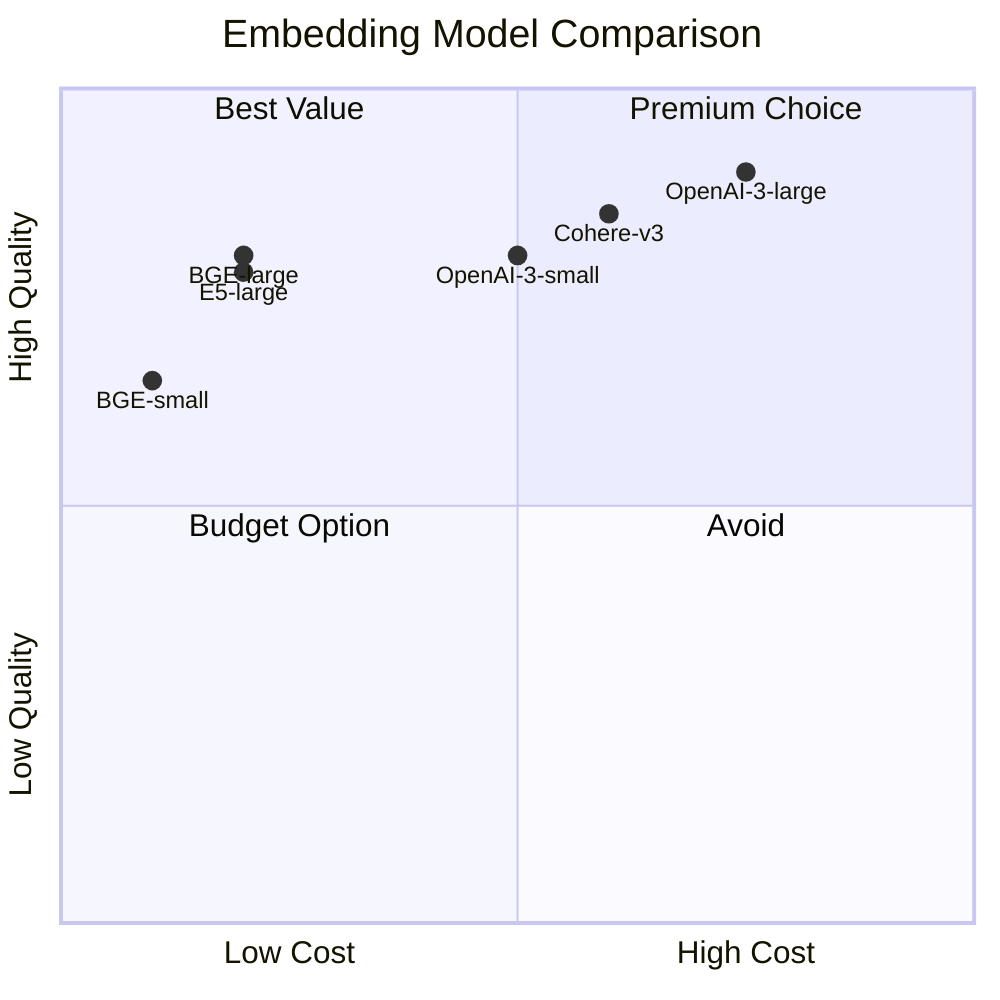
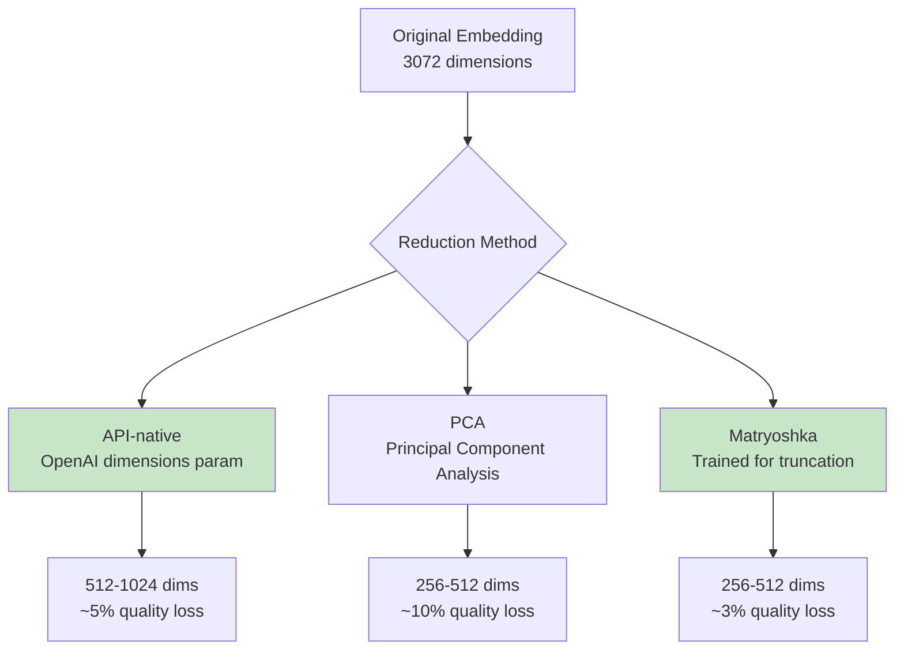

# Embedding Models

Embedding models are the foundation of semantic search in RAG systems. They transform text into dense vector representations that capture semantic meaning, enabling similarity-based retrieval. This module covers major embedding providers, model selection criteria, and implementation best practices.

## Learning Objectives

- **Understand how text embeddings work** and their role in RAG systems
- **Compare major embedding providers** (OpenAI, Cohere, BGE, E5) and their tradeoffs
- **Select appropriate embedding dimensions** based on performance and cost requirements
- **Implement efficient embedding pipelines** with batching and caching
- **Choose the right similarity metric** for your use case

## How Embeddings Work

Text embeddings project text into a high-dimensional vector space where semantically similar texts are close together.



### Core Concepts

```python
import numpy as np
from typing import List

class EmbeddingConcepts:
    """Fundamental embedding concepts for interviews."""

    @staticmethod
    def cosine_similarity(v1: np.ndarray, v2: np.ndarray) -> float:
        """
        Most common similarity metric for embeddings.
        Range: [-1, 1], where 1 = identical direction
        """
        return np.dot(v1, v2) / (np.linalg.norm(v1) * np.linalg.norm(v2))

    @staticmethod
    def euclidean_distance(v1: np.ndarray, v2: np.ndarray) -> float:
        """
        L2 distance - sensitive to magnitude.
        Range: [0, inf), where 0 = identical
        """
        return np.linalg.norm(v1 - v2)

    @staticmethod
    def dot_product(v1: np.ndarray, v2: np.ndarray) -> float:
        """
        Inner product - combines similarity and magnitude.
        Useful when magnitude carries meaning (e.g., importance).
        """
        return np.dot(v1, v2)

    @staticmethod
    def normalize_embedding(v: np.ndarray) -> np.ndarray:
        """
        Normalize to unit length.
        After normalization: cosine_similarity == dot_product
        """
        return v / np.linalg.norm(v)
```

## Major Embedding Providers

### OpenAI Embeddings

```python
from openai import OpenAI

class OpenAIEmbedder:
    """OpenAI embedding implementation."""

    def __init__(self, model: str = "text-embedding-3-small"):
        self.client = OpenAI()
        self.model = model
        # Model specifications
        self.specs = {
            "text-embedding-3-small": {"dims": 1536, "max_tokens": 8191},
            "text-embedding-3-large": {"dims": 3072, "max_tokens": 8191},
            "text-embedding-ada-002": {"dims": 1536, "max_tokens": 8191}
        }

    def embed(self, texts: List[str], dimensions: int = None) -> List[np.ndarray]:
        """
        Generate embeddings with optional dimension reduction.

        text-embedding-3-* models support native dimension reduction
        via the 'dimensions' parameter (e.g., 256, 512, 1024).
        """
        kwargs = {"model": self.model, "input": texts}
        if dimensions and "text-embedding-3" in self.model:
            kwargs["dimensions"] = dimensions

        response = self.client.embeddings.create(**kwargs)
        return [np.array(e.embedding) for e in response.data]

    def embed_with_prefix(
        self,
        texts: List[str],
        is_query: bool = False
    ) -> List[np.ndarray]:
        """
        OpenAI models don't require prefixes, but this shows
        the pattern used by other models.
        """
        return self.embed(texts)


# Usage example
embedder = OpenAIEmbedder("text-embedding-3-small")

# Embed documents (offline, during indexing)
docs = ["RAG improves LLM accuracy", "Vector databases store embeddings"]
doc_embeddings = embedder.embed(docs)

# Embed query (online, during retrieval)
query = "How does RAG work?"
query_embedding = embedder.embed([query])[0]
```

### Cohere Embeddings

```python
import cohere

class CohereEmbedder:
    """Cohere embedding with input type specification."""

    def __init__(self, model: str = "embed-english-v3.0"):
        self.client = cohere.Client()
        self.model = model
        self.specs = {
            "embed-english-v3.0": {"dims": 1024, "max_tokens": 512},
            "embed-multilingual-v3.0": {"dims": 1024, "max_tokens": 512},
            "embed-english-light-v3.0": {"dims": 384, "max_tokens": 512}
        }

    def embed(
        self,
        texts: List[str],
        input_type: str = "search_document"
    ) -> List[np.ndarray]:
        """
        Cohere requires specifying input_type:
        - "search_document": For documents being indexed
        - "search_query": For search queries
        - "classification": For classification tasks
        - "clustering": For clustering tasks
        """
        response = self.client.embed(
            texts=texts,
            model=self.model,
            input_type=input_type
        )
        return [np.array(e) for e in response.embeddings]

    def embed_documents(self, texts: List[str]) -> List[np.ndarray]:
        return self.embed(texts, input_type="search_document")

    def embed_query(self, query: str) -> np.ndarray:
        return self.embed([query], input_type="search_query")[0]
```

::: info Cohere's Input Types
Cohere's input_type parameter is important! Using "search_query" for documents or vice versa will degrade retrieval quality. The model is trained to handle asymmetric search where queries are short and documents are longer.
:::

### BGE (BAAI General Embedding)

```python
from sentence_transformers import SentenceTransformer

class BGEEmbedder:
    """BGE embedding with query instruction prefix."""

    def __init__(self, model: str = "BAAI/bge-large-en-v1.5"):
        self.model = SentenceTransformer(model)
        self.query_instruction = "Represent this sentence for searching relevant passages: "
        self.specs = {
            "BAAI/bge-small-en-v1.5": {"dims": 384, "max_tokens": 512},
            "BAAI/bge-base-en-v1.5": {"dims": 768, "max_tokens": 512},
            "BAAI/bge-large-en-v1.5": {"dims": 1024, "max_tokens": 512}
        }

    def embed_documents(self, texts: List[str]) -> List[np.ndarray]:
        """Embed documents without prefix."""
        embeddings = self.model.encode(
            texts,
            normalize_embeddings=True,
            show_progress_bar=True
        )
        return [np.array(e) for e in embeddings]

    def embed_query(self, query: str) -> np.ndarray:
        """Embed query with instruction prefix."""
        prefixed_query = self.query_instruction + query
        embedding = self.model.encode(
            [prefixed_query],
            normalize_embeddings=True
        )
        return np.array(embedding[0])
```

### E5 (EmbEddings from bidirEctional Encoder rEpresentations)

```python
from sentence_transformers import SentenceTransformer

class E5Embedder:
    """E5 embedding with required prefixes."""

    def __init__(self, model: str = "intfloat/e5-large-v2"):
        self.model = SentenceTransformer(model)
        self.specs = {
            "intfloat/e5-small-v2": {"dims": 384, "max_tokens": 512},
            "intfloat/e5-base-v2": {"dims": 768, "max_tokens": 512},
            "intfloat/e5-large-v2": {"dims": 1024, "max_tokens": 512}
        }

    def embed_documents(self, texts: List[str]) -> List[np.ndarray]:
        """E5 requires 'passage: ' prefix for documents."""
        prefixed = [f"passage: {text}" for text in texts]
        embeddings = self.model.encode(
            prefixed,
            normalize_embeddings=True
        )
        return [np.array(e) for e in embeddings]

    def embed_query(self, query: str) -> np.ndarray:
        """E5 requires 'query: ' prefix for queries."""
        prefixed = f"query: {query}"
        embedding = self.model.encode(
            [prefixed],
            normalize_embeddings=True
        )
        return np.array(embedding[0])
```

::: warning Critical: Prefix Requirements
BGE and E5 models require specific prefixes to work correctly:
- **BGE**: Query prefix only ("Represent this sentence...")
- **E5**: Both prefixes required ("query: " and "passage: ")

Forgetting prefixes can reduce retrieval quality by 10-20%!
:::

## Model Comparison



### Detailed Comparison Table

| Model | Dimensions | Max Tokens | Latency | Cost | MTEB Score | Best For |
|-------|-----------|------------|---------|------|------------|----------|
| **OpenAI text-embedding-3-large** | 3072 (flexible) | 8191 | ~50ms | $0.13/1M tokens | 64.6 | Highest quality needs |
| **OpenAI text-embedding-3-small** | 1536 (flexible) | 8191 | ~30ms | $0.02/1M tokens | 62.3 | General purpose |
| **Cohere embed-v3** | 1024 | 512 | ~40ms | $0.10/1M tokens | 64.5 | Multilingual, reranking |
| **BGE-large-en-v1.5** | 1024 | 512 | ~20ms* | Free (self-hosted) | 63.6 | Self-hosted, cost-sensitive |
| **E5-large-v2** | 1024 | 512 | ~20ms* | Free (self-hosted) | 62.4 | Self-hosted, proven quality |
| **all-MiniLM-L6-v2** | 384 | 256 | ~5ms* | Free (self-hosted) | 56.3 | Prototyping, low latency |

*Self-hosted latency depends on hardware (GPU vs CPU)

## Similarity Metrics Deep Dive

```python
import numpy as np

def similarity_metrics_comparison():
    """Demonstrate when to use each similarity metric."""

    # Example embeddings
    query = np.array([0.8, 0.6, 0.0])
    doc1 = np.array([0.75, 0.65, 0.05])  # Similar direction
    doc2 = np.array([1.6, 1.2, 0.0])      # Same direction, 2x magnitude
    doc3 = np.array([-0.6, -0.8, 0.0])    # Opposite direction

    print("Cosine Similarity (direction only):")
    print(f"  query vs doc1: {cosine_sim(query, doc1):.3f}")  # ~0.998
    print(f"  query vs doc2: {cosine_sim(query, doc2):.3f}")  # 1.000
    print(f"  query vs doc3: {cosine_sim(query, doc3):.3f}")  # -0.960

    print("\nDot Product (direction + magnitude):")
    print(f"  query vs doc1: {np.dot(query, doc1):.3f}")      # ~0.99
    print(f"  query vs doc2: {np.dot(query, doc2):.3f}")      # 2.00
    print(f"  query vs doc3: {np.dot(query, doc3):.3f}")      # -0.96

    print("\nEuclidean Distance (position):")
    print(f"  query vs doc1: {np.linalg.norm(query - doc1):.3f}")  # ~0.12
    print(f"  query vs doc2: {np.linalg.norm(query - doc2):.3f}")  # 1.00
    print(f"  query vs doc3: {np.linalg.norm(query - doc3):.3f}")  # 2.00

def cosine_sim(a, b):
    return np.dot(a, b) / (np.linalg.norm(a) * np.linalg.norm(b))
```

### When to Use Each Metric

| Metric | Use When | Vector DB Support |
|--------|----------|-------------------|
| **Cosine Similarity** | Normalized embeddings, text similarity | All |
| **Dot Product** | OpenAI embeddings (pre-normalized), magnitude matters | All |
| **Euclidean (L2)** | Non-normalized vectors, clustering | All |
| **Inner Product** | Same as dot product | Pinecone, Milvus |

::: info Normalization Tip
OpenAI embeddings are normalized by default. For normalized vectors:
`cosine_similarity = dot_product`

This means you can use the faster dot product operation and get cosine similarity results!
:::

## Efficient Embedding Implementation

```python
from typing import List, Optional
import numpy as np
from functools import lru_cache
import hashlib
import asyncio
from concurrent.futures import ThreadPoolExecutor

class EfficientEmbedder:
    """Production-ready embedding with batching and caching."""

    def __init__(
        self,
        model_name: str,
        batch_size: int = 100,
        cache_size: int = 10000
    ):
        self.model_name = model_name
        self.batch_size = batch_size
        self._cache = {}
        self._cache_size = cache_size

    def _get_cache_key(self, text: str) -> str:
        """Create deterministic cache key."""
        return hashlib.md5(text.encode()).hexdigest()

    def embed_with_cache(self, texts: List[str]) -> List[np.ndarray]:
        """Embed texts with caching for repeated content."""
        results = [None] * len(texts)
        texts_to_embed = []
        indices_to_embed = []

        # Check cache first
        for i, text in enumerate(texts):
            cache_key = self._get_cache_key(text)
            if cache_key in self._cache:
                results[i] = self._cache[cache_key]
            else:
                texts_to_embed.append(text)
                indices_to_embed.append(i)

        # Embed uncached texts in batches
        if texts_to_embed:
            new_embeddings = self._batch_embed(texts_to_embed)
            for idx, text, emb in zip(
                indices_to_embed,
                texts_to_embed,
                new_embeddings
            ):
                results[idx] = emb
                # Update cache
                cache_key = self._get_cache_key(text)
                if len(self._cache) < self._cache_size:
                    self._cache[cache_key] = emb

        return results

    def _batch_embed(self, texts: List[str]) -> List[np.ndarray]:
        """Process texts in batches to avoid API limits."""
        all_embeddings = []

        for i in range(0, len(texts), self.batch_size):
            batch = texts[i:i + self.batch_size]
            embeddings = self._embed_batch(batch)
            all_embeddings.extend(embeddings)

        return all_embeddings

    def _embed_batch(self, batch: List[str]) -> List[np.ndarray]:
        """Override this method for specific provider."""
        raise NotImplementedError


class OpenAIEfficientEmbedder(EfficientEmbedder):
    """OpenAI-specific efficient embedder."""

    def __init__(self, dimensions: Optional[int] = None, **kwargs):
        super().__init__("text-embedding-3-small", **kwargs)
        self.dimensions = dimensions
        from openai import OpenAI
        self.client = OpenAI()

    def _embed_batch(self, batch: List[str]) -> List[np.ndarray]:
        kwargs = {"model": self.model_name, "input": batch}
        if self.dimensions:
            kwargs["dimensions"] = self.dimensions

        response = self.client.embeddings.create(**kwargs)
        return [np.array(e.embedding) for e in response.data]


# Usage
embedder = OpenAIEfficientEmbedder(
    dimensions=512,  # Reduced dimensions for cost/speed
    batch_size=100,
    cache_size=10000
)

# First call - computes embeddings
docs = ["doc1", "doc2", "doc3"] * 100
embeddings = embedder.embed_with_cache(docs)  # Only 3 unique embeddings computed

# Second call with same texts - uses cache
embeddings = embedder.embed_with_cache(docs)  # Instant, from cache
```

## Dimension Reduction Strategies



```python
from sklearn.decomposition import PCA
import numpy as np

class DimensionReducer:
    """Reduce embedding dimensions for storage/speed optimization."""

    def __init__(self, target_dims: int):
        self.target_dims = target_dims
        self.pca = None

    def fit_pca(self, embeddings: np.ndarray) -> None:
        """Fit PCA on training embeddings."""
        self.pca = PCA(n_components=self.target_dims)
        self.pca.fit(embeddings)
        print(f"Variance retained: {sum(self.pca.explained_variance_ratio_):.2%}")

    def reduce_pca(self, embeddings: np.ndarray) -> np.ndarray:
        """Apply PCA reduction."""
        if self.pca is None:
            raise ValueError("Must call fit_pca first")
        return self.pca.transform(embeddings)

    @staticmethod
    def truncate_matryoshka(
        embeddings: np.ndarray,
        target_dims: int
    ) -> np.ndarray:
        """
        Truncate Matryoshka embeddings.
        Only works with models trained for this (e.g., nomic-embed).
        """
        return embeddings[:, :target_dims]

    @staticmethod
    def normalize_after_reduction(embeddings: np.ndarray) -> np.ndarray:
        """Re-normalize after dimension reduction."""
        norms = np.linalg.norm(embeddings, axis=1, keepdims=True)
        return embeddings / norms
```

## Interview Q&A

### Q1: How do embedding models convert text to vectors, and why does this enable semantic search?

**Strong Answer:**

Embedding models use transformer architectures to convert text into fixed-dimensional vectors. Here's the process:

1. **Tokenization**: Text is split into subword tokens
2. **Token Embeddings**: Each token gets a learned vector representation
3. **Transformer Layers**: Self-attention captures relationships between tokens
4. **Pooling**: Token representations are combined (usually mean pooling or [CLS] token)
5. **Projection**: Final linear layer projects to embedding dimension

**Why this enables semantic search:**

The model is trained with contrastive learning objectives:
- Similar text pairs are pushed closer in vector space
- Dissimilar pairs are pushed apart

After training, the embedding space has the property that semantically similar texts have high cosine similarity. This allows us to find relevant documents by computing similarity between query and document embeddings.

```python
# Example: semantic similarity emerges from training
query = embed("How to fix a flat tire")
doc1 = embed("Steps to repair a punctured tire")  # High similarity
doc2 = embed("Best pizza recipes")                 # Low similarity

cosine_sim(query, doc1)  # ~0.85
cosine_sim(query, doc2)  # ~0.15
```

---

### Q2: When would you choose a self-hosted embedding model over an API-based one?

**Strong Answer:**

**Choose Self-Hosted (BGE, E5) when:**

1. **Cost at Scale**: Processing millions of documents, API costs become significant
   - OpenAI: $0.02/1M tokens
   - Self-hosted: ~$0.001/1M tokens (amortized GPU cost)

2. **Data Privacy**: Sensitive data that can't leave your infrastructure
   - Healthcare, legal, financial documents
   - Regulatory compliance requirements

3. **Latency Requirements**: Need consistent <10ms embedding latency
   - Self-hosted on GPU: ~5-10ms
   - API call: ~30-100ms (network + processing)

4. **Offline/Air-gapped**: Systems without internet access

**Choose API-based (OpenAI, Cohere) when:**

1. **Simplicity**: No ML infrastructure to maintain
2. **Quality**: Slightly higher benchmark scores
3. **Scale variability**: Unpredictable load patterns
4. **Rapid iteration**: Testing different approaches quickly

**My typical recommendation**: Start with API-based for prototyping, migrate to self-hosted for production at scale if cost or privacy requires it.

---

### Q3: Explain the difference between symmetric and asymmetric embeddings. When does it matter?

**Strong Answer:**

**Symmetric embeddings** treat query and document equally - both are embedded the same way. Good for:
- Semantic similarity between sentences
- Duplicate detection
- Clustering

**Asymmetric embeddings** use different strategies for queries vs documents. This matters because:
- Queries are typically short (5-15 words)
- Documents are longer (50-500+ words)
- The model learns to match short queries to relevant longer passages

**Implementation difference:**

```python
# Symmetric (e.g., basic sentence-transformers)
query_emb = model.encode("password reset")
doc_emb = model.encode("How to reset your password...")
# Same encoding for both

# Asymmetric (e.g., Cohere, E5)
query_emb = model.encode("query: password reset")
doc_emb = model.encode("passage: How to reset your password...")
# Different prefixes trigger different encoding strategies
```

**When it matters:**
- Search/retrieval: Asymmetric is typically 5-10% better
- Similarity comparison: Symmetric is appropriate
- Most RAG use cases benefit from asymmetric models

---

### Q4: How would you handle embedding documents that exceed the model's context limit?

**Strong Answer:**

Most embedding models have 512 token limits. Here's my approach for longer documents:

**1. Chunking Strategy (Primary)**
```python
def chunk_and_embed(document: str, max_tokens: int = 450) -> List[np.ndarray]:
    """Chunk document and embed each chunk."""
    chunks = recursive_chunk(document, max_tokens=max_tokens)
    return [embed(chunk) for chunk in chunks]
```

**2. Late Chunking (Advanced)**
Process full document through transformer, then pool different spans:
```python
# Get token-level embeddings for full document
token_embeddings = model.encode_tokens(document)  # shape: (n_tokens, dim)
# Pool specific spans
chunk_embeddings = [
    mean_pool(token_embeddings[start:end])
    for start, end in chunk_boundaries
]
```

**3. Hierarchical Embedding**
```python
# Create document summary + chunks
summary = llm.summarize(document)
summary_emb = embed(summary)  # Document-level
chunk_embs = [embed(c) for c in chunks]  # Chunk-level
# Store both for multi-level retrieval
```

**4. Long-Context Models**
Use models designed for long documents:
- `jina-embeddings-v2`: 8192 tokens
- `nomic-embed-text-v1.5`: 8192 tokens
- `voyage-large-2`: 16000 tokens

My recommendation: Start with chunking (most robust), use long-context models for documents where splitting loses meaning (e.g., legal contracts).

## Summary Table

| Aspect | Key Points |
|--------|------------|
| **Embedding Fundamentals** | Text to vector, semantic similarity in vector space |
| **OpenAI** | Highest quality, flexible dimensions, best for general use |
| **Cohere** | Strong multilingual, requires input_type specification |
| **BGE** | Best open-source, needs query prefix |
| **E5** | Proven quality, needs both query and passage prefixes |
| **Similarity Metrics** | Cosine (direction), Dot Product (fast for normalized), L2 (position) |
| **Optimization** | Batching, caching, dimension reduction |
| **Context Limits** | Most models: 512 tokens, use chunking for longer docs |

## Sources

- [MTEB: Massive Text Embedding Benchmark](https://huggingface.co/spaces/mteb/leaderboard)
- [OpenAI Embedding Documentation](https://platform.openai.com/docs/guides/embeddings)
- [Cohere Embed Documentation](https://docs.cohere.com/docs/embeddings)
- [BGE Paper](https://arxiv.org/abs/2309.07597) - C-Pack: Packaged Resources for General Chinese Embeddings
- [E5 Paper](https://arxiv.org/abs/2212.03533) - Text Embeddings by Weakly-Supervised Contrastive Pre-training
- [Sentence-Transformers Documentation](https://www.sbert.net/)
