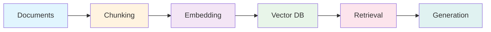
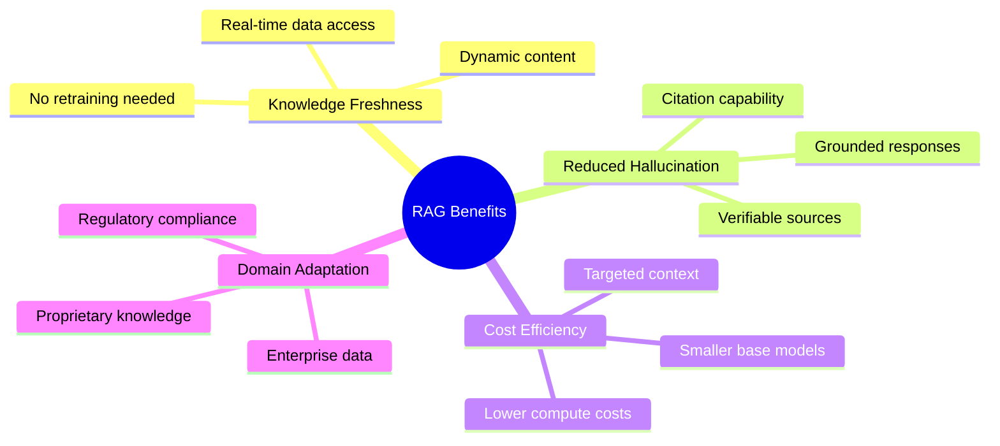
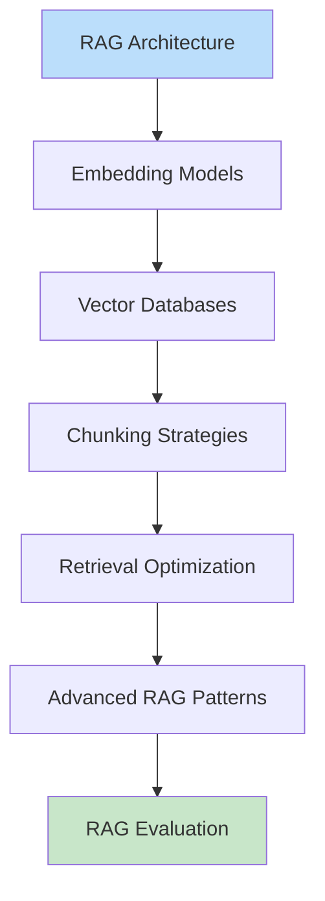

# RAG Systems

Retrieval-Augmented Generation (RAG) is one of the most important architectural patterns in modern AI systems. This module provides comprehensive coverage of RAG fundamentals, implementation strategies, and advanced techniques essential for GenAI engineering interviews.

## Learning Objectives

After completing this module, you will be able to:

- **Design end-to-end RAG pipelines** from document ingestion to response generation
- **Select and configure embedding models** based on performance requirements and use cases
- **Implement and optimize vector databases** with appropriate indexing strategies
- **Apply advanced retrieval techniques** including hybrid search, reranking, and query expansion
- **Evaluate RAG systems** using industry-standard metrics and frameworks
- **Architect sophisticated RAG patterns** like Self-RAG, CRAG, and GraphRAG

## Module Overview

## Modules

| Module | Description | Key Topics |
|--------|-------------|------------|
| [RAG Architecture](./rag-architecture.md) | End-to-end pipeline design | Pipeline components, RAG vs fine-tuning, use cases |
| [Embedding Models](./embedding-models.md) | Text representation | OpenAI, Cohere, BGE, E5, similarity metrics |
| [Vector Databases](./vector-databases.md) | Storage and retrieval | Pinecone, Weaviate, Chroma, pgvector, indexing |
| [Chunking Strategies](./chunking-strategies.md) | Document processing | Fixed-size, semantic, recursive, document-aware |
| [Retrieval Optimization](./retrieval-optimization.md) | Search enhancement | Hybrid search, reranking, HyDE, query expansion |
| [Advanced RAG Patterns](./advanced-rag-patterns.md) | Sophisticated architectures | FLARE, Self-RAG, CRAG, GraphRAG, multi-hop |
| [RAG Evaluation](./rag-evaluation.md) | Quality assessment | MRR, NDCG, faithfulness, RAGAS framework |

## Why RAG Matters for Interviews

RAG has become a cornerstone of production AI systems because it addresses fundamental limitations of LLMs:

::: info Interview Relevance
RAG questions appear frequently in GenAI interviews because they test:
- System design skills (pipeline architecture)
- ML fundamentals (embeddings, similarity)
- Engineering judgment (tradeoffs, optimization)
- Production readiness (evaluation, monitoring)
:::

## Prerequisites

Before diving into RAG systems, ensure you have:

- Understanding of transformer architectures and attention mechanisms
- Familiarity with vector operations and similarity metrics
- Basic Python programming with numpy/pandas
- Experience with at least one LLM API (OpenAI, Anthropic, etc.)

## Recommended Learning Path

**Estimated time:** 8-12 hours for comprehensive coverage

## Quick Reference

### Key Metrics

| Metric | What It Measures | Target Range |
|--------|------------------|--------------|
| MRR | First relevant result position | > 0.7 |
| NDCG@10 | Ranking quality | > 0.8 |
| Recall@k | Coverage of relevant docs | > 0.9 |
| Faithfulness | Response groundedness | > 0.85 |
| Latency (p99) | End-to-end response time | < 2s |

### Common Interview Questions

1. **When would you choose RAG over fine-tuning?**
2. **How do you handle documents that exceed context length?**
3. **What indexing strategy would you use for 100M vectors?**
4. **How do you evaluate retrieval quality separate from generation?**
5. **Explain how hybrid search improves retrieval performance.**

## Sources

- [Retrieval-Augmented Generation for Knowledge-Intensive NLP Tasks](https://arxiv.org/abs/2005.11401) - Original RAG paper
- [LangChain Documentation](https://python.langchain.com/docs/modules/data_connection/)
- [LlamaIndex Documentation](https://docs.llamaindex.ai/)
- [Pinecone Learning Center](https://www.pinecone.io/learn/)
- [RAGAS: Evaluation framework for RAG](https://docs.ragas.io/)
