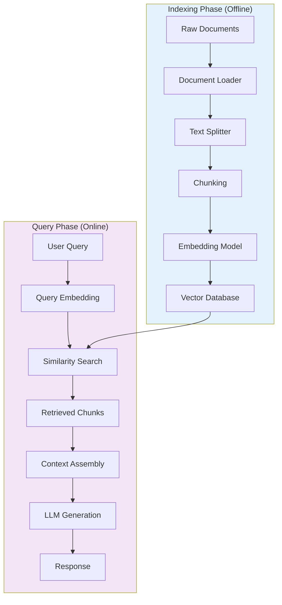
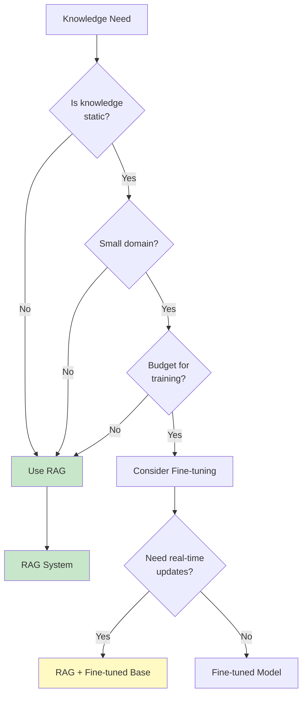
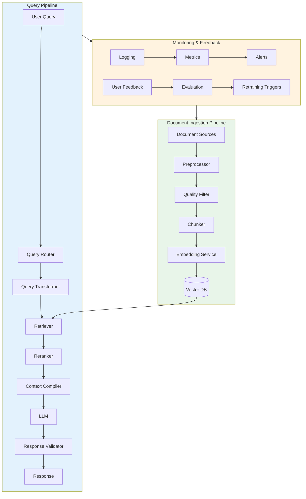

# RAG Architecture

Understanding RAG architecture is fundamental to GenAI engineering. This module covers the end-to-end pipeline, component interactions, and critical decision frameworks for when to use RAG versus alternatives like fine-tuning.

## Learning Objectives

- **Understand the complete RAG pipeline** from document ingestion to response generation
- **Identify key components** and their responsibilities in a RAG system
- **Make informed decisions** between RAG, fine-tuning, and hybrid approaches
- **Design scalable RAG architectures** for production environments
- **Recognize common failure modes** and mitigation strategies

## End-to-End RAG Pipeline

A RAG system consists of two main phases: **indexing** (offline) and **retrieval + generation** (online).



### Pipeline Components

```python
from dataclasses import dataclass
from typing import List, Optional
import numpy as np

@dataclass
class Document:
    """Represents a source document."""
    content: str
    metadata: dict
    source: str

@dataclass
class Chunk:
    """Represents a document chunk with embedding."""
    text: str
    embedding: Optional[np.ndarray]
    metadata: dict
    doc_id: str
    chunk_id: str

class RAGPipeline:
    """Complete RAG pipeline implementation."""

    def __init__(
        self,
        embedder,
        vector_store,
        llm,
        chunker,
        top_k: int = 5
    ):
        self.embedder = embedder
        self.vector_store = vector_store
        self.llm = llm
        self.chunker = chunker
        self.top_k = top_k

    # Indexing Phase
    def ingest(self, documents: List[Document]) -> None:
        """Process and index documents."""
        for doc in documents:
            # 1. Chunk the document
            chunks = self.chunker.split(doc.content)

            # 2. Generate embeddings
            for chunk in chunks:
                chunk.embedding = self.embedder.embed(chunk.text)
                chunk.metadata.update(doc.metadata)

            # 3. Store in vector database
            self.vector_store.upsert(chunks)

    # Query Phase
    def query(self, user_query: str) -> str:
        """Process query and generate response."""
        # 1. Embed the query
        query_embedding = self.embedder.embed(user_query)

        # 2. Retrieve relevant chunks
        retrieved_chunks = self.vector_store.search(
            query_embedding,
            top_k=self.top_k
        )

        # 3. Assemble context
        context = self._build_context(retrieved_chunks)

        # 4. Generate response
        prompt = self._build_prompt(user_query, context)
        response = self.llm.generate(prompt)

        return response

    def _build_context(self, chunks: List[Chunk]) -> str:
        """Combine retrieved chunks into context."""
        context_parts = []
        for i, chunk in enumerate(chunks, 1):
            context_parts.append(
                f"[Source {i}]: {chunk.text}"
            )
        return "\n\n".join(context_parts)

    def _build_prompt(self, query: str, context: str) -> str:
        """Create the final prompt for the LLM."""
        return f"""Answer the question based on the provided context.
If the context doesn't contain relevant information, say so.

Context:
{context}

Question: {query}

Answer:"""
```

## When to Use RAG

RAG is not always the right solution. Understanding when to apply it is crucial.



### RAG Use Cases

| Use Case | Why RAG Works | Example |
|----------|---------------|---------|
| **Enterprise Search** | Proprietary data, frequent updates | Internal knowledge base Q&A |
| **Customer Support** | Product info changes, citation needed | Support chatbot with docs |
| **Legal/Compliance** | Specific regulations, audit trail | Contract analysis |
| **Research Assistant** | Large corpus, multi-document synthesis | Scientific literature review |
| **Code Documentation** | Codebase evolves, context-specific | Developer Q&A system |

### RAG Limitations

::: warning When RAG Falls Short
- **Reasoning-heavy tasks**: RAG retrieves facts but doesn't improve reasoning
- **Creative generation**: External knowledge may constrain creativity
- **Low-latency requirements**: Retrieval adds 100-500ms latency
- **Highly structured output**: Schema compliance is LLM-dependent
:::

## RAG vs Fine-Tuning Decision Framework

This is a common interview question. Here's a structured approach:

```python
def should_use_rag(
    knowledge_updates_frequency: str,  # "daily", "weekly", "monthly", "rarely"
    knowledge_source_size: str,        # "small", "medium", "large"
    latency_requirement_ms: int,
    training_budget: float,
    needs_citations: bool,
    data_sensitivity: str              # "public", "private", "regulated"
) -> dict:
    """Decision framework for RAG vs fine-tuning."""

    scores = {"rag": 0, "fine_tuning": 0, "hybrid": 0}

    # Knowledge update frequency
    if knowledge_updates_frequency in ["daily", "weekly"]:
        scores["rag"] += 3
    elif knowledge_updates_frequency == "monthly":
        scores["rag"] += 1
        scores["hybrid"] += 2
    else:
        scores["fine_tuning"] += 2

    # Knowledge source size
    if knowledge_source_size == "large":
        scores["rag"] += 2  # Fine-tuning struggles with large corpora
    elif knowledge_source_size == "small":
        scores["fine_tuning"] += 1

    # Latency requirements
    if latency_requirement_ms < 200:
        scores["fine_tuning"] += 2
    elif latency_requirement_ms < 500:
        scores["hybrid"] += 1
    else:
        scores["rag"] += 1

    # Citation requirements
    if needs_citations:
        scores["rag"] += 3  # Fine-tuning can't provide verifiable sources

    # Data sensitivity
    if data_sensitivity == "regulated":
        scores["rag"] += 2  # Audit trail, data governance

    # Budget consideration
    if training_budget < 1000:
        scores["rag"] += 2

    recommendation = max(scores, key=scores.get)

    return {
        "recommendation": recommendation,
        "scores": scores,
        "reasoning": _generate_reasoning(scores, recommendation)
    }
```

### Comparison Table

| Factor | RAG | Fine-Tuning | Hybrid |
|--------|-----|-------------|--------|
| **Knowledge freshness** | Real-time | Stale after training | Best of both |
| **Setup cost** | Low ($100s) | High ($1000s+) | Medium |
| **Latency** | +100-500ms | Minimal overhead | Variable |
| **Accuracy on domain** | Good with quality retrieval | Excellent if trained well | Excellent |
| **Hallucination risk** | Lower (grounded) | Higher | Lowest |
| **Maintenance** | Index updates | Retraining needed | Both |
| **Citation support** | Native | Not available | Native |
| **Context window usage** | Retrieved chunks | Full context available | Optimized |

## Production RAG Architecture



### Key Production Considerations

```python
class ProductionRAGConfig:
    """Configuration for production RAG deployment."""

    # Retrieval settings
    retrieval_top_k: int = 10
    reranking_top_k: int = 5
    similarity_threshold: float = 0.7

    # Performance
    embedding_batch_size: int = 100
    max_context_tokens: int = 4000
    cache_ttl_seconds: int = 3600

    # Reliability
    retrieval_timeout_ms: int = 500
    llm_timeout_ms: int = 30000
    retry_attempts: int = 3

    # Quality
    min_chunk_relevance_score: float = 0.5
    enable_reranking: bool = True
    enable_query_expansion: bool = True

    # Observability
    log_retrieved_chunks: bool = True
    track_latency_percentiles: List[int] = [50, 90, 95, 99]
    enable_user_feedback: bool = True
```

::: info Production Checklist
Before deploying RAG to production:
1. Load test your vector database with expected QPS
2. Set up monitoring for retrieval quality metrics
3. Implement graceful degradation when retrieval fails
4. Cache frequently accessed embeddings
5. Plan for index updates without downtime
:::

## Interview Q&A

### Q1: Walk me through how you would design a RAG system for a company with 10,000 internal documents that need to be searchable by employees.

**Strong Answer:**

I'd approach this systematically across three phases:

**1. Document Processing Pipeline:**
- Set up document loaders for various formats (PDF, Word, HTML, etc.)
- Implement metadata extraction (author, date, department, access level)
- Use recursive chunking with ~500 token chunks and 50 token overlap
- Choose an embedding model like `text-embedding-3-small` for cost efficiency

**2. Storage and Retrieval:**
- For 10K documents (~100K chunks), I'd use Pinecone or Weaviate
- Implement hybrid search combining dense (semantic) and sparse (BM25) retrieval
- Add metadata filtering for department/access control
- Set up a reranker like Cohere Rerank for better precision

**3. Query Pipeline:**
- Query understanding layer for handling ambiguous questions
- Retrieval with top-k=10, reranked to top-5
- Context assembly with source attribution
- Response generation with citation requirements

**4. Production Considerations:**
- Role-based access control on documents
- Incremental indexing for new documents
- Feedback loop for improving retrieval
- Caching layer for common queries

---

### Q2: When would you recommend fine-tuning over RAG, and vice versa?

**Strong Answer:**

**Choose RAG when:**
- Knowledge changes frequently (daily/weekly updates)
- You need verifiable citations and source attribution
- Working with sensitive data that can't be used for training
- Budget is limited (RAG is cheaper to set up)
- Knowledge base is large (100K+ documents)

**Choose Fine-tuning when:**
- Teaching the model a specific style or behavior
- Domain knowledge is stable and well-defined
- Latency is critical (retrieval adds 100-500ms)
- Knowledge is small enough to fit in training data
- Need to modify model's base capabilities

**Choose Hybrid when:**
- Need both behavioral changes AND dynamic knowledge
- Building a specialized assistant for a domain
- Want fine-tuned model for efficiency but RAG for freshness

Example: A legal AI assistant might use a fine-tuned model for understanding legal language patterns, but RAG for retrieving current case law.

---

### Q3: How do you handle the cold start problem in RAG systems?

**Strong Answer:**

The cold start problem in RAG occurs when you have no user interaction data to optimize retrieval. Here's my approach:

**1. Synthetic Query Generation:**
```python
# Generate diverse queries from documents
def generate_synthetic_queries(chunk: str, llm) -> List[str]:
    prompt = f"""Generate 5 diverse questions that this text answers:
    {chunk}
    Include: factual, conceptual, and comparison questions."""
    return llm.generate(prompt)
```

**2. Expert Seeding:**
- Work with domain experts to create gold-standard query-document pairs
- Use these for initial retrieval tuning and evaluation

**3. Document-Centric Metrics:**
- Measure chunk coverage (are all important chunks being retrieved?)
- Test with document-derived queries before real users

**4. Progressive Optimization:**
- Start with conservative retrieval (higher top-k)
- Use implicit feedback (click-through, response ratings)
- Gradually tune based on actual usage patterns

---

### Q4: What are the main failure modes in RAG systems and how do you address them?

**Strong Answer:**

| Failure Mode | Cause | Mitigation |
|--------------|-------|------------|
| **Retrieval Miss** | Relevant docs not retrieved | Hybrid search, query expansion, better chunking |
| **Retrieval Noise** | Irrelevant docs retrieved | Reranking, stricter similarity threshold |
| **Context Overflow** | Too much retrieved content | Summarization, compression, smart selection |
| **Hallucination** | LLM ignores or misuses context | Grounding prompts, fact verification layer |
| **Stale Data** | Index not updated | Incremental indexing, freshness scores |
| **Latency Spikes** | Slow retrieval or embedding | Caching, async processing, timeout handling |

**My systematic approach:**

1. **Observability First:** Log retrieval results, track relevance scores, monitor latency percentiles

2. **Retrieval Quality:**
   - Implement reranking with cross-encoders
   - Use hybrid search (dense + sparse)
   - Set minimum similarity thresholds

3. **Context Quality:**
   - Deduplicate overlapping chunks
   - Order by relevance, recency, or source authority
   - Implement context compression for long contexts

4. **Generation Quality:**
   - Strong grounding prompts ("Answer ONLY based on context")
   - Post-generation verification against sources
   - User feedback integration

## Summary Table

| Component | Purpose | Key Considerations |
|-----------|---------|-------------------|
| **Document Loader** | Ingest various formats | Handle encoding, extraction quality |
| **Chunker** | Split into retrievable units | Balance size vs. context preservation |
| **Embedding Model** | Create vector representations | Dimension, speed, quality tradeoffs |
| **Vector Store** | Store and search vectors | Scale, latency, filtering capabilities |
| **Retriever** | Find relevant chunks | Precision vs. recall, hybrid approaches |
| **Reranker** | Improve ranking quality | Accuracy vs. latency tradeoff |
| **Context Compiler** | Prepare LLM input | Token limits, source formatting |
| **LLM** | Generate final response | Cost, quality, latency |

## Sources

- [Retrieval-Augmented Generation for Knowledge-Intensive NLP Tasks](https://arxiv.org/abs/2005.11401) - Lewis et al., 2020
- [LangChain RAG Documentation](https://python.langchain.com/docs/use_cases/question_answering/)
- [LlamaIndex High-Level Concepts](https://docs.llamaindex.ai/en/stable/getting_started/concepts/)
- [Pinecone RAG Guide](https://www.pinecone.io/learn/retrieval-augmented-generation/)
- [Anthropic Prompt Engineering Guide](https://docs.anthropic.com/claude/docs/prompt-engineering)
