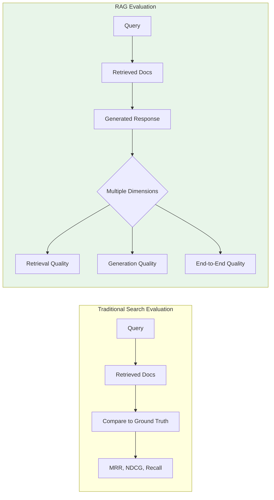
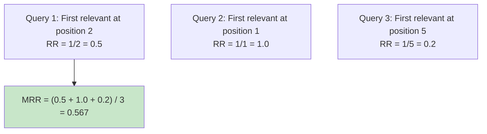
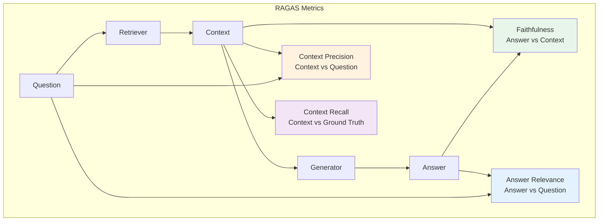
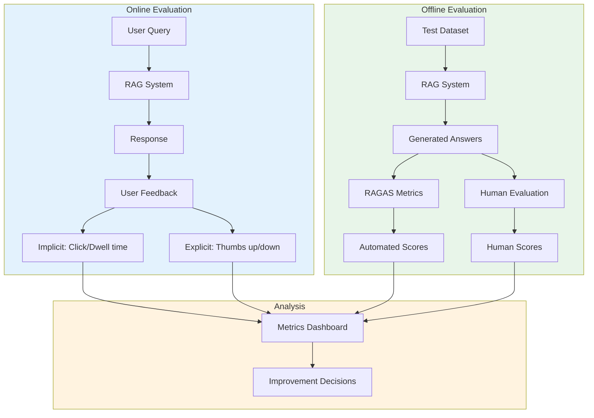

# RAG Evaluation

Evaluating RAG systems requires measuring both retrieval quality and generation quality. This module covers standard metrics (MRR, NDCG, Recall), generation-specific metrics (faithfulness, relevance), and frameworks like RAGAS for comprehensive RAG evaluation.

## Learning Objectives

- **Calculate standard retrieval metrics** including MRR, NDCG, Precision, and Recall
- **Evaluate generation quality** using faithfulness and relevance metrics
- **Implement the RAGAS framework** for end-to-end RAG evaluation
- **Design evaluation pipelines** for production RAG systems
- **Build evaluation datasets** and ground truth annotations

## Why RAG Evaluation is Different



RAG evaluation must consider:
1. **Retrieval quality**: Are we finding the right documents?
2. **Context relevance**: Are retrieved docs useful for the question?
3. **Faithfulness**: Does the answer stay true to the context?
4. **Answer relevance**: Does the answer address the question?
5. **End-to-end quality**: Is the final answer correct?

## Retrieval Metrics

### Mean Reciprocal Rank (MRR)



```python
from typing import List, Dict, Set
import numpy as np

class RetrievalMetrics:
    """Standard retrieval evaluation metrics."""

    @staticmethod
    def reciprocal_rank(retrieved_ids: List[str], relevant_ids: Set[str]) -> float:
        """
        Calculate Reciprocal Rank.

        RR = 1 / position of first relevant document
        Returns 0 if no relevant document is retrieved.
        """
        for i, doc_id in enumerate(retrieved_ids):
            if doc_id in relevant_ids:
                return 1.0 / (i + 1)
        return 0.0

    @staticmethod
    def mean_reciprocal_rank(
        queries_results: List[Dict]
    ) -> float:
        """
        Calculate Mean Reciprocal Rank across queries.

        MRR = (1/|Q|) * sum(1/rank_i)

        Args:
            queries_results: List of {"retrieved": [...], "relevant": set(...)}

        Returns:
            MRR score between 0 and 1
        """
        rrs = []
        for qr in queries_results:
            rr = RetrievalMetrics.reciprocal_rank(
                qr["retrieved"],
                qr["relevant"]
            )
            rrs.append(rr)

        return np.mean(rrs) if rrs else 0.0


# Example
results = [
    {"retrieved": ["d1", "d2", "d3"], "relevant": {"d2", "d5"}},  # RR = 1/2
    {"retrieved": ["d4", "d5", "d6"], "relevant": {"d4"}},        # RR = 1/1
    {"retrieved": ["d7", "d8", "d9"], "relevant": {"d10"}},       # RR = 0
]

mrr = RetrievalMetrics.mean_reciprocal_rank(results)
print(f"MRR: {mrr:.3f}")  # MRR: 0.500
```

### Normalized Discounted Cumulative Gain (NDCG)

```python
class NDCGCalculator:
    """
    NDCG: Measures ranking quality with graded relevance.

    DCG = sum(relevance_i / log2(i + 1))
    NDCG = DCG / IDCG (Ideal DCG)
    """

    @staticmethod
    def dcg_at_k(relevances: List[float], k: int) -> float:
        """
        Calculate Discounted Cumulative Gain.

        Relevances: graded scores (e.g., 0, 1, 2, 3)
        Higher positions are more valuable (logarithmic discount)
        """
        relevances = relevances[:k]
        dcg = 0.0

        for i, rel in enumerate(relevances):
            # Position is i+1 (1-indexed), discount is log2(i+2)
            dcg += rel / np.log2(i + 2)

        return dcg

    @staticmethod
    def ndcg_at_k(
        retrieved_ids: List[str],
        relevance_scores: Dict[str, float],
        k: int
    ) -> float:
        """
        Calculate NDCG@k.

        Args:
            retrieved_ids: Ordered list of retrieved document IDs
            relevance_scores: Dict mapping doc_id to relevance score
            k: Cutoff position

        Returns:
            NDCG score between 0 and 1
        """
        # Get relevances in retrieved order
        retrieved_relevances = [
            relevance_scores.get(doc_id, 0.0)
            for doc_id in retrieved_ids[:k]
        ]

        # Calculate DCG
        dcg = NDCGCalculator.dcg_at_k(retrieved_relevances, k)

        # Calculate ideal DCG (sorted by relevance)
        ideal_relevances = sorted(relevance_scores.values(), reverse=True)[:k]
        idcg = NDCGCalculator.dcg_at_k(ideal_relevances, k)

        if idcg == 0:
            return 0.0

        return dcg / idcg


# Example with graded relevance
# 3 = highly relevant, 2 = relevant, 1 = somewhat relevant, 0 = not relevant
relevance_scores = {
    "doc_a": 3,  # Highly relevant
    "doc_b": 2,  # Relevant
    "doc_c": 1,  # Somewhat relevant
    "doc_d": 0,  # Not relevant
    "doc_e": 3,  # Highly relevant
}

# Retrieved order: doc_d, doc_a, doc_c, doc_b
retrieved = ["doc_d", "doc_a", "doc_c", "doc_b"]

ndcg = NDCGCalculator.ndcg_at_k(retrieved, relevance_scores, k=4)
print(f"NDCG@4: {ndcg:.3f}")
# Retrieved relevances: [0, 3, 1, 2] -> DCG lower than ideal [3, 3, 2, 1]
```

### Precision and Recall

```python
class PrecisionRecall:
    """Precision and Recall metrics for retrieval."""

    @staticmethod
    def precision_at_k(
        retrieved_ids: List[str],
        relevant_ids: Set[str],
        k: int
    ) -> float:
        """
        Precision@k = |relevant in top-k| / k

        How many of the retrieved docs are relevant?
        """
        retrieved_k = set(retrieved_ids[:k])
        relevant_retrieved = retrieved_k & relevant_ids
        return len(relevant_retrieved) / k if k > 0 else 0.0

    @staticmethod
    def recall_at_k(
        retrieved_ids: List[str],
        relevant_ids: Set[str],
        k: int
    ) -> float:
        """
        Recall@k = |relevant in top-k| / |all relevant|

        How many of the relevant docs did we find?
        """
        if not relevant_ids:
            return 0.0

        retrieved_k = set(retrieved_ids[:k])
        relevant_retrieved = retrieved_k & relevant_ids
        return len(relevant_retrieved) / len(relevant_ids)

    @staticmethod
    def f1_at_k(
        retrieved_ids: List[str],
        relevant_ids: Set[str],
        k: int
    ) -> float:
        """F1@k = 2 * (precision * recall) / (precision + recall)"""
        precision = PrecisionRecall.precision_at_k(retrieved_ids, relevant_ids, k)
        recall = PrecisionRecall.recall_at_k(retrieved_ids, relevant_ids, k)

        if precision + recall == 0:
            return 0.0

        return 2 * (precision * recall) / (precision + recall)

    @staticmethod
    def average_precision(
        retrieved_ids: List[str],
        relevant_ids: Set[str]
    ) -> float:
        """
        Average Precision: Area under precision-recall curve.

        AP = sum(precision@k * relevance@k) / |relevant|
        """
        if not relevant_ids:
            return 0.0

        precisions = []
        relevant_count = 0

        for i, doc_id in enumerate(retrieved_ids):
            if doc_id in relevant_ids:
                relevant_count += 1
                precision_at_i = relevant_count / (i + 1)
                precisions.append(precision_at_i)

        if not precisions:
            return 0.0

        return sum(precisions) / len(relevant_ids)
```

### Metrics Comparison

```mermaid
flowchart TD
    subgraph Metrics["Choosing the Right Metric"]
        A{What matters most?}
        A -->|First result quality| B[MRR]
        A -->|Top-k result quality| C[Precision@k]
        A -->|Finding all relevant| D[Recall@k]
        A -->|Ranked list quality| E[NDCG@k]
        A -->|Overall trade-off| F[MAP/F1]
    end

    B --> G["Good for: QA, search box"]
    C --> H["Good for: Recommendations"]
    D --> I["Good for: Legal discovery"]
    E --> J["Good for: Search engines"]
    F --> K["Good for: General evaluation"]

    style A fill:#e3f2fd
```

| Metric | What It Measures | Range | When to Use |
|--------|------------------|-------|-------------|
| **MRR** | Position of first relevant | [0, 1] | Single answer expected |
| **Precision@k** | Relevant in top-k | [0, 1] | Fixed result display |
| **Recall@k** | Coverage of relevant | [0, 1] | Finding all matters |
| **NDCG@k** | Ranking quality (graded) | [0, 1] | Graded relevance available |
| **MAP** | Average precision | [0, 1] | Comparing systems overall |

## Generation Quality Metrics

### Faithfulness

```python
class FaithfulnessEvaluator:
    """
    Evaluate if the generated answer is faithful to the context.

    Faithfulness = Does the answer only contain information from context?
    Not faithful = Hallucination or external knowledge injection
    """

    def __init__(self, llm):
        self.llm = llm

    def evaluate(
        self,
        question: str,
        context: str,
        answer: str
    ) -> Dict:
        """
        Evaluate faithfulness of answer to context.

        Approach:
        1. Extract claims from the answer
        2. Check if each claim is supported by context
        3. Calculate faithfulness score
        """

        # Step 1: Extract claims
        claims = self._extract_claims(answer)

        # Step 2: Verify each claim
        supported_claims = []
        unsupported_claims = []

        for claim in claims:
            is_supported = self._verify_claim(claim, context)
            if is_supported:
                supported_claims.append(claim)
            else:
                unsupported_claims.append(claim)

        # Step 3: Calculate score
        total_claims = len(claims)
        if total_claims == 0:
            faithfulness_score = 1.0  # No claims to verify
        else:
            faithfulness_score = len(supported_claims) / total_claims

        return {
            "faithfulness_score": faithfulness_score,
            "total_claims": total_claims,
            "supported_claims": supported_claims,
            "unsupported_claims": unsupported_claims
        }

    def _extract_claims(self, answer: str) -> List[str]:
        """Extract atomic claims from the answer."""

        prompt = f"""Extract all factual claims from this answer.
Each claim should be a simple, atomic statement.

Answer: {answer}

List each claim on a new line:"""

        response = self.llm.generate(prompt)
        claims = [c.strip() for c in response.strip().split('\n') if c.strip()]
        # Clean up numbering
        import re
        claims = [re.sub(r'^[\d\.\-\)\]]+\s*', '', c) for c in claims]
        return [c for c in claims if c]

    def _verify_claim(self, claim: str, context: str) -> bool:
        """Check if claim is supported by context."""

        prompt = f"""Determine if this claim is supported by the context.

Context: {context}

Claim: {claim}

Is this claim supported by the context?
Output only: SUPPORTED or NOT_SUPPORTED"""

        response = self.llm.generate(prompt, max_tokens=20)
        return "SUPPORTED" in response.upper()
```

### Answer Relevance

```python
class AnswerRelevanceEvaluator:
    """
    Evaluate if the answer is relevant to the question.

    Answer Relevance = Does the answer address what was asked?
    """

    def __init__(self, llm, embedding_model):
        self.llm = llm
        self.embedding_model = embedding_model

    def evaluate(self, question: str, answer: str) -> Dict:
        """
        Evaluate answer relevance using question generation.

        Approach:
        1. Generate questions that the answer would address
        2. Compare generated questions to original question
        3. Higher similarity = higher relevance
        """

        # Generate questions from the answer
        generated_questions = self._generate_questions(answer, num=3)

        # Calculate similarity to original question
        question_emb = self.embedding_model.embed([question])[0]
        generated_embs = self.embedding_model.embed(generated_questions)

        similarities = [
            np.dot(question_emb, gen_emb) /
            (np.linalg.norm(question_emb) * np.linalg.norm(gen_emb))
            for gen_emb in generated_embs
        ]

        relevance_score = np.mean(similarities)

        return {
            "answer_relevance_score": float(relevance_score),
            "generated_questions": generated_questions,
            "question_similarities": [float(s) for s in similarities]
        }

    def _generate_questions(self, answer: str, num: int = 3) -> List[str]:
        """Generate questions that the answer would address."""

        prompt = f"""Generate {num} questions that this answer would be a good response to.

Answer: {answer}

Questions (one per line):"""

        response = self.llm.generate(prompt)
        questions = [q.strip() for q in response.strip().split('\n') if q.strip()]
        import re
        questions = [re.sub(r'^[\d\.\-\)\]]+\s*', '', q) for q in questions]
        return questions[:num]
```

### Context Relevance

```python
class ContextRelevanceEvaluator:
    """
    Evaluate if retrieved context is relevant to the question.

    Context Relevance = Is the retrieved information useful for answering?
    """

    def __init__(self, llm):
        self.llm = llm

    def evaluate(
        self,
        question: str,
        contexts: List[str]
    ) -> Dict:
        """
        Evaluate context relevance.

        For each context chunk, determine what portion is relevant.
        """

        context_scores = []

        for context in contexts:
            # Extract relevant sentences
            relevant_sentences = self._extract_relevant(question, context)

            # Calculate relevance ratio
            all_sentences = self._split_sentences(context)
            if len(all_sentences) > 0:
                score = len(relevant_sentences) / len(all_sentences)
            else:
                score = 0.0

            context_scores.append({
                "context": context[:100] + "...",
                "relevance_score": score,
                "relevant_sentences": len(relevant_sentences),
                "total_sentences": len(all_sentences)
            })

        # Overall score is mean of individual scores
        overall_score = np.mean([c["relevance_score"] for c in context_scores])

        return {
            "context_relevance_score": float(overall_score),
            "individual_scores": context_scores
        }

    def _extract_relevant(self, question: str, context: str) -> List[str]:
        """Extract sentences relevant to the question."""

        prompt = f"""Extract only the sentences from the context that are relevant to answering the question.

Question: {question}

Context: {context}

Relevant sentences (or 'None' if no relevant sentences):"""

        response = self.llm.generate(prompt)

        if "none" in response.lower():
            return []

        return [s.strip() for s in response.strip().split('\n') if s.strip()]

    def _split_sentences(self, text: str) -> List[str]:
        """Split text into sentences."""
        import re
        sentences = re.split(r'(?<=[.!?])\s+', text)
        return [s.strip() for s in sentences if s.strip()]
```

## RAGAS Framework

RAGAS (Retrieval Augmented Generation Assessment) provides a comprehensive evaluation framework.



### Implementation

```python
from dataclasses import dataclass
from typing import Optional

@dataclass
class RAGASInput:
    """Input for RAGAS evaluation."""
    question: str
    contexts: List[str]
    answer: str
    ground_truth: Optional[str] = None

@dataclass
class RAGASOutput:
    """Output from RAGAS evaluation."""
    faithfulness: float
    answer_relevance: float
    context_precision: float
    context_recall: float
    overall_score: float

class RAGASEvaluator:
    """
    RAGAS: Retrieval Augmented Generation Assessment.

    Metrics:
    - Faithfulness: Is answer grounded in context?
    - Answer Relevance: Does answer address question?
    - Context Precision: Is context relevant to question?
    - Context Recall: Does context cover ground truth?
    """

    def __init__(self, llm, embedding_model):
        self.llm = llm
        self.embedding_model = embedding_model
        self.faithfulness_eval = FaithfulnessEvaluator(llm)
        self.relevance_eval = AnswerRelevanceEvaluator(llm, embedding_model)
        self.context_eval = ContextRelevanceEvaluator(llm)

    def evaluate(self, inputs: List[RAGASInput]) -> Dict:
        """
        Evaluate a batch of RAG outputs.

        Returns individual scores and aggregated metrics.
        """
        results = []

        for inp in inputs:
            result = self._evaluate_single(inp)
            results.append(result)

        # Aggregate
        aggregated = {
            "faithfulness": np.mean([r.faithfulness for r in results]),
            "answer_relevance": np.mean([r.answer_relevance for r in results]),
            "context_precision": np.mean([r.context_precision for r in results]),
            "context_recall": np.mean([r.context_recall for r in results]),
        }
        aggregated["overall_score"] = np.mean(list(aggregated.values()))

        return {
            "individual_results": results,
            "aggregated": aggregated,
            "num_samples": len(inputs)
        }

    def _evaluate_single(self, inp: RAGASInput) -> RAGASOutput:
        """Evaluate a single RAG output."""

        # Faithfulness
        faith_result = self.faithfulness_eval.evaluate(
            inp.question,
            "\n\n".join(inp.contexts),
            inp.answer
        )
        faithfulness = faith_result["faithfulness_score"]

        # Answer Relevance
        rel_result = self.relevance_eval.evaluate(inp.question, inp.answer)
        answer_relevance = rel_result["answer_relevance_score"]

        # Context Precision
        ctx_result = self.context_eval.evaluate(inp.question, inp.contexts)
        context_precision = ctx_result["context_relevance_score"]

        # Context Recall (requires ground truth)
        if inp.ground_truth:
            context_recall = self._calculate_context_recall(
                inp.contexts,
                inp.ground_truth
            )
        else:
            context_recall = None

        # Overall
        scores = [faithfulness, answer_relevance, context_precision]
        if context_recall is not None:
            scores.append(context_recall)
        overall = np.mean(scores)

        return RAGASOutput(
            faithfulness=faithfulness,
            answer_relevance=answer_relevance,
            context_precision=context_precision,
            context_recall=context_recall or 0.0,
            overall_score=overall
        )

    def _calculate_context_recall(
        self,
        contexts: List[str],
        ground_truth: str
    ) -> float:
        """
        Calculate context recall.

        What portion of the ground truth information is in the context?
        """
        # Extract claims from ground truth
        gt_claims = self._extract_claims(ground_truth)

        if not gt_claims:
            return 1.0

        # Check which claims are covered by context
        combined_context = "\n\n".join(contexts)
        covered = 0

        for claim in gt_claims:
            prompt = f"""Is this claim present (even paraphrased) in the context?

Context: {combined_context}

Claim: {claim}

Output only: PRESENT or NOT_PRESENT"""

            response = self.llm.generate(prompt, max_tokens=20)
            if "PRESENT" in response.upper():
                covered += 1

        return covered / len(gt_claims)

    def _extract_claims(self, text: str) -> List[str]:
        """Extract claims from text."""
        prompt = f"""Extract key factual claims from this text.
Each claim should be a simple statement.

Text: {text}

Claims (one per line):"""

        response = self.llm.generate(prompt)
        claims = [c.strip() for c in response.strip().split('\n') if c.strip()]
        import re
        return [re.sub(r'^[\d\.\-\)\]]+\s*', '', c) for c in claims if c]


# Usage
evaluator = RAGASEvaluator(llm, embedding_model)

test_data = [
    RAGASInput(
        question="What is the capital of France?",
        contexts=["Paris is the capital and largest city of France."],
        answer="The capital of France is Paris.",
        ground_truth="Paris is the capital of France."
    ),
    # More test cases...
]

results = evaluator.evaluate(test_data)
print(f"Faithfulness: {results['aggregated']['faithfulness']:.3f}")
print(f"Answer Relevance: {results['aggregated']['answer_relevance']:.3f}")
print(f"Context Precision: {results['aggregated']['context_precision']:.3f}")
print(f"Overall: {results['aggregated']['overall_score']:.3f}")
```

## Building Evaluation Datasets

```python
class EvaluationDatasetBuilder:
    """Tools for building RAG evaluation datasets."""

    def __init__(self, llm):
        self.llm = llm

    def generate_test_questions(
        self,
        documents: List[str],
        num_questions_per_doc: int = 3
    ) -> List[Dict]:
        """
        Generate test questions from documents.

        Creates questions with ground truth answers.
        """
        test_cases = []

        for doc in documents:
            # Generate questions
            prompt = f"""Generate {num_questions_per_doc} diverse questions that can be answered using this document.
Include a mix of:
- Factual questions
- Comprehension questions
- Inference questions

Document: {doc[:2000]}

For each question, also provide the answer.
Format:
Q: [question]
A: [answer]
"""

            response = self.llm.generate(prompt)

            # Parse Q&A pairs
            pairs = self._parse_qa_pairs(response)

            for q, a in pairs:
                test_cases.append({
                    "question": q,
                    "ground_truth": a,
                    "source_document": doc[:500]
                })

        return test_cases

    def _parse_qa_pairs(self, text: str) -> List[Tuple[str, str]]:
        """Parse Q: A: formatted text."""
        import re
        pattern = r'Q:\s*(.+?)\nA:\s*(.+?)(?=\nQ:|$)'
        matches = re.findall(pattern, text, re.DOTALL)
        return [(q.strip(), a.strip()) for q, a in matches]

    def annotate_relevance(
        self,
        questions: List[str],
        documents: List[Dict],
        annotator_llm=None
    ) -> Dict[str, Dict[str, int]]:
        """
        Generate relevance annotations for question-document pairs.

        Returns: {question: {doc_id: relevance_score}}
        """
        llm = annotator_llm or self.llm
        annotations = {}

        for question in questions:
            annotations[question] = {}

            for doc in documents:
                prompt = f"""Rate the relevance of this document for answering the question.

Question: {question}

Document: {doc['text'][:500]}

Rate from 0-3:
0 = Not relevant
1 = Marginally relevant
2 = Relevant
3 = Highly relevant

Output only the number:"""

                response = llm.generate(prompt, max_tokens=5)
                try:
                    score = int(response.strip()[0])
                    score = max(0, min(3, score))
                except:
                    score = 0

                annotations[question][doc['id']] = score

        return annotations
```

## Production Evaluation Pipeline



```python
class ProductionEvaluator:
    """Production RAG evaluation pipeline."""

    def __init__(self, ragas_evaluator, metrics_logger):
        self.evaluator = ragas_evaluator
        self.logger = metrics_logger

    def evaluate_batch(
        self,
        test_cases: List[RAGASInput],
        experiment_name: str
    ) -> Dict:
        """Run batch evaluation and log results."""

        # Run RAGAS evaluation
        results = self.evaluator.evaluate(test_cases)

        # Log to metrics system
        self.logger.log_experiment(
            name=experiment_name,
            metrics=results["aggregated"],
            num_samples=len(test_cases),
            timestamp=datetime.now()
        )

        # Identify failure cases
        failures = self._identify_failures(results["individual_results"])

        return {
            "metrics": results["aggregated"],
            "failures": failures,
            "experiment": experiment_name
        }

    def _identify_failures(
        self,
        results: List[RAGASOutput],
        thresholds: Dict = None
    ) -> List[Dict]:
        """Identify cases below threshold for analysis."""

        thresholds = thresholds or {
            "faithfulness": 0.7,
            "answer_relevance": 0.6,
            "context_precision": 0.5
        }

        failures = []
        for i, result in enumerate(results):
            failure_reasons = []

            if result.faithfulness < thresholds["faithfulness"]:
                failure_reasons.append(f"Low faithfulness: {result.faithfulness:.2f}")
            if result.answer_relevance < thresholds["answer_relevance"]:
                failure_reasons.append(f"Low relevance: {result.answer_relevance:.2f}")
            if result.context_precision < thresholds["context_precision"]:
                failure_reasons.append(f"Low context precision: {result.context_precision:.2f}")

            if failure_reasons:
                failures.append({
                    "index": i,
                    "reasons": failure_reasons,
                    "scores": {
                        "faithfulness": result.faithfulness,
                        "answer_relevance": result.answer_relevance,
                        "context_precision": result.context_precision
                    }
                })

        return failures

    def compare_experiments(
        self,
        experiment_names: List[str]
    ) -> Dict:
        """Compare metrics across experiments."""

        comparisons = {}
        for name in experiment_names:
            metrics = self.logger.get_experiment(name)
            comparisons[name] = metrics

        # Calculate improvements
        if len(experiment_names) >= 2:
            baseline = comparisons[experiment_names[0]]
            latest = comparisons[experiment_names[-1]]

            improvements = {
                metric: (latest[metric] - baseline[metric]) / baseline[metric] * 100
                for metric in baseline.keys()
                if isinstance(baseline[metric], (int, float))
            }
        else:
            improvements = {}

        return {
            "experiments": comparisons,
            "improvements": improvements
        }
```

## Interview Q&A

### Q1: Explain MRR, NDCG, and when you'd use each for RAG evaluation.

**Strong Answer:**

**MRR (Mean Reciprocal Rank):**
- Measures where the first relevant result appears
- MRR = average of 1/rank of first relevant doc
- Use when: Only one answer is expected (QA systems)
- Example: Search box where users expect first result to be right

**NDCG (Normalized Discounted Cumulative Gain):**
- Measures ranking quality with graded relevance
- Discounts relevance by position (log scale)
- Normalizes against ideal ranking
- Use when: Have graded relevance labels, multiple relevant docs

**Comparison:**
| Metric | Relevance Type | Best For |
|--------|---------------|----------|
| MRR | Binary | Single-answer QA |
| NDCG | Graded | Ranked results |
| Recall@k | Binary | Ensuring coverage |

**For RAG specifically:**
- MRR for QA: "Did we find the right answer chunk?"
- NDCG for context assembly: "Are the top-k chunks properly ranked?"
- Recall for coverage: "Did we find all relevant information?"

---

### Q2: How do you evaluate faithfulness in RAG systems without human annotation?

**Strong Answer:**

**Automated faithfulness evaluation approach:**

1. **Claim Extraction:**
```python
# Extract atomic claims from the generated answer
claims = extract_claims("The Earth orbits the Sun in 365 days")
# -> ["The Earth orbits the Sun", "The orbit takes 365 days"]
```

2. **Claim Verification:**
```python
for claim in claims:
    is_supported = check_entailment(context, claim)
    # Use NLI model or LLM to check if context supports claim
```

3. **Score Calculation:**
```python
faithfulness = supported_claims / total_claims
```

**Challenges and mitigations:**

| Challenge | Mitigation |
|-----------|------------|
| Claim extraction errors | Use few-shot prompting with examples |
| Nuanced entailment | Use strong NLI model (DeBERTa-v3) |
| Paraphrasing | Compare embeddings, not exact match |
| Implicit claims | Extract both explicit and implicit claims |

**Alternative approaches:**
- **Token overlap**: Simple but crude (BLEU-like)
- **Embedding similarity**: Context vs answer embeddings
- **LLM-as-judge**: Ask LLM if answer is faithful (can be biased)

**My recommendation:** Use claim-based approach for production, with LLM-as-judge for spot-checking. Calibrate against human annotations on sample.

---

### Q3: Design an evaluation framework for a production RAG system.

**Strong Answer:**

**Three-tier evaluation framework:**

**Tier 1: Offline Automated (Daily)**
```python
# Run on golden test set
metrics = {
    "retrieval": ["MRR", "Recall@5", "NDCG@10"],
    "generation": ["Faithfulness", "Answer Relevance"],
    "e2e": ["Exact Match", "F1"]
}
```

**Tier 2: Online Implicit (Real-time)**
```python
# Track user behavior signals
signals = {
    "engagement": ["time_to_first_click", "dwell_time"],
    "satisfaction": ["query_reformulation_rate", "bounce_rate"],
    "success": ["task_completion_rate"]
}
```

**Tier 3: Human Evaluation (Weekly)**
```python
# Sample recent queries for human review
sample_criteria = {
    "low_confidence": score < 0.5,
    "negative_feedback": thumbs_down == True,
    "random": random_sample(100)
}
```

**Implementation:**
```python
class EvaluationFramework:
    def __init__(self):
        self.automated = RAGASEvaluator()
        self.logger = MetricsLogger()
        self.alerter = AlertSystem()

    def daily_eval(self, test_set):
        results = self.automated.evaluate(test_set)
        self.logger.log(results)

        # Alert on regression
        if results["faithfulness"] < 0.8:
            self.alerter.send("Faithfulness dropped below threshold")

    def log_online_signal(self, query_id, signal_type, value):
        self.logger.log_signal(query_id, signal_type, value)

    def weekly_human_review(self):
        samples = self.get_review_samples()
        return create_annotation_task(samples)
```

**Key metrics to track:**
| Category | Metric | Alert Threshold |
|----------|--------|-----------------|
| Retrieval | Recall@5 | < 0.85 |
| Faithfulness | RAGAS score | < 0.80 |
| Latency | p99 | > 3s |
| User satisfaction | Thumb up rate | < 70% |

---

### Q4: What are the limitations of automated RAG evaluation metrics?

**Strong Answer:**

**Limitation 1: Semantic equivalence blindness**
```python
# These might score differently but are semantically equivalent:
ground_truth = "Paris is the capital of France"
answer1 = "The capital of France is Paris"  # High score
answer2 = "France's capital city is Paris"   # May score lower
```

**Limitation 2: Context-dependent correctness**
- Automated metrics can't assess if an answer is correct for a specific user context
- Example: "Best Python version" depends on user's constraints

**Limitation 3: Faithfulness vs. correctness confusion**
```python
# Faithful but wrong (if context is wrong):
context = "The moon is made of cheese"  # Incorrect
answer = "The moon is made of cheese"    # Faithful to context, but wrong

# Unfaithful but correct:
answer = "The moon is made of rock"      # Correct, but "unfaithful" to bad context
```

**Limitation 4: Fluency and coherence**
- Most metrics don't capture how natural the response sounds
- A factually correct but awkwardly written response may score well

**Limitation 5: Coverage**
- Hard to measure if all relevant aspects were addressed
- Partial answers might score well on faithfulness

**Mitigations:**
| Limitation | Mitigation |
|------------|------------|
| Semantic equivalence | Use embedding-based similarity |
| Context-dependence | Include user context in evaluation |
| Faithfulness != correctness | Separate ground truth validation |
| Fluency | Add human evaluation sampling |
| Coverage | Use claim recall metrics |

**Bottom line:** Automated metrics are necessary for scale but insufficient alone. Always combine with human evaluation for high-stakes systems.

## Summary Table

| Metric | Type | What It Measures | Range |
|--------|------|------------------|-------|
| **MRR** | Retrieval | First relevant position | [0, 1] |
| **NDCG** | Retrieval | Ranked list quality | [0, 1] |
| **Recall@k** | Retrieval | Coverage of relevant docs | [0, 1] |
| **Faithfulness** | Generation | Grounding in context | [0, 1] |
| **Answer Relevance** | Generation | Addressing the question | [0, 1] |
| **Context Precision** | RAG | Context usefulness | [0, 1] |
| **Context Recall** | RAG | Context completeness | [0, 1] |

## Sources

- [RAGAS Paper](https://arxiv.org/abs/2309.15217) - RAGAS: Automated Evaluation of Retrieval Augmented Generation
- [RAGAS Documentation](https://docs.ragas.io/)
- [Evaluating RAG Systems](https://www.pinecone.io/learn/retrieval-augmented-generation-evaluation/)
- [NDCG Explained](https://en.wikipedia.org/wiki/Discounted_cumulative_gain)
- [MS MARCO Evaluation](https://microsoft.github.io/msmarco/)
- [BEIR Benchmark](https://github.com/beir-cellar/beir)
- [TruLens for RAG Evaluation](https://www.trulens.org/)
