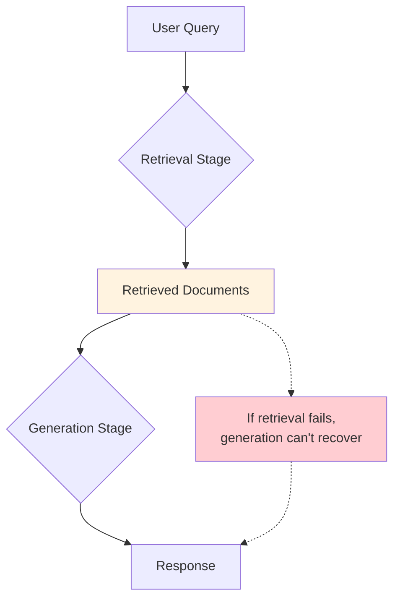
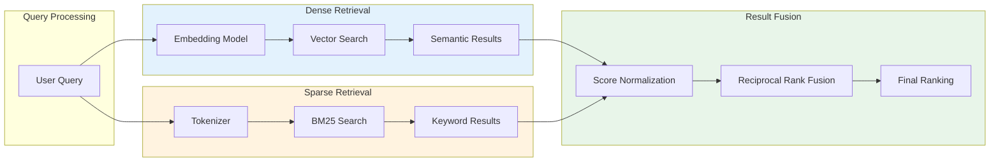
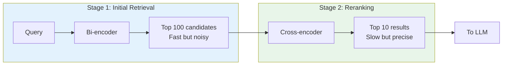
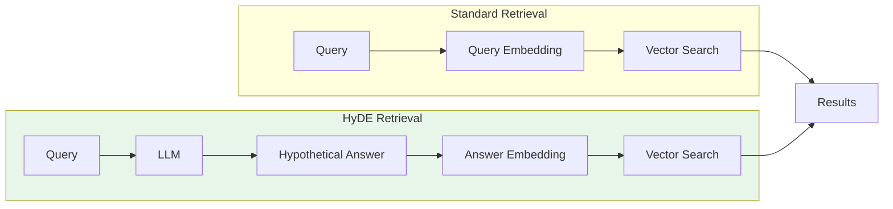
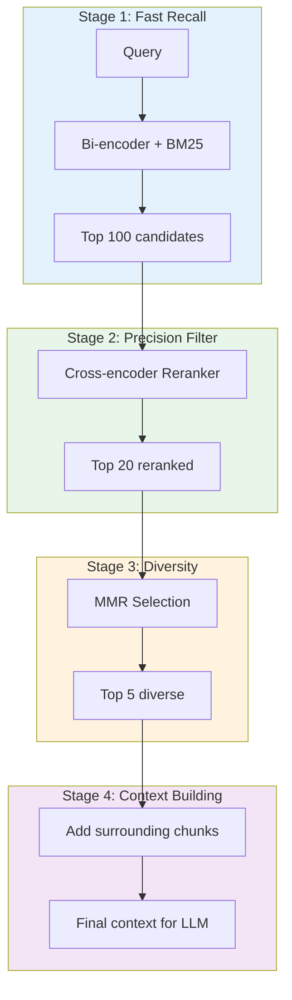

# Retrieval Optimization

Retrieval quality is the single biggest factor in RAG system performance. This module covers advanced retrieval techniques including hybrid search, reranking, query expansion, and HyDE (Hypothetical Document Embeddings) that can significantly improve your system's accuracy.

## Learning Objectives

- **Implement hybrid search** combining dense and sparse retrieval methods
- **Apply reranking** with cross-encoders for improved precision
- **Use query expansion** techniques to improve recall
- **Understand HyDE** and when it improves retrieval
- **Design multi-stage retrieval pipelines** for production systems

## The Retrieval Quality Problem



::: warning Critical Insight
RAG follows the "garbage in, garbage out" principle. If retrieval returns irrelevant documents, the LLM will either:
1. Generate a wrong answer from bad context
2. Hallucinate to fill gaps
3. Admit it doesn't know (best case)

Improving retrieval is often more impactful than improving the LLM.
:::

## Hybrid Search

Hybrid search combines dense (semantic) and sparse (keyword) retrieval to get the best of both worlds.



### Implementation

```python
from typing import List, Dict, Tuple
import numpy as np
from rank_bm25 import BM25Okapi
from dataclasses import dataclass

@dataclass
class SearchResult:
    id: str
    text: str
    score: float
    source: str  # "dense", "sparse", or "hybrid"

class HybridSearcher:
    """Combine dense and sparse retrieval with multiple fusion strategies."""

    def __init__(
        self,
        embedding_model,
        vector_store,
        alpha: float = 0.5  # Balance between dense and sparse
    ):
        self.embedding_model = embedding_model
        self.vector_store = vector_store
        self.alpha = alpha
        self.bm25 = None
        self.documents = []

    def index(self, documents: List[Dict]) -> None:
        """Index documents for both dense and sparse search."""
        self.documents = documents
        texts = [doc["text"] for doc in documents]

        # Dense index (vector store)
        embeddings = self.embedding_model.embed(texts)
        self.vector_store.upsert([
            {"id": doc["id"], "vector": emb, "metadata": doc}
            for doc, emb in zip(documents, embeddings)
        ])

        # Sparse index (BM25)
        tokenized = [text.lower().split() for text in texts]
        self.bm25 = BM25Okapi(tokenized)

    def search(
        self,
        query: str,
        top_k: int = 10,
        fusion_method: str = "rrf"
    ) -> List[SearchResult]:
        """Hybrid search with configurable fusion."""

        # Dense retrieval
        query_embedding = self.embedding_model.embed([query])[0]
        dense_results = self.vector_store.search(
            query_embedding,
            top_k=top_k * 2  # Get more candidates for fusion
        )

        # Sparse retrieval (BM25)
        query_tokens = query.lower().split()
        bm25_scores = self.bm25.get_scores(query_tokens)
        sparse_indices = np.argsort(bm25_scores)[::-1][:top_k * 2]
        sparse_results = [
            {"id": self.documents[i]["id"], "score": bm25_scores[i]}
            for i in sparse_indices
        ]

        # Fuse results
        if fusion_method == "rrf":
            return self._reciprocal_rank_fusion(
                dense_results, sparse_results, top_k
            )
        elif fusion_method == "weighted":
            return self._weighted_fusion(
                dense_results, sparse_results, top_k
            )
        else:
            raise ValueError(f"Unknown fusion method: {fusion_method}")

    def _reciprocal_rank_fusion(
        self,
        dense_results: List[Dict],
        sparse_results: List[Dict],
        top_k: int,
        k: int = 60  # RRF constant
    ) -> List[SearchResult]:
        """
        Reciprocal Rank Fusion (RRF).

        RRF score = sum(1 / (k + rank)) for each result list

        Benefits:
        - Rank-based, so scale-invariant
        - Works well even when score distributions differ
        - Simple and effective
        """
        rrf_scores = {}

        # Score from dense results
        for rank, result in enumerate(dense_results):
            doc_id = result["id"]
            rrf_scores[doc_id] = rrf_scores.get(doc_id, 0) + 1 / (k + rank + 1)

        # Score from sparse results
        for rank, result in enumerate(sparse_results):
            doc_id = result["id"]
            rrf_scores[doc_id] = rrf_scores.get(doc_id, 0) + 1 / (k + rank + 1)

        # Sort by combined score
        sorted_ids = sorted(rrf_scores.keys(), key=lambda x: rrf_scores[x], reverse=True)

        # Build results
        doc_lookup = {doc["id"]: doc for doc in self.documents}
        results = []
        for doc_id in sorted_ids[:top_k]:
            doc = doc_lookup[doc_id]
            results.append(SearchResult(
                id=doc_id,
                text=doc["text"],
                score=rrf_scores[doc_id],
                source="hybrid"
            ))

        return results

    def _weighted_fusion(
        self,
        dense_results: List[Dict],
        sparse_results: List[Dict],
        top_k: int
    ) -> List[SearchResult]:
        """
        Weighted score fusion.

        combined_score = alpha * dense_score + (1 - alpha) * sparse_score

        Note: Requires score normalization since scales differ.
        """
        # Normalize dense scores to [0, 1]
        dense_scores = {r["id"]: r["score"] for r in dense_results}
        if dense_scores:
            max_dense = max(dense_scores.values())
            min_dense = min(dense_scores.values())
            range_dense = max_dense - min_dense or 1
            dense_scores = {
                k: (v - min_dense) / range_dense
                for k, v in dense_scores.items()
            }

        # Normalize sparse scores
        sparse_scores = {r["id"]: r["score"] for r in sparse_results}
        if sparse_scores:
            max_sparse = max(sparse_scores.values())
            min_sparse = min(sparse_scores.values())
            range_sparse = max_sparse - min_sparse or 1
            sparse_scores = {
                k: (v - min_sparse) / range_sparse
                for k, v in sparse_scores.items()
            }

        # Combine scores
        all_ids = set(dense_scores.keys()) | set(sparse_scores.keys())
        combined = {}
        for doc_id in all_ids:
            d_score = dense_scores.get(doc_id, 0)
            s_score = sparse_scores.get(doc_id, 0)
            combined[doc_id] = self.alpha * d_score + (1 - self.alpha) * s_score

        # Sort and return
        sorted_ids = sorted(combined.keys(), key=lambda x: combined[x], reverse=True)

        doc_lookup = {doc["id"]: doc for doc in self.documents}
        return [
            SearchResult(
                id=doc_id,
                text=doc_lookup[doc_id]["text"],
                score=combined[doc_id],
                source="hybrid"
            )
            for doc_id in sorted_ids[:top_k]
        ]
```

### When Hybrid Helps

| Query Type | Dense Only | Sparse Only | Hybrid |
|------------|------------|-------------|--------|
| "How does photosynthesis work?" | Good | Poor | Good |
| "error code 0x80070005" | Poor | Good | Good |
| "python list comprehension syntax" | Medium | Good | Best |
| "alternatives to fine-tuning" | Good | Medium | Best |

::: info Alpha Tuning
The `alpha` parameter controls dense vs sparse balance:
- `alpha = 1.0`: Pure dense (semantic)
- `alpha = 0.0`: Pure sparse (keyword)
- `alpha = 0.5-0.7`: Good starting point for most cases

Tune based on your query distribution and evaluation metrics.
:::

## Reranking

Reranking uses a more powerful model to reorder initial retrieval results, dramatically improving precision.



### Bi-Encoder vs Cross-Encoder

```python
class BiEncoderVsCrossEncoder:
    """Demonstrate the architectural difference."""

    def bi_encoder_score(self, query: str, doc: str) -> float:
        """
        Bi-encoder: Encode separately, then compare.

        query_emb = encode(query)   # [768]
        doc_emb = encode(doc)       # [768]
        score = cosine_sim(query_emb, doc_emb)

        Pros: Can pre-compute doc embeddings
        Cons: No token-level interaction
        Speed: Fast (independent encodings)
        """
        query_emb = self.encoder.encode(query)
        doc_emb = self.encoder.encode(doc)
        return np.dot(query_emb, doc_emb)

    def cross_encoder_score(self, query: str, doc: str) -> float:
        """
        Cross-encoder: Encode together, predict relevance.

        input = "[CLS] query [SEP] doc [SEP]"
        score = model(input)  # Direct relevance score

        Pros: Full attention between query and doc
        Cons: Must compute for each (query, doc) pair
        Speed: Slow (O(n) model calls)
        """
        input_pair = [query, doc]
        score = self.cross_encoder.predict(input_pair)
        return score
```

### Implementation

```python
from sentence_transformers import CrossEncoder
from typing import List, Tuple

class Reranker:
    """Cross-encoder reranking for improved precision."""

    def __init__(self, model_name: str = "cross-encoder/ms-marco-MiniLM-L-6-v2"):
        self.model = CrossEncoder(model_name)
        # Model options:
        # - cross-encoder/ms-marco-MiniLM-L-6-v2 (fast, good)
        # - cross-encoder/ms-marco-MiniLM-L-12-v2 (balanced)
        # - BAAI/bge-reranker-large (high quality)
        # - Cohere rerank-english-v2.0 (API, very good)

    def rerank(
        self,
        query: str,
        documents: List[SearchResult],
        top_k: int = 5
    ) -> List[SearchResult]:
        """Rerank documents by cross-encoder score."""

        # Create query-document pairs
        pairs = [[query, doc.text] for doc in documents]

        # Score all pairs
        scores = self.model.predict(pairs)

        # Combine with original results
        scored_docs = list(zip(documents, scores))
        scored_docs.sort(key=lambda x: x[1], reverse=True)

        # Return top_k with updated scores
        return [
            SearchResult(
                id=doc.id,
                text=doc.text,
                score=float(score),
                source="reranked"
            )
            for doc, score in scored_docs[:top_k]
        ]


class CohereReranker:
    """Cohere's API-based reranker."""

    def __init__(self):
        import cohere
        self.client = cohere.Client()

    def rerank(
        self,
        query: str,
        documents: List[SearchResult],
        top_k: int = 5
    ) -> List[SearchResult]:
        """Rerank using Cohere's rerank endpoint."""

        response = self.client.rerank(
            model="rerank-english-v2.0",
            query=query,
            documents=[doc.text for doc in documents],
            top_n=top_k
        )

        reranked = []
        for result in response.results:
            original_doc = documents[result.index]
            reranked.append(SearchResult(
                id=original_doc.id,
                text=original_doc.text,
                score=result.relevance_score,
                source="cohere_reranked"
            ))

        return reranked
```

## Query Expansion

Query expansion improves recall by adding related terms to the original query.

```mermaid
flowchart TD
    A[Original Query:<br>"ML model training"] --> B{Expansion Methods}

    B --> C[Synonym Expansion]
    B --> D[LLM Expansion]
    B --> E[PRF Expansion]

    C --> F["ML model training<br>machine learning training<br>neural network training"]
    D --> G["ML model training<br>How to train a model<br>Model fitting process"]
    E --> H["ML model training<br>loss function<br>gradient descent<br>backpropagation"]

    F --> I[Multi-Query Retrieval]
    G --> I
    H --> I

    I --> J[Union of Results]

    style A fill:#e3f2fd
    style J fill:#c8e6c9
```

### Implementation

```python
class QueryExpander:
    """Multiple query expansion strategies."""

    def __init__(self, llm=None, embedding_model=None):
        self.llm = llm
        self.embedding_model = embedding_model

    def expand_with_llm(
        self,
        query: str,
        num_expansions: int = 3
    ) -> List[str]:
        """Use LLM to generate query variations."""

        prompt = f"""Generate {num_expansions} different ways to ask the same question.
Keep the same meaning but vary the wording, terminology, and phrasing.

Original question: {query}

Generate {num_expansions} variations (one per line):"""

        response = self.llm.generate(prompt)
        variations = response.strip().split('\n')

        # Clean and filter
        variations = [v.strip().lstrip('0123456789.-) ') for v in variations]
        variations = [v for v in variations if v and len(v) > 10]

        return [query] + variations[:num_expansions]

    def expand_with_synonyms(
        self,
        query: str,
        synonym_dict: Dict[str, List[str]]
    ) -> List[str]:
        """Rule-based synonym expansion."""
        expanded_queries = [query]
        words = query.lower().split()

        for i, word in enumerate(words):
            if word in synonym_dict:
                for synonym in synonym_dict[word][:2]:  # Top 2 synonyms
                    new_query = words.copy()
                    new_query[i] = synonym
                    expanded_queries.append(' '.join(new_query))

        return expanded_queries

    def expand_with_prf(
        self,
        query: str,
        retriever,
        top_k_docs: int = 3,
        top_k_terms: int = 5
    ) -> str:
        """
        Pseudo-Relevance Feedback (PRF).
        Expand query using terms from top retrieved documents.
        """
        # Get initial results
        initial_results = retriever.search(query, top_k=top_k_docs)

        # Extract key terms from top docs
        from collections import Counter
        import re

        all_words = []
        for result in initial_results:
            words = re.findall(r'\b\w+\b', result.text.lower())
            all_words.extend(words)

        # Filter stopwords and query terms
        stopwords = {'the', 'a', 'an', 'is', 'are', 'was', 'were', 'be', 'been',
                     'being', 'have', 'has', 'had', 'do', 'does', 'did', 'will',
                     'would', 'could', 'should', 'may', 'might', 'must', 'shall',
                     'can', 'need', 'dare', 'ought', 'used', 'to', 'of', 'in',
                     'for', 'on', 'with', 'at', 'by', 'from', 'as', 'into',
                     'through', 'during', 'before', 'after', 'above', 'below',
                     'between', 'under', 'again', 'further', 'then', 'once',
                     'here', 'there', 'when', 'where', 'why', 'how', 'all',
                     'each', 'few', 'more', 'most', 'other', 'some', 'such',
                     'no', 'nor', 'not', 'only', 'own', 'same', 'so', 'than',
                     'too', 'very', 'just', 'and', 'but', 'if', 'or', 'because',
                     'until', 'while', 'this', 'that', 'these', 'those'}

        query_words = set(query.lower().split())
        filtered_words = [w for w in all_words
                         if w not in stopwords
                         and w not in query_words
                         and len(w) > 2]

        # Get most common terms
        term_counts = Counter(filtered_words)
        expansion_terms = [term for term, _ in term_counts.most_common(top_k_terms)]

        # Create expanded query
        expanded_query = query + " " + " ".join(expansion_terms)
        return expanded_query


class MultiQueryRetriever:
    """Retrieve using multiple query variations and combine results."""

    def __init__(self, retriever, expander: QueryExpander):
        self.retriever = retriever
        self.expander = expander

    def search(
        self,
        query: str,
        top_k: int = 10,
        expansion_method: str = "llm"
    ) -> List[SearchResult]:
        """Search with expanded queries and combine results."""

        # Expand query
        if expansion_method == "llm":
            queries = self.expander.expand_with_llm(query)
        elif expansion_method == "prf":
            expanded = self.expander.expand_with_prf(query, self.retriever)
            queries = [query, expanded]
        else:
            queries = [query]

        # Retrieve for each query
        all_results = {}
        for q in queries:
            results = self.retriever.search(q, top_k=top_k)
            for result in results:
                if result.id not in all_results:
                    all_results[result.id] = result
                else:
                    # Boost score for docs appearing in multiple queries
                    all_results[result.id].score += result.score

        # Sort by combined score
        sorted_results = sorted(
            all_results.values(),
            key=lambda x: x.score,
            reverse=True
        )

        return sorted_results[:top_k]
```

## HyDE (Hypothetical Document Embeddings)

HyDE generates a hypothetical answer to the query, then uses that for retrieval.



### Implementation

```python
class HyDERetriever:
    """
    Hypothetical Document Embeddings (HyDE).

    Instead of embedding the query directly, we:
    1. Ask an LLM to generate a hypothetical answer
    2. Embed that answer
    3. Use the answer embedding for retrieval

    Why it works:
    - Answers are more similar to documents than questions
    - Bridges the query-document vocabulary gap
    - Especially useful for short or vague queries
    """

    def __init__(self, llm, embedding_model, vector_store):
        self.llm = llm
        self.embedding_model = embedding_model
        self.vector_store = vector_store

    def generate_hypothetical_document(self, query: str) -> str:
        """Generate a hypothetical answer to the query."""

        prompt = f"""Write a detailed paragraph that would answer the following question.
Write as if this paragraph comes from an authoritative document.
Do not say "I think" or "In my opinion" - write factually.

Question: {query}

Answer paragraph:"""

        hypothetical_doc = self.llm.generate(prompt)
        return hypothetical_doc

    def search(
        self,
        query: str,
        top_k: int = 10,
        num_hypothetical: int = 1
    ) -> List[SearchResult]:
        """Search using hypothetical document embeddings."""

        # Generate hypothetical document(s)
        hypothetical_docs = []
        for _ in range(num_hypothetical):
            hyp_doc = self.generate_hypothetical_document(query)
            hypothetical_docs.append(hyp_doc)

        # Embed hypothetical documents
        hyp_embeddings = self.embedding_model.embed(hypothetical_docs)

        # Average embeddings if multiple
        if len(hyp_embeddings) > 1:
            query_embedding = np.mean(hyp_embeddings, axis=0)
        else:
            query_embedding = hyp_embeddings[0]

        # Retrieve using hypothetical embedding
        results = self.vector_store.search(query_embedding, top_k=top_k)

        return [
            SearchResult(
                id=r["id"],
                text=r.get("text", ""),
                score=r["score"],
                source="hyde"
            )
            for r in results
        ]

    def search_with_original(
        self,
        query: str,
        top_k: int = 10,
        hyde_weight: float = 0.7
    ) -> List[SearchResult]:
        """Combine HyDE with standard retrieval."""

        # HyDE retrieval
        hyp_doc = self.generate_hypothetical_document(query)
        hyde_embedding = self.embedding_model.embed([hyp_doc])[0]

        # Standard retrieval
        query_embedding = self.embedding_model.embed([query])[0]

        # Weighted combination
        combined_embedding = (
            hyde_weight * hyde_embedding +
            (1 - hyde_weight) * query_embedding
        )

        # Normalize
        combined_embedding = combined_embedding / np.linalg.norm(combined_embedding)

        results = self.vector_store.search(combined_embedding, top_k=top_k)

        return [
            SearchResult(
                id=r["id"],
                text=r.get("text", ""),
                score=r["score"],
                source="hyde_combined"
            )
            for r in results
        ]
```

::: warning HyDE Tradeoffs
**Pros:**
- Improves retrieval for vague/short queries
- Bridges vocabulary gap between queries and documents
- Can help with domain-specific terminology

**Cons:**
- Adds LLM latency (~500ms-2s per query)
- Risk of hallucinated hypothetical misleading retrieval
- Doesn't help when query is already well-specified
:::

## Multi-Stage Retrieval Pipeline



### Implementation

```python
class MultiStageRetriever:
    """Production-ready multi-stage retrieval pipeline."""

    def __init__(
        self,
        embedding_model,
        vector_store,
        reranker,
        chunk_store  # For context expansion
    ):
        self.embedding_model = embedding_model
        self.vector_store = vector_store
        self.reranker = reranker
        self.chunk_store = chunk_store

    def retrieve(
        self,
        query: str,
        stage1_k: int = 100,
        stage2_k: int = 20,
        final_k: int = 5,
        diversity_threshold: float = 0.8
    ) -> List[Dict]:
        """Multi-stage retrieval with diversity and context expansion."""

        # Stage 1: Fast recall with hybrid search
        query_embedding = self.embedding_model.embed([query])[0]
        initial_results = self.vector_store.hybrid_search(
            query=query,
            query_embedding=query_embedding,
            top_k=stage1_k
        )

        # Stage 2: Rerank for precision
        reranked = self.reranker.rerank(
            query=query,
            documents=initial_results,
            top_k=stage2_k
        )

        # Stage 3: MMR for diversity
        diverse_results = self._mmr_selection(
            query_embedding=query_embedding,
            documents=reranked,
            k=final_k,
            lambda_param=diversity_threshold
        )

        # Stage 4: Context expansion
        expanded_results = self._expand_context(diverse_results)

        return expanded_results

    def _mmr_selection(
        self,
        query_embedding: np.ndarray,
        documents: List[SearchResult],
        k: int,
        lambda_param: float = 0.7
    ) -> List[SearchResult]:
        """
        Maximal Marginal Relevance for diverse selection.

        MMR = argmax[lambda * sim(d, q) - (1-lambda) * max(sim(d, d_selected))]

        Balances relevance to query with diversity among selected docs.
        """
        doc_embeddings = self.embedding_model.embed([d.text for d in documents])

        selected = []
        selected_embeddings = []
        remaining = list(range(len(documents)))

        while len(selected) < k and remaining:
            mmr_scores = []

            for idx in remaining:
                # Relevance to query
                query_sim = np.dot(doc_embeddings[idx], query_embedding)

                # Max similarity to already selected
                if selected_embeddings:
                    doc_sims = [
                        np.dot(doc_embeddings[idx], sel_emb)
                        for sel_emb in selected_embeddings
                    ]
                    max_doc_sim = max(doc_sims)
                else:
                    max_doc_sim = 0

                # MMR score
                mmr = lambda_param * query_sim - (1 - lambda_param) * max_doc_sim
                mmr_scores.append((idx, mmr))

            # Select highest MMR
            best_idx = max(mmr_scores, key=lambda x: x[1])[0]
            selected.append(documents[best_idx])
            selected_embeddings.append(doc_embeddings[best_idx])
            remaining.remove(best_idx)

        return selected

    def _expand_context(
        self,
        documents: List[SearchResult]
    ) -> List[Dict]:
        """Add surrounding chunks for context."""
        expanded = []

        for doc in documents:
            # Get metadata to find neighboring chunks
            chunk_id = doc.id
            doc_id, chunk_num = chunk_id.rsplit('_', 1)
            chunk_num = int(chunk_num)

            # Get surrounding chunks
            prev_chunk = self.chunk_store.get(f"{doc_id}_{chunk_num - 1}")
            next_chunk = self.chunk_store.get(f"{doc_id}_{chunk_num + 1}")

            expanded.append({
                "id": doc.id,
                "text": doc.text,
                "score": doc.score,
                "prev_context": prev_chunk.text if prev_chunk else None,
                "next_context": next_chunk.text if next_chunk else None,
                "full_context": self._merge_context(prev_chunk, doc, next_chunk)
            })

        return expanded

    def _merge_context(self, prev, current, next) -> str:
        """Merge chunks with section markers."""
        parts = []
        if prev:
            parts.append(f"[Previous context]: {prev.text}")
        parts.append(f"[Main content]: {current.text}")
        if next:
            parts.append(f"[Following context]: {next.text}")
        return "\n\n".join(parts)
```

## Interview Q&A

### Q1: Explain hybrid search and when you would use it over pure dense retrieval.

**Strong Answer:**

Hybrid search combines dense (semantic) and sparse (keyword) retrieval, fusing their results.

**How it works:**
1. Dense retrieval: Embed query, find similar vectors (semantic match)
2. Sparse retrieval: BM25/TF-IDF scoring (exact term match)
3. Fusion: Combine using RRF or weighted scores

**When to use hybrid over pure dense:**

| Query Type | Dense | Sparse | Hybrid |
|------------|-------|--------|--------|
| Conceptual ("how does X work") | Strong | Weak | Good |
| Exact terms ("error 0x80070005") | Weak | Strong | Good |
| Mixed ("python list comprehension") | Medium | Medium | Best |
| Rare terms (product names, codes) | Weak | Strong | Good |

**Implementation decision:**
```python
# Default: alpha = 0.7 (favor semantic)
# For technical docs: alpha = 0.5 (equal weight)
# For code search: alpha = 0.3 (favor keywords)
```

I'd use pure dense only when:
- All queries are conceptual/natural language
- Index size is a concern (BM25 index adds overhead)
- Simplicity is prioritized over last few % of quality

---

### Q2: What's the difference between bi-encoders and cross-encoders, and when would you use each?

**Strong Answer:**

**Bi-encoders:**
- Encode query and document independently
- Compare with dot product/cosine similarity
- O(1) per comparison (pre-computed doc embeddings)
- Used for initial retrieval at scale

**Cross-encoders:**
- Encode query-document pair together
- Full attention between query and document tokens
- O(n) model calls for n documents
- Used for reranking small candidate sets

**Architecture comparison:**
```
Bi-encoder:     query -> [Encoder] -> q_emb
                doc   -> [Encoder] -> d_emb
                score = dot(q_emb, d_emb)

Cross-encoder:  [CLS] query [SEP] doc [SEP] -> [Encoder] -> score
```

**When to use each:**

| Stage | Method | Why |
|-------|--------|-----|
| Initial retrieval (top 100) | Bi-encoder | Speed, pre-computation |
| Reranking (100 -> 10) | Cross-encoder | Quality, precision |
| Real-time with <1000 docs | Cross-encoder OK | Latency acceptable |
| Millions of docs | Must use bi-encoder first | Can't score all pairs |

**Production pattern:** Bi-encoder retrieves 50-100 candidates, cross-encoder reranks to top 5-10.

---

### Q3: How does HyDE improve retrieval, and what are its limitations?

**Strong Answer:**

**How HyDE works:**
1. Given query "What is photosynthesis?"
2. LLM generates hypothetical answer: "Photosynthesis is the process by which plants convert sunlight, water, and CO2 into glucose and oxygen..."
3. Embed the hypothetical answer (not the query)
4. Retrieve documents similar to the answer

**Why it helps:**
- Answers are structurally similar to documents
- Bridges vocabulary gap (query: "ML" vs doc: "machine learning")
- Helps with short/vague queries that don't embed well
- Adds domain terminology the user might not know

**Limitations:**

1. **Latency:** Adds 500ms-2s for LLM generation
2. **Hallucination risk:** LLM might generate wrong answer, misleading retrieval
3. **Diminishing returns:** Doesn't help when query is already well-specified
4. **Cost:** Additional LLM API calls

**When to use:**
```python
# Good candidates for HyDE
short_vague_queries = ["ML models", "database performance"]
domain_specific = ["kubernetes networking issues"]

# Skip HyDE for
specific_queries = ["How to implement HNSW indexing in Python"]
keyword_heavy = ["error code 0x80070005 Windows"]
```

**My recommendation:** Use HyDE selectively based on query classification, or as a fallback when standard retrieval returns low-confidence results.

---

### Q4: Design a retrieval pipeline for a customer support RAG system with 1M documents.

**Strong Answer:**

**Architecture:**

```python
class SupportRAGPipeline:
    """Multi-stage retrieval for customer support."""

    def __init__(self):
        # Stage 1: Hybrid search
        self.vector_db = Pinecone(index="support-docs")
        self.bm25_index = BM25Index()

        # Stage 2: Reranker
        self.reranker = CohereReranker()

        # Stage 3: Context builder
        self.context_builder = ContextBuilder()

    def retrieve(self, query: str, product_id: str = None) -> List[Dict]:
        # Pre-filter by product if specified
        filter = {"product_id": product_id} if product_id else None

        # Stage 1: Hybrid retrieval (top 50)
        dense_results = self.vector_db.search(
            query_embedding, top_k=50, filter=filter
        )
        sparse_results = self.bm25_index.search(query, top_k=50)
        candidates = rrf_fusion(dense_results, sparse_results)[:50]

        # Stage 2: Rerank (top 10)
        reranked = self.reranker.rerank(query, candidates, top_k=10)

        # Stage 3: Expand context + dedupe
        final = self.context_builder.expand(reranked, top_k=5)

        return final
```

**Key design decisions:**

1. **Hybrid search** because support queries mix natural language ("can't login") with technical terms ("error 403")

2. **Metadata filtering** by product/category to scope retrieval

3. **Reranking** because support quality is critical - worth the latency

4. **Context expansion** to include related troubleshooting steps

5. **Caching** for common queries (password reset, billing questions)

**Metrics to track:**
- Retrieval recall (% of relevant docs in top-10)
- Reranker lift (improvement over bi-encoder only)
- End-to-end resolution rate

## Summary Table

| Technique | What It Does | When to Use | Latency Impact |
|-----------|--------------|-------------|----------------|
| **Hybrid Search** | Combines semantic + keyword | Most RAG systems | +10-50ms |
| **Reranking** | Improves precision with cross-encoder | When quality > speed | +100-300ms |
| **Query Expansion** | Generates query variations | Low recall issues | +200-500ms |
| **HyDE** | Retrieves using hypothetical answer | Vague/short queries | +500-2000ms |
| **MMR** | Ensures diverse results | Avoid redundancy | +50ms |
| **Multi-stage** | Combines all above | Production systems | +300-500ms total |

## Sources

- [Reciprocal Rank Fusion Paper](https://plg.uwaterloo.ca/~gvcormac/cormacksigir09-rrf.pdf)
- [Cross-Encoders for Reranking](https://www.sbert.net/examples/applications/cross-encoder/README.html)
- [HyDE Paper](https://arxiv.org/abs/2212.10496) - Precise Zero-Shot Dense Retrieval without Relevance Labels
- [Cohere Rerank Documentation](https://docs.cohere.com/docs/rerank)
- [LangChain Multi-Query Retriever](https://python.langchain.com/docs/modules/data_connection/retrievers/MultiQueryRetriever)
- [MMR: Maximal Marginal Relevance](https://www.cs.cmu.edu/~jgc/publication/The_Use_MMR_Diversity_Based_LTMIR_1998.pdf)
