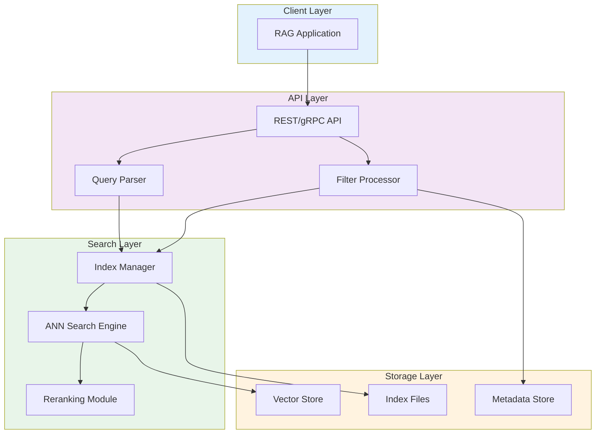
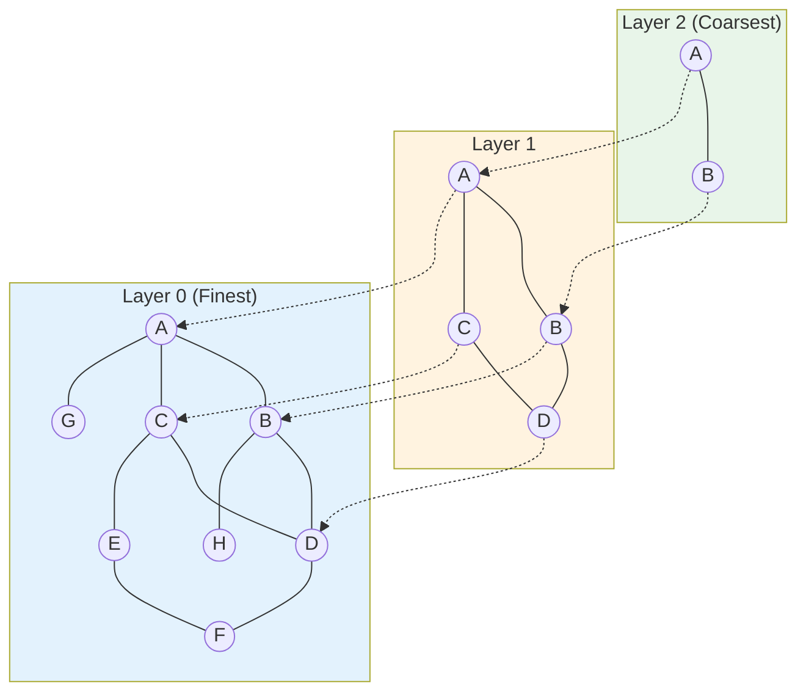
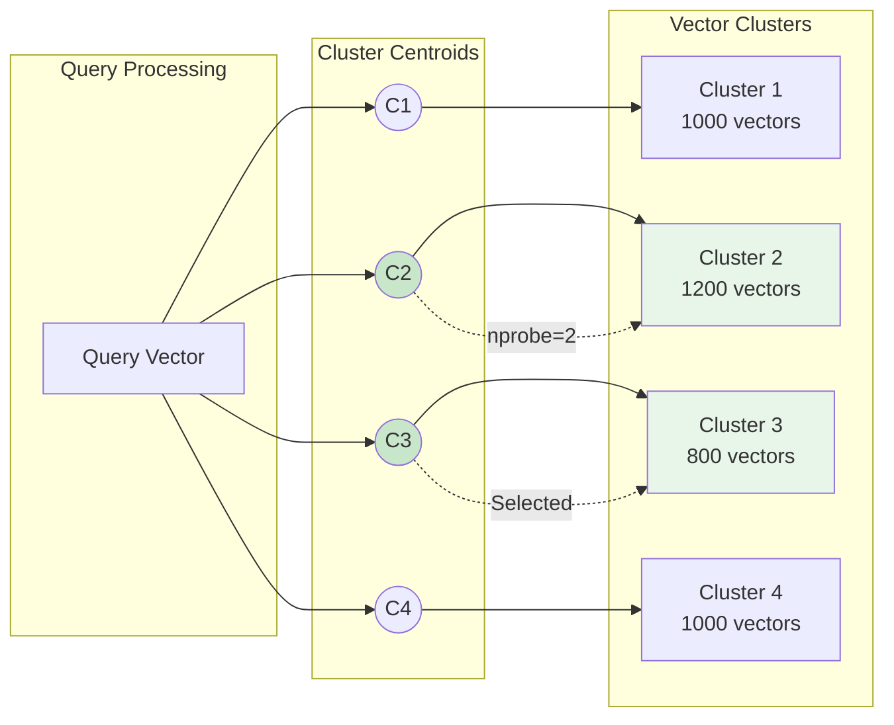
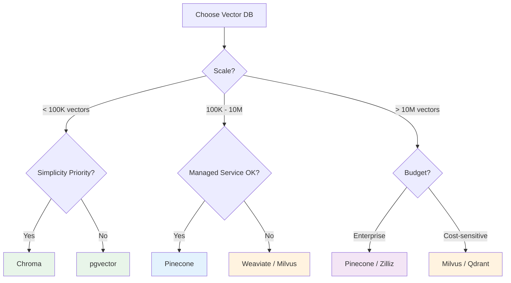

# Vector Databases

Vector databases are purpose-built storage systems optimized for high-dimensional vector similarity search. This module covers the major vector database options, indexing algorithms, and implementation patterns essential for building production RAG systems.

## Learning Objectives

- **Understand vector database architecture** and how it differs from traditional databases
- **Compare major vector databases** (Pinecone, Weaviate, Chroma, pgvector) and their tradeoffs
- **Implement efficient indexing strategies** using HNSW, IVF, and hybrid approaches
- **Design for scale** with partitioning, sharding, and performance optimization
- **Choose the right solution** based on use case requirements

## Vector Database Architecture



### Core Operations

```python
from dataclasses import dataclass
from typing import List, Dict, Any, Optional
import numpy as np

@dataclass
class VectorRecord:
    """Standard vector record structure."""
    id: str
    vector: np.ndarray
    metadata: Dict[str, Any]
    text: Optional[str] = None

class VectorDBInterface:
    """Abstract interface for vector databases."""

    def upsert(self, records: List[VectorRecord]) -> None:
        """Insert or update vectors with metadata."""
        raise NotImplementedError

    def search(
        self,
        query_vector: np.ndarray,
        top_k: int = 10,
        filter: Optional[Dict] = None,
        include_metadata: bool = True
    ) -> List[Dict]:
        """Search for similar vectors with optional filtering."""
        raise NotImplementedError

    def delete(self, ids: List[str]) -> None:
        """Delete vectors by ID."""
        raise NotImplementedError

    def update_metadata(self, id: str, metadata: Dict) -> None:
        """Update metadata for existing vector."""
        raise NotImplementedError
```

## Major Vector Databases

### Pinecone (Managed Service)

```python
from pinecone import Pinecone, ServerlessSpec

class PineconeClient:
    """Pinecone vector database implementation."""

    def __init__(
        self,
        api_key: str,
        index_name: str,
        dimension: int = 1536,
        metric: str = "cosine"
    ):
        self.pc = Pinecone(api_key=api_key)

        # Create index if not exists
        if index_name not in self.pc.list_indexes().names():
            self.pc.create_index(
                name=index_name,
                dimension=dimension,
                metric=metric,
                spec=ServerlessSpec(
                    cloud="aws",
                    region="us-east-1"
                )
            )

        self.index = self.pc.Index(index_name)

    def upsert(self, records: List[VectorRecord], namespace: str = "") -> None:
        """Upsert vectors with batching."""
        batch_size = 100
        vectors = [
            {
                "id": r.id,
                "values": r.vector.tolist(),
                "metadata": r.metadata
            }
            for r in records
        ]

        for i in range(0, len(vectors), batch_size):
            batch = vectors[i:i + batch_size]
            self.index.upsert(vectors=batch, namespace=namespace)

    def search(
        self,
        query_vector: np.ndarray,
        top_k: int = 10,
        filter: Optional[Dict] = None,
        namespace: str = ""
    ) -> List[Dict]:
        """Search with optional metadata filtering."""
        results = self.index.query(
            vector=query_vector.tolist(),
            top_k=top_k,
            filter=filter,
            include_metadata=True,
            namespace=namespace
        )

        return [
            {
                "id": match.id,
                "score": match.score,
                "metadata": match.metadata
            }
            for match in results.matches
        ]

    def delete_by_filter(self, filter: Dict, namespace: str = "") -> None:
        """Delete vectors matching filter criteria."""
        self.index.delete(filter=filter, namespace=namespace)


# Usage example
client = PineconeClient(
    api_key="your-api-key",
    index_name="rag-documents",
    dimension=1536,
    metric="cosine"
)

# Upsert with metadata
records = [
    VectorRecord(
        id="doc_1",
        vector=np.random.randn(1536),
        metadata={"source": "manual", "category": "setup", "date": "2024-01-15"}
    )
]
client.upsert(records, namespace="product-docs")

# Search with filter
results = client.search(
    query_vector=np.random.randn(1536),
    top_k=5,
    filter={"category": {"$eq": "setup"}},
    namespace="product-docs"
)
```

### Weaviate (Open Source / Managed)

```python
import weaviate
from weaviate.classes.config import Configure, Property, DataType

class WeaviateClient:
    """Weaviate vector database with schema management."""

    def __init__(self, url: str = "http://localhost:8080"):
        self.client = weaviate.connect_to_local()  # or connect_to_weaviate_cloud

    def create_collection(
        self,
        name: str,
        dimension: int = 1536,
        distance_metric: str = "cosine"
    ):
        """Create collection with HNSW index configuration."""
        self.client.collections.create(
            name=name,
            vectorizer_config=Configure.Vectorizer.none(),
            vector_index_config=Configure.VectorIndex.hnsw(
                distance_metric=getattr(
                    Configure.VectorIndex.DistanceMetric,
                    distance_metric.upper()
                ),
                ef_construction=128,
                max_connections=16,
                ef=64
            ),
            properties=[
                Property(name="text", data_type=DataType.TEXT),
                Property(name="source", data_type=DataType.TEXT),
                Property(name="category", data_type=DataType.TEXT),
                Property(name="chunk_index", data_type=DataType.INT),
            ]
        )

    def upsert(self, collection_name: str, records: List[VectorRecord]) -> None:
        """Insert vectors with data objects."""
        collection = self.client.collections.get(collection_name)

        with collection.batch.dynamic() as batch:
            for record in records:
                batch.add_object(
                    properties={
                        "text": record.text,
                        **record.metadata
                    },
                    vector=record.vector.tolist(),
                    uuid=record.id
                )

    def search(
        self,
        collection_name: str,
        query_vector: np.ndarray,
        top_k: int = 10,
        filter_conditions: Optional[Dict] = None
    ) -> List[Dict]:
        """Vector search with optional filtering."""
        collection = self.client.collections.get(collection_name)

        query_builder = collection.query.near_vector(
            near_vector=query_vector.tolist(),
            limit=top_k,
            return_metadata=["distance"]
        )

        if filter_conditions:
            # Add filter (Weaviate uses Where filters)
            pass  # Filter syntax varies by version

        results = query_builder.objects

        return [
            {
                "id": str(obj.uuid),
                "score": 1 - obj.metadata.distance,  # Convert distance to score
                "metadata": obj.properties
            }
            for obj in results
        ]

    def hybrid_search(
        self,
        collection_name: str,
        query: str,
        query_vector: np.ndarray,
        top_k: int = 10,
        alpha: float = 0.5
    ) -> List[Dict]:
        """Combine BM25 keyword search with vector search."""
        collection = self.client.collections.get(collection_name)

        results = collection.query.hybrid(
            query=query,
            vector=query_vector.tolist(),
            alpha=alpha,  # 0 = pure BM25, 1 = pure vector
            limit=top_k
        )

        return [
            {
                "id": str(obj.uuid),
                "score": obj.metadata.score,
                "metadata": obj.properties
            }
            for obj in results.objects
        ]
```

### Chroma (Lightweight / Local)

```python
import chromadb
from chromadb.config import Settings

class ChromaClient:
    """Chroma for local development and small-scale deployments."""

    def __init__(self, persist_directory: str = "./chroma_db"):
        self.client = chromadb.PersistentClient(
            path=persist_directory,
            settings=Settings(
                anonymized_telemetry=False
            )
        )

    def get_or_create_collection(
        self,
        name: str,
        distance_fn: str = "cosine"
    ):
        """Get or create a collection."""
        return self.client.get_or_create_collection(
            name=name,
            metadata={"hnsw:space": distance_fn}
        )

    def upsert(
        self,
        collection_name: str,
        records: List[VectorRecord]
    ) -> None:
        """Upsert documents with embeddings."""
        collection = self.get_or_create_collection(collection_name)

        collection.upsert(
            ids=[r.id for r in records],
            embeddings=[r.vector.tolist() for r in records],
            metadatas=[r.metadata for r in records],
            documents=[r.text for r in records] if records[0].text else None
        )

    def search(
        self,
        collection_name: str,
        query_vector: np.ndarray,
        top_k: int = 10,
        where: Optional[Dict] = None,
        where_document: Optional[Dict] = None
    ) -> List[Dict]:
        """Query with optional metadata and document filtering."""
        collection = self.get_or_create_collection(collection_name)

        results = collection.query(
            query_embeddings=[query_vector.tolist()],
            n_results=top_k,
            where=where,
            where_document=where_document,
            include=["documents", "metadatas", "distances"]
        )

        return [
            {
                "id": results["ids"][0][i],
                "score": 1 - results["distances"][0][i],
                "metadata": results["metadatas"][0][i],
                "document": results["documents"][0][i] if results["documents"] else None
            }
            for i in range(len(results["ids"][0]))
        ]


# Usage - great for prototyping
client = ChromaClient("./my_rag_db")

records = [
    VectorRecord(
        id="1",
        vector=np.random.randn(384),
        metadata={"category": "faq"},
        text="How do I reset my password?"
    )
]

client.upsert("support_docs", records)

results = client.search(
    "support_docs",
    query_vector=np.random.randn(384),
    top_k=5,
    where={"category": "faq"}
)
```

### pgvector (PostgreSQL Extension)

```python
import psycopg2
from pgvector.psycopg2 import register_vector
import numpy as np

class PgVectorClient:
    """PostgreSQL with pgvector for hybrid SQL + vector workloads."""

    def __init__(self, connection_string: str):
        self.conn = psycopg2.connect(connection_string)
        register_vector(self.conn)

    def setup_table(self, table_name: str, dimension: int = 1536):
        """Create table with vector column and index."""
        with self.conn.cursor() as cur:
            # Enable extension
            cur.execute("CREATE EXTENSION IF NOT EXISTS vector")

            # Create table
            cur.execute(f"""
                CREATE TABLE IF NOT EXISTS {table_name} (
                    id TEXT PRIMARY KEY,
                    embedding vector({dimension}),
                    content TEXT,
                    metadata JSONB,
                    created_at TIMESTAMP DEFAULT CURRENT_TIMESTAMP
                )
            """)

            # Create HNSW index for fast similarity search
            cur.execute(f"""
                CREATE INDEX IF NOT EXISTS {table_name}_embedding_idx
                ON {table_name}
                USING hnsw (embedding vector_cosine_ops)
                WITH (m = 16, ef_construction = 64)
            """)

            self.conn.commit()

    def upsert(self, table_name: str, records: List[VectorRecord]) -> None:
        """Upsert with ON CONFLICT."""
        with self.conn.cursor() as cur:
            for record in records:
                cur.execute(f"""
                    INSERT INTO {table_name} (id, embedding, content, metadata)
                    VALUES (%s, %s, %s, %s)
                    ON CONFLICT (id) DO UPDATE SET
                        embedding = EXCLUDED.embedding,
                        content = EXCLUDED.content,
                        metadata = EXCLUDED.metadata
                """, (
                    record.id,
                    record.vector.tolist(),
                    record.text,
                    psycopg2.extras.Json(record.metadata)
                ))
            self.conn.commit()

    def search(
        self,
        table_name: str,
        query_vector: np.ndarray,
        top_k: int = 10,
        metadata_filter: Optional[str] = None
    ) -> List[Dict]:
        """Vector similarity search with optional SQL filtering."""
        with self.conn.cursor() as cur:
            filter_clause = f"WHERE {metadata_filter}" if metadata_filter else ""

            cur.execute(f"""
                SELECT
                    id,
                    content,
                    metadata,
                    1 - (embedding <=> %s) as score
                FROM {table_name}
                {filter_clause}
                ORDER BY embedding <=> %s
                LIMIT %s
            """, (query_vector.tolist(), query_vector.tolist(), top_k))

            results = cur.fetchall()

            return [
                {
                    "id": row[0],
                    "content": row[1],
                    "metadata": row[2],
                    "score": row[3]
                }
                for row in results
            ]

    def hybrid_search(
        self,
        table_name: str,
        query: str,
        query_vector: np.ndarray,
        top_k: int = 10,
        semantic_weight: float = 0.7
    ) -> List[Dict]:
        """Combine full-text search with vector search using RRF."""
        with self.conn.cursor() as cur:
            cur.execute(f"""
                WITH semantic AS (
                    SELECT id, ROW_NUMBER() OVER (
                        ORDER BY embedding <=> %s
                    ) as rank
                    FROM {table_name}
                    LIMIT 50
                ),
                keyword AS (
                    SELECT id, ROW_NUMBER() OVER (
                        ORDER BY ts_rank(
                            to_tsvector('english', content),
                            plainto_tsquery('english', %s)
                        ) DESC
                    ) as rank
                    FROM {table_name}
                    WHERE to_tsvector('english', content) @@
                          plainto_tsquery('english', %s)
                    LIMIT 50
                ),
                rrf AS (
                    SELECT
                        COALESCE(s.id, k.id) as id,
                        COALESCE(1.0 / (60 + s.rank), 0) * %s +
                        COALESCE(1.0 / (60 + k.rank), 0) * %s as score
                    FROM semantic s
                    FULL OUTER JOIN keyword k ON s.id = k.id
                )
                SELECT r.id, t.content, t.metadata, r.score
                FROM rrf r
                JOIN {table_name} t ON r.id = t.id
                ORDER BY r.score DESC
                LIMIT %s
            """, (
                query_vector.tolist(),
                query, query,
                semantic_weight,
                1 - semantic_weight,
                top_k
            ))

            return [
                {"id": row[0], "content": row[1], "metadata": row[2], "score": row[3]}
                for row in cur.fetchall()
            ]
```

::: info pgvector Benefits
pgvector is excellent when you:
- Already use PostgreSQL and want to avoid new infrastructure
- Need ACID transactions on vector + relational data
- Want to combine SQL filters with vector search
- Have <10M vectors (scales reasonably well)
:::

## Indexing Algorithms

### HNSW (Hierarchical Navigable Small World)



```python
class HNSWParameters:
    """HNSW index configuration parameters."""

    def __init__(
        self,
        m: int = 16,              # Max connections per node
        ef_construction: int = 100,  # Build-time beam width
        ef_search: int = 50       # Query-time beam width
    ):
        """
        HNSW tuning parameters:

        M (max connections):
        - Higher M = better recall, more memory, slower build
        - Typical range: 8-64
        - Default 16 works for most cases

        ef_construction (build beam width):
        - Higher = better index quality, slower build
        - Typical range: 64-512
        - Should be >= M

        ef_search (query beam width):
        - Higher = better recall, slower queries
        - Typical range: 16-512
        - Tune based on recall requirements
        """
        self.m = m
        self.ef_construction = ef_construction
        self.ef_search = ef_search

    def memory_estimate(self, num_vectors: int, dimensions: int) -> str:
        """Estimate memory requirements."""
        # Vector storage
        vector_bytes = num_vectors * dimensions * 4  # float32

        # Graph storage (approximate)
        # Each node has ~2*M connections on average
        graph_bytes = num_vectors * 2 * self.m * 8  # 8 bytes per edge

        total_gb = (vector_bytes + graph_bytes) / (1024**3)
        return f"Estimated memory: {total_gb:.2f} GB"
```

### IVF (Inverted File Index)



```python
class IVFParameters:
    """IVF index configuration."""

    def __init__(
        self,
        nlist: int = 100,    # Number of clusters
        nprobe: int = 10     # Clusters to search
    ):
        """
        IVF tuning parameters:

        nlist (number of clusters):
        - sqrt(n) to 4*sqrt(n) where n = number of vectors
        - More clusters = faster search, lower recall
        - Fewer clusters = slower search, higher recall

        nprobe (clusters to search):
        - Higher = better recall, slower search
        - Typical: 1-10% of nlist
        - Start with nlist/10, tune based on recall needs
        """
        self.nlist = nlist
        self.nprobe = nprobe

    @staticmethod
    def recommend_nlist(num_vectors: int) -> int:
        """Recommend nlist based on dataset size."""
        import math
        # Common heuristic: sqrt(n) to 4*sqrt(n)
        sqrt_n = int(math.sqrt(num_vectors))
        return max(100, min(sqrt_n * 2, 65536))
```

### Index Selection Guide

| Index Type | Best For | Memory | Build Time | Query Time | Recall |
|------------|----------|--------|------------|------------|--------|
| **Flat (Brute Force)** | <10K vectors | O(n*d) | O(n) | O(n) | 100% |
| **IVF-Flat** | 10K-1M vectors | O(n*d) | O(n*k) | O(n/nlist) | 95-99% |
| **HNSW** | 100K-100M vectors | O(n*M*d) | O(n*log(n)) | O(log(n)) | 95-99% |
| **IVF-PQ** | >100M vectors | O(n*m) | O(n*k) | O(n/nlist) | 90-95% |

## Vector Database Comparison



### Detailed Comparison

| Feature | Pinecone | Weaviate | Chroma | pgvector |
|---------|----------|----------|--------|----------|
| **Type** | Managed | Open/Managed | Open Source | Extension |
| **Max Scale** | Billions | 100M+ | 1M | 10M |
| **Hybrid Search** | Via sparse vectors | Native | No | Via FTS |
| **Filtering** | Excellent | Good | Basic | SQL (Excellent) |
| **ACID** | No | No | No | Yes |
| **Latency (p99)** | <50ms | <100ms | <10ms* | <50ms* |
| **Setup Effort** | Minutes | Hours | Minutes | Hours |
| **Cost** | $$$  | $ (self-hosted) | Free | $ (Postgres) |
| **Best For** | Production SaaS | Feature-rich | Prototyping | Existing Postgres |

*Local deployment latency

## Performance Optimization

```python
class VectorDBOptimizer:
    """Optimization strategies for vector databases."""

    @staticmethod
    def batch_operations(records: List[VectorRecord], batch_size: int = 100):
        """Batch upserts for better throughput."""
        for i in range(0, len(records), batch_size):
            yield records[i:i + batch_size]

    @staticmethod
    def optimize_ef_search(
        target_recall: float,
        baseline_ef: int = 50
    ) -> int:
        """
        Tune ef_search for HNSW based on recall target.

        Higher ef = better recall but slower queries.
        """
        # Empirical relationship (varies by dataset)
        ef_multipliers = {
            0.90: 0.5,
            0.95: 1.0,
            0.98: 2.0,
            0.99: 4.0,
        }

        for recall, multiplier in sorted(ef_multipliers.items()):
            if target_recall <= recall:
                return int(baseline_ef * multiplier)

        return baseline_ef * 8  # For very high recall

    @staticmethod
    def estimate_index_params(
        num_vectors: int,
        dimension: int,
        memory_budget_gb: float
    ) -> Dict:
        """Recommend index parameters based on constraints."""
        import math

        vector_size_gb = (num_vectors * dimension * 4) / (1024**3)

        if vector_size_gb > memory_budget_gb:
            # Need quantization (IVF-PQ or similar)
            return {
                "index_type": "IVF_PQ",
                "nlist": int(math.sqrt(num_vectors)) * 4,
                "m": 32,  # PQ subquantizers
                "nbits": 8
            }
        else:
            # HNSW fits in memory
            return {
                "index_type": "HNSW",
                "M": 16,
                "ef_construction": 200,
                "ef_search": 64
            }
```

## Interview Q&A

### Q1: How would you design a vector database solution for 100 million documents with sub-100ms latency requirements?

**Strong Answer:**

For 100M documents with strict latency requirements, I'd design a multi-tier architecture:

**1. Index Selection:**
- Use HNSW for the primary index (best latency/recall tradeoff at scale)
- Configure M=32, ef_construction=200 for high-quality index
- Tune ef_search based on recall requirements (start at 128)

**2. Partitioning Strategy:**
```python
# Partition by tenant/category for data isolation
partitions = {
    "tenant_a": Index(vectors_a),
    "tenant_b": Index(vectors_b),
}
# Or by time for temporal data
partitions = {
    "2024_q1": Index(...),
    "2024_q2": Index(...),
}
```

**3. Caching Layer:**
- Cache frequently accessed vectors in Redis
- Cache query embeddings for repeated queries
- Implement query result caching with TTL

**4. Infrastructure:**
- Use managed service (Pinecone) or horizontally sharded Milvus
- Replicate for read scaling
- Place vector DB close to application (same region)

**5. Quantization (if memory constrained):**
- Product Quantization reduces memory 4-8x with ~5% recall loss
- Binary quantization for extreme compression

---

### Q2: Explain the tradeoffs between HNSW and IVF indexing algorithms.

**Strong Answer:**

| Aspect | HNSW | IVF |
|--------|------|-----|
| **Build Time** | O(n log n) - slower | O(n * k) - faster |
| **Query Time** | O(log n) - faster | O(n/nlist * nprobe) |
| **Memory** | Higher (graph structure) | Lower (just centroids) |
| **Update** | Supports incremental | Requires rebuild for centroids |
| **Recall** | Higher (typically 95-99%) | Lower (90-98%) |
| **Tuning** | Simpler (M, ef) | Complex (nlist, nprobe) |

**When to use HNSW:**
- Real-time applications needing <50ms latency
- Datasets that update frequently
- When memory is not the primary constraint
- Most RAG use cases

**When to use IVF:**
- Very large datasets (billions of vectors)
- Memory-constrained environments
- Batch processing acceptable
- Combined with PQ for compression

---

### Q3: How do you handle metadata filtering efficiently in vector databases?

**Strong Answer:**

Metadata filtering is crucial for multi-tenant RAG systems. Here are the approaches:

**1. Pre-filtering (Filter then Search):**
```python
# First filter to subset, then vector search
filtered_ids = get_ids_matching_filter(metadata_filter)
results = vector_search(query, top_k, id_filter=filtered_ids)
```
- Pro: Accurate filtering
- Con: Can be slow if filter is non-selective

**2. Post-filtering (Search then Filter):**
```python
# Search more candidates, filter after
results = vector_search(query, top_k=100)
filtered = [r for r in results if matches_filter(r, metadata_filter)]
return filtered[:10]
```
- Pro: Fast vector search
- Con: May miss relevant results

**3. Partitioned Indexes:**
```python
# Separate index per partition
indexes = {
    "tenant_a": create_index(tenant_a_vectors),
    "tenant_b": create_index(tenant_b_vectors),
}
# Query only relevant partition
results = indexes[tenant_id].search(query, top_k)
```
- Pro: Best performance for partition-key filters
- Con: Management overhead

**4. Hybrid with Attribute Vectors:**
- Encode filterable attributes into the vector
- Let vector search handle both

**My recommendation:** Use database-native filtering (Pinecone, Weaviate handle this well). For custom solutions, partition by high-cardinality filters (tenant, date range) and post-filter for low-cardinality attributes.

---

### Q4: What's your approach to migrating from one vector database to another?

**Strong Answer:**

Vector DB migration requires careful planning:

**1. Pre-Migration Analysis:**
```python
# Audit current state
current_state = {
    "total_vectors": index.describe_index_stats(),
    "namespaces": list_namespaces(),
    "metadata_schema": infer_schema(sample_records),
    "query_patterns": analyze_query_logs(),
}
```

**2. Dual-Write Phase:**
```python
class DualWriteClient:
    def upsert(self, records):
        self.old_db.upsert(records)
        self.new_db.upsert(records)  # Async OK

    def search(self, query):
        return self.old_db.search(query)  # Still read from old
```

**3. Shadow Testing:**
```python
# Compare results between old and new
for query in sample_queries:
    old_results = old_db.search(query)
    new_results = new_db.search(query)
    overlap = calculate_overlap(old_results, new_results)
    log_comparison(query, overlap)
```

**4. Cutover Strategy:**
- **Big Bang:** Simple, but risky. Good for small datasets.
- **Gradual:** Route percentage of traffic to new DB, increase over time.
- **Blue-Green:** Full copy, instant switch with rollback capability.

**5. Post-Migration Validation:**
- Monitor latency percentiles
- Compare retrieval quality metrics
- Verify metadata filtering behavior
- Check cost alignment with projections

## Summary Table

| Aspect | Key Points |
|--------|------------|
| **Architecture** | Index, storage, and search layers optimized for vectors |
| **Pinecone** | Best managed option, excellent filtering, scales well |
| **Weaviate** | Feature-rich, native hybrid search, good self-hosted option |
| **Chroma** | Perfect for prototyping, simple API, lightweight |
| **pgvector** | Best when already using Postgres, ACID support |
| **HNSW** | Best general-purpose index, O(log n) queries |
| **IVF** | Memory-efficient for large scale, combine with PQ |
| **Optimization** | Batch operations, tune ef_search, partition strategically |

## Sources

- [Pinecone Documentation](https://docs.pinecone.io/)
- [Weaviate Documentation](https://weaviate.io/developers/weaviate)
- [Chroma Documentation](https://docs.trychroma.com/)
- [pgvector GitHub](https://github.com/pgvector/pgvector)
- [HNSW Paper](https://arxiv.org/abs/1603.09320) - Malkov & Yashunin, 2018
- [Billion-Scale Similarity Search with GPUs](https://arxiv.org/abs/1702.08734) - Johnson et al., 2017
- [ANN Benchmarks](https://ann-benchmarks.com/)
