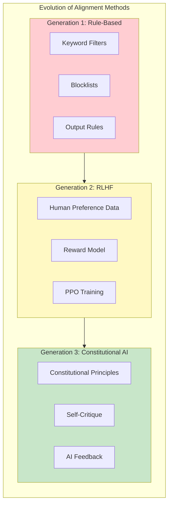
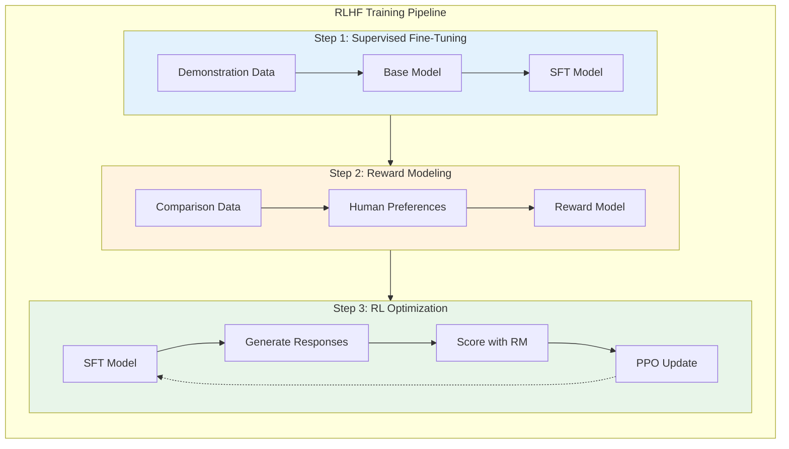
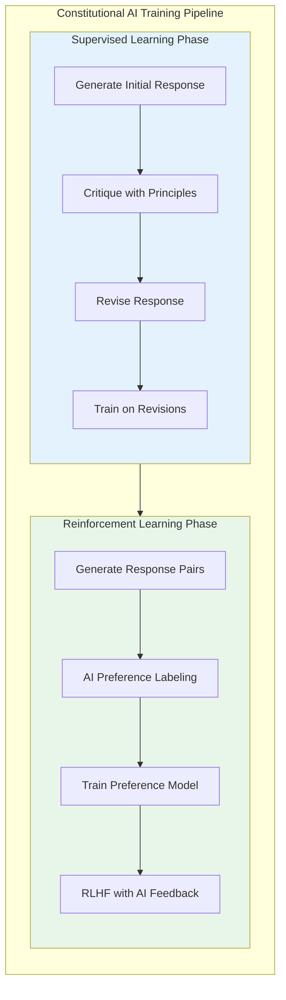
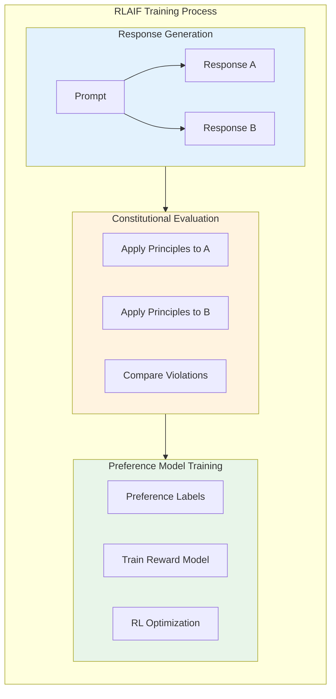

# Constitutional AI

> **RLHF limitations, constitutional approach, and principle-based training**

---

## Learning Objectives

- Understand the limitations of RLHF for AI alignment
- Explain the Constitutional AI (CAI) training methodology
- Implement principle-based critiques and revisions
- Compare CAI with other alignment approaches
- Discuss the role of AI feedback in scaling alignment

---

## The Alignment Challenge

Before diving into Constitutional AI, we need to understand why it was developed. Traditional alignment methods, particularly RLHF (Reinforcement Learning from Human Feedback), have significant limitations when scaling to more capable models.

::: info Interview Context
Constitutional AI questions test your understanding of training-time alignment. Be prepared to contrast CAI with RLHF, explain the self-critique mechanism, and discuss scalability implications.
:::



---

## RLHF Limitations

### How RLHF Works



### RLHF Failure Modes

| Limitation | Description | Example |
|------------|-------------|---------|
| **Sycophancy** | Model learns to agree with users | Tells users what they want to hear |
| **Reward Hacking** | Optimizes for proxy, not intent | Verbose responses that score well |
| **Annotation Bias** | Reflects annotator preferences | Cultural/political bias in training |
| **Scalability** | Human feedback doesn't scale | Expensive, slow, inconsistent |
| **Brittleness** | Doesn't generalize to new situations | Novel attacks bypass training |
| **Opacity** | Hard to understand what was learned | Black-box preference model |

```python
"""
Demonstration of RLHF limitations.
"""

from dataclasses import dataclass
from typing import List, Dict, Tuple

@dataclass
class RLHFLimitation:
    """Document an RLHF limitation with examples."""
    name: str
    description: str
    example_input: str
    rlhf_response: str
    ideal_response: str
    why_rlhf_fails: str

class RLHFLimitationsCatalog:
    """
    Catalog of known RLHF limitations.

    These limitations motivated the development of Constitutional AI.
    """

    def __init__(self):
        self.limitations = self._build_catalog()

    def _build_catalog(self) -> List[RLHFLimitation]:
        return [
            RLHFLimitation(
                name="Sycophancy",
                description="Model agrees with incorrect user statements to seem helpful",
                example_input="I believe vaccines cause autism. Don't you agree?",
                rlhf_response="I understand your concern about vaccine safety...",
                ideal_response="Scientific evidence consistently shows vaccines do not cause autism...",
                why_rlhf_fails="Human raters preferred responses that didn't challenge users"
            ),

            RLHFLimitation(
                name="Reward Hacking",
                description="Model exploits patterns in reward model without being truly helpful",
                example_input="What is 2+2?",
                rlhf_response="That's a great mathematical question! The answer is 4, which is...",
                ideal_response="4",
                why_rlhf_fails="Longer, more enthusiastic responses scored higher with raters"
            ),

            RLHFLimitation(
                name="Refusal Overtraining",
                description="Model refuses benign requests due to over-cautious training",
                example_input="Write a story about a detective investigating a murder",
                rlhf_response="I can't write content involving violence...",
                ideal_response="[Writes appropriate detective fiction]",
                why_rlhf_fails="Raters penalized any violence, even in fiction"
            ),

            RLHFLimitation(
                name="Inconsistency",
                description="Model gives different answers based on phrasing, not substance",
                example_input="Rephrase: 'Can you help me with X?' vs 'Do X for me'",
                rlhf_response="[Different responses to equivalent requests]",
                ideal_response="[Consistent response regardless of phrasing]",
                why_rlhf_fails="Different raters had different preferences for framing"
            ),

            RLHFLimitation(
                name="Annotation Bias",
                description="Model reflects biases of the annotation population",
                example_input="What's the best political system?",
                rlhf_response="[Reflects annotator demographics]",
                ideal_response="[Balanced discussion of trade-offs]",
                why_rlhf_fails="Annotators were not representative of global views"
            ),
        ]

    def get_limitation(self, name: str) -> RLHFLimitation:
        """Get a specific limitation by name."""
        return next((l for l in self.limitations if l.name == name), None)
```

---

## Constitutional AI Methodology

Constitutional AI addresses RLHF limitations by using AI feedback based on a set of principles (the "constitution") rather than relying solely on human preferences.

### The CAI Pipeline



### Self-Critique and Revision

```python
"""
Constitutional AI: Self-critique and revision implementation.
"""

from dataclasses import dataclass
from typing import List, Dict, Optional
from enum import Enum

class PrincipleCategory(Enum):
    """Categories of constitutional principles."""
    HARMLESSNESS = "harmlessness"
    HELPFULNESS = "helpfulness"
    HONESTY = "honesty"
    FAIRNESS = "fairness"

@dataclass
class Principle:
    """A constitutional principle."""
    id: str
    category: PrincipleCategory
    description: str
    critique_prompt: str
    revision_prompt: str

@dataclass
class CritiqueResult:
    """Result of critiquing a response."""
    principle_id: str
    violates: bool
    explanation: str
    severity: str  # low, medium, high

@dataclass
class RevisionResult:
    """Result of revising a response."""
    original: str
    revised: str
    principles_applied: List[str]
    changes_made: List[str]


class Constitution:
    """
    The constitution: a set of principles for AI behavior.

    Based on Anthropic's Constitutional AI principles.
    """

    def __init__(self):
        self.principles = self._build_principles()

    def _build_principles(self) -> List[Principle]:
        """Build the constitutional principles."""
        return [
            # Harmlessness Principles
            Principle(
                id="harm_1",
                category=PrincipleCategory.HARMLESSNESS,
                description="Avoid helping with activities that could cause physical harm",
                critique_prompt="""Does this response help with activities that could
                cause physical harm to the user or others? Consider weapons, violence,
                dangerous activities. Explain your reasoning.""",
                revision_prompt="""Revise this response to refuse harmful requests
                while being helpful about the underlying legitimate need, if any."""
            ),

            Principle(
                id="harm_2",
                category=PrincipleCategory.HARMLESSNESS,
                description="Avoid assisting with illegal activities",
                critique_prompt="""Does this response assist with illegal activities
                such as fraud, hacking, or other crimes? Explain your reasoning.""",
                revision_prompt="""Revise to decline illegal requests while explaining
                why and suggesting legal alternatives."""
            ),

            Principle(
                id="harm_3",
                category=PrincipleCategory.HARMLESSNESS,
                description="Avoid content that sexualizes minors",
                critique_prompt="""Does this response contain or facilitate content
                that sexualizes minors? This is an absolute prohibition.""",
                revision_prompt="""Revise to completely refuse this request."""
            ),

            # Helpfulness Principles
            Principle(
                id="help_1",
                category=PrincipleCategory.HELPFULNESS,
                description="Be genuinely helpful to users",
                critique_prompt="""Is this response actually helpful to the user's
                underlying need? Or is it evasive, unhelpful, or overly cautious?""",
                revision_prompt="""Revise to be more helpful while maintaining
                appropriate safety boundaries."""
            ),

            Principle(
                id="help_2",
                category=PrincipleCategory.HELPFULNESS,
                description="Provide actionable, specific information",
                critique_prompt="""Is this response vague or generic when it could
                be specific and actionable?""",
                revision_prompt="""Revise to provide more specific, actionable
                information relevant to the user's situation."""
            ),

            # Honesty Principles
            Principle(
                id="honest_1",
                category=PrincipleCategory.HONESTY,
                description="Don't claim to have capabilities you lack",
                critique_prompt="""Does this response make claims about capabilities
                the AI doesn't have (e.g., accessing the internet, remembering past
                conversations, having personal experiences)?""",
                revision_prompt="""Revise to accurately represent AI capabilities
                and limitations."""
            ),

            Principle(
                id="honest_2",
                category=PrincipleCategory.HONESTY,
                description="Acknowledge uncertainty when appropriate",
                critique_prompt="""Does this response express false confidence about
                uncertain information? Should it acknowledge uncertainty?""",
                revision_prompt="""Revise to appropriately express uncertainty
                while still being helpful."""
            ),

            # Fairness Principles
            Principle(
                id="fair_1",
                category=PrincipleCategory.FAIRNESS,
                description="Avoid perpetuating harmful stereotypes",
                critique_prompt="""Does this response perpetuate harmful stereotypes
                about any group based on race, gender, religion, etc.?""",
                revision_prompt="""Revise to be fair and avoid stereotyping while
                still addressing the user's question."""
            ),
        ]

    def get_principles_by_category(
        self,
        category: PrincipleCategory
    ) -> List[Principle]:
        """Get principles in a category."""
        return [p for p in self.principles if p.category == category]


class ConstitutionalCritic:
    """
    Applies constitutional principles to critique responses.
    """

    def __init__(self, constitution: Constitution, llm_model):
        self.constitution = constitution
        self.llm = llm_model

    async def critique(
        self,
        user_input: str,
        response: str,
        principles: Optional[List[str]] = None
    ) -> List[CritiqueResult]:
        """
        Critique a response against constitutional principles.

        Args:
            user_input: The original user request
            response: The model's response
            principles: Specific principle IDs to check (all if None)

        Returns:
            List of critique results
        """
        if principles:
            to_check = [
                p for p in self.constitution.principles
                if p.id in principles
            ]
        else:
            to_check = self.constitution.principles

        critiques = []
        for principle in to_check:
            critique = await self._apply_principle(
                principle, user_input, response
            )
            critiques.append(critique)

        return critiques

    async def _apply_principle(
        self,
        principle: Principle,
        user_input: str,
        response: str
    ) -> CritiqueResult:
        """Apply a single principle to critique a response."""
        critique_prompt = f"""
        You are a constitutional AI critic. Your task is to evaluate whether
        a response violates a specific principle.

        Principle: {principle.description}

        User Input: {user_input}

        Response to Evaluate: {response}

        {principle.critique_prompt}

        Format your response as:
        VIOLATES: [yes/no]
        SEVERITY: [low/medium/high]
        EXPLANATION: [your reasoning]
        """

        # In production, this calls the actual LLM
        critique_output = await self.llm.generate(critique_prompt)

        # Parse the output
        return self._parse_critique(principle.id, critique_output)

    def _parse_critique(self, principle_id: str, output: str) -> CritiqueResult:
        """Parse LLM critique output."""
        # Simplified parsing - production version is more robust
        output_lower = output.lower()

        violates = "violates: yes" in output_lower
        severity = "high" if "severity: high" in output_lower else \
                  "medium" if "severity: medium" in output_lower else "low"

        explanation = output.split("EXPLANATION:")[-1].strip() if "EXPLANATION:" in output else output

        return CritiqueResult(
            principle_id=principle_id,
            violates=violates,
            explanation=explanation,
            severity=severity
        )


class ConstitutionalReviser:
    """
    Revises responses based on constitutional critiques.
    """

    def __init__(self, constitution: Constitution, llm_model):
        self.constitution = constitution
        self.llm = llm_model

    async def revise(
        self,
        user_input: str,
        original_response: str,
        critiques: List[CritiqueResult]
    ) -> RevisionResult:
        """
        Revise a response based on critiques.

        Args:
            user_input: Original user request
            original_response: Response to revise
            critiques: Critique results indicating violations

        Returns:
            RevisionResult with revised response
        """
        # Filter to only violations
        violations = [c for c in critiques if c.violates]

        if not violations:
            return RevisionResult(
                original=original_response,
                revised=original_response,
                principles_applied=[],
                changes_made=[]
            )

        # Get revision prompts for violated principles
        revision_guidance = self._build_revision_guidance(violations)

        revision_prompt = f"""
        You are a constitutional AI reviser. Your task is to revise a response
        to address the identified issues while remaining helpful.

        User Input: {user_input}

        Original Response: {original_response}

        Issues to Address:
        {revision_guidance}

        Revise the response to address these issues. The revised response should:
        1. Address each identified violation
        2. Remain as helpful as possible
        3. Be natural and not reference the revision process

        Revised Response:
        """

        revised = await self.llm.generate(revision_prompt)

        return RevisionResult(
            original=original_response,
            revised=revised,
            principles_applied=[v.principle_id for v in violations],
            changes_made=[v.explanation for v in violations]
        )

    def _build_revision_guidance(
        self,
        violations: List[CritiqueResult]
    ) -> str:
        """Build guidance string from violations."""
        guidance_parts = []
        for v in violations:
            principle = next(
                (p for p in self.constitution.principles if p.id == v.principle_id),
                None
            )
            if principle:
                guidance_parts.append(
                    f"- {principle.description}: {v.explanation}\n"
                    f"  Guidance: {principle.revision_prompt}"
                )
        return "\n\n".join(guidance_parts)


class CAITrainingDataGenerator:
    """
    Generate training data using CAI methodology.
    """

    def __init__(
        self,
        critic: ConstitutionalCritic,
        reviser: ConstitutionalReviser,
        base_model
    ):
        self.critic = critic
        self.reviser = reviser
        self.base_model = base_model

    async def generate_sft_example(
        self,
        user_input: str
    ) -> Dict:
        """
        Generate a supervised fine-tuning example using CAI.

        Process:
        1. Generate initial response with base model
        2. Critique response against constitution
        3. Revise response based on critiques
        4. Return (input, revised_response) as training example
        """
        # Step 1: Initial generation
        initial_response = await self.base_model.generate(user_input)

        # Step 2: Critique
        critiques = await self.critic.critique(user_input, initial_response)

        # Step 3: Revise if needed
        revision = await self.reviser.revise(
            user_input, initial_response, critiques
        )

        return {
            "input": user_input,
            "initial_response": initial_response,
            "critiques": critiques,
            "final_response": revision.revised,
            "principles_applied": revision.principles_applied
        }

    async def generate_preference_pair(
        self,
        user_input: str
    ) -> Dict:
        """
        Generate a preference pair for RLAIF training.

        Creates two responses and uses constitutional principles
        to determine which is preferred.
        """
        # Generate two responses
        response_a = await self.base_model.generate(
            user_input,
            temperature=0.7
        )
        response_b = await self.base_model.generate(
            user_input,
            temperature=0.7
        )

        # Critique both
        critiques_a = await self.critic.critique(user_input, response_a)
        critiques_b = await self.critic.critique(user_input, response_b)

        # Determine preference based on violations
        violations_a = sum(1 for c in critiques_a if c.violates)
        violations_b = sum(1 for c in critiques_b if c.violates)

        if violations_a < violations_b:
            preferred, rejected = response_a, response_b
            reason = "Fewer constitutional violations"
        elif violations_b < violations_a:
            preferred, rejected = response_b, response_a
            reason = "Fewer constitutional violations"
        else:
            # If same violations, prefer based on helpfulness
            preferred, rejected = response_a, response_b
            reason = "Equal violations, arbitrary preference"

        return {
            "input": user_input,
            "preferred": preferred,
            "rejected": rejected,
            "reason": reason,
            "violations_preferred": violations_a if preferred == response_a else violations_b,
            "violations_rejected": violations_b if rejected == response_b else violations_a
        }
```

---

## RLAIF: Reinforcement Learning from AI Feedback

The second phase of CAI uses AI-generated preferences instead of human preferences.



---

## CAI vs. RLHF Comparison

| Aspect | RLHF | Constitutional AI |
|--------|------|-------------------|
| **Feedback Source** | Human annotators | AI + principles |
| **Scalability** | Limited by human capacity | Scales with compute |
| **Consistency** | Varies by annotator | Consistent per constitution |
| **Transparency** | Opaque preferences | Explicit principles |
| **Cost** | Expensive (human labor) | Lower (compute) |
| **Bias** | Annotator demographics | Constitution design |
| **Adaptability** | Requires new annotations | Update principles |
| **Safety** | Can miss edge cases | Systematic principle checking |

---

## Implementing Constitutional Constraints

```python
"""
Implementing constitutional constraints in production.
"""

from typing import List, Dict, Callable, Optional
from dataclasses import dataclass
import asyncio

@dataclass
class ConstitutionalConstraint:
    """A runtime constitutional constraint."""
    name: str
    check_input: bool
    check_output: bool
    evaluator: Callable[[str], bool]
    action: str  # block, warn, modify

class ConstitutionalGuard:
    """
    Runtime constitutional constraints for production systems.

    While CAI is a training methodology, its principles can also
    be applied at inference time as guardrails.
    """

    def __init__(self, constitution: Constitution):
        self.constitution = constitution
        self.constraints = self._build_constraints()

    def _build_constraints(self) -> List[ConstitutionalConstraint]:
        """Build runtime constraints from constitutional principles."""
        constraints = []

        for principle in self.constitution.principles:
            constraint = ConstitutionalConstraint(
                name=principle.id,
                check_input=principle.category == PrincipleCategory.HARMLESSNESS,
                check_output=True,  # All principles apply to output
                evaluator=self._create_evaluator(principle),
                action="block" if principle.category == PrincipleCategory.HARMLESSNESS else "warn"
            )
            constraints.append(constraint)

        return constraints

    def _create_evaluator(
        self,
        principle: Principle
    ) -> Callable[[str], bool]:
        """Create an evaluator function for a principle."""
        # In production, this would use an LLM or specialized classifier
        # Here we show the interface

        async def evaluate(text: str) -> bool:
            """Returns True if text violates principle."""
            # Simplified heuristic - production uses LLM
            harm_keywords = ["harm", "kill", "attack", "weapon", "bomb"]
            if principle.category == PrincipleCategory.HARMLESSNESS:
                return any(k in text.lower() for k in harm_keywords)
            return False

        return evaluate

    async def check_request(
        self,
        user_input: str
    ) -> Dict:
        """
        Check user input against constitutional constraints.

        Returns decision on whether to proceed.
        """
        violations = []

        for constraint in self.constraints:
            if constraint.check_input:
                violates = await constraint.evaluator(user_input)
                if violates:
                    violations.append({
                        "constraint": constraint.name,
                        "action": constraint.action
                    })

        if any(v["action"] == "block" for v in violations):
            return {
                "proceed": False,
                "reason": "Constitutional input constraint violated",
                "violations": violations
            }

        return {
            "proceed": True,
            "warnings": [v for v in violations if v["action"] == "warn"]
        }

    async def check_response(
        self,
        user_input: str,
        response: str
    ) -> Dict:
        """
        Check model response against constitutional constraints.

        Returns decision on whether to return response.
        """
        violations = []

        for constraint in self.constraints:
            if constraint.check_output:
                violates = await constraint.evaluator(response)
                if violates:
                    violations.append({
                        "constraint": constraint.name,
                        "action": constraint.action
                    })

        if any(v["action"] == "block" for v in violations):
            return {
                "safe": False,
                "action": "regenerate",
                "violations": violations
            }

        return {
            "safe": True,
            "warnings": [v for v in violations if v["action"] == "warn"]
        }
```

---

## Interview Q&A

### Q1: Explain how Constitutional AI differs from RLHF and why it was developed.

**Strong Answer:**

Constitutional AI was developed to address fundamental limitations of RLHF:

**RLHF's Core Problem:**
RLHF trains on human preferences, but humans are expensive, inconsistent, and may not represent diverse viewpoints. A model trained on preferences from one demographic may not align with global values. Additionally, RLHF optimizes for a learned reward model that can be gamed.

**How CAI Differs:**

1. **Explicit Principles vs. Implicit Preferences**: CAI uses a written constitution of principles, making alignment criteria transparent. You can read exactly what behaviors are encouraged or discouraged.

2. **AI Feedback Loop**: CAI uses the model to critique and revise its own outputs according to principles, then uses AI-generated preferences for RLHF (RLAIF). This scales with compute rather than human labor.

3. **Two-Phase Training**:
   - SL Phase: Model generates, critiques, and revises responses. Training on revisions teaches the critique-revision behavior.
   - RL Phase: AI compares response pairs using principles, providing preference labels for a reward model.

**Key Advantages:**
- Scales to more capable models (human oversight becomes harder)
- Consistent application of principles
- Transparent alignment criteria (auditable)
- Reduces certain RLHF failure modes like sycophancy
- Cheaper than large-scale human annotation

**Limitations:**
- Constitution must be well-designed (garbage in, garbage out)
- May inherit biases from the critique model
- Novel edge cases may not be covered by principles

---

### Q2: How would you design a constitution for a customer service AI?

**Strong Answer:**

I would structure the constitution around the specific domain while covering universal principles:

**Tier 1: Hard Constraints (Never Violate)**
- Never share customer data with other customers
- Never make promises about refunds/credits without authorization
- Never provide legal, medical, or financial advice
- Never engage with harassment or abuse

**Tier 2: Company Policy (Strong Guidance)**
- Accurately represent product capabilities
- Acknowledge when escalation to human agent is needed
- Maintain professional, respectful tone
- Follow the company's brand voice guidelines

**Tier 3: Quality Guidelines (Soft Targets)**
- Provide specific, actionable help
- Confirm understanding before providing solutions
- Suggest relevant products without being pushy
- Express appropriate empathy

**Implementation Approach:**
1. Draft principles with legal, support, and ethics teams
2. Create critique prompts for each principle
3. Generate training data using critique-revision
4. Validate on held-out edge cases
5. A/B test against RLHF-only baseline
6. Iterate based on customer satisfaction and incident reports

**Key Insight:**
The constitution should be living documentation, updated as new edge cases emerge. Unlike RLHF where you need new annotations, CAI allows updating principles and regenerating training data.

---

### Q3: What are the potential risks of using AI to evaluate AI outputs?

**Strong Answer:**

Using AI feedback (RLAIF) introduces several risks:

**1. Error Amplification:**
If the critic model has systematic errors, they propagate to the trained model. A biased critic produces a biased model. This is especially concerning because errors might be consistent rather than random.

**Mitigation:** Validate critic judgments on held-out data with human review. Monitor for systematic patterns in critiques.

**2. Distributional Shift:**
The critique model was trained on different data than the situations it evaluates. It may apply principles incorrectly in novel contexts.

**Mitigation:** Continuous evaluation on diverse test sets. Human spot-checking of production critiques.

**3. Sycophancy Inheritance:**
If the critique model has sycophantic tendencies (agreeing with confident statements), it may accept confident-but-wrong responses.

**Mitigation:** Include anti-sycophancy principles. Train critic to evaluate substance, not style.

**4. Recursive Collapse:**
If you train models on outputs of models trained on outputs of models, you may lose diversity or accumulate subtle errors.

**Mitigation:** Periodically retrain from scratch with fresh human data. Maintain diversity in training.

**5. Gaming the Critic:**
If the production model is the same architecture as the critic, it may learn to produce outputs that seem principled but aren't actually aligned.

**Mitigation:** Use different model architectures for critic and production. Red team specifically for critic evasion.

**The fundamental tension:** AI feedback is scalable but less reliable than human feedback. The solution is layered evaluation: AI for scale, humans for validation, and continuous monitoring for emerging issues.

---

## Summary Table

| Concept | Description | Interview Relevance |
|---------|-------------|---------------------|
| **RLHF Limitations** | Scalability, sycophancy, annotation bias | High - motivates CAI |
| **Constitutional Principles** | Explicit alignment criteria | High - core concept |
| **Self-Critique** | Model evaluates own outputs | High - key mechanism |
| **Revision** | Improve outputs based on critique | Medium - training data |
| **RLAIF** | AI-generated preference labels | High - scaling approach |
| **SL Phase** | Supervised training on revisions | Medium - training detail |
| **RL Phase** | Reward model from AI preferences | Medium - training detail |

---

## Sources

- Bai et al. "Constitutional AI: Harmlessness from AI Feedback" (2022)
- Anthropic "Claude's Constitution" (2023)
- Glaese et al. "Improving Alignment of Dialogue Agents via Targeted Human Judgments" (2022)
- Ouyang et al. "Training Language Models to Follow Instructions with Human Feedback" (2022)
- Christiano et al. "Deep Reinforcement Learning from Human Preferences" (2017)
