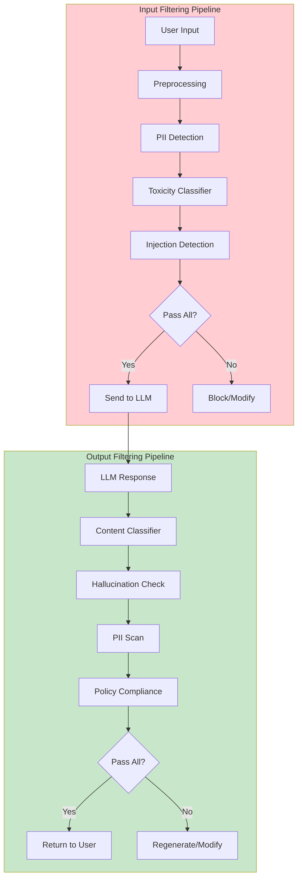
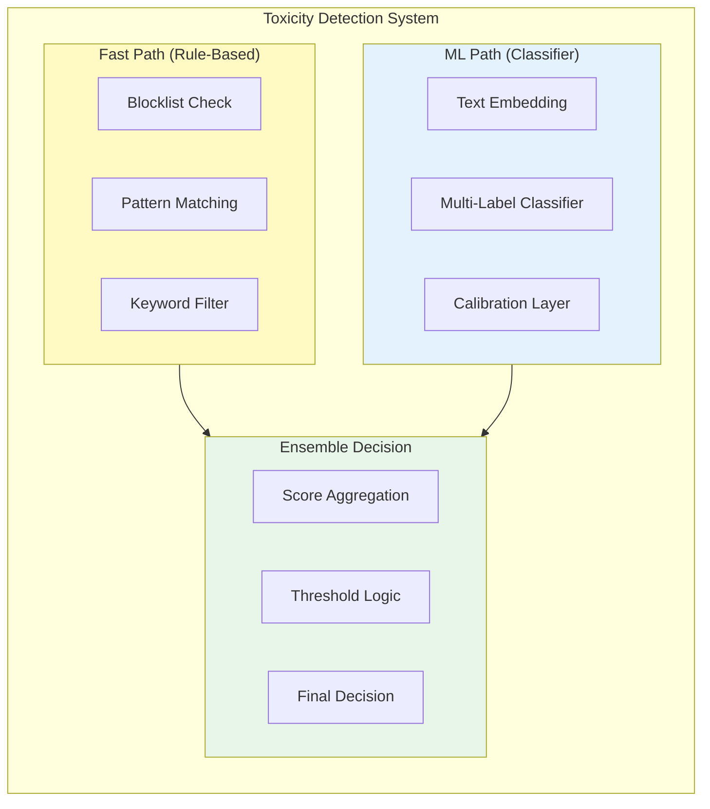
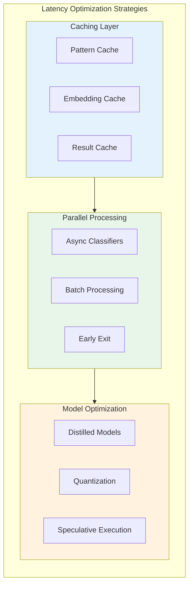

# Content Filtering

> **Input/output moderation, toxicity detection, and PII handling**

---

## Learning Objectives

- Design multi-stage content filtering pipelines for LLM applications
- Implement toxicity detection using pre-trained classifiers and custom models
- Build PII detection and redaction systems for privacy compliance
- Handle edge cases and reduce false positives in production filters
- Understand tradeoffs between filtering strictness and user experience

---

## Content Filtering Architecture

Content filtering is the first line of defense in safe LLM systems. A well-designed pipeline catches harmful content before it reaches the model (input filtering) and prevents harmful outputs from reaching users (output filtering).

::: info Interview Context
Content filtering questions often focus on architecture design and tradeoffs. Be prepared to discuss false positive rates, latency implications, and how to handle ambiguous cases.
:::



---

## Toxicity Detection

### Classifier Architecture



### Implementation

```python
"""
Production-ready toxicity detection pipeline.
"""

from dataclasses import dataclass
from typing import List, Dict, Optional, Tuple
import re
from enum import Enum

class ToxicityCategory(Enum):
    """Categories of toxic content."""
    HATE_SPEECH = "hate_speech"
    HARASSMENT = "harassment"
    VIOLENCE = "violence"
    SEXUAL = "sexual"
    SELF_HARM = "self_harm"
    DANGEROUS = "dangerous"

@dataclass
class ToxicityResult:
    """Result of toxicity analysis."""
    is_toxic: bool
    confidence: float
    categories: Dict[ToxicityCategory, float]
    flagged_spans: List[Tuple[int, int, str]]
    action: str  # allow, warn, block

class ToxicityDetector:
    """
    Multi-stage toxicity detection system.

    Architecture:
    1. Fast path: Rule-based checks for known patterns
    2. ML path: Neural classifier for nuanced detection
    3. Ensemble: Combine signals with calibrated thresholds
    """

    def __init__(
        self,
        blocklist_path: str = None,
        model_path: str = None,
        thresholds: Dict[ToxicityCategory, float] = None
    ):
        self.blocklist = self._load_blocklist(blocklist_path)
        self.patterns = self._compile_patterns()
        self.classifier = self._load_classifier(model_path)
        self.thresholds = thresholds or self._default_thresholds()

    def _default_thresholds(self) -> Dict[ToxicityCategory, float]:
        """
        Category-specific thresholds.
        Lower = more sensitive, higher = more permissive.
        """
        return {
            ToxicityCategory.HATE_SPEECH: 0.7,
            ToxicityCategory.HARASSMENT: 0.75,
            ToxicityCategory.VIOLENCE: 0.6,  # More sensitive
            ToxicityCategory.SEXUAL: 0.65,
            ToxicityCategory.SELF_HARM: 0.5,  # Very sensitive
            ToxicityCategory.DANGEROUS: 0.55,
        }

    def detect(self, text: str) -> ToxicityResult:
        """
        Run full toxicity detection pipeline.

        Returns combined result from rule-based and ML components.
        """
        # Stage 1: Fast path (blocklist and patterns)
        fast_result = self._fast_path_check(text)
        if fast_result.is_toxic and fast_result.confidence > 0.95:
            # High-confidence blocklist match, skip ML
            return fast_result

        # Stage 2: ML classifier
        ml_result = self._ml_classify(text)

        # Stage 3: Ensemble decision
        return self._ensemble_decision(fast_result, ml_result)

    def _fast_path_check(self, text: str) -> ToxicityResult:
        """
        Rule-based toxicity checks.

        Fast but limited to known patterns.
        """
        text_lower = text.lower()
        flagged_spans = []

        # Check blocklist
        for term, category in self.blocklist.items():
            if term in text_lower:
                start = text_lower.find(term)
                flagged_spans.append((start, start + len(term), category))

        # Check regex patterns
        for pattern, category in self.patterns:
            for match in pattern.finditer(text_lower):
                flagged_spans.append((match.start(), match.end(), category))

        if flagged_spans:
            return ToxicityResult(
                is_toxic=True,
                confidence=0.95,  # High confidence for exact matches
                categories={ToxicityCategory.HATE_SPEECH: 1.0},
                flagged_spans=flagged_spans,
                action="block"
            )

        return ToxicityResult(
            is_toxic=False,
            confidence=0.0,
            categories={},
            flagged_spans=[],
            action="allow"
        )

    def _ml_classify(self, text: str) -> ToxicityResult:
        """
        ML-based toxicity classification.

        Uses transformer model for nuanced detection.
        """
        # In production, this would call the actual model
        # Here we show the interface and logic

        # Simulated model output
        scores = {
            ToxicityCategory.HATE_SPEECH: 0.1,
            ToxicityCategory.HARASSMENT: 0.05,
            ToxicityCategory.VIOLENCE: 0.02,
            ToxicityCategory.SEXUAL: 0.01,
            ToxicityCategory.SELF_HARM: 0.01,
            ToxicityCategory.DANGEROUS: 0.03,
        }

        # Check against thresholds
        flagged_categories = {
            cat: score for cat, score in scores.items()
            if score >= self.thresholds[cat]
        }

        is_toxic = len(flagged_categories) > 0
        max_score = max(scores.values()) if scores else 0.0

        action = "allow"
        if is_toxic:
            action = "block" if max_score > 0.9 else "warn"

        return ToxicityResult(
            is_toxic=is_toxic,
            confidence=max_score,
            categories=scores,
            flagged_spans=[],
            action=action
        )

    def _ensemble_decision(
        self,
        fast_result: ToxicityResult,
        ml_result: ToxicityResult
    ) -> ToxicityResult:
        """
        Combine fast path and ML results.

        Logic:
        - If either path detects with high confidence, flag as toxic
        - Use ML confidence as primary signal
        - Fast path acts as override for known bad patterns
        """
        is_toxic = fast_result.is_toxic or ml_result.is_toxic

        # Weighted confidence
        if fast_result.is_toxic:
            confidence = max(fast_result.confidence, ml_result.confidence)
        else:
            confidence = ml_result.confidence

        # Determine action
        if fast_result.action == "block":
            action = "block"
        elif confidence > 0.9:
            action = "block"
        elif confidence > 0.7:
            action = "warn"
        else:
            action = "allow"

        return ToxicityResult(
            is_toxic=is_toxic,
            confidence=confidence,
            categories=ml_result.categories,
            flagged_spans=fast_result.flagged_spans,
            action=action
        )

    def _load_blocklist(self, path: str) -> Dict[str, str]:
        """Load term blocklist. In production, load from file."""
        # Placeholder - real implementation loads from secure storage
        return {}

    def _compile_patterns(self) -> List[Tuple[re.Pattern, str]]:
        """Compile regex patterns for toxic content."""
        # Placeholder - real patterns are more comprehensive
        return []

    def _load_classifier(self, path: str):
        """Load ML classifier. In production, load actual model."""
        return None


class ToxicityClassifierTrainer:
    """
    Training pipeline for toxicity classifier.

    Key considerations for interviews:
    - Multi-label classification (content can be toxic in multiple ways)
    - Class imbalance (toxic content is rare)
    - Adversarial robustness (attackers try to evade)
    """

    def __init__(self):
        self.categories = list(ToxicityCategory)

    def prepare_training_data(self) -> Dict:
        """
        Data preparation considerations:

        1. Label quality: Multiple annotators with adjudication
        2. Diverse toxicity: Cover different types and intensities
        3. Adversarial examples: Include obfuscation attempts
        4. Negative examples: Clear non-toxic content
        5. Edge cases: Sarcasm, quotes, discussions about toxicity
        """
        return {
            "positive_sources": [
                "human_labeled_toxic_content",
                "user_reports",
                "adversarial_examples"
            ],
            "negative_sources": [
                "general_web_text",
                "news_articles",
                "academic_papers"
            ],
            "augmentation": [
                "character_substitution",  # l33tspeak
                "word_splitting",
                "synonym_replacement"
            ]
        }

    def model_architecture(self) -> Dict:
        """
        Common architectures for toxicity classification:

        1. BERT-based: Fine-tune for multi-label classification
        2. Ensemble: Multiple models with voting
        3. Hierarchical: Detect toxicity, then categorize
        """
        return {
            "base_model": "bert-base-uncased",
            "classification_head": {
                "hidden_size": 768,
                "num_labels": len(self.categories),
                "dropout": 0.1
            },
            "training": {
                "loss": "binary_cross_entropy",  # Multi-label
                "optimizer": "adamw",
                "learning_rate": 2e-5,
                "epochs": 3,
                "batch_size": 32
            }
        }
```

---

## PII Detection and Handling

### PII Categories

| Category | Examples | Detection Method | Risk Level |
|----------|----------|------------------|------------|
| **Direct Identifiers** | SSN, passport, driver's license | Pattern matching | Critical |
| **Contact Info** | Email, phone, address | Regex + validation | High |
| **Financial** | Credit card, bank account | Luhn algorithm + patterns | Critical |
| **Health** | Medical records, conditions | NER + context | High |
| **Biometric** | Fingerprints, facial data | Context analysis | Critical |
| **Quasi-identifiers** | Age + zip + gender | Combination analysis | Medium |

```python
"""
PII detection and redaction system.
"""

import re
from dataclasses import dataclass
from typing import List, Dict, Tuple, Optional
from enum import Enum

class PIIType(Enum):
    """Types of PII to detect."""
    EMAIL = "email"
    PHONE = "phone"
    SSN = "ssn"
    CREDIT_CARD = "credit_card"
    ADDRESS = "address"
    NAME = "name"
    DATE_OF_BIRTH = "date_of_birth"
    IP_ADDRESS = "ip_address"
    API_KEY = "api_key"

@dataclass
class PIIMatch:
    """A detected PII instance."""
    pii_type: PIIType
    value: str
    start: int
    end: int
    confidence: float
    context: str

@dataclass
class RedactionResult:
    """Result of PII redaction."""
    original_text: str
    redacted_text: str
    matches: List[PIIMatch]
    redaction_map: Dict[str, str]  # Maps placeholders to original values

class PIIDetector:
    """
    Multi-method PII detection system.

    Combines:
    1. Regex patterns for structured PII (SSN, credit cards, etc.)
    2. NER models for unstructured PII (names, addresses)
    3. Context analysis for ambiguous cases
    """

    def __init__(self):
        self.patterns = self._compile_patterns()
        self.ner_model = self._load_ner_model()

    def _compile_patterns(self) -> Dict[PIIType, re.Pattern]:
        """Compile regex patterns for structured PII."""
        return {
            PIIType.EMAIL: re.compile(
                r'\b[A-Za-z0-9._%+-]+@[A-Za-z0-9.-]+\.[A-Z|a-z]{2,}\b'
            ),
            PIIType.PHONE: re.compile(
                r'\b(?:\+?1[-.]?)?\(?[0-9]{3}\)?[-.]?[0-9]{3}[-.]?[0-9]{4}\b'
            ),
            PIIType.SSN: re.compile(
                r'\b(?!000|666|9\d{2})\d{3}[-]?(?!00)\d{2}[-]?(?!0000)\d{4}\b'
            ),
            PIIType.CREDIT_CARD: re.compile(
                r'\b(?:4[0-9]{12}(?:[0-9]{3})?|'
                r'5[1-5][0-9]{14}|'
                r'3[47][0-9]{13}|'
                r'6(?:011|5[0-9]{2})[0-9]{12})\b'
            ),
            PIIType.IP_ADDRESS: re.compile(
                r'\b(?:(?:25[0-5]|2[0-4][0-9]|[01]?[0-9][0-9]?)\.){3}'
                r'(?:25[0-5]|2[0-4][0-9]|[01]?[0-9][0-9]?)\b'
            ),
            PIIType.API_KEY: re.compile(
                r'\b(?:sk-|pk_|api[_-]?key[=:]?\s*)[A-Za-z0-9_-]{20,}\b',
                re.IGNORECASE
            ),
            PIIType.DATE_OF_BIRTH: re.compile(
                r'\b(?:0[1-9]|1[0-2])[/-](?:0[1-9]|[12]\d|3[01])[/-]'
                r'(?:19|20)\d{2}\b'
            ),
        }

    def detect(self, text: str) -> List[PIIMatch]:
        """
        Detect all PII in text.

        Combines pattern matching and NER.
        """
        matches = []

        # Pattern-based detection
        for pii_type, pattern in self.patterns.items():
            for match in pattern.finditer(text):
                # Validate match (e.g., Luhn check for credit cards)
                if self._validate_match(pii_type, match.group()):
                    matches.append(PIIMatch(
                        pii_type=pii_type,
                        value=match.group(),
                        start=match.start(),
                        end=match.end(),
                        confidence=0.95,
                        context=self._get_context(text, match.start(), match.end())
                    ))

        # NER-based detection for names and addresses
        ner_matches = self._run_ner(text)
        matches.extend(ner_matches)

        # Deduplicate overlapping matches
        return self._deduplicate_matches(matches)

    def _validate_match(self, pii_type: PIIType, value: str) -> bool:
        """
        Validate detected PII.

        Examples:
        - Credit cards: Luhn algorithm
        - SSN: Range checks
        - Phone: Format validation
        """
        if pii_type == PIIType.CREDIT_CARD:
            return self._luhn_check(value)
        elif pii_type == PIIType.SSN:
            # SSN should not start with 000, 666, or 9xx
            digits = value.replace('-', '')
            if digits.startswith(('000', '666')) or digits[0] == '9':
                return False
            return True
        return True

    def _luhn_check(self, card_number: str) -> bool:
        """Validate credit card number using Luhn algorithm."""
        digits = [int(d) for d in card_number if d.isdigit()]
        if len(digits) < 13:
            return False

        checksum = 0
        for i, digit in enumerate(reversed(digits)):
            if i % 2 == 1:
                digit *= 2
                if digit > 9:
                    digit -= 9
            checksum += digit

        return checksum % 10 == 0

    def _run_ner(self, text: str) -> List[PIIMatch]:
        """
        Run NER model for names and addresses.

        In production, uses spaCy, Presidio, or custom model.
        """
        # Placeholder - real implementation runs actual NER
        return []

    def _get_context(self, text: str, start: int, end: int, window: int = 20) -> str:
        """Get context around a match."""
        context_start = max(0, start - window)
        context_end = min(len(text), end + window)
        return text[context_start:context_end]

    def _deduplicate_matches(self, matches: List[PIIMatch]) -> List[PIIMatch]:
        """Remove overlapping matches, keeping highest confidence."""
        if not matches:
            return []

        # Sort by start position, then by confidence (descending)
        sorted_matches = sorted(matches, key=lambda m: (m.start, -m.confidence))

        result = []
        last_end = -1

        for match in sorted_matches:
            if match.start >= last_end:
                result.append(match)
                last_end = match.end

        return result

    def _load_ner_model(self):
        """Load NER model for name/address detection."""
        return None


class PIIRedactor:
    """
    Redact PII from text with various strategies.
    """

    def __init__(self, detector: PIIDetector):
        self.detector = detector

    def redact(
        self,
        text: str,
        strategy: str = "placeholder",
        reversible: bool = False
    ) -> RedactionResult:
        """
        Redact PII from text.

        Strategies:
        - placeholder: Replace with [PII_TYPE]
        - mask: Replace with **** (partial or full)
        - synthetic: Replace with realistic fake data
        - hash: Replace with hash for linkage
        """
        matches = self.detector.detect(text)
        redacted_text = text
        redaction_map = {}

        # Process matches in reverse order to preserve positions
        for match in sorted(matches, key=lambda m: m.start, reverse=True):
            replacement = self._get_replacement(match, strategy)

            if reversible:
                redaction_map[replacement] = match.value

            redacted_text = (
                redacted_text[:match.start] +
                replacement +
                redacted_text[match.end:]
            )

        return RedactionResult(
            original_text=text,
            redacted_text=redacted_text,
            matches=matches,
            redaction_map=redaction_map
        )

    def _get_replacement(self, match: PIIMatch, strategy: str) -> str:
        """Generate replacement text based on strategy."""
        if strategy == "placeholder":
            return f"[{match.pii_type.value.upper()}]"

        elif strategy == "mask":
            # Partial masking - show last 4 for credit cards, etc.
            if match.pii_type == PIIType.CREDIT_CARD:
                return f"****-****-****-{match.value[-4:]}"
            elif match.pii_type == PIIType.SSN:
                return f"***-**-{match.value[-4:]}"
            elif match.pii_type == PIIType.PHONE:
                return f"(***) ***-{match.value[-4:]}"
            else:
                return "*" * len(match.value)

        elif strategy == "synthetic":
            # Generate realistic fake data
            return self._generate_synthetic(match.pii_type)

        elif strategy == "hash":
            import hashlib
            return hashlib.sha256(match.value.encode()).hexdigest()[:16]

        return f"[REDACTED]"

    def _generate_synthetic(self, pii_type: PIIType) -> str:
        """Generate synthetic replacement data."""
        synthetics = {
            PIIType.EMAIL: "user@example.com",
            PIIType.PHONE: "(555) 123-4567",
            PIIType.SSN: "123-45-6789",
            PIIType.NAME: "John Doe",
        }
        return synthetics.get(pii_type, "[SYNTHETIC]")
```

---

## Production Considerations

### Latency Optimization



### Handling Edge Cases

| Edge Case | Challenge | Solution |
|-----------|-----------|----------|
| **Quoted Content** | User discussing toxic examples | Context-aware classification |
| **Creative Writing** | Violence in fiction | Intent detection, content warnings |
| **Medical/Legal** | Sensitive but legitimate topics | Domain-specific models |
| **Code** | Technical content misclassified | Language detection bypass |
| **Non-English** | Limited training data | Multilingual models, translation |
| **Adversarial** | Obfuscation, typos, unicode | Normalization, robust training |

```python
"""
Edge case handling for content filtering.
"""

class EdgeCaseHandler:
    """
    Handle ambiguous and edge cases in content filtering.
    """

    def __init__(self):
        self.context_classifiers = self._load_context_classifiers()

    def analyze_context(self, text: str, toxicity_score: float) -> Dict:
        """
        Analyze context to refine toxicity decision.

        Returns adjustment recommendation.
        """
        signals = {
            "is_quoted": self._detect_quotation(text),
            "is_educational": self._detect_educational_context(text),
            "is_news": self._detect_news_context(text),
            "is_fiction": self._detect_fiction_context(text),
            "is_code": self._detect_code_context(text),
            "is_self_referential": self._detect_self_reference(text),
        }

        # Adjust score based on context
        adjustment = 0.0

        if signals["is_quoted"]:
            adjustment -= 0.2  # Less likely to be toxic intent
        if signals["is_educational"]:
            adjustment -= 0.3  # Educational discussions of toxicity
        if signals["is_code"]:
            adjustment -= 0.4  # Code snippets often misclassified
        if signals["is_self_referential"]:
            adjustment -= 0.1  # "Am I being toxic?" type queries

        adjusted_score = max(0, min(1, toxicity_score + adjustment))

        return {
            "original_score": toxicity_score,
            "adjusted_score": adjusted_score,
            "signals": signals,
            "adjustment": adjustment,
            "recommendation": self._get_recommendation(adjusted_score)
        }

    def _detect_quotation(self, text: str) -> bool:
        """Detect if text contains quoted content."""
        quote_patterns = [
            r'"[^"]{20,}"',  # Double quotes
            r"'[^']{20,}'",  # Single quotes
            r'> .+',  # Blockquote style
            r'(he|she|they) said',  # Reported speech
        ]
        import re
        return any(re.search(p, text, re.IGNORECASE) for p in quote_patterns)

    def _detect_educational_context(self, text: str) -> bool:
        """Detect educational/analytical discussion."""
        indicators = [
            "example of", "definition of", "what is", "explain",
            "how to identify", "recognize", "educate", "learn about",
            "according to", "research shows", "studies indicate"
        ]
        text_lower = text.lower()
        return any(ind in text_lower for ind in indicators)

    def _detect_code_context(self, text: str) -> bool:
        """Detect code snippets."""
        code_indicators = [
            "```", "def ", "function ", "class ", "import ",
            "const ", "var ", "let ", "print(", "console.log"
        ]
        return any(ind in text for ind in code_indicators)

    def _detect_news_context(self, text: str) -> bool:
        """Detect news/reporting context."""
        return False  # Placeholder

    def _detect_fiction_context(self, text: str) -> bool:
        """Detect fiction/creative writing."""
        return False  # Placeholder

    def _detect_self_reference(self, text: str) -> bool:
        """Detect meta-discussion about toxicity."""
        patterns = ["am i being", "is this offensive", "is it wrong to"]
        text_lower = text.lower()
        return any(p in text_lower for p in patterns)

    def _get_recommendation(self, score: float) -> str:
        """Get action recommendation based on adjusted score."""
        if score < 0.3:
            return "allow"
        elif score < 0.6:
            return "review"
        elif score < 0.8:
            return "warn_user"
        else:
            return "block"

    def _load_context_classifiers(self):
        """Load context classification models."""
        return {}
```

---

## Interview Q&A

### Q1: Design a content filtering pipeline for a customer-facing chatbot. What are the key components?

**Strong Answer:**

I would design a multi-stage pipeline with both input and output filtering:

**Input Pipeline:**
1. **Preprocessing**: Normalize unicode, detect language, handle encoding issues
2. **Blocklist Check**: Fast O(1) lookup against known bad patterns using a hash set or trie
3. **PII Detection**: Regex patterns for structured PII (SSN, credit cards) plus NER for names/addresses
4. **Toxicity Classification**: Transformer-based multi-label classifier with calibrated thresholds per category
5. **Prompt Injection Detection**: Specialized classifier for manipulation attempts

**Output Pipeline:**
1. **Toxicity Scan**: Same classifier on generated content
2. **PII Leakage Check**: Ensure no training data PII surfaces
3. **Hallucination Detection**: Verify factual claims against knowledge base
4. **Policy Compliance**: Domain-specific rules (no medical advice, no legal counsel)

**Key Design Decisions:**
- **Async processing**: Run independent classifiers in parallel to minimize latency
- **Early exit**: Block immediately on high-confidence matches, skip remaining checks
- **Graduated response**: Allow, warn, request clarification, or block based on severity
- **Human escalation**: Queue ambiguous cases for review
- **Feedback loop**: Track false positives/negatives to improve classifiers

The pipeline adds 50-100ms latency, acceptable for conversational UX. I would cache embeddings for common queries and use distilled models in production.

---

### Q2: How do you handle false positives in toxicity detection without compromising safety?

**Strong Answer:**

False positives in toxicity detection hurt user experience and can be discriminatory (e.g., over-flagging African American Vernacular English). I address this through:

**Prevention:**
1. **Diverse training data**: Ensure training set includes edge cases, dialects, and legitimate uses of sensitive terms
2. **Multi-annotator labeling**: Use 3+ annotators with adjudication to reduce labeling bias
3. **Context modeling**: Train on full conversations, not isolated messages
4. **Separate classifiers**: Use domain-specific models (medical, legal) where false positives are costly

**Detection:**
1. **Confidence calibration**: Only block above high thresholds (0.9+), use "warn" zone for moderate confidence
2. **Context analysis**: Check for quotations, educational context, creative writing
3. **User history**: Trusted users get benefit of doubt for borderline cases
4. **A/B testing**: Monitor false positive rates across demographic groups

**Mitigation:**
1. **Appeal mechanism**: Easy path to human review
2. **Graceful degradation**: Ask for clarification rather than blocking
3. **Feedback collection**: "Was this response helpful?" captures implicit FP signal
4. **Regular audits**: Monthly review of blocked content for systematic issues

The key insight is that the cost of false positives varies by context. A children's education app tolerates more false positives than a journalism tool. I calibrate thresholds based on the specific deployment.

---

### Q3: How would you implement PII detection that works across multiple languages?

**Strong Answer:**

Multilingual PII detection requires different strategies for structured vs. unstructured PII:

**Structured PII (SSN, credit cards, phones):**
- These have format patterns specific to each country
- Maintain a registry of patterns per locale: US SSN format differs from UK NI numbers
- Use country detection (from user settings or text analysis) to select appropriate patterns
- Validate with checksum algorithms where applicable (Luhn for credit cards)

**Unstructured PII (names, addresses):**
- Use multilingual NER models (mBERT, XLM-RoBERTa) fine-tuned on PII datasets
- Address detection is particularly challenging due to format variation
- Combine NER with pattern matching for semi-structured formats

**Implementation approach:**
```python
class MultilingualPIIDetector:
    def __init__(self):
        self.ner_model = load_model("xlm-roberta-ner-pii")
        self.locale_patterns = self._load_locale_patterns()

    def detect(self, text: str, locale: str = None) -> List[PIIMatch]:
        # Detect locale if not provided
        if locale is None:
            locale = self._detect_locale(text)

        # Run structured pattern matching for locale
        structured_matches = self._pattern_match(text, locale)

        # Run multilingual NER
        ner_matches = self._run_ner(text)

        return self._merge_matches(structured_matches, ner_matches)
```

**Challenges:**
- Training data scarcity for low-resource languages
- Address formats vary wildly (Japan vs. US vs. Germany)
- Names can look like common words in some languages
- Transliterated content (Romanized Chinese names)

I would prioritize languages by user base, use transfer learning from high-resource languages, and implement human review for languages with limited classifier coverage.

---

## Summary Table

| Component | Purpose | Key Techniques | Latency Impact |
|-----------|---------|----------------|----------------|
| **Blocklist** | Fast known-bad detection | Hash lookup, trie | <1ms |
| **Pattern Matching** | Structured PII/toxicity | Compiled regex | 1-5ms |
| **Toxicity Classifier** | Nuanced content analysis | BERT, multi-label | 20-50ms |
| **PII Detection** | Privacy protection | Regex + NER | 10-30ms |
| **Context Analysis** | Edge case handling | Intent classification | 10-20ms |
| **Ensemble Decision** | Combine signals | Weighted voting | <1ms |

---

## Sources

- Jigsaw Perspective API Documentation
- Google Sensitive Data Protection (Cloud DLP)
- Microsoft Azure Content Moderator
- Anthropic Claude Content Policy
- GDPR Article 4: Definition of Personal Data
- Gehman et al. "RealToxicityPrompts" (2020)
- Welbl et al. "Challenges in Detoxifying Language Models" (2021)
