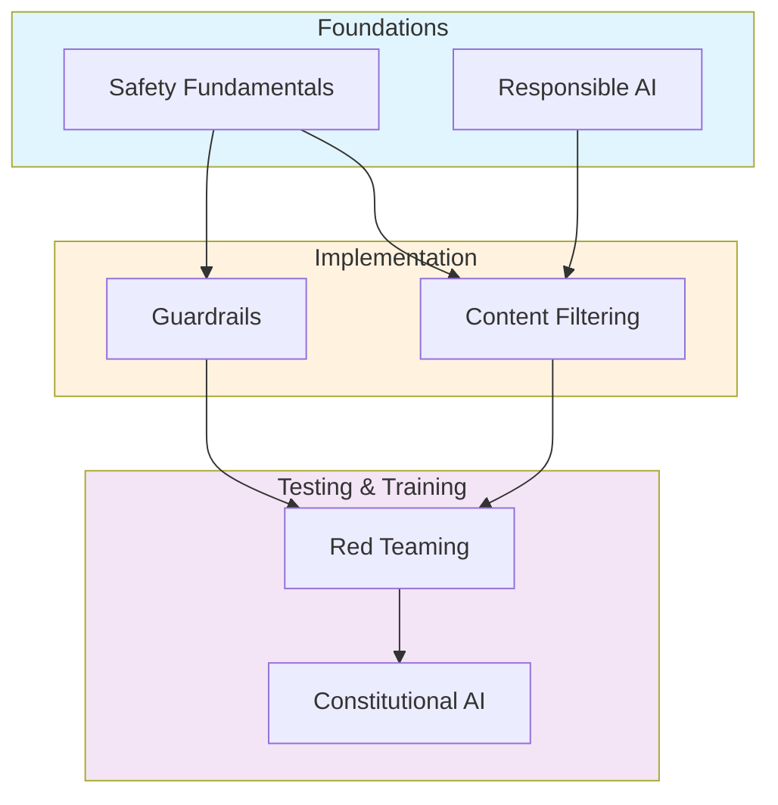
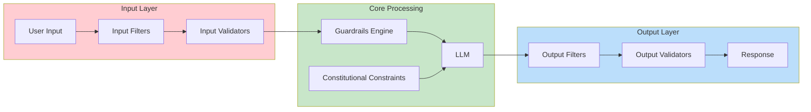

# Safety & Alignment

> **Build AI systems that are safe, aligned with human values, and responsible**

---

## Overview

Safety and alignment are critical competencies for GenAI engineers. This module covers the technical and ethical foundations needed to build AI systems that behave reliably, resist adversarial attacks, and respect human values. These topics are increasingly important in interviews as companies prioritize responsible AI development.

::: info Why This Matters for Interviews
Safety questions assess whether you can build production systems that won't harm users or create liability. Expect questions on guardrails implementation, content moderation architecture, and responsible AI principles.
:::

---

## Learning Objectives

After completing this module, you will be able to:

- Articulate near-term and long-term AI safety risks and mitigation strategies
- Implement content filtering pipelines with toxicity detection and PII handling
- Design and deploy guardrails using NeMo Guardrails and Guardrails AI
- Conduct systematic red teaming and adversarial testing of LLM systems
- Explain Constitutional AI and its advantages over traditional RLHF
- Apply responsible AI principles: fairness, transparency, and accountability

---

## Module Structure

---

## Topics

| Module | Focus | Key Concepts |
|--------|-------|--------------|
| [Safety Fundamentals](./safety-fundamentals) | Risk landscape | Near/long-term risks, alignment problem, safety vs capability |
| [Content Filtering](./content-filtering) | Input/output moderation | Toxicity detection, PII handling, classifier design |
| [Guardrails](./guardrails) | Runtime protection | NeMo Guardrails, Guardrails AI, custom validators |
| [Red Teaming](./red-teaming) | Adversarial testing | Jailbreak taxonomy, automated red teaming, attack vectors |
| [Constitutional AI](./constitutional-ai) | Training alignment | RLHF limitations, principle-based training, self-critique |
| [Responsible AI](./responsible-ai) | Ethics & governance | Fairness, transparency, model cards, accountability |

---

## Safety Architecture Overview

---

## Interview Question Distribution

| Topic | Frequency | Difficulty |
|-------|-----------|------------|
| Content filtering architecture | High | Medium |
| Guardrails implementation | High | Medium-Hard |
| Red teaming methodology | Medium | Medium |
| RLHF vs Constitutional AI | Medium | Hard |
| Responsible AI principles | High | Easy-Medium |
| Safety risk assessment | Medium | Medium |

---

## Prerequisites

Before starting this module, ensure familiarity with:

- LLM fundamentals (tokenization, inference, fine-tuning)
- Prompt engineering basics
- Python programming
- Basic ML concepts (classification, evaluation metrics)

---

## Quick Reference: Safety Checklist

Use this checklist when designing safe LLM systems:

| Stage | Check |
|-------|-------|
| **Input** | PII detection, toxicity screening, injection prevention |
| **Processing** | Guardrails active, token limits enforced, rate limiting |
| **Output** | Content filtering, hallucination checks, citation validation |
| **Monitoring** | Logging enabled, anomaly detection, human review queue |
| **Governance** | Model card published, bias testing complete, audit trail |

---

## Additional Resources

- [Anthropic's AI Safety Research](https://www.anthropic.com/research)
- [OpenAI Safety & Alignment](https://openai.com/safety)
- [NIST AI Risk Management Framework](https://www.nist.gov/itl/ai-risk-management-framework)
- [EU AI Act Guidelines](https://artificialintelligenceact.eu/)

---

## Sources

- Amodei et al. "Concrete Problems in AI Safety" (2016)
- Bai et al. "Constitutional AI: Harmlessness from AI Feedback" (2022)
- NIST AI Risk Management Framework (2023)
- Anthropic Research Papers on AI Safety
