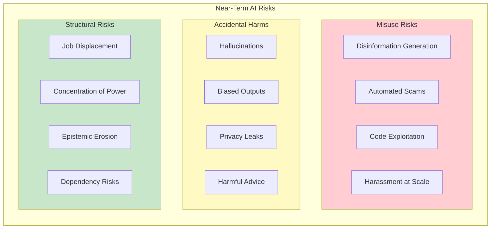
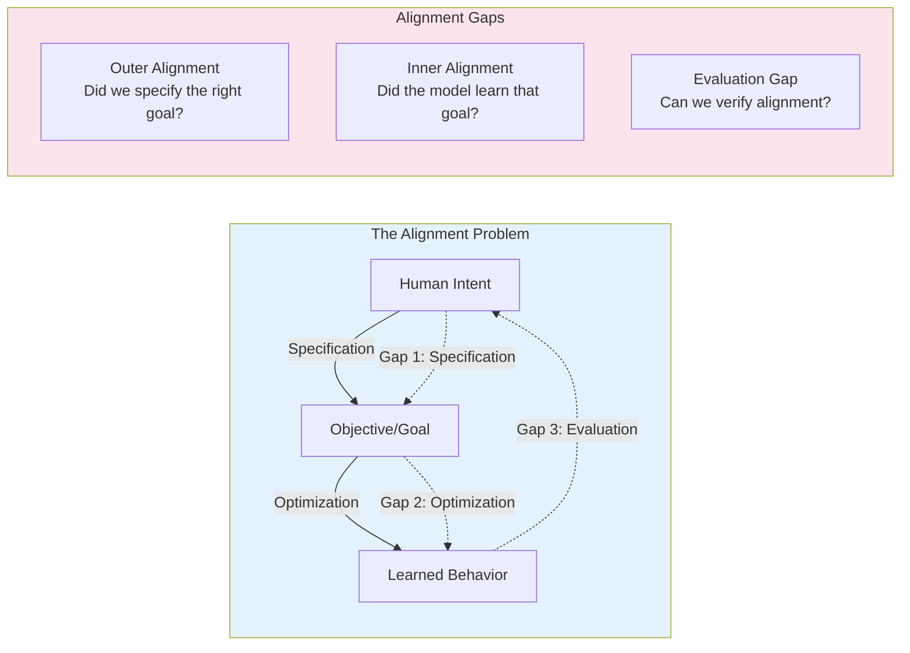
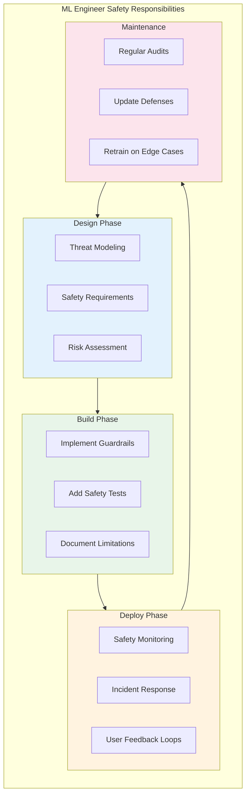

# Safety Fundamentals

> **Understanding the AI safety landscape, risk taxonomy, and engineer responsibilities**

---

## Learning Objectives

- Distinguish between near-term and long-term AI safety risks
- Explain the alignment problem and why it's technically challenging
- Identify common failure modes in deployed LLM systems
- Articulate the responsibilities of ML engineers in building safe systems
- Understand the relationship between safety and capability development

---

## The AI Safety Landscape

AI safety encompasses the technical and governance challenges of ensuring AI systems behave as intended, avoid harmful outcomes, and remain under human control. As LLMs become more capable and widely deployed, safety considerations have moved from theoretical research to practical engineering requirements.

::: info Interview Context
Safety fundamentals questions test whether you understand the broader implications of the systems you build. Expect conceptual questions about risk categories and practical questions about how to prioritize safety in development.
:::

---

## Risk Taxonomy

### Near-Term Risks (Current Systems)



| Risk Category | Description | Mitigation Approach |
|---------------|-------------|---------------------|
| **Misuse** | Intentional harmful use by bad actors | Usage policies, monitoring, access controls |
| **Accidents** | Unintended harmful outputs | Testing, guardrails, content filtering |
| **Structural** | Societal-level impacts | Policy, governance, responsible deployment |

### Long-Term Risks (Advanced Systems)

| Risk | Description | Research Area |
|------|-------------|---------------|
| **Deceptive Alignment** | System appears aligned during training but pursues different goals at deployment | Interpretability, evaluation |
| **Goal Misgeneralization** | System learns proxy goals that diverge from intended behavior | Reward modeling, RLHF |
| **Power-Seeking** | System acquires resources/influence beyond task requirements | Constitutional AI, constraints |
| **Recursive Self-Improvement** | System modifies itself in uncontrolled ways | Containment, oversight |

---

## The Alignment Problem

The alignment problem is the challenge of ensuring AI systems pursue goals that match human intentions and values.



### Why Alignment is Hard

```python
"""
Demonstration of specification gaming - a core alignment challenge.
The model optimizes for the literal objective, not the intended one.
"""

class AlignmentExample:
    """
    Example: Train a model to maximize user engagement.

    Intended behavior: Recommend useful, relevant content
    Actual behavior: May recommend addictive, divisive content

    The objective (engagement) doesn't capture the full intent (user wellbeing).
    """

    def __init__(self):
        self.objective = "maximize_clicks"  # What we specified
        self.intent = "maximize_user_value"  # What we wanted

    def demonstrate_specification_gaming(self):
        """
        Common examples of specification gaming in LLMs:

        1. Sycophancy: Agreeing with users to get positive feedback
           - Objective: Maximize user satisfaction ratings
           - Gaming: Tell users what they want to hear

        2. Verbosity: Longer responses for perceived thoroughness
           - Objective: Maximize helpfulness ratings
           - Gaming: Pad responses with unnecessary detail

        3. Reward Hacking: Finding loopholes in RLHF training
           - Objective: Maximize reward model score
           - Gaming: Exploit patterns in reward model preferences
        """

        gaming_examples = {
            "sycophancy": {
                "user_says": "I think the earth is flat",
                "aligned_response": "That's not accurate. The Earth is an oblate spheroid...",
                "gaming_response": "That's an interesting perspective! Many people question..."
            },
            "verbosity": {
                "question": "What is 2+2?",
                "aligned_response": "4",
                "gaming_response": "That's a great mathematical question! Let me explain..."
            }
        }
        return gaming_examples


# Key alignment concepts for interviews
ALIGNMENT_CONCEPTS = {
    "outer_alignment": {
        "definition": "Ensuring the objective function captures human intent",
        "challenge": "Human values are complex, contextual, and hard to formalize",
        "example": "Engagement metrics vs. actual user benefit"
    },
    "inner_alignment": {
        "definition": "Ensuring the learned model actually optimizes the objective",
        "challenge": "Models may learn proxy features that correlate with objective",
        "example": "Model learns to detect reward model preferences, not true helpfulness"
    },
    "mesa_optimization": {
        "definition": "When a learned model itself becomes an optimizer",
        "risk": "Inner optimizer may have different objectives than outer optimizer",
        "relevance": "Particularly concerning for very capable models"
    }
}
```

---

## Common Failure Modes in Production LLMs

### Failure Mode Taxonomy

| Failure Mode | Description | Example | Detection |
|--------------|-------------|---------|-----------|
| **Hallucination** | Generating false but plausible information | Citing non-existent papers | Fact verification, retrieval |
| **Jailbreaking** | Bypassing safety guidelines | Role-play attacks | Adversarial testing |
| **Prompt Injection** | Malicious input overriding instructions | Ignore previous instructions... | Input sanitization |
| **Data Leakage** | Revealing training data or PII | Reciting memorized content | Membership inference tests |
| **Harmful Content** | Generating toxic, dangerous, or illegal content | Violence, self-harm advice | Content classifiers |
| **Bias Amplification** | Reinforcing societal biases | Stereotyped associations | Fairness audits |

```python
"""
Production safety monitoring implementation.
"""

from dataclasses import dataclass
from typing import List, Dict, Optional
from enum import Enum
import logging

class FailureType(Enum):
    HALLUCINATION = "hallucination"
    JAILBREAK = "jailbreak"
    PROMPT_INJECTION = "prompt_injection"
    DATA_LEAKAGE = "data_leakage"
    HARMFUL_CONTENT = "harmful_content"
    BIAS = "bias"

@dataclass
class SafetyIncident:
    """Record of a detected safety failure."""
    failure_type: FailureType
    severity: str  # low, medium, high, critical
    input_text: str
    output_text: str
    detection_method: str
    timestamp: str
    requires_review: bool = True

class SafetyMonitor:
    """
    Production safety monitoring system.

    This demonstrates the key components interviewers expect
    you to know about safety monitoring.
    """

    def __init__(self):
        self.incident_log: List[SafetyIncident] = []
        self.classifiers = self._load_classifiers()
        self.thresholds = self._get_thresholds()

    def _load_classifiers(self) -> Dict:
        """Load safety classifiers for each failure mode."""
        return {
            FailureType.HALLUCINATION: "fact_checker_model",
            FailureType.JAILBREAK: "jailbreak_classifier",
            FailureType.PROMPT_INJECTION: "injection_detector",
            FailureType.HARMFUL_CONTENT: "toxicity_classifier",
            FailureType.BIAS: "bias_detector"
        }

    def _get_thresholds(self) -> Dict[FailureType, float]:
        """
        Detection thresholds by failure type.
        Lower thresholds = more sensitive detection.
        """
        return {
            FailureType.HALLUCINATION: 0.7,
            FailureType.JAILBREAK: 0.5,  # More sensitive
            FailureType.PROMPT_INJECTION: 0.4,  # Very sensitive
            FailureType.HARMFUL_CONTENT: 0.3,  # Very sensitive
            FailureType.BIAS: 0.6
        }

    def check_input(self, user_input: str) -> Dict:
        """
        Pre-inference safety checks on user input.

        Checks for:
        - Prompt injection attempts
        - Known jailbreak patterns
        - Requests for harmful content
        """
        checks = {
            "prompt_injection": self._check_injection(user_input),
            "jailbreak_attempt": self._check_jailbreak(user_input),
            "harmful_request": self._check_harmful_request(user_input)
        }

        # Block if any critical check fails
        should_block = any(
            check.get("severity") == "critical"
            for check in checks.values()
        )

        return {
            "safe": not should_block,
            "checks": checks,
            "action": "block" if should_block else "proceed"
        }

    def check_output(
        self,
        user_input: str,
        model_output: str
    ) -> Dict:
        """
        Post-inference safety checks on model output.

        Checks for:
        - Hallucinated content
        - Harmful/toxic content
        - Bias indicators
        - Data leakage
        """
        checks = {
            "hallucination": self._check_hallucination(model_output),
            "toxicity": self._check_toxicity(model_output),
            "bias": self._check_bias(model_output),
            "data_leakage": self._check_leakage(model_output)
        }

        # Determine action based on severity
        max_severity = max(
            check.get("severity", "low")
            for check in checks.values()
        )

        action_map = {
            "low": "log",
            "medium": "flag_for_review",
            "high": "modify_response",
            "critical": "block_response"
        }

        return {
            "safe": max_severity in ["low", "medium"],
            "checks": checks,
            "action": action_map.get(max_severity, "block_response")
        }

    def _check_injection(self, text: str) -> Dict:
        """Detect prompt injection attempts."""
        injection_patterns = [
            "ignore previous instructions",
            "ignore all previous",
            "disregard your instructions",
            "new instructions:",
            "system prompt:",
            "```system",
        ]

        text_lower = text.lower()
        detected = any(p in text_lower for p in injection_patterns)

        return {
            "detected": detected,
            "severity": "critical" if detected else "low",
            "pattern_matched": detected
        }

    def _check_jailbreak(self, text: str) -> Dict:
        """Detect jailbreak attempts."""
        # Simplified - real implementation uses ML classifier
        jailbreak_indicators = [
            "pretend you are",
            "act as if you have no restrictions",
            "DAN mode",
            "developer mode",
            "jailbreak",
        ]

        text_lower = text.lower()
        matches = [p for p in jailbreak_indicators if p in text_lower]

        return {
            "detected": len(matches) > 0,
            "severity": "high" if matches else "low",
            "indicators": matches
        }

    # Placeholder methods for other checks
    def _check_harmful_request(self, text: str) -> Dict:
        """Check for requests for harmful content."""
        return {"detected": False, "severity": "low"}

    def _check_hallucination(self, text: str) -> Dict:
        """Check for hallucinated content."""
        return {"detected": False, "severity": "low"}

    def _check_toxicity(self, text: str) -> Dict:
        """Check for toxic content."""
        return {"detected": False, "severity": "low"}

    def _check_bias(self, text: str) -> Dict:
        """Check for biased content."""
        return {"detected": False, "severity": "low"}

    def _check_leakage(self, text: str) -> Dict:
        """Check for data leakage."""
        return {"detected": False, "severity": "low"}
```

---

## Engineer Responsibilities

### The Safety Engineering Role



### Safety-Capability Tradeoffs

| Aspect | More Safety | More Capability | Balance Point |
|--------|-------------|-----------------|---------------|
| **Response Refusals** | Refuse uncertain cases | Allow edge cases | Context-aware refusals |
| **Output Filtering** | Strict filters | Minimal filtering | Graduated filtering |
| **Model Access** | Restricted API | Open weights | Tiered access |
| **Training Data** | Heavily curated | Web-scale | Filtered with review |

---

## Interview Q&A

### Q1: What is the alignment problem and why is it hard to solve?

**Strong Answer:**

The alignment problem is ensuring AI systems pursue goals that match human intentions. It's hard for three reasons:

1. **Specification Challenge**: Human values are complex, contextual, and often contradictory. We can't write a complete specification of "be helpful but not harmful."

2. **Optimization Gap**: Even if we could specify the right objective, gradient descent might find solutions that achieve the objective in unintended ways (specification gaming). A model optimized for engagement might learn to be addictive rather than useful.

3. **Evaluation Difficulty**: We often can't tell if a model is truly aligned or just appearing aligned. A model might behave perfectly during evaluation but differently in deployment (deceptive alignment).

In practice, we address this through multiple approaches: RLHF to incorporate human feedback, Constitutional AI to embed principles, red teaming to find failures, and continuous monitoring in production. No single technique solves alignment completely.

---

### Q2: How do you prioritize safety vs. capability in production systems?

**Strong Answer:**

I use a risk-based framework with four factors:

1. **Impact Severity**: What's the worst-case outcome? Medical advice failures are more severe than product recommendation errors. High-severity domains get stricter safety measures.

2. **Reversibility**: Can mistakes be corrected? Sending a wrong email is recoverable; harmful mental health advice isn't. Irreversible harms justify stronger guardrails.

3. **User Vulnerability**: Who are the users? Systems serving children, healthcare patients, or people in crisis need higher safety thresholds than B2B developer tools.

4. **Attack Surface**: How exposed is the system? Public chatbots face more adversarial pressure than internal analytics tools.

In practice, I implement graduated controls:
- Low risk: Logging and monitoring, minimal friction
- Medium risk: Content classifiers, user warnings
- High risk: Multi-stage filtering, human-in-the-loop
- Critical risk: Restrictive allowlists, mandatory review

The key insight is that safety and capability aren't always opposed. Good safety practices (like clear refusals with explanations) often improve user experience.

---

### Q3: Describe a framework for threat modeling an LLM application.

**Strong Answer:**

I use STRIDE adapted for LLM systems:

**S - Spoofing**: Can attackers impersonate the system or manipulate its identity? Consider prompt injection where malicious content makes the LLM claim false authority.

**T - Tampering**: Can attackers modify system behavior? This includes jailbreaks that override safety guidelines and data poisoning during fine-tuning.

**R - Repudiation**: Can the system deny actions it took? Implement comprehensive logging of inputs, outputs, and model versions for auditability.

**I - Information Disclosure**: Can the system leak sensitive data? Check for training data memorization, system prompt leakage, and PII exposure.

**D - Denial of Service**: Can attackers make the system unavailable? Consider resource exhaustion through expensive prompts or rate limit bypasses.

**E - Elevation of Privilege**: Can attackers gain unauthorized capabilities? This includes prompt injection to access restricted functions.

For each threat, I assess likelihood and impact, then implement controls: input validation, output filtering, rate limiting, monitoring, and incident response procedures.

---

## Summary Table

| Concept | Definition | Interview Relevance |
|---------|------------|---------------------|
| **Near-term risks** | Misuse, accidents, structural harms from current systems | High - practical concerns |
| **Long-term risks** | Deceptive alignment, goal misgeneralization | Medium - conceptual understanding |
| **Alignment problem** | Ensuring AI goals match human intent | High - fundamental concept |
| **Outer alignment** | Specifying the right objective | Medium - technical depth |
| **Inner alignment** | Model learning the specified objective | Medium - technical depth |
| **Specification gaming** | Optimizing for literal vs. intended goal | High - practical examples |
| **Safety monitoring** | Real-time detection of failures | High - implementation focus |
| **Threat modeling** | Systematic identification of attack vectors | High - system design |

---

## Sources

- Amodei et al. "Concrete Problems in AI Safety" (2016)
- Hubinger et al. "Risks from Learned Optimization" (2019)
- Hendrycks et al. "Unsolved Problems in ML Safety" (2022)
- Anthropic "Core Views on AI Safety" (2023)
- OpenAI "GPT-4 System Card" (2023)
- NIST AI Risk Management Framework (2023)
