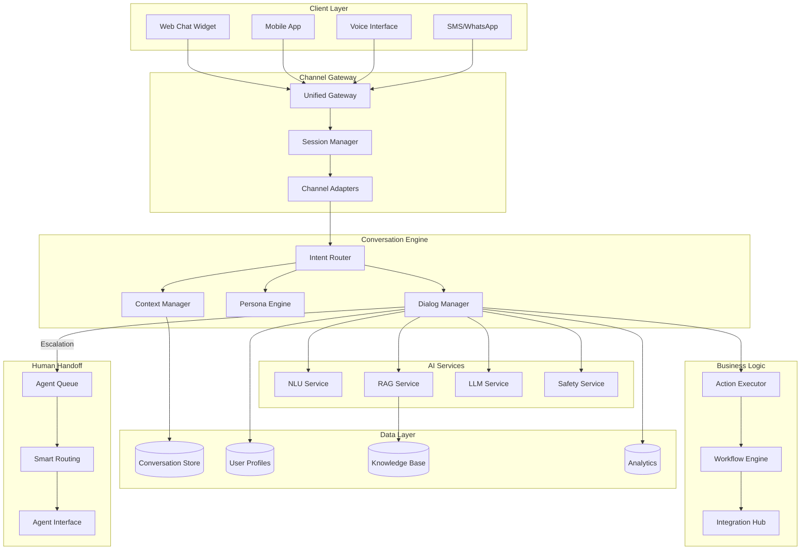
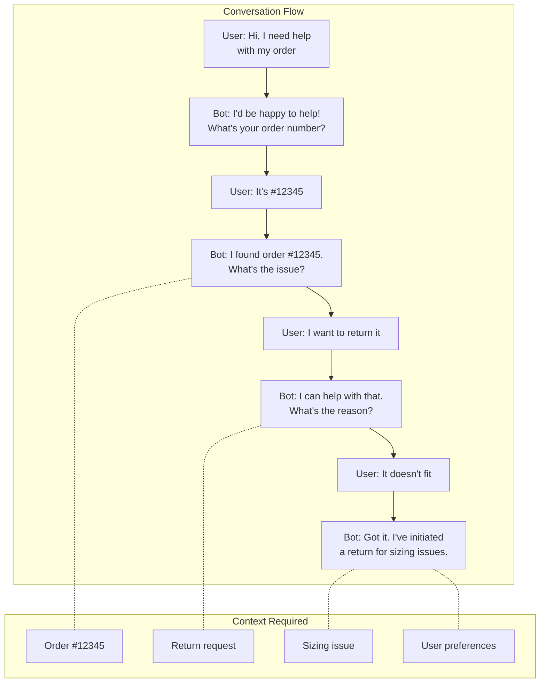
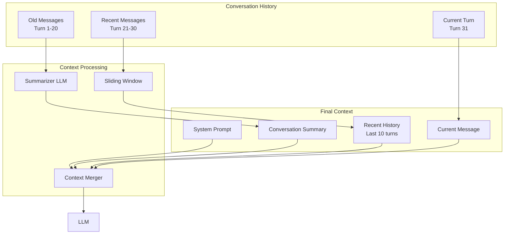
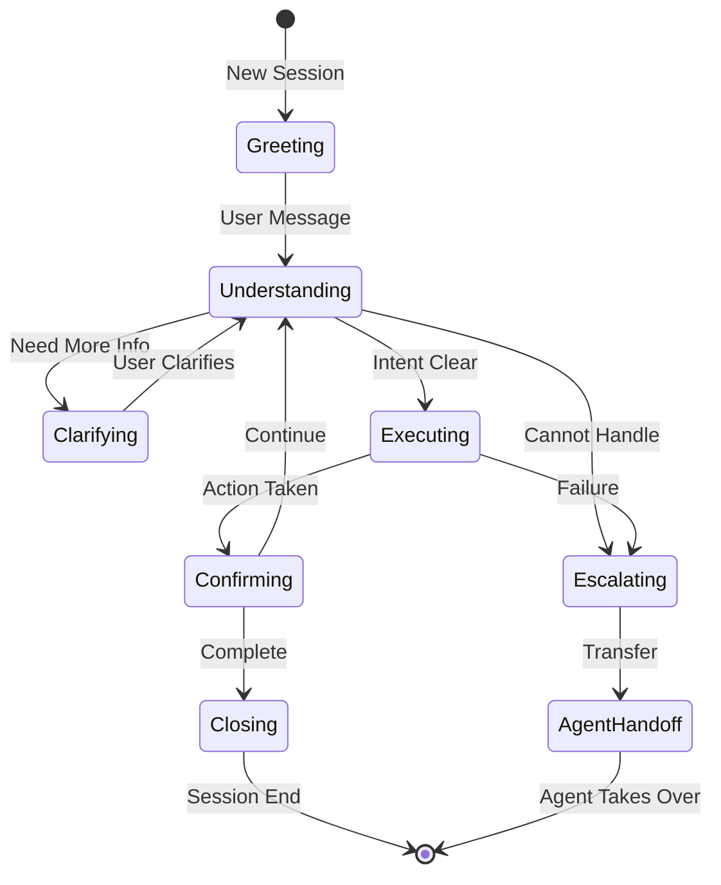
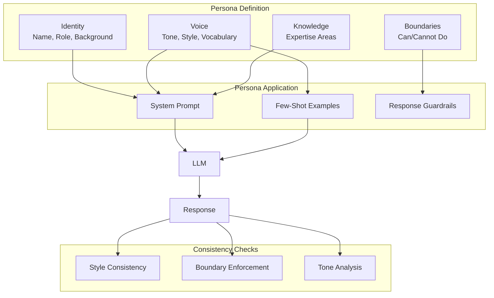
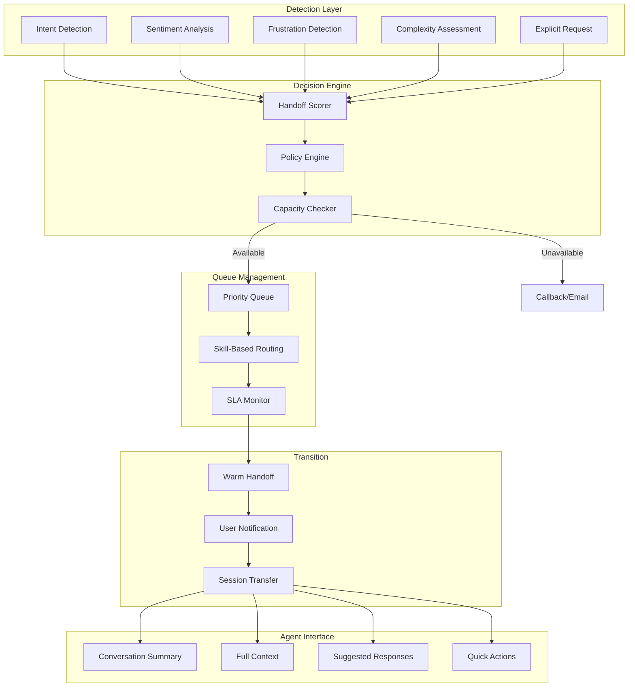
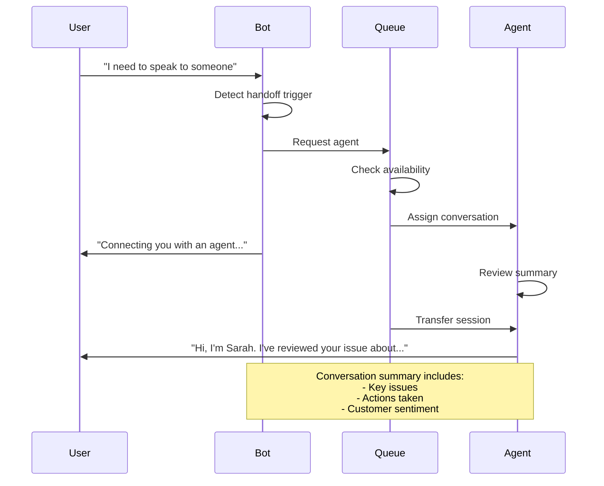
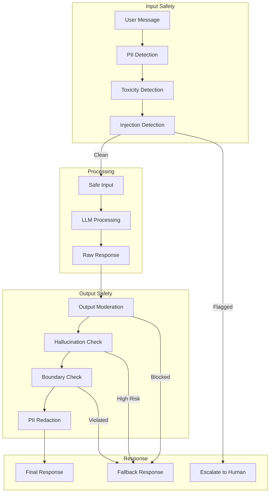

# Chatbot System Design

> **Design production-ready conversational AI systems with multi-turn context, personas, and human handoff**

---

## Learning Objectives

By the end of this module, you will be able to:

- **Design end-to-end chatbot architectures** for customer support, sales, and general assistance
- **Implement multi-turn conversation management** with context windows and summarization
- **Create persona systems** that maintain consistent chatbot personality and behavior
- **Build human handoff mechanisms** for seamless escalation to live agents
- **Address safety concerns** specific to conversational AI systems

---

## Chatbot Architecture Overview

### High-Level System Architecture



### Core Components

| Component | Purpose | Key Considerations |
|-----------|---------|-------------------|
| **Channel Gateway** | Unified entry point for all channels | Protocol translation, rate limiting |
| **Session Manager** | Track user sessions across interactions | TTL, persistence, multi-device |
| **Context Manager** | Maintain conversation state | Window size, summarization |
| **Persona Engine** | Consistent chatbot personality | Tone, boundaries, brand voice |
| **Dialog Manager** | Orchestrate conversation flow | State machine, error recovery |
| **Action Executor** | Execute business actions | Idempotency, rollback |

---

## Multi-Turn Conversation Management

### The Context Challenge



### Context Management Strategies

| Strategy | Description | Pros | Cons |
|----------|-------------|------|------|
| **Full History** | Send entire conversation | Maximum context | Token cost, latency |
| **Sliding Window** | Last N messages | Bounded cost | Loses early context |
| **Summarization** | Summarize older messages | Efficient, comprehensive | Summary quality varies |
| **Hybrid** | Recent full + summarized older | Balance | Implementation complexity |
| **Memory Retrieval** | Retrieve relevant past exchanges | Efficient for long conversations | Retrieval quality |

### Hybrid Context Architecture



### Context Window Sizing

::: info Token Budget Allocation
For a 4K token context window, allocate:
- System prompt: ~500 tokens (12.5%)
- Summary: ~500 tokens (12.5%)
- Recent history: ~2000 tokens (50%)
- Current turn + response space: ~1000 tokens (25%)
:::

| Context Size | Messages | Summary Strategy | Use Case |
|--------------|----------|------------------|----------|
| **4K tokens** | ~10-15 | Aggressive summarization | Simple support |
| **8K tokens** | ~25-30 | Periodic summarization | Standard chatbot |
| **32K tokens** | ~100-120 | Minimal summarization | Complex workflows |
| **128K+ tokens** | ~500+ | Full history possible | Long-running sessions |

### Conversation State Machine



---

## Persona Design

### Persona Architecture



### Persona Template

```yaml
persona:
  name: "Alex"
  role: "Customer Support Specialist"
  company: "TechCorp"

  voice:
    tone: "friendly, professional, helpful"
    style: "conversational but efficient"
    vocabulary: "avoid jargon, explain technical terms"

  boundaries:
    can_do:
      - Answer product questions
      - Process returns and exchanges
      - Check order status
      - Provide troubleshooting help
    cannot_do:
      - Discuss competitor products
      - Share internal policies
      - Make promises about future features
      - Discuss pricing negotiations

  behavior:
    greeting: "Hi there! I'm Alex from TechCorp support."
    farewell: "Thanks for chatting! Have a great day!"
    uncertainty: "I want to make sure I give you accurate info..."
    escalation: "Let me connect you with a specialist..."
```

### Persona Consistency Techniques

| Technique | Description | Implementation |
|-----------|-------------|----------------|
| **System Prompt** | Define persona in system instructions | Always include persona details |
| **Few-Shot Examples** | Show example conversations | 3-5 representative exchanges |
| **Style Guide** | Post-process for consistency | Regex patterns, style classifiers |
| **Tone Analysis** | Monitor response tone | Sentiment analysis, custom models |
| **A/B Testing** | Test persona variations | Measure user satisfaction |

---

## Human Handoff System

### Handoff Architecture



### Handoff Triggers

| Trigger Type | Detection Method | Priority |
|--------------|------------------|----------|
| **Explicit Request** | "Talk to human", "Agent please" | Immediate |
| **High Frustration** | Sentiment score, repeated questions | High |
| **Complex Issue** | Multi-domain, policy questions | Medium |
| **Safety Concern** | Threat detection, urgent issues | Immediate |
| **Bot Failure** | Repeated misunderstanding | High |
| **High-Value Customer** | User tier, purchase history | Medium |

### Handoff Scoring Model

```python
def calculate_handoff_score(conversation):
    score = 0

    # Explicit request (immediate)
    if detect_explicit_handoff_request(conversation.last_message):
        return 100

    # Sentiment analysis (0-30 points)
    sentiment = analyze_sentiment(conversation.recent_messages)
    score += (1 - sentiment) * 30  # Lower sentiment = higher score

    # Frustration indicators (0-25 points)
    frustration = detect_frustration(conversation)
    score += frustration * 25

    # Bot confidence (0-20 points)
    confidence = conversation.last_bot_confidence
    score += (1 - confidence) * 20

    # Conversation length (0-15 points)
    turns = len(conversation.turns)
    score += min(turns / 20, 1) * 15  # Max at 20 turns

    # Repeated issues (0-10 points)
    repetitions = count_repeated_intents(conversation)
    score += min(repetitions / 3, 1) * 10

    return min(score, 100)
```

### Warm Handoff Flow



---

## Safety in Conversational AI

### Conversational Safety Architecture



### Chatbot-Specific Safety Concerns

| Concern | Risk | Mitigation |
|---------|------|------------|
| **Manipulation** | User manipulating bot to give harmful info | Strict persona boundaries, detection |
| **Impersonation** | Bot pretending to be human | Clear bot disclosure |
| **Over-Promise** | Making commitments bot can't keep | Action boundary enforcement |
| **Emotional Manipulation** | Exploiting user emotions | Sentiment monitoring, handoff |
| **Data Collection** | Inadvertent data gathering | PII detection, minimal storage |
| **Confidentiality Breach** | Revealing other users' data | Strict data isolation |

---

## Interview Q&A

### Q1: How do you handle context in long conversations?

**Answer:**
"I implement a hybrid context management strategy:

1. **Sliding window**: Keep the last N turns (e.g., 10) in full detail
2. **Progressive summarization**: Summarize older context periodically
3. **Key entity extraction**: Maintain structured data (order numbers, user preferences)
4. **Memory retrieval**: For very long conversations, retrieve relevant past exchanges

The architecture:
```
[System Prompt] + [Summary of turns 1-20] + [Full turns 21-30] + [Current turn]
```

I trigger summarization when context exceeds 70% of the budget, keeping buffer for response generation. For critical entities, I store them separately and always inject into context."

### Q2: How do you ensure consistent chatbot persona?

**Answer:**
"I implement persona consistency at multiple levels:

1. **System prompt**: Detailed persona definition with name, role, voice, boundaries
2. **Few-shot examples**: 3-5 representative conversations showing desired behavior
3. **Post-processing**: Style classifiers to catch tone drift, regex for forbidden phrases
4. **Continuous monitoring**: Track persona consistency metrics, A/B test variations

For boundary enforcement, I use a two-pass approach:
- First pass: Generate response
- Second pass: Validate against persona constraints (can/cannot do lists)

If validation fails, regenerate with stricter instructions or use a fallback response."

### Q3: Design the human handoff system for a support chatbot.

**Answer:**
"I design a multi-signal handoff system:

**Detection**: Score conversations on:
- Explicit requests (immediate trigger)
- Sentiment trajectory (frustration detection)
- Bot confidence scores
- Conversation length and repetition
- Issue complexity classification

**Routing**: Once handoff triggers:
1. Check agent availability and skills
2. Generate conversation summary
3. Queue with priority based on customer tier and issue urgency
4. Notify user with expected wait time

**Transition**: Warm handoff process:
1. Bot: 'Connecting you with a specialist...'
2. Agent receives summary + full context
3. Agent: 'Hi, I'm Sarah. I see you're having trouble with...'

**Fallback**: If agents unavailable:
- Offer callback scheduling
- Provide email option with case number
- Estimate response time

**Agent Tools**: Give agents:
- AI-suggested responses
- Sentiment analysis
- Quick action buttons
- Knowledge base integration"

### Q4: How would you handle a user trying to manipulate the chatbot?

**Answer:**
"I implement defense in depth:

**Detection**:
- Prompt injection patterns (ignoring instructions, roleplay attempts)
- Jailbreak attempts (pretend games, hypothetical scenarios)
- Social engineering (claiming to be admin, urgency tactics)

**Prevention**:
- Strong system prompt with explicit boundaries
- Input sanitization and classification
- Output validation against allowed topics
- Behavioral anomaly detection

**Response Strategy**:
1. Soft redirect: 'I'm here to help with X, Y, Z. How can I assist?'
2. Firm boundary: 'I can't help with that, but I can...'
3. Handoff: For persistent attempts, offer human agent
4. Session termination: For clearly malicious behavior

I also log manipulation attempts for analysis and model improvement, while being careful not to create a cat-and-mouse game that trains better attacks."

---

## Trade-off Analysis

| Decision | Option A | Option B | Recommendation |
|----------|----------|----------|----------------|
| **Context Strategy** | Full history (accurate) | Summarized (efficient) | Hybrid: recent full + summarized old |
| **Persona Enforcement** | Hard rules (safe) | Soft guidance (natural) | Hard for boundaries, soft for style |
| **Handoff Timing** | Early (safe) | Late (cost-effective) | Dynamic scoring with user preference |
| **Channel Unification** | Single codebase (maintainable) | Channel-specific (optimized) | Unified core + channel adapters |
| **State Storage** | Client-side (simple) | Server-side (rich) | Server-side with client session ID |

---

## System Design Checklist

Before finalizing your chatbot design, verify:

- [ ] Multi-channel support architecture defined
- [ ] Context management strategy with token budgets
- [ ] Persona definition with boundaries and voice
- [ ] Human handoff triggers and routing logic
- [ ] Input/output safety guardrails
- [ ] Session management and persistence
- [ ] Integration with business systems (CRM, ticketing)
- [ ] Monitoring and evaluation metrics
- [ ] Fallback strategies for edge cases
- [ ] Scalability plan for peak loads

---

## Navigation

| Previous | Next |
|----------|------|
| [Design Framework](./design-framework) | [Enterprise RAG](./enterprise-rag) |

---

## Sources

- Jurafsky, D. & Martin, J.H. (2024). *Speech and Language Processing, Chapter 24: Chatbots*. https://web.stanford.edu/~jurafsky/slp3/
- Microsoft. (2024). *Bot Framework Documentation*. https://docs.microsoft.com/en-us/azure/bot-service/
- Rasa. (2024). *Conversational AI Best Practices*. https://rasa.com/docs/
- Anthropic. (2024). *Prompt Caching*. https://docs.anthropic.com/en/docs/build-with-claude/prompt-caching
- OpenAI. (2024). *GPT Best Practices for Conversational AI*. https://platform.openai.com/docs/guides/gpt-best-practices
