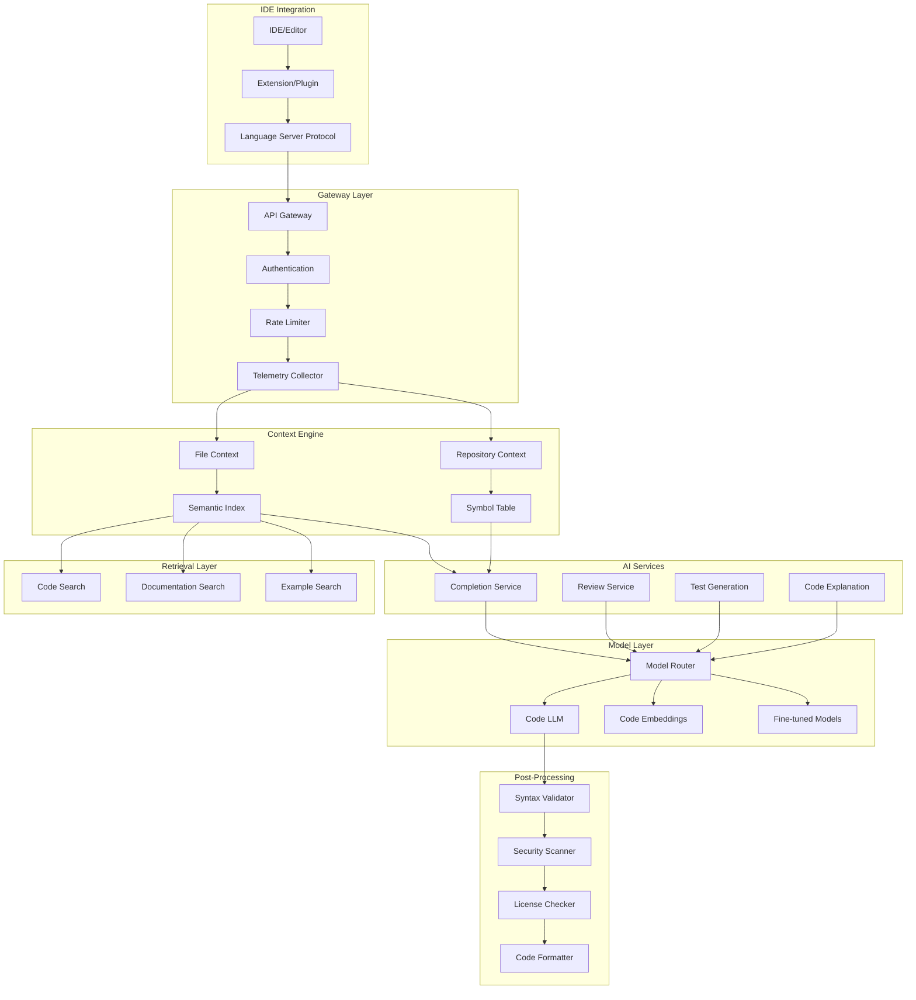
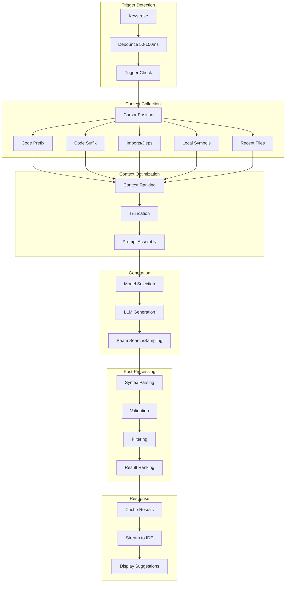
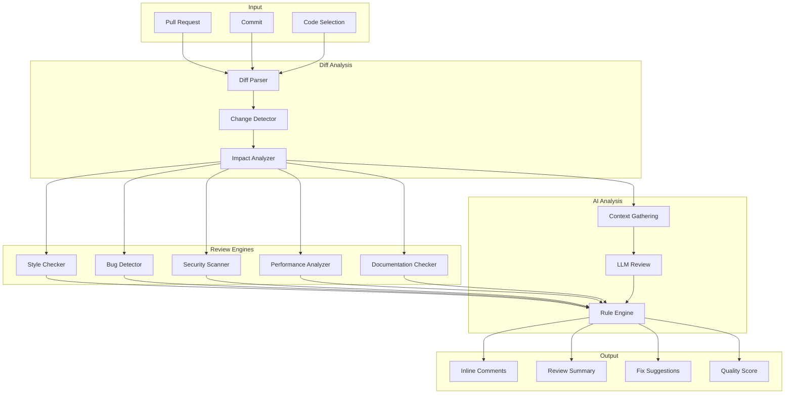
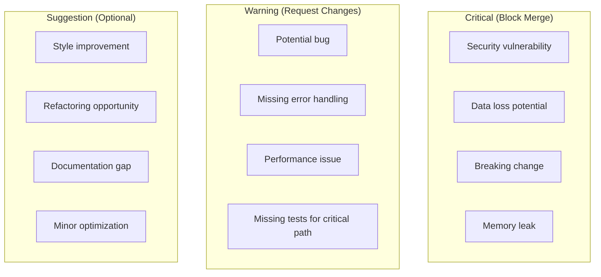
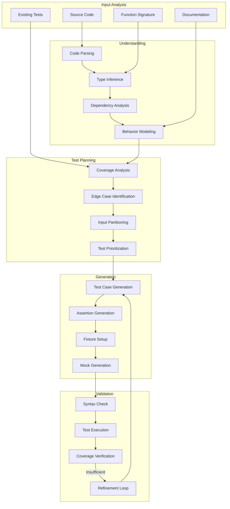
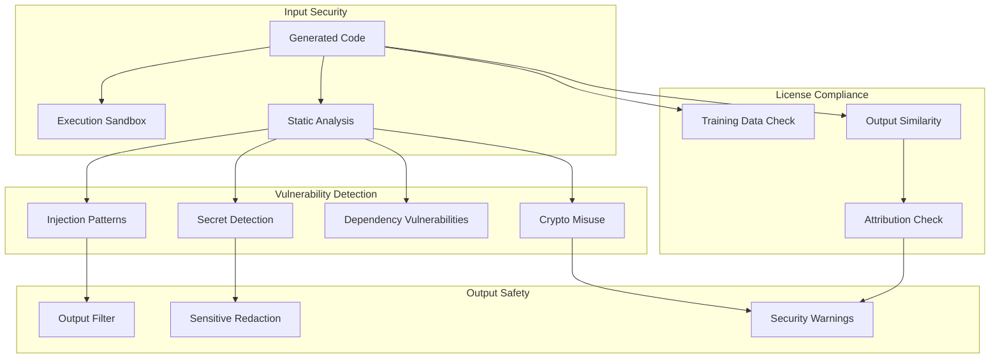
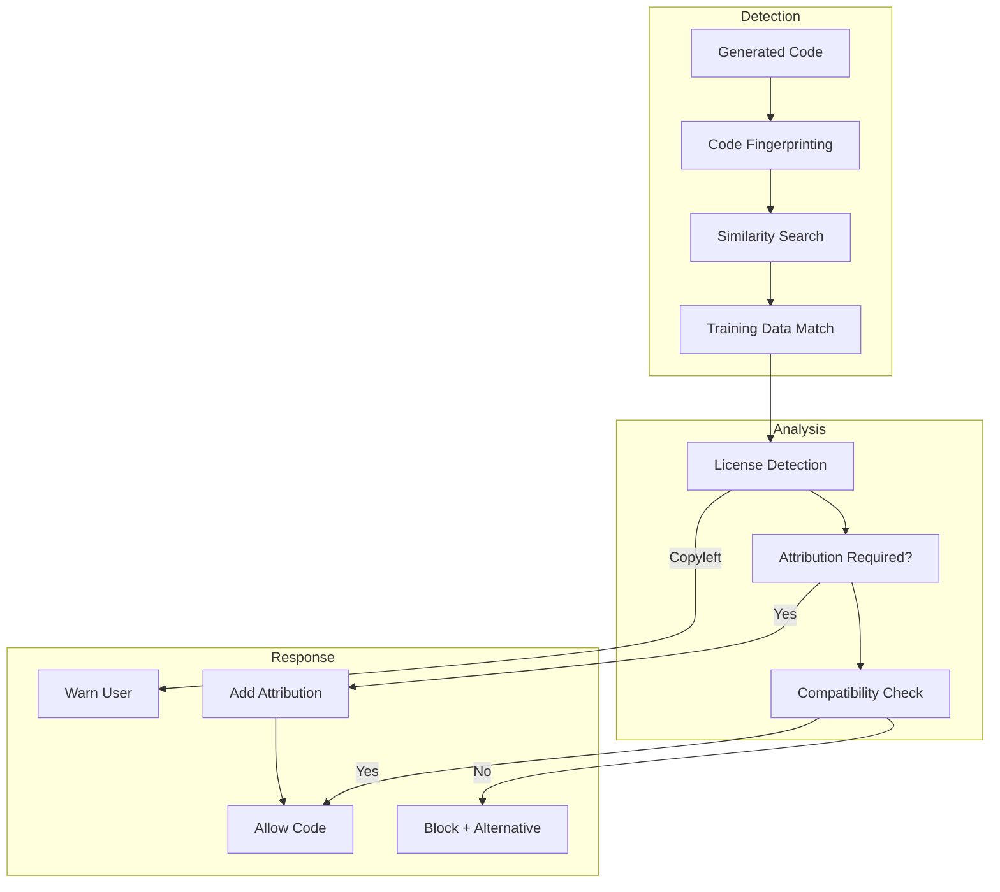
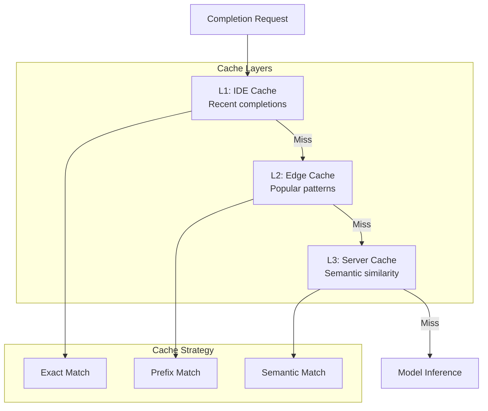
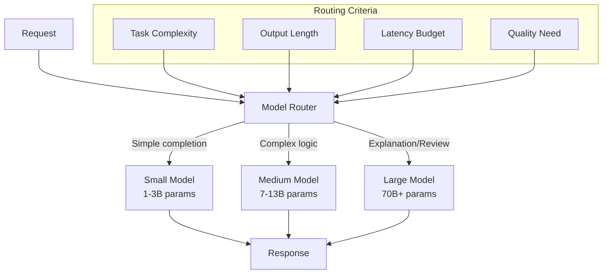

# Code Assistant System Design

> **Design Copilot-style systems for code completion, review, and test generation**

---

## Learning Objectives

By the end of this module, you will be able to:

- **Design end-to-end code assistant architectures** like GitHub Copilot
- **Implement intelligent code completion** with context-aware suggestions
- **Build code review systems** that identify bugs, security issues, and style violations
- **Design automated test generation** pipelines
- **Address unique challenges** of code generation including security, licensing, and quality

---

## Code Assistant Architecture

### High-Level System Architecture



### Core Components

| Component | Purpose | Key Considerations |
|-----------|---------|-------------------|
| **IDE Extension** | User interface, trigger detection | Low latency, minimal resource usage |
| **Context Engine** | Gather relevant context | Efficient context selection |
| **Completion Service** | Generate code suggestions | Speed, relevance, accuracy |
| **Review Service** | Analyze code for issues | Coverage, false positives |
| **Test Generation** | Create unit/integration tests | Coverage, correctness |
| **Security Scanner** | Detect vulnerable patterns | Up-to-date vulnerability database |
| **License Checker** | Ensure licensing compliance | Attribution, compatibility |

---

## Code Completion System

### Completion Pipeline



### Context Strategy

::: info Fill-in-the-Middle (FIM)
Modern code completion uses Fill-in-the-Middle training, where the model sees code before AND after the cursor, enabling more contextual completions.
:::

```
<prefix>
def calculate_total(items):
    total = 0
    for item in items:
        <cursor>
<suffix>
    return total
```

### Context Prioritization

| Context Type | Priority | Token Budget | Rationale |
|--------------|----------|--------------|-----------|
| **Immediate context** | Highest | 40% | Current function/block |
| **File context** | High | 25% | Imports, class definitions |
| **Related files** | Medium | 20% | Similar files, tests |
| **Documentation** | Low | 10% | API docs, comments |
| **Repository context** | Lowest | 5% | Coding patterns, style |

### Latency Budget

```
Target: 200ms for first suggestion

IDE processing:        10ms  ██
Network roundtrip:     40ms  ████████
Context collection:    20ms  ████
Model inference:      100ms  ████████████████████
Post-processing:       20ms  ████
Display:               10ms  ██
                      ─────
Total:               200ms
```

### Completion Quality Metrics

| Metric | Description | Target |
|--------|-------------|--------|
| **Acceptance Rate** | % of suggestions accepted | >30% |
| **Persistence Rate** | % still present after 5 min | >70% |
| **Character Savings** | Chars suggested vs typed | >50% |
| **Latency P50** | Median response time | <200ms |
| **Latency P95** | 95th percentile response | <500ms |

---

## Code Review System

### Review Architecture



### Review Categories

| Category | Detection Method | Examples |
|----------|------------------|----------|
| **Style** | Linters + LLM | Naming, formatting, conventions |
| **Bugs** | Static analysis + LLM | Null checks, edge cases, logic errors |
| **Security** | SAST tools + LLM | Injection, secrets, vulnerabilities |
| **Performance** | Pattern matching + LLM | N+1 queries, memory leaks, complexity |
| **Documentation** | Coverage analysis | Missing docstrings, outdated comments |
| **Testing** | Coverage diff | Missing test coverage |

### Review Prompt Structure

```python
REVIEW_PROMPT = """
You are an expert code reviewer. Analyze the following code change and provide feedback.

## Code Context
File: {file_path}
Language: {language}
Change type: {change_type}

## Related Code
{related_context}

## Code Diff
{diff}

## Review Instructions
1. Identify potential bugs or logic errors
2. Check for security vulnerabilities
3. Evaluate code style and readability
4. Suggest performance improvements
5. Note any missing error handling

## Output Format
For each issue found:
- Line number
- Severity (critical/warning/suggestion)
- Description
- Suggested fix (if applicable)
"""
```

### Review Severity Classification



---

## Test Generation System

### Test Generation Pipeline



### Test Generation Strategies

| Strategy | Description | Use Case |
|----------|-------------|----------|
| **Behavior-driven** | Generate from docstrings/specs | Well-documented code |
| **Example-based** | Infer from usage patterns | Code with existing tests |
| **Boundary-based** | Focus on edge cases | Numeric/string operations |
| **Mutation-based** | Generate tests that catch mutations | Critical logic |
| **Coverage-guided** | Fill coverage gaps | Legacy code |

### Generated Test Quality Metrics

| Metric | Description | Target |
|--------|-------------|--------|
| **Compilation rate** | % of tests that compile | >95% |
| **Pass rate** | % of tests that pass | >90% |
| **Coverage increase** | Delta in code coverage | >20% |
| **Mutation score** | % of mutants killed | >70% |
| **Redundancy** | % of duplicate tests | <10% |

---

## Security Considerations

### Code Security Architecture



### Security Concerns for Code Generation

| Concern | Risk | Mitigation |
|---------|------|------------|
| **Injection vulnerabilities** | SQL/XSS/Command injection | Pattern detection, security prompts |
| **Secrets in code** | Exposed API keys, passwords | Secret scanning, redaction |
| **Insecure patterns** | Hardcoded credentials, weak crypto | Security-aware fine-tuning |
| **Dependency risks** | Vulnerable libraries suggested | Version checking, CVE database |
| **License violations** | Copyrighted code reproduction | Training data filtering, similarity check |
| **Sandbox escape** | Code execution risks | Containerization, resource limits |

### License Compliance System



---

## Scaling and Performance

### Performance Optimization Strategies

| Strategy | Impact | Trade-off |
|----------|--------|-----------|
| **Model distillation** | 3-5x faster | Slight quality loss |
| **Speculative decoding** | 2-3x faster | Memory overhead |
| **KV cache optimization** | 30% faster | Memory usage |
| **Batching requests** | Better throughput | Higher latency |
| **Edge deployment** | Lower latency | Infrastructure cost |
| **Prompt caching** | 50% faster for similar | Cache management |

### Caching Architecture



### Multi-Model Architecture



---

## Interview Q&A

### Q1: How do you design the context window for code completion?

**Answer:**
"I use a prioritized context strategy:

**Structure**:
1. **Immediate context (40%)**: Code around cursor, current function
2. **File context (25%)**: Imports, class/function definitions
3. **Related files (20%)**: Test files, type definitions, similar files
4. **Repository context (15%)**: Coding patterns, conventions

**Fill-in-the-Middle (FIM)**: Send both prefix and suffix:
```
<prefix>{code_before_cursor}<suffix>{code_after_cursor}<middle>
```

**Optimization techniques**:
- AST-based extraction for relevant symbols
- Sliding window with smart truncation at semantic boundaries
- Caching of file-level context to reduce recomputation
- Relevance ranking of related files using code embeddings

**Dynamic sizing**: Adjust based on task - more context for complex completions, minimal for simple autocomplete."

### Q2: How do you ensure generated code is secure?

**Answer:**
"I implement security at multiple stages:

**Training time**:
- Filter training data for known vulnerabilities
- Security-aware fine-tuning with positive/negative examples

**Generation time**:
- Security-focused system prompts
- Pattern detection for common vulnerabilities (injection, XSS)
- Real-time static analysis on generated code

**Post-generation**:
- SAST tool integration (Semgrep, CodeQL)
- Secret detection (detect-secrets, truffleHog)
- Dependency vulnerability checking (Snyk, Dependabot)
- License compliance checking

**User feedback loop**:
- Flag security issues in training data
- Learn from user rejections

**Sandboxing**:
- Execute test code in isolated containers
- Resource limits, network isolation
- Time limits for runaway code"

### Q3: How would you reduce latency for code completion?

**Answer:**
"I optimize across the entire pipeline:

**Client-side**:
- Debouncing (50-150ms) to batch keystrokes
- Predictive prefetching for likely next actions
- Local caching of recent completions

**Context optimization**:
- Pre-computed file embeddings
- Incremental context updates (not full rebuild)
- Parallel context collection

**Model optimization**:
- Smaller models for simple completions (model routing)
- Speculative decoding for faster generation
- Quantization (INT8) for inference speed
- KV cache optimization for repeat patterns

**Infrastructure**:
- Edge deployment for geographic latency
- Request batching for throughput
- Connection pooling, keep-alive

**Target budget**:
```
200ms total:
- Client: 10ms
- Network: 40ms
- Context: 20ms
- Inference: 100ms
- Post-process: 20ms
- Display: 10ms
```"

### Q4: How do you handle licensing and attribution for generated code?

**Answer:**
"I implement a multi-layer compliance system:

**Training data curation**:
- Filter for permissively licensed code
- Track provenance of all training data
- Exclude copyleft-licensed code for commercial use

**Runtime detection**:
- Fingerprint generated code segments
- Near-duplicate search against training data
- Threshold-based matching (e.g., >80% similarity)

**Response handling**:
- High similarity: Block or require attribution
- Medium similarity: Warn user
- Low similarity: Allow with optional attribution

**User configuration**:
- Allow users to set license preferences
- Corporate settings for compliance policies
- Opt-out of specific license types

**Audit trail**:
- Log generation events for compliance
- Attribution metadata in code comments
- Integration with license management tools

This balances utility with legal compliance, similar to GitHub Copilot's approach."

---

## Trade-off Analysis

| Decision | Option A | Option B | Recommendation |
|----------|----------|----------|----------------|
| **Completion length** | Single line (fast) | Multi-line (complete) | Hybrid: start single, expand |
| **Model size** | Small (fast) | Large (accurate) | Route by complexity |
| **Context window** | Minimal (fast) | Comprehensive (better) | Prioritized context |
| **Real-time vs batch** | Instant (completion) | Batch (review) | Use case dependent |
| **Local vs cloud** | Local (private, fast) | Cloud (powerful) | Cloud with local cache |

---

## System Design Checklist

Before finalizing your code assistant design, verify:

- [ ] IDE integration architecture with LSP support
- [ ] Context collection strategy with prioritization
- [ ] Latency budget for completion (<200ms target)
- [ ] Security scanning pipeline for generated code
- [ ] License compliance checking system
- [ ] Multi-model routing for different tasks
- [ ] Caching strategy at multiple levels
- [ ] Metrics and telemetry collection
- [ ] Feedback loop for model improvement
- [ ] Fallback strategies for degraded service

---

## Navigation

| Previous | Next |
|----------|------|
| [Enterprise RAG](./enterprise-rag) | [Content Pipeline](./content-pipeline) |

---

## Sources

- Chen, M. et al. (2021). *Evaluating Large Language Models Trained on Code*. https://arxiv.org/abs/2107.03374
- GitHub. (2024). *Copilot Architecture*. https://github.blog/2023-05-17-how-github-copilot-is-getting-better-at-understanding-your-code/
- Roziere, B. et al. (2023). *Code Llama: Open Foundation Models for Code*. https://arxiv.org/abs/2308.12950
- Li, Y. et al. (2022). *Competition-Level Code Generation with AlphaCode*. https://arxiv.org/abs/2203.07814
- Fried, D. et al. (2022). *InCoder: A Generative Model for Code Infilling and Synthesis*. https://arxiv.org/abs/2204.05999
- Bavarian, M. et al. (2022). *Efficient Training of Language Models to Fill in the Middle*. https://arxiv.org/abs/2207.14255
