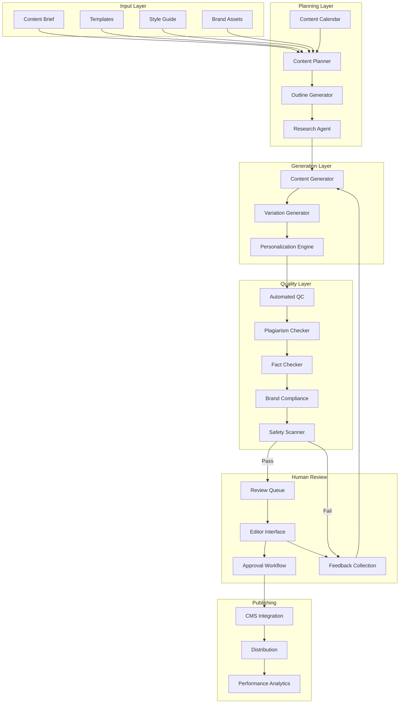
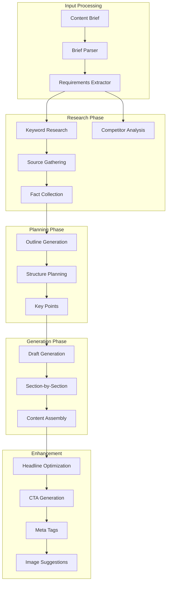
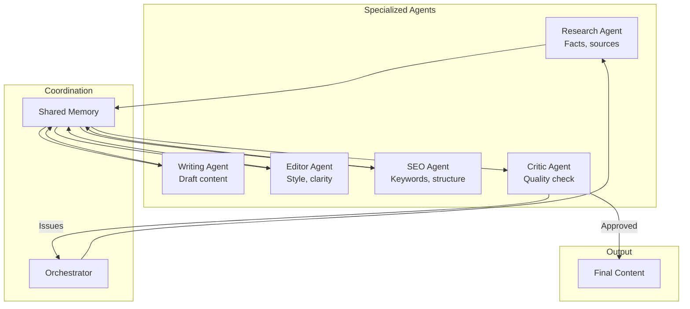
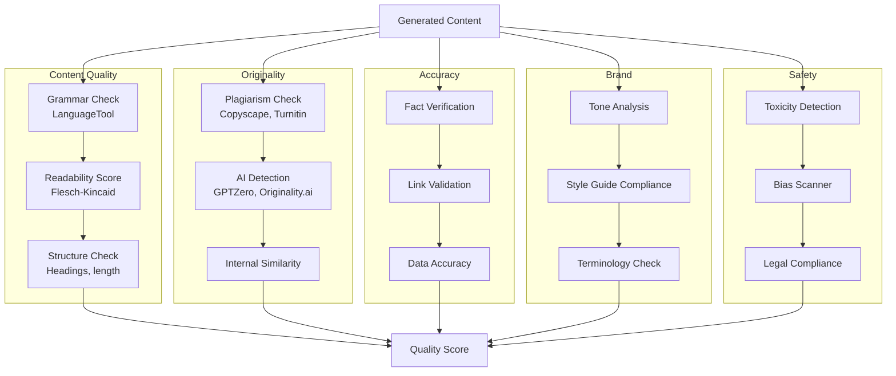
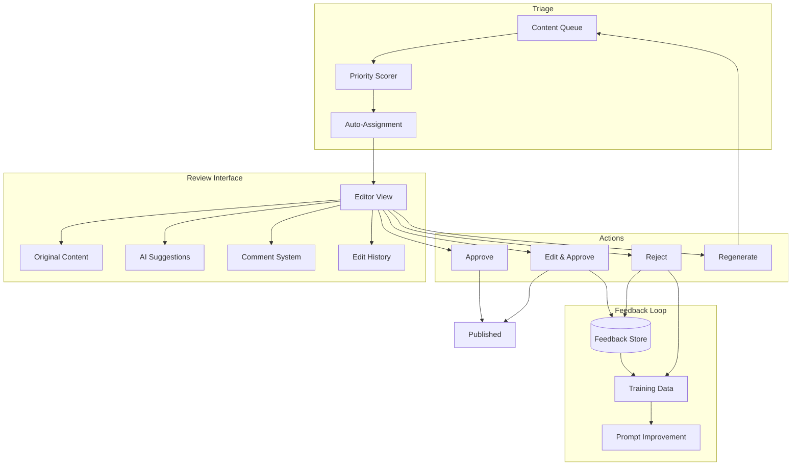
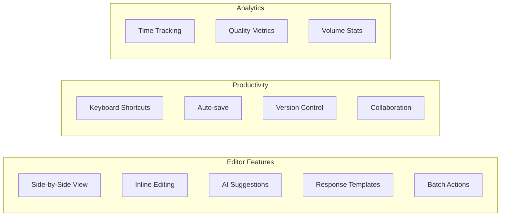
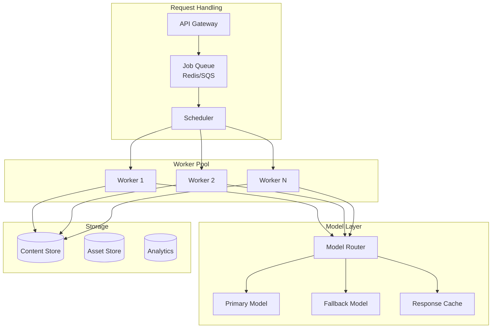
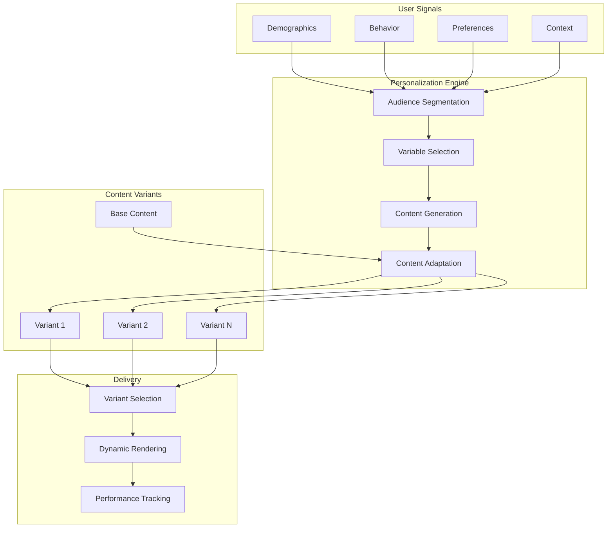
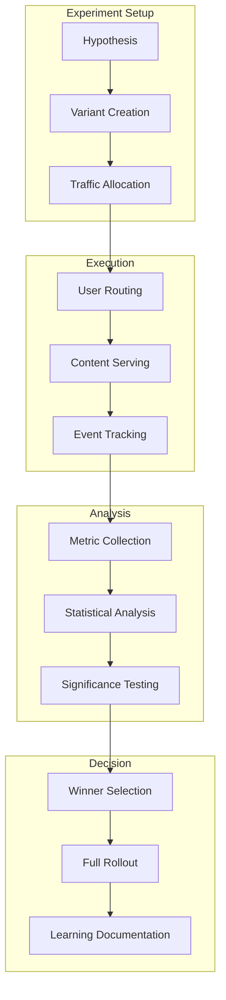
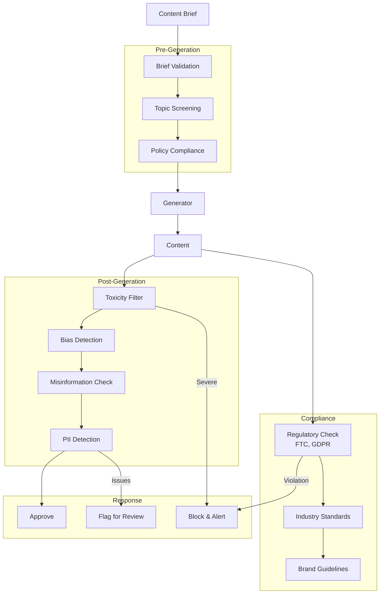

# Content Generation Pipeline Design

> **Design scalable content generation systems with quality control and human-in-the-loop workflows**

---

## Learning Objectives

By the end of this module, you will be able to:

- **Design content generation pipelines** for marketing, documentation, and media production
- **Implement quality control systems** with automated and human evaluation
- **Build human-in-the-loop workflows** for review, editing, and approval
- **Scale content generation** while maintaining quality and brand consistency
- **Address content safety** including plagiarism, misinformation, and harmful content

---

## Content Pipeline Architecture

### High-Level System Architecture



### Core Components

| Component | Purpose | Key Considerations |
|-----------|---------|-------------------|
| **Content Planner** | Strategy and scheduling | SEO, audience, goals |
| **Outline Generator** | Structure content | Hierarchy, flow, completeness |
| **Research Agent** | Gather supporting data | Source quality, recency |
| **Content Generator** | Produce draft content | Style, tone, accuracy |
| **Variation Generator** | A/B test versions | Statistical significance |
| **Quality Controller** | Automated checks | Speed vs thoroughness |
| **Human Review** | Expert validation | Workflow efficiency |

---

## Content Generation System

### Generation Pipeline



### Generation Strategies

| Strategy | Description | Use Case | Quality |
|----------|-------------|----------|---------|
| **Zero-shot** | Direct prompt | Simple content | Variable |
| **Few-shot** | Examples in prompt | Style matching | Good |
| **Chain-of-thought** | Step-by-step | Complex content | Better |
| **Multi-agent** | Specialized agents | Long-form | Best |
| **Iterative refinement** | Generate-review-improve | High quality | Excellent |

### Multi-Agent Content System



---

## Quality Control System

### Automated Quality Pipeline



### Quality Metrics

| Metric | Description | Target | Measurement |
|--------|-------------|--------|-------------|
| **Grammar score** | Error-free writing | >95% | LanguageTool |
| **Readability** | Target audience appropriate | Grade 6-12 (8-10 ideal) | Flesch-Kincaid |
| **Originality** | Unique content | >90% | Plagiarism tools |
| **Factual accuracy** | Verified claims | 100% critical | Fact-checking |
| **Brand compliance** | Style guide adherence | >95% | Custom rules |
| **Safety score** | No harmful content | 100% | Safety classifiers |

### Quality Scoring System

```python
def calculate_quality_score(content, checks):
    weights = {
        'grammar': 0.15,
        'readability': 0.10,
        'originality': 0.20,
        'accuracy': 0.25,
        'brand': 0.15,
        'safety': 0.15
    }

    scores = {
        'grammar': checks['grammar_errors'] == 0,
        'readability': 6 <= checks['grade_level'] <= 12,
        'originality': checks['plagiarism_score'] > 0.90,
        'accuracy': checks['fact_check_pass'],
        'brand': checks['style_compliance'] > 0.95,
        'safety': checks['safety_score'] == 1.0
    }

    total = sum(
        weights[k] * (1.0 if scores[k] else 0.0)
        for k in weights
    )

    return {
        'total_score': total,
        'components': scores,
        'pass': total >= 0.85 and scores['safety']
    }
```

---

## Human-in-the-Loop System

### Review Workflow Architecture



### Review Priority System

| Factor | Weight | Rationale |
|--------|--------|-----------|
| **Quality score** | 30% | Low scores need more review |
| **Content type** | 25% | Sensitive content prioritized |
| **Deadline** | 20% | Time-sensitive content |
| **Audience size** | 15% | High-reach content |
| **Risk level** | 10% | Compliance/legal risk |

### Editor Efficiency Features

::: info Reducing Review Time
A well-designed editor interface can reduce review time by 50-70%. Focus on:
- Side-by-side AI suggestions and human edits
- One-click approval for suggested changes
- Keyboard shortcuts for common actions
- Batch operations for similar content
:::



---

## Scaling Content Generation

### Horizontal Scaling Architecture



### Throughput Optimization

| Technique | Impact | Trade-off |
|-----------|--------|-----------|
| **Parallel generation** | Linear scaling | Resource cost |
| **Batching requests** | Better efficiency | Higher latency |
| **Caching templates** | 50% faster | Staleness |
| **Progressive generation** | Better UX | Implementation complexity |
| **Model tiering** | Cost savings | Quality variation |

### Content Generation SLAs

| Content Type | Volume | Latency Target | Quality Bar |
|--------------|--------|----------------|-------------|
| **Social posts** | 1000/day | <30 seconds | 85% auto-approved |
| **Blog articles** | 50/day | <5 minutes | 70% auto-approved |
| **Product descriptions** | 500/day | <1 minute | 90% auto-approved |
| **Email campaigns** | 100/day | <2 minutes | 80% auto-approved |
| **Technical docs** | 10/day | <15 minutes | 60% auto-approved |

---

## Personalization at Scale

### Personalization Architecture



### Personalization Variables

| Variable Type | Examples | Complexity |
|---------------|----------|------------|
| **Demographic** | Name, location, industry | Low |
| **Behavioral** | Past purchases, browsing | Medium |
| **Contextual** | Time, device, weather | Medium |
| **Predictive** | Intent, propensity | High |
| **Dynamic** | Real-time inventory, pricing | High |

### A/B Testing Framework



---

## Safety and Compliance

### Content Safety Architecture



### Compliance Requirements by Industry

| Industry | Key Requirements | Automated Checks |
|----------|------------------|------------------|
| **Healthcare** | HIPAA, FDA guidelines | Medical claims, PHI |
| **Finance** | SEC, fair lending | Financial claims, disclosures |
| **E-commerce** | FTC, consumer protection | Price accuracy, availability |
| **Education** | FERPA, accessibility | Student data, WCAG |
| **Media** | Copyright, defamation | IP infringement, fact-check |

---

## Interview Q&A

### Q1: How do you ensure content quality at scale?

**Answer:**
"I implement a multi-layer quality system:

**Automated checks (instant)**:
- Grammar and readability scoring
- Plagiarism detection
- Brand guideline compliance
- Safety/toxicity filtering

**LLM-based evaluation (seconds)**:
- Coherence and flow assessment
- Factual consistency checking
- Tone and style alignment

**Statistical sampling (ongoing)**:
- Human review of 5-10% of content
- Quality metrics tracking over time
- Regression detection

**Feedback loop**:
- Human corrections feed back to prompts
- Regular prompt optimization based on error patterns
- A/B testing of generation strategies

**Quality gates**:
- Auto-publish if score >= 85% and safety pass
- Human review if score 70-85%
- Reject and regenerate if score < 70%"

### Q2: Design a human-in-the-loop system for content review.

**Answer:**
"I design for efficiency and quality:

**Triage system**:
- Priority scoring based on content type, audience, deadline
- Auto-routing to appropriate reviewers by expertise
- Workload balancing across review team

**Editor interface**:
- Side-by-side AI draft vs editable version
- Inline suggestions with one-click accept/reject
- Template responses for common issues
- Keyboard shortcuts for efficiency

**Review workflow**:
1. Quick review: Accept/minor edits/reject
2. Deep review: For flagged or complex content
3. Approval chain: Multi-level for sensitive content

**Feedback capture**:
- Categorized rejection reasons
- Edit tracking for training data
- Quality metrics per reviewer

**Efficiency targets**:
- 70% auto-approved (no human touch)
- 25% quick review (<2 min)
- 5% deep review (<10 min)"

### Q3: How do you handle personalization at scale?

**Answer:**
"I use a template-based personalization system:

**Architecture**:
1. **Base content**: Core message with variable slots
2. **Variable library**: Pre-generated variations for common slots
3. **Dynamic generation**: Real-time generation for rare combinations

**Personalization layers**:
- **L1 (Simple)**: Name, company, location - direct substitution
- **L2 (Segment)**: Industry-specific messaging - pre-generated
- **L3 (Individual)**: Behavioral personalization - cached per user
- **L4 (Contextual)**: Time/device specific - real-time

**Efficiency optimizations**:
- Pre-generate top 80% of variations
- Cache frequently used combinations
- Batch generate during off-peak hours

**Quality assurance**:
- Test all variable combinations for coherence
- Fallback to generic if personalization fails
- A/B test personalization effectiveness

**Example**:
```
Template: 'Hi {name}, as a {industry} professional, you'll love...'
L1: name = 'Sarah'
L2: industry_content = [pre-generated for 'tech', 'finance', etc.]
```"

### Q4: How do you prevent AI-generated misinformation?

**Answer:**
"I implement verification at multiple stages:

**Source control**:
- Curate trusted sources for RAG
- Date-stamp information for recency
- Citation requirements in prompts

**Generation controls**:
- Conservative temperature (0.3-0.5) for factual content
- Ground responses in retrieved documents
- Explicit uncertainty language for unverified claims

**Post-generation verification**:
- Claim extraction from generated content
- Cross-reference claims against trusted databases
- Flag uncertain or unverifiable claims

**Human verification**:
- Mandatory review for sensitive topics (health, finance, legal)
- Expert review for technical accuracy
- Fact-checker review for news/current events

**Disclosure**:
- Clear AI-generated content labeling
- Confidence indicators where appropriate
- Links to source material

**Continuous monitoring**:
- User reporting mechanism
- Regular accuracy audits
- Rapid correction process for errors"

---

## Trade-off Analysis

| Decision | Option A | Option B | Recommendation |
|----------|----------|----------|----------------|
| **Review depth** | All human review (quality) | Mostly automated (speed) | Tiered by content risk |
| **Personalization** | Pre-generated (fast) | Real-time (relevant) | Hybrid approach |
| **Quality bar** | High (fewer published) | Lower (more content) | Adjust by channel |
| **Generation speed** | Fast models (volume) | Better models (quality) | Route by content type |
| **Feedback detail** | Detailed (training value) | Simple (reviewer time) | Structured categories |

---

## System Design Checklist

Before finalizing your content pipeline design, verify:

- [ ] Multi-agent content generation architecture
- [ ] Automated quality scoring system
- [ ] Plagiarism and originality checking
- [ ] Fact-checking and accuracy verification
- [ ] Human review workflow with prioritization
- [ ] Feedback loop for continuous improvement
- [ ] Personalization engine with variant management
- [ ] A/B testing framework for optimization
- [ ] Safety and compliance checks
- [ ] Performance metrics and monitoring
- [ ] Scaling strategy for volume requirements

---

## Navigation

| Previous | Next |
|----------|------|
| [Code Assistant](./code-assistant) | [Interview Questions](./interview-questions) |

---

## Sources

- Brown, T. et al. (2020). *Language Models are Few-Shot Learners*. https://arxiv.org/abs/2005.14165
- OpenAI. (2024). *GPT Best Practices*. https://platform.openai.com/docs/guides/gpt-best-practices
- Google. (2024). *Responsible AI Practices*. https://ai.google/responsibility/responsible-ai-practices/
- Anthropic. (2024). *Claude Content Policy*. https://www.anthropic.com/policies/claude-content-policy
- LangChain. (2024). *Building Production LLM Applications*. https://docs.langchain.com
- Jasper. (2024). *Enterprise Content Generation*. https://www.jasper.ai/
