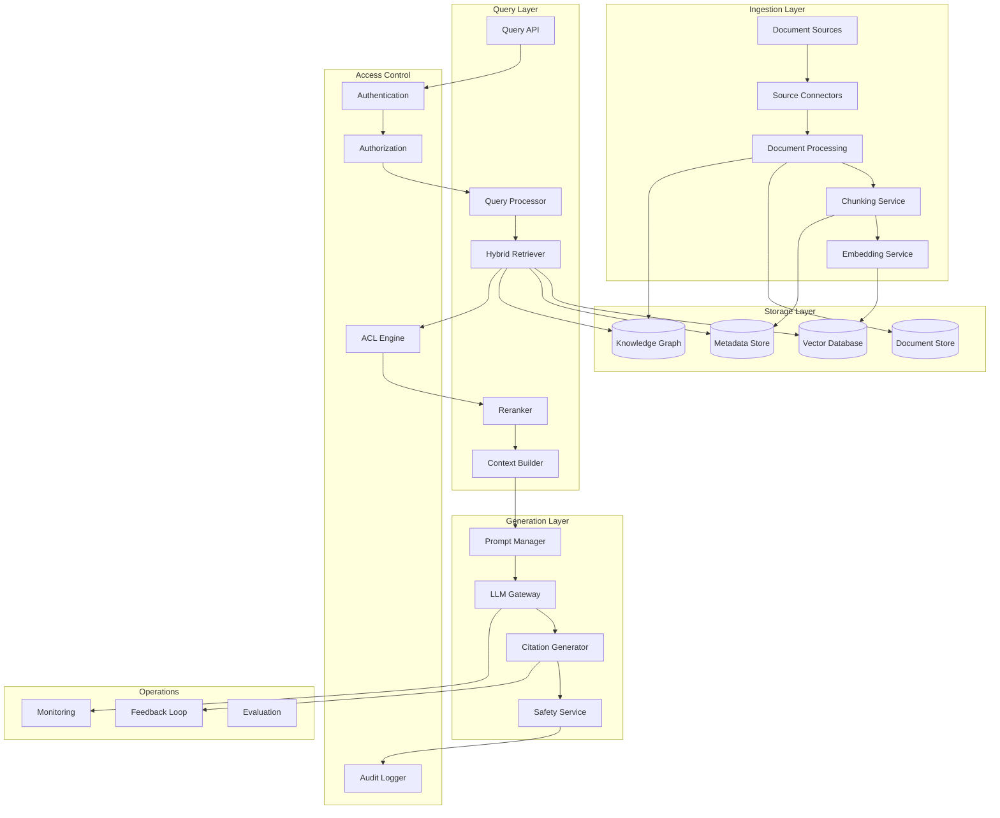
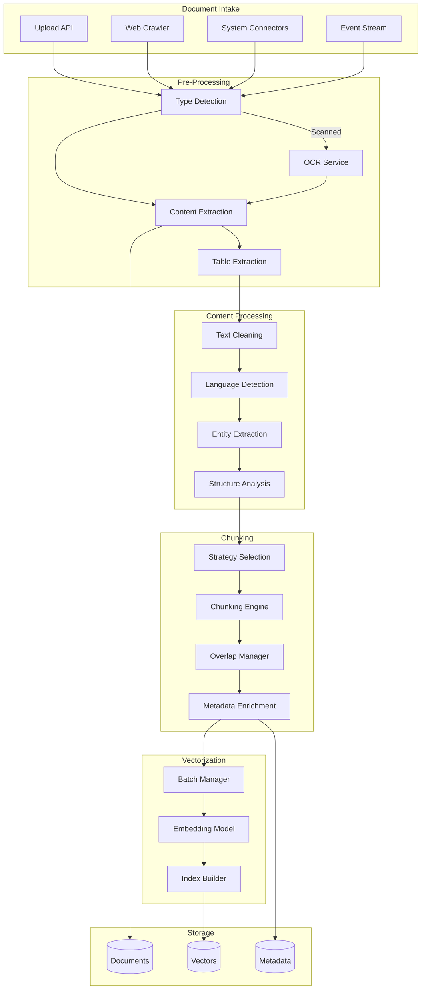
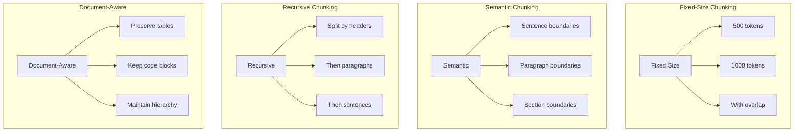
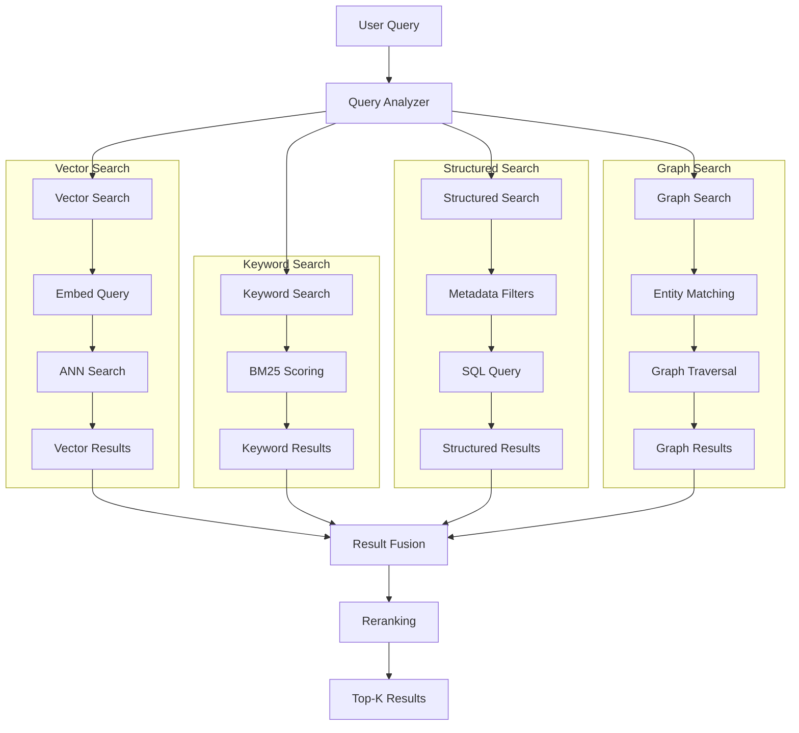
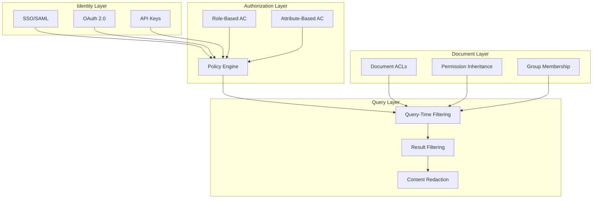
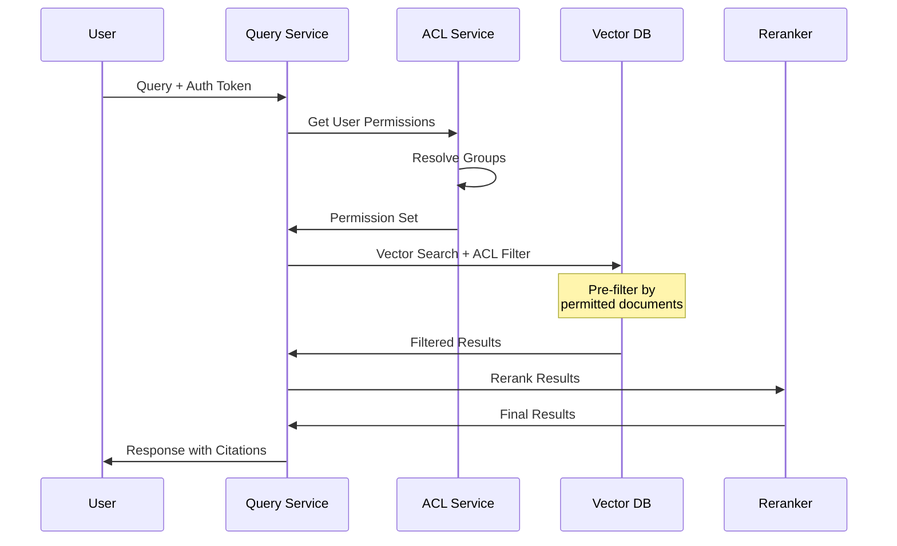
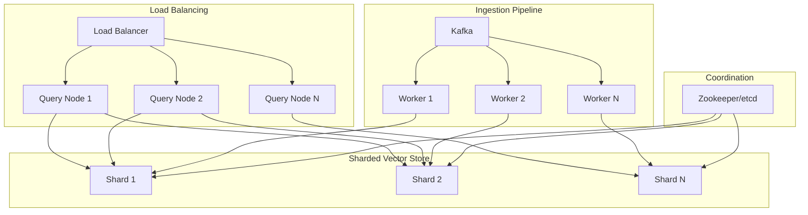
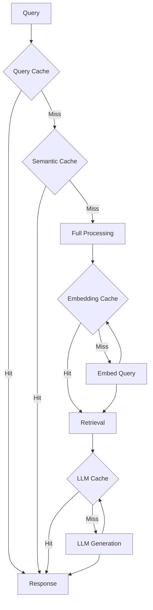
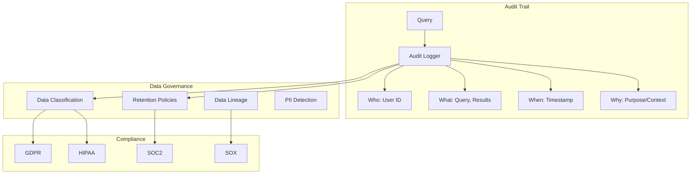

# Enterprise RAG System Design

> **Design production-grade knowledge base systems with document processing, access control, and scale**

---

## Learning Objectives

By the end of this module, you will be able to:

- **Architect enterprise RAG systems** with multi-tenant support and access control
- **Design document processing pipelines** for diverse document types and formats
- **Implement hybrid search strategies** combining vector, keyword, and structured search
- **Build scalable retrieval systems** handling millions of documents
- **Address enterprise concerns** including security, compliance, and auditability

---

## Enterprise RAG Architecture

### High-Level System Architecture



### Core Components

| Component | Purpose | Enterprise Considerations |
|-----------|---------|--------------------------|
| **Source Connectors** | Ingest from various systems | SharePoint, Confluence, S3, databases |
| **Document Processing** | Extract and structure content | OCR, table extraction, metadata |
| **Chunking Service** | Split documents optimally | Semantic boundaries, overlap |
| **Embedding Service** | Generate vector representations | Batch processing, model versioning |
| **Hybrid Retriever** | Multi-strategy search | Vector + keyword + structured |
| **ACL Engine** | Access control enforcement | Real-time permission checking |
| **Citation Generator** | Source attribution | Compliance, trustworthiness |

---

## Document Processing Pipeline

### Processing Architecture



### Document Type Handling

| Document Type | Extraction Method | Chunking Strategy | Considerations |
|---------------|-------------------|-------------------|----------------|
| **PDF** | PyMuPDF, pdfplumber | Page-aware, heading-based | Tables, images, OCR fallback |
| **Word/DOCX** | python-docx | Section/heading-based | Styles, tables, embedded objects |
| **HTML** | BeautifulSoup | DOM-aware, semantic tags | Navigation removal, content extraction |
| **Markdown** | Unified parser | Header-based hierarchy | Code blocks, links |
| **PowerPoint** | python-pptx | Slide-based | Speaker notes, visual context |
| **Excel** | openpyxl, pandas | Sheet/table-based | Formula context, named ranges |
| **Email** | email parser | Thread-aware | Attachments, conversation threading |

### Chunking Strategies



::: info Chunking Best Practices
- **Chunk size**: 256-512 tokens for precise retrieval, 512-1024 for context-rich
- **Overlap**: 10-20% overlap to maintain context continuity
- **Semantic boundaries**: Prefer splitting at natural breaks (paragraphs, sections)
- **Metadata preservation**: Attach source, page, section info to each chunk
:::

### Chunking Parameters Comparison

| Strategy | Chunk Size | Overlap | Use Case | Trade-offs |
|----------|------------|---------|----------|------------|
| **Small chunks** | 256 tokens | 50 tokens | Precise Q&A | May miss context |
| **Medium chunks** | 512 tokens | 100 tokens | General RAG | Balanced |
| **Large chunks** | 1024 tokens | 200 tokens | Summarization | Lower precision |
| **Semantic** | Variable | Natural | Technical docs | Complex implementation |

---

## Hybrid Search Architecture

### Multi-Strategy Retrieval



### Fusion Strategies

| Strategy | Description | Pros | Cons |
|----------|-------------|------|------|
| **Reciprocal Rank Fusion (RRF)** | Combine by reciprocal ranks | Simple, effective | Ignores score magnitude |
| **Weighted Average** | Weight scores by source | Tunable | Requires score normalization |
| **Learn-to-Rank** | ML model for fusion | Optimal | Training data needed |
| **Cascade** | Sequential filtering | Efficient | May miss good results |

### RRF Implementation

```python
def reciprocal_rank_fusion(result_lists, k=60):
    """
    Combine multiple ranked lists using RRF.
    k: smoothing constant (typically 60)
    """
    fused_scores = {}

    for result_list in result_lists:
        for rank, doc_id in enumerate(result_list):
            if doc_id not in fused_scores:
                fused_scores[doc_id] = 0
            fused_scores[doc_id] += 1 / (k + rank + 1)

    # Sort by fused score
    return sorted(fused_scores.items(),
                  key=lambda x: x[1],
                  reverse=True)
```

---

## Access Control System

### Multi-Tenant Architecture



### Permission Models

| Model | Description | Use Case | Complexity |
|-------|-------------|----------|------------|
| **RBAC** | Role-based access | Simple org structures | Low |
| **ABAC** | Attribute-based | Complex policies | Medium |
| **ACL** | Per-document permissions | Fine-grained control | High |
| **Hierarchical** | Folder inheritance | File systems | Medium |
| **Hybrid** | Combination | Enterprise | High |

### Query-Time Access Control

::: info Performance Consideration
Access control filtering at query time can significantly impact latency. Pre-compute permission sets where possible, and use efficient filtering strategies.
:::



### ACL Implementation Approaches

| Approach | Description | Pros | Cons |
|----------|-------------|------|------|
| **Pre-filter** | Filter before search | Fast queries | Index per permission set |
| **Post-filter** | Filter after search | Simple index | Over-fetch needed |
| **Hybrid** | Coarse pre + fine post | Balanced | Implementation complexity |
| **Materialized views** | Pre-computed per user/group | Fastest queries | Storage cost, staleness |

---

## Scaling Strategies

### Horizontal Scaling Architecture



### Scaling Dimensions

| Dimension | Strategy | Implementation |
|-----------|----------|----------------|
| **Documents** | Horizontal sharding | Shard by tenant, date, or hash |
| **Queries** | Read replicas | Multiple query nodes per shard |
| **Embeddings** | Batch processing | Async ingestion queue |
| **LLM Calls** | Rate limiting + caching | Semantic cache, request coalescing |
| **Tenants** | Isolation | Dedicated shards or namespaces |

### Caching Strategy



| Cache Level | Hit Rate | Latency Savings | Freshness |
|-------------|----------|-----------------|-----------|
| **Query (exact)** | 10-20% | 95% | Immediate |
| **Semantic** | 30-50% | 90% | Configurable |
| **Embedding** | 80%+ | 50ms | Stable |
| **LLM Response** | 20-40% | 80% | Configurable |

---

## Enterprise Considerations

### Compliance and Audit



### Enterprise Features Checklist

| Feature | Description | Implementation |
|---------|-------------|----------------|
| **SSO Integration** | Enterprise identity | SAML, OIDC |
| **Audit Logging** | Query and access logs | Structured logging, retention |
| **Data Classification** | Sensitivity levels | Metadata tagging |
| **Retention Policies** | Automatic deletion | TTL, archival |
| **Encryption** | At rest and in transit | TLS, AES-256 |
| **Backup/Recovery** | Disaster recovery | Regular snapshots |
| **SLA Monitoring** | Uptime and performance | Prometheus, alerts |

---

## Interview Q&A

### Q1: How do you handle documents with different access levels in RAG?

**Answer:**
"I implement a multi-layer access control strategy:

1. **Index-time tagging**: Each document chunk gets ACL metadata (permitted users, groups, roles)

2. **Query-time filtering**: Two approaches:
   - **Pre-filter**: Include ACL predicates in vector search (e.g., `permitted_groups IN user.groups`)
   - **Post-filter**: Over-fetch results, then filter by permissions

3. **Hybrid approach** for scale:
   - Coarse pre-filtering by department/tenant (reduces search space)
   - Fine post-filtering for specific document permissions

4. **Caching**: Cache permission sets per user with short TTL to handle permission changes

5. **Audit**: Log all queries with user context for compliance

For very sensitive environments, I'd consider separate indexes per permission level to ensure complete isolation."

### Q2: How do you optimize retrieval quality in enterprise RAG?

**Answer:**
"I use a multi-stage retrieval pipeline:

**Stage 1: Query Enhancement**
- Query expansion using synonyms and related terms
- Query decomposition for complex questions
- Intent classification to route to appropriate sources

**Stage 2: Hybrid Retrieval**
- Vector search for semantic similarity
- BM25 for keyword matching
- Metadata filters for structured constraints
- Fusion using Reciprocal Rank Fusion

**Stage 3: Reranking**
- Cross-encoder reranking (e.g., Cohere, BGE)
- Diversity injection to avoid redundant results
- Recency weighting for time-sensitive queries

**Stage 4: Context Optimization**
- Parent-child retrieval: retrieve chunks, expand to parent context
- Lost-in-the-middle mitigation: order by relevance, not position
- Compression: summarize verbose contexts

I measure quality using retrieval metrics (MRR, NDCG) and end-to-end evaluation with LLM-as-judge."

### Q3: How would you scale a RAG system to handle millions of documents?

**Answer:**
"I design for horizontal scalability at each layer:

**Ingestion**:
- Async processing via message queue (Kafka)
- Parallel workers for embedding generation
- Batch embedding (reduce API calls)
- Incremental indexing (update only changed documents)

**Storage**:
- Sharded vector database (by tenant or document hash)
- Index partitioning for large collections
- Tiered storage (hot/warm/cold) based on access patterns

**Query**:
- Query routing to relevant shards
- Caching at multiple levels (query, embedding, LLM)
- Read replicas for high-traffic tenants
- Rate limiting per tenant

**Specific numbers**:
- 1M documents: Single node Qdrant/Pinecone
- 10M documents: Sharded deployment, 3-5 shards
- 100M+ documents: Distributed cluster, tenant isolation

Key optimizations:
- Quantization (reduce vector size by 4x)
- HNSW parameter tuning (ef_construction, M)
- Product quantization for memory efficiency"

### Q4: How do you ensure answer quality and prevent hallucinations?

**Answer:**
"I implement multiple layers of quality assurance:

**Retrieval Quality**:
- Relevance thresholds (reject low-scoring retrievals)
- Source diversity requirements
- Citation extraction and verification

**Generation Quality**:
- Grounded generation prompts ('only answer based on provided context')
- Temperature 0 for factual responses
- Structured output formats where possible

**Post-Generation Checks**:
- Citation verification (does the answer match sources?)
- Consistency checking (multiple generations agree?)
- Fact-checking against structured data

**Confidence Signaling**:
- 'I don't have information about X'
- 'Based on available documents...'
- Confidence scores exposed to users

**Continuous Improvement**:
- User feedback collection
- Regular human evaluation sampling
- Automated regression testing on known Q&A pairs

For high-stakes domains (legal, medical), I add human-in-the-loop review for uncertain responses."

---

## Trade-off Analysis

| Decision | Option A | Option B | Recommendation |
|----------|----------|----------|----------------|
| **Chunking Size** | Small (precise) | Large (contextual) | Medium with overlap |
| **Search Strategy** | Vector only (semantic) | Hybrid (comprehensive) | Hybrid for enterprise |
| **Access Control** | Pre-filter (fast) | Post-filter (flexible) | Hybrid approach |
| **Embedding Model** | Small (fast) | Large (accurate) | Large for quality-critical |
| **Caching** | Aggressive (fast) | Conservative (fresh) | Semantic cache with TTL |
| **Reranking** | Skip (fast) | Cross-encoder (accurate) | Always for enterprise |

---

## Navigation

| Previous | Next |
|----------|------|
| [Chatbot Design](./chatbot-design) | [Code Assistant](./code-assistant) |

---

## Sources

- Lewis, P. et al. (2020). *Retrieval-Augmented Generation for Knowledge-Intensive NLP Tasks*. https://arxiv.org/abs/2005.11401
- Gao, L. et al. (2023). *Retrieval-Augmented Generation for Large Language Models: A Survey*. https://arxiv.org/abs/2312.10997
- Liu, N. et al. (2023). *Lost in the Middle: How Language Models Use Long Contexts*. https://arxiv.org/abs/2307.03172
- Pinecone. (2024). *Vector Database Scaling Guide*. https://docs.pinecone.io/guides/
- Weaviate. (2024). *Hybrid Search Documentation*. https://weaviate.io/developers/weaviate
- LlamaIndex. (2024). *Advanced RAG Techniques*. https://docs.llamaindex.ai/en/stable/optimizing/
