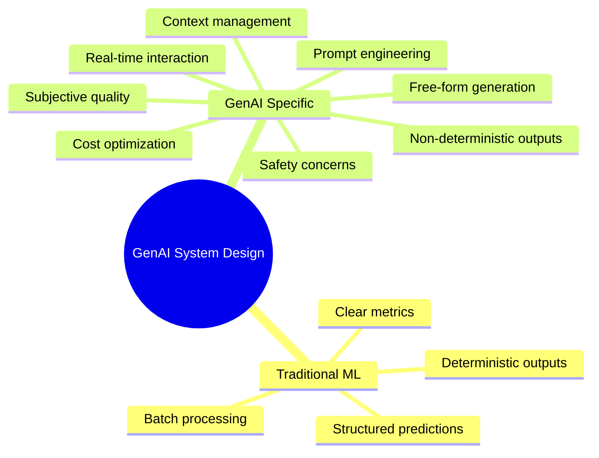
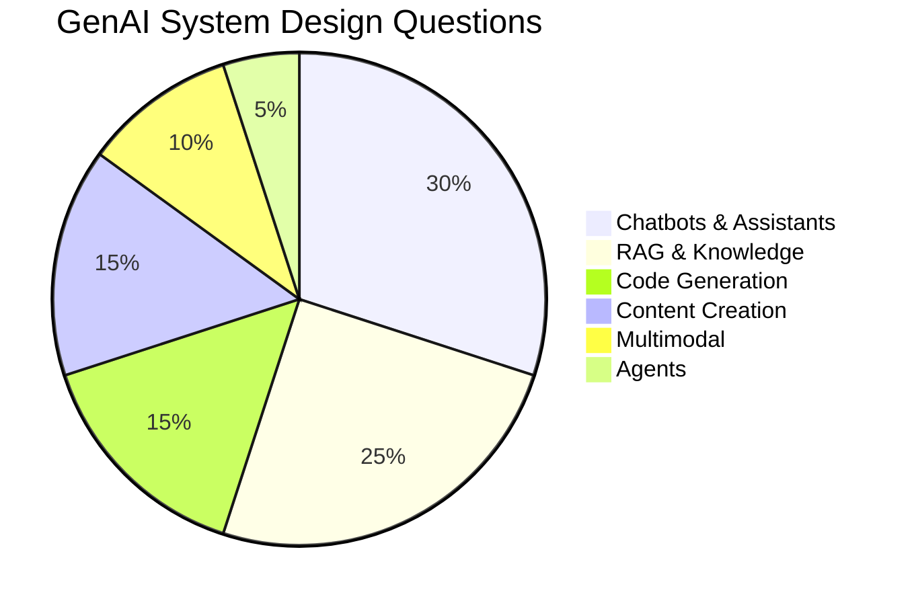
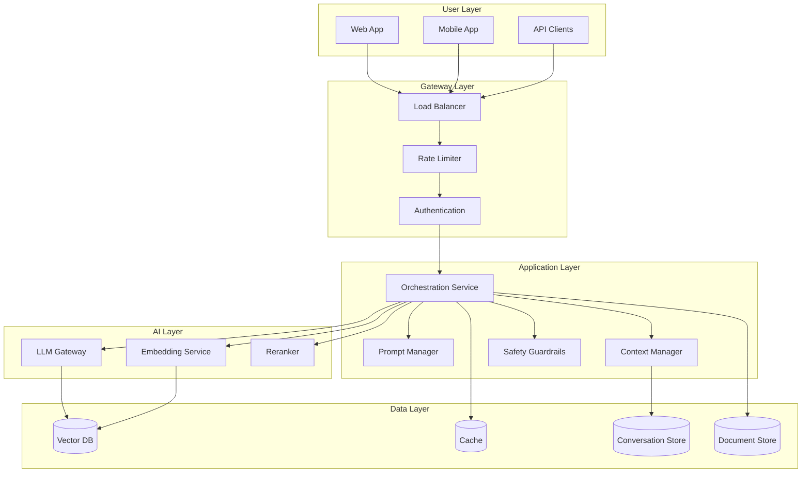

# GenAI System Design

> **Master the art of designing production-ready GenAI systems for engineering interviews**

---

## Overview

GenAI system design interviews evaluate your ability to architect end-to-end AI-powered applications. Unlike traditional ML system design, GenAI systems involve unique challenges: prompt engineering at scale, retrieval-augmented generation, multi-turn conversations, content safety, and the inherent non-determinism of large language models.

This section prepares you for the most common GenAI system design questions asked at top tech companies.

---

## Learning Objectives

By completing this section, you will be able to:

- **Apply a structured framework** for approaching any GenAI system design problem
- **Design production chatbots** with multi-turn context management, persona control, and human handoff
- **Architect enterprise RAG systems** with document processing pipelines, access control, and hybrid search
- **Build code assistant systems** like GitHub Copilot with completion, review, and test generation
- **Design content pipelines** with quality control, human-in-the-loop, and scale considerations
- **Confidently answer** the 15-20 most common GenAI system design interview questions

---

## Module Structure

| Module | Focus | Key Topics |
|--------|-------|------------|
| [Design Framework](./design-framework) | Methodology | 6-step approach, requirements, trade-offs |
| [Chatbot Design](./chatbot-design) | Conversational AI | Multi-turn, persona, safety, human handoff |
| [Enterprise RAG](./enterprise-rag) | Knowledge Systems | Document processing, access control, scale |
| [Code Assistant](./code-assistant) | Developer Tools | Completion, review, test generation |
| [Content Pipeline](./content-pipeline) | Content Generation | Quality control, HITL, scale |
| [Interview Questions](./interview-questions) | Practice | 15-20 questions with detailed solutions |

---

## What Makes GenAI System Design Different

### Key Differences from Traditional ML System Design

| Aspect | Traditional ML | GenAI Systems |
|--------|---------------|---------------|
| **Output** | Structured (class, score) | Unstructured (text, code) |
| **Determinism** | Same input → same output | Same input → varied outputs |
| **Latency** | Milliseconds | Seconds (streaming) |
| **Cost** | Fixed per prediction | Token-based, variable |
| **Evaluation** | Precision, recall, F1 | Human eval, LLM-as-judge |
| **Safety** | Bias in predictions | Harmful content generation |
| **Context** | Feature vectors | Conversation history |
| **Personalization** | User embeddings | System prompts, persona |

---

## The GenAI System Design Interview

### What Interviewers Look For

::: info Interview Evaluation Criteria
1. **Problem Decomposition**: Can you break down ambiguous requirements?
2. **Architecture Skills**: Can you design scalable, reliable systems?
3. **GenAI Depth**: Do you understand LLM-specific challenges?
4. **Trade-off Analysis**: Can you compare approaches objectively?
5. **Production Thinking**: Do you consider monitoring, safety, cost?
:::

### Common Question Categories

---

## Quick Reference: The 6-Step Framework

| Step | Time | Focus | Key Questions |
|------|------|-------|---------------|
| 1. Clarify | 5 min | Requirements | Who? What? Why? Scale? |
| 2. Architecture | 10 min | High-level design | Components? Data flow? |
| 3. Components | 15 min | Deep dive | LLM choice? Retrieval? Prompt? |
| 4. Optimization | 5 min | Performance | Latency? Cost? Quality? |
| 5. Safety | 5 min | Guardrails | Content safety? PII? Bias? |
| 6. Operations | 5 min | Production | Monitoring? Evaluation? Updates? |

---

## Technology Stack Overview

---

## Interview Preparation Checklist

Before your interview, ensure you can:

- [ ] Draw a complete GenAI system architecture in under 10 minutes
- [ ] Explain the trade-offs between different LLM providers
- [ ] Design a RAG pipeline with chunking, embedding, and retrieval
- [ ] Implement conversation context management strategies
- [ ] Describe prompt engineering best practices
- [ ] Address content safety and guardrails
- [ ] Discuss cost optimization techniques
- [ ] Explain evaluation strategies for GenAI systems
- [ ] Handle multi-tenant and access control requirements
- [ ] Design for scale, reliability, and observability

---

## Navigation

| Previous | Next |
|----------|------|
| - | [Design Framework](./design-framework) |

---

## Sources

- OpenAI. (2024). *GPT-4 System Card*. https://openai.com/research/gpt-4-system-card
- Anthropic. (2024). *Claude Model Card*. https://www.anthropic.com/claude
- Lewis, P. et al. (2020). *Retrieval-Augmented Generation for Knowledge-Intensive NLP Tasks*. https://arxiv.org/abs/2005.11401
- LangChain. (2024). *LangChain Documentation*. https://docs.langchain.com
- LlamaIndex. (2024). *LlamaIndex Documentation*. https://docs.llamaindex.ai
