# GenAI System Design Interview Questions

> **15-20 comprehensive interview questions with detailed solutions**

---

## Learning Objectives

By completing this section, you will be able to:

- **Answer common GenAI system design questions** confidently in interviews
- **Apply the 6-step framework** to structure your responses
- **Discuss trade-offs** and justify architectural decisions
- **Demonstrate production-level thinking** on safety, scale, and operations
- **Handle follow-up questions** with depth and clarity

---

## Question Overview

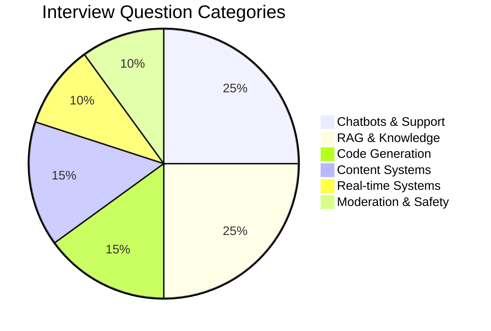

| # | Question | Category | Difficulty |
|---|----------|----------|------------|
| 1 | Design a customer support chatbot | Chatbot | Medium |
| 2 | Design a RAG system for legal documents | RAG | Hard |
| 3 | Design GitHub Copilot | Code | Hard |
| 4 | Design a content moderation system | Safety | Medium |
| 5 | Design a real-time translation system | Real-time | Medium |
| 6 | Design an AI writing assistant | Content | Medium |
| 7 | Design a meeting summarization system | Content | Medium |
| 8 | Design an AI code review system | Code | Hard |
| 9 | Design an enterprise search system | RAG | Hard |
| 10 | Design a conversational shopping assistant | Chatbot | Medium |
| 11 | Design a document Q&A system | RAG | Medium |
| 12 | Design an automated email response system | Content | Medium |
| 13 | Design a personalized learning assistant | Chatbot | Hard |
| 14 | Design a multi-modal content generator | Content | Hard |
| 15 | Design an AI-powered help center | RAG | Medium |

---

## Question 1: Design a Customer Support Chatbot

### Problem Statement
Design an AI-powered customer support chatbot for an e-commerce company with 10M users, handling 100K conversations per day.

### Clarifying Questions
- **User base**: B2C customers, mixed technical expertise
- **Scope**: Order status, returns, product questions, billing
- **Scale**: 100K conversations/day, 500 concurrent peak
- **Quality**: 70% first-contact resolution, <5% escalation to bad outcomes
- **Integration**: Existing CRM (Zendesk), order management system

### Solution Architecture

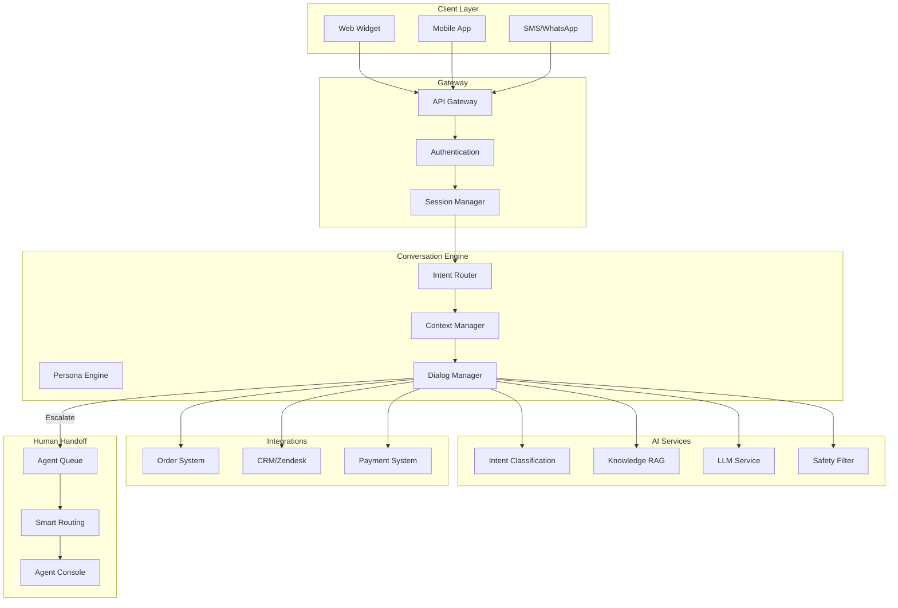

### Key Design Decisions

| Component | Decision | Rationale |
|-----------|----------|-----------|
| **LLM** | GPT-4 for complex, GPT-3.5 for simple | Cost optimization with quality routing |
| **Context** | Hybrid: recent full + summarized older | Balance cost and context quality |
| **RAG** | Hybrid search on FAQ + policies | Handle known queries efficiently |
| **Handoff** | Multi-signal scoring | Balance automation and user satisfaction |
| **Persona** | Friendly, professional, boundary-aware | Brand alignment |

### Conversation Flow

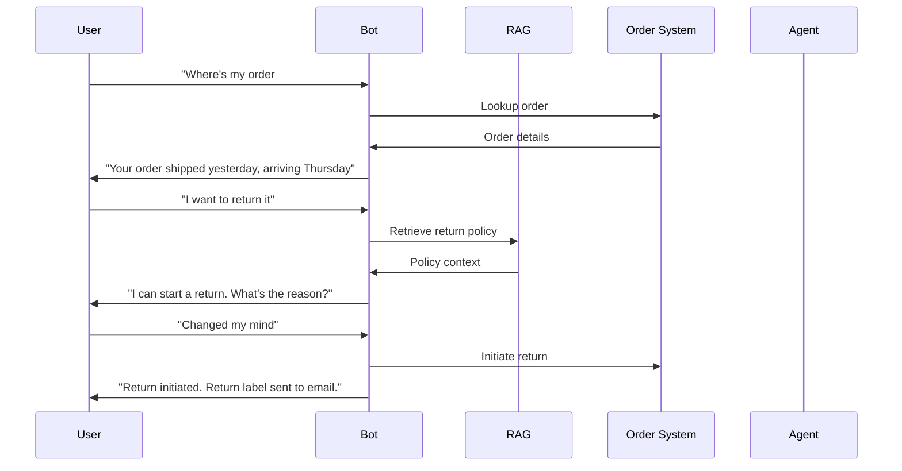

### Metrics

| Metric | Target | Measurement |
|--------|--------|-------------|
| First-contact resolution | 70% | % conversations resolved without handoff |
| Customer satisfaction | 4.2/5 | Post-chat survey |
| Average handle time | <3 min | Time from start to resolution |
| Escalation rate | <15% | % transferred to human |
| Response latency | <2 sec | P95 response time |

---

## Question 2: Design a RAG System for Legal Documents

### Problem Statement
Design a document Q&A system for a law firm with 500K legal documents, requiring strict access control and citation accuracy.

### Clarifying Questions
- **Documents**: Contracts, case law, memos, briefs (500K docs, 50GB)
- **Users**: 500 lawyers, different practice areas and client access
- **Quality**: Answers must cite sources, high accuracy required
- **Security**: Client confidentiality, privilege protection, audit trails
- **Scale**: 10K queries/day, complex multi-hop questions

### Solution Architecture

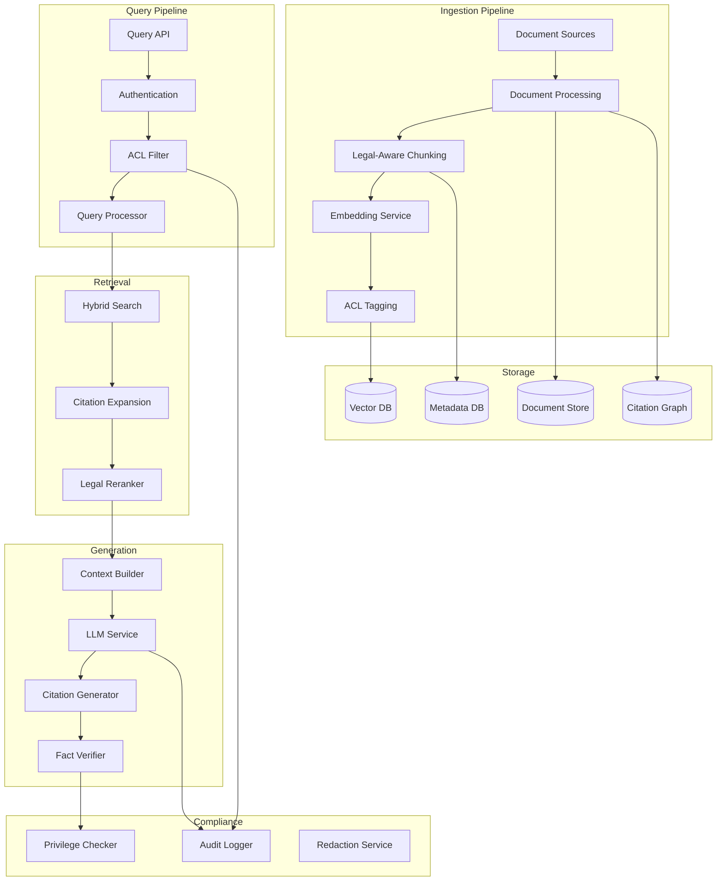

### Access Control System

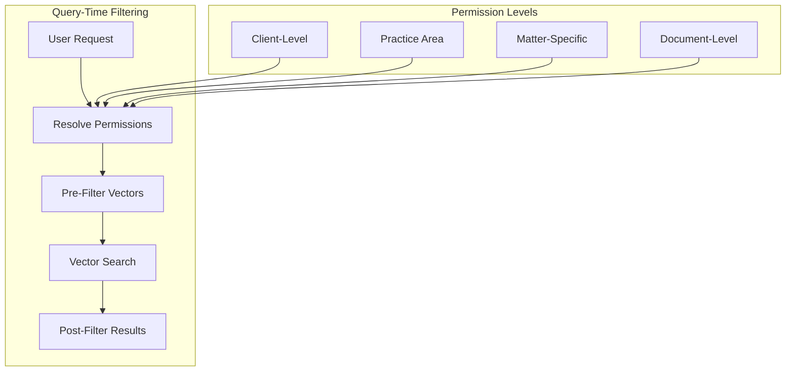

### Trade-offs

| Decision | Option A | Option B | Chosen | Rationale |
|----------|----------|----------|--------|-----------|
| **Chunking** | Fixed size | Legal-aware (sections) | Legal-aware | Preserve legal context |
| **Search** | Vector only | Hybrid + citation | Hybrid | Legal terms need exact match |
| **Access control** | Post-filter | Pre-filter | Pre-filter | Efficiency at scale |
| **Citation** | Inline | Separate section | Both | Usability + verification |

---

## Question 3: Design GitHub Copilot

### Problem Statement
Design an AI code completion system that integrates with IDEs and provides intelligent code suggestions in real-time.

### Clarifying Questions
- **Users**: Individual developers and enterprises (10M users)
- **Languages**: All major programming languages (Python, JS, Java, etc.)
- **Latency**: <200ms for first suggestion
- **Features**: Completion, chat, code explanation, test generation
- **Scale**: 1B completions/day, 10M concurrent users

### Solution Architecture

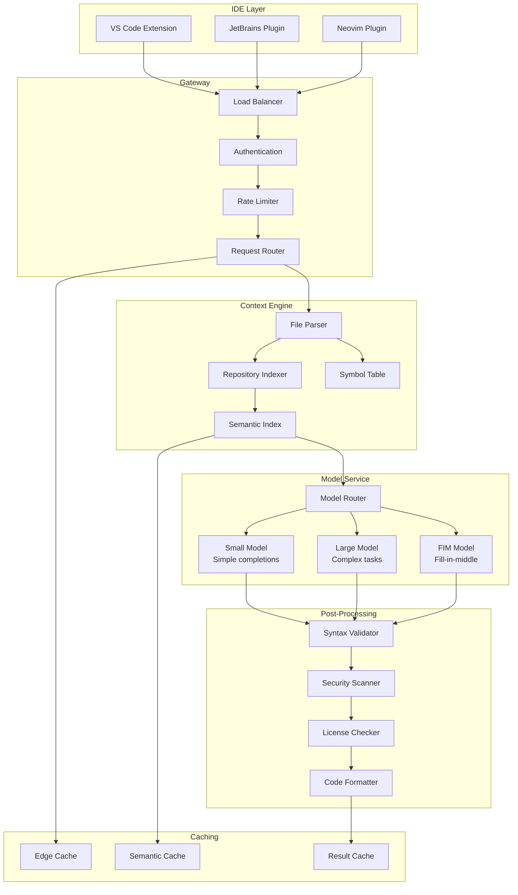

### Context Window Strategy

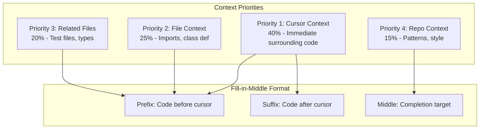

### Latency Optimization

| Component | Latency | Optimization |
|-----------|---------|--------------|
| IDE → Gateway | 20ms | Edge servers |
| Auth/Rate limit | 5ms | Token caching |
| Context collection | 30ms | Pre-indexed, incremental |
| Model inference | 100ms | Speculative decoding, quantization |
| Post-processing | 20ms | Parallel checks |
| Gateway → IDE | 20ms | Streaming |
| **Total** | **195ms** | |

---

## Question 4: Design a Content Moderation System

### Problem Statement
Design an AI-powered content moderation system for a social media platform with 500M posts per day.

### Clarifying Questions
- **Content types**: Text, images, videos, links
- **Policies**: Hate speech, violence, nudity, spam, misinformation
- **Scale**: 500M posts/day, 99.9% must be processed within 1 minute
- **Quality**: <1% false positive rate, <5% false negative for severe content
- **Appeals**: Human review process for contested decisions

### Solution Architecture

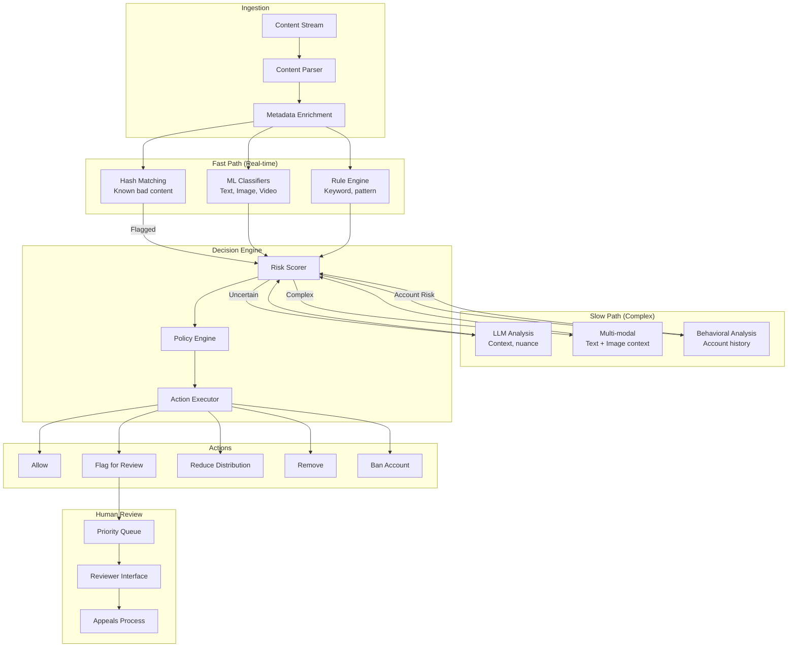

### Classification Categories

| Category | Severity | Latency | Method |
|----------|----------|---------|--------|
| **CSAM** | Critical | <1s | Hash matching + ML |
| **Violence/Gore** | High | <10s | Image classifier |
| **Hate Speech** | High | <30s | Text classifier + LLM |
| **Nudity** | Medium | <30s | Image classifier |
| **Spam** | Low | <1min | Pattern + behavioral |
| **Misinformation** | Variable | <5min | LLM + fact-check |

### Trade-offs

| Decision | Trade-off | Chosen Approach |
|----------|-----------|-----------------|
| Speed vs Accuracy | Fast but more errors vs Slow but accurate | Tiered: fast for clear cases, slow for edge cases |
| Over vs Under-moderation | User frustration vs Platform risk | Calibrate by severity: strict for severe |
| Automation vs Human | Scale vs Cost | Human review for appeals and training |

---

## Question 5: Design a Real-Time Translation System

### Problem Statement
Design a real-time translation system for live video calls supporting 50 languages with sub-second latency.

### Solution Architecture

```mermaid
graph TB
    subgraph "Audio Pipeline"
        Input[Audio Input]
        VAD[Voice Activity Detection]
        ASR[Speech Recognition]
        Streaming[Streaming ASR]
    end

    subgraph "Translation"
        Segment[Segment Manager]
        Translation[Translation Service]
        Context[Context Memory]
    end

    subgraph "Synthesis"
        TTS[Text-to-Speech]
        Voice[Voice Cloning]
        Sync[Audio Sync]
    end

    subgraph "Output"
        Mix[Audio Mixer]
        Captions[Live Captions]
        Output[Output Stream]
    end

    Input --> VAD --> ASR --> Streaming
    Streaming --> Segment --> Translation
    Context --> Translation
    Translation --> Context

    Translation --> TTS --> Voice --> Sync
    Sync --> Mix --> Output
    Translation --> Captions
```

### Latency Requirements

```
End-to-end target: 800ms

Audio capture:      50ms  ██
VAD + buffering:   100ms  ████
ASR (streaming):   200ms  ████████
Translation:       200ms  ████████
TTS:               150ms  ██████
Output + sync:     100ms  ████
                   ─────
Total:             800ms
```

### Key Design Decisions

| Component | Decision | Rationale |
|-----------|----------|-----------|
| **ASR** | Streaming (Whisper) | Low latency over accuracy |
| **Translation** | Chunk-based with context | Balance latency and coherence |
| **TTS** | Neural TTS with voice matching | Natural output |
| **Caching** | Common phrase caching | Reduce latency for frequent phrases |

---

## Question 6: Design an AI Writing Assistant

### Problem Statement
Design a writing assistant like Grammarly or Notion AI for 50M users.

### Solution Architecture

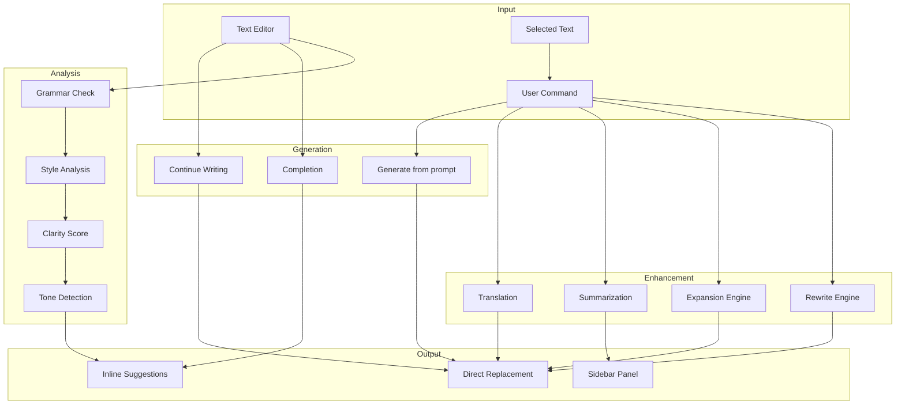

### Feature Comparison

| Feature | Latency | Model | Complexity |
|---------|---------|-------|------------|
| Grammar check | Real-time | Small/Rule-based | Low |
| Style suggestions | 500ms | Small LLM | Medium |
| Rewrite | 1-2s | GPT-3.5 | Medium |
| Long-form generation | 5-10s | GPT-4 | High |
| Translation | 1-2s | Specialized | Medium |

---

## Question 7: Design a Meeting Summarization System

### Problem Statement
Design a system that automatically summarizes video meetings and extracts action items.

### Solution Architecture

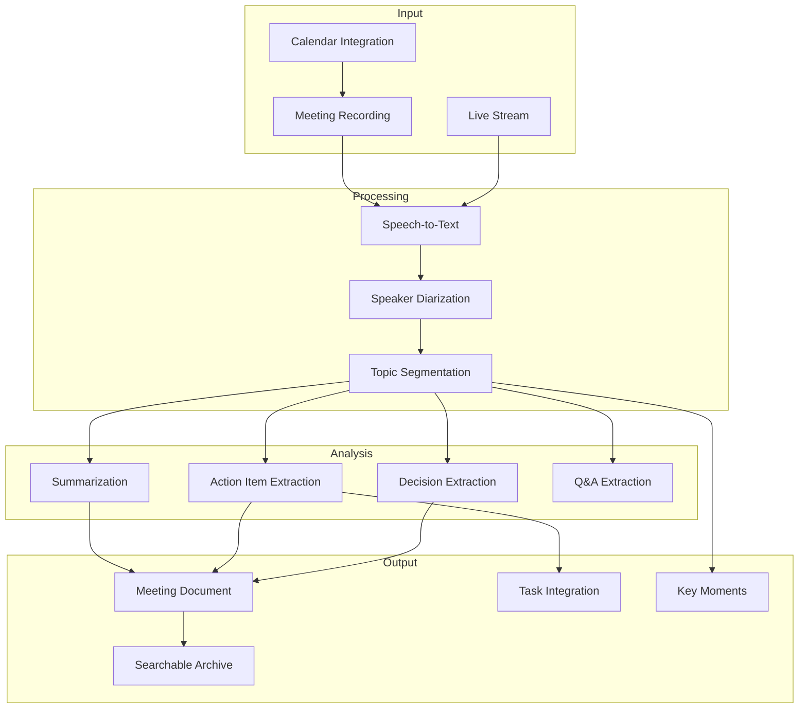

### Output Format

```markdown
# Meeting Summary: Q4 Planning
**Date**: 2024-01-15 | **Duration**: 45 min | **Participants**: 5

## Key Decisions
1. Launch date moved to March 1st
2. Budget approved for additional engineer

## Action Items
- [ ] @sarah: Finalize design specs by Jan 20
- [ ] @mike: Set up staging environment by Jan 25
- [ ] @team: Review PRD and provide feedback

## Discussion Summary
### Product Roadmap (0:00-15:00)
Discussed Q1 priorities, agreed to focus on mobile first...

### Resource Planning (15:00-30:00)
Reviewed current capacity, identified need for backend help...
```

---

## Question 8: Design an AI Code Review System

### Problem Statement
Design an automated code review system that integrates with GitHub/GitLab.

### Solution Architecture

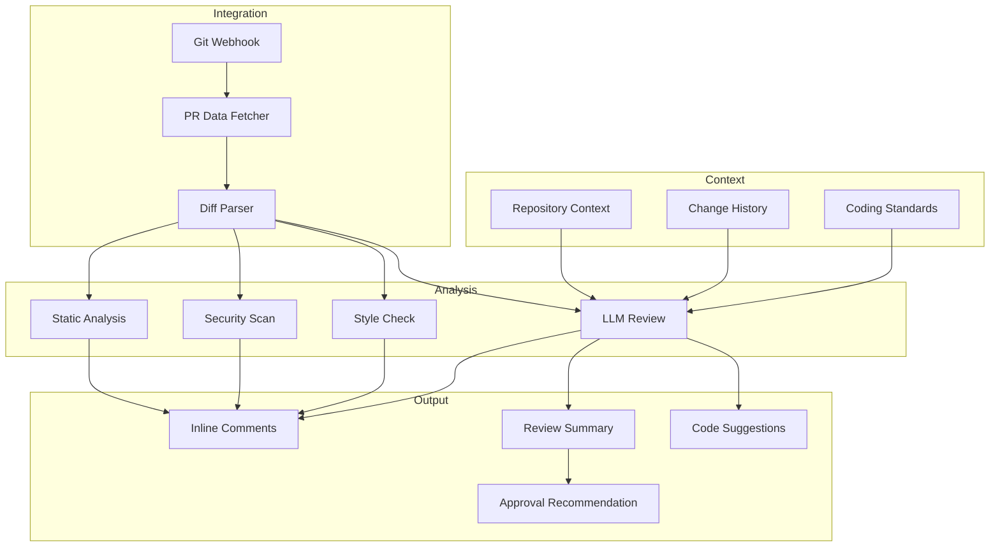

### Review Categories

| Category | Method | Auto-block |
|----------|--------|------------|
| Security vulnerabilities | SAST + LLM | Yes (critical) |
| Bug patterns | Static analysis + LLM | Yes (high severity) |
| Performance issues | Pattern matching | No (warning) |
| Style violations | Linter | No (suggestion) |
| Documentation gaps | LLM analysis | No (suggestion) |

---

## Question 9: Design an Enterprise Search System

### Problem Statement
Design an AI-powered search system across an enterprise's documents, emails, chat, and wikis.

### Key Components

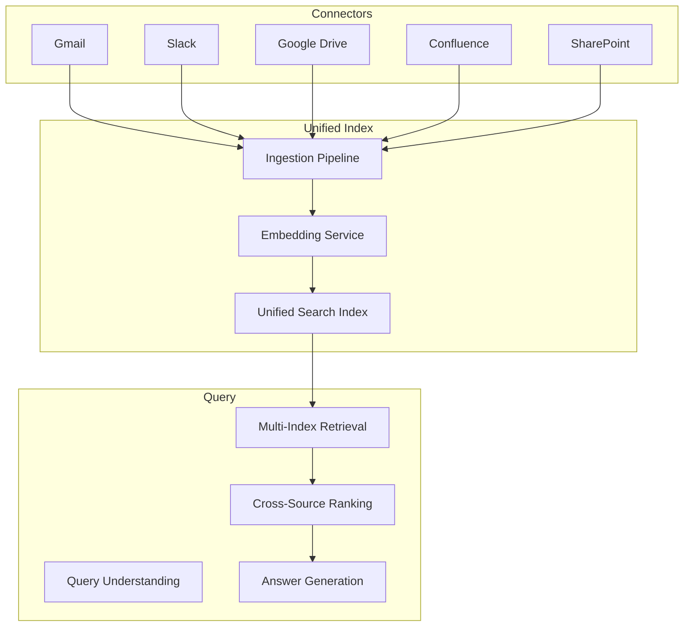

---

## Question 10: Design a Conversational Shopping Assistant

### Problem Statement
Design an AI shopping assistant that helps users find and purchase products through conversation.

### Key Features

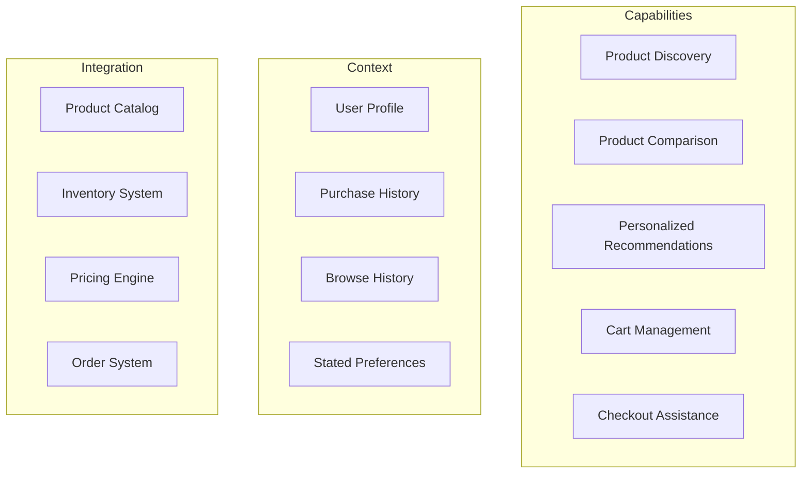

---

## Question 11: Design a Document Q&A System

### Problem Statement
Design a system where users can upload documents and ask questions about them.

### Architecture Highlights

- **Multi-format support**: PDF, DOCX, images (OCR), spreadsheets
- **Chunking strategy**: Semantic chunking with metadata preservation
- **Per-document index**: Isolated vector stores per document
- **Citation**: Page/section references in all answers
- **Session context**: Remember previous questions in session

---

## Question 12: Design an Automated Email Response System

### Problem Statement
Design a system that drafts email responses for customer service teams.

### Key Design Points

- **Intent classification**: Categorize incoming emails
- **Response generation**: Draft contextually appropriate responses
- **Personalization**: Match customer history and tone
- **Human review**: Queue for approval before sending
- **Learning loop**: Learn from human edits

---

## Question 13: Design a Personalized Learning Assistant

### Problem Statement
Design an AI tutor that adapts to individual student learning styles and pace.

### Architecture

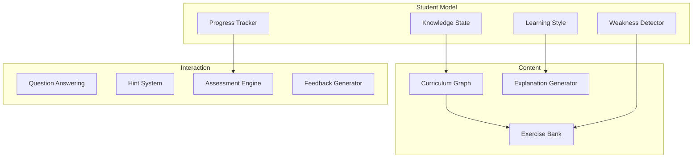

---

## Question 14: Design a Multi-Modal Content Generator

### Problem Statement
Design a system that generates blog posts with AI-generated images and videos.

### Key Components

- **Text generation**: Long-form content with structure
- **Image generation**: Contextual images via DALL-E/Midjourney
- **Video generation**: Short clips for social via Runway/Pika
- **Layout engine**: Combine elements into coherent document
- **Brand consistency**: Apply brand guidelines to all outputs

---

## Question 15: Design an AI-Powered Help Center

### Problem Statement
Design a self-service help center with AI-powered article suggestions and conversational help.

### Features

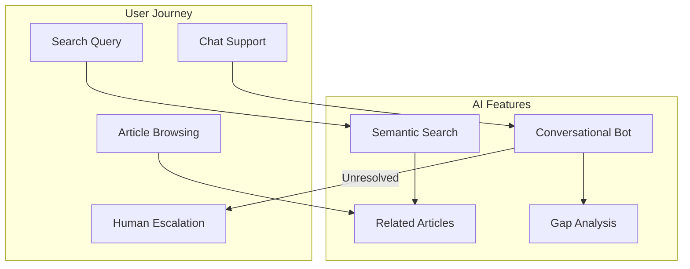

---

## General Interview Tips

### The 6-Step Framework Reminder

| Step | Time | Focus |
|------|------|-------|
| 1. Clarify | 5 min | Requirements, scale, constraints |
| 2. Architecture | 10 min | High-level system diagram |
| 3. Components | 15 min | Deep dive on key components |
| 4. Optimization | 5 min | Latency, cost, quality trade-offs |
| 5. Safety | 5 min | Security, content safety, privacy |
| 6. Operations | 5 min | Monitoring, evaluation, updates |

### Common Follow-Up Questions

::: info Be Prepared For These
- "How would you scale this 10x?"
- "What if latency requirements are halved?"
- "How do you handle model failures?"
- "What metrics would you track?"
- "How would you improve quality over time?"
- "What are the biggest risks?"
:::

### Evaluation Criteria

| Criterion | What Interviewers Look For |
|-----------|---------------------------|
| **Problem decomposition** | Breaking down ambiguous problems |
| **Architecture skills** | Clean, scalable system design |
| **GenAI understanding** | LLM-specific considerations |
| **Trade-off analysis** | Comparing alternatives objectively |
| **Production thinking** | Monitoring, safety, reliability |
| **Communication** | Clear explanation of decisions |

---

## Navigation

| Previous | Next |
|----------|------|
| [Content Pipeline](./content-pipeline) | [Index](./index) |

---

## Sources

- OpenAI. (2024). *API Documentation and Best Practices*. https://platform.openai.com/docs
- Anthropic. (2024). *Claude Documentation*. https://docs.anthropic.com
- Google. (2024). *Vertex AI Documentation*. https://cloud.google.com/vertex-ai/docs
- LangChain. (2024). *Building LLM Applications*. https://docs.langchain.com
- Pinecone. (2024). *Vector Database Best Practices*. https://docs.pinecone.io
- GitHub. (2024). *Copilot Technical Architecture*. https://github.blog
- Meta. (2024). *Content Moderation at Scale*. https://transparency.fb.com
