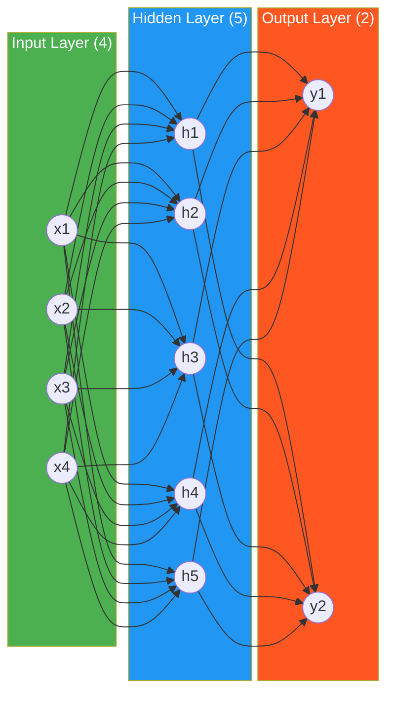
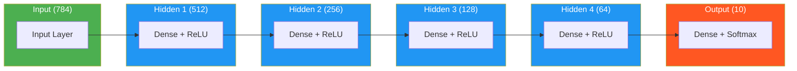
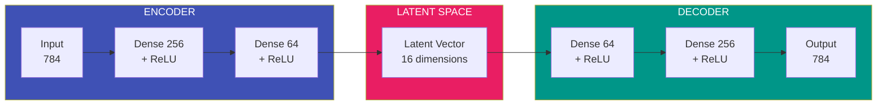
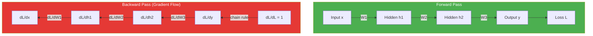
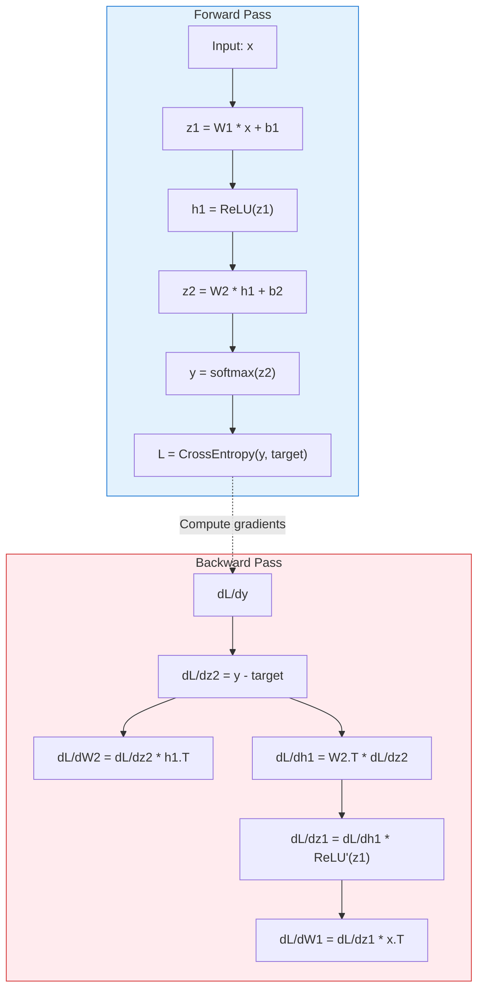

# Neural Network Architecture Diagrams (Mermaid)

These diagrams can be embedded directly in markdown files that support Mermaid.

## 1. Simple MLP Architecture

## 2. Deep MLP Architecture

## 3. CNN Architecture

```mermaid
graph LR
    subgraph Input["Input Image"]
        IMG[32x32x3]
    end

    subgraph Conv1["Conv Block 1"]
        C1[Conv2D 3x3<br/>32 filters]
        R1[ReLU]
        P1[MaxPool 2x2]
    end

    subgraph Conv2["Conv Block 2"]
        C2[Conv2D 3x3<br/>64 filters]
        R2[ReLU]
        P2[MaxPool 2x2]
    end

    subgraph Conv3["Conv Block 3"]
        C3[Conv2D 3x3<br/>128 filters]
        R3[ReLU]
    end

    subgraph FC["Fully Connected"]
        FL[Flatten]
        FC1[Dense 128<br/>+ ReLU]
        FC2[Dense 64<br/>+ ReLU]
    end

    subgraph Output["Output"]
        OUT[Dense 10<br/>+ Softmax]
    end

    IMG --> C1 --> R1 --> P1 --> C2 --> R2 --> P2 --> C3 --> R3 --> FL --> FC1 --> FC2 --> OUT

    style Input fill:#E8E8E8,color:#333
    style Conv1 fill:#9C27B0,color:#fff
    style Conv2 fill:#9C27B0,color:#fff
    style Conv3 fill:#9C27B0,color:#fff
    style FC fill:#FF9800,color:#fff
    style Output fill:#FF5722,color:#fff
```

## 4. Autoencoder Architecture

## 5. Forward and Backward Pass

## 6. Detailed Forward/Backward Pass with Equations

## Usage Notes

1. **Embedding in Markdown**: Copy the mermaid code block (including the triple backticks) directly into any markdown file that supports Mermaid rendering (GitHub, GitLab, Obsidian, etc.).

2. **Customization**: Modify the `style` lines to change colors:
   - `fill`: Background color
   - `color`: Text color
   - `stroke`: Border color

3. **Rendering**: Mermaid diagrams are rendered client-side, so they may look slightly different across platforms.

4. **Alternative**: For more control over appearance, use the generated SVG files instead.
