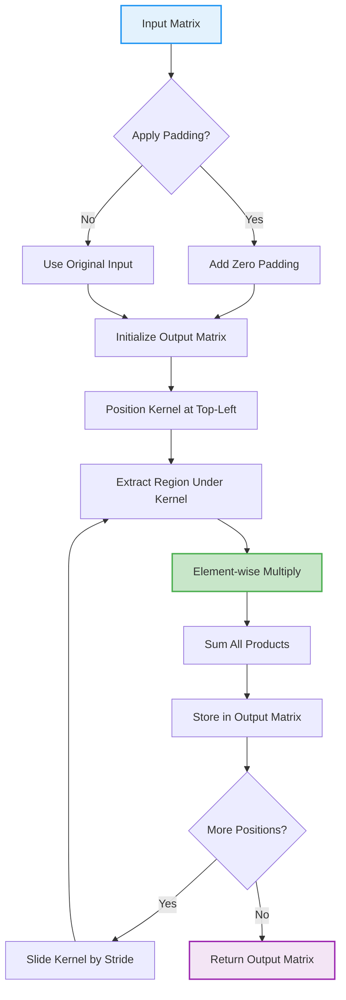
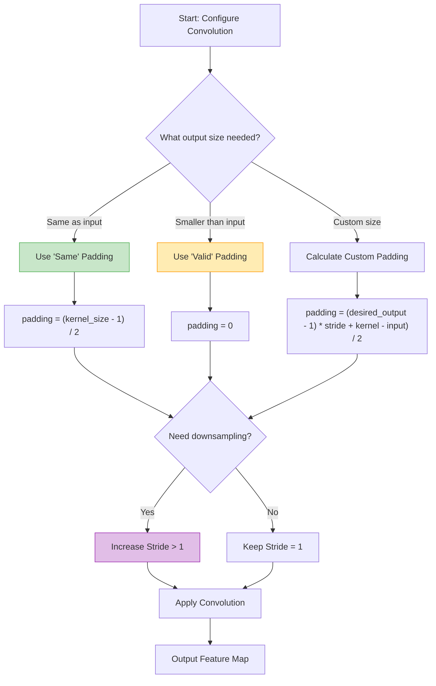
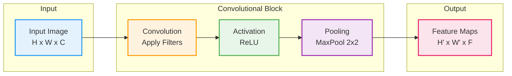
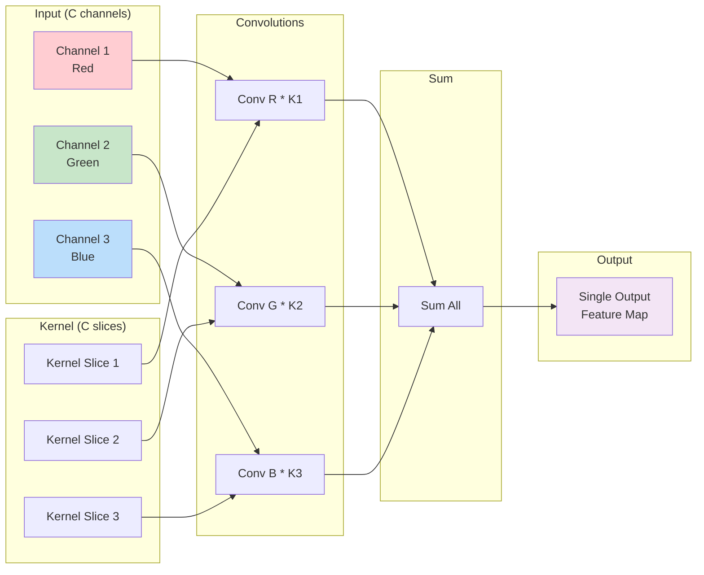

# Implement a 2D Convolutional Filter

> **From-scratch implementation** of convolution operation for CNNs

---

## Problem Statement

Implement a 2D convolution operation. Given an input image/matrix and a kernel/filter, compute the convolution output.

---

## Clarifying Questions to Ask

1. **Padding type?** (Valid/no padding, same/zero padding, or specified?)
2. **Stride?** (Default 1, or specified?)
3. **Input format?** (Single channel or multiple channels?)
4. **Return output size formula?** (Should explain the math)
5. **Handle edge cases?** (Kernel larger than image?)

---

## Visual Overview: What is Convolution?

Convolution is the core operation in Convolutional Neural Networks (CNNs). It slides a **kernel** (small matrix of learnable weights) over the input, computing element-wise multiplication and summation at each position.

### The Convolution Formula

$$
(I * K)[i,j] = \sum_{m=0}^{k_h-1} \sum_{n=0}^{k_w-1} I[i+m, j+n] \cdot K[m,n]
$$

Where:
- $I$ = Input image/matrix
- $K$ = Kernel/filter
- $(i, j)$ = Output position
- $(m, n)$ = Kernel indices
- $k_h, k_w$ = Kernel height and width


---

## Step-by-Step Convolution Flow



---

## Visual: Kernel Sliding Window

The kernel slides across the input matrix, computing the output value at each position. Here are all 9 positions for a 5x5 input with a 3x3 kernel (stride=1):


### Sliding Window State Diagram


---

## Visual: Element-wise Multiplication

At each position, we perform element-wise multiplication between the input region and kernel, then sum all products:


### Detailed Calculation Example

```
Input (5x5):              Kernel (3x3):
+--+--+--+--+--+          +---+---+---+
| 1| 2| 3| 4| 5|          |  1|  0| -1|
+--+--+--+--+--+          +---+---+---+
| 6| 7| 8| 9| 0|          |  2|  0| -2|
+--+--+--+--+--+          +---+---+---+
| 1| 2| 3| 4| 5|          |  1|  0| -1|
+--+--+--+--+--+          +---+---+---+
| 6| 7| 8| 9| 0|
+--+--+--+--+--+
| 1| 2| 3| 4| 5|
+--+--+--+--+--+

At position (0,0): (1*1 + 2*0 + 3*(-1)) + (6*2 + 7*0 + 8*(-2)) + (1*1 + 2*0 + 3*(-1))
                 = (1 + 0 - 3) + (12 + 0 - 16) + (1 + 0 - 3)
                 = -2 - 4 - 2 = -8
```

---

## Output Size Formula

$$
\text{output\_size} = \left\lfloor \frac{\text{input\_size} - \text{kernel\_size} + 2 \times \text{padding}}{\text{stride}} \right\rfloor + 1
$$

Or written separately for height and width:

$$
\begin{aligned}
H_{out} &= \left\lfloor \frac{H_{in} - k_h + 2p}{s} \right\rfloor + 1 \\[0.5em]
W_{out} &= \left\lfloor \frac{W_{in} - k_w + 2p}{s} \right\rfloor + 1
\end{aligned}
$$

**Example**: Input 5x5, Kernel 3x3, Padding 0, Stride 1
- Output = (5 - 3 + 0) / 1 + 1 = 3x3


---

## Padding and Stride Decision Flowchart



---

## Visual: Padding Comparison


### Types of Padding

| Padding Type | Description | Output Size (stride=1) |
|-------------|-------------|------------------------|
| **Valid** (no padding) | No zeros added | Smaller than input |
| **Same** | Zeros added to preserve size | Same as input |
| **Full** | Maximum padding | Larger than input |

---

## Visual: Stride Effects


### Stride Impact

| Stride | Effect | Use Case |
|--------|--------|----------|
| 1 | Dense output, overlapping regions | Feature detection |
| 2 | 2x downsampling, skip positions | Reduce spatial size |
| 3+ | Aggressive downsampling | Very large inputs |

---

## Full CNN Pipeline




---

## Common Kernels and Their Effects


---

## Solution: Basic 2D Convolution

### Step-by-Step Implementation

::: code-group

```python [Python]
from typing import List

def conv2d(input_matrix: List[List[float]], kernel: List[List[float]],
           stride: int = 1, padding: int = 0) -> List[List[float]]:
    """
    2D Convolution operation.

    Args:
        input_matrix: Input image/matrix, shape (H, W)
        kernel: Convolution kernel, shape (kH, kW)
        stride: Step size for sliding kernel
        padding: Zero-padding to add around input

    Returns:
        output: Convolution result
    """
    # Get dimensions
    input_h = len(input_matrix)
    input_w = len(input_matrix[0])
    kernel_h = len(kernel)
    kernel_w = len(kernel[0])

    # Add padding if specified
    if padding > 0:
        padded = [[0.0] * (input_w + 2 * padding) for _ in range(input_h + 2 * padding)]
        for i in range(input_h):
            for j in range(input_w):
                padded[i + padding][j + padding] = input_matrix[i][j]
        input_matrix = padded
        input_h = len(input_matrix)
        input_w = len(input_matrix[0])

    # Calculate output dimensions
    output_h = (input_h - kernel_h) // stride + 1
    output_w = (input_w - kernel_w) // stride + 1

    # Initialize output
    output = [[0.0] * output_w for _ in range(output_h)]

    # Perform convolution
    for i in range(output_h):
        for j in range(output_w):
            # Extract the region of interest
            row_start = i * stride
            col_start = j * stride

            # Element-wise multiply and sum
            total = 0.0
            for ki in range(kernel_h):
                for kj in range(kernel_w):
                    total += input_matrix[row_start + ki][col_start + kj] * kernel[ki][kj]
            output[i][j] = total

    return output
```

```python [NumPy]
import numpy as np

def conv2d(input_matrix, kernel, stride=1, padding=0):
    """
    2D Convolution operation.

    Args:
        input_matrix: Input image/matrix, shape (H, W)
        kernel: Convolution kernel, shape (kH, kW)
        stride: Step size for sliding kernel
        padding: Zero-padding to add around input

    Returns:
        output: Convolution result
    """
    # Get dimensions
    input_h, input_w = input_matrix.shape
    kernel_h, kernel_w = kernel.shape

    # Add padding if specified
    if padding > 0:
        input_matrix = np.pad(
            input_matrix,
            pad_width=padding,
            mode='constant',
            constant_values=0
        )
        input_h, input_w = input_matrix.shape

    # Calculate output dimensions
    output_h = (input_h - kernel_h) // stride + 1
    output_w = (input_w - kernel_w) // stride + 1

    # Initialize output
    output = np.zeros((output_h, output_w))

    # Perform convolution
    for i in range(output_h):
        for j in range(output_w):
            # Extract the region of interest
            row_start = i * stride
            row_end = row_start + kernel_h
            col_start = j * stride
            col_end = col_start + kernel_w

            region = input_matrix[row_start:row_end, col_start:col_end]

            # Element-wise multiply and sum
            output[i, j] = np.sum(region * kernel)

    return output
```

```python [PyTorch]
import torch

def conv2d(input_matrix: torch.Tensor, kernel: torch.Tensor,
           stride: int = 1, padding: int = 0) -> torch.Tensor:
    """
    2D Convolution operation.

    Args:
        input_matrix: Input image/matrix, shape (H, W)
        kernel: Convolution kernel, shape (kH, kW)
        stride: Step size for sliding kernel
        padding: Zero-padding to add around input

    Returns:
        output: Convolution result
    """
    # Get dimensions
    input_h, input_w = input_matrix.shape
    kernel_h, kernel_w = kernel.shape

    # Add padding if specified
    if padding > 0:
        input_matrix = torch.nn.functional.pad(
            input_matrix.unsqueeze(0).unsqueeze(0),
            (padding, padding, padding, padding),
            mode='constant',
            value=0
        ).squeeze(0).squeeze(0)
        input_h, input_w = input_matrix.shape

    # Calculate output dimensions
    output_h = (input_h - kernel_h) // stride + 1
    output_w = (input_w - kernel_w) // stride + 1

    # Initialize output
    output = torch.zeros((output_h, output_w), dtype=input_matrix.dtype)

    # Perform convolution
    for i in range(output_h):
        for j in range(output_w):
            # Extract the region of interest
            row_start = i * stride
            row_end = row_start + kernel_h
            col_start = j * stride
            col_end = col_start + kernel_w

            region = input_matrix[row_start:row_end, col_start:col_end]

            # Element-wise multiply and sum
            output[i, j] = torch.sum(region * kernel)

    return output
```

:::

---

## Walkthrough Example

```python
# Simple example
input_matrix = np.array([
    [1, 2, 3, 4],
    [5, 6, 7, 8],
    [9, 10, 11, 12],
    [13, 14, 15, 16]
])

# Edge detection kernel (Sobel-like)
kernel = np.array([
    [-1, 0, 1],
    [-2, 0, 2],
    [-1, 0, 1]
])

output = conv2d(input_matrix, kernel, stride=1, padding=0)
print("Output shape:", output.shape)  # (2, 2)
print(output)

# Trace for position (0, 0):
# Region:
#   [[1, 2, 3],
#    [5, 6, 7],
#    [9, 10, 11]]
# Kernel:
#   [[-1, 0, 1],
#    [-2, 0, 2],
#    [-1, 0, 1]]
# Computation:
#   1*(-1) + 2*0 + 3*1 = 2
#   5*(-2) + 6*0 + 7*2 = 4
#   9*(-1) + 10*0 + 11*1 = 2
#   Sum = 2 + 4 + 2 = 8
```

---

## With Padding (Same Convolution)

::: code-group

```python [Python]
from typing import List

def conv2d_same(input_matrix: List[List[float]], kernel: List[List[float]],
                stride: int = 1) -> List[List[float]]:
    """
    Convolution with 'same' padding (output size = input size when stride=1).
    """
    kernel_h = len(kernel)
    kernel_w = len(kernel[0])

    # Calculate padding needed for 'same' output
    pad_h = (kernel_h - 1) // 2
    pad_w = (kernel_w - 1) // 2

    return conv2d(input_matrix, kernel, stride=stride, padding=max(pad_h, pad_w))
```

```python [NumPy]
import numpy as np

def conv2d_same(input_matrix, kernel, stride=1):
    """
    Convolution with 'same' padding (output size = input size when stride=1).
    """
    kernel_h, kernel_w = kernel.shape

    # Calculate padding needed for 'same' output
    pad_h = (kernel_h - 1) // 2
    pad_w = (kernel_w - 1) // 2

    return conv2d(input_matrix, kernel, stride=stride, padding=max(pad_h, pad_w))


# Example
input_matrix = np.array([
    [1, 2, 3, 4, 5],
    [6, 7, 8, 9, 0],
    [1, 2, 3, 4, 5],
    [6, 7, 8, 9, 0],
    [1, 2, 3, 4, 5]
])

kernel = np.array([
    [1, 0, -1],
    [2, 0, -2],
    [1, 0, -1]
])

output = conv2d_same(input_matrix, kernel)
print("Input shape:", input_matrix.shape)   # (5, 5)
print("Output shape:", output.shape)         # (5, 5) - same!
```

```python [PyTorch]
import torch

def conv2d_same(input_matrix: torch.Tensor, kernel: torch.Tensor,
                stride: int = 1) -> torch.Tensor:
    """
    Convolution with 'same' padding (output size = input size when stride=1).
    """
    kernel_h, kernel_w = kernel.shape

    # Calculate padding needed for 'same' output
    pad_h = (kernel_h - 1) // 2
    pad_w = (kernel_w - 1) // 2

    return conv2d(input_matrix, kernel, stride=stride, padding=max(pad_h, pad_w))
```

:::

---

## Multi-Channel Convolution

For RGB images or multi-channel inputs:



::: code-group

```python [Python]
from typing import List

def conv2d_multichannel(input_tensor: List[List[List[float]]],
                        kernel: List[List[List[float]]],
                        stride: int = 1, padding: int = 0) -> List[List[float]]:
    """
    Multi-channel 2D convolution.

    Args:
        input_tensor: Input with channels, shape (C, H, W)
        kernel: Convolution kernel, shape (C, kH, kW) - same channels as input
        stride: Step size
        padding: Zero-padding

    Returns:
        output: Single-channel output, shape (oH, oW)
    """
    num_channels = len(input_tensor)
    assert len(kernel) == num_channels, "Kernel channels must match input"

    # Convolve each channel and sum
    output = None
    for c in range(num_channels):
        channel_output = conv2d(input_tensor[c], kernel[c], stride, padding)
        if output is None:
            output = channel_output
        else:
            for i in range(len(output)):
                for j in range(len(output[0])):
                    output[i][j] += channel_output[i][j]

    return output


def conv2d_multifilter(input_tensor: List[List[List[float]]],
                       kernels: List[List[List[List[float]]]],
                       stride: int = 1, padding: int = 0) -> List[List[List[float]]]:
    """
    Multi-channel input, multiple output filters.

    Args:
        input_tensor: Input, shape (C_in, H, W)
        kernels: Multiple kernels, shape (num_filters, C_in, kH, kW)
        stride: Step size
        padding: Zero-padding

    Returns:
        output: Multi-channel output, shape (num_filters, oH, oW)
    """
    num_filters = len(kernels)
    outputs = []

    for f in range(num_filters):
        output = conv2d_multichannel(input_tensor, kernels[f], stride, padding)
        outputs.append(output)

    return outputs
```

```python [NumPy]
import numpy as np

def conv2d_multichannel(input_tensor, kernel, stride=1, padding=0):
    """
    Multi-channel 2D convolution.

    Args:
        input_tensor: Input with channels, shape (C, H, W)
        kernel: Convolution kernel, shape (C, kH, kW) - same channels as input
        stride: Step size
        padding: Zero-padding

    Returns:
        output: Single-channel output, shape (oH, oW)
    """
    num_channels = input_tensor.shape[0]
    assert kernel.shape[0] == num_channels, "Kernel channels must match input"

    # Convolve each channel and sum
    output = None
    for c in range(num_channels):
        channel_output = conv2d(input_tensor[c], kernel[c], stride, padding)
        if output is None:
            output = channel_output
        else:
            output += channel_output

    return output


def conv2d_multifilter(input_tensor, kernels, stride=1, padding=0):
    """
    Multi-channel input, multiple output filters.

    Args:
        input_tensor: Input, shape (C_in, H, W)
        kernels: Multiple kernels, shape (num_filters, C_in, kH, kW)
        stride: Step size
        padding: Zero-padding

    Returns:
        output: Multi-channel output, shape (num_filters, oH, oW)
    """
    num_filters = kernels.shape[0]
    outputs = []

    for f in range(num_filters):
        output = conv2d_multichannel(input_tensor, kernels[f], stride, padding)
        outputs.append(output)

    return np.array(outputs)
```

```python [PyTorch]
import torch

def conv2d_multichannel(input_tensor: torch.Tensor, kernel: torch.Tensor,
                        stride: int = 1, padding: int = 0) -> torch.Tensor:
    """
    Multi-channel 2D convolution.

    Args:
        input_tensor: Input with channels, shape (C, H, W)
        kernel: Convolution kernel, shape (C, kH, kW) - same channels as input
        stride: Step size
        padding: Zero-padding

    Returns:
        output: Single-channel output, shape (oH, oW)
    """
    num_channels = input_tensor.shape[0]
    assert kernel.shape[0] == num_channels, "Kernel channels must match input"

    # Convolve each channel and sum
    output = None
    for c in range(num_channels):
        channel_output = conv2d(input_tensor[c], kernel[c], stride, padding)
        if output is None:
            output = channel_output
        else:
            output = output + channel_output

    return output


def conv2d_multifilter(input_tensor: torch.Tensor, kernels: torch.Tensor,
                       stride: int = 1, padding: int = 0) -> torch.Tensor:
    """
    Multi-channel input, multiple output filters.

    Args:
        input_tensor: Input, shape (C_in, H, W)
        kernels: Multiple kernels, shape (num_filters, C_in, kH, kW)
        stride: Step size
        padding: Zero-padding

    Returns:
        output: Multi-channel output, shape (num_filters, oH, oW)
    """
    num_filters = kernels.shape[0]
    outputs = []

    for f in range(num_filters):
        output = conv2d_multichannel(input_tensor, kernels[f], stride, padding)
        outputs.append(output)

    return torch.stack(outputs)
```

:::

### Example: RGB Image with Multiple Filters

```python
# RGB image: 3 channels, 5x5
rgb_image = np.random.rand(3, 5, 5)

# 4 filters, each 3 channels (to match input), 3x3
filters = np.random.rand(4, 3, 3, 3)

# Output: 4 channels (one per filter)
output = conv2d_multifilter(rgb_image, filters, padding=1)
print("Output shape:", output.shape)  # (4, 5, 5)
```

---

## Common Kernels

### Edge Detection

```python
# Sobel X (horizontal edges)
sobel_x = np.array([
    [-1, 0, 1],
    [-2, 0, 2],
    [-1, 0, 1]
])

# Sobel Y (vertical edges)
sobel_y = np.array([
    [-1, -2, -1],
    [0, 0, 0],
    [1, 2, 1]
])

# Laplacian (all edges)
laplacian = np.array([
    [0, 1, 0],
    [1, -4, 1],
    [0, 1, 0]
])
```

### Blurring

```python
# Box blur (average)
box_blur = np.ones((3, 3)) / 9

# Gaussian blur (weighted)
gaussian_blur = np.array([
    [1, 2, 1],
    [2, 4, 2],
    [1, 2, 1]
]) / 16
```

### Sharpening

```python
sharpen = np.array([
    [0, -1, 0],
    [-1, 5, -1],
    [0, -1, 0]
])
```

---

## Vectorized Implementation (Faster)

::: code-group

```python [Python]
from typing import List

def conv2d_vectorized(input_matrix: List[List[float]], kernel: List[List[float]],
                      stride: int = 1, padding: int = 0) -> List[List[float]]:
    """
    Convolution using im2col transformation (conceptually).

    Converts convolution to matrix multiplication for efficiency.
    """
    input_h = len(input_matrix)
    input_w = len(input_matrix[0])
    kernel_h = len(kernel)
    kernel_w = len(kernel[0])

    # Add padding
    if padding > 0:
        padded = [[0.0] * (input_w + 2 * padding) for _ in range(input_h + 2 * padding)]
        for i in range(input_h):
            for j in range(input_w):
                padded[i + padding][j + padding] = input_matrix[i][j]
        input_matrix = padded
        input_h = len(input_matrix)
        input_w = len(input_matrix[0])

    output_h = (input_h - kernel_h) // stride + 1
    output_w = (input_w - kernel_w) // stride + 1

    # Extract patches
    patches = []
    for i in range(output_h):
        for j in range(output_w):
            row_start = i * stride
            col_start = j * stride
            patch = []
            for ki in range(kernel_h):
                for kj in range(kernel_w):
                    patch.append(input_matrix[row_start + ki][col_start + kj])
            patches.append(patch)

    # Flatten kernel
    kernel_flat = [kernel[i][j] for i in range(kernel_h) for j in range(kernel_w)]

    # Convolution as dot products
    output_flat = []
    for patch in patches:
        output_flat.append(sum(p * k for p, k in zip(patch, kernel_flat)))

    # Reshape to output
    output = []
    for i in range(output_h):
        row = []
        for j in range(output_w):
            row.append(output_flat[i * output_w + j])
        output.append(row)

    return output
```

```python [NumPy]
import numpy as np

def conv2d_vectorized(input_matrix, kernel, stride=1, padding=0):
    """
    Vectorized convolution using im2col transformation.

    Converts convolution to matrix multiplication for efficiency.
    """
    # Add padding
    if padding > 0:
        input_matrix = np.pad(input_matrix, padding, mode='constant')

    input_h, input_w = input_matrix.shape
    kernel_h, kernel_w = kernel.shape

    output_h = (input_h - kernel_h) // stride + 1
    output_w = (input_w - kernel_w) // stride + 1

    # Extract patches using stride tricks (advanced!)
    # Each column of patches contains one flattened patch
    patches = np.zeros((kernel_h * kernel_w, output_h * output_w))

    idx = 0
    for i in range(output_h):
        for j in range(output_w):
            row_start = i * stride
            col_start = j * stride
            patch = input_matrix[row_start:row_start+kernel_h,
                                col_start:col_start+kernel_w]
            patches[:, idx] = patch.flatten()
            idx += 1

    # Convolution as matrix multiplication
    kernel_flat = kernel.flatten().reshape(1, -1)
    output_flat = np.dot(kernel_flat, patches)

    return output_flat.reshape(output_h, output_w)
```

```python [PyTorch]
import torch

def conv2d_vectorized(input_matrix: torch.Tensor, kernel: torch.Tensor,
                      stride: int = 1, padding: int = 0) -> torch.Tensor:
    """
    Vectorized convolution using PyTorch's unfold.

    Converts convolution to matrix multiplication for efficiency.
    """
    # Add padding
    if padding > 0:
        input_matrix = torch.nn.functional.pad(
            input_matrix.unsqueeze(0).unsqueeze(0),
            (padding, padding, padding, padding),
            mode='constant',
            value=0
        ).squeeze(0).squeeze(0)

    input_h, input_w = input_matrix.shape
    kernel_h, kernel_w = kernel.shape

    output_h = (input_h - kernel_h) // stride + 1
    output_w = (input_w - kernel_w) // stride + 1

    # Use unfold to extract patches
    # Unfold along height then width
    patches = input_matrix.unfold(0, kernel_h, stride).unfold(1, kernel_w, stride)
    # patches shape: (output_h, output_w, kernel_h, kernel_w)

    # Reshape for matrix multiplication
    patches = patches.contiguous().view(output_h * output_w, -1)
    kernel_flat = kernel.flatten()

    # Convolution as matrix-vector multiplication
    output_flat = torch.mv(patches, kernel_flat)

    return output_flat.reshape(output_h, output_w)
```

:::

---

## With Bias and Activation (Full Conv Layer)

::: code-group

```python [Python]
from typing import List
import math

def conv_layer(input_tensor: List[List[List[float]]],
               weights: List[List[List[List[float]]]],
               bias: List[float], stride: int = 1, padding: int = 0,
               activation: str = 'relu') -> List[List[List[float]]]:
    """
    Complete convolutional layer with bias and activation.

    Args:
        input_tensor: Input, shape (C_in, H, W)
        weights: Kernels, shape (C_out, C_in, kH, kW)
        bias: Bias terms, shape (C_out,)
        activation: 'relu', 'sigmoid', or 'none'

    Returns:
        output: Activated output, shape (C_out, oH, oW)
    """
    # Convolution
    output = conv2d_multifilter(input_tensor, weights, stride, padding)

    # Add bias (broadcast across spatial dimensions)
    for c in range(len(bias)):
        for i in range(len(output[c])):
            for j in range(len(output[c][0])):
                output[c][i][j] += bias[c]

    # Activation
    if activation == 'relu':
        for c in range(len(output)):
            for i in range(len(output[c])):
                for j in range(len(output[c][0])):
                    output[c][i][j] = max(0, output[c][i][j])
    elif activation == 'sigmoid':
        for c in range(len(output)):
            for i in range(len(output[c])):
                for j in range(len(output[c][0])):
                    output[c][i][j] = 1 / (1 + math.exp(-output[c][i][j]))

    return output
```

```python [NumPy]
import numpy as np

def conv_layer(input_tensor, weights, bias, stride=1, padding=0, activation='relu'):
    """
    Complete convolutional layer with bias and activation.

    Args:
        input_tensor: Input, shape (C_in, H, W)
        weights: Kernels, shape (C_out, C_in, kH, kW)
        bias: Bias terms, shape (C_out,)
        activation: 'relu', 'sigmoid', or 'none'

    Returns:
        output: Activated output, shape (C_out, oH, oW)
    """
    # Convolution
    output = conv2d_multifilter(input_tensor, weights, stride, padding)

    # Add bias (broadcast across spatial dimensions)
    for c in range(len(bias)):
        output[c] += bias[c]

    # Activation
    if activation == 'relu':
        output = np.maximum(0, output)
    elif activation == 'sigmoid':
        output = 1 / (1 + np.exp(-output))

    return output
```

```python [PyTorch]
import torch

def conv_layer(input_tensor: torch.Tensor, weights: torch.Tensor,
               bias: torch.Tensor, stride: int = 1, padding: int = 0,
               activation: str = 'relu') -> torch.Tensor:
    """
    Complete convolutional layer with bias and activation.

    Args:
        input_tensor: Input, shape (C_in, H, W)
        weights: Kernels, shape (C_out, C_in, kH, kW)
        bias: Bias terms, shape (C_out,)
        activation: 'relu', 'sigmoid', or 'none'

    Returns:
        output: Activated output, shape (C_out, oH, oW)
    """
    # Convolution
    output = conv2d_multifilter(input_tensor, weights, stride, padding)

    # Add bias (broadcast across spatial dimensions)
    output = output + bias.view(-1, 1, 1)

    # Activation
    if activation == 'relu':
        output = torch.relu(output)
    elif activation == 'sigmoid':
        output = torch.sigmoid(output)

    return output
```

:::

---

## Complexity Analysis

| Operation | Time Complexity | Space Complexity |
|-----------|-----------------|------------------|
| Basic conv2d | $O(H_{out} \cdot W_{out} \cdot k_h \cdot k_w)$ | $O(H_{out} \cdot W_{out})$ |
| Multi-channel | $O(C \cdot H_{out} \cdot W_{out} \cdot k_h \cdot k_w)$ | $O(H_{out} \cdot W_{out})$ |
| Multi-filter | $O(F \cdot C \cdot H_{out} \cdot W_{out} \cdot k_h \cdot k_w)$ | $O(F \cdot H_{out} \cdot W_{out})$ |

Where:
- $H_{out}, W_{out}$ = output height, width
- $k_h, k_w$ = kernel height, width
- $C$ = number of input channels
- $F$ = number of filters

---

## Edge Cases

::: code-group

```python [Python]
from typing import List

def conv2d_robust(input_matrix: List[List[float]], kernel: List[List[float]],
                  stride: int = 1, padding: int = 0) -> List[List[float]]:
    """Convolution with edge case handling."""

    # Check 1: Input and kernel dimensions
    if not input_matrix or not input_matrix[0]:
        raise ValueError("Input must be non-empty 2D")
    if not kernel or not kernel[0]:
        raise ValueError("Kernel must be non-empty 2D")

    input_h = len(input_matrix)
    input_w = len(input_matrix[0])
    kernel_h = len(kernel)
    kernel_w = len(kernel[0])

    # Check 2: Kernel larger than input
    if kernel_h > input_h or kernel_w > input_w:
        raise ValueError("Kernel cannot be larger than input")

    # Check 3: Valid output size
    output_h = (input_h + 2*padding - kernel_h) // stride + 1
    output_w = (input_w + 2*padding - kernel_w) // stride + 1

    if output_h <= 0 or output_w <= 0:
        raise ValueError("Invalid combination of parameters produces zero output")

    return conv2d(input_matrix, kernel, stride, padding)
```

```python [NumPy]
import numpy as np

def conv2d_robust(input_matrix, kernel, stride=1, padding=0):
    """Convolution with edge case handling."""

    # Check 1: Input and kernel dimensions
    if input_matrix.ndim != 2 or kernel.ndim != 2:
        raise ValueError("Input and kernel must be 2D")

    # Check 2: Kernel larger than input
    input_h, input_w = input_matrix.shape
    kernel_h, kernel_w = kernel.shape

    if kernel_h > input_h or kernel_w > input_w:
        raise ValueError("Kernel cannot be larger than input")

    # Check 3: Valid output size
    output_h = (input_h + 2*padding - kernel_h) // stride + 1
    output_w = (input_w + 2*padding - kernel_w) // stride + 1

    if output_h <= 0 or output_w <= 0:
        raise ValueError("Invalid combination of parameters produces zero output")

    return conv2d(input_matrix, kernel, stride, padding)
```

```python [PyTorch]
import torch

def conv2d_robust(input_matrix: torch.Tensor, kernel: torch.Tensor,
                  stride: int = 1, padding: int = 0) -> torch.Tensor:
    """Convolution with edge case handling."""

    # Check 1: Input and kernel dimensions
    if input_matrix.ndim != 2 or kernel.ndim != 2:
        raise ValueError("Input and kernel must be 2D")

    # Check 2: Kernel larger than input
    input_h, input_w = input_matrix.shape
    kernel_h, kernel_w = kernel.shape

    if kernel_h > input_h or kernel_w > input_w:
        raise ValueError("Kernel cannot be larger than input")

    # Check 3: Valid output size
    output_h = (input_h + 2*padding - kernel_h) // stride + 1
    output_w = (input_w + 2*padding - kernel_w) // stride + 1

    if output_h <= 0 or output_w <= 0:
        raise ValueError("Invalid combination of parameters produces zero output")

    return conv2d(input_matrix, kernel, stride, padding)
```

:::

---

## Test Suite

```python
def test_conv2d():
    """Test cases for convolution implementation."""

    # Test 1: Identity kernel (should preserve input)
    input_mat = np.array([[1, 2], [3, 4]])
    identity = np.array([[0, 0, 0], [0, 1, 0], [0, 0, 0]])
    output = conv2d(input_mat, identity, padding=1)
    np.testing.assert_array_equal(output, input_mat)
    print("Test 1 passed: Identity kernel")

    # Test 2: Output size calculation
    input_mat = np.ones((10, 10))
    kernel = np.ones((3, 3))
    output = conv2d(input_mat, kernel, stride=1, padding=0)
    assert output.shape == (8, 8), f"Expected (8,8), got {output.shape}"
    print("Test 2 passed: Output size (no padding)")

    # Test 3: Same padding
    output = conv2d(input_mat, kernel, stride=1, padding=1)
    assert output.shape == (10, 10), f"Expected (10,10), got {output.shape}"
    print("Test 3 passed: Same padding")

    # Test 4: Stride
    output = conv2d(input_mat, kernel, stride=2, padding=0)
    assert output.shape == (4, 4), f"Expected (4,4), got {output.shape}"
    print("Test 4 passed: Stride=2")

    print("\nAll tests passed!")

test_conv2d()
```

---

## Interview Tips

1. **Know the output size formula** - be ready to derive it:
   $$\text{output} = \left\lfloor \frac{\text{input} - \text{kernel} + 2 \times \text{padding}}{\text{stride}} \right\rfloor + 1$$

2. **Explain valid vs same padding** - understand when each is used:
   - Valid: No padding, output shrinks
   - Same: Pad to maintain spatial dimensions

3. **Mention stride's purpose** - downsampling, reducing computation

4. **Discuss optimization** - im2col, GEMM-based convolution

5. **Know common kernels** - edge detection, blur, sharpen

6. **Connect to CNNs** - how convolution enables feature learning through:
   - Translation invariance
   - Parameter sharing
   - Hierarchical feature extraction
