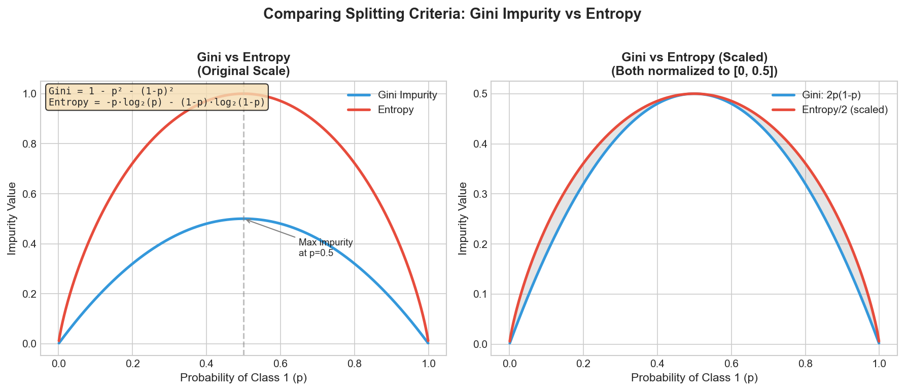
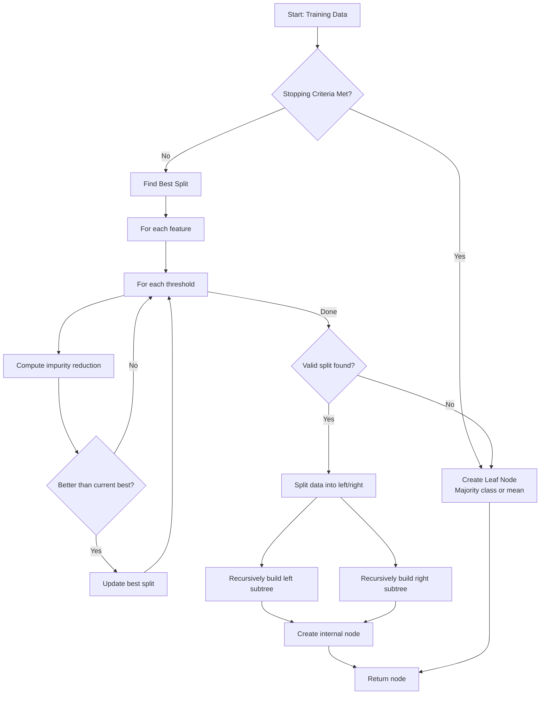
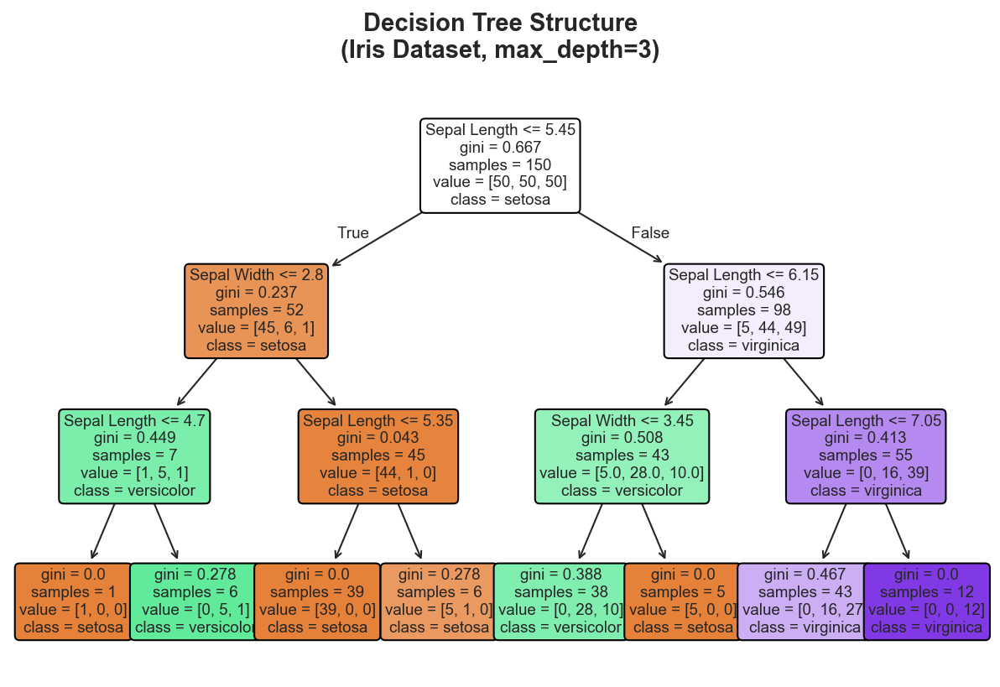
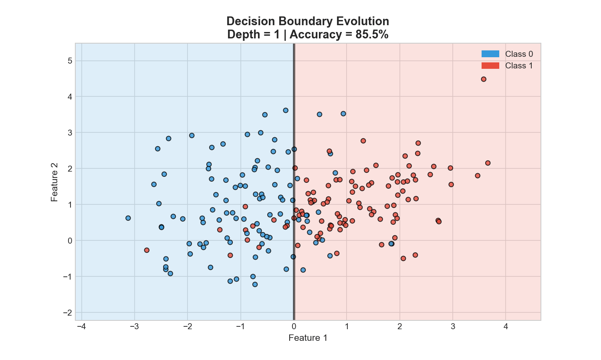
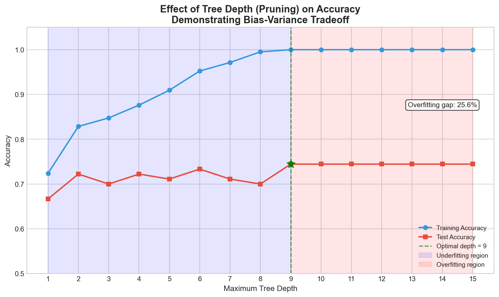
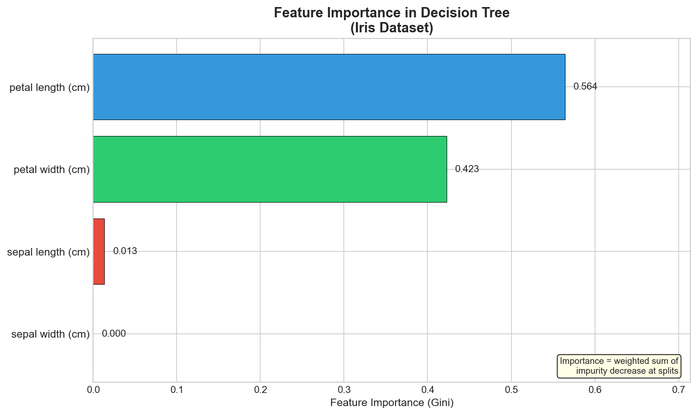

# Decision Tree Implementation (CART)

> **Build classification and regression trees from scratch** with Gini impurity, information gain, and pruning strategies

---

## Problem Statement

Implement a Decision Tree algorithm (CART - Classification and Regression Trees) for both classification and regression tasks. Given training data `X_train` with labels `y_train`, build a tree structure that recursively partitions the feature space to make predictions.

**Interview Context**: Decision Trees are fundamental to understanding ensemble methods (Random Forests, Gradient Boosting). Interviewers expect you to implement the core splitting logic, understand impurity metrics, and discuss overfitting prevention.

---

## When This Is Asked

| Company | Role | Frequency |
|---------|------|-----------|
| Google | ML Engineer, Research Scientist | High |
| Meta | ML Engineer, Applied Scientist | High |
| Amazon | Applied Scientist, SDE-ML | High |
| Apple | ML Engineer | Medium |
| Microsoft | Data Scientist, ML Engineer | Medium |
| Netflix | ML Engineer | Medium |

**Common Interview Formats**:
- "Implement a decision tree classifier from scratch" (45-60 min)
- "How would you split a node? Walk me through the math" (20-30 min)
- "Extend your implementation to handle regression" (15-20 min follow-up)

---

## Clarifying Questions to Ask

1. **Classification or regression?** (Start with classification, extend to regression)
2. **Binary or multi-class?** (Binary first, multi-class is straightforward extension)
3. **Splitting criterion?** (Gini impurity vs information gain/entropy)
4. **Stopping conditions?** (Max depth, min samples per leaf, min impurity decrease)
5. **Feature types?** (Continuous vs categorical - continuous first)
6. **Libraries allowed?** (NumPy yes, sklearn no for implementation questions)

---

## Mathematical Foundation

### Gini Impurity vs Entropy



Both metrics measure node impurity. The chart above shows their behavior:

$$Gini(S) = 1 - \sum_{i=1}^{C} p_i^2 \qquad Entropy(S) = -\sum_{i=1}^{C} p_i \log_2(p_i)$$

| Metric | Range (Binary) | Computation | Use Case |
|--------|---------------|-------------|----------|
| Gini | [0, 0.5] | Faster (no log) | sklearn default |
| Entropy | [0, 1] | Slower | C4.5 default |

**In practice**: Results are usually very similar. Gini is computationally cheaper.

### Weighted Impurity for Splits

When evaluating a split:

$$Impurity_{split} = \frac{n_{left}}{n_{total}} \cdot Impurity_{left} + \frac{n_{right}}{n_{total}} \cdot Impurity_{right}$$

The best split minimizes this weighted impurity (or maximizes information gain).

### Regression: Mean Squared Error

For regression trees: $MSE(S) = \frac{1}{|S|} \sum_{i \in S} (y_i - \bar{y})^2$

---

## Algorithm Flowchart



---

## Implementation

### Python (From Scratch - Classification)

::: code-group

```python [Python]
from typing import List, Optional, Tuple, Union
from collections import Counter
import math

class TreeNode:
    """
    Node in a decision tree.

    For internal nodes: stores split feature and threshold.
    For leaf nodes: stores predicted class/value.
    """
    def __init__(self):
        self.feature_index: Optional[int] = None  # Feature to split on
        self.threshold: Optional[float] = None     # Split threshold
        self.left: Optional['TreeNode'] = None     # Left child (<=threshold)
        self.right: Optional['TreeNode'] = None    # Right child (>threshold)
        self.value: Optional[int] = None           # Leaf prediction
        self.is_leaf: bool = False
        self.n_samples: int = 0                    # Samples at this node
        self.impurity: float = 0.0                 # Node impurity


class DecisionTreeClassifier:
    """
    Decision Tree Classifier using CART algorithm.

    Args:
        max_depth: Maximum depth of tree (None for unlimited)
        min_samples_split: Minimum samples required to split a node
        min_samples_leaf: Minimum samples required in a leaf node
        criterion: 'gini' or 'entropy'
    """
    def __init__(self, max_depth: Optional[int] = None,
                 min_samples_split: int = 2,
                 min_samples_leaf: int = 1,
                 criterion: str = 'gini'):
        self.max_depth = max_depth
        self.min_samples_split = min_samples_split
        self.min_samples_leaf = min_samples_leaf
        self.criterion = criterion
        self.root: Optional[TreeNode] = None
        self.n_classes: int = 0
        self.n_features: int = 0

    def _gini_impurity(self, y: List[int]) -> float:
        """
        Compute Gini impurity for a set of labels.

        Gini = 1 - sum(p_i^2) for all classes i
        """
        if len(y) == 0:
            return 0.0

        counts = Counter(y)
        n = len(y)
        impurity = 1.0

        for count in counts.values():
            p = count / n
            impurity -= p ** 2

        return impurity

    def _entropy(self, y: List[int]) -> float:
        """
        Compute entropy for a set of labels.

        Entropy = -sum(p_i * log2(p_i)) for all classes i
        """
        if len(y) == 0:
            return 0.0

        counts = Counter(y)
        n = len(y)
        entropy = 0.0

        for count in counts.values():
            if count > 0:
                p = count / n
                entropy -= p * math.log2(p)

        return entropy

    def _impurity(self, y: List[int]) -> float:
        """Compute impurity based on criterion."""
        if self.criterion == 'gini':
            return self._gini_impurity(y)
        else:
            return self._entropy(y)

    def _information_gain(self, y: List[int], y_left: List[int],
                          y_right: List[int]) -> float:
        """
        Compute information gain from a split.

        IG = impurity(parent) - weighted_avg(impurity(children))
        """
        n = len(y)
        n_left = len(y_left)
        n_right = len(y_right)

        if n_left == 0 or n_right == 0:
            return 0.0

        parent_impurity = self._impurity(y)
        left_impurity = self._impurity(y_left)
        right_impurity = self._impurity(y_right)

        weighted_child_impurity = (
            (n_left / n) * left_impurity +
            (n_right / n) * right_impurity
        )

        return parent_impurity - weighted_child_impurity

    def _best_split(self, X: List[List[float]], y: List[int]
                   ) -> Tuple[Optional[int], Optional[float], float]:
        """
        Find the best split for a node.

        Returns:
            (best_feature, best_threshold, best_gain)
        """
        best_gain = 0.0
        best_feature = None
        best_threshold = None

        n_samples = len(X)
        n_features = len(X[0]) if X else 0

        for feature_idx in range(n_features):
            # Get all unique values for this feature
            feature_values = sorted(set(x[feature_idx] for x in X))

            # Try thresholds between consecutive values
            for i in range(len(feature_values) - 1):
                threshold = (feature_values[i] + feature_values[i + 1]) / 2

                # Split data
                y_left = [y[j] for j in range(n_samples)
                         if X[j][feature_idx] <= threshold]
                y_right = [y[j] for j in range(n_samples)
                          if X[j][feature_idx] > threshold]

                # Check minimum samples constraint
                if (len(y_left) < self.min_samples_leaf or
                    len(y_right) < self.min_samples_leaf):
                    continue

                # Compute information gain
                gain = self._information_gain(y, y_left, y_right)

                if gain > best_gain:
                    best_gain = gain
                    best_feature = feature_idx
                    best_threshold = threshold

        return best_feature, best_threshold, best_gain

    def _build_tree(self, X: List[List[float]], y: List[int],
                    depth: int) -> TreeNode:
        """
        Recursively build the decision tree.
        """
        node = TreeNode()
        node.n_samples = len(y)
        node.impurity = self._impurity(y)

        # Check stopping conditions
        n_samples = len(y)
        n_classes = len(set(y))

        # Condition 1: Pure node (all same class)
        if n_classes == 1:
            node.is_leaf = True
            node.value = y[0]
            return node

        # Condition 2: Max depth reached
        if self.max_depth is not None and depth >= self.max_depth:
            node.is_leaf = True
            node.value = Counter(y).most_common(1)[0][0]
            return node

        # Condition 3: Not enough samples to split
        if n_samples < self.min_samples_split:
            node.is_leaf = True
            node.value = Counter(y).most_common(1)[0][0]
            return node

        # Find best split
        best_feature, best_threshold, best_gain = self._best_split(X, y)

        # Condition 4: No valid split found
        if best_feature is None or best_gain <= 0:
            node.is_leaf = True
            node.value = Counter(y).most_common(1)[0][0]
            return node

        # Create internal node
        node.feature_index = best_feature
        node.threshold = best_threshold

        # Split data
        X_left, y_left = [], []
        X_right, y_right = [], []

        for i in range(n_samples):
            if X[i][best_feature] <= best_threshold:
                X_left.append(X[i])
                y_left.append(y[i])
            else:
                X_right.append(X[i])
                y_right.append(y[i])

        # Recursively build subtrees
        node.left = self._build_tree(X_left, y_left, depth + 1)
        node.right = self._build_tree(X_right, y_right, depth + 1)

        return node

    def fit(self, X: List[List[float]], y: List[int]) -> 'DecisionTreeClassifier':
        """
        Build decision tree from training data.

        Args:
            X: Training features, list of feature vectors
            y: Training labels

        Returns:
            self
        """
        if len(X) == 0:
            raise ValueError("Training data is empty")

        self.n_features = len(X[0])
        self.n_classes = len(set(y))
        self.root = self._build_tree(X, y, depth=0)

        return self

    def _predict_single(self, x: List[float], node: TreeNode) -> int:
        """Traverse tree to predict a single sample."""
        if node.is_leaf:
            return node.value

        if x[node.feature_index] <= node.threshold:
            return self._predict_single(x, node.left)
        else:
            return self._predict_single(x, node.right)

    def predict(self, X: List[List[float]]) -> List[int]:
        """
        Predict class labels for samples.

        Args:
            X: Features to predict

        Returns:
            Predicted labels
        """
        if self.root is None:
            raise ValueError("Tree not fitted. Call fit() first.")

        return [self._predict_single(x, self.root) for x in X]

    def predict_proba(self, X: List[List[float]]) -> List[List[float]]:
        """
        Predict class probabilities (for leaves, based on training distribution).

        Note: Basic implementation - returns 1.0 for predicted class, 0.0 for others.
        """
        predictions = self.predict(X)
        proba = []

        for pred in predictions:
            p = [0.0] * self.n_classes
            p[pred] = 1.0
            proba.append(p)

        return proba
```

```python [NumPy]
import numpy as np
from collections import Counter
from typing import Optional, Tuple

class TreeNode:
    """Node in a decision tree."""
    def __init__(self):
        self.feature_index: Optional[int] = None
        self.threshold: Optional[float] = None
        self.left: Optional['TreeNode'] = None
        self.right: Optional['TreeNode'] = None
        self.value: Optional[int] = None
        self.is_leaf: bool = False
        self.n_samples: int = 0
        self.impurity: float = 0.0


class DecisionTreeClassifier:
    """
    Decision Tree Classifier using CART algorithm with NumPy.

    Vectorized operations for improved performance.
    """
    def __init__(self, max_depth: Optional[int] = None,
                 min_samples_split: int = 2,
                 min_samples_leaf: int = 1,
                 criterion: str = 'gini'):
        self.max_depth = max_depth
        self.min_samples_split = min_samples_split
        self.min_samples_leaf = min_samples_leaf
        self.criterion = criterion
        self.root: Optional[TreeNode] = None
        self.n_classes_: int = 0
        self.n_features_: int = 0
        self.classes_: np.ndarray = None

    def _gini_impurity(self, y: np.ndarray) -> float:
        """Compute Gini impurity using vectorized operations."""
        if len(y) == 0:
            return 0.0

        _, counts = np.unique(y, return_counts=True)
        probabilities = counts / len(y)
        return 1.0 - np.sum(probabilities ** 2)

    def _entropy(self, y: np.ndarray) -> float:
        """Compute entropy using vectorized operations."""
        if len(y) == 0:
            return 0.0

        _, counts = np.unique(y, return_counts=True)
        probabilities = counts / len(y)
        # Avoid log(0) by filtering out zero probabilities
        probabilities = probabilities[probabilities > 0]
        return -np.sum(probabilities * np.log2(probabilities))

    def _impurity(self, y: np.ndarray) -> float:
        """Compute impurity based on criterion."""
        if self.criterion == 'gini':
            return self._gini_impurity(y)
        else:
            return self._entropy(y)

    def _best_split(self, X: np.ndarray, y: np.ndarray
                   ) -> Tuple[Optional[int], Optional[float], float]:
        """
        Find the best split using vectorized operations.
        """
        n_samples, n_features = X.shape
        best_gain = 0.0
        best_feature = None
        best_threshold = None

        parent_impurity = self._impurity(y)

        for feature_idx in range(n_features):
            # Get sorted unique thresholds
            feature_values = X[:, feature_idx]
            thresholds = np.unique(feature_values)

            # Try midpoints between consecutive values
            if len(thresholds) > 1:
                thresholds = (thresholds[:-1] + thresholds[1:]) / 2

            for threshold in thresholds:
                # Boolean mask for split
                left_mask = feature_values <= threshold
                right_mask = ~left_mask

                n_left = np.sum(left_mask)
                n_right = np.sum(right_mask)

                # Check minimum samples constraint
                if n_left < self.min_samples_leaf or n_right < self.min_samples_leaf:
                    continue

                # Compute weighted impurity
                left_impurity = self._impurity(y[left_mask])
                right_impurity = self._impurity(y[right_mask])

                weighted_impurity = (
                    (n_left / n_samples) * left_impurity +
                    (n_right / n_samples) * right_impurity
                )

                gain = parent_impurity - weighted_impurity

                if gain > best_gain:
                    best_gain = gain
                    best_feature = feature_idx
                    best_threshold = threshold

        return best_feature, best_threshold, best_gain

    def _build_tree(self, X: np.ndarray, y: np.ndarray, depth: int) -> TreeNode:
        """Recursively build the decision tree."""
        node = TreeNode()
        node.n_samples = len(y)
        node.impurity = self._impurity(y)

        n_samples = len(y)
        unique_classes = np.unique(y)

        # Stopping conditions
        if (len(unique_classes) == 1 or
            (self.max_depth is not None and depth >= self.max_depth) or
            n_samples < self.min_samples_split):
            node.is_leaf = True
            # Majority class
            counts = np.bincount(y.astype(int))
            node.value = np.argmax(counts)
            return node

        # Find best split
        best_feature, best_threshold, best_gain = self._best_split(X, y)

        if best_feature is None or best_gain <= 0:
            node.is_leaf = True
            counts = np.bincount(y.astype(int))
            node.value = np.argmax(counts)
            return node

        # Create internal node
        node.feature_index = best_feature
        node.threshold = best_threshold

        # Split data
        left_mask = X[:, best_feature] <= best_threshold

        node.left = self._build_tree(X[left_mask], y[left_mask], depth + 1)
        node.right = self._build_tree(X[~left_mask], y[~left_mask], depth + 1)

        return node

    def fit(self, X: np.ndarray, y: np.ndarray) -> 'DecisionTreeClassifier':
        """Build decision tree from training data."""
        X = np.array(X)
        y = np.array(y)

        self.n_features_ = X.shape[1]
        self.classes_ = np.unique(y)
        self.n_classes_ = len(self.classes_)
        self.root = self._build_tree(X, y, depth=0)

        return self

    def _predict_single(self, x: np.ndarray, node: TreeNode) -> int:
        """Traverse tree to predict a single sample."""
        if node.is_leaf:
            return node.value

        if x[node.feature_index] <= node.threshold:
            return self._predict_single(x, node.left)
        else:
            return self._predict_single(x, node.right)

    def predict(self, X: np.ndarray) -> np.ndarray:
        """Predict class labels for samples."""
        X = np.array(X)
        return np.array([self._predict_single(x, self.root) for x in X])
```

```python [PyTorch]
import torch
from typing import Optional, Tuple
from collections import Counter

class TreeNode:
    """Node in a decision tree."""
    def __init__(self):
        self.feature_index: Optional[int] = None
        self.threshold: Optional[float] = None
        self.left: Optional['TreeNode'] = None
        self.right: Optional['TreeNode'] = None
        self.value: Optional[int] = None
        self.is_leaf: bool = False
        self.n_samples: int = 0
        self.impurity: float = 0.0


class DecisionTreeClassifier:
    """
    Decision Tree Classifier using PyTorch tensors.

    Note: PyTorch is typically used for gradient-based methods,
    but this shows how to work with PyTorch tensors in tree algorithms.
    """
    def __init__(self, max_depth: Optional[int] = None,
                 min_samples_split: int = 2,
                 min_samples_leaf: int = 1,
                 criterion: str = 'gini'):
        self.max_depth = max_depth
        self.min_samples_split = min_samples_split
        self.min_samples_leaf = min_samples_leaf
        self.criterion = criterion
        self.root: Optional[TreeNode] = None
        self.n_classes_: int = 0
        self.n_features_: int = 0

    def _gini_impurity(self, y: torch.Tensor) -> float:
        """Compute Gini impurity."""
        if len(y) == 0:
            return 0.0

        unique, counts = torch.unique(y, return_counts=True)
        probabilities = counts.float() / len(y)
        return 1.0 - torch.sum(probabilities ** 2).item()

    def _entropy(self, y: torch.Tensor) -> float:
        """Compute entropy."""
        if len(y) == 0:
            return 0.0

        unique, counts = torch.unique(y, return_counts=True)
        probabilities = counts.float() / len(y)
        probabilities = probabilities[probabilities > 0]
        return -torch.sum(probabilities * torch.log2(probabilities)).item()

    def _impurity(self, y: torch.Tensor) -> float:
        """Compute impurity based on criterion."""
        if self.criterion == 'gini':
            return self._gini_impurity(y)
        else:
            return self._entropy(y)

    def _best_split(self, X: torch.Tensor, y: torch.Tensor
                   ) -> Tuple[Optional[int], Optional[float], float]:
        """Find the best split."""
        n_samples, n_features = X.shape
        best_gain = 0.0
        best_feature = None
        best_threshold = None

        parent_impurity = self._impurity(y)

        for feature_idx in range(n_features):
            feature_values = X[:, feature_idx]
            thresholds = torch.unique(feature_values)

            if len(thresholds) > 1:
                thresholds = (thresholds[:-1] + thresholds[1:]) / 2

            for threshold in thresholds:
                left_mask = feature_values <= threshold
                right_mask = ~left_mask

                n_left = left_mask.sum().item()
                n_right = right_mask.sum().item()

                if n_left < self.min_samples_leaf or n_right < self.min_samples_leaf:
                    continue

                left_impurity = self._impurity(y[left_mask])
                right_impurity = self._impurity(y[right_mask])

                weighted_impurity = (
                    (n_left / n_samples) * left_impurity +
                    (n_right / n_samples) * right_impurity
                )

                gain = parent_impurity - weighted_impurity

                if gain > best_gain:
                    best_gain = gain
                    best_feature = feature_idx
                    best_threshold = threshold.item()

        return best_feature, best_threshold, best_gain

    def _build_tree(self, X: torch.Tensor, y: torch.Tensor, depth: int) -> TreeNode:
        """Recursively build the decision tree."""
        node = TreeNode()
        node.n_samples = len(y)
        node.impurity = self._impurity(y)

        n_samples = len(y)
        unique_classes = torch.unique(y)

        # Stopping conditions
        if (len(unique_classes) == 1 or
            (self.max_depth is not None and depth >= self.max_depth) or
            n_samples < self.min_samples_split):
            node.is_leaf = True
            counts = torch.bincount(y.long())
            node.value = torch.argmax(counts).item()
            return node

        best_feature, best_threshold, best_gain = self._best_split(X, y)

        if best_feature is None or best_gain <= 0:
            node.is_leaf = True
            counts = torch.bincount(y.long())
            node.value = torch.argmax(counts).item()
            return node

        node.feature_index = best_feature
        node.threshold = best_threshold

        left_mask = X[:, best_feature] <= best_threshold

        node.left = self._build_tree(X[left_mask], y[left_mask], depth + 1)
        node.right = self._build_tree(X[~left_mask], y[~left_mask], depth + 1)

        return node

    def fit(self, X: torch.Tensor, y: torch.Tensor) -> 'DecisionTreeClassifier':
        """Build decision tree from training data."""
        if not isinstance(X, torch.Tensor):
            X = torch.tensor(X, dtype=torch.float32)
        if not isinstance(y, torch.Tensor):
            y = torch.tensor(y, dtype=torch.long)

        self.n_features_ = X.shape[1]
        self.n_classes_ = len(torch.unique(y))
        self.root = self._build_tree(X, y, depth=0)

        return self

    def predict(self, X: torch.Tensor) -> torch.Tensor:
        """Predict class labels for samples."""
        if not isinstance(X, torch.Tensor):
            X = torch.tensor(X, dtype=torch.float32)

        predictions = []
        for x in X:
            node = self.root
            while not node.is_leaf:
                if x[node.feature_index] <= node.threshold:
                    node = node.left
                else:
                    node = node.right
            predictions.append(node.value)

        return torch.tensor(predictions)
```

:::

---

## Decision Tree Regressor

### Implementation for Regression Tasks

::: code-group

```python [Python]
from typing import List, Optional, Tuple

class TreeNodeRegressor:
    """Node for regression tree."""
    def __init__(self):
        self.feature_index: Optional[int] = None
        self.threshold: Optional[float] = None
        self.left: Optional['TreeNodeRegressor'] = None
        self.right: Optional['TreeNodeRegressor'] = None
        self.value: Optional[float] = None  # Mean prediction for leaf
        self.is_leaf: bool = False
        self.n_samples: int = 0
        self.mse: float = 0.0


class DecisionTreeRegressor:
    """
    Decision Tree Regressor using CART algorithm.

    Uses Mean Squared Error (variance) as the splitting criterion.
    """
    def __init__(self, max_depth: Optional[int] = None,
                 min_samples_split: int = 2,
                 min_samples_leaf: int = 1,
                 min_impurity_decrease: float = 0.0):
        self.max_depth = max_depth
        self.min_samples_split = min_samples_split
        self.min_samples_leaf = min_samples_leaf
        self.min_impurity_decrease = min_impurity_decrease
        self.root: Optional[TreeNodeRegressor] = None

    def _mse(self, y: List[float]) -> float:
        """
        Compute Mean Squared Error (variance).

        MSE = (1/n) * sum((y_i - mean(y))^2)
        """
        if len(y) == 0:
            return 0.0

        mean_y = sum(y) / len(y)
        return sum((yi - mean_y) ** 2 for yi in y) / len(y)

    def _variance_reduction(self, y: List[float], y_left: List[float],
                            y_right: List[float]) -> float:
        """
        Compute variance reduction from a split.
        """
        n = len(y)
        n_left = len(y_left)
        n_right = len(y_right)

        if n_left == 0 or n_right == 0:
            return 0.0

        parent_mse = self._mse(y)
        left_mse = self._mse(y_left)
        right_mse = self._mse(y_right)

        weighted_child_mse = (
            (n_left / n) * left_mse +
            (n_right / n) * right_mse
        )

        return parent_mse - weighted_child_mse

    def _best_split(self, X: List[List[float]], y: List[float]
                   ) -> Tuple[Optional[int], Optional[float], float]:
        """Find best split for regression."""
        best_reduction = self.min_impurity_decrease
        best_feature = None
        best_threshold = None

        n_samples = len(X)
        n_features = len(X[0]) if X else 0

        for feature_idx in range(n_features):
            feature_values = sorted(set(x[feature_idx] for x in X))

            for i in range(len(feature_values) - 1):
                threshold = (feature_values[i] + feature_values[i + 1]) / 2

                y_left = [y[j] for j in range(n_samples)
                         if X[j][feature_idx] <= threshold]
                y_right = [y[j] for j in range(n_samples)
                          if X[j][feature_idx] > threshold]

                if (len(y_left) < self.min_samples_leaf or
                    len(y_right) < self.min_samples_leaf):
                    continue

                reduction = self._variance_reduction(y, y_left, y_right)

                if reduction > best_reduction:
                    best_reduction = reduction
                    best_feature = feature_idx
                    best_threshold = threshold

        return best_feature, best_threshold, best_reduction

    def _build_tree(self, X: List[List[float]], y: List[float],
                    depth: int) -> TreeNodeRegressor:
        """Recursively build regression tree."""
        node = TreeNodeRegressor()
        node.n_samples = len(y)
        node.mse = self._mse(y)

        # Leaf value is mean of targets
        mean_value = sum(y) / len(y) if y else 0.0

        # Stopping conditions
        if (len(y) < self.min_samples_split or
            (self.max_depth is not None and depth >= self.max_depth) or
            len(set(y)) == 1):  # All same values
            node.is_leaf = True
            node.value = mean_value
            return node

        best_feature, best_threshold, best_reduction = self._best_split(X, y)

        if best_feature is None:
            node.is_leaf = True
            node.value = mean_value
            return node

        node.feature_index = best_feature
        node.threshold = best_threshold

        X_left, y_left = [], []
        X_right, y_right = [], []

        for i in range(len(X)):
            if X[i][best_feature] <= best_threshold:
                X_left.append(X[i])
                y_left.append(y[i])
            else:
                X_right.append(X[i])
                y_right.append(y[i])

        node.left = self._build_tree(X_left, y_left, depth + 1)
        node.right = self._build_tree(X_right, y_right, depth + 1)

        return node

    def fit(self, X: List[List[float]], y: List[float]) -> 'DecisionTreeRegressor':
        """Build regression tree from training data."""
        self.root = self._build_tree(X, y, depth=0)
        return self

    def _predict_single(self, x: List[float], node: TreeNodeRegressor) -> float:
        """Traverse tree to predict a single sample."""
        if node.is_leaf:
            return node.value

        if x[node.feature_index] <= node.threshold:
            return self._predict_single(x, node.left)
        else:
            return self._predict_single(x, node.right)

    def predict(self, X: List[List[float]]) -> List[float]:
        """Predict target values for samples."""
        return [self._predict_single(x, self.root) for x in X]
```

```python [NumPy]
import numpy as np
from typing import Optional, Tuple

class TreeNodeRegressor:
    """Node for regression tree."""
    def __init__(self):
        self.feature_index: Optional[int] = None
        self.threshold: Optional[float] = None
        self.left: Optional['TreeNodeRegressor'] = None
        self.right: Optional['TreeNodeRegressor'] = None
        self.value: Optional[float] = None
        self.is_leaf: bool = False
        self.n_samples: int = 0
        self.mse: float = 0.0


class DecisionTreeRegressor:
    """
    Decision Tree Regressor with NumPy vectorization.
    """
    def __init__(self, max_depth: Optional[int] = None,
                 min_samples_split: int = 2,
                 min_samples_leaf: int = 1,
                 min_impurity_decrease: float = 0.0):
        self.max_depth = max_depth
        self.min_samples_split = min_samples_split
        self.min_samples_leaf = min_samples_leaf
        self.min_impurity_decrease = min_impurity_decrease
        self.root: Optional[TreeNodeRegressor] = None

    def _mse(self, y: np.ndarray) -> float:
        """Compute MSE (variance) using vectorized operations."""
        if len(y) == 0:
            return 0.0
        return np.var(y)

    def _best_split(self, X: np.ndarray, y: np.ndarray
                   ) -> Tuple[Optional[int], Optional[float], float]:
        """Find best split using vectorized operations."""
        n_samples, n_features = X.shape
        best_reduction = self.min_impurity_decrease
        best_feature = None
        best_threshold = None

        parent_mse = self._mse(y)

        for feature_idx in range(n_features):
            feature_values = X[:, feature_idx]
            thresholds = np.unique(feature_values)

            if len(thresholds) > 1:
                thresholds = (thresholds[:-1] + thresholds[1:]) / 2

            for threshold in thresholds:
                left_mask = feature_values <= threshold
                right_mask = ~left_mask

                n_left = np.sum(left_mask)
                n_right = np.sum(right_mask)

                if n_left < self.min_samples_leaf or n_right < self.min_samples_leaf:
                    continue

                left_mse = self._mse(y[left_mask])
                right_mse = self._mse(y[right_mask])

                weighted_mse = (
                    (n_left / n_samples) * left_mse +
                    (n_right / n_samples) * right_mse
                )

                reduction = parent_mse - weighted_mse

                if reduction > best_reduction:
                    best_reduction = reduction
                    best_feature = feature_idx
                    best_threshold = threshold

        return best_feature, best_threshold, best_reduction

    def _build_tree(self, X: np.ndarray, y: np.ndarray, depth: int) -> TreeNodeRegressor:
        """Recursively build regression tree."""
        node = TreeNodeRegressor()
        node.n_samples = len(y)
        node.mse = self._mse(y)
        mean_value = np.mean(y) if len(y) > 0 else 0.0

        # Stopping conditions
        if (len(y) < self.min_samples_split or
            (self.max_depth is not None and depth >= self.max_depth) or
            np.var(y) < 1e-10):  # Nearly constant values
            node.is_leaf = True
            node.value = mean_value
            return node

        best_feature, best_threshold, best_reduction = self._best_split(X, y)

        if best_feature is None:
            node.is_leaf = True
            node.value = mean_value
            return node

        node.feature_index = best_feature
        node.threshold = best_threshold

        left_mask = X[:, best_feature] <= best_threshold

        node.left = self._build_tree(X[left_mask], y[left_mask], depth + 1)
        node.right = self._build_tree(X[~left_mask], y[~left_mask], depth + 1)

        return node

    def fit(self, X: np.ndarray, y: np.ndarray) -> 'DecisionTreeRegressor':
        """Build regression tree from training data."""
        X = np.array(X)
        y = np.array(y)
        self.root = self._build_tree(X, y, depth=0)
        return self

    def predict(self, X: np.ndarray) -> np.ndarray:
        """Predict target values for samples."""
        X = np.array(X)
        predictions = []

        for x in X:
            node = self.root
            while not node.is_leaf:
                if x[node.feature_index] <= node.threshold:
                    node = node.left
                else:
                    node = node.right
            predictions.append(node.value)

        return np.array(predictions)
```

:::

---

## Walkthrough Example

```python
# Example: Building a decision tree for binary classification
import numpy as np

# Create simple dataset
X_train = np.array([
    [2.0, 3.0],   # Class 0
    [1.0, 1.0],   # Class 0
    [3.0, 2.0],   # Class 0
    [6.0, 5.0],   # Class 1
    [7.0, 8.0],   # Class 1
    [8.0, 6.0],   # Class 1
])
y_train = np.array([0, 0, 0, 1, 1, 1])

# Initialize and train
tree = DecisionTreeClassifier(max_depth=3, criterion='gini')
tree.fit(X_train, y_train)

# Step-by-step trace:
#
# STEP 1: Root node
#   - All samples: [0, 0, 0, 1, 1, 1]
#   - Gini = 1 - (0.5^2 + 0.5^2) = 0.5
#   - Try all features and thresholds...
#
# Feature 0 (x-coordinate):
#   Threshold = 4.5 (midpoint between 3 and 6)
#   - Left (<=4.5): samples with x <= 4.5 -> [0, 0, 0], labels all 0
#   - Right (>4.5): samples with x > 4.5 -> [1, 1, 1], labels all 1
#   - Left Gini = 0.0 (pure)
#   - Right Gini = 0.0 (pure)
#   - Weighted Gini = (3/6)*0 + (3/6)*0 = 0
#   - Information Gain = 0.5 - 0 = 0.5 (BEST!)
#
# STEP 2: Split at feature 0 <= 4.5
#   - Creates perfect split
#   - Left child: leaf with value 0
#   - Right child: leaf with value 1

# Prediction
x_test = np.array([[2.5, 2.0], [7.0, 7.0]])
predictions = tree.predict(x_test)
print(f"Predictions: {predictions}")  # Output: [0, 1]

# Trace for x = [2.5, 2.0]:
#   Root: feature 0 = 2.5, threshold = 4.5
#   2.5 <= 4.5 -> go left
#   Left is leaf with value 0
#   Prediction: 0
```

---

## Tree Visualization

### Tree Structure Diagram



The visualization above shows a trained decision tree with:
- **Internal nodes**: Feature name, split threshold, Gini impurity, sample count
- **Leaf nodes**: Predicted class, color-coded by majority class
- **Edges**: True (left) for <= threshold, False (right) for > threshold

### Decision Boundary Evolution



As tree depth increases, decision boundaries become more complex. The GIF above shows how the tree progressively partitions the feature space from simple (depth=1) to complex (depth=8).

### ASCII Tree Representation

```python
def print_tree(node, feature_names=None, depth=0, prefix="Root"):
    """Print decision tree in ASCII format."""
    indent = "  " * depth
    if node.is_leaf:
        print(f"{indent}{prefix}: Leaf(value={node.value}, samples={node.n_samples})")
    else:
        feature = feature_names[node.feature_index] if feature_names else f"X[{node.feature_index}]"
        print(f"{indent}{prefix}: {feature} <= {node.threshold:.2f}")
        print_tree(node.left, feature_names, depth + 1, "L")
        print_tree(node.right, feature_names, depth + 1, "R")
```

---

## Pruning Strategies

### Effect of Pruning on Accuracy



The chart above demonstrates the bias-variance tradeoff:
- **Underfitting (shallow trees)**: High bias, low variance
- **Overfitting (deep trees)**: Low bias, high variance
- **Optimal depth**: Best generalization on test data

### Pre-pruning (Early Stopping)

Pre-pruning stops tree growth during construction:

```python
class DecisionTreeWithPrePruning:
    """Pre-pruning parameters: max_depth, min_samples_split, min_samples_leaf, min_impurity_decrease"""
    def __init__(self, max_depth=None, min_samples_split=2,
                 min_samples_leaf=1, min_impurity_decrease=0.0):
        self.max_depth = max_depth
        self.min_samples_split = min_samples_split
        self.min_samples_leaf = min_samples_leaf
        self.min_impurity_decrease = min_impurity_decrease

    def _should_stop(self, depth, n_samples, impurity_decrease):
        """Check if we should stop growing."""
        return (self.max_depth is not None and depth >= self.max_depth or
                n_samples < self.min_samples_split or
                impurity_decrease < self.min_impurity_decrease)
```

### Post-pruning (Cost-Complexity Pruning)

Post-pruning removes branches after full tree construction:

```python
def cost_complexity_pruning(tree, X_val, y_val, alpha=0.01):
    """
    Minimal Cost-Complexity Pruning (CCP).

    Objective: min(R(T) + alpha * |T|)
    where R(T) is the misclassification rate and |T| is number of leaves.

    Args:
        tree: Fitted decision tree
        X_val: Validation features
        y_val: Validation labels
        alpha: Complexity parameter (higher = more pruning)
    """
    def count_leaves(node):
        if node.is_leaf:
            return 1
        return count_leaves(node.left) + count_leaves(node.right)

    def compute_error(node, X, y):
        """Compute misclassification error for samples reaching this node."""
        if len(y) == 0:
            return 0

        if node.is_leaf:
            # Error = samples that don't match leaf prediction
            return sum(1 for yi in y if yi != node.value)

        # Split samples and compute errors recursively
        left_mask = [X[i][node.feature_index] <= node.threshold
                     for i in range(len(X))]
        X_left = [X[i] for i in range(len(X)) if left_mask[i]]
        y_left = [y[i] for i in range(len(y)) if left_mask[i]]
        X_right = [X[i] for i in range(len(X)) if not left_mask[i]]
        y_right = [y[i] for i in range(len(y)) if not left_mask[i]]

        return (compute_error(node.left, X_left, y_left) +
                compute_error(node.right, X_right, y_right))

    def prune_node(node, X, y):
        """Recursively prune nodes if it reduces cost-complexity."""
        if node.is_leaf:
            return node

        # First, prune children
        left_mask = [X[i][node.feature_index] <= node.threshold
                     for i in range(len(X))]
        X_left = [X[i] for i in range(len(X)) if left_mask[i]]
        y_left = [y[i] for i in range(len(y)) if left_mask[i]]
        X_right = [X[i] for i in range(len(X)) if not left_mask[i]]
        y_right = [y[i] for i in range(len(y)) if not left_mask[i]]

        node.left = prune_node(node.left, X_left, y_left)
        node.right = prune_node(node.right, X_right, y_right)

        # Cost with subtree
        error_subtree = compute_error(node, X, y)
        leaves_subtree = count_leaves(node)
        cost_subtree = error_subtree + alpha * leaves_subtree

        # Cost if we collapse to leaf
        from collections import Counter
        majority_class = Counter(y).most_common(1)[0][0] if y else 0
        error_leaf = sum(1 for yi in y if yi != majority_class)
        cost_leaf = error_leaf + alpha * 1

        # Prune if leaf cost is better
        if cost_leaf <= cost_subtree:
            node.is_leaf = True
            node.value = majority_class
            node.left = None
            node.right = None

        return node

    # Prune the tree
    tree.root = prune_node(tree.root, list(X_val), list(y_val))
    return tree
```

### Reduced Error Pruning

```python
def reduced_error_pruning(tree, X_val, y_val):
    """
    Reduced Error Pruning: Remove subtrees that don't improve validation accuracy.

    Algorithm:
    1. Evaluate validation accuracy
    2. For each internal node, consider converting to leaf
    3. If accuracy improves or stays same, prune
    4. Repeat until no improvements
    """
    def get_accuracy(tree, X, y):
        predictions = tree.predict(X)
        return sum(p == yi for p, yi in zip(predictions, y)) / len(y)

    def get_internal_nodes(node, nodes=None):
        """Get all internal (non-leaf) nodes."""
        if nodes is None:
            nodes = []
        if not node.is_leaf:
            nodes.append(node)
            get_internal_nodes(node.left, nodes)
            get_internal_nodes(node.right, nodes)
        return nodes

    improved = True
    while improved:
        improved = False
        current_accuracy = get_accuracy(tree, X_val, y_val)
        internal_nodes = get_internal_nodes(tree.root)

        for node in internal_nodes:
            # Save subtree
            old_left = node.left
            old_right = node.right
            old_is_leaf = node.is_leaf

            # Try converting to leaf
            from collections import Counter
            # Note: In practice, you'd track samples at each node
            node.is_leaf = True
            node.left = None
            node.right = None

            new_accuracy = get_accuracy(tree, X_val, y_val)

            if new_accuracy >= current_accuracy:
                # Keep pruning
                improved = True
                current_accuracy = new_accuracy
            else:
                # Restore subtree
                node.is_leaf = old_is_leaf
                node.left = old_left
                node.right = old_right

    return tree
```

---

## Handling Categorical Features

```python
def handle_categorical_split(X, y, feature_idx, categories):
    """
    Handle categorical features with multi-way splits.

    For each category value, create a separate branch.
    Note: CART typically uses binary splits even for categorical features.
    """
    best_gain = 0
    best_split = None

    unique_categories = list(set(x[feature_idx] for x in X))

    # Binary split: one category vs rest (CART approach)
    for category in unique_categories:
        left_mask = [x[feature_idx] == category for x in X]
        y_left = [y[i] for i in range(len(y)) if left_mask[i]]
        y_right = [y[i] for i in range(len(y)) if not left_mask[i]]

        # Compute gain
        gain = compute_information_gain(y, y_left, y_right)

        if gain > best_gain:
            best_gain = gain
            best_split = ('categorical', feature_idx, category)

    return best_split, best_gain


def handle_categorical_one_hot(X, categorical_features):
    """
    One-hot encode categorical features for standard CART.

    Args:
        X: Feature matrix
        categorical_features: List of indices of categorical features

    Returns:
        Transformed feature matrix with one-hot encoding
    """
    X_new = []

    for x in X:
        x_new = []
        for i, val in enumerate(x):
            if i in categorical_features:
                # One-hot encode: create binary features for each category
                # This requires knowing all possible categories in advance
                pass  # Implementation depends on category mappings
            else:
                x_new.append(val)
        X_new.append(x_new)

    return X_new
```

---

## Complexity Analysis

| Operation | Time Complexity | Space Complexity |
|-----------|-----------------|------------------|
| Building tree (balanced) | O(n * m * log(n)) | O(n) |
| Building tree (worst case) | O(n^2 * m) | O(n) |
| Single prediction | O(log(n)) balanced, O(n) worst | O(1) |
| Batch prediction (k samples) | O(k * log(n)) | O(k) |
| Finding best split | O(n * m) | O(n) |

Where:
- n = number of training samples
- m = number of features
- Tree depth: O(log n) balanced, O(n) worst case

**Memory Considerations**:
- Each node stores: feature index, threshold, pointers to children
- Total nodes: up to 2n - 1 for binary tree
- Practical memory: O(number of nodes * node size)

---

## Common Interview Follow-ups

### 1. How do you handle continuous vs categorical features?

**Continuous features**:
- Sort unique values
- Try thresholds at midpoints between consecutive values
- Binary split: left <= threshold, right > threshold

**Categorical features**:
- **CART approach**: Binary split (one category vs rest)
- **ID3/C4.5 approach**: Multi-way split (one branch per category)
- **Practical**: One-hot encode, then treat as binary features

### 2. How do you prevent overfitting?

See the [pruning effect chart](#effect-of-pruning-on-accuracy) above. Key strategies:

| Strategy | Type | Parameters |
|----------|------|------------|
| Max depth | Pre-pruning | `max_depth=5` |
| Min samples | Pre-pruning | `min_samples_split=10`, `min_samples_leaf=5` |
| Cost-complexity | Post-pruning | `ccp_alpha=0.01` |
| Ensembles | Alternative | Random Forest, Gradient Boosting |

### 3. Why Gini vs Entropy?

See the [Gini vs Entropy comparison chart](#gini-impurity-vs-entropy) above. Key differences:

| Aspect | Gini | Entropy |
|--------|------|---------|
| Computation | Faster (no log) | Slower (requires log) |
| Range | [0, 0.5] for binary | [0, 1] for binary |
| Practice | Default in sklearn | C4.5 default |

### 4. How does feature importance work?



Feature importance is computed as the weighted sum of impurity decreases across all splits using that feature:

```python
def compute_feature_importance(tree):
    """Compute feature importance based on impurity decrease."""
    importance = {}
    total_samples = tree.root.n_samples

    def traverse(node):
        if node.is_leaf:
            return
        n = node.n_samples
        decrease = (n / total_samples) * (
            node.impurity -
            (node.left.n_samples / n) * node.left.impurity -
            (node.right.n_samples / n) * node.right.impurity
        )
        importance[node.feature_index] = importance.get(node.feature_index, 0) + decrease
        traverse(node.left)
        traverse(node.right)

    traverse(tree.root)
    total = sum(importance.values())
    return {k: v / total for k, v in importance.items()} if total > 0 else importance
```

### 5. How do decision trees handle missing values?

**Common approaches**:

1. **Surrogate splits**: Find alternative features that produce similar splits
2. **Send to majority**: Missing values go to the child with more samples
3. **Fractional samples**: Distribute sample to both children weighted by proportions
4. **Imputation**: Fill missing values before training

```python
def predict_with_missing(node, x):
    """Handle missing values during prediction."""
    if node.is_leaf:
        return node.value

    feature_val = x[node.feature_index]

    if feature_val is None or np.isnan(feature_val):
        # Strategy: go to child with more training samples
        if node.left.n_samples >= node.right.n_samples:
            return predict_with_missing(node.left, x)
        else:
            return predict_with_missing(node.right, x)

    if feature_val <= node.threshold:
        return predict_with_missing(node.left, x)
    else:
        return predict_with_missing(node.right, x)
```

---

## Edge Cases and Pitfalls

### Edge Case 1: All samples have same label

```python
# All samples belong to class 0
X = [[1, 2], [3, 4], [5, 6]]
y = [0, 0, 0]

# Tree should immediately create a leaf node
# Gini/Entropy = 0 (pure), no split needed
```

### Edge Case 2: Single feature value

```python
# All samples have same feature value
X = [[1, 1], [1, 2], [1, 3]]  # First feature is always 1
y = [0, 1, 0]

# Cannot split on first feature (no threshold variation)
# Must use second feature for splitting
```

### Edge Case 3: Numerical stability

```python
def safe_log(x, epsilon=1e-15):
    """Avoid log(0) in entropy calculation."""
    return np.log2(np.maximum(x, epsilon))

def safe_gini(y):
    """Handle empty arrays."""
    if len(y) == 0:
        return 0.0
    counts = Counter(y)
    n = len(y)
    return 1.0 - sum((c/n)**2 for c in counts.values())
```

### Edge Case 4: Highly imbalanced classes

```python
# 95% class 0, 5% class 1
# Tree might predict all samples as class 0

# Solutions:
# 1. Class weights in impurity calculation
# 2. Oversample minority class
# 3. Use balanced accuracy as metric
# 4. Cost-sensitive learning

def weighted_gini(y, class_weights=None):
    """Gini with class weights for imbalanced data."""
    if len(y) == 0:
        return 0.0

    counts = Counter(y)
    n = len(y)

    if class_weights is None:
        class_weights = {c: 1.0 for c in counts.keys()}

    # Weight each class by its importance
    weighted_sum = sum(
        class_weights.get(c, 1.0) * (count/n)**2
        for c, count in counts.items()
    )

    return 1.0 - weighted_sum
```

### Edge Case 5: Very deep trees

```python
# Deep trees can lead to:
# 1. Overfitting
# 2. Stack overflow in recursive implementations
# 3. Very long prediction times

# Solution: Use iterative traversal
def predict_iterative(tree, x):
    """Non-recursive prediction to avoid stack overflow."""
    node = tree.root
    while not node.is_leaf:
        if x[node.feature_index] <= node.threshold:
            node = node.left
        else:
            node = node.right
    return node.value
```

---

## Complete Test Suite

```python
import numpy as np

def test_decision_tree():
    """Comprehensive test suite for Decision Tree implementation."""

    # Test 1: Perfect separation
    print("Test 1: Perfect linear separation")
    X = np.array([[1, 1], [2, 2], [3, 3], [7, 7], [8, 8], [9, 9]])
    y = np.array([0, 0, 0, 1, 1, 1])

    tree = DecisionTreeClassifier(max_depth=3)
    tree.fit(X, y)
    predictions = tree.predict(X)
    accuracy = np.mean(predictions == y)
    assert accuracy == 1.0, f"Expected 100% accuracy, got {accuracy*100}%"
    print(f"  Accuracy: {accuracy*100}%  PASSED")

    # Test 2: XOR problem (non-linear)
    print("\nTest 2: XOR problem")
    X = np.array([[0, 0], [0, 1], [1, 0], [1, 1]])
    y = np.array([0, 1, 1, 0])

    tree = DecisionTreeClassifier(max_depth=3)
    tree.fit(X, y)
    predictions = tree.predict(X)
    accuracy = np.mean(predictions == y)
    assert accuracy == 1.0, f"Expected 100% accuracy, got {accuracy*100}%"
    print(f"  Accuracy: {accuracy*100}%  PASSED")

    # Test 3: Regression
    print("\nTest 3: Regression task")
    X = np.array([[1], [2], [3], [4], [5]])
    y = np.array([1.0, 2.0, 3.0, 4.0, 5.0])

    tree = DecisionTreeRegressor(max_depth=5)
    tree.fit(X, y)
    predictions = tree.predict(X)
    mse = np.mean((predictions - y) ** 2)
    print(f"  MSE: {mse:.4f}  {'PASSED' if mse < 0.1 else 'FAILED'}")

    # Test 4: Max depth constraint
    print("\nTest 4: Max depth constraint")
    X = np.random.randn(100, 5)
    y = (X[:, 0] > 0).astype(int)

    tree = DecisionTreeClassifier(max_depth=1)
    tree.fit(X, y)

    def get_depth(node, current=0):
        if node.is_leaf:
            return current
        return max(get_depth(node.left, current+1),
                   get_depth(node.right, current+1))

    depth = get_depth(tree.root)
    assert depth <= 1, f"Expected depth <= 1, got {depth}"
    print(f"  Tree depth: {depth}  PASSED")

    # Test 5: Min samples split
    print("\nTest 5: Min samples split")
    X = np.array([[1], [2], [3], [4], [5]])
    y = np.array([0, 0, 1, 1, 1])

    tree = DecisionTreeClassifier(min_samples_split=10)  # Won't split
    tree.fit(X, y)
    assert tree.root.is_leaf, "Root should be leaf with min_samples_split=10"
    print("  Root is leaf as expected  PASSED")

    # Test 6: Entropy criterion
    print("\nTest 6: Entropy criterion")
    X = np.array([[1, 1], [2, 2], [5, 5], [6, 6]])
    y = np.array([0, 0, 1, 1])

    tree = DecisionTreeClassifier(criterion='entropy')
    tree.fit(X, y)
    predictions = tree.predict(X)
    accuracy = np.mean(predictions == y)
    assert accuracy == 1.0
    print(f"  Accuracy with entropy: {accuracy*100}%  PASSED")

    # Test 7: Multiclass classification
    print("\nTest 7: Multiclass classification")
    X = np.array([[0, 0], [1, 1], [2, 2], [3, 3], [4, 4], [5, 5]])
    y = np.array([0, 0, 1, 1, 2, 2])

    tree = DecisionTreeClassifier(max_depth=5)
    tree.fit(X, y)
    predictions = tree.predict(X)
    accuracy = np.mean(predictions == y)
    print(f"  3-class accuracy: {accuracy*100}%  {'PASSED' if accuracy >= 0.8 else 'FAILED'}")

    print("\n" + "="*50)
    print("All tests completed!")

# Run tests
test_decision_tree()
```

---

## Optimization: Vectorized Split Finding

```python
import numpy as np

def find_best_split_vectorized(X, y, min_samples_leaf=1):
    """
    Highly optimized split finding using vectorization.

    Uses cumulative sums for O(n*m) instead of O(n*m*n) complexity.
    """
    n_samples, n_features = X.shape
    n_classes = len(np.unique(y))

    best_gain = 0.0
    best_feature = None
    best_threshold = None

    # Pre-compute parent impurity
    parent_counts = np.bincount(y, minlength=n_classes)
    parent_probs = parent_counts / n_samples
    parent_gini = 1.0 - np.sum(parent_probs ** 2)

    for feature_idx in range(n_features):
        # Sort by feature value
        sorted_indices = np.argsort(X[:, feature_idx])
        sorted_y = y[sorted_indices]
        sorted_x = X[sorted_indices, feature_idx]

        # Find unique threshold positions
        unique_mask = np.concatenate([[True], sorted_x[1:] != sorted_x[:-1]])
        threshold_positions = np.where(unique_mask)[0][1:]  # Skip first

        if len(threshold_positions) == 0:
            continue

        # Cumulative class counts
        cumsum = np.zeros((n_samples + 1, n_classes))
        for c in range(n_classes):
            cumsum[1:, c] = np.cumsum(sorted_y == c)

        for pos in threshold_positions:
            n_left = pos
            n_right = n_samples - pos

            if n_left < min_samples_leaf or n_right < min_samples_leaf:
                continue

            # Left and right class distributions
            left_counts = cumsum[pos]
            right_counts = parent_counts - left_counts

            # Gini impurities
            left_gini = 1.0 - np.sum((left_counts / n_left) ** 2)
            right_gini = 1.0 - np.sum((right_counts / n_right) ** 2)

            weighted_gini = (n_left * left_gini + n_right * right_gini) / n_samples
            gain = parent_gini - weighted_gini

            if gain > best_gain:
                best_gain = gain
                best_feature = feature_idx
                # Threshold is midpoint between consecutive values
                best_threshold = (sorted_x[pos - 1] + sorted_x[pos]) / 2

    return best_feature, best_threshold, best_gain
```

---

## Practice Problems

### Problem 1: Implement Feature Importance

```python
"""
Given a trained decision tree, implement a function to compute
feature importance based on total impurity decrease.

Example:
    tree = DecisionTreeClassifier().fit(X, y)
    importance = get_feature_importance(tree)
    # Returns: {0: 0.6, 1: 0.3, 2: 0.1}  (normalized to sum to 1)
"""

def get_feature_importance(tree):
    # Your implementation here
    pass
```

### Problem 2: Serialize and Deserialize Tree

```python
"""
Implement functions to serialize a decision tree to JSON
and deserialize it back.

This is useful for model deployment and persistence.
"""

def serialize_tree(tree):
    # Your implementation here
    pass

def deserialize_tree(json_str):
    # Your implementation here
    pass
```

### Problem 3: Implement Random Forest

```python
"""
Using your DecisionTreeClassifier, implement a basic Random Forest:
1. Bootstrap sampling
2. Random feature selection at each split
3. Majority voting for predictions

class RandomForestClassifier:
    def __init__(self, n_estimators=100, max_features='sqrt'):
        pass

    def fit(self, X, y):
        pass

    def predict(self, X):
        pass
"""
```

---

## Interview Tips

1. **Start with clarifying questions** - Ask about classification vs regression, splitting criterion preference

2. **Draw the algorithm flow** - Visualize the recursive structure before coding

3. **Implement Gini first** - It's simpler (no log) and commonly used

4. **Handle edge cases early** - Empty data, all same labels, insufficient samples

5. **Trace through an example** - Show the interviewer you understand the algorithm

6. **Discuss trade-offs** - Gini vs entropy, pre-pruning vs post-pruning

7. **Know sklearn API** - Even when implementing from scratch, match the familiar interface

8. **Connect to ensemble methods** - Show you understand Random Forests and Boosting

9. **Complexity matters** - Know that building is O(n*m*log n) and prediction is O(log n)

10. **Production considerations** - Mention pruning, handling missing values, feature importance

---

## Key Takeaways

| Concept | Key Point |
|---------|-----------|
| Splitting Criterion | Gini is faster, entropy gives slightly different results |
| Stopping Conditions | Max depth, min samples, min impurity decrease |
| Overfitting | Use pruning (pre or post) or ensemble methods |
| Prediction | O(log n) - just traverse from root to leaf |
| Feature Importance | Based on total impurity decrease |
| Categorical Features | One-hot encode or use binary splits |
| Missing Values | Surrogate splits or go to majority child |
| Extensions | Random Forest = bagging + feature sampling |
