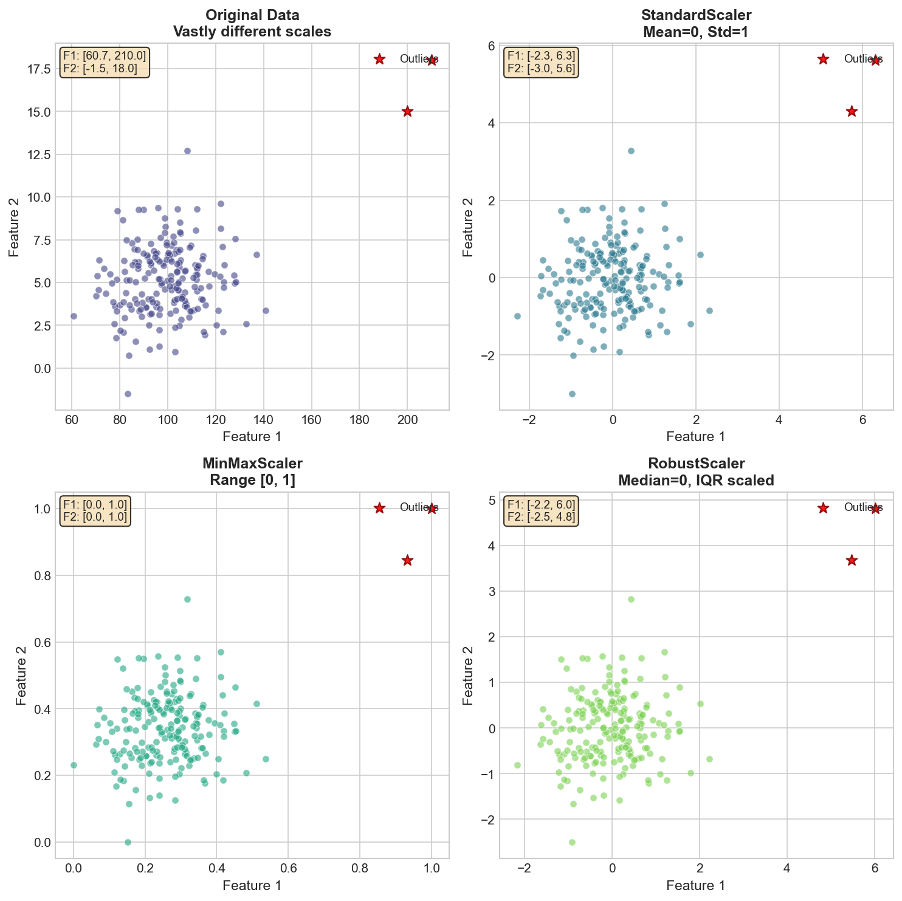
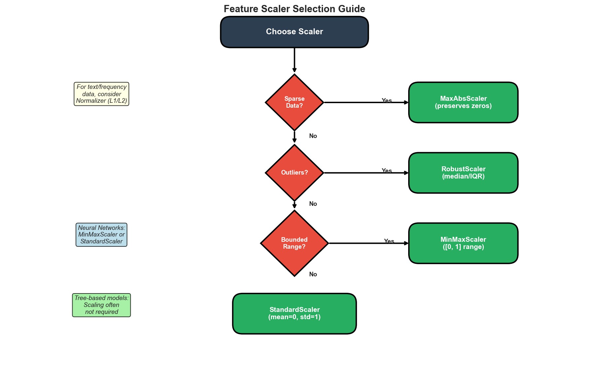
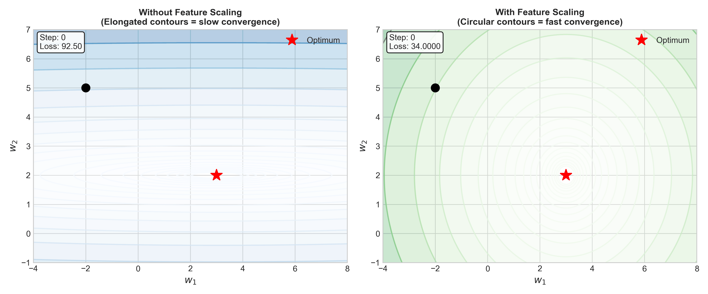
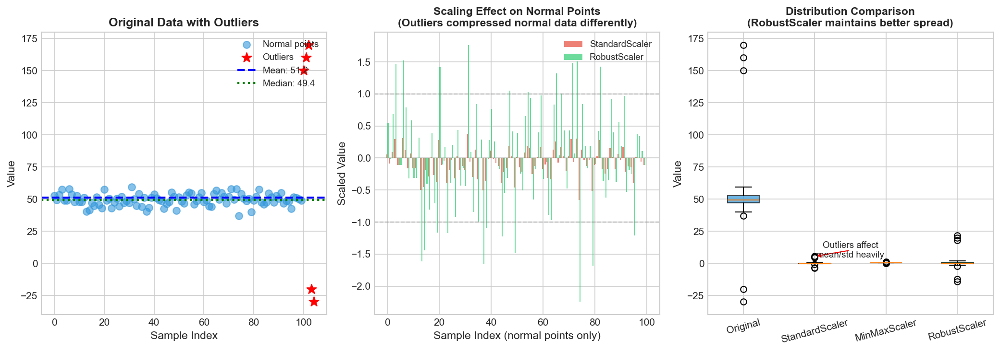
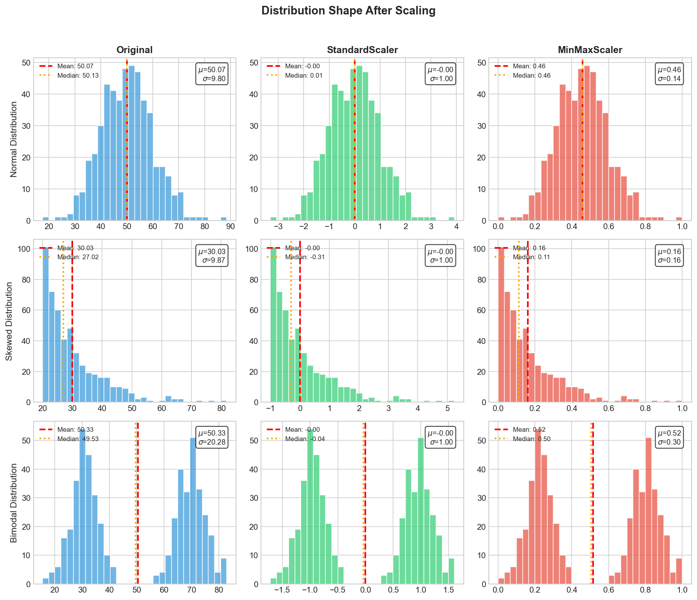
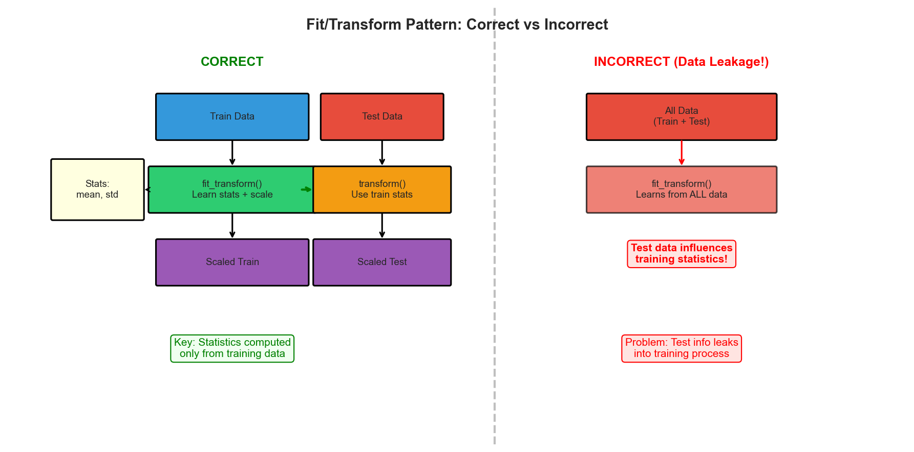

# Feature Scaling Implementation

> **Essential preprocessing for ML algorithms**

Feature scaling transforms features to similar ranges, critical for distance-based algorithms (KNN, SVM, K-Means) and gradient descent optimization.


*Different scaling methods transform data differently. Note how outliers (red stars) affect each method.*

## When to Use Each Scaler



| Scaler | Best For | Handles Outliers | Range |
|--------|----------|------------------|-------|
| StandardScaler | Normally distributed data | No | Unbounded |
| MinMaxScaler | Bounded ranges needed | No | [0, 1] |
| RobustScaler | Data with outliers | Yes | Unbounded |
| MaxAbsScaler | Sparse data | Somewhat | [-1, 1] |

## Why Feature Scaling Matters for Gradient Descent


*Without scaling, elongated contours cause oscillating, slow convergence. With scaling, circular contours enable direct path to optimum.*

## Base Scaler Class

```python
import numpy as np
from typing import Optional
from abc import ABC, abstractmethod

class BaseScaler(ABC):
    """Abstract base class implementing fit/transform pattern."""

    def __init__(self):
        self.is_fitted = False

    @abstractmethod
    def fit(self, X: np.ndarray) -> 'BaseScaler':
        """Compute statistics from training data."""
        pass

    @abstractmethod
    def transform(self, X: np.ndarray) -> np.ndarray:
        """Transform data using computed statistics."""
        pass

    @abstractmethod
    def inverse_transform(self, X: np.ndarray) -> np.ndarray:
        """Reverse the transformation."""
        pass

    def fit_transform(self, X: np.ndarray) -> np.ndarray:
        """Fit and transform in one step."""
        return self.fit(X).transform(X)

    def _validate_input(self, X: np.ndarray) -> np.ndarray:
        """Convert input to 2D numpy array."""
        X = np.asarray(X, dtype=np.float64)
        if X.ndim == 1:
            X = X.reshape(-1, 1)
        return X

    def _check_is_fitted(self):
        """Verify the scaler has been fitted."""
        if not self.is_fitted:
            raise RuntimeError("Scaler must be fitted before transform")
```

## StandardScaler (Z-Score Normalization)

Transforms features to zero mean and unit variance: `z = (x - mean) / std`

```python
class StandardScaler(BaseScaler):
    """
    Standardize features by removing mean and scaling to unit variance.
    Formula: z = (x - mu) / sigma

    Time Complexity: O(n * d) for fit and transform
    Space Complexity: O(d) for storing statistics
    """

    def __init__(self, with_mean: bool = True, with_std: bool = True):
        super().__init__()
        self.with_mean = with_mean
        self.with_std = with_std
        self.mean_: Optional[np.ndarray] = None
        self.std_: Optional[np.ndarray] = None
        self.var_: Optional[np.ndarray] = None
        self.n_samples_seen_: int = 0

    def fit(self, X: np.ndarray) -> 'StandardScaler':
        X = self._validate_input(X)
        self.n_samples_seen_ = X.shape[0]

        if self.with_mean:
            self.mean_ = np.mean(X, axis=0)
        else:
            self.mean_ = np.zeros(X.shape[1])

        if self.with_std:
            self.var_ = np.var(X, axis=0)
            self.std_ = np.sqrt(self.var_)
            self.std_ = np.where(self.std_ == 0, 1.0, self.std_)
        else:
            self.std_ = np.ones(X.shape[1])
            self.var_ = np.ones(X.shape[1])

        self.is_fitted = True
        return self

    def transform(self, X: np.ndarray) -> np.ndarray:
        self._check_is_fitted()
        X = self._validate_input(X)
        return (X - self.mean_) / self.std_

    def inverse_transform(self, X: np.ndarray) -> np.ndarray:
        self._check_is_fitted()
        X = self._validate_input(X)
        return X * self.std_ + self.mean_

    def partial_fit(self, X: np.ndarray) -> 'StandardScaler':
        """Incrementally update statistics (Welford's algorithm)."""
        X = self._validate_input(X)

        if not self.is_fitted:
            return self.fit(X)

        n_new = X.shape[0]
        new_mean = np.mean(X, axis=0)
        new_var = np.var(X, axis=0)
        n_total = self.n_samples_seen_ + n_new

        delta = new_mean - self.mean_
        combined_mean = self.mean_ + delta * n_new / n_total
        combined_var = (
            (self.n_samples_seen_ * self.var_ + n_new * new_var) / n_total +
            (self.n_samples_seen_ * n_new * delta ** 2) / (n_total ** 2)
        )

        self.mean_ = combined_mean
        self.var_ = combined_var
        self.std_ = np.sqrt(self.var_)
        self.std_ = np.where(self.std_ == 0, 1.0, self.std_)
        self.n_samples_seen_ = n_total

        return self
```

## MinMaxScaler

Scales features to a fixed range, typically [0, 1].

```python
class MinMaxScaler(BaseScaler):
    """
    Scale features to [min, max] range.
    Formula: X_scaled = (X - X_min) / (X_max - X_min) * (max - min) + min

    Time Complexity: O(n * d)
    Space Complexity: O(d)
    """

    def __init__(self, feature_range: tuple = (0, 1)):
        super().__init__()
        self.feature_range = feature_range
        self.min_: Optional[np.ndarray] = None
        self.max_: Optional[np.ndarray] = None
        self.data_range_: Optional[np.ndarray] = None
        self.scale_: Optional[np.ndarray] = None

    def fit(self, X: np.ndarray) -> 'MinMaxScaler':
        X = self._validate_input(X)

        self.min_ = np.min(X, axis=0)
        self.max_ = np.max(X, axis=0)
        self.data_range_ = self.max_ - self.min_
        self.data_range_ = np.where(self.data_range_ == 0, 1.0, self.data_range_)

        range_min, range_max = self.feature_range
        self.scale_ = (range_max - range_min) / self.data_range_

        self.is_fitted = True
        return self

    def transform(self, X: np.ndarray) -> np.ndarray:
        self._check_is_fitted()
        X = self._validate_input(X)

        range_min, range_max = self.feature_range
        X_std = (X - self.min_) / self.data_range_
        return X_std * (range_max - range_min) + range_min

    def inverse_transform(self, X: np.ndarray) -> np.ndarray:
        self._check_is_fitted()
        X = self._validate_input(X)

        range_min, range_max = self.feature_range
        X_std = (X - range_min) / (range_max - range_min)
        return X_std * self.data_range_ + self.min_
```

## RobustScaler

Uses median and IQR, robust to outliers.


*RobustScaler maintains better spread of normal points because outliers don't affect median/IQR as much as mean/std.*

```python
class RobustScaler(BaseScaler):
    """
    Scale using median and IQR (robust to outliers).
    Formula: X_scaled = (X - median) / IQR

    Time Complexity: O(n * d * log(n)) for fit (percentile calculation)
    Space Complexity: O(d)
    """

    def __init__(self, with_centering: bool = True, with_scaling: bool = True,
                 quantile_range: tuple = (25.0, 75.0)):
        super().__init__()
        self.with_centering = with_centering
        self.with_scaling = with_scaling
        self.quantile_range = quantile_range
        self.center_: Optional[np.ndarray] = None
        self.scale_: Optional[np.ndarray] = None

    def fit(self, X: np.ndarray) -> 'RobustScaler':
        X = self._validate_input(X)
        q_min, q_max = self.quantile_range

        if self.with_centering:
            self.center_ = np.median(X, axis=0)
        else:
            self.center_ = np.zeros(X.shape[1])

        if self.with_scaling:
            q_lower = np.percentile(X, q_min, axis=0)
            q_upper = np.percentile(X, q_max, axis=0)
            self.scale_ = q_upper - q_lower
            self.scale_ = np.where(self.scale_ == 0, 1.0, self.scale_)
        else:
            self.scale_ = np.ones(X.shape[1])

        self.is_fitted = True
        return self

    def transform(self, X: np.ndarray) -> np.ndarray:
        self._check_is_fitted()
        X = self._validate_input(X)
        return (X - self.center_) / self.scale_

    def inverse_transform(self, X: np.ndarray) -> np.ndarray:
        self._check_is_fitted()
        X = self._validate_input(X)
        return X * self.scale_ + self.center_
```

## MaxAbsScaler

Scales by maximum absolute value, preserving sparsity (zeros remain zeros).

```python
class MaxAbsScaler(BaseScaler):
    """
    Scale by maximum absolute value. Output range: [-1, 1].
    Preserves sparsity - zeros stay zeros.

    Time Complexity: O(n * d)
    Space Complexity: O(d)
    """

    def __init__(self):
        super().__init__()
        self.max_abs_: Optional[np.ndarray] = None

    def fit(self, X: np.ndarray) -> 'MaxAbsScaler':
        X = self._validate_input(X)
        self.max_abs_ = np.max(np.abs(X), axis=0)
        self.max_abs_ = np.where(self.max_abs_ == 0, 1.0, self.max_abs_)
        self.is_fitted = True
        return self

    def transform(self, X: np.ndarray) -> np.ndarray:
        self._check_is_fitted()
        X = self._validate_input(X)
        return X / self.max_abs_

    def inverse_transform(self, X: np.ndarray) -> np.ndarray:
        self._check_is_fitted()
        X = self._validate_input(X)
        return X * self.max_abs_
```

## Distribution Effects


*Scaling changes range and center but preserves distribution shape. Note: StandardScaler centers at 0, MinMaxScaler bounds to [0,1].*

## L1 and L2 Normalizers

Normalize samples (rows) to unit norm, unlike scalers which work on features (columns).

```python
class Normalizer:
    """
    Normalize samples to unit norm (stateless - no fit required).
    - L1: sum(|x_i|) = 1 (good for probability distributions)
    - L2: sqrt(sum(x_i^2)) = 1 (good for cosine similarity)
    - Max: max(|x_i|) = 1

    Time Complexity: O(n * d)
    """

    def __init__(self, norm: str = 'l2'):
        if norm not in ('l1', 'l2', 'max'):
            raise ValueError("norm must be 'l1', 'l2', or 'max'")
        self.norm = norm

    def fit(self, X: np.ndarray) -> 'Normalizer':
        return self  # Stateless

    def transform(self, X: np.ndarray) -> np.ndarray:
        X = np.asarray(X, dtype=np.float64)
        if X.ndim == 1:
            X = X.reshape(1, -1)

        if self.norm == 'l1':
            norms = np.sum(np.abs(X), axis=1, keepdims=True)
        elif self.norm == 'l2':
            norms = np.sqrt(np.sum(X ** 2, axis=1, keepdims=True))
        else:  # max
            norms = np.max(np.abs(X), axis=1, keepdims=True)

        norms = np.where(norms == 0, 1.0, norms)
        return X / norms

    def fit_transform(self, X: np.ndarray) -> np.ndarray:
        return self.fit(X).transform(X)
```

## Handling Train/Test Data Correctly



**Critical**: Always fit on training data only, then transform both train and test using training statistics.

```python
class ScalingPipeline:
    """Correct train/test scaling pattern."""

    def __init__(self, scaler: BaseScaler):
        self.scaler = scaler

    def fit_on_train(self, X_train: np.ndarray) -> np.ndarray:
        """Fit on training data and transform it."""
        return self.scaler.fit_transform(X_train)

    def transform_test(self, X_test: np.ndarray) -> np.ndarray:
        """Transform test data using TRAINING statistics."""
        return self.scaler.transform(X_test)


# Correct usage
pipeline = ScalingPipeline(StandardScaler())
X_train_scaled = pipeline.fit_on_train(X_train)
X_test_scaled = pipeline.transform_test(X_test)  # Uses train stats!

# WRONG: Fitting on all data causes data leakage
# wrong_scaler.fit_transform(np.vstack([X_train, X_test]))  # DON'T DO THIS
```

## Unified Scaler Interface

```python
class FeatureScaler:
    """Factory for easy scaler selection."""

    SCALERS = {
        'standard': StandardScaler,
        'minmax': MinMaxScaler,
        'robust': RobustScaler,
        'maxabs': MaxAbsScaler,
    }

    def __init__(self, method: str = 'standard', **kwargs):
        method = method.lower()
        if method in self.SCALERS:
            self.scaler = self.SCALERS[method](**kwargs)
        else:
            raise ValueError(f"Unknown method: {method}")

    def fit_transform(self, X: np.ndarray) -> np.ndarray:
        return self.scaler.fit_transform(X)

    def transform(self, X: np.ndarray) -> np.ndarray:
        return self.scaler.transform(X)

    @staticmethod
    def recommend(X: np.ndarray) -> str:
        """Recommend scaler based on data characteristics."""
        X = np.asarray(X)
        if X.ndim == 1:
            X = X.reshape(-1, 1)

        # Check sparsity
        if np.mean(X == 0) > 0.5:
            return 'maxabs'

        # Check for outliers using IQR
        q1 = np.percentile(X, 25, axis=0)
        q3 = np.percentile(X, 75, axis=0)
        iqr = q3 - q1
        outlier_mask = (X < q1 - 1.5 * iqr) | (X > q3 + 1.5 * iqr)
        if np.mean(outlier_mask) > 0.05:
            return 'robust'

        return 'standard'
```

## Interview Tips

**When to scale:**
- Distance-based algorithms (KNN, K-Means, SVM)
- Gradient descent optimization
- Neural networks
- Regularized models (features penalized equally)

**When NOT to scale:**
- Tree-based models (split decisions are scale-invariant)
- Naive Bayes (works with probabilities)
- When feature magnitude has meaning

**Common mistakes:**
- Fitting on entire dataset (train + test) - causes data leakage
- Scaling target variable for regression (usually not needed)
- Forgetting to save scaler for production

## Quick Reference for Interviews

```python
def quick_standard_scale(X_train, X_test):
    """Minimal StandardScaler for interviews."""
    mean = X_train.mean(axis=0)
    std = X_train.std(axis=0)
    std[std == 0] = 1

    X_train_scaled = (X_train - mean) / std
    X_test_scaled = (X_test - mean) / std  # Use TRAIN statistics!
    return X_train_scaled, X_test_scaled


def quick_minmax_scale(X_train, X_test):
    """Minimal MinMaxScaler for interviews."""
    X_min = X_train.min(axis=0)
    X_max = X_train.max(axis=0)
    X_range = X_max - X_min
    X_range[X_range == 0] = 1

    X_train_scaled = (X_train - X_min) / X_range
    X_test_scaled = (X_test - X_min) / X_range  # Use TRAIN statistics!
    return X_train_scaled, X_test_scaled
```

## Time Complexity Summary

| Scaler | Fit | Transform |
|--------|-----|-----------|
| StandardScaler | O(n*d) | O(n*d) |
| MinMaxScaler | O(n*d) | O(n*d) |
| RobustScaler | O(n*d*log(n)) | O(n*d) |
| MaxAbsScaler | O(n*d) | O(n*d) |
| Normalizer | Stateless | O(n*d) |

Where n = samples, d = features

## Summary

1. **StandardScaler**: Default choice for normally distributed data, gradient descent
2. **MinMaxScaler**: When bounded [0,1] range needed, neural networks
3. **RobustScaler**: When outliers are present
4. **MaxAbsScaler**: For sparse data (preserves zeros)
5. **Normalizer**: For text data, cosine similarity

**Golden rule**: Always fit on training data only!
