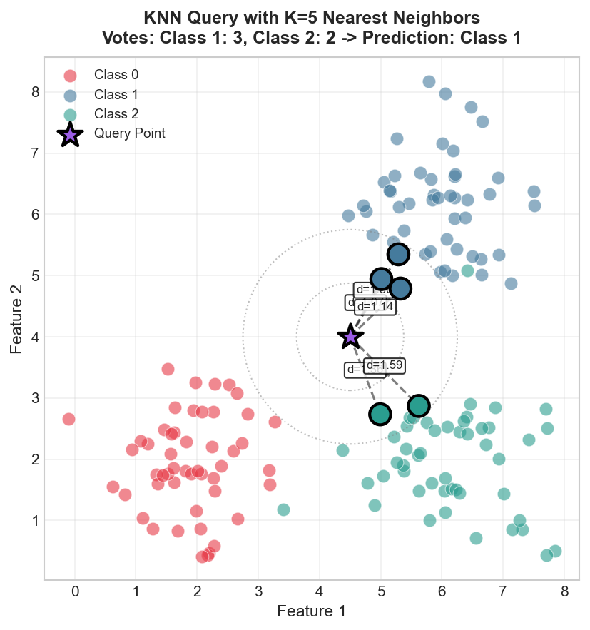
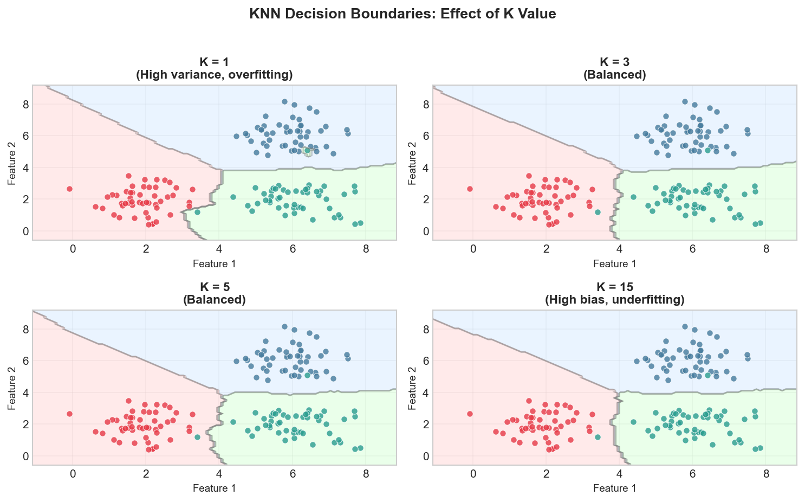
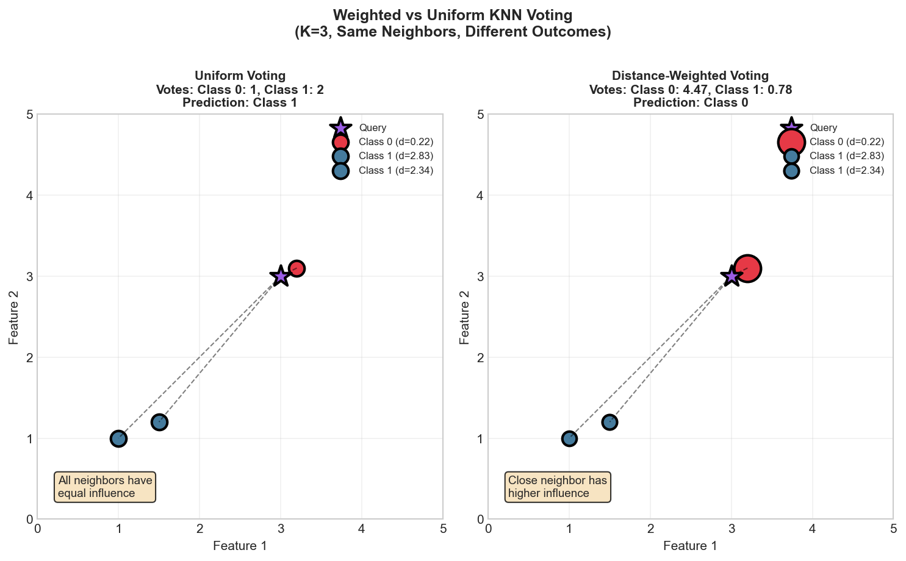
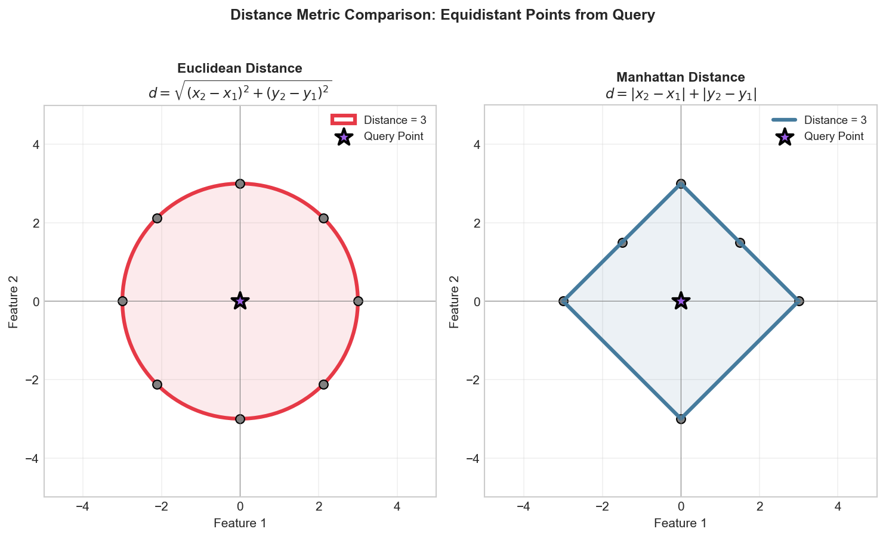

# Implement K-Nearest Neighbors (KNN)

> **From-scratch implementation** with variations and optimizations

---

## Problem Statement

Implement the K-Nearest Neighbors algorithm for classification. Given training data `X_train` with labels `y_train`, predict the label for a query point `x_query` based on the k nearest training points.



---

## Clarifying Questions to Ask

1. **Classification or regression?** (Start with classification, extend to regression)
2. **Distance metric?** (Euclidean is default, mention Manhattan, cosine as alternatives)
3. **How to handle ties?** (When k neighbors have equal votes)
4. **Libraries allowed?** (NumPy yes, sklearn no for implementation questions)
5. **k validation?** (What if k > n_samples?)

---

## Solution: Basic KNN Classifier

::: code-group

```python [Python]
from typing import List
from collections import Counter
import heapq
import math

def knn_classify(X_train: List[List[float]], y_train: List[int], x_query: List[float], k: int = 3) -> int:
    """
    K-Nearest Neighbors classification.

    Args:
        X_train: Training features, list of feature vectors
        y_train: Training labels
        x_query: Query point
        k: Number of neighbors

    Returns:
        Predicted class label
    """
    # Step 1: Validate inputs
    if k <= 0:
        raise ValueError("k must be positive")
    if k > len(X_train):
        raise ValueError(f"k={k} exceeds training set size={len(X_train)}")

    # Step 2: Compute distances from query to all training points
    distances: List[tuple] = []
    for i, x in enumerate(X_train):
        dist = math.sqrt(sum((a - b) ** 2 for a, b in zip(x, x_query)))
        distances.append((dist, i))

    # Step 3: Find indices of k nearest neighbors using heap
    k_nearest = heapq.nsmallest(k, distances)
    k_nearest_indices = [idx for _, idx in k_nearest]

    # Step 4: Get labels of k nearest neighbors
    k_nearest_labels = [y_train[i] for i in k_nearest_indices]

    # Step 5: Majority vote
    label_counts = Counter(k_nearest_labels)
    prediction = label_counts.most_common(1)[0][0]

    return prediction


def knn_classify_batch(X_train: List[List[float]], y_train: List[int],
                       X_query: List[List[float]], k: int = 3) -> List[int]:
    """
    Classify multiple query points.
    """
    predictions = []
    for x_query in X_query:
        pred = knn_classify(X_train, y_train, x_query, k)
        predictions.append(pred)
    return predictions
```

```python [NumPy]
import numpy as np
from collections import Counter

def knn_classify(X_train, y_train, x_query, k=3):
    """
    K-Nearest Neighbors classification.

    Args:
        X_train: Training features, shape (n_samples, n_features)
        y_train: Training labels, shape (n_samples,)
        x_query: Query point, shape (n_features,)
        k: Number of neighbors

    Returns:
        Predicted class label
    """
    # Step 1: Validate inputs
    if k <= 0:
        raise ValueError("k must be positive")
    if k > len(X_train):
        raise ValueError(f"k={k} exceeds training set size={len(X_train)}")

    # Step 2: Compute distances from query to all training points
    # Using Euclidean distance: sqrt(sum((a - b)^2))
    distances = np.sqrt(np.sum((X_train - x_query) ** 2, axis=1))

    # Step 3: Find indices of k nearest neighbors
    k_nearest_indices = np.argsort(distances)[:k]

    # Step 4: Get labels of k nearest neighbors
    k_nearest_labels = y_train[k_nearest_indices]

    # Step 5: Majority vote
    label_counts = Counter(k_nearest_labels)
    prediction = label_counts.most_common(1)[0][0]

    return prediction


def knn_classify_batch(X_train, y_train, X_query, k=3):
    """Classify multiple query points."""
    predictions = []
    for x_query in X_query:
        pred = knn_classify(X_train, y_train, x_query, k)
        predictions.append(pred)
    return np.array(predictions)
```

```python [PyTorch]
import torch
from collections import Counter

def knn_classify(X_train: torch.Tensor, y_train: torch.Tensor,
                 x_query: torch.Tensor, k: int = 3) -> int:
    """
    K-Nearest Neighbors classification.
    """
    # Validate inputs
    if k <= 0:
        raise ValueError("k must be positive")
    if k > len(X_train):
        raise ValueError(f"k={k} exceeds training set size={len(X_train)}")

    # Compute distances
    distances = torch.sqrt(torch.sum((X_train - x_query) ** 2, dim=1))

    # Find k nearest neighbors
    _, k_nearest_indices = torch.topk(distances, k, largest=False)

    # Majority vote
    k_nearest_labels = y_train[k_nearest_indices].tolist()
    label_counts = Counter(k_nearest_labels)
    prediction = label_counts.most_common(1)[0][0]

    return prediction
```

:::

---

## Walkthrough Example

```python
# Example data
X_train = np.array([
    [1, 1],   # Class 0
    [1, 2],   # Class 0
    [2, 1],   # Class 0
    [5, 5],   # Class 1
    [5, 6],   # Class 1
    [6, 5],   # Class 1
])
y_train = np.array([0, 0, 0, 1, 1, 1])

# Query point
x_query = np.array([3, 3])
k = 3

# Step-by-step trace:
# 1. Distances: [2.83, 2.24, 2.24, 2.83, 3.61, 3.61]
# 2. Sorted indices: [1, 2, 0, 3, 4, 5]
# 3. Top 3: [1, 2, 0]
# 4. Labels: [0, 0, 0]
# 5. Majority: 0

prediction = knn_classify(X_train, y_train, x_query, k=3)
print(f"Prediction: {prediction}")  # Output: 0
```

---

## Effect of K on Decision Boundaries



---

## Variations

### Variation 1: KNN Regression

::: code-group

```python [Python]
from typing import List
import math
import heapq

def knn_regress(X_train: List[List[float]], y_train: List[float],
                x_query: List[float], k: int = 3) -> float:
    """
    K-Nearest Neighbors regression (average of k nearest values).
    """
    # Compute distances
    distances: List[tuple] = []
    for i, x in enumerate(X_train):
        dist = math.sqrt(sum((a - b) ** 2 for a, b in zip(x, x_query)))
        distances.append((dist, i))

    # Find k nearest
    k_nearest = heapq.nsmallest(k, distances)
    k_nearest_indices = [idx for _, idx in k_nearest]
    k_nearest_values = [y_train[i] for i in k_nearest_indices]

    # Return mean (regression) instead of mode (classification)
    return sum(k_nearest_values) / len(k_nearest_values)
```

```python [NumPy]
import numpy as np

def knn_regress(X_train, y_train, x_query, k=3):
    """
    K-Nearest Neighbors regression (average of k nearest values).
    """
    distances = np.sqrt(np.sum((X_train - x_query) ** 2, axis=1))
    k_nearest_indices = np.argsort(distances)[:k]
    k_nearest_values = y_train[k_nearest_indices]

    return np.mean(k_nearest_values)
```

```python [PyTorch]
import torch

def knn_regress(X_train: torch.Tensor, y_train: torch.Tensor,
                x_query: torch.Tensor, k: int = 3) -> float:
    """
    K-Nearest Neighbors regression (average of k nearest values).
    """
    distances = torch.sqrt(torch.sum((X_train - x_query) ** 2, dim=1))
    _, k_nearest_indices = torch.topk(distances, k, largest=False)
    k_nearest_values = y_train[k_nearest_indices]

    return torch.mean(k_nearest_values).item()
```

:::

### Variation 2: Weighted KNN



::: code-group

```python [Python]
from typing import List, Dict
import math
import heapq

def knn_classify_weighted(X_train: List[List[float]], y_train: List[int],
                          x_query: List[float], k: int = 3) -> int:
    """
    KNN with distance-based weighting (closer neighbors have more influence).
    """
    # Compute distances
    distances: List[tuple] = []
    for i, x in enumerate(X_train):
        dist = math.sqrt(sum((a - b) ** 2 for a, b in zip(x, x_query)))
        distances.append((dist, i))

    # Find k nearest
    k_nearest = heapq.nsmallest(k, distances)
    k_nearest_indices = [idx for _, idx in k_nearest]
    k_nearest_labels = [y_train[i] for i in k_nearest_indices]
    k_nearest_distances = [dist for dist, _ in k_nearest]

    # Weight = 1 / distance (add small epsilon to avoid division by zero)
    weights = [1.0 / (d + 1e-8) for d in k_nearest_distances]

    # Weighted vote
    unique_labels = set(y_train)
    weighted_votes: Dict[int, float] = {}

    for label in unique_labels:
        weighted_votes[label] = sum(
            w for l, w in zip(k_nearest_labels, weights) if l == label
        )

    return max(weighted_votes, key=weighted_votes.get)
```

```python [NumPy]
import numpy as np

def knn_classify_weighted(X_train, y_train, x_query, k=3):
    """
    KNN with distance-based weighting (closer neighbors have more influence).
    """
    distances = np.sqrt(np.sum((X_train - x_query) ** 2, axis=1))
    k_nearest_indices = np.argsort(distances)[:k]
    k_nearest_labels = y_train[k_nearest_indices]
    k_nearest_distances = distances[k_nearest_indices]

    # Weight = 1 / distance
    weights = 1.0 / (k_nearest_distances + 1e-8)

    # Weighted vote
    unique_labels = np.unique(y_train)
    weighted_votes = {}

    for label in unique_labels:
        mask = k_nearest_labels == label
        weighted_votes[label] = np.sum(weights[mask])

    return max(weighted_votes, key=weighted_votes.get)
```

```python [PyTorch]
import torch

def knn_classify_weighted(X_train: torch.Tensor, y_train: torch.Tensor,
                          x_query: torch.Tensor, k: int = 3) -> int:
    """
    KNN with distance-based weighting (closer neighbors have more influence).
    """
    distances = torch.sqrt(torch.sum((X_train - x_query) ** 2, dim=1))
    _, k_nearest_indices = torch.topk(distances, k, largest=False)
    k_nearest_labels = y_train[k_nearest_indices]
    k_nearest_distances = distances[k_nearest_indices]

    weights = 1.0 / (k_nearest_distances + 1e-8)

    unique_labels = torch.unique(y_train)
    weighted_votes = {}

    for label in unique_labels:
        mask = k_nearest_labels == label.item()
        weighted_votes[label.item()] = torch.sum(weights[mask]).item()

    return max(weighted_votes, key=weighted_votes.get)
```

:::

### Variation 3: Different Distance Metrics



::: code-group

```python [Python]
from typing import List
from collections import Counter
import math
import heapq

def compute_distance(x1: List[float], x2: List[float], metric: str = 'euclidean') -> float:
    """Compute distance between two points using the specified metric."""
    if metric == 'euclidean':
        return math.sqrt(sum((a - b) ** 2 for a, b in zip(x1, x2)))
    elif metric == 'manhattan':
        return sum(abs(a - b) for a, b in zip(x1, x2))
    elif metric == 'cosine':
        dot = sum(a * b for a, b in zip(x1, x2))
        norm1 = math.sqrt(sum(a ** 2 for a in x1))
        norm2 = math.sqrt(sum(b ** 2 for b in x2))
        return 1 - dot / (norm1 * norm2 + 1e-8)
    raise ValueError(f"Unknown metric: {metric}")


def knn_classify_flexible(X_train: List[List[float]], y_train: List[int],
                          x_query: List[float], k: int = 3,
                          metric: str = 'euclidean') -> int:
    """KNN with configurable distance metric."""
    distances = []
    for i, x in enumerate(X_train):
        dist = compute_distance(x, x_query, metric)
        distances.append((dist, i))

    k_nearest = heapq.nsmallest(k, distances)
    k_nearest_labels = [y_train[idx] for _, idx in k_nearest]

    return Counter(k_nearest_labels).most_common(1)[0][0]
```

```python [NumPy]
import numpy as np
from collections import Counter

def knn_classify_flexible(X_train, y_train, x_query, k=3, metric='euclidean'):
    """KNN with configurable distance metric."""
    if metric == 'euclidean':
        distances = np.sqrt(np.sum((X_train - x_query) ** 2, axis=1))
    elif metric == 'manhattan':
        distances = np.sum(np.abs(X_train - x_query), axis=1)
    elif metric == 'cosine':
        dot_products = np.dot(X_train, x_query)
        norms_train = np.linalg.norm(X_train, axis=1)
        norm_query = np.linalg.norm(x_query)
        similarities = dot_products / (norms_train * norm_query + 1e-8)
        distances = 1 - similarities
    else:
        raise ValueError(f"Unknown metric: {metric}")

    k_nearest_indices = np.argsort(distances)[:k]
    k_nearest_labels = y_train[k_nearest_indices]

    return Counter(k_nearest_labels).most_common(1)[0][0]
```

```python [PyTorch]
import torch
from collections import Counter

def knn_classify_flexible(X_train: torch.Tensor, y_train: torch.Tensor,
                          x_query: torch.Tensor, k: int = 3,
                          metric: str = 'euclidean') -> int:
    """KNN with configurable distance metric."""
    if metric == 'euclidean':
        distances = torch.sqrt(torch.sum((X_train - x_query) ** 2, dim=1))
    elif metric == 'manhattan':
        distances = torch.sum(torch.abs(X_train - x_query), dim=1)
    elif metric == 'cosine':
        dot_products = torch.mv(X_train, x_query)
        norms_train = torch.norm(X_train, dim=1)
        norm_query = torch.norm(x_query)
        similarities = dot_products / (norms_train * norm_query + 1e-8)
        distances = 1 - similarities
    else:
        raise ValueError(f"Unknown metric: {metric}")

    _, k_nearest_indices = torch.topk(distances, k, largest=False)
    k_nearest_labels = y_train[k_nearest_indices].tolist()

    return Counter(k_nearest_labels).most_common(1)[0][0]
```

:::

---

## Vectorized Batch Prediction

For efficiency when predicting many points:

::: code-group

```python [Python]
from typing import List
from collections import Counter
import math

def knn_classify_batch_vectorized(X_train: List[List[float]], y_train: List[int],
                                   X_query: List[List[float]], k: int = 3) -> List[int]:
    """Batch KNN prediction with pairwise distance computation."""
    n_train = len(X_train)
    n_query = len(X_query)

    # Compute pairwise distance matrix: shape (n_query, n_train)
    distances = []
    for x_q in X_query:
        row = []
        for x_t in X_train:
            dist = math.sqrt(sum((a - b) ** 2 for a, b in zip(x_q, x_t)))
            row.append(dist)
        distances.append(row)

    # Predict for each query
    predictions = []
    for i in range(n_query):
        indexed_dists = [(distances[i][j], j) for j in range(n_train)]
        indexed_dists.sort()
        k_nearest_indices = [idx for _, idx in indexed_dists[:k]]
        k_labels = [y_train[idx] for idx in k_nearest_indices]
        pred = Counter(k_labels).most_common(1)[0][0]
        predictions.append(pred)

    return predictions
```

```python [NumPy]
import numpy as np
from collections import Counter

def knn_classify_batch_vectorized(X_train, y_train, X_query, k=3):
    """
    Vectorized KNN for batch prediction.
    Uses pairwise distance matrix for efficiency.
    """
    n_query = len(X_query)

    # Compute pairwise distance matrix: ||a - b||^2 = ||a||^2 + ||b||^2 - 2*a.b
    X_train_sq = np.sum(X_train ** 2, axis=1).reshape(1, -1)
    X_query_sq = np.sum(X_query ** 2, axis=1).reshape(-1, 1)
    cross_term = np.dot(X_query, X_train.T)

    dist_sq = X_query_sq + X_train_sq - 2 * cross_term
    distances = np.sqrt(np.maximum(dist_sq, 0))

    # Find k nearest for each query
    k_nearest_indices = np.argpartition(distances, k, axis=1)[:, :k]

    # Predict for each query
    predictions = []
    for i in range(n_query):
        k_labels = y_train[k_nearest_indices[i]]
        pred = Counter(k_labels).most_common(1)[0][0]
        predictions.append(pred)

    return np.array(predictions)
```

```python [PyTorch]
import torch
from collections import Counter

def knn_classify_batch_vectorized(X_train: torch.Tensor, y_train: torch.Tensor,
                                   X_query: torch.Tensor, k: int = 3) -> torch.Tensor:
    """Vectorized KNN for batch prediction using PyTorch."""
    n_query = X_query.shape[0]

    # Compute pairwise distance matrix
    X_train_sq = torch.sum(X_train ** 2, dim=1).unsqueeze(0)
    X_query_sq = torch.sum(X_query ** 2, dim=1).unsqueeze(1)
    cross_term = torch.mm(X_query, X_train.T)

    dist_sq = X_query_sq + X_train_sq - 2 * cross_term
    distances = torch.sqrt(torch.clamp(dist_sq, min=0))

    # Find k nearest for each query
    _, k_nearest_indices = torch.topk(distances, k, dim=1, largest=False)

    # Predict for each query
    predictions = []
    for i in range(n_query):
        k_labels = y_train[k_nearest_indices[i]].tolist()
        pred = Counter(k_labels).most_common(1)[0][0]
        predictions.append(pred)

    return torch.tensor(predictions)
```

:::

---

## Complexity Analysis

| Operation | Time | Space |
|-----------|------|-------|
| Single prediction | O(nd + n log n) | O(n) |
| Batch (naive) | O(m(nd + n log n)) | O(n) |
| Batch (vectorized) | O(mnd) | O(mn) |

*n = training samples, m = query points, d = features*

---

## Optimizations

### KD-Tree for O(log n) Queries

```python
from scipy.spatial import KDTree
from collections import Counter

def knn_with_kdtree(X_train, y_train, X_query, k=3):
    """KNN using KD-Tree for O(log n) nearest neighbor queries."""
    tree = KDTree(X_train)
    distances, indices = tree.query(X_query, k=k)
    return np.array([Counter(y_train[idx]).most_common(1)[0][0] for idx in indices])
```

**When to use**: n > 10,000 and d < 20. Use Ball Tree for d > 20, Faiss/Annoy for approximate NN on large datasets.

---

## Edge Cases to Handle

::: code-group

```python [Python]
from typing import List
from collections import Counter
import math
import heapq

def knn_classify_robust(X_train: List[List[float]], y_train: List[int],
                        x_query: List[float], k: int = 3) -> int:
    """Robust KNN with edge case handling."""
    # Edge case 1: Empty training set
    if len(X_train) == 0:
        raise ValueError("Training set is empty")

    # Edge case 2: k larger than training set
    if k > len(X_train):
        print(f"Warning: k={k} > n_samples={len(X_train)}, using k={len(X_train)}")
        k = len(X_train)

    # Edge case 3: Mismatched dimensions
    if len(X_train[0]) != len(x_query):
        raise ValueError(f"Feature dimension mismatch: {len(X_train[0])} vs {len(x_query)}")

    distances = []
    for i, x in enumerate(X_train):
        dist = math.sqrt(sum((a - b) ** 2 for a, b in zip(x, x_query)))
        distances.append((dist, i))

    k_nearest = heapq.nsmallest(k, distances)
    k_nearest_labels = [y_train[idx] for _, idx in k_nearest]

    label_counts = Counter(k_nearest_labels)
    return label_counts.most_common(1)[0][0]
```

```python [NumPy]
import numpy as np
from collections import Counter

def knn_classify_robust(X_train, y_train, x_query, k=3):
    """Robust KNN with edge case handling."""
    if len(X_train) == 0:
        raise ValueError("Training set is empty")

    if k > len(X_train):
        print(f"Warning: k={k} > n_samples={len(X_train)}, using k={len(X_train)}")
        k = len(X_train)

    if X_train.shape[1] != len(x_query):
        raise ValueError(f"Feature dimension mismatch: {X_train.shape[1]} vs {len(x_query)}")

    distances = np.sqrt(np.sum((X_train - x_query) ** 2, axis=1))
    k_nearest_indices = np.argsort(distances)[:k]
    k_nearest_labels = y_train[k_nearest_indices]

    label_counts = Counter(k_nearest_labels)
    return label_counts.most_common(1)[0][0]
```

:::

---

## Test Suite

```python
def test_knn():
    """Test cases for KNN implementation."""

    # Test 1: Basic classification
    X_train = np.array([[0, 0], [1, 1], [2, 2], [10, 10], [11, 11], [12, 12]])
    y_train = np.array([0, 0, 0, 1, 1, 1])
    x_query = np.array([1.5, 1.5])
    assert knn_classify(X_train, y_train, x_query, k=3) == 0
    print("Test 1 passed: Basic classification")

    # Test 2: Query near class boundary
    x_query = np.array([5, 5])
    pred = knn_classify(X_train, y_train, x_query, k=3)
    print(f"Test 2: Boundary query predicted as class {pred}")

    # Test 3: k=1 (nearest neighbor)
    x_query = np.array([10.1, 10.1])
    assert knn_classify(X_train, y_train, x_query, k=1) == 1
    print("Test 3 passed: k=1 nearest neighbor")

    # Test 4: k equals dataset size
    pred = knn_classify(X_train, y_train, x_query, k=6)
    print(f"Test 4: k=n prediction: {pred}")

    print("\nAll tests passed!")

test_knn()
```

---

## Interview Tips

1. **Clarify first** - distance metric, classification vs regression, tie handling
2. **Write clean code** - optimize later if time permits
3. **Trace an example** - demonstrates understanding
4. **Know complexity** - mention KD-tree for large n
5. **Handle edge cases** - empty data, k > n, dimension mismatch
