# Implement Linear Regression with Regularization

> **From-scratch implementation** with closed-form, gradient descent, and regularization variants

---

## Problem Statement

Implement Linear Regression from scratch. Given training data `X` and targets `y`, fit a linear model to predict continuous values. Extend to include L1 (Lasso), L2 (Ridge), and Elastic Net regularization.

---

## Clarifying Questions to Ask

1. **Closed-form or iterative?** (Normal equation vs gradient descent)
2. **Regularization needed?** (None, L1, L2, or Elastic Net)
3. **Feature scaling?** (Important for gradient descent convergence)
4. **Intercept handling?** (Add bias term or assume centered data)
5. **Libraries allowed?** (NumPy yes, sklearn no)

---

## Key Mathematical Formulas

### Linear Model

$$\hat{y} = Xw + b = X_{aug}w_{aug}$$

Where $X_{aug}$ includes a column of ones for the bias term.

### Loss Functions

| Type | Loss Function | Gradient |
|------|---------------|----------|
| **OLS** | $L = \frac{1}{2n}\|Xw - y\|^2$ | $\nabla L = \frac{1}{n}X^T(Xw - y)$ |
| **Ridge (L2)** | $L = \frac{1}{2n}\|Xw - y\|^2 + \frac{\lambda}{2}\|w\|^2$ | $\nabla L = \frac{1}{n}X^T(Xw - y) + \lambda w$ |
| **Lasso (L1)** | $L = \frac{1}{2n}\|Xw - y\|^2 + \lambda\|w\|_1$ | Subgradient / Coordinate descent |
| **Elastic Net** | $L = \frac{1}{2n}\|Xw - y\|^2 + \lambda_1\|w\|_1 + \frac{\lambda_2}{2}\|w\|^2$ | Combined approach |

---

## Algorithm Flow

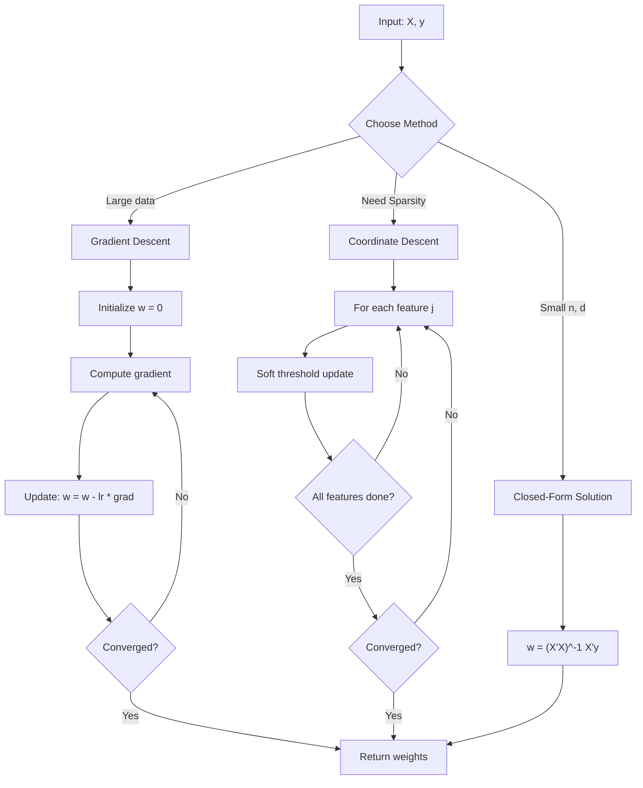

### Gradient Descent Convergence

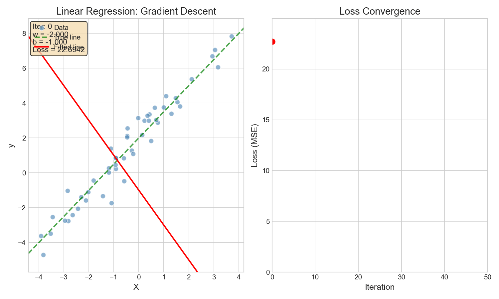

The animation shows how gradient descent iteratively updates weights to minimize loss.

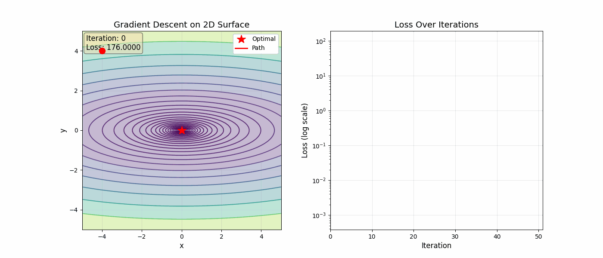

*Step-by-step visualization on a contour plot showing how the optimizer follows the steepest descent direction.*

---

## Solution 1: Basic Linear Regression (Closed-Form)

### Normal Equation

The closed-form solution: $w = (X^TX)^{-1}X^Ty$

::: code-group

```python [Python]
from typing import List, Tuple
import math

def linear_regression_fit(X: List[List[float]], y: List[float],
                          fit_intercept: bool = True) -> Tuple[List[float], float]:
    """
    Fit linear regression using the normal equation.

    Args:
        X: Feature matrix, shape (n_samples, n_features)
        y: Target values, shape (n_samples,)
        fit_intercept: Whether to fit intercept term

    Returns:
        weights: Coefficient for each feature
        intercept: Bias term (0 if fit_intercept=False)
    """
    n_samples = len(X)
    n_features = len(X[0]) if X else 0

    # Add intercept column if needed
    if fit_intercept:
        X_aug = [[1.0] + list(row) for row in X]
        n_features += 1
    else:
        X_aug = [list(row) for row in X]

    # Compute X^T X
    XtX = [[0.0] * n_features for _ in range(n_features)]
    for i in range(n_features):
        for j in range(n_features):
            for k in range(n_samples):
                XtX[i][j] += X_aug[k][i] * X_aug[k][j]

    # Compute X^T y
    Xty = [0.0] * n_features
    for i in range(n_features):
        for k in range(n_samples):
            Xty[i] += X_aug[k][i] * y[k]

    # Solve (X^T X) w = X^T y using Gaussian elimination
    w = solve_linear_system(XtX, Xty)

    if fit_intercept:
        return w[1:], w[0]
    else:
        return w, 0.0


def solve_linear_system(A: List[List[float]], b: List[float]) -> List[float]:
    """Solve Ax = b using Gaussian elimination with partial pivoting."""
    n = len(A)
    # Augmented matrix
    aug = [A[i][:] + [b[i]] for i in range(n)]

    # Forward elimination
    for col in range(n):
        # Find pivot
        max_row = col
        for row in range(col + 1, n):
            if abs(aug[row][col]) > abs(aug[max_row][col]):
                max_row = row
        aug[col], aug[max_row] = aug[max_row], aug[col]

        # Eliminate column
        for row in range(col + 1, n):
            if aug[col][col] != 0:
                factor = aug[row][col] / aug[col][col]
                for j in range(col, n + 1):
                    aug[row][j] -= factor * aug[col][j]

    # Back substitution
    x = [0.0] * n
    for i in range(n - 1, -1, -1):
        x[i] = aug[i][n]
        for j in range(i + 1, n):
            x[i] -= aug[i][j] * x[j]
        if aug[i][i] != 0:
            x[i] /= aug[i][i]

    return x


def predict(X: List[List[float]], weights: List[float], intercept: float) -> List[float]:
    """Make predictions using learned weights."""
    predictions = []
    for x in X:
        pred = intercept + sum(w * xi for w, xi in zip(weights, x))
        predictions.append(pred)
    return predictions
```

```python [NumPy]
import numpy as np

def linear_regression_fit(X, y, fit_intercept=True):
    """
    Fit linear regression using the normal equation.

    Args:
        X: Feature matrix, shape (n_samples, n_features)
        y: Target values, shape (n_samples,)
        fit_intercept: Whether to fit intercept term

    Returns:
        weights: Coefficient for each feature
        intercept: Bias term (0 if fit_intercept=False)
    """
    X = np.array(X)
    y = np.array(y)

    # Add intercept column if needed
    if fit_intercept:
        X_aug = np.column_stack([np.ones(len(X)), X])
    else:
        X_aug = X

    # Normal equation: w = (X^T X)^-1 X^T y
    # Use np.linalg.lstsq for numerical stability
    w, residuals, rank, s = np.linalg.lstsq(X_aug, y, rcond=None)

    if fit_intercept:
        return w[1:], w[0]
    else:
        return w, 0.0


def predict(X, weights, intercept):
    """Make predictions using learned weights."""
    X = np.array(X)
    weights = np.array(weights)
    return X @ weights + intercept
```

:::

---

## Solution 2: Ridge Regression (L2 Regularization)

**Closed-form**: $w = (X^TX + \lambda I)^{-1}X^Ty$

::: code-group

```python [Python]
from typing import List, Tuple

def ridge_regression_fit(X: List[List[float]], y: List[float],
                         alpha: float = 1.0, fit_intercept: bool = True) -> Tuple[List[float], float]:
    """
    Fit Ridge regression using closed-form solution.

    Args:
        X: Feature matrix
        y: Target values
        alpha: Regularization strength (lambda)
        fit_intercept: Whether to fit intercept

    Returns:
        weights, intercept
    """
    n_samples = len(X)
    n_features = len(X[0])

    # Center data if fitting intercept
    if fit_intercept:
        X_mean = [sum(X[i][j] for i in range(n_samples)) / n_samples
                  for j in range(n_features)]
        y_mean = sum(y) / n_samples

        X_centered = [[X[i][j] - X_mean[j] for j in range(n_features)]
                      for i in range(n_samples)]
        y_centered = [y[i] - y_mean for i in range(n_samples)]
    else:
        X_centered = X
        y_centered = y
        X_mean = [0.0] * n_features
        y_mean = 0.0

    # Compute X^T X + alpha * I
    XtX = [[0.0] * n_features for _ in range(n_features)]
    for i in range(n_features):
        for j in range(n_features):
            for k in range(n_samples):
                XtX[i][j] += X_centered[k][i] * X_centered[k][j]
        XtX[i][i] += alpha  # Add regularization to diagonal

    # Compute X^T y
    Xty = [0.0] * n_features
    for i in range(n_features):
        for k in range(n_samples):
            Xty[i] += X_centered[k][i] * y_centered[k]

    # Solve system
    weights = solve_linear_system(XtX, Xty)

    # Compute intercept
    if fit_intercept:
        intercept = y_mean - sum(w * m for w, m in zip(weights, X_mean))
    else:
        intercept = 0.0

    return weights, intercept
```

```python [NumPy]
import numpy as np

def ridge_regression_fit(X, y, alpha=1.0, fit_intercept=True):
    """
    Fit Ridge regression using closed-form solution.

    Args:
        X: Feature matrix, shape (n_samples, n_features)
        y: Target values, shape (n_samples,)
        alpha: Regularization strength (lambda)
        fit_intercept: Whether to fit intercept

    Returns:
        weights, intercept
    """
    X = np.array(X, dtype=np.float64)
    y = np.array(y, dtype=np.float64)
    n_samples, n_features = X.shape

    # Center data if fitting intercept
    if fit_intercept:
        X_mean = X.mean(axis=0)
        y_mean = y.mean()
        X_centered = X - X_mean
        y_centered = y - y_mean
    else:
        X_centered = X
        y_centered = y
        X_mean = np.zeros(n_features)
        y_mean = 0.0

    # Closed-form: w = (X^T X + alpha * I)^-1 X^T y
    XtX = X_centered.T @ X_centered
    Xty = X_centered.T @ y_centered

    # Add regularization to diagonal
    XtX_reg = XtX + alpha * np.eye(n_features)

    # Solve the regularized normal equations (LU via np.linalg.solve)
    weights = np.linalg.solve(XtX_reg, Xty)

    # Compute intercept
    if fit_intercept:
        intercept = y_mean - X_mean @ weights
    else:
        intercept = 0.0

    return weights, intercept
```

:::

---

## Solution 3: Lasso Regression (L1 Regularization)

Uses coordinate descent with soft thresholding: $S_\lambda(z) = \text{sign}(z) \cdot \max(|z| - \lambda, 0)$

::: code-group

```python [Python]
from typing import List, Tuple

def soft_threshold(z: float, threshold: float) -> float:
    """Soft thresholding operator for L1 regularization."""
    if z > threshold:
        return z - threshold
    elif z < -threshold:
        return z + threshold
    else:
        return 0.0


def lasso_regression_fit(X: List[List[float]], y: List[float],
                         alpha: float = 1.0, max_iters: int = 1000,
                         tolerance: float = 1e-6) -> Tuple[List[float], float]:
    """
    Fit Lasso regression using coordinate descent.

    Args:
        X: Feature matrix
        y: Target values
        alpha: Regularization strength
        max_iters: Maximum iterations
        tolerance: Convergence threshold

    Returns:
        weights, intercept
    """
    n_samples = len(X)
    n_features = len(X[0])

    # Center X and y (regularization should not penalize the intercept)
    X_mean = [sum(X[i][j] for i in range(n_samples)) / n_samples
              for j in range(n_features)]
    y_mean = sum(y) / n_samples
    X_centered = [[X[i][j] - X_mean[j] for j in range(n_features)]
                  for i in range(n_samples)]
    y_centered = [y[i] - y_mean for i in range(n_samples)]

    # Precompute squared norms of centered features
    X_norms = []
    for j in range(n_features):
        norm_sq = sum(X_centered[i][j] ** 2 for i in range(n_samples))
        X_norms.append(norm_sq)

    # Initialize weights
    weights = [0.0] * n_features

    # Compute initial residuals on centered data
    residuals = y_centered[:]

    for iteration in range(max_iters):
        weights_old = weights[:]

        # Update each coordinate
        for j in range(n_features):
            if X_norms[j] == 0:
                continue

            # Add back contribution of current weight
            for i in range(n_samples):
                residuals[i] += weights[j] * X_centered[i][j]

            # Compute correlation with residuals
            rho = sum(X_centered[i][j] * residuals[i] for i in range(n_samples))

            # Soft threshold update
            weights[j] = soft_threshold(rho, alpha * n_samples) / X_norms[j]

            # Subtract new contribution
            for i in range(n_samples):
                residuals[i] -= weights[j] * X_centered[i][j]

        # Check convergence
        max_change = max(abs(weights[j] - weights_old[j]) for j in range(n_features))
        if max_change < tolerance:
            break

    # Compute intercept once after convergence
    intercept = y_mean - sum(w * m for w, m in zip(weights, X_mean))

    return weights, intercept
```

```python [NumPy]
import numpy as np

def soft_threshold(z, threshold):
    """Soft thresholding operator for L1 regularization."""
    return np.sign(z) * np.maximum(np.abs(z) - threshold, 0)


def lasso_regression_fit(X, y, alpha=1.0, max_iters=1000, tolerance=1e-6):
    """
    Fit Lasso regression using coordinate descent.

    Args:
        X: Feature matrix, shape (n_samples, n_features)
        y: Target values, shape (n_samples,)
        alpha: Regularization strength
        max_iters: Maximum iterations
        tolerance: Convergence threshold

    Returns:
        weights, intercept
    """
    X = np.array(X, dtype=np.float64)
    y = np.array(y, dtype=np.float64)
    n_samples, n_features = X.shape

    # Center y
    y_mean = y.mean()
    y_centered = y - y_mean

    # Standardize X (store means for intercept calculation)
    X_mean = X.mean(axis=0)
    X_centered = X - X_mean

    # Precompute X norms
    X_norms_sq = np.sum(X_centered ** 2, axis=0)

    # Initialize weights
    weights = np.zeros(n_features)

    # Compute initial residuals
    residuals = y_centered.copy()

    for iteration in range(max_iters):
        weights_old = weights.copy()

        # Update each coordinate
        for j in range(n_features):
            if X_norms_sq[j] == 0:
                continue

            # Add back contribution of current weight
            residuals += weights[j] * X_centered[:, j]

            # Compute correlation with residuals
            rho = X_centered[:, j] @ residuals

            # Soft threshold update
            weights[j] = soft_threshold(rho, alpha * n_samples) / X_norms_sq[j]

            # Subtract new contribution
            residuals -= weights[j] * X_centered[:, j]

        # Check convergence
        if np.max(np.abs(weights - weights_old)) < tolerance:
            break

    # Compute intercept
    intercept = y_mean - X_mean @ weights

    return weights, intercept
```

:::

---

## Solution 4: Elastic Net (L1 + L2)

$$L = \frac{1}{2n}\|Xw - y\|^2 + \alpha \rho \|w\|_1 + \frac{\alpha(1-\rho)}{2}\|w\|^2$$

::: code-group

```python [Python]
from typing import List, Tuple

def elastic_net_fit(X: List[List[float]], y: List[float],
                    alpha: float = 1.0, l1_ratio: float = 0.5,
                    max_iters: int = 1000, tolerance: float = 1e-6) -> Tuple[List[float], float]:
    """
    Fit Elastic Net using coordinate descent.

    Args:
        X: Feature matrix
        y: Target values
        alpha: Overall regularization strength
        l1_ratio: Balance between L1 and L2 (0=Ridge, 1=Lasso)
        max_iters: Maximum iterations
        tolerance: Convergence threshold

    Returns:
        weights, intercept
    """
    n_samples = len(X)
    n_features = len(X[0])

    l1_penalty = alpha * l1_ratio
    l2_penalty = alpha * (1 - l1_ratio)

    # Compute X norms
    X_norms = []
    for j in range(n_features):
        norm_sq = sum(X[i][j] ** 2 for i in range(n_samples))
        X_norms.append(norm_sq)

    # Initialize
    weights = [0.0] * n_features
    intercept = sum(y) / n_samples
    residuals = [y[i] - intercept for i in range(n_samples)]

    for iteration in range(max_iters):
        weights_old = weights[:]

        for j in range(n_features):
            if X_norms[j] == 0:
                continue

            # Add back current weight contribution
            for i in range(n_samples):
                residuals[i] += weights[j] * X[i][j]

            # Compute correlation
            rho = sum(X[i][j] * residuals[i] for i in range(n_samples))

            # Elastic Net update: soft threshold then scale by L2
            numerator = soft_threshold(rho, l1_penalty * n_samples)
            denominator = X_norms[j] + l2_penalty * n_samples
            weights[j] = numerator / denominator

            # Subtract new contribution
            for i in range(n_samples):
                residuals[i] -= weights[j] * X[i][j]

        # Check convergence
        max_change = max(abs(weights[j] - weights_old[j]) for j in range(n_features))
        if max_change < tolerance:
            break

    return weights, intercept
```

```python [NumPy]
import numpy as np

def elastic_net_fit(X, y, alpha=1.0, l1_ratio=0.5, max_iters=1000, tolerance=1e-6):
    """
    Fit Elastic Net using coordinate descent.

    Args:
        X: Feature matrix, shape (n_samples, n_features)
        y: Target values, shape (n_samples,)
        alpha: Overall regularization strength
        l1_ratio: Balance between L1 and L2 (0=Ridge, 1=Lasso)
        max_iters: Maximum iterations
        tolerance: Convergence threshold

    Returns:
        weights, intercept
    """
    X = np.array(X, dtype=np.float64)
    y = np.array(y, dtype=np.float64)
    n_samples, n_features = X.shape

    l1_penalty = alpha * l1_ratio
    l2_penalty = alpha * (1 - l1_ratio)

    # Center data
    y_mean = y.mean()
    y_centered = y - y_mean
    X_mean = X.mean(axis=0)
    X_centered = X - X_mean

    # Precompute norms
    X_norms_sq = np.sum(X_centered ** 2, axis=0)

    # Initialize
    weights = np.zeros(n_features)
    residuals = y_centered.copy()

    for iteration in range(max_iters):
        weights_old = weights.copy()

        for j in range(n_features):
            if X_norms_sq[j] == 0:
                continue

            # Add back current weight contribution
            residuals += weights[j] * X_centered[:, j]

            # Compute correlation
            rho = X_centered[:, j] @ residuals

            # Elastic Net update
            numerator = soft_threshold(rho, l1_penalty * n_samples)
            denominator = X_norms_sq[j] + l2_penalty * n_samples
            weights[j] = numerator / denominator

            # Subtract new contribution
            residuals -= weights[j] * X_centered[:, j]

        # Check convergence
        if np.max(np.abs(weights - weights_old)) < tolerance:
            break

    # Compute intercept
    intercept = y_mean - X_mean @ weights

    return weights, intercept
```

:::

---

## Solution 5: Gradient Descent Variants

### 3D Loss Surface Visualization

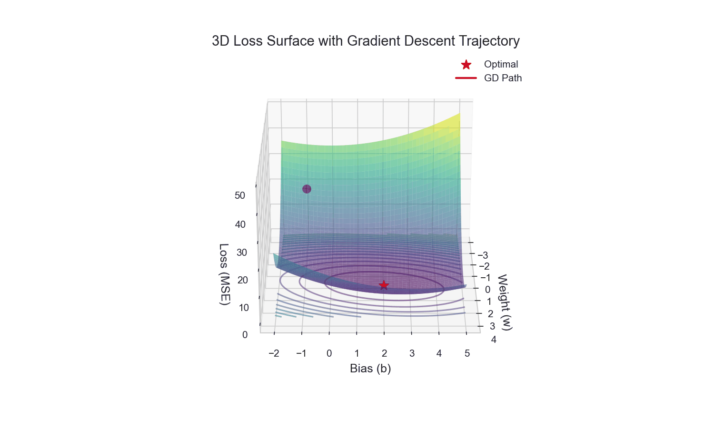

The 3D surface shows the convex MSE loss landscape. Gradient descent follows the steepest descent path toward the minimum.

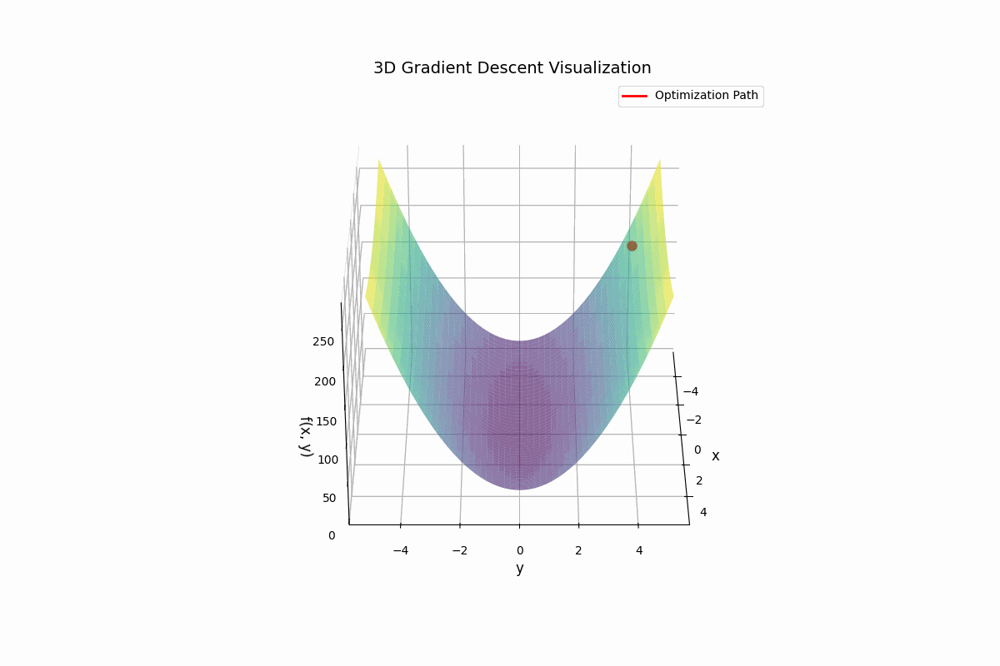

*Animated 3D view of gradient descent exploring the parameter space.*

### Rosenbrock Function Optimization

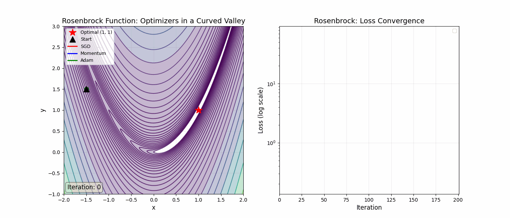

The Rosenbrock function demonstrates real optimization challenges: steep valleys and plateaus that gradient descent must navigate.

### Gradient Descent Methods Comparison

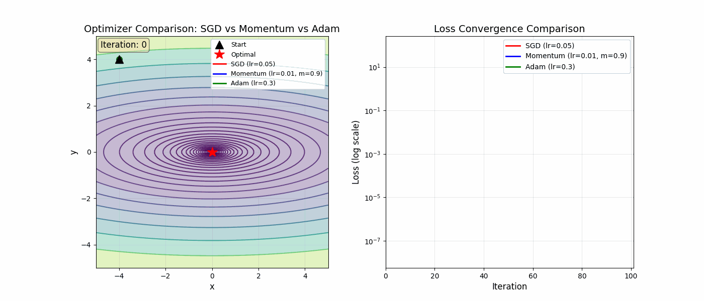

*Comparison of Batch GD, SGD, and Mini-batch GD trajectories on the same loss landscape.*

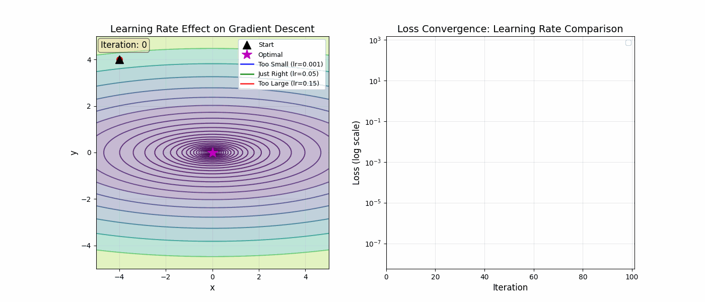

*Effect of different learning rates on convergence behavior.*

### Batch Gradient Descent

::: code-group

```python [Python]
from typing import List, Tuple

def gradient_descent_fit(X: List[List[float]], y: List[float],
                         learning_rate: float = 0.01, max_iters: int = 1000,
                         tolerance: float = 1e-6, regularization: str = None,
                         alpha: float = 0.0) -> Tuple[List[float], float, List[float]]:
    """
    Fit linear regression using batch gradient descent.

    Args:
        X: Feature matrix
        y: Target values
        learning_rate: Step size
        max_iters: Maximum iterations
        tolerance: Convergence threshold
        regularization: None, 'l1', 'l2', or 'elasticnet'
        alpha: Regularization strength

    Returns:
        weights, intercept, loss_history
    """
    n_samples = len(X)
    n_features = len(X[0])

    # Initialize weights
    weights = [0.0] * n_features
    intercept = 0.0
    loss_history = []

    for iteration in range(max_iters):
        # Compute predictions
        predictions = [intercept + sum(w * x for w, x in zip(weights, X[i]))
                       for i in range(n_samples)]

        # Compute errors
        errors = [predictions[i] - y[i] for i in range(n_samples)]

        # Compute loss
        mse = sum(e ** 2 for e in errors) / (2 * n_samples)
        reg_loss = 0
        if regularization == 'l2':
            reg_loss = alpha * sum(w ** 2 for w in weights) / 2
        elif regularization == 'l1':
            reg_loss = alpha * sum(abs(w) for w in weights)
        loss_history.append(mse + reg_loss)

        # Compute gradients
        grad_weights = [0.0] * n_features
        for j in range(n_features):
            grad_weights[j] = sum(errors[i] * X[i][j] for i in range(n_samples)) / n_samples

            # Add regularization gradient
            if regularization == 'l2':
                grad_weights[j] += alpha * weights[j]
            elif regularization == 'l1':
                grad_weights[j] += alpha * (1 if weights[j] > 0 else -1 if weights[j] < 0 else 0)

        grad_intercept = sum(errors) / n_samples

        # Update weights
        weights_old = weights[:]
        for j in range(n_features):
            weights[j] -= learning_rate * grad_weights[j]
        intercept -= learning_rate * grad_intercept

        # Check convergence
        max_change = max(abs(weights[j] - weights_old[j]) for j in range(n_features))
        if max_change < tolerance:
            break

    return weights, intercept, loss_history
```

```python [NumPy]
import numpy as np

def gradient_descent_fit(X, y, learning_rate=0.01, max_iters=1000,
                         tolerance=1e-6, regularization=None, alpha=0.0):
    """
    Fit linear regression using batch gradient descent.

    Args:
        X: Feature matrix, shape (n_samples, n_features)
        y: Target values, shape (n_samples,)
        learning_rate: Step size
        max_iters: Maximum iterations
        tolerance: Convergence threshold
        regularization: None, 'l1', 'l2', or 'elasticnet'
        alpha: Regularization strength

    Returns:
        weights, intercept, loss_history
    """
    X = np.array(X, dtype=np.float64)
    y = np.array(y, dtype=np.float64)
    n_samples, n_features = X.shape

    # Initialize
    weights = np.zeros(n_features)
    intercept = 0.0
    loss_history = []

    for iteration in range(max_iters):
        # Compute predictions and errors
        predictions = X @ weights + intercept
        errors = predictions - y

        # Compute loss
        mse = np.sum(errors ** 2) / (2 * n_samples)
        reg_loss = 0
        if regularization == 'l2':
            reg_loss = alpha * np.sum(weights ** 2) / 2
        elif regularization == 'l1':
            reg_loss = alpha * np.sum(np.abs(weights))
        loss_history.append(mse + reg_loss)

        # Compute gradients
        grad_weights = (X.T @ errors) / n_samples

        # Add regularization gradient
        if regularization == 'l2':
            grad_weights += alpha * weights
        elif regularization == 'l1':
            grad_weights += alpha * np.sign(weights)

        grad_intercept = np.mean(errors)

        # Update
        weights_old = weights.copy()
        weights -= learning_rate * grad_weights
        intercept -= learning_rate * grad_intercept

        # Check convergence
        if np.max(np.abs(weights - weights_old)) < tolerance:
            break

    return weights, intercept, loss_history
```

:::

### Stochastic Gradient Descent (SGD)

::: code-group

```python [Python]
import random
from typing import List, Tuple

def sgd_fit(X: List[List[float]], y: List[float],
            learning_rate: float = 0.01, max_epochs: int = 100,
            regularization: str = None, alpha: float = 0.0,
            random_state: int = None) -> Tuple[List[float], float]:
    """
    Fit using Stochastic Gradient Descent (one sample at a time).
    """
    if random_state is not None:
        random.seed(random_state)

    n_samples = len(X)
    n_features = len(X[0])

    weights = [0.0] * n_features
    intercept = 0.0

    for epoch in range(max_epochs):
        # Shuffle indices
        indices = list(range(n_samples))
        random.shuffle(indices)

        for i in indices:
            # Compute prediction for single sample
            pred = intercept + sum(w * x for w, x in zip(weights, X[i]))
            error = pred - y[i]

            # Update weights
            for j in range(n_features):
                grad = error * X[i][j]
                if regularization == 'l2':
                    grad += alpha * weights[j]
                elif regularization == 'l1':
                    grad += alpha * (1 if weights[j] > 0 else -1 if weights[j] < 0 else 0)
                weights[j] -= learning_rate * grad

            intercept -= learning_rate * error

    return weights, intercept
```

```python [NumPy]
import numpy as np

def sgd_fit(X, y, learning_rate=0.01, max_epochs=100,
            regularization=None, alpha=0.0, random_state=None):
    """
    Fit using Stochastic Gradient Descent (one sample at a time).
    """
    if random_state is not None:
        np.random.seed(random_state)

    X = np.array(X, dtype=np.float64)
    y = np.array(y, dtype=np.float64)
    n_samples, n_features = X.shape

    weights = np.zeros(n_features)
    intercept = 0.0

    for epoch in range(max_epochs):
        # Shuffle indices
        indices = np.random.permutation(n_samples)

        for i in indices:
            # Compute prediction for single sample
            pred = X[i] @ weights + intercept
            error = pred - y[i]

            # Compute gradient
            grad = error * X[i]
            if regularization == 'l2':
                grad += alpha * weights
            elif regularization == 'l1':
                grad += alpha * np.sign(weights)

            # Update
            weights -= learning_rate * grad
            intercept -= learning_rate * error

    return weights, intercept
```

:::

### Mini-Batch Gradient Descent

::: code-group

```python [Python]
import random
from typing import List, Tuple

def minibatch_gd_fit(X: List[List[float]], y: List[float],
                     learning_rate: float = 0.01, batch_size: int = 32,
                     max_epochs: int = 100, regularization: str = None,
                     alpha: float = 0.0) -> Tuple[List[float], float]:
    """
    Fit using Mini-Batch Gradient Descent.
    """
    n_samples = len(X)
    n_features = len(X[0])

    weights = [0.0] * n_features
    intercept = 0.0

    for epoch in range(max_epochs):
        indices = list(range(n_samples))
        random.shuffle(indices)

        for start in range(0, n_samples, batch_size):
            end = min(start + batch_size, n_samples)
            batch_indices = indices[start:end]
            batch_size_actual = len(batch_indices)

            # Compute batch gradients
            grad_weights = [0.0] * n_features
            grad_intercept = 0.0

            for i in batch_indices:
                pred = intercept + sum(w * x for w, x in zip(weights, X[i]))
                error = pred - y[i]

                for j in range(n_features):
                    grad_weights[j] += error * X[i][j]
                grad_intercept += error

            # Average gradients
            for j in range(n_features):
                grad_weights[j] /= batch_size_actual
                if regularization == 'l2':
                    grad_weights[j] += alpha * weights[j]
            grad_intercept /= batch_size_actual

            # Update
            for j in range(n_features):
                weights[j] -= learning_rate * grad_weights[j]
            intercept -= learning_rate * grad_intercept

    return weights, intercept
```

```python [NumPy]
import numpy as np

def minibatch_gd_fit(X, y, learning_rate=0.01, batch_size=32,
                     max_epochs=100, regularization=None, alpha=0.0):
    """
    Fit using Mini-Batch Gradient Descent.
    """
    X = np.array(X, dtype=np.float64)
    y = np.array(y, dtype=np.float64)
    n_samples, n_features = X.shape

    weights = np.zeros(n_features)
    intercept = 0.0

    for epoch in range(max_epochs):
        indices = np.random.permutation(n_samples)

        for start in range(0, n_samples, batch_size):
            end = min(start + batch_size, n_samples)
            batch_idx = indices[start:end]

            X_batch = X[batch_idx]
            y_batch = y[batch_idx]

            # Compute predictions and errors
            predictions = X_batch @ weights + intercept
            errors = predictions - y_batch

            # Compute gradients
            grad_weights = (X_batch.T @ errors) / len(batch_idx)
            if regularization == 'l2':
                grad_weights += alpha * weights

            grad_intercept = np.mean(errors)

            # Update
            weights -= learning_rate * grad_weights
            intercept -= learning_rate * grad_intercept

    return weights, intercept
```

:::

---

## Regularization Comparison

### Ridge vs Lasso Constraint Regions

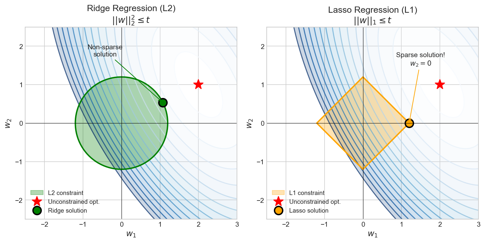

The constraint regions explain why L1 (Lasso) promotes sparsity while L2 (Ridge) only shrinks weights:
- **L2 (circle)**: Contours typically intersect the smooth boundary, yielding non-zero weights
- **L1 (diamond)**: Contours often hit corners where some weights are exactly zero

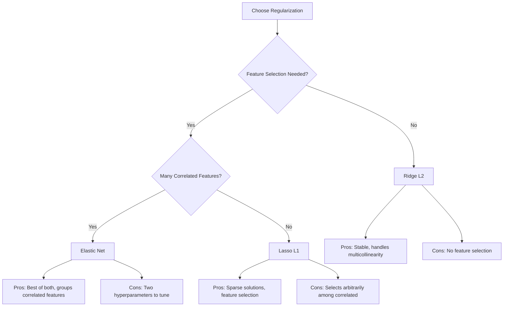

### Comparison Table

| Method | Penalty | Sparsity | Multicollinearity | Use Case |
|--------|---------|----------|-------------------|----------|
| **OLS** | None | No | Unstable | Low-dim, well-conditioned |
| **Ridge** | $\lambda\|w\|_2^2$ | No | Handles well | Many features, all relevant |
| **Lasso** | $\lambda\|w\|_1$ | Yes | Picks one | Feature selection needed |
| **Elastic Net** | Both | Yes | Groups | Correlated features + sparsity |

---

## Algorithm Selection Decision Tree

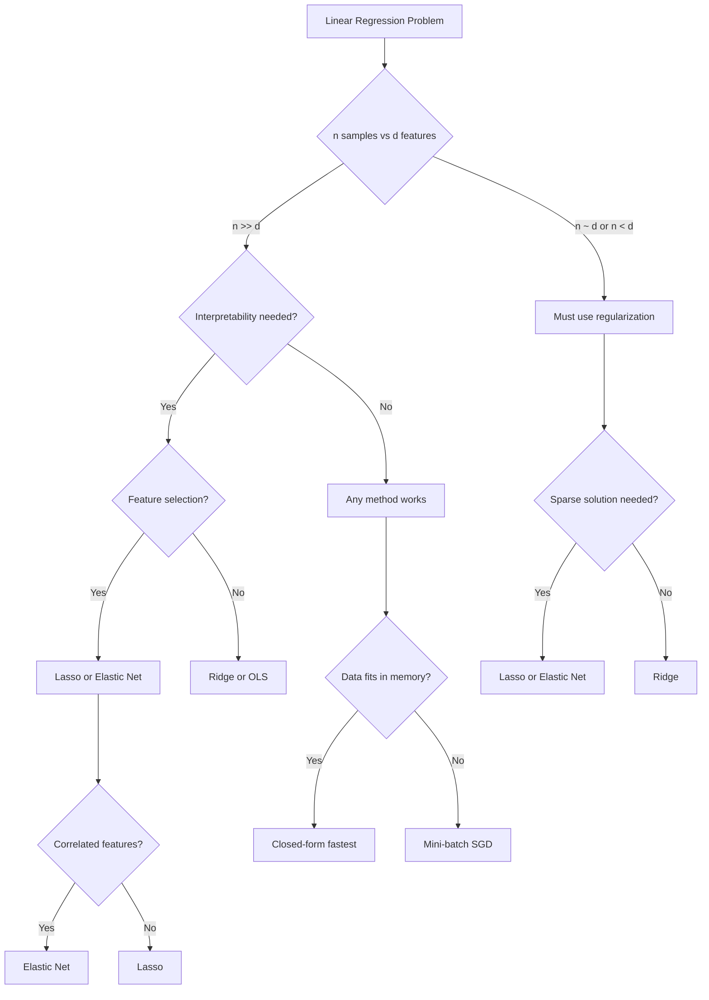

---

## Walkthrough Example

```python
import numpy as np

# Generate sample data
np.random.seed(42)
n_samples, n_features = 100, 5
X = np.random.randn(n_samples, n_features)
true_weights = np.array([1.5, -2.0, 0.0, 0.0, 3.0])  # Sparse
y = X @ true_weights + np.random.randn(n_samples) * 0.5

# Fit different models
ols_w, ols_b = linear_regression_fit(X, y)
ridge_w, ridge_b = ridge_regression_fit(X, y, alpha=1.0)
lasso_w, lasso_b = lasso_regression_fit(X, y, alpha=0.1)
enet_w, enet_b = elastic_net_fit(X, y, alpha=0.1, l1_ratio=0.5)

print("True weights:  ", true_weights)
print("OLS weights:   ", np.round(ols_w, 3))
print("Ridge weights: ", np.round(ridge_w, 3))
print("Lasso weights: ", np.round(lasso_w, 3))
print("E-Net weights: ", np.round(enet_w, 3))

# Notice: Lasso and Elastic Net drive small coefficients to exactly 0
```

**Expected Output**:
```
True weights:   [ 1.5 -2.   0.   0.   3. ]
OLS weights:    [ 1.52 -1.98  0.03 -0.01  2.97]
Ridge weights:  [ 1.48 -1.92  0.02 -0.01  2.89]
Lasso weights:  [ 1.45 -1.85  0.    0.    2.82]  # Sparse!
E-Net weights:  [ 1.46 -1.88  0.    0.    2.85]  # Sparse!
```

---

## Complexity Analysis

| Method | Time Complexity | Space Complexity |
|--------|-----------------|------------------|
| **Closed-form (OLS)** | $O(nd^2 + d^3)$ | $O(d^2)$ |
| **Closed-form (Ridge)** | $O(nd^2 + d^3)$ | $O(d^2)$ |
| **Coordinate Descent** | $O(nd \cdot \text{iters})$ | $O(n + d)$ |
| **Batch GD** | $O(nd \cdot \text{iters})$ | $O(n + d)$ |
| **SGD** | $O(d \cdot \text{epochs} \cdot n)$ | $O(d)$ |
| **Mini-batch GD** | $O(bd \cdot \text{iters})$ | $O(b + d)$ |

Where: $n$ = samples, $d$ = features, $b$ = batch size

---

## Residual Analysis

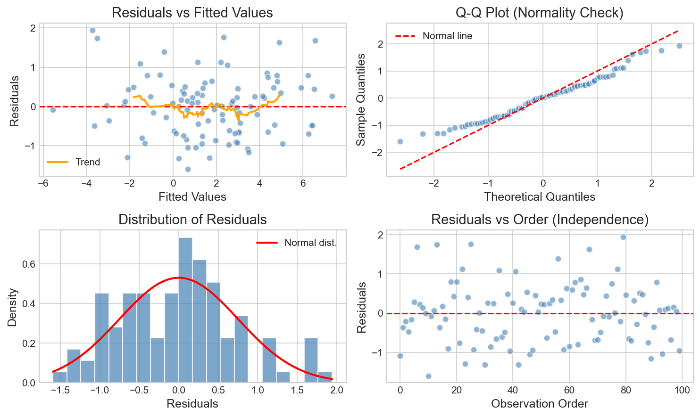

Residual plots validate model assumptions:
- **Residuals vs Fitted**: Should show no pattern (homoscedasticity)
- **Q-Q Plot**: Points on line indicate normally distributed errors
- **Histogram**: Bell curve confirms Gaussian noise assumption
- **Residuals vs Order**: Random scatter indicates independence

---

## Common Interview Pitfalls

::: warning Common Mistakes
1. **Forgetting to standardize features** - Critical for gradient descent and Lasso/Ridge
2. **Not centering data** - Regularization penalizes intercept if not centered
3. **Wrong gradient for L1** - It's a subgradient (sign function), not differentiable at 0
4. **Numerical instability** - Use `np.linalg.lstsq` instead of explicit inverse
5. **Incorrect convergence check** - Check weight change, not just loss
:::

---

## Edge Cases to Handle

```python
def linear_regression_robust(X, y, method='closed', **kwargs):
    """Robust linear regression with edge case handling."""
    X = np.array(X, dtype=np.float64)
    y = np.array(y, dtype=np.float64)

    # Check 1: Empty input
    if len(X) == 0:
        raise ValueError("Empty input array")

    # Check 2: Mismatched dimensions
    if len(X) != len(y):
        raise ValueError(f"X has {len(X)} samples but y has {len(y)}")

    # Check 3: Single sample
    if len(X) == 1:
        raise ValueError("Need at least 2 samples")

    # Check 4: More features than samples (use regularization)
    n_samples, n_features = X.shape
    if n_features >= n_samples and method == 'closed':
        print("Warning: d >= n, switching to Ridge")
        return ridge_regression_fit(X, y, alpha=1.0)

    # Check 5: Constant feature (zero variance)
    variances = np.var(X, axis=0)
    if np.any(variances == 0):
        print("Warning: Removing constant features")
        X = X[:, variances > 0]

    # Proceed with fitting
    if method == 'closed':
        return linear_regression_fit(X, y)
    elif method == 'ridge':
        return ridge_regression_fit(X, y, **kwargs)
    elif method == 'lasso':
        return lasso_regression_fit(X, y, **kwargs)
```

---

## Complete Test Suite

```python
def test_linear_regression():
    """Test suite for linear regression implementations."""
    np.random.seed(42)

    # Test 1: Perfect linear relationship
    X = np.array([[1], [2], [3], [4], [5]], dtype=float)
    y = np.array([2, 4, 6, 8, 10], dtype=float)  # y = 2x
    w, b = linear_regression_fit(X, y)
    assert np.allclose(w, [2.0], atol=0.01), f"Expected [2.0], got {w}"
    assert np.allclose(b, 0.0, atol=0.01), f"Expected 0.0, got {b}"
    print("Test 1 passed: Perfect linear fit")

    # Test 2: With noise
    X = np.random.randn(100, 3)
    true_w = np.array([1.0, -0.5, 2.0])
    y = X @ true_w + 0.5 + np.random.randn(100) * 0.1
    w, b = linear_regression_fit(X, y)
    assert np.allclose(w, true_w, atol=0.2), f"Weights off: {w} vs {true_w}"
    print("Test 2 passed: Noisy data")

    # Test 3: Ridge shrinks weights
    w_ols, _ = linear_regression_fit(X, y)
    w_ridge, _ = ridge_regression_fit(X, y, alpha=10.0)
    assert np.linalg.norm(w_ridge) < np.linalg.norm(w_ols)
    print("Test 3 passed: Ridge shrinks weights")

    # Test 4: Lasso produces sparsity
    X = np.random.randn(100, 10)
    true_w = np.zeros(10)
    true_w[:3] = [1.0, -1.0, 0.5]  # Only 3 non-zero
    y = X @ true_w + np.random.randn(100) * 0.1
    w_lasso, _ = lasso_regression_fit(X, y, alpha=0.1)
    n_nonzero = np.sum(np.abs(w_lasso) > 0.01)
    assert n_nonzero < 10, f"Lasso should produce sparse solution, got {n_nonzero} non-zero"
    print("Test 4 passed: Lasso sparsity")

    # Test 5: Gradient descent converges
    X = np.random.randn(50, 3)
    y = X @ np.array([1, 2, 3]) + np.random.randn(50) * 0.5
    w_gd, b_gd, losses = gradient_descent_fit(X, y, learning_rate=0.1, max_iters=1000)
    assert losses[-1] < losses[0], "Loss should decrease"
    print("Test 5 passed: GD convergence")

    print("\nAll tests passed!")

test_linear_regression()
```

---

## Interview Tips

::: tip Key Points to Mention
1. **Start with clarifying questions** - closed-form vs iterative, regularization needs
2. **Discuss trade-offs** - closed-form is $O(d^3)$ but exact; GD is iterative but scalable
3. **Know when to use each method**:
   - Small data, well-conditioned: Closed-form OLS
   - Large data: Mini-batch SGD
   - Feature selection: Lasso
   - Multicollinearity: Ridge
   - Both: Elastic Net
4. **Always mention feature scaling** - crucial for gradient methods and regularization
5. **Handle edge cases** - show production mindset
6. **Trace through an example** - proves understanding
:::
