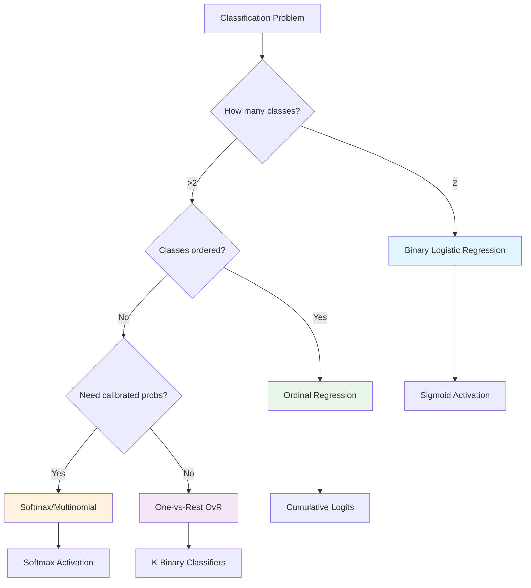
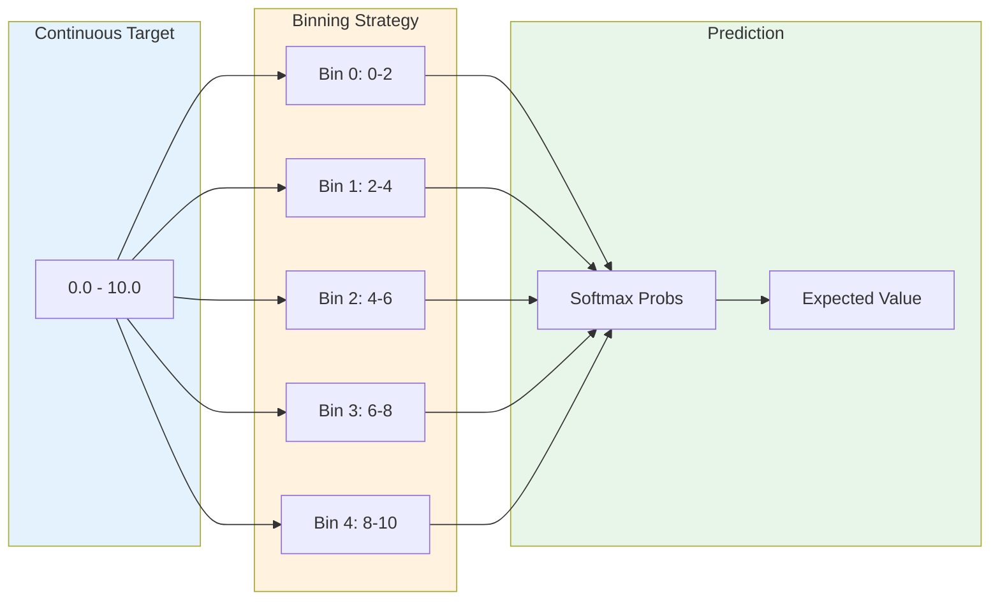
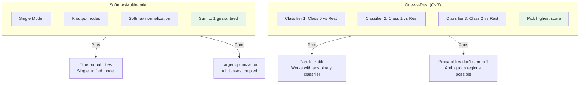
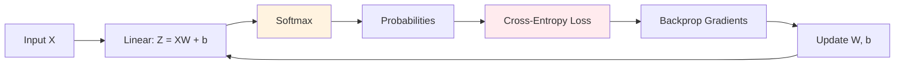

# Implement Logistic Regression Variations

> **From-scratch implementation** of binary, multi-class, ordinal, and regression-style logistic regression

---

## Problem Statement

Implement logistic regression from scratch using gradient descent. Cover variations including:
- Binary classification
- Multi-class (One-vs-Rest and Softmax/Multinomial)
- Ordinal/Tiered classification
- Logistic Regression as Regressor (with binning)

---

## Clarifying Questions to Ask

1. **Binary or multi-class?** (Determines output layer design)
2. **Are classes ordered?** (Ordinal regression vs nominal classification)
3. **Need probability outputs?** (Softmax vs argmax)
4. **Libraries allowed?** (NumPy yes, sklearn no for implementation)
5. **Regularization?** (L1/L2 for feature selection or overfitting prevention)

---

## Algorithm Decision Flow



---

## 1. Binary Logistic Regression

### Mathematical Foundation

The sigmoid function maps linear combinations to probabilities:

$$\sigma(z) = \frac{1}{1 + e^{-z}}$$

Where $z = \mathbf{w}^T\mathbf{x} + b$

**Binary Cross-Entropy Loss:**

$$\mathcal{L} = -\frac{1}{N}\sum_{i=1}^{N}\left[y_i \log(\hat{y}_i) + (1-y_i)\log(1-\hat{y}_i)\right]$$

**Gradients:**

$$\frac{\partial \mathcal{L}}{\partial \mathbf{w}} = \frac{1}{N}\mathbf{X}^T(\hat{\mathbf{y}} - \mathbf{y})$$

$$\frac{\partial \mathcal{L}}{\partial b} = \frac{1}{N}\sum_{i=1}^{N}(\hat{y}_i - y_i)$$

### Implementation

::: code-group

```python [Python]
from typing import List, Tuple
import math

class BinaryLogisticRegression:
    """Binary Logistic Regression with gradient descent."""

    def __init__(self, learning_rate: float = 0.01, n_iterations: int = 1000,
                 regularization: float = 0.0):
        self.lr = learning_rate
        self.n_iterations = n_iterations
        self.reg = regularization  # L2 regularization strength
        self.weights: List[float] = []
        self.bias: float = 0.0
        self.losses: List[float] = []

    def _sigmoid(self, z: float) -> float:
        """Numerically stable sigmoid."""
        if z >= 0:
            return 1 / (1 + math.exp(-z))
        else:
            exp_z = math.exp(z)
            return exp_z / (1 + exp_z)

    def _compute_z(self, x: List[float]) -> float:
        """Compute linear combination."""
        return sum(w * xi for w, xi in zip(self.weights, x)) + self.bias

    def _predict_proba_single(self, x: List[float]) -> float:
        """Predict probability for single sample."""
        z = self._compute_z(x)
        return self._sigmoid(z)

    def fit(self, X: List[List[float]], y: List[int]) -> 'BinaryLogisticRegression':
        """Train model using gradient descent."""
        n_samples = len(X)
        n_features = len(X[0])

        # Initialize weights
        self.weights = [0.0] * n_features
        self.bias = 0.0
        self.losses = []

        for iteration in range(self.n_iterations):
            # Forward pass
            y_pred = [self._predict_proba_single(x) for x in X]

            # Compute loss
            loss = 0.0
            for i in range(n_samples):
                # Clip predictions for numerical stability
                p = max(min(y_pred[i], 1 - 1e-15), 1e-15)
                loss -= y[i] * math.log(p) + (1 - y[i]) * math.log(1 - p)
            loss /= n_samples

            # Add L2 regularization
            if self.reg > 0:
                loss += (self.reg / 2) * sum(w**2 for w in self.weights)
            self.losses.append(loss)

            # Compute gradients
            errors = [y_pred[i] - y[i] for i in range(n_samples)]

            dw = [0.0] * n_features
            for j in range(n_features):
                for i in range(n_samples):
                    dw[j] += errors[i] * X[i][j]
                dw[j] = dw[j] / n_samples + self.reg * self.weights[j]

            db = sum(errors) / n_samples

            # Update parameters
            for j in range(n_features):
                self.weights[j] -= self.lr * dw[j]
            self.bias -= self.lr * db

        return self

    def predict_proba(self, X: List[List[float]]) -> List[float]:
        """Predict probabilities."""
        return [self._predict_proba_single(x) for x in X]

    def predict(self, X: List[List[float]], threshold: float = 0.5) -> List[int]:
        """Predict class labels."""
        probs = self.predict_proba(X)
        return [1 if p >= threshold else 0 for p in probs]
```

```python [NumPy]
import numpy as np

class BinaryLogisticRegression:
    """Binary Logistic Regression with gradient descent."""

    def __init__(self, learning_rate: float = 0.01, n_iterations: int = 1000,
                 regularization: float = 0.0):
        self.lr = learning_rate
        self.n_iterations = n_iterations
        self.reg = regularization  # L2 regularization strength
        self.weights = None
        self.bias = 0.0
        self.losses = []

    def _sigmoid(self, z):
        """Numerically stable sigmoid."""
        return np.where(z >= 0,
                       1 / (1 + np.exp(-z)),
                       np.exp(z) / (1 + np.exp(z)))

    def fit(self, X, y):
        """
        Train model using gradient descent.

        Args:
            X: Training features, shape (n_samples, n_features)
            y: Training labels, shape (n_samples,)
        """
        n_samples, n_features = X.shape

        # Initialize weights
        self.weights = np.zeros(n_features)
        self.bias = 0.0
        self.losses = []

        for iteration in range(self.n_iterations):
            # Forward pass: z = Xw + b
            z = np.dot(X, self.weights) + self.bias
            y_pred = self._sigmoid(z)

            # Compute binary cross-entropy loss
            # Clip predictions for numerical stability
            y_pred_clipped = np.clip(y_pred, 1e-15, 1 - 1e-15)
            loss = -np.mean(y * np.log(y_pred_clipped) +
                           (1 - y) * np.log(1 - y_pred_clipped))

            # Add L2 regularization
            if self.reg > 0:
                loss += (self.reg / 2) * np.sum(self.weights ** 2)
            self.losses.append(loss)

            # Compute gradients
            errors = y_pred - y  # Shape: (n_samples,)
            dw = (1 / n_samples) * np.dot(X.T, errors) + self.reg * self.weights
            db = (1 / n_samples) * np.sum(errors)

            # Update parameters
            self.weights -= self.lr * dw
            self.bias -= self.lr * db

        return self

    def predict_proba(self, X):
        """Predict probabilities, shape (n_samples,)."""
        z = np.dot(X, self.weights) + self.bias
        return self._sigmoid(z)

    def predict(self, X, threshold=0.5):
        """Predict class labels."""
        return (self.predict_proba(X) >= threshold).astype(int)
```

:::

---

## 2. Logistic Regression as Regressor (Binning)

When you need to use logistic regression for continuous output prediction, bin the target into classes.

### Binning Strategy Visualization



### Implementation

::: code-group

```python [Python]
from typing import List, Tuple
import math

class LogisticRegressor:
    """Use logistic regression for continuous output via binning."""

    def __init__(self, n_bins: int = 10, learning_rate: float = 0.01,
                 n_iterations: int = 1000):
        self.n_bins = n_bins
        self.lr = learning_rate
        self.n_iterations = n_iterations
        self.bin_edges: List[float] = []
        self.bin_centers: List[float] = []
        self.classifier = None  # Will hold softmax classifier

    def _create_bins(self, y: List[float]) -> Tuple[List[float], List[float]]:
        """Create equal-width bins from target values."""
        y_min, y_max = min(y), max(y)
        width = (y_max - y_min) / self.n_bins

        edges = [y_min + i * width for i in range(self.n_bins + 1)]
        centers = [(edges[i] + edges[i+1]) / 2 for i in range(self.n_bins)]

        return edges, centers

    def _assign_bins(self, y: List[float]) -> List[int]:
        """Assign continuous values to bin indices."""
        bins = []
        for val in y:
            for i in range(self.n_bins):
                if val <= self.bin_edges[i + 1]:
                    bins.append(i)
                    break
            else:
                bins.append(self.n_bins - 1)  # Edge case: val == max
        return bins

    def _softmax(self, logits: List[List[float]]) -> List[List[float]]:
        """Compute softmax probabilities."""
        probs = []
        for row in logits:
            max_val = max(row)
            exp_row = [math.exp(x - max_val) for x in row]
            sum_exp = sum(exp_row)
            probs.append([e / sum_exp for e in exp_row])
        return probs

    def fit(self, X: List[List[float]], y: List[float]) -> 'LogisticRegressor':
        """Fit by converting to classification problem."""
        # Create bins
        self.bin_edges, self.bin_centers = self._create_bins(y)

        # Convert continuous y to bin labels
        y_binned = self._assign_bins(y)

        # Train softmax classifier (simplified implementation)
        n_samples = len(X)
        n_features = len(X[0])

        # Initialize weights for each class
        self.weights = [[0.0] * n_features for _ in range(self.n_bins)]
        self.biases = [0.0] * self.n_bins

        for _ in range(self.n_iterations):
            # Compute logits
            logits = []
            for x in X:
                row = []
                for k in range(self.n_bins):
                    z = sum(w * xi for w, xi in zip(self.weights[k], x)) + self.biases[k]
                    row.append(z)
                logits.append(row)

            # Softmax
            probs = self._softmax(logits)

            # Gradient descent
            for k in range(self.n_bins):
                dw = [0.0] * n_features
                db = 0.0
                for i in range(n_samples):
                    error = probs[i][k] - (1 if y_binned[i] == k else 0)
                    for j in range(n_features):
                        dw[j] += error * X[i][j]
                    db += error

                for j in range(n_features):
                    self.weights[k][j] -= self.lr * dw[j] / n_samples
                self.biases[k] -= self.lr * db / n_samples

        return self

    def predict(self, X: List[List[float]]) -> List[float]:
        """Predict continuous values using expected value."""
        # Compute logits
        logits = []
        for x in X:
            row = []
            for k in range(self.n_bins):
                z = sum(w * xi for w, xi in zip(self.weights[k], x)) + self.biases[k]
                row.append(z)
            logits.append(row)

        # Softmax
        probs = self._softmax(logits)

        # Expected value: sum(prob * bin_center)
        predictions = []
        for prob_row in probs:
            expected = sum(p * c for p, c in zip(prob_row, self.bin_centers))
            predictions.append(expected)

        return predictions
```

```python [NumPy]
import numpy as np

class LogisticRegressor:
    """Use logistic regression for continuous output via binning."""

    def __init__(self, n_bins: int = 10, learning_rate: float = 0.01,
                 n_iterations: int = 1000):
        self.n_bins = n_bins
        self.lr = learning_rate
        self.n_iterations = n_iterations
        self.bin_edges = None
        self.bin_centers = None
        self.weights = None
        self.biases = None

    def _create_bins(self, y):
        """Create equal-width bins from target values."""
        y_min, y_max = y.min(), y.max()
        edges = np.linspace(y_min, y_max, self.n_bins + 1)
        centers = (edges[:-1] + edges[1:]) / 2
        return edges, centers

    def _assign_bins(self, y):
        """Assign continuous values to bin indices."""
        # np.digitize returns 1-indexed, adjust to 0-indexed
        bins = np.digitize(y, self.bin_edges[1:-1])
        return np.clip(bins, 0, self.n_bins - 1)

    def _softmax(self, logits):
        """Compute softmax probabilities."""
        # Subtract max for numerical stability
        exp_logits = np.exp(logits - np.max(logits, axis=1, keepdims=True))
        return exp_logits / np.sum(exp_logits, axis=1, keepdims=True)

    def fit(self, X, y):
        """
        Fit by converting to classification problem.

        Args:
            X: Features, shape (n_samples, n_features)
            y: Continuous target, shape (n_samples,)
        """
        n_samples, n_features = X.shape

        # Create bins
        self.bin_edges, self.bin_centers = self._create_bins(y)

        # Convert continuous y to bin labels
        y_binned = self._assign_bins(y)

        # One-hot encode labels
        y_onehot = np.eye(self.n_bins)[y_binned]

        # Initialize weights
        self.weights = np.zeros((n_features, self.n_bins))
        self.biases = np.zeros(self.n_bins)

        for _ in range(self.n_iterations):
            # Forward pass
            logits = np.dot(X, self.weights) + self.biases
            probs = self._softmax(logits)

            # Gradients
            errors = probs - y_onehot
            dw = (1 / n_samples) * np.dot(X.T, errors)
            db = (1 / n_samples) * np.sum(errors, axis=0)

            # Update
            self.weights -= self.lr * dw
            self.biases -= self.lr * db

        return self

    def predict(self, X):
        """Predict continuous values using expected value."""
        logits = np.dot(X, self.weights) + self.biases
        probs = self._softmax(logits)

        # Expected value: sum(prob * bin_center)
        return np.dot(probs, self.bin_centers)

    def predict_distribution(self, X):
        """Return full probability distribution over bins."""
        logits = np.dot(X, self.weights) + self.biases
        return self._softmax(logits)
```

:::

---

## 3. Multi-class: One-vs-Rest (OvR)

Train K binary classifiers, each distinguishing one class from all others.

### OvR vs Softmax Comparison



### Implementation

::: code-group

```python [Python]
from typing import List, Dict
import math

class OneVsRestClassifier:
    """Multi-class classification using One-vs-Rest strategy."""

    def __init__(self, learning_rate: float = 0.01, n_iterations: int = 1000):
        self.lr = learning_rate
        self.n_iterations = n_iterations
        self.classifiers: Dict[int, dict] = {}  # class -> {weights, bias}
        self.classes: List[int] = []

    def _sigmoid(self, z: float) -> float:
        """Numerically stable sigmoid."""
        if z >= 0:
            return 1 / (1 + math.exp(-z))
        else:
            exp_z = math.exp(z)
            return exp_z / (1 + exp_z)

    def _train_binary(self, X: List[List[float]], y: List[int],
                      positive_class: int) -> dict:
        """Train binary classifier for one class vs rest."""
        n_samples = len(X)
        n_features = len(X[0])

        # Convert labels: 1 if positive_class, 0 otherwise
        y_binary = [1 if label == positive_class else 0 for label in y]

        weights = [0.0] * n_features
        bias = 0.0

        for _ in range(self.n_iterations):
            # Forward pass
            y_pred = []
            for x in X:
                z = sum(w * xi for w, xi in zip(weights, x)) + bias
                y_pred.append(self._sigmoid(z))

            # Gradients
            dw = [0.0] * n_features
            db = 0.0
            for i in range(n_samples):
                error = y_pred[i] - y_binary[i]
                for j in range(n_features):
                    dw[j] += error * X[i][j]
                db += error

            # Update
            for j in range(n_features):
                weights[j] -= self.lr * dw[j] / n_samples
            bias -= self.lr * db / n_samples

        return {'weights': weights, 'bias': bias}

    def fit(self, X: List[List[float]], y: List[int]) -> 'OneVsRestClassifier':
        """Train K binary classifiers."""
        self.classes = sorted(set(y))

        for cls in self.classes:
            self.classifiers[cls] = self._train_binary(X, y, cls)

        return self

    def predict_proba(self, X: List[List[float]]) -> List[Dict[int, float]]:
        """Predict probabilities for each class."""
        all_probs = []

        for x in X:
            probs = {}
            for cls, clf in self.classifiers.items():
                z = sum(w * xi for w, xi in zip(clf['weights'], x)) + clf['bias']
                probs[cls] = self._sigmoid(z)
            all_probs.append(probs)

        return all_probs

    def predict(self, X: List[List[float]]) -> List[int]:
        """Predict class with highest probability."""
        proba = self.predict_proba(X)
        return [max(p, key=p.get) for p in proba]
```

```python [NumPy]
import numpy as np

class OneVsRestClassifier:
    """Multi-class classification using One-vs-Rest strategy."""

    def __init__(self, learning_rate: float = 0.01, n_iterations: int = 1000):
        self.lr = learning_rate
        self.n_iterations = n_iterations
        self.classifiers = {}  # class -> {weights, bias}
        self.classes = None

    def _sigmoid(self, z):
        """Numerically stable sigmoid."""
        return np.where(z >= 0,
                       1 / (1 + np.exp(-z)),
                       np.exp(z) / (1 + np.exp(z)))

    def _train_binary(self, X, y, positive_class):
        """Train binary classifier for one class vs rest."""
        n_samples, n_features = X.shape

        # Convert labels: 1 if positive_class, 0 otherwise
        y_binary = (y == positive_class).astype(float)

        weights = np.zeros(n_features)
        bias = 0.0

        for _ in range(self.n_iterations):
            # Forward pass
            z = np.dot(X, weights) + bias
            y_pred = self._sigmoid(z)

            # Gradients
            errors = y_pred - y_binary
            dw = (1 / n_samples) * np.dot(X.T, errors)
            db = (1 / n_samples) * np.sum(errors)

            # Update
            weights -= self.lr * dw
            bias -= self.lr * db

        return {'weights': weights, 'bias': bias}

    def fit(self, X, y):
        """
        Train K binary classifiers.

        Args:
            X: Features, shape (n_samples, n_features)
            y: Labels, shape (n_samples,) with values 0 to K-1
        """
        self.classes = np.unique(y)

        for cls in self.classes:
            self.classifiers[cls] = self._train_binary(X, y, cls)

        return self

    def predict_proba(self, X):
        """
        Predict probabilities for each class.

        Returns:
            Shape (n_samples, n_classes) - note: may not sum to 1
        """
        n_samples = X.shape[0]
        n_classes = len(self.classes)
        probs = np.zeros((n_samples, n_classes))

        for i, cls in enumerate(self.classes):
            clf = self.classifiers[cls]
            z = np.dot(X, clf['weights']) + clf['bias']
            probs[:, i] = self._sigmoid(z)

        return probs

    def predict(self, X):
        """Predict class with highest probability."""
        probs = self.predict_proba(X)
        return self.classes[np.argmax(probs, axis=1)]
```

:::

---

## 4. Multi-class: Softmax (Multinomial)

Single model with softmax activation for true multi-class probabilities.

### Mathematical Foundation

**Softmax function:**

$$P(y=k|\mathbf{x}) = \frac{e^{z_k}}{\sum_{j=1}^{K} e^{z_j}}$$

Where $z_k = \mathbf{w}_k^T\mathbf{x} + b_k$

**Cross-Entropy Loss:**

$$\mathcal{L} = -\frac{1}{N}\sum_{i=1}^{N}\sum_{k=1}^{K} y_{ik} \log(\hat{y}_{ik})$$

### Training Pipeline



### Implementation

::: code-group

```python [Python]
from typing import List
import math

class SoftmaxClassifier:
    """Multi-class classification using Softmax/Multinomial regression."""

    def __init__(self, learning_rate: float = 0.01, n_iterations: int = 1000,
                 regularization: float = 0.0):
        self.lr = learning_rate
        self.n_iterations = n_iterations
        self.reg = regularization
        self.weights: List[List[float]] = []  # Shape: (n_features, n_classes)
        self.biases: List[float] = []
        self.n_classes = 0
        self.losses: List[float] = []

    def _softmax(self, logits: List[float]) -> List[float]:
        """Compute softmax for single sample."""
        max_val = max(logits)
        exp_logits = [math.exp(z - max_val) for z in logits]
        sum_exp = sum(exp_logits)
        return [e / sum_exp for e in exp_logits]

    def _softmax_batch(self, logits: List[List[float]]) -> List[List[float]]:
        """Compute softmax for batch."""
        return [self._softmax(row) for row in logits]

    def fit(self, X: List[List[float]], y: List[int]) -> 'SoftmaxClassifier':
        """Train using gradient descent."""
        n_samples = len(X)
        n_features = len(X[0])
        self.n_classes = max(y) + 1

        # Initialize weights
        self.weights = [[0.0] * self.n_classes for _ in range(n_features)]
        self.biases = [0.0] * self.n_classes
        self.losses = []

        # One-hot encode labels
        y_onehot = [[1.0 if j == y[i] else 0.0 for j in range(self.n_classes)]
                    for i in range(n_samples)]

        for iteration in range(self.n_iterations):
            # Forward pass
            logits = []
            for x in X:
                row = []
                for k in range(self.n_classes):
                    z = sum(self.weights[j][k] * x[j] for j in range(n_features))
                    z += self.biases[k]
                    row.append(z)
                logits.append(row)

            probs = self._softmax_batch(logits)

            # Compute cross-entropy loss
            loss = 0.0
            for i in range(n_samples):
                for k in range(self.n_classes):
                    if y_onehot[i][k] > 0:
                        loss -= math.log(max(probs[i][k], 1e-15))
            loss /= n_samples

            # Add L2 regularization
            if self.reg > 0:
                for j in range(n_features):
                    for k in range(self.n_classes):
                        loss += (self.reg / 2) * self.weights[j][k] ** 2
            self.losses.append(loss)

            # Compute gradients
            # dL/dW = X^T @ (probs - y_onehot) / n_samples
            errors = [[probs[i][k] - y_onehot[i][k]
                      for k in range(self.n_classes)]
                      for i in range(n_samples)]

            # Update weights
            for j in range(n_features):
                for k in range(self.n_classes):
                    grad = sum(errors[i][k] * X[i][j] for i in range(n_samples))
                    grad = grad / n_samples + self.reg * self.weights[j][k]
                    self.weights[j][k] -= self.lr * grad

            # Update biases
            for k in range(self.n_classes):
                grad = sum(errors[i][k] for i in range(n_samples)) / n_samples
                self.biases[k] -= self.lr * grad

        return self

    def predict_proba(self, X: List[List[float]]) -> List[List[float]]:
        """Predict probability distribution over classes."""
        n_features = len(X[0])
        logits = []

        for x in X:
            row = []
            for k in range(self.n_classes):
                z = sum(self.weights[j][k] * x[j] for j in range(n_features))
                z += self.biases[k]
                row.append(z)
            logits.append(row)

        return self._softmax_batch(logits)

    def predict(self, X: List[List[float]]) -> List[int]:
        """Predict class labels."""
        probs = self.predict_proba(X)
        return [row.index(max(row)) for row in probs]
```

```python [NumPy]
import numpy as np

class SoftmaxClassifier:
    """Multi-class classification using Softmax/Multinomial regression."""

    def __init__(self, learning_rate: float = 0.01, n_iterations: int = 1000,
                 regularization: float = 0.0):
        self.lr = learning_rate
        self.n_iterations = n_iterations
        self.reg = regularization
        self.weights = None  # Shape: (n_features, n_classes)
        self.biases = None   # Shape: (n_classes,)
        self.n_classes = 0
        self.losses = []

    def _softmax(self, logits):
        """Compute softmax probabilities."""
        # Subtract max for numerical stability
        exp_logits = np.exp(logits - np.max(logits, axis=1, keepdims=True))
        return exp_logits / np.sum(exp_logits, axis=1, keepdims=True)

    def fit(self, X, y):
        """
        Train using gradient descent.

        Args:
            X: Features, shape (n_samples, n_features)
            y: Labels, shape (n_samples,) with values 0 to K-1
        """
        n_samples, n_features = X.shape
        self.n_classes = len(np.unique(y))

        # Initialize weights
        self.weights = np.zeros((n_features, self.n_classes))
        self.biases = np.zeros(self.n_classes)
        self.losses = []

        # One-hot encode labels
        y_onehot = np.eye(self.n_classes)[y]

        for iteration in range(self.n_iterations):
            # Forward pass: logits = XW + b
            logits = np.dot(X, self.weights) + self.biases
            probs = self._softmax(logits)

            # Compute cross-entropy loss
            # Only count loss where y_onehot = 1
            log_probs = np.log(np.clip(probs, 1e-15, 1.0))
            loss = -np.mean(np.sum(y_onehot * log_probs, axis=1))

            # Add L2 regularization
            if self.reg > 0:
                loss += (self.reg / 2) * np.sum(self.weights ** 2)
            self.losses.append(loss)

            # Compute gradients
            errors = probs - y_onehot  # Shape: (n_samples, n_classes)
            dw = (1 / n_samples) * np.dot(X.T, errors) + self.reg * self.weights
            db = (1 / n_samples) * np.sum(errors, axis=0)

            # Update parameters
            self.weights -= self.lr * dw
            self.biases -= self.lr * db

        return self

    def predict_proba(self, X):
        """Predict probability distribution over classes."""
        logits = np.dot(X, self.weights) + self.biases
        return self._softmax(logits)

    def predict(self, X):
        """Predict class labels."""
        probs = self.predict_proba(X)
        return np.argmax(probs, axis=1)
```

:::

---

## 5. Ordinal/Tiered Classification

For ordered classes (e.g., ratings 1-5, severity levels), use cumulative logits.

### Mathematical Foundation

**Proportional Odds Model:**

$$P(y \leq k | \mathbf{x}) = \sigma(\theta_k - \mathbf{w}^T\mathbf{x})$$

Where $\theta_1 < \theta_2 < ... < \theta_{K-1}$ are ordered thresholds.

**Individual class probabilities:**

$$P(y = k) = P(y \leq k) - P(y \leq k-1)$$

### Implementation

::: code-group

```python [Python]
from typing import List
import math

class OrdinalClassifier:
    """Ordinal regression using cumulative link model."""

    def __init__(self, learning_rate: float = 0.01, n_iterations: int = 1000):
        self.lr = learning_rate
        self.n_iterations = n_iterations
        self.weights: List[float] = []
        self.thresholds: List[float] = []  # K-1 thresholds for K classes
        self.n_classes = 0

    def _sigmoid(self, z: float) -> float:
        """Numerically stable sigmoid."""
        if z >= 0:
            return 1 / (1 + math.exp(-z))
        else:
            exp_z = math.exp(z)
            return exp_z / (1 + exp_z)

    def _cumulative_probs(self, x: List[float]) -> List[float]:
        """Compute P(y <= k) for each k."""
        # Linear combination (shared across all thresholds)
        linear = sum(w * xi for w, xi in zip(self.weights, x))

        cum_probs = []
        for threshold in self.thresholds:
            prob = self._sigmoid(threshold - linear)
            cum_probs.append(prob)
        cum_probs.append(1.0)  # P(y <= K-1) = 1

        return cum_probs

    def _class_probs(self, cum_probs: List[float]) -> List[float]:
        """Convert cumulative to class probabilities."""
        probs = [cum_probs[0]]  # P(y = 0) = P(y <= 0)
        for k in range(1, len(cum_probs)):
            prob = cum_probs[k] - cum_probs[k-1]
            probs.append(max(prob, 1e-15))  # Numerical stability
        return probs

    def fit(self, X: List[List[float]], y: List[int]) -> 'OrdinalClassifier':
        """Train ordinal classifier."""
        n_samples = len(X)
        n_features = len(X[0])
        self.n_classes = max(y) + 1

        # Initialize weights and thresholds
        self.weights = [0.0] * n_features
        # Initialize thresholds as evenly spaced
        self.thresholds = [float(i) for i in range(self.n_classes - 1)]

        for iteration in range(self.n_iterations):
            # Compute gradients
            dw = [0.0] * n_features
            dtheta = [0.0] * (self.n_classes - 1)

            for i in range(n_samples):
                cum_probs = self._cumulative_probs(X[i])
                class_probs = self._class_probs(cum_probs)

                linear = sum(w * xi for w, xi in zip(self.weights, X[i]))

                # Gradient computation using chain rule
                for k in range(self.n_classes - 1):
                    # P(y <= k) contribution
                    p_cum = cum_probs[k]

                    # Gradient of sigmoid
                    sigmoid_grad = p_cum * (1 - p_cum)

                    # Indicator for target class
                    if y[i] <= k:
                        factor = -1 / max(p_cum, 1e-15)
                    else:
                        factor = 1 / max(1 - p_cum, 1e-15)

                    grad = factor * sigmoid_grad

                    # Update threshold gradient
                    dtheta[k] += grad

                    # Update weight gradient (negative because of -w^Tx)
                    for j in range(n_features):
                        dw[j] -= grad * X[i][j]

            # Update parameters
            for j in range(n_features):
                self.weights[j] -= self.lr * dw[j] / n_samples

            for k in range(self.n_classes - 1):
                self.thresholds[k] -= self.lr * dtheta[k] / n_samples

            # Ensure thresholds remain ordered
            for k in range(1, self.n_classes - 1):
                if self.thresholds[k] <= self.thresholds[k-1]:
                    self.thresholds[k] = self.thresholds[k-1] + 0.01

        return self

    def predict_proba(self, X: List[List[float]]) -> List[List[float]]:
        """Predict probability distribution over ordered classes."""
        all_probs = []
        for x in X:
            cum_probs = self._cumulative_probs(x)
            class_probs = self._class_probs(cum_probs)
            all_probs.append(class_probs)
        return all_probs

    def predict(self, X: List[List[float]]) -> List[int]:
        """Predict class labels."""
        probs = self.predict_proba(X)
        return [row.index(max(row)) for row in probs]
```

```python [NumPy]
import numpy as np

class OrdinalClassifier:
    """Ordinal regression using cumulative link model."""

    def __init__(self, learning_rate: float = 0.01, n_iterations: int = 1000):
        self.lr = learning_rate
        self.n_iterations = n_iterations
        self.weights = None
        self.thresholds = None  # K-1 thresholds for K classes
        self.n_classes = 0

    def _sigmoid(self, z):
        """Numerically stable sigmoid."""
        return np.where(z >= 0,
                       1 / (1 + np.exp(-z)),
                       np.exp(z) / (1 + np.exp(z)))

    def _cumulative_probs(self, X):
        """
        Compute P(y <= k) for each k.

        Returns:
            Shape (n_samples, n_classes) where last column is all 1s
        """
        n_samples = X.shape[0]
        linear = np.dot(X, self.weights)  # Shape: (n_samples,)

        # Compute cumulative probabilities for each threshold
        cum_probs = np.zeros((n_samples, self.n_classes))

        for k, threshold in enumerate(self.thresholds):
            cum_probs[:, k] = self._sigmoid(threshold - linear)

        cum_probs[:, -1] = 1.0  # P(y <= K-1) = 1

        return cum_probs

    def _class_probs(self, cum_probs):
        """Convert cumulative to class probabilities."""
        probs = np.zeros_like(cum_probs)
        probs[:, 0] = cum_probs[:, 0]
        probs[:, 1:] = cum_probs[:, 1:] - cum_probs[:, :-1]
        return np.clip(probs, 1e-15, 1.0)

    def fit(self, X, y):
        """
        Train ordinal classifier.

        Args:
            X: Features, shape (n_samples, n_features)
            y: Ordinal labels, shape (n_samples,) with values 0 to K-1
        """
        n_samples, n_features = X.shape
        self.n_classes = len(np.unique(y))

        # Initialize weights and thresholds
        self.weights = np.zeros(n_features)
        self.thresholds = np.linspace(-1, 1, self.n_classes - 1)

        for iteration in range(self.n_iterations):
            cum_probs = self._cumulative_probs(X)
            linear = np.dot(X, self.weights)

            # Gradient computation
            dw = np.zeros(n_features)
            dtheta = np.zeros(self.n_classes - 1)

            for k in range(self.n_classes - 1):
                p_cum = cum_probs[:, k]
                sigmoid_grad = p_cum * (1 - p_cum)

                # Indicator for y <= k
                indicator = (y <= k).astype(float)

                # Gradient factor
                factor = np.where(indicator == 1,
                                 -1 / np.maximum(p_cum, 1e-15),
                                 1 / np.maximum(1 - p_cum, 1e-15))

                grad = factor * sigmoid_grad

                # Accumulate gradients
                dtheta[k] = np.sum(grad)
                dw -= np.dot(X.T, grad)

            # Update parameters
            self.weights -= self.lr * dw / n_samples
            self.thresholds -= self.lr * dtheta / n_samples

            # Ensure thresholds remain ordered
            self.thresholds = np.sort(self.thresholds)

        return self

    def predict_proba(self, X):
        """Predict probability distribution over ordered classes."""
        cum_probs = self._cumulative_probs(X)
        return self._class_probs(cum_probs)

    def predict(self, X):
        """Predict class labels."""
        probs = self.predict_proba(X)
        return np.argmax(probs, axis=1)
```

:::

---

## Visualizations

### Sigmoid vs Softmax Comparison


### OvR Decision Boundaries


### Binning for Regression


### Multi-class Probability Surfaces


---

## Comparison Table

| Variation | Use Case | Output | Probabilities |
|-----------|----------|--------|---------------|
| **Binary** | 2 classes | Single sigmoid | Sum to 1 (implicit) |
| **OvR** | Many classes, parallelizable | K binary scores | May not sum to 1 |
| **Softmax** | True multi-class probs | K-way softmax | Always sum to 1 |
| **Ordinal** | Ordered classes | Cumulative logits | Respects ordering |
| **Regressor** | Continuous target | Binned softmax | Expected value |

---

## Complexity Analysis

| Operation | Time | Space |
|-----------|------|-------|
| Binary forward | $O(n \cdot d)$ | $O(n)$ |
| Binary gradient | $O(n \cdot d)$ | $O(d)$ |
| Softmax forward | $O(n \cdot d \cdot K)$ | $O(n \cdot K)$ |
| OvR training | $O(K \cdot n \cdot d \cdot T)$ | $O(K \cdot d)$ |

Where: $n$ = samples, $d$ = features, $K$ = classes, $T$ = iterations

---

## Interview Tips

### When to Use Each Variation

| Scenario | Recommended Approach |
|----------|---------------------|
| Simple yes/no classification | Binary logistic regression |
| Multi-class with calibrated probabilities | Softmax/Multinomial |
| Multi-class, speed matters, can parallelize | One-vs-Rest |
| Ratings, severity levels, rankings | Ordinal regression |
| Need continuous output but have classification tools | Binning approach |

### Key Points to Mention

1. **Sigmoid vs Softmax**
   - Sigmoid: independent binary outputs
   - Softmax: normalized probabilities that sum to 1

2. **Gradient derivation**
   - Know that gradient is `X^T @ (y_pred - y_true)` for both binary and softmax
   - Mention this elegant form comes from properties of sigmoid/softmax

3. **Numerical stability**
   - Clip probabilities to avoid log(0)
   - Subtract max in softmax before exp()
   - Use stable sigmoid formulation

4. **Regularization**
   - L2 prevents overfitting, encourages smaller weights
   - L1 encourages sparsity (feature selection)

5. **OvR vs Softmax trade-offs**
   - OvR: simpler, parallelizable, but inconsistent probabilities
   - Softmax: unified model, consistent probabilities, but larger optimization

---

## Complete Test Suite

```python
import numpy as np

def test_all_classifiers():
    """Test all logistic regression variations."""
    np.random.seed(42)

    # Generate synthetic data
    n_samples = 200
    n_features = 5
    n_classes = 3

    X = np.random.randn(n_samples, n_features)
    y = np.random.randint(0, n_classes, n_samples)

    # Split
    X_train, X_test = X[:150], X[150:]
    y_train, y_test = y[:150], y[150:]

    # Test 1: Binary Classifier
    y_binary_train = (y_train >= 1).astype(int)
    y_binary_test = (y_test >= 1).astype(int)

    binary_clf = BinaryLogisticRegression(learning_rate=0.1, n_iterations=500)
    binary_clf.fit(X_train, y_binary_train)
    binary_acc = np.mean(binary_clf.predict(X_test) == y_binary_test)
    print(f"Binary Accuracy: {binary_acc:.2%}")

    # Test 2: Softmax Classifier
    softmax_clf = SoftmaxClassifier(learning_rate=0.1, n_iterations=500)
    softmax_clf.fit(X_train, y_train)
    softmax_acc = np.mean(softmax_clf.predict(X_test) == y_test)
    print(f"Softmax Accuracy: {softmax_acc:.2%}")

    # Test 3: OvR Classifier
    ovr_clf = OneVsRestClassifier(learning_rate=0.1, n_iterations=500)
    ovr_clf.fit(X_train, y_train)
    ovr_acc = np.mean(ovr_clf.predict(X_test) == y_test)
    print(f"OvR Accuracy: {ovr_acc:.2%}")

    # Verify probabilities sum to 1 for softmax
    probs = softmax_clf.predict_proba(X_test)
    assert np.allclose(np.sum(probs, axis=1), 1.0), "Softmax probs should sum to 1"
    print("Softmax probabilities sum to 1: PASSED")

    print("\nAll tests passed!")

# Run tests
test_all_classifiers()
```

---

## Quick Reference

```python
# Binary Logistic Regression
clf = BinaryLogisticRegression(learning_rate=0.01, n_iterations=1000)
clf.fit(X_train, y_train)
predictions = clf.predict(X_test)
probabilities = clf.predict_proba(X_test)

# Softmax Multi-class
clf = SoftmaxClassifier(learning_rate=0.01, n_iterations=1000)
clf.fit(X_train, y_train)  # y in {0, 1, ..., K-1}
predictions = clf.predict(X_test)
probs = clf.predict_proba(X_test)  # Shape: (n_samples, K)

# One-vs-Rest
clf = OneVsRestClassifier(learning_rate=0.01, n_iterations=1000)
clf.fit(X_train, y_train)
predictions = clf.predict(X_test)

# Ordinal Regression
clf = OrdinalClassifier(learning_rate=0.01, n_iterations=1000)
clf.fit(X_train, y_train)  # y is ordered: 0 < 1 < 2 < ...
predictions = clf.predict(X_test)

# Logistic as Regressor
reg = LogisticRegressor(n_bins=10, learning_rate=0.01)
reg.fit(X_train, y_continuous)
predictions = reg.predict(X_test)  # Continuous output
```
