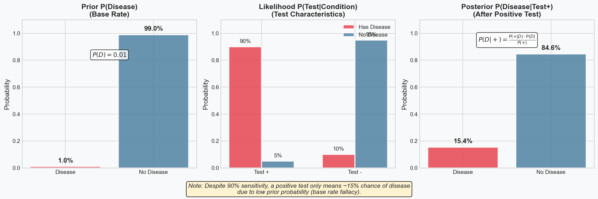
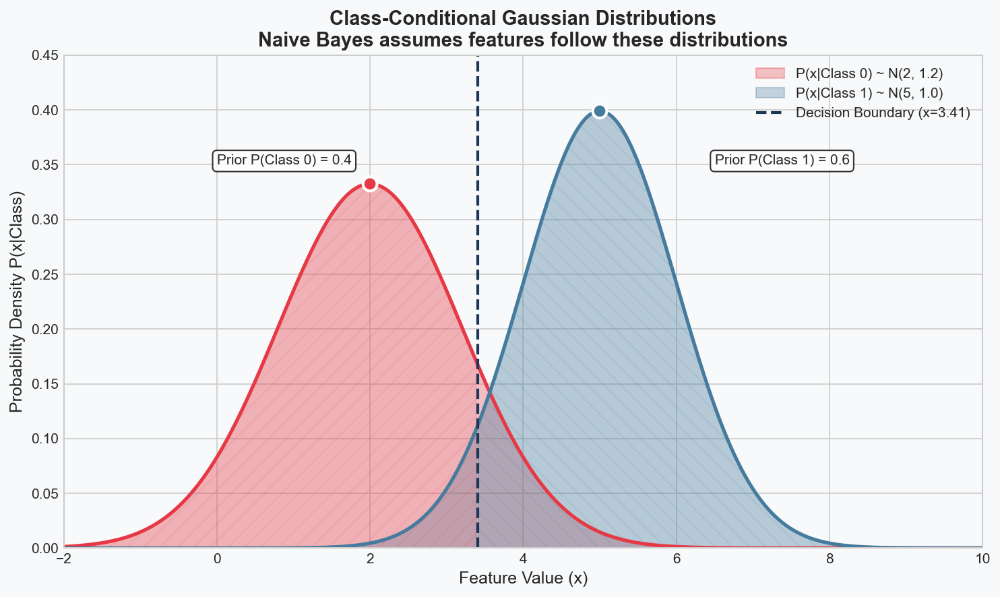
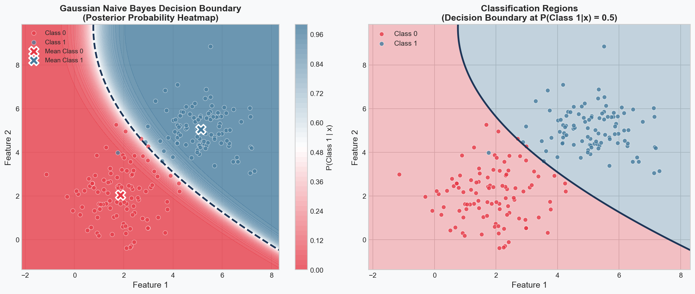
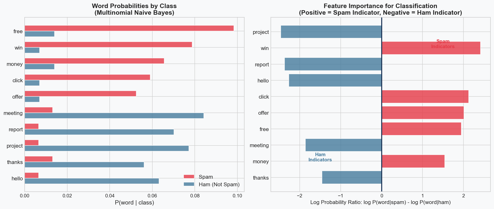

# Naive Bayes Implementation

> **Probabilistic classifier based on Bayes theorem**

Naive Bayes classifiers apply Bayes' theorem with strong (naive) independence assumptions between features.

## Bayes Theorem Review

$$P(y|X) = \frac{P(X|y) \cdot P(y)}{P(X)}$$

For classification: $\hat{y} = \arg\max_y P(X|y) \cdot P(y)$



## The Naive Independence Assumption

$$P(X|y) = \prod_{i=1}^{n} P(x_i|y)$$

This simplification makes computation tractable despite the strong assumption.

## Class-Conditional Distributions



## Log Probabilities for Numerical Stability

$$\log P(y|X) \propto \log P(y) + \sum_{i=1}^{n} \log P(x_i|y)$$

```python
import numpy as np
from collections import defaultdict
from typing import Dict, List, Tuple, Optional
import re


class BaseNaiveBayes:
    """Base class for Naive Bayes classifiers."""

    def __init__(self):
        self.classes_ = None
        self.class_prior_ = None  # P(y) for each class
        self.class_count_ = None  # Count of samples per class

    def _compute_class_prior(self, y: np.ndarray) -> None:
        """Compute prior probabilities P(y) for each class."""
        self.classes_, self.class_count_ = np.unique(y, return_counts=True)
        self.class_prior_ = self.class_count_ / len(y)

    def _log_prior(self) -> np.ndarray:
        """Return log of class prior probabilities."""
        return np.log(self.class_prior_)

    def predict(self, X: np.ndarray) -> np.ndarray:
        """Predict class labels for samples in X."""
        log_posteriors = self._joint_log_likelihood(X)
        return self.classes_[np.argmax(log_posteriors, axis=1)]

    def predict_proba(self, X: np.ndarray) -> np.ndarray:
        """Return probability estimates for samples in X."""
        log_posteriors = self._joint_log_likelihood(X)
        # Convert log probabilities to probabilities using log-sum-exp trick
        log_prob_max = np.max(log_posteriors, axis=1, keepdims=True)
        log_posteriors_shifted = log_posteriors - log_prob_max
        posteriors = np.exp(log_posteriors_shifted)
        posteriors /= posteriors.sum(axis=1, keepdims=True)
        return posteriors

    def _joint_log_likelihood(self, X: np.ndarray) -> np.ndarray:
        """Compute joint log likelihood P(X, y) for each class."""
        raise NotImplementedError("Subclasses must implement this method")


# =============================================================================
# Gaussian Naive Bayes - For Continuous Features
# =============================================================================
# Assumes P(x_i|y) ~ N(mu, sigma^2) - see gaussian_class_conditional.png

class GaussianNaiveBayes(BaseNaiveBayes):
    """
    Gaussian Naive Bayes for continuous features.
    P(x_i|y) = (1 / sqrt(2*pi*sigma^2)) * exp(-(x_i - mu)^2 / (2*sigma^2))
    """

    def __init__(self, var_smoothing: float = 1e-9):
        super().__init__()
        self.var_smoothing = var_smoothing
        self.theta_ = None  # Mean of each feature per class
        self.var_ = None    # Variance of each feature per class
        self.epsilon_ = None  # Smoothing value

    def fit(self, X: np.ndarray, y: np.ndarray) -> 'GaussianNaiveBayes':
        """
        Fit Gaussian Naive Bayes according to X, y.

        Parameters
        ----------
        X : array-like of shape (n_samples, n_features)
            Training vectors.
        y : array-like of shape (n_samples,)
            Target values.
        """
        X = np.asarray(X)
        y = np.asarray(y)

        self._compute_class_prior(y)
        n_features = X.shape[1]
        n_classes = len(self.classes_)

        # Initialize mean and variance arrays
        self.theta_ = np.zeros((n_classes, n_features))
        self.var_ = np.zeros((n_classes, n_features))

        # Compute mean and variance for each class
        for idx, c in enumerate(self.classes_):
            X_c = X[y == c]
            self.theta_[idx, :] = X_c.mean(axis=0)
            self.var_[idx, :] = X_c.var(axis=0)

        # Add smoothing to variance for numerical stability
        self.epsilon_ = self.var_smoothing * np.max(self.var_)
        self.var_ += self.epsilon_

        return self

    def _joint_log_likelihood(self, X: np.ndarray) -> np.ndarray:
        """
        Compute joint log likelihood using Gaussian distribution.

        log P(x_i|y) = -0.5 * (log(2*pi*var) + (x - mu)^2 / var)
        """
        X = np.asarray(X)
        joint_log_likelihood = []

        for idx in range(len(self.classes_)):
            # Log prior
            log_prior = np.log(self.class_prior_[idx])

            # Gaussian log likelihood for each feature
            # -0.5 * sum(log(2*pi*var) + (x - mu)^2 / var)
            mean = self.theta_[idx]
            var = self.var_[idx]

            log_likelihood = -0.5 * np.sum(
                np.log(2 * np.pi * var) + ((X - mean) ** 2) / var,
                axis=1
            )

            joint_log_likelihood.append(log_prior + log_likelihood)

        return np.array(joint_log_likelihood).T


# =============================================================================
# Multinomial Naive Bayes - For Count Data / Text Classification
# =============================================================================
# For word counts/TF-IDF - see multinomial_word_probs.png for feature importance

class MultinomialNaiveBayes(BaseNaiveBayes):
    """
    Multinomial Naive Bayes for discrete count features (text classification).
    P(x_i|y) = (N_yi + alpha) / (N_y + alpha * n_features)
    """

    def __init__(self, alpha: float = 1.0):
        super().__init__()
        self.alpha = alpha
        self.feature_count_ = None  # Count of each feature per class
        self.feature_log_prob_ = None  # Log P(x_i|y)

    def fit(self, X: np.ndarray, y: np.ndarray) -> 'MultinomialNaiveBayes':
        """
        Fit Multinomial Naive Bayes according to X, y.

        Parameters
        ----------
        X : array-like of shape (n_samples, n_features)
            Training vectors (counts or frequencies).
        y : array-like of shape (n_samples,)
            Target values.
        """
        X = np.asarray(X)
        y = np.asarray(y)

        if np.any(X < 0):
            raise ValueError("Input X must be non-negative")

        self._compute_class_prior(y)
        n_features = X.shape[1]
        n_classes = len(self.classes_)

        # Count features per class
        self.feature_count_ = np.zeros((n_classes, n_features))

        for idx, c in enumerate(self.classes_):
            X_c = X[y == c]
            self.feature_count_[idx, :] = X_c.sum(axis=0)

        # Compute log probabilities with Laplace smoothing
        # P(x_i|y) = (count(x_i, y) + alpha) / (sum(counts in y) + alpha * n_features)
        smoothed_counts = self.feature_count_ + self.alpha
        smoothed_totals = smoothed_counts.sum(axis=1, keepdims=True)
        self.feature_log_prob_ = np.log(smoothed_counts / smoothed_totals)

        return self

    def _joint_log_likelihood(self, X: np.ndarray) -> np.ndarray:
        """
        Compute joint log likelihood for Multinomial NB.

        log P(X|y) = sum(x_i * log P(x_i|y))
        """
        X = np.asarray(X)
        # For each sample, compute: log P(y) + sum(x_i * log P(x_i|y))
        return self._log_prior() + X @ self.feature_log_prob_.T


# =============================================================================
# Bernoulli Naive Bayes - For Binary Features
# =============================================================================
# Models presence/absence of features (e.g., word occurrence in documents)

class BernoulliNaiveBayes(BaseNaiveBayes):
    """
    Bernoulli Naive Bayes for binary features.
    P(x_i|y) = P(x_i=1|y)^x_i * (1 - P(x_i=1|y))^(1-x_i)
    """

    def __init__(self, alpha: float = 1.0, binarize: float = 0.0):
        super().__init__()
        self.alpha = alpha
        self.binarize = binarize
        self.feature_prob_ = None  # P(x_i=1|y)
        self.feature_log_prob_ = None  # log P(x_i=1|y)
        self.feature_log_neg_prob_ = None  # log (1 - P(x_i=1|y))

    def _binarize_features(self, X: np.ndarray) -> np.ndarray:
        """Binarize features if threshold is set."""
        if self.binarize is not None:
            return (X > self.binarize).astype(np.float64)
        return X

    def fit(self, X: np.ndarray, y: np.ndarray) -> 'BernoulliNaiveBayes':
        """
        Fit Bernoulli Naive Bayes according to X, y.

        Parameters
        ----------
        X : array-like of shape (n_samples, n_features)
            Training vectors (binary or to be binarized).
        y : array-like of shape (n_samples,)
            Target values.
        """
        X = np.asarray(X)
        y = np.asarray(y)
        X = self._binarize_features(X)

        self._compute_class_prior(y)
        n_features = X.shape[1]
        n_classes = len(self.classes_)

        # Count feature occurrences per class
        feature_count = np.zeros((n_classes, n_features))

        for idx, c in enumerate(self.classes_):
            X_c = X[y == c]
            feature_count[idx, :] = X_c.sum(axis=0)

        # Compute probabilities with Laplace smoothing
        # P(x_i=1|y) = (count(x_i=1, y) + alpha) / (N_y + 2*alpha)
        smoothed_counts = feature_count + self.alpha
        smoothed_totals = self.class_count_.reshape(-1, 1) + 2 * self.alpha
        self.feature_prob_ = smoothed_counts / smoothed_totals

        # Precompute log probabilities
        self.feature_log_prob_ = np.log(self.feature_prob_)
        self.feature_log_neg_prob_ = np.log(1 - self.feature_prob_)

        return self

    def _joint_log_likelihood(self, X: np.ndarray) -> np.ndarray:
        """
        Compute joint log likelihood for Bernoulli NB.

        log P(X|y) = sum(x_i * log P(x_i=1|y) + (1-x_i) * log(1-P(x_i=1|y)))
        """
        X = np.asarray(X)
        X = self._binarize_features(X)

        # Bernoulli likelihood considers both presence (x=1) and absence (x=0)
        # log P(X|y) = X @ log(P) + (1-X) @ log(1-P)
        #            = X @ (log(P) - log(1-P)) + sum(log(1-P))

        log_odds = self.feature_log_prob_ - self.feature_log_neg_prob_
        neg_prob_sum = self.feature_log_neg_prob_.sum(axis=1)

        return self._log_prior() + X @ log_odds.T + neg_prob_sum


# =============================================================================
# Text Vectorizer for Text Classification
# =============================================================================

class SimpleCountVectorizer:
    """
    Simple count vectorizer for text classification.

    Converts text documents to a matrix of token counts.

    Parameters
    ----------
    lowercase : bool, default=True
        Convert text to lowercase.
    min_df : int, default=1
        Minimum document frequency for a token to be included.
    max_df : float, default=1.0
        Maximum document frequency (as proportion) for a token.
    """

    def __init__(self, lowercase: bool = True, min_df: int = 1,
                 max_df: float = 1.0):
        self.lowercase = lowercase
        self.min_df = min_df
        self.max_df = max_df
        self.vocabulary_ = {}
        self.feature_names_ = []

    def _tokenize(self, text: str) -> List[str]:
        """Simple tokenization by splitting on non-alphanumeric."""
        if self.lowercase:
            text = text.lower()
        # Simple tokenization: split on non-alphanumeric characters
        tokens = re.findall(r'\b[a-zA-Z]+\b', text)
        return tokens

    def fit(self, documents: List[str]) -> 'SimpleCountVectorizer':
        """
        Learn vocabulary from documents.

        Parameters
        ----------
        documents : list of str
            List of text documents.
        """
        n_docs = len(documents)
        doc_freq = defaultdict(int)

        # Count document frequency for each token
        for doc in documents:
            tokens = set(self._tokenize(doc))
            for token in tokens:
                doc_freq[token] += 1

        # Filter by min_df and max_df
        max_doc_count = self.max_df * n_docs if self.max_df <= 1.0 else self.max_df

        self.vocabulary_ = {}
        self.feature_names_ = []

        for token, count in sorted(doc_freq.items()):
            if count >= self.min_df and count <= max_doc_count:
                self.vocabulary_[token] = len(self.vocabulary_)
                self.feature_names_.append(token)

        return self

    def transform(self, documents: List[str]) -> np.ndarray:
        """
        Transform documents to count matrix.

        Parameters
        ----------
        documents : list of str
            List of text documents.

        Returns
        -------
        X : ndarray of shape (n_documents, n_features)
            Document-term matrix.
        """
        X = np.zeros((len(documents), len(self.vocabulary_)))

        for doc_idx, doc in enumerate(documents):
            tokens = self._tokenize(doc)
            for token in tokens:
                if token in self.vocabulary_:
                    X[doc_idx, self.vocabulary_[token]] += 1

        return X

    def fit_transform(self, documents: List[str]) -> np.ndarray:
        """Fit and transform in one step."""
        self.fit(documents)
        return self.transform(documents)


# =============================================================================
# Demonstration and Testing
# =============================================================================

def demo_gaussian_nb():
    """Demonstrate Gaussian Naive Bayes on continuous data."""
    print("=" * 60)
    print("Gaussian Naive Bayes Demo")
    print("=" * 60)

    # Generate synthetic data: two classes with different means
    np.random.seed(42)

    # Class 0: centered at (0, 0)
    X0 = np.random.randn(100, 2) * 1.5 + np.array([0, 0])
    # Class 1: centered at (3, 3)
    X1 = np.random.randn(100, 2) * 1.5 + np.array([3, 3])

    X = np.vstack([X0, X1])
    y = np.array([0] * 100 + [1] * 100)

    # Shuffle data
    indices = np.random.permutation(len(y))
    X, y = X[indices], y[indices]

    # Split into train/test
    X_train, X_test = X[:160], X[160:]
    y_train, y_test = y[:160], y[160:]

    # Train and evaluate
    gnb = GaussianNaiveBayes()
    gnb.fit(X_train, y_train)

    predictions = gnb.predict(X_test)
    accuracy = np.mean(predictions == y_test)

    print(f"\nTraining samples: {len(X_train)}")
    print(f"Test samples: {len(X_test)}")
    print(f"Accuracy: {accuracy:.2%}")

    print("\nLearned parameters:")
    for idx, c in enumerate(gnb.classes_):
        print(f"  Class {c}:")
        print(f"    Prior: {gnb.class_prior_[idx]:.3f}")
        print(f"    Mean: {gnb.theta_[idx]}")
        print(f"    Variance: {gnb.var_[idx]}")

    # Show probability estimates for a few samples
    print("\nProbability estimates for first 5 test samples:")
    probs = gnb.predict_proba(X_test[:5])
    for i in range(5):
        print(f"  Sample {i}: P(class=0)={probs[i,0]:.3f}, "
              f"P(class=1)={probs[i,1]:.3f}, Predicted: {predictions[i]}")


def demo_multinomial_nb():
    """Demonstrate Multinomial Naive Bayes on count data."""
    print("\n" + "=" * 60)
    print("Multinomial Naive Bayes Demo (Text Classification)")
    print("=" * 60)

    # Sample documents for sentiment classification
    train_docs = [
        "I love this movie it is great",
        "This film is wonderful and amazing",
        "Excellent movie highly recommend",
        "Best film I have ever seen fantastic",
        "I hate this movie it is terrible",
        "This film is awful and boring",
        "Worst movie ever do not watch",
        "Terrible film waste of time horrible",
        "Great acting and wonderful story",
        "Bad plot and terrible acting",
    ]
    train_labels = np.array([1, 1, 1, 1, 0, 0, 0, 0, 1, 0])  # 1=positive, 0=negative

    test_docs = [
        "I really love this wonderful film",
        "This movie is terrible and boring",
        "Amazing story great acting",
    ]
    test_labels = np.array([1, 0, 1])

    # Vectorize text
    vectorizer = SimpleCountVectorizer()
    X_train = vectorizer.fit_transform(train_docs)
    X_test = vectorizer.transform(test_docs)

    print(f"\nVocabulary size: {len(vectorizer.vocabulary_)}")
    print(f"Vocabulary: {vectorizer.feature_names_[:20]}...")

    # Train Multinomial NB
    mnb = MultinomialNaiveBayes(alpha=1.0)  # Laplace smoothing
    mnb.fit(X_train, train_labels)

    predictions = mnb.predict(X_test)
    accuracy = np.mean(predictions == test_labels)

    print(f"\nTest Accuracy: {accuracy:.2%}")

    print("\nPredictions:")
    for doc, pred, actual in zip(test_docs, predictions, test_labels):
        sentiment = "Positive" if pred == 1 else "Negative"
        correct = "correct" if pred == actual else "wrong"
        print(f'  "{doc[:40]}..." -> {sentiment} ({correct})')

    # Show top features per class
    print("\nTop features by log probability:")
    for idx, c in enumerate(mnb.classes_):
        top_indices = np.argsort(mnb.feature_log_prob_[idx])[-5:][::-1]
        top_features = [vectorizer.feature_names_[i] for i in top_indices]
        label = "Positive" if c == 1 else "Negative"
        print(f"  {label}: {top_features}")


def demo_bernoulli_nb():
    """Demonstrate Bernoulli Naive Bayes on binary data."""
    print("\n" + "=" * 60)
    print("Bernoulli Naive Bayes Demo (Binary Features)")
    print("=" * 60)

    # Binary feature data (e.g., presence/absence of symptoms)
    # Features: [fever, cough, fatigue, headache, body_ache]
    X_train = np.array([
        [1, 1, 1, 0, 1],  # Flu
        [1, 1, 1, 1, 1],  # Flu
        [1, 0, 1, 1, 1],  # Flu
        [0, 1, 0, 0, 0],  # Cold
        [0, 1, 1, 0, 0],  # Cold
        [0, 1, 0, 1, 0],  # Cold
        [1, 1, 0, 1, 1],  # Flu
        [0, 0, 1, 0, 0],  # Cold
    ])
    y_train = np.array([1, 1, 1, 0, 0, 0, 1, 0])  # 1=Flu, 0=Cold

    X_test = np.array([
        [1, 1, 1, 1, 0],  # Should be Flu
        [0, 1, 0, 0, 0],  # Should be Cold
    ])
    y_test = np.array([1, 0])

    feature_names = ['fever', 'cough', 'fatigue', 'headache', 'body_ache']

    # Train Bernoulli NB
    bnb = BernoulliNaiveBayes(alpha=1.0)
    bnb.fit(X_train, y_train)

    predictions = bnb.predict(X_test)
    probabilities = bnb.predict_proba(X_test)

    print("\nFeature probabilities P(feature=1|class):")
    for idx, c in enumerate(bnb.classes_):
        label = "Flu" if c == 1 else "Cold"
        print(f"  {label}:")
        for feat_idx, feat_name in enumerate(feature_names):
            print(f"    {feat_name}: {bnb.feature_prob_[idx, feat_idx]:.3f}")

    print("\nPredictions:")
    for i, (x, pred, actual) in enumerate(zip(X_test, predictions, y_test)):
        diagnosis = "Flu" if pred == 1 else "Cold"
        correct = "correct" if pred == actual else "wrong"
        symptoms = [feature_names[j] for j in range(len(x)) if x[j] == 1]
        print(f"  Patient {i+1} symptoms: {symptoms}")
        print(f"    Diagnosis: {diagnosis} ({correct})")
        print(f"    P(Cold)={probabilities[i,0]:.3f}, P(Flu)={probabilities[i,1]:.3f}")


def demo_laplace_smoothing():
    """Demonstrate the importance of Laplace smoothing."""
    print("\n" + "=" * 60)
    print("Laplace Smoothing Demonstration")
    print("=" * 60)

    # Training data where one word never appears with one class
    train_docs = [
        "good great excellent",
        "good wonderful amazing",
        "bad terrible awful",
        "bad horrible worst",
    ]
    train_labels = np.array([1, 1, 0, 0])

    # Test document contains "good" which never appears in negative class
    test_docs = ["good bad mixed"]

    vectorizer = SimpleCountVectorizer()
    X_train = vectorizer.fit_transform(train_docs)
    X_test = vectorizer.transform(test_docs)

    print("\nVocabulary:", vectorizer.feature_names_)

    # Without smoothing (alpha=0) - will have issues
    print("\nWithout Laplace smoothing (alpha=0):")
    mnb_no_smooth = MultinomialNaiveBayes(alpha=1e-10)  # Very small
    mnb_no_smooth.fit(X_train, train_labels)

    # Find "good" feature index
    good_idx = vectorizer.vocabulary_.get('good', -1)
    if good_idx >= 0:
        print(f"  log P('good'|negative) = {mnb_no_smooth.feature_log_prob_[0, good_idx]:.2f}")
        print("  (Very negative log prob because 'good' never appears in negative)")

    # With smoothing (alpha=1)
    print("\nWith Laplace smoothing (alpha=1):")
    mnb_smooth = MultinomialNaiveBayes(alpha=1.0)
    mnb_smooth.fit(X_train, train_labels)

    if good_idx >= 0:
        print(f"  log P('good'|negative) = {mnb_smooth.feature_log_prob_[0, good_idx]:.2f}")
        print("  (Reasonable log prob with smoothing)")

    # Compare predictions
    pred_no_smooth = mnb_no_smooth.predict(X_test)
    pred_smooth = mnb_smooth.predict(X_test)

    print(f"\nPrediction without smoothing: {'Positive' if pred_no_smooth[0]==1 else 'Negative'}")
    print(f"Prediction with smoothing: {'Positive' if pred_smooth[0]==1 else 'Negative'}")


def demo_spam_classification():
    """Complete spam classification example."""
    print("\n" + "=" * 60)
    print("Spam Classification Example")
    print("=" * 60)

    # Training emails
    train_emails = [
        "Get rich quick! Buy now! Limited offer!",
        "Congratulations you won free money click here",
        "Viagra cheap pills discount sale",
        "Free casino bonus win big jackpot",
        "Meeting tomorrow at 3pm please confirm",
        "Can you review the attached document",
        "Lunch today? Let me know your schedule",
        "Project deadline extended to next week",
        "Your order has been shipped tracking number",
        "Please find the quarterly report attached",
        "Win free iPhone click link now hurry",
        "Cheap watches replica designer brands",
        "Team meeting notes from yesterday",
        "Happy birthday! Hope you have a great day",
    ]

    # 1 = spam, 0 = not spam (ham)
    train_labels = np.array([1, 1, 1, 1, 0, 0, 0, 0, 0, 0, 1, 1, 0, 0])

    test_emails = [
        "Free money waiting for you click now",
        "Can we reschedule our meeting to Thursday",
        "Cheap discount offer buy now limited time",
        "Thanks for your help with the presentation",
    ]
    test_labels = np.array([1, 0, 1, 0])

    # Vectorize
    vectorizer = SimpleCountVectorizer(min_df=1)
    X_train = vectorizer.fit_transform(train_emails)
    X_test = vectorizer.transform(test_emails)

    print(f"\nDataset: {len(train_emails)} training, {len(test_emails)} test")
    print(f"Features (words): {len(vectorizer.vocabulary_)}")

    # Train classifier
    spam_classifier = MultinomialNaiveBayes(alpha=1.0)
    spam_classifier.fit(X_train, train_labels)

    # Evaluate
    predictions = spam_classifier.predict(X_test)
    probabilities = spam_classifier.predict_proba(X_test)
    accuracy = np.mean(predictions == test_labels)

    print(f"Test Accuracy: {accuracy:.2%}")

    print("\nClassification Results:")
    for email, pred, prob, actual in zip(test_emails, predictions, probabilities, test_labels):
        label = "SPAM" if pred == 1 else "HAM"
        correct = "correct" if pred == actual else "wrong"
        confidence = prob[pred] * 100
        print(f'\n  "{email[:45]}..."')
        print(f"    Classification: {label} ({confidence:.1f}% confidence) - {correct}")

    # Most indicative words
    print("\nMost indicative words:")
    log_prob_diff = spam_classifier.feature_log_prob_[1] - spam_classifier.feature_log_prob_[0]

    spam_indices = np.argsort(log_prob_diff)[-5:][::-1]
    ham_indices = np.argsort(log_prob_diff)[:5]

    spam_words = [vectorizer.feature_names_[i] for i in spam_indices]
    ham_words = [vectorizer.feature_names_[i] for i in ham_indices]

    print(f"  Spam indicators: {spam_words}")
    print(f"  Ham indicators: {ham_words}")


def compare_nb_variants():
    """Compare different Naive Bayes variants on the same data."""
    print("\n" + "=" * 60)
    print("Comparing Naive Bayes Variants")
    print("=" * 60)

    # Create dataset that can be used with all variants
    np.random.seed(123)

    # Generate continuous data
    n_samples = 200
    n_features = 5

    X_continuous = np.random.randn(n_samples, n_features)
    # Make class 1 have higher values
    y = (X_continuous.sum(axis=1) > 0).astype(int)

    # Create count version (non-negative integers)
    X_counts = np.abs(X_continuous * 10).astype(int)

    # Create binary version
    X_binary = (X_continuous > 0).astype(int)

    # Split data
    train_idx = np.random.choice(n_samples, int(0.8 * n_samples), replace=False)
    test_idx = np.array([i for i in range(n_samples) if i not in train_idx])

    results = []

    # Gaussian NB on continuous data
    gnb = GaussianNaiveBayes()
    gnb.fit(X_continuous[train_idx], y[train_idx])
    gnb_acc = np.mean(gnb.predict(X_continuous[test_idx]) == y[test_idx])
    results.append(("Gaussian NB (continuous)", gnb_acc))

    # Multinomial NB on count data
    mnb = MultinomialNaiveBayes(alpha=1.0)
    mnb.fit(X_counts[train_idx], y[train_idx])
    mnb_acc = np.mean(mnb.predict(X_counts[test_idx]) == y[test_idx])
    results.append(("Multinomial NB (counts)", mnb_acc))

    # Bernoulli NB on binary data
    bnb = BernoulliNaiveBayes(alpha=1.0)
    bnb.fit(X_binary[train_idx], y[train_idx])
    bnb_acc = np.mean(bnb.predict(X_binary[test_idx]) == y[test_idx])
    results.append(("Bernoulli NB (binary)", bnb_acc))

    print("\nResults on synthetic dataset:")
    print("-" * 40)
    for name, acc in results:
        print(f"  {name}: {acc:.2%}")

    print("\nNote: Each variant is best suited for its data type:")
    print("  - Gaussian: Continuous real-valued features")
    print("  - Multinomial: Discrete counts (e.g., word frequencies)")
    print("  - Bernoulli: Binary features (presence/absence)")


if __name__ == "__main__":
    # Run all demonstrations
    demo_gaussian_nb()
    demo_multinomial_nb()
    demo_bernoulli_nb()
    demo_laplace_smoothing()
    demo_spam_classification()
    compare_nb_variants()

    print("\n" + "=" * 60)
    print("All demonstrations completed!")
    print("=" * 60)
```

## Decision Boundary Visualization



## Multinomial NB for Text Classification



## Key Implementation Details

### 1. Log Probabilities
Use log probabilities to avoid numerical underflow when multiplying small probabilities.

### 2. Laplace Smoothing
Prevents zero probabilities for unseen feature values:

| Variant | Smoothing Formula |
|---------|-------------------|
| Multinomial | Add alpha to all feature counts |
| Bernoulli | Add alpha to numerator, 2*alpha to denominator |
| Gaussian | Add small variance for numerical stability |

### 3. Choosing the Right Variant

| Variant | Use Case | Feature Type |
|---------|----------|--------------|
| Gaussian | Continuous measurements | Real numbers |
| Multinomial | Text classification | Word counts/TF-IDF |
| Bernoulli | Document classification | Binary (word presence) |

### 4. Time Complexity

- **Training**: O(n * d) where n = samples, d = features
- **Prediction**: O(c * d) where c = classes, d = features
