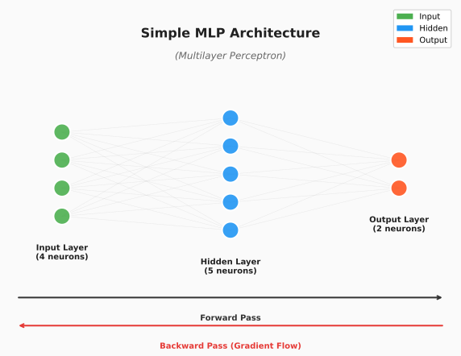
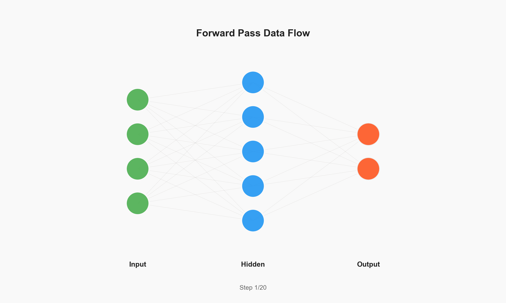
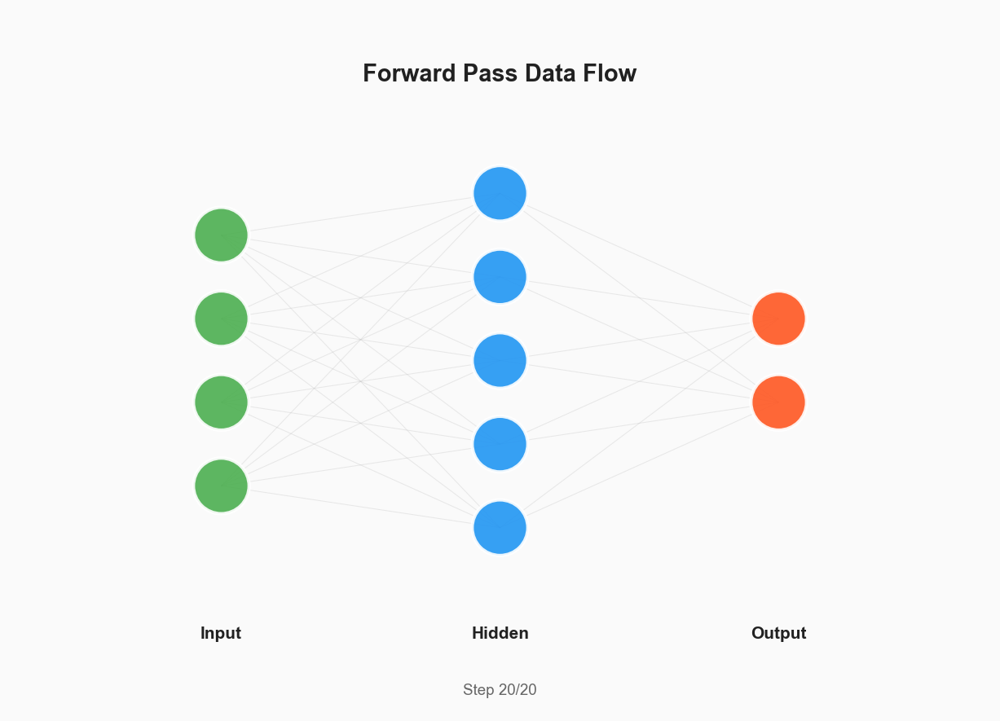
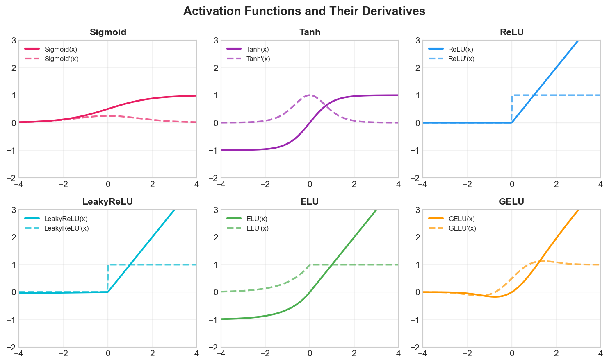
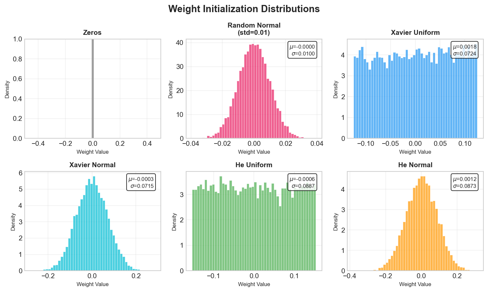
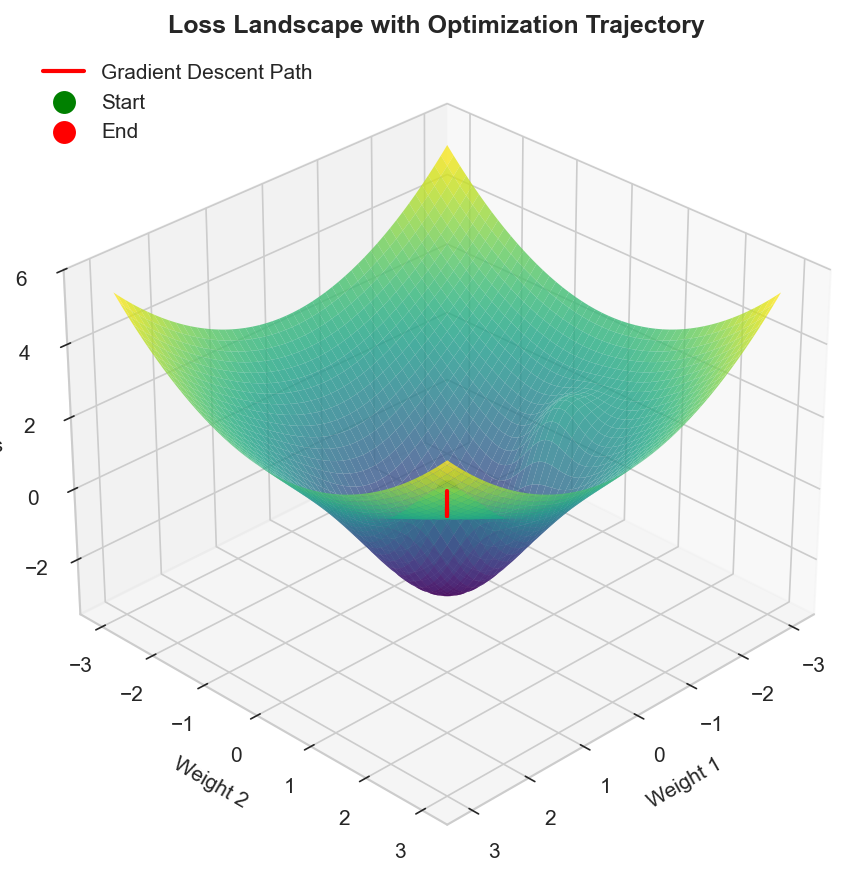
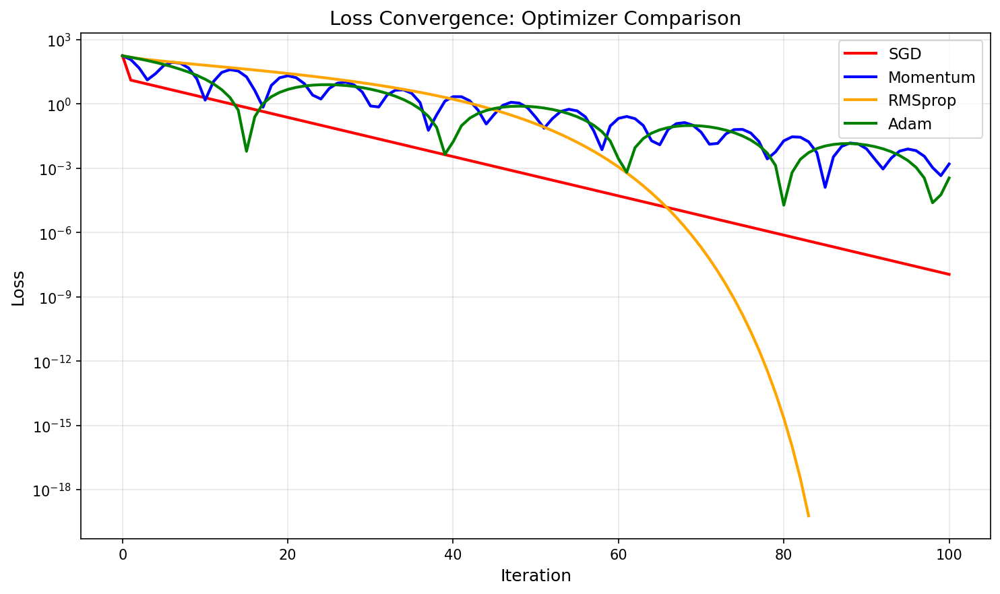
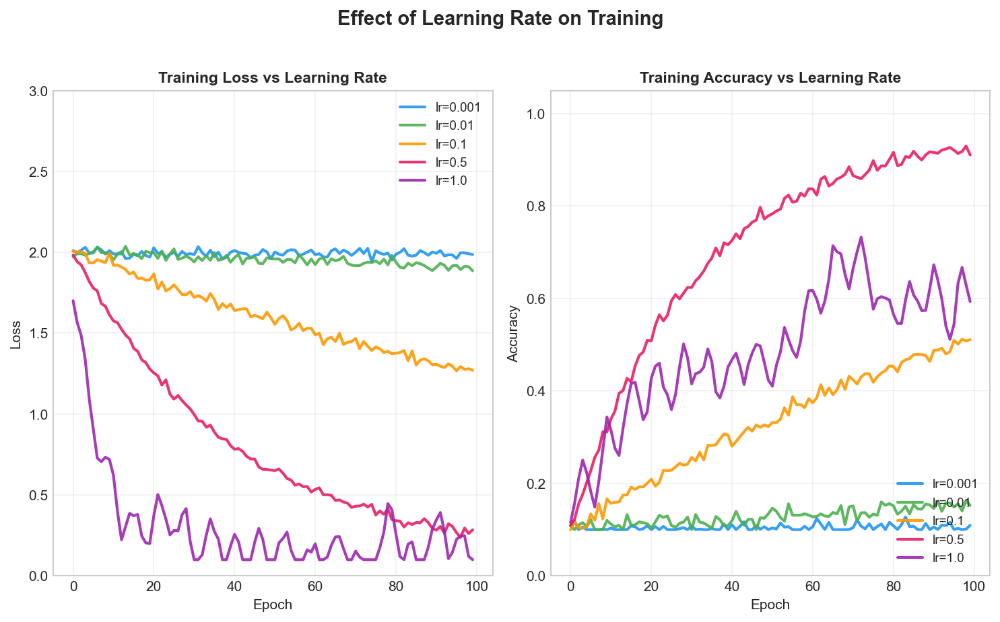
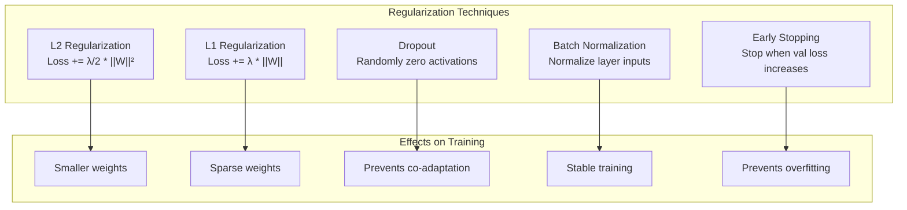

# Neural Network (MLP) Implementation

> **Understand neural networks by building one from scratch**

Multi-Layer Perceptrons (MLPs) are the foundation of deep learning. Understanding how to implement one from scratch - including forward propagation, backpropagation, and gradient descent - is essential for ML interviews at top tech companies.

## Network Architecture Overview



The MLP consists of fully-connected layers where each neuron connects to all neurons in adjacent layers. Data flows forward through linear transformations followed by non-linear activations.

## Mathematical Foundation

### Forward Propagation

For each layer $l$: $z^{[l]} = W^{[l]} \cdot a^{[l-1]} + b^{[l]}$, then $a^{[l]} = g^{[l]}(z^{[l]})$

### Backpropagation

Gradients via chain rule:
- $\frac{\partial L}{\partial W^{[l]}} = \frac{\partial L}{\partial z^{[l]}} \cdot (a^{[l-1]})^T$
- $\frac{\partial L}{\partial a^{[l-1]}} = (W^{[l]})^T \cdot \frac{\partial L}{\partial z^{[l]}}$

### Forward Pass Data Flow



The animation shows data packets flowing through the network layers during forward propagation.



Static diagram showing the complete forward pass architecture with layer transformations.

---

## Activation Functions



The figure shows six common activation functions (Sigmoid, Tanh, ReLU, LeakyReLU, ELU, GELU) with their derivatives. ReLU is most common for hidden layers; softmax for classification outputs.

---

## Complete Implementation from Scratch

```python
import numpy as np
from typing import List, Tuple, Dict, Callable, Optional
import pickle

class ActivationFunction:
    """Collection of activation functions and their derivatives."""

    @staticmethod
    def sigmoid(z: np.ndarray) -> np.ndarray:
        """Sigmoid: σ(z) = 1/(1+e^(-z)), output in (0,1)"""
        z_clipped = np.clip(z, -500, 500)
        return 1 / (1 + np.exp(-z_clipped))

    @staticmethod
    def sigmoid_derivative(a: np.ndarray) -> np.ndarray:
        """σ'(z) = σ(z)*(1-σ(z))"""
        return a * (1 - a)

    @staticmethod
    def relu(z: np.ndarray) -> np.ndarray:
        """ReLU: f(z) = max(0, z)"""
        return np.maximum(0, z)

    @staticmethod
    def relu_derivative(z: np.ndarray) -> np.ndarray:
        """ReLU': 1 if z > 0, else 0"""
        return (z > 0).astype(float)

    @staticmethod
    def leaky_relu(z: np.ndarray, alpha: float = 0.01) -> np.ndarray:
        """Leaky ReLU: z if z > 0, else alpha*z"""
        return np.where(z > 0, z, alpha * z)

    @staticmethod
    def leaky_relu_derivative(z: np.ndarray, alpha: float = 0.01) -> np.ndarray:
        """Leaky ReLU': 1 if z > 0, else alpha"""
        return np.where(z > 0, 1, alpha)

    @staticmethod
    def tanh(z: np.ndarray) -> np.ndarray:
        """Tanh: output in (-1, 1), zero-centered"""
        return np.tanh(z)

    @staticmethod
    def tanh_derivative(a: np.ndarray) -> np.ndarray:
        """tanh'(z) = 1 - tanh²(z)"""
        return 1 - a ** 2

    @staticmethod
    def softmax(z: np.ndarray) -> np.ndarray:
        """Softmax: probability distribution for multi-class output"""
        z_shifted = z - np.max(z, axis=0, keepdims=True)
        exp_z = np.exp(z_shifted)
        return exp_z / np.sum(exp_z, axis=0, keepdims=True)

    @staticmethod
    def linear(z: np.ndarray) -> np.ndarray:
        """Linear (identity): f(z) = z, for regression outputs"""
        return z

    @staticmethod
    def linear_derivative(z: np.ndarray) -> np.ndarray:
        """Linear': always 1"""
        return np.ones_like(z)

    @staticmethod
    def elu(z: np.ndarray, alpha: float = 1.0) -> np.ndarray:
        """ELU: z if z > 0, else alpha*(e^z - 1)"""
        return np.where(z > 0, z, alpha * (np.exp(z) - 1))

    @staticmethod
    def elu_derivative(z: np.ndarray, alpha: float = 1.0) -> np.ndarray:
        """ELU': 1 if z > 0, else alpha*e^z"""
        return np.where(z > 0, 1, alpha * np.exp(z))

    @staticmethod
    def swish(z: np.ndarray) -> np.ndarray:
        """Swish: f(z) = z * sigmoid(z), self-gated activation"""
        return z * ActivationFunction.sigmoid(z)

    @staticmethod
    def swish_derivative(z: np.ndarray) -> np.ndarray:
        """Swish derivative"""
        sig = ActivationFunction.sigmoid(z)
        return sig + z * sig * (1 - sig)


class WeightInitializer:
    """Weight initialization strategies - see visualization below."""

    @staticmethod
    def zeros(shape: Tuple[int, int]) -> np.ndarray:
        """Zeros: only for biases (breaks symmetry for weights)"""
        return np.zeros(shape)

    @staticmethod
    def random_normal(shape: Tuple[int, int], mean: float = 0.0, std: float = 0.01) -> np.ndarray:
        """Random normal: simple but can cause gradient issues in deep nets"""
        return np.random.randn(*shape) * std + mean

    @staticmethod
    def xavier_uniform(shape: Tuple[int, int]) -> np.ndarray:
        """Xavier uniform: W ~ U(-sqrt(6/(n_in+n_out)), sqrt(6/(n_in+n_out))), for tanh/sigmoid"""
        n_out, n_in = shape
        limit = np.sqrt(6.0 / (n_in + n_out))
        return np.random.uniform(-limit, limit, shape)

    @staticmethod
    def xavier_normal(shape: Tuple[int, int]) -> np.ndarray:
        """Xavier normal: W ~ N(0, sqrt(2/(n_in+n_out))), for tanh/sigmoid"""
        n_out, n_in = shape
        std = np.sqrt(2.0 / (n_in + n_out))
        return np.random.randn(*shape) * std

    @staticmethod
    def he_uniform(shape: Tuple[int, int]) -> np.ndarray:
        """He uniform: W ~ U(-sqrt(6/n_in), sqrt(6/n_in)), for ReLU"""
        n_out, n_in = shape
        limit = np.sqrt(6.0 / n_in)
        return np.random.uniform(-limit, limit, shape)

    @staticmethod
    def he_normal(shape: Tuple[int, int]) -> np.ndarray:
        """He normal: W ~ N(0, sqrt(2/n_in)), most common for ReLU networks"""
        n_out, n_in = shape
        std = np.sqrt(2.0 / n_in)
        return np.random.randn(*shape) * std

    @staticmethod
    def lecun_normal(shape: Tuple[int, int]) -> np.ndarray:
        """LeCun normal: W ~ N(0, sqrt(1/n_in)), for SELU activations"""
        n_out, n_in = shape
        std = np.sqrt(1.0 / n_in)
        return np.random.randn(*shape) * std

    @staticmethod
    def orthogonal(shape: Tuple[int, int], gain: float = 1.0) -> np.ndarray:
        """Orthogonal: uses QR decomposition, useful for RNNs"""
        n_out, n_in = shape
        flat_shape = (n_out, n_in) if n_out > n_in else (n_in, n_out)
        a = np.random.randn(*flat_shape)
        q, r = np.linalg.qr(a)
        d = np.diag(r)
        ph = np.sign(d)
        q *= ph
        if n_out < n_in:
            q = q.T
        return gain * q[:n_out, :n_in]
```

### Weight Initialization Distributions



The figure compares different initialization strategies. Xavier is best for tanh/sigmoid; He is best for ReLU.

```python
class LossFunction:
    """Collection of loss functions and their derivatives.

    Loss functions measure the discrepancy between predictions
    and true labels, guiding the optimization process.
    """

    @staticmethod
    def mse(y_pred: np.ndarray, y_true: np.ndarray) -> float:
        """
        Mean Squared Error loss.

        L = (1/n) * Σ(y_pred - y_true)²

        Used for regression tasks.

        Args:
            y_pred: Predictions, shape (n_features, n_samples)
            y_true: True values, same shape

        Returns:
            Scalar loss value
        """
        n_samples = y_true.shape[1]
        return np.sum((y_pred - y_true) ** 2) / (2 * n_samples)

    @staticmethod
    def mse_derivative(y_pred: np.ndarray, y_true: np.ndarray) -> np.ndarray:
        """
        Derivative of MSE loss with respect to predictions.

        dL/dy_pred = (y_pred - y_true) / n

        Args:
            y_pred: Predictions
            y_true: True values

        Returns:
            Gradient with respect to predictions
        """
        n_samples = y_true.shape[1]
        return (y_pred - y_true) / n_samples

    @staticmethod
    def binary_cross_entropy(y_pred: np.ndarray,
                             y_true: np.ndarray,
                             epsilon: float = 1e-15) -> float:
        """
        Binary Cross-Entropy loss.

        L = -(1/n) * Σ[y*log(p) + (1-y)*log(1-p)]

        Used for binary classification.

        Args:
            y_pred: Predicted probabilities (0, 1)
            y_true: True labels {0, 1}
            epsilon: Small value for numerical stability

        Returns:
            Scalar loss value
        """
        n_samples = y_true.shape[1]

        # Clip predictions for numerical stability
        y_pred_clipped = np.clip(y_pred, epsilon, 1 - epsilon)

        loss = -np.sum(
            y_true * np.log(y_pred_clipped) +
            (1 - y_true) * np.log(1 - y_pred_clipped)
        ) / n_samples

        return loss

    @staticmethod
    def binary_cross_entropy_derivative(y_pred: np.ndarray,
                                        y_true: np.ndarray,
                                        epsilon: float = 1e-15) -> np.ndarray:
        """
        Derivative of Binary Cross-Entropy.

        dL/dy_pred = -(y/p - (1-y)/(1-p)) / n

        Args:
            y_pred: Predicted probabilities
            y_true: True labels
            epsilon: Numerical stability constant

        Returns:
            Gradient with respect to predictions
        """
        n_samples = y_true.shape[1]
        y_pred_clipped = np.clip(y_pred, epsilon, 1 - epsilon)

        return (-(y_true / y_pred_clipped) +
                ((1 - y_true) / (1 - y_pred_clipped))) / n_samples

    @staticmethod
    def categorical_cross_entropy(y_pred: np.ndarray,
                                  y_true: np.ndarray,
                                  epsilon: float = 1e-15) -> float:
        """
        Categorical Cross-Entropy loss.

        L = -(1/n) * ΣΣ y_true * log(y_pred)

        Used for multi-class classification with softmax output.

        Args:
            y_pred: Predicted probabilities, shape (n_classes, n_samples)
            y_true: One-hot encoded labels, same shape
            epsilon: Numerical stability constant

        Returns:
            Scalar loss value
        """
        n_samples = y_true.shape[1]
        y_pred_clipped = np.clip(y_pred, epsilon, 1 - epsilon)

        return -np.sum(y_true * np.log(y_pred_clipped)) / n_samples

    @staticmethod
    def categorical_cross_entropy_derivative(y_pred: np.ndarray,
                                             y_true: np.ndarray) -> np.ndarray:
        """
        Derivative of Categorical Cross-Entropy.

        When combined with softmax, simplifies to: y_pred - y_true

        Args:
            y_pred: Predicted probabilities (after softmax)
            y_true: One-hot encoded labels

        Returns:
            Gradient with respect to pre-softmax values
        """
        n_samples = y_true.shape[1]
        return (y_pred - y_true) / n_samples

    @staticmethod
    def huber_loss(y_pred: np.ndarray,
                   y_true: np.ndarray,
                   delta: float = 1.0) -> float:
        """
        Huber loss (smooth L1 loss).

        Combines MSE and MAE - quadratic for small errors, linear for large.
        Less sensitive to outliers than MSE.

        Args:
            y_pred: Predictions
            y_true: True values
            delta: Threshold for switching between quadratic and linear

        Returns:
            Scalar loss value
        """
        n_samples = y_true.shape[1]
        error = y_pred - y_true

        is_small = np.abs(error) <= delta

        squared_loss = 0.5 * error ** 2
        linear_loss = delta * np.abs(error) - 0.5 * delta ** 2

        loss = np.where(is_small, squared_loss, linear_loss)
        return np.sum(loss) / n_samples

    @staticmethod
    def huber_loss_derivative(y_pred: np.ndarray,
                              y_true: np.ndarray,
                              delta: float = 1.0) -> np.ndarray:
        """
        Derivative of Huber loss.

        Args:
            y_pred: Predictions
            y_true: True values
            delta: Threshold

        Returns:
            Gradient with respect to predictions
        """
        n_samples = y_true.shape[1]
        error = y_pred - y_true

        is_small = np.abs(error) <= delta

        gradient = np.where(is_small, error, delta * np.sign(error))
        return gradient / n_samples


class Layer:
    """
    A single fully-connected (dense) layer in the neural network.

    Stores weights, biases, and intermediate values for backpropagation.
    """

    def __init__(self,
                 n_input: int,
                 n_output: int,
                 activation: str = 'relu',
                 weight_init: str = 'he_normal',
                 use_bias: bool = True):
        """
        Initialize a dense layer.

        Args:
            n_input: Number of input features
            n_output: Number of output features (neurons)
            activation: Activation function name
            weight_init: Weight initialization strategy
            use_bias: Whether to use bias terms
        """
        self.n_input = n_input
        self.n_output = n_output
        self.activation_name = activation
        self.use_bias = use_bias

        # Initialize weights
        self.W = self._init_weights((n_output, n_input), weight_init)
        self.b = np.zeros((n_output, 1)) if use_bias else None

        # Storage for forward/backward pass
        self.z = None  # Pre-activation
        self.a = None  # Post-activation
        self.a_prev = None  # Input from previous layer

        # Gradients
        self.dW = None
        self.db = None

        # For momentum/Adam
        self.vW = np.zeros_like(self.W)
        self.vb = np.zeros_like(self.b) if use_bias else None
        self.sW = np.zeros_like(self.W)
        self.sb = np.zeros_like(self.b) if use_bias else None

        # Set activation function
        self._set_activation(activation)

    def _init_weights(self, shape: Tuple[int, int], method: str) -> np.ndarray:
        """Initialize weights using specified method."""
        initializers = {
            'zeros': WeightInitializer.zeros,
            'random': WeightInitializer.random_normal,
            'xavier_uniform': WeightInitializer.xavier_uniform,
            'xavier_normal': WeightInitializer.xavier_normal,
            'glorot_uniform': WeightInitializer.xavier_uniform,
            'glorot_normal': WeightInitializer.xavier_normal,
            'he_uniform': WeightInitializer.he_uniform,
            'he_normal': WeightInitializer.he_normal,
            'lecun_normal': WeightInitializer.lecun_normal,
            'orthogonal': WeightInitializer.orthogonal,
        }

        if method not in initializers:
            raise ValueError(f"Unknown initialization: {method}")

        return initializers[method](shape)

    def _set_activation(self, name: str):
        """Set activation function and its derivative."""
        activations = {
            'sigmoid': (ActivationFunction.sigmoid,
                       ActivationFunction.sigmoid_derivative),
            'relu': (ActivationFunction.relu,
                    ActivationFunction.relu_derivative),
            'leaky_relu': (ActivationFunction.leaky_relu,
                          ActivationFunction.leaky_relu_derivative),
            'tanh': (ActivationFunction.tanh,
                    ActivationFunction.tanh_derivative),
            'softmax': (ActivationFunction.softmax, None),
            'linear': (ActivationFunction.linear,
                      ActivationFunction.linear_derivative),
            'elu': (ActivationFunction.elu,
                   ActivationFunction.elu_derivative),
            'swish': (ActivationFunction.swish,
                     ActivationFunction.swish_derivative),
        }

        if name not in activations:
            raise ValueError(f"Unknown activation: {name}")

        self.activation, self.activation_derivative = activations[name]

    def forward(self, a_prev: np.ndarray, training: bool = True) -> np.ndarray:
        """
        Forward pass through the layer.

        Computes: z = W * a_prev + b, then a = activation(z)

        Args:
            a_prev: Input from previous layer, shape (n_input, batch_size)
            training: Whether in training mode (store intermediate values)

        Returns:
            Activated output, shape (n_output, batch_size)
        """
        # Linear transformation
        self.z = np.dot(self.W, a_prev)
        if self.use_bias:
            self.z += self.b

        # Activation
        self.a = self.activation(self.z)

        # Store for backprop
        if training:
            self.a_prev = a_prev

        return self.a

    def backward(self, da: np.ndarray) -> np.ndarray:
        """
        Backward pass through the layer.

        Computes gradients dW, db and propagates gradient to previous layer.

        Args:
            da: Gradient of loss with respect to this layer's activation
                Shape: (n_output, batch_size)

        Returns:
            Gradient with respect to previous layer's activation
            Shape: (n_input, batch_size)
        """
        batch_size = da.shape[1]

        # Compute gradient through activation
        if self.activation_name == 'softmax':
            # For softmax + cross-entropy, da is already dz
            dz = da
        elif self.activation_name in ['sigmoid', 'tanh']:
            # These use activation values for derivative
            dz = da * self.activation_derivative(self.a)
        else:
            # ReLU, Leaky ReLU, etc. use pre-activation
            dz = da * self.activation_derivative(self.z)

        # Compute gradients for weights and biases
        self.dW = np.dot(dz, self.a_prev.T) / batch_size
        if self.use_bias:
            self.db = np.sum(dz, axis=1, keepdims=True) / batch_size

        # Compute gradient for previous layer
        da_prev = np.dot(self.W.T, dz)

        return da_prev

    def get_params(self) -> Dict[str, np.ndarray]:
        """Get layer parameters."""
        params = {'W': self.W}
        if self.use_bias:
            params['b'] = self.b
        return params

    def set_params(self, params: Dict[str, np.ndarray]):
        """Set layer parameters."""
        self.W = params['W']
        if self.use_bias and 'b' in params:
            self.b = params['b']

    def get_gradients(self) -> Dict[str, np.ndarray]:
        """Get computed gradients."""
        grads = {'dW': self.dW}
        if self.use_bias:
            grads['db'] = self.db
        return grads
```

### Loss Landscape Visualization



The 3D surface shows a typical loss landscape with local minima. The red trajectory shows gradient descent navigating toward the global minimum.



*Interpreting training curves: healthy convergence, underfitting, overfitting, and learning rate issues.*

### Learning Rate Effects



Different learning rates dramatically affect training. Too small (0.001) converges slowly; too large (>0.5) causes instability.

```python
class Optimizer:
    """Base class for optimization algorithms."""
    def __init__(self, learning_rate: float = 0.01):
        self.learning_rate = learning_rate
        self.t = 0

    def update(self, layer: Layer):
        raise NotImplementedError


class SGD(Optimizer):
    """SGD with optional momentum: W = W - lr*dW (or with velocity)"""
    def __init__(self, learning_rate: float = 0.01, momentum: float = 0.0, nesterov: bool = False):
        super().__init__(learning_rate)
        self.momentum = momentum
        self.nesterov = nesterov

    def update(self, layer: Layer):
        if self.momentum > 0:
            layer.vW = self.momentum * layer.vW - self.learning_rate * layer.dW
            layer.W += self.momentum * layer.vW - self.learning_rate * layer.dW if self.nesterov else layer.vW
            if layer.use_bias:
                layer.vb = self.momentum * layer.vb - self.learning_rate * layer.db
                layer.b += self.momentum * layer.vb - self.learning_rate * layer.db if self.nesterov else layer.vb
        else:
            layer.W -= self.learning_rate * layer.dW
            if layer.use_bias:
                layer.b -= self.learning_rate * layer.db


class Adam(Optimizer):
    """Adam: combines momentum + RMSprop. W = W - lr*m_hat/sqrt(v_hat)"""
    def __init__(self, learning_rate: float = 0.001, beta1: float = 0.9, beta2: float = 0.999, epsilon: float = 1e-8):
        super().__init__(learning_rate)
        self.beta1 = beta1
        self.beta2 = beta2
        self.epsilon = epsilon

    def update(self, layer: Layer):
        self.t += 1
        layer.vW = self.beta1 * layer.vW + (1 - self.beta1) * layer.dW
        layer.sW = self.beta2 * layer.sW + (1 - self.beta2) * (layer.dW ** 2)
        vW_corrected = layer.vW / (1 - self.beta1 ** self.t)
        sW_corrected = layer.sW / (1 - self.beta2 ** self.t)
        layer.W -= self.learning_rate * vW_corrected / (np.sqrt(sW_corrected) + self.epsilon)
        if layer.use_bias:
            layer.vb = self.beta1 * layer.vb + (1 - self.beta1) * layer.db
            layer.sb = self.beta2 * layer.sb + (1 - self.beta2) * (layer.db ** 2)
            vb_corrected = layer.vb / (1 - self.beta1 ** self.t)
            sb_corrected = layer.sb / (1 - self.beta2 ** self.t)
            layer.b -= self.learning_rate * vb_corrected / (np.sqrt(sb_corrected) + self.epsilon)


class RMSprop(Optimizer):
    """RMSprop: adapts LR based on moving average of squared gradients"""
    def __init__(self, learning_rate: float = 0.001, rho: float = 0.9, epsilon: float = 1e-8):
        super().__init__(learning_rate)
        self.rho = rho
        self.epsilon = epsilon

    def update(self, layer: Layer):
        layer.sW = self.rho * layer.sW + (1 - self.rho) * (layer.dW ** 2)
        layer.W -= self.learning_rate * layer.dW / (np.sqrt(layer.sW) + self.epsilon)
        if layer.use_bias:
            layer.sb = self.rho * layer.sb + (1 - self.rho) * (layer.db ** 2)
            layer.b -= self.learning_rate * layer.db / (np.sqrt(layer.sb) + self.epsilon)


class AdaGrad(Optimizer):
    """AdaGrad: adapts LR per parameter, LR decreases over time"""
    def __init__(self, learning_rate: float = 0.01, epsilon: float = 1e-8):
        super().__init__(learning_rate)
        self.epsilon = epsilon

    def update(self, layer: Layer):
        layer.sW += layer.dW ** 2
        layer.W -= self.learning_rate * layer.dW / (np.sqrt(layer.sW) + self.epsilon)
        if layer.use_bias:
            layer.sb += layer.db ** 2
            layer.b -= self.learning_rate * layer.db / (np.sqrt(layer.sb) + self.epsilon)


class Regularizer:
    """Regularization techniques to prevent overfitting."""

    @staticmethod
    def l2_penalty(layers: List[Layer], lambda_: float) -> float:
        """L2 penalty: (lambda/2) * sum(W^2)"""
        penalty = 0.0
        for layer in layers:
            penalty += np.sum(layer.W ** 2)
        return (lambda_ / 2) * penalty

    @staticmethod
    def l2_gradient(layer: Layer, lambda_: float) -> np.ndarray:
        """L2 gradient: lambda * W"""
        return lambda_ * layer.W

    @staticmethod
    def l1_penalty(layers: List[Layer], lambda_: float) -> float:
        """L1 penalty: lambda * sum(|W|)"""
        penalty = 0.0
        for layer in layers:
            penalty += np.sum(np.abs(layer.W))
        return lambda_ * penalty

    @staticmethod
    def l1_gradient(layer: Layer, lambda_: float) -> np.ndarray:
        """L1 gradient: lambda * sign(W)"""
        return lambda_ * np.sign(layer.W)


class Dropout:
    """Dropout: randomly zeros activations during training to prevent co-adaptation"""
    def __init__(self, rate: float = 0.5):
        if not 0 <= rate < 1:
            raise ValueError("Dropout rate must be in [0, 1)")
        self.rate = rate
        self.mask = None

    def forward(self, a: np.ndarray, training: bool = True) -> np.ndarray:
        """Apply dropout with inverted scaling"""
        if not training or self.rate == 0:
            return a

        # Create mask (inverted dropout - scale during training)
        self.mask = (np.random.rand(*a.shape) > self.rate) / (1 - self.rate)
        return a * self.mask

    def backward(self, da: np.ndarray) -> np.ndarray:
        """Backward pass: mask with same pattern as forward"""
        if self.mask is None:
            return da
        return da * self.mask


class BatchNormalization:
    """BatchNorm: normalize to zero mean/unit variance, then scale (gamma) and shift (beta)"""
    def __init__(self, n_features: int, momentum: float = 0.99, epsilon: float = 1e-8):
        self.n_features = n_features
        self.momentum = momentum
        self.epsilon = epsilon
        self.gamma = np.ones((n_features, 1))
        self.beta = np.zeros((n_features, 1))
        self.running_mean = np.zeros((n_features, 1))
        self.running_var = np.ones((n_features, 1))
        self.x_norm = self.std = self.mean = self.x = None
        self.dgamma = self.dbeta = None

    def forward(self, x: np.ndarray, training: bool = True) -> np.ndarray:
        """Forward: normalize, then scale and shift"""
        self.x = x
        if training:
            self.mean = np.mean(x, axis=1, keepdims=True)
            self.var = np.var(x, axis=1, keepdims=True)
            self.std = np.sqrt(self.var + self.epsilon)
            self.x_norm = (x - self.mean) / self.std
            self.running_mean = self.momentum * self.running_mean + (1 - self.momentum) * self.mean
            self.running_var = self.momentum * self.running_var + (1 - self.momentum) * self.var
        else:
            self.x_norm = (x - self.running_mean) / np.sqrt(self.running_var + self.epsilon)
        return self.gamma * self.x_norm + self.beta

    def backward(self, dout: np.ndarray) -> np.ndarray:
        """Backward: compute gradients for gamma, beta, and input"""
        batch_size = dout.shape[1]
        self.dgamma = np.sum(dout * self.x_norm, axis=1, keepdims=True)
        self.dbeta = np.sum(dout, axis=1, keepdims=True)
        dx_norm = dout * self.gamma
        dvar = np.sum(dx_norm * (self.x - self.mean) * -0.5 * (self.var + self.epsilon) ** (-1.5), axis=1, keepdims=True)
        dmean = np.sum(dx_norm * -1 / self.std, axis=1, keepdims=True)
        dmean += dvar * np.mean(-2 * (self.x - self.mean), axis=1, keepdims=True)
        dx = dx_norm / self.std + dvar * 2 * (self.x - self.mean) / batch_size + dmean / batch_size
        return dx


class MLP:
    """Complete MLP with arbitrary architecture, optimizers, regularization, batch norm"""
    def __init__(self, layer_sizes: List[int], activations: List[str] = None,
                 weight_init: str = 'he_normal', use_batch_norm: bool = False,
                 dropout_rates: List[float] = None):
        self.layer_sizes = layer_sizes
        self.n_layers = len(layer_sizes) - 1
        self.use_batch_norm = use_batch_norm
        if activations is None:
            activations = ['relu'] * (self.n_layers - 1) + ['softmax']
        if len(activations) != self.n_layers:
            raise ValueError("Number of activations must match number of layers")

        # Create layers
        self.layers = []
        for i in range(self.n_layers):
            layer = Layer(
                n_input=layer_sizes[i],
                n_output=layer_sizes[i + 1],
                activation=activations[i],
                weight_init=weight_init
            )
            self.layers.append(layer)

        # Batch normalization layers
        self.batch_norms = []
        if use_batch_norm:
            for i in range(self.n_layers - 1):  # Not for output layer
                bn = BatchNormalization(layer_sizes[i + 1])
                self.batch_norms.append(bn)

        # Dropout layers
        self.dropouts = []
        if dropout_rates is not None:
            for rate in dropout_rates:
                self.dropouts.append(Dropout(rate))

        # Training history
        self.history = {
            'train_loss': [],
            'train_accuracy': [],
            'val_loss': [],
            'val_accuracy': []
        }

    def forward(self, X: np.ndarray, training: bool = True) -> np.ndarray:
        """
        Forward propagation through the entire network.

        Args:
            X: Input data, shape (n_features, batch_size)
            training: Whether in training mode

        Returns:
            Network output, shape (n_output, batch_size)
        """
        a = X

        for i, layer in enumerate(self.layers):
            a = layer.forward(a, training)

            # Apply batch normalization (except for output layer)
            if self.use_batch_norm and i < len(self.batch_norms):
                a = self.batch_norms[i].forward(a, training)

            # Apply dropout (except for output layer)
            if self.dropouts and i < len(self.dropouts):
                a = self.dropouts[i].forward(a, training)

        return a

    def backward(self, y_pred: np.ndarray, y_true: np.ndarray,
                 lambda_l2: float = 0.0, lambda_l1: float = 0.0) -> float:
        """
        Backward propagation through the entire network.

        Computes gradients for all parameters using chain rule.

        Args:
            y_pred: Network predictions
            y_true: True labels
            lambda_l2: L2 regularization strength
            lambda_l1: L1 regularization strength

        Returns:
            Loss value
        """
        # Compute loss
        loss = LossFunction.categorical_cross_entropy(y_pred, y_true)

        # Add regularization penalty
        if lambda_l2 > 0:
            loss += Regularizer.l2_penalty(self.layers, lambda_l2)
        if lambda_l1 > 0:
            loss += Regularizer.l1_penalty(self.layers, lambda_l1)

        # Initial gradient (softmax + cross-entropy)
        da = LossFunction.categorical_cross_entropy_derivative(y_pred, y_true)

        # Backpropagate through layers
        for i in reversed(range(self.n_layers)):
            # Dropout gradient
            if self.dropouts and i < len(self.dropouts):
                da = self.dropouts[i].backward(da)

            # Batch norm gradient
            if self.use_batch_norm and i < len(self.batch_norms):
                da = self.batch_norms[i].backward(da)

            # Layer gradient
            da = self.layers[i].backward(da)

            # Add regularization gradient
            if lambda_l2 > 0:
                self.layers[i].dW += Regularizer.l2_gradient(self.layers[i], lambda_l2)
            if lambda_l1 > 0:
                self.layers[i].dW += Regularizer.l1_gradient(self.layers[i], lambda_l1)

        return loss

    def predict(self, X: np.ndarray) -> np.ndarray:
        """
        Make predictions on new data.

        Args:
            X: Input data, shape (n_features, n_samples)

        Returns:
            Predicted class probabilities
        """
        return self.forward(X, training=False)

    def predict_classes(self, X: np.ndarray) -> np.ndarray:
        """
        Predict class labels.

        Args:
            X: Input data

        Returns:
            Predicted class indices
        """
        probs = self.predict(X)
        return np.argmax(probs, axis=0)

    def compute_accuracy(self, X: np.ndarray, y: np.ndarray) -> float:
        """
        Compute classification accuracy.

        Args:
            X: Input data
            y: One-hot encoded labels

        Returns:
            Accuracy as fraction
        """
        predictions = self.predict_classes(X)
        true_classes = np.argmax(y, axis=0)
        return np.mean(predictions == true_classes)

    def fit(self,
            X_train: np.ndarray,
            y_train: np.ndarray,
            epochs: int = 100,
            batch_size: int = 32,
            optimizer: Optimizer = None,
            lambda_l2: float = 0.0,
            lambda_l1: float = 0.0,
            X_val: np.ndarray = None,
            y_val: np.ndarray = None,
            early_stopping_patience: int = None,
            verbose: bool = True,
            shuffle: bool = True):
        """
        Train the neural network.

        Args:
            X_train: Training data, shape (n_features, n_samples)
            y_train: Training labels (one-hot), shape (n_classes, n_samples)
            epochs: Number of training epochs
            batch_size: Mini-batch size
            optimizer: Optimizer instance (default: Adam)
            lambda_l2: L2 regularization strength
            lambda_l1: L1 regularization strength
            X_val: Validation data
            y_val: Validation labels
            early_stopping_patience: Stop if val loss doesn't improve
            verbose: Print progress
            shuffle: Shuffle data each epoch

        Returns:
            Training history dictionary
        """
        if optimizer is None:
            optimizer = Adam(learning_rate=0.001)

        n_samples = X_train.shape[1]
        n_batches = max(1, n_samples // batch_size)

        best_val_loss = float('inf')
        patience_counter = 0

        for epoch in range(epochs):
            epoch_loss = 0.0

            # Shuffle data
            if shuffle:
                indices = np.random.permutation(n_samples)
                X_shuffled = X_train[:, indices]
                y_shuffled = y_train[:, indices]
            else:
                X_shuffled = X_train
                y_shuffled = y_train

            # Mini-batch training
            for batch_idx in range(n_batches):
                start_idx = batch_idx * batch_size
                end_idx = min(start_idx + batch_size, n_samples)

                X_batch = X_shuffled[:, start_idx:end_idx]
                y_batch = y_shuffled[:, start_idx:end_idx]

                # Forward pass
                y_pred = self.forward(X_batch, training=True)

                # Backward pass
                batch_loss = self.backward(y_pred, y_batch, lambda_l2, lambda_l1)
                epoch_loss += batch_loss

                # Update parameters
                for layer in self.layers:
                    optimizer.update(layer)

                # Update batch norm parameters
                if self.use_batch_norm:
                    for bn in self.batch_norms:
                        bn.gamma -= optimizer.learning_rate * bn.dgamma
                        bn.beta -= optimizer.learning_rate * bn.dbeta

            # Compute epoch metrics
            avg_loss = epoch_loss / n_batches
            train_acc = self.compute_accuracy(X_train, y_train)

            self.history['train_loss'].append(avg_loss)
            self.history['train_accuracy'].append(train_acc)

            # Validation
            if X_val is not None and y_val is not None:
                val_pred = self.predict(X_val)
                val_loss = LossFunction.categorical_cross_entropy(val_pred, y_val)
                val_acc = self.compute_accuracy(X_val, y_val)

                self.history['val_loss'].append(val_loss)
                self.history['val_accuracy'].append(val_acc)

                # Early stopping
                if early_stopping_patience is not None:
                    if val_loss < best_val_loss:
                        best_val_loss = val_loss
                        patience_counter = 0
                    else:
                        patience_counter += 1
                        if patience_counter >= early_stopping_patience:
                            if verbose:
                                print(f"Early stopping at epoch {epoch + 1}")
                            break

            # Print progress
            if verbose and (epoch + 1) % max(1, epochs // 10) == 0:
                msg = f"Epoch {epoch + 1}/{epochs} - Loss: {avg_loss:.4f} - Acc: {train_acc:.4f}"
                if X_val is not None:
                    msg += f" - Val Loss: {val_loss:.4f} - Val Acc: {val_acc:.4f}"
                print(msg)

        return self.history

    def save(self, filepath: str):
        """Save model to file."""
        model_data = {
            'layer_sizes': self.layer_sizes,
            'weights': [layer.get_params() for layer in self.layers],
            'history': self.history
        }
        with open(filepath, 'wb') as f:
            pickle.dump(model_data, f)

    def load(self, filepath: str):
        """Load model from file."""
        with open(filepath, 'rb') as f:
            model_data = pickle.load(f)

        for layer, params in zip(self.layers, model_data['weights']):
            layer.set_params(params)
        self.history = model_data['history']

    def summary(self):
        """Print model architecture summary."""
        print("=" * 60)
        print("Model Summary")
        print("=" * 60)

        total_params = 0
        for i, layer in enumerate(self.layers):
            n_params = layer.W.size + (layer.b.size if layer.use_bias else 0)
            total_params += n_params
            print(f"Layer {i + 1}: {layer.n_input} -> {layer.n_output} "
                  f"({layer.activation_name}) - {n_params:,} params")

        print("=" * 60)
        print(f"Total parameters: {total_params:,}")
        print("=" * 60)


class LearningRateScheduler:
    """
    Learning rate scheduling strategies.
    """

    @staticmethod
    def step_decay(initial_lr: float, epoch: int,
                   drop_rate: float = 0.5, drop_every: int = 10) -> float:
        """
        Step decay: reduce LR by factor every N epochs.

        Args:
            initial_lr: Starting learning rate
            epoch: Current epoch number
            drop_rate: Factor to reduce LR by
            drop_every: Reduce every N epochs

        Returns:
            New learning rate
        """
        return initial_lr * (drop_rate ** (epoch // drop_every))

    @staticmethod
    def exponential_decay(initial_lr: float, epoch: int,
                          decay_rate: float = 0.95) -> float:
        """
        Exponential decay: LR = initial_lr * decay_rate^epoch

        Args:
            initial_lr: Starting learning rate
            epoch: Current epoch number
            decay_rate: Decay factor

        Returns:
            New learning rate
        """
        return initial_lr * (decay_rate ** epoch)

    @staticmethod
    def cosine_annealing(initial_lr: float, epoch: int,
                         total_epochs: int, min_lr: float = 0.0) -> float:
        """
        Cosine annealing: smooth decrease following cosine curve.

        Args:
            initial_lr: Starting learning rate
            epoch: Current epoch number
            total_epochs: Total number of epochs
            min_lr: Minimum learning rate

        Returns:
            New learning rate
        """
        return min_lr + (initial_lr - min_lr) * (1 + np.cos(np.pi * epoch / total_epochs)) / 2

    @staticmethod
    def warmup(initial_lr: float, epoch: int, warmup_epochs: int) -> float:
        """
        Linear warmup: gradually increase LR during initial epochs.

        Args:
            initial_lr: Target learning rate
            epoch: Current epoch number
            warmup_epochs: Number of warmup epochs

        Returns:
            Current learning rate
        """
        if epoch < warmup_epochs:
            return initial_lr * (epoch + 1) / warmup_epochs
        return initial_lr


def create_mini_batches(X: np.ndarray, y: np.ndarray,
                        batch_size: int, shuffle: bool = True) -> List[Tuple[np.ndarray, np.ndarray]]:
    """
    Create mini-batches for training.

    Args:
        X: Input data, shape (n_features, n_samples)
        y: Labels, shape (n_classes, n_samples)
        batch_size: Size of each mini-batch
        shuffle: Whether to shuffle data

    Returns:
        List of (X_batch, y_batch) tuples
    """
    n_samples = X.shape[1]

    if shuffle:
        indices = np.random.permutation(n_samples)
        X = X[:, indices]
        y = y[:, indices]

    batches = []
    n_complete_batches = n_samples // batch_size

    for i in range(n_complete_batches):
        start = i * batch_size
        end = start + batch_size
        batches.append((X[:, start:end], y[:, start:end]))

    # Handle remaining samples
    if n_samples % batch_size != 0:
        start = n_complete_batches * batch_size
        batches.append((X[:, start:], y[:, start:]))

    return batches


def one_hot_encode(y: np.ndarray, n_classes: int) -> np.ndarray:
    """
    Convert class indices to one-hot encoded vectors.

    Args:
        y: Class indices, shape (n_samples,)
        n_classes: Total number of classes

    Returns:
        One-hot encoded array, shape (n_classes, n_samples)
    """
    n_samples = len(y)
    one_hot = np.zeros((n_classes, n_samples))
    one_hot[y, np.arange(n_samples)] = 1
    return one_hot


def train_test_split(X: np.ndarray, y: np.ndarray,
                     test_size: float = 0.2,
                     shuffle: bool = True) -> Tuple[np.ndarray, np.ndarray, np.ndarray, np.ndarray]:
    """
    Split data into training and test sets.

    Args:
        X: Input data
        y: Labels
        test_size: Fraction of data for testing
        shuffle: Whether to shuffle before splitting

    Returns:
        X_train, X_test, y_train, y_test
    """
    n_samples = X.shape[1]
    n_test = int(n_samples * test_size)

    if shuffle:
        indices = np.random.permutation(n_samples)
        X = X[:, indices]
        y = y[:, indices]

    X_test = X[:, :n_test]
    X_train = X[:, n_test:]
    y_test = y[:, :n_test]
    y_train = y[:, n_test:]

    return X_train, X_test, y_train, y_test


def normalize_data(X: np.ndarray,
                   mean: np.ndarray = None,
                   std: np.ndarray = None) -> Tuple[np.ndarray, np.ndarray, np.ndarray]:
    """
    Normalize data to zero mean and unit variance.

    Args:
        X: Input data, shape (n_features, n_samples)
        mean: Pre-computed mean (optional)
        std: Pre-computed std (optional)

    Returns:
        Normalized X, mean, std
    """
    if mean is None:
        mean = np.mean(X, axis=1, keepdims=True)
    if std is None:
        std = np.std(X, axis=1, keepdims=True)
        std[std == 0] = 1  # Prevent division by zero

    X_normalized = (X - mean) / std
    return X_normalized, mean, std
```

---

## Gradient Flow Visualization

```mermaid
graph TB
    subgraph ForwardPass["Forward Pass (Computing Activations)"]
        direction LR
        X[Input X] --> |"W1, b1"| Z1["Z1 = W1*X + b1"]
        Z1 --> |"ReLU"| A1["A1 = ReLU(Z1)"]
        A1 --> |"W2, b2"| Z2["Z2 = W2*A1 + b2"]
        Z2 --> |"ReLU"| A2["A2 = ReLU(Z2)"]
        A2 --> |"W3, b3"| Z3["Z3 = W3*A2 + b3"]
        Z3 --> |"Softmax"| Y["Y = Softmax(Z3)"]
        Y --> L["Loss = -sum(y*log(Y))"]
    end

    subgraph BackwardPass["Backward Pass (Computing Gradients)"]
        direction RL
        dL["dL = 1"] --> dY["dL/dY"]
        dY --> dZ3["dL/dZ3 = Y - y"]
        dZ3 --> dW3["dL/dW3 = dZ3 * A2.T"]
        dZ3 --> dA2["dL/dA2 = W3.T * dZ3"]
        dA2 --> dZ2_["dL/dZ2 = dA2 * ReLU'(Z2)"]
        dZ2_ --> dW2["dL/dW2 = dZ2 * A1.T"]
        dZ2_ --> dA1["dL/dA1 = W2.T * dZ2"]
        dA1 --> dZ1_["dL/dZ1 = dA1 * ReLU'(Z1)"]
        dZ1_ --> dW1["dL/dW1 = dZ1 * X.T"]
    end
```



---

## Complete Training Example

```python
"""
Complete example: Training an MLP on synthetic data.
This demonstrates all components working together.
"""

import numpy as np
import matplotlib.pyplot as plt

def generate_spiral_data(n_samples: int = 1000, n_classes: int = 3, noise: float = 0.1):
    """
    Generate spiral dataset for classification.

    Args:
        n_samples: Total number of samples
        n_classes: Number of spiral arms (classes)
        noise: Noise level

    Returns:
        X: Data points, shape (2, n_samples)
        y: One-hot labels, shape (n_classes, n_samples)
    """
    samples_per_class = n_samples // n_classes
    X = np.zeros((2, n_samples))
    y = np.zeros(n_samples, dtype=int)

    for class_idx in range(n_classes):
        start_idx = class_idx * samples_per_class
        end_idx = start_idx + samples_per_class

        r = np.linspace(0.0, 1, samples_per_class)
        t = (np.linspace(0, 4, samples_per_class) +
             class_idx * 4 / n_classes +
             np.random.randn(samples_per_class) * noise)

        X[0, start_idx:end_idx] = r * np.sin(t * 2.5)
        X[1, start_idx:end_idx] = r * np.cos(t * 2.5)
        y[start_idx:end_idx] = class_idx

    # Shuffle
    indices = np.random.permutation(n_samples)
    X = X[:, indices]
    y = y[indices]

    return X, one_hot_encode(y, n_classes)


def visualize_decision_boundary(model, X, y, resolution=100):
    """
    Visualize the decision boundary of a trained model.

    Args:
        model: Trained MLP model
        X: Training data
        y: One-hot labels
        resolution: Grid resolution
    """
    # Create mesh grid
    x_min, x_max = X[0].min() - 0.5, X[0].max() + 0.5
    y_min, y_max = X[1].min() - 0.5, X[1].max() + 0.5

    xx, yy = np.meshgrid(
        np.linspace(x_min, x_max, resolution),
        np.linspace(y_min, y_max, resolution)
    )

    # Predict for each point in grid
    grid_points = np.c_[xx.ravel(), yy.ravel()].T
    predictions = model.predict_classes(grid_points)
    predictions = predictions.reshape(xx.shape)

    # Plot
    plt.figure(figsize=(10, 8))
    plt.contourf(xx, yy, predictions, alpha=0.3, cmap='viridis')
    plt.scatter(X[0], X[1], c=np.argmax(y, axis=0), cmap='viridis', edgecolors='black')
    plt.xlabel('Feature 1')
    plt.ylabel('Feature 2')
    plt.title('Decision Boundary')
    plt.colorbar(label='Class')
    plt.show()


def plot_training_history(history):
    """
    Plot training and validation metrics over epochs.

    Args:
        history: Dictionary with training history
    """
    fig, axes = plt.subplots(1, 2, figsize=(14, 5))

    # Loss plot
    axes[0].plot(history['train_loss'], label='Train Loss')
    if history['val_loss']:
        axes[0].plot(history['val_loss'], label='Val Loss')
    axes[0].set_xlabel('Epoch')
    axes[0].set_ylabel('Loss')
    axes[0].set_title('Training and Validation Loss')
    axes[0].legend()
    axes[0].grid(True)

    # Accuracy plot
    axes[1].plot(history['train_accuracy'], label='Train Accuracy')
    if history['val_accuracy']:
        axes[1].plot(history['val_accuracy'], label='Val Accuracy')
    axes[1].set_xlabel('Epoch')
    axes[1].set_ylabel('Accuracy')
    axes[1].set_title('Training and Validation Accuracy')
    axes[1].legend()
    axes[1].grid(True)

    plt.tight_layout()
    plt.show()


def main():
    """
    Main training pipeline demonstrating MLP usage.
    """
    # Set random seed for reproducibility
    np.random.seed(42)

    # Generate data
    print("Generating spiral dataset...")
    X, y = generate_spiral_data(n_samples=1500, n_classes=3, noise=0.15)

    # Split data
    X_train, X_test, y_train, y_test = train_test_split(X, y, test_size=0.2)
    X_train, X_val, y_train, y_val = train_test_split(X_train, y_train, test_size=0.15)

    print(f"Training samples: {X_train.shape[1]}")
    print(f"Validation samples: {X_val.shape[1]}")
    print(f"Test samples: {X_test.shape[1]}")

    # Normalize data
    X_train, mean, std = normalize_data(X_train)
    X_val, _, _ = normalize_data(X_val, mean, std)
    X_test, _, _ = normalize_data(X_test, mean, std)

    # Create model
    print("\nBuilding model...")
    model = MLP(
        layer_sizes=[2, 64, 32, 16, 3],  # 2 inputs, 3 hidden layers, 3 outputs
        activations=['relu', 'relu', 'relu', 'softmax'],
        weight_init='he_normal',
        use_batch_norm=True,
        dropout_rates=[0.2, 0.2, 0.1]
    )

    model.summary()

    # Train model
    print("\nTraining model...")
    optimizer = Adam(learning_rate=0.01)

    history = model.fit(
        X_train, y_train,
        epochs=200,
        batch_size=32,
        optimizer=optimizer,
        lambda_l2=0.0001,
        X_val=X_val,
        y_val=y_val,
        early_stopping_patience=20,
        verbose=True
    )

    # Evaluate on test set
    print("\nEvaluating on test set...")
    test_accuracy = model.compute_accuracy(X_test, y_test)
    test_pred = model.predict(X_test)
    test_loss = LossFunction.categorical_cross_entropy(test_pred, y_test)

    print(f"Test Loss: {test_loss:.4f}")
    print(f"Test Accuracy: {test_accuracy:.4f}")

    # Visualize results
    print("\nVisualizing results...")
    plot_training_history(history)
    visualize_decision_boundary(model, X_test, y_test)

    # Save model
    model.save('spiral_classifier.pkl')
    print("Model saved!")


if __name__ == "__main__":
    main()
```

---

## Step-by-Step Backpropagation Derivation

### Single Neuron Example

```python
"""
Detailed backpropagation derivation for a single neuron.
This helps build intuition before moving to full networks.
"""

def single_neuron_backprop():
    """
    Demonstrates backpropagation for a single neuron.

    Neuron computes: y = sigmoid(w*x + b)
    Loss: L = (y - target)^2 / 2
    """
    # Forward pass
    x = 2.0       # Input
    w = 0.5       # Weight
    b = 0.1       # Bias
    target = 1.0  # True value

    # Step 1: Compute z = w*x + b
    z = w * x + b
    print(f"z = w*x + b = {w}*{x} + {b} = {z}")

    # Step 2: Compute activation a = sigmoid(z)
    a = 1 / (1 + np.exp(-z))
    print(f"a = sigmoid(z) = {a:.4f}")

    # Step 3: Compute loss
    loss = 0.5 * (a - target) ** 2
    print(f"Loss = 0.5 * (a - target)^2 = {loss:.4f}")

    # Backward pass (computing gradients)
    print("\n--- Backward Pass ---")

    # dL/da = a - target
    dL_da = a - target
    print(f"dL/da = a - target = {dL_da:.4f}")

    # da/dz = sigmoid'(z) = a * (1 - a)
    da_dz = a * (1 - a)
    print(f"da/dz = a*(1-a) = {da_dz:.4f}")

    # dL/dz = dL/da * da/dz (chain rule)
    dL_dz = dL_da * da_dz
    print(f"dL/dz = dL/da * da/dz = {dL_dz:.4f}")

    # dz/dw = x
    dz_dw = x
    print(f"dz/dw = x = {dz_dw}")

    # dL/dw = dL/dz * dz/dw (chain rule)
    dL_dw = dL_dz * dz_dw
    print(f"dL/dw = dL/dz * dz/dw = {dL_dw:.4f}")

    # dz/db = 1
    dz_db = 1
    print(f"dz/db = 1")

    # dL/db = dL/dz * dz/db
    dL_db = dL_dz * dz_db
    print(f"dL/db = dL/dz * dz/db = {dL_db:.4f}")

    # Update weights
    learning_rate = 0.1
    w_new = w - learning_rate * dL_dw
    b_new = b - learning_rate * dL_db

    print(f"\n--- Update ---")
    print(f"w_new = w - lr * dL/dw = {w} - {learning_rate}*{dL_dw:.4f} = {w_new:.4f}")
    print(f"b_new = b - lr * dL/db = {b} - {learning_rate}*{dL_db:.4f} = {b_new:.4f}")

    # Verify: new loss should be lower
    z_new = w_new * x + b_new
    a_new = 1 / (1 + np.exp(-z_new))
    loss_new = 0.5 * (a_new - target) ** 2
    print(f"\nNew prediction: {a_new:.4f}")
    print(f"New loss: {loss_new:.4f} (was {loss:.4f})")


# Run demonstration
single_neuron_backprop()
```

### Two-Layer Network Derivation

```python
"""
Complete backpropagation for a 2-layer network.
Shows matrix operations and gradient flow.
"""

def two_layer_backprop_example():
    """
    Network architecture:
    - Input: 3 features
    - Hidden: 4 neurons (ReLU)
    - Output: 2 neurons (Softmax)

    Forward:
        Z1 = W1 @ X + b1
        A1 = ReLU(Z1)
        Z2 = W2 @ A1 + b2
        A2 = Softmax(Z2)
        L = CrossEntropy(A2, Y)

    Backward:
        dZ2 = A2 - Y
        dW2 = (1/m) * dZ2 @ A1.T
        db2 = (1/m) * sum(dZ2, axis=1)
        dA1 = W2.T @ dZ2
        dZ1 = dA1 * ReLU'(Z1)
        dW1 = (1/m) * dZ1 @ X.T
        db1 = (1/m) * sum(dZ1, axis=1)
    """
    np.random.seed(42)

    # Dimensions
    n_input = 3    # Number of input features
    n_hidden = 4   # Number of hidden neurons
    n_output = 2   # Number of output classes
    m = 5          # Batch size

    # Initialize weights
    W1 = np.random.randn(n_hidden, n_input) * 0.1
    b1 = np.zeros((n_hidden, 1))
    W2 = np.random.randn(n_output, n_hidden) * 0.1
    b2 = np.zeros((n_output, 1))

    # Sample input and labels
    X = np.random.randn(n_input, m)
    Y = np.array([[1, 0, 1, 0, 1],
                  [0, 1, 0, 1, 0]])  # One-hot

    print("=== Forward Pass ===\n")

    # Layer 1
    Z1 = np.dot(W1, X) + b1
    print(f"Z1 = W1 @ X + b1")
    print(f"Z1 shape: {Z1.shape}")

    A1 = np.maximum(0, Z1)  # ReLU
    print(f"A1 = ReLU(Z1)")
    print(f"A1 shape: {A1.shape}")

    # Layer 2
    Z2 = np.dot(W2, A1) + b2
    print(f"\nZ2 = W2 @ A1 + b2")
    print(f"Z2 shape: {Z2.shape}")

    # Softmax
    exp_Z2 = np.exp(Z2 - np.max(Z2, axis=0, keepdims=True))
    A2 = exp_Z2 / np.sum(exp_Z2, axis=0, keepdims=True)
    print(f"A2 = Softmax(Z2)")
    print(f"A2 shape: {A2.shape}")

    # Loss
    epsilon = 1e-15
    L = -np.sum(Y * np.log(A2 + epsilon)) / m
    print(f"\nCross-entropy loss: {L:.4f}")

    print("\n=== Backward Pass ===\n")

    # Output layer gradient
    # For softmax + cross-entropy, gradient simplifies to A2 - Y
    dZ2 = A2 - Y
    print(f"dZ2 = A2 - Y")
    print(f"dZ2 shape: {dZ2.shape}")

    # Gradients for W2 and b2
    dW2 = np.dot(dZ2, A1.T) / m
    db2 = np.sum(dZ2, axis=1, keepdims=True) / m
    print(f"\ndW2 = (1/m) * dZ2 @ A1.T")
    print(f"dW2 shape: {dW2.shape}")
    print(f"db2 shape: {db2.shape}")

    # Propagate to hidden layer
    dA1 = np.dot(W2.T, dZ2)
    print(f"\ndA1 = W2.T @ dZ2")
    print(f"dA1 shape: {dA1.shape}")

    # Through ReLU
    dZ1 = dA1 * (Z1 > 0).astype(float)
    print(f"dZ1 = dA1 * ReLU'(Z1)")
    print(f"dZ1 shape: {dZ1.shape}")

    # Gradients for W1 and b1
    dW1 = np.dot(dZ1, X.T) / m
    db1 = np.sum(dZ1, axis=1, keepdims=True) / m
    print(f"\ndW1 = (1/m) * dZ1 @ X.T")
    print(f"dW1 shape: {dW1.shape}")
    print(f"db1 shape: {db1.shape}")

    print("\n=== Gradient Update ===\n")

    learning_rate = 0.01
    W1 -= learning_rate * dW1
    b1 -= learning_rate * db1
    W2 -= learning_rate * dW2
    b2 -= learning_rate * db2

    # Verify loss decreased
    Z1_new = np.dot(W1, X) + b1
    A1_new = np.maximum(0, Z1_new)
    Z2_new = np.dot(W2, A1_new) + b2
    exp_Z2_new = np.exp(Z2_new - np.max(Z2_new, axis=0, keepdims=True))
    A2_new = exp_Z2_new / np.sum(exp_Z2_new, axis=0, keepdims=True)
    L_new = -np.sum(Y * np.log(A2_new + epsilon)) / m

    print(f"Initial loss: {L:.4f}")
    print(f"New loss: {L_new:.4f}")
    print(f"Loss decreased by: {L - L_new:.4f}")


two_layer_backprop_example()
```

---

## Common Interview Questions and Solutions

### Question 1: Implement Forward Pass Only

```python
def forward_pass_simple(X, weights_list, biases_list, activations_list):
    """
    Implement forward pass for an MLP.

    Interview-style implementation focusing on clarity.

    Args:
        X: Input data, shape (n_features, n_samples)
        weights_list: List of weight matrices
        biases_list: List of bias vectors
        activations_list: List of activation function names

    Returns:
        Final output and list of all activations
    """
    activation_funcs = {
        'relu': lambda z: np.maximum(0, z),
        'sigmoid': lambda z: 1 / (1 + np.exp(-np.clip(z, -500, 500))),
        'tanh': lambda z: np.tanh(z),
        'softmax': lambda z: np.exp(z - np.max(z, axis=0, keepdims=True)) /
                            np.sum(np.exp(z - np.max(z, axis=0, keepdims=True)), axis=0, keepdims=True),
        'linear': lambda z: z
    }

    A = X
    activations = [A]  # Store for potential backprop

    for W, b, act_name in zip(weights_list, biases_list, activations_list):
        # Linear transformation
        Z = np.dot(W, A) + b

        # Activation
        A = activation_funcs[act_name](Z)
        activations.append(A)

    return A, activations
```

### Question 2: Implement Gradient Descent Update

```python
def gradient_descent_step(params, grads, learning_rate):
    """
    Perform one step of gradient descent.

    Args:
        params: Dictionary of parameters {'W1': ..., 'b1': ..., ...}
        grads: Dictionary of gradients {'dW1': ..., 'db1': ..., ...}
        learning_rate: Step size

    Returns:
        Updated parameters
    """
    updated_params = {}

    for key in params:
        grad_key = 'd' + key  # e.g., 'W1' -> 'dW1'
        updated_params[key] = params[key] - learning_rate * grads[grad_key]

    return updated_params


def gradient_descent_with_momentum(params, grads, velocities,
                                   learning_rate, momentum=0.9):
    """
    Gradient descent with momentum.

    v = momentum * v - learning_rate * gradient
    param = param + v

    Args:
        params: Current parameters
        grads: Gradients
        velocities: Previous velocities
        learning_rate: Step size
        momentum: Momentum coefficient

    Returns:
        Updated parameters and velocities
    """
    updated_params = {}
    updated_velocities = {}

    for key in params:
        grad_key = 'd' + key
        vel_key = 'v' + key

        # Update velocity
        updated_velocities[vel_key] = (momentum * velocities.get(vel_key, 0) -
                                        learning_rate * grads[grad_key])

        # Update parameter
        updated_params[key] = params[key] + updated_velocities[vel_key]

    return updated_params, updated_velocities
```

### Question 3: Implement Batch Normalization Forward Pass

```python
def batch_norm_forward(x, gamma, beta, epsilon=1e-8, training=True,
                       running_mean=None, running_var=None, momentum=0.9):
    """
    Batch normalization forward pass.

    Normalizes activations, then applies learnable scale and shift.

    Args:
        x: Input, shape (n_features, batch_size)
        gamma: Scale parameter
        beta: Shift parameter
        epsilon: Numerical stability
        training: Whether in training mode
        running_mean: Running mean for inference
        running_var: Running variance for inference
        momentum: Momentum for running statistics

    Returns:
        Normalized output, cache for backprop, updated statistics
    """
    if training:
        # Compute batch statistics
        mean = np.mean(x, axis=1, keepdims=True)
        var = np.var(x, axis=1, keepdims=True)

        # Normalize
        x_norm = (x - mean) / np.sqrt(var + epsilon)

        # Scale and shift
        out = gamma * x_norm + beta

        # Update running statistics
        if running_mean is not None:
            running_mean = momentum * running_mean + (1 - momentum) * mean
        else:
            running_mean = mean

        if running_var is not None:
            running_var = momentum * running_var + (1 - momentum) * var
        else:
            running_var = var

        # Cache for backprop
        cache = (x, x_norm, mean, var, gamma, beta, epsilon)

    else:
        # Use running statistics for inference
        x_norm = (x - running_mean) / np.sqrt(running_var + epsilon)
        out = gamma * x_norm + beta
        cache = None

    return out, cache, running_mean, running_var
```

### Question 4: Implement Xavier Initialization from Scratch

```python
def xavier_init(n_in, n_out, uniform=True):
    """
    Xavier/Glorot initialization.

    Maintains variance across layers for tanh/sigmoid activations.

    Theory: For activations with unit derivative around zero,
    we want Var(output) = Var(input). This requires:
    Var(W) = 2 / (n_in + n_out)

    Args:
        n_in: Number of input features
        n_out: Number of output features
        uniform: Use uniform distribution (vs normal)

    Returns:
        Initialized weight matrix
    """
    if uniform:
        # Uniform distribution: U(-limit, limit)
        # For uniform, Var = (limit^2) / 3
        # So limit = sqrt(6 / (n_in + n_out))
        limit = np.sqrt(6.0 / (n_in + n_out))
        return np.random.uniform(-limit, limit, (n_out, n_in))
    else:
        # Normal distribution: N(0, std^2)
        # std = sqrt(2 / (n_in + n_out))
        std = np.sqrt(2.0 / (n_in + n_out))
        return np.random.randn(n_out, n_in) * std


def he_init(n_in, n_out, uniform=True):
    """
    He/Kaiming initialization.

    Designed for ReLU activations which zero out half the values.

    Theory: ReLU sets negative values to zero, so we need
    Var(W) = 2 / n_in to maintain variance.

    Args:
        n_in: Number of input features
        n_out: Number of output features
        uniform: Use uniform distribution

    Returns:
        Initialized weight matrix
    """
    if uniform:
        limit = np.sqrt(6.0 / n_in)
        return np.random.uniform(-limit, limit, (n_out, n_in))
    else:
        std = np.sqrt(2.0 / n_in)
        return np.random.randn(n_out, n_in) * std
```

---

## Numerical Gradient Checking

```python
def numerical_gradient(f, x, epsilon=1e-7):
    """
    Compute numerical gradient using finite differences.

    Used to verify analytical gradient computations.

    Formula: df/dx ≈ [f(x + ε) - f(x - ε)] / (2ε)

    Args:
        f: Function that takes x and returns a scalar
        x: Point at which to compute gradient
        epsilon: Small perturbation

    Returns:
        Numerical gradient array (same shape as x)
    """
    grad = np.zeros_like(x)

    # Iterate over all elements
    it = np.nditer(x, flags=['multi_index'], op_flags=['readwrite'])

    while not it.finished:
        idx = it.multi_index
        original_value = x[idx]

        # Compute f(x + epsilon)
        x[idx] = original_value + epsilon
        f_plus = f(x)

        # Compute f(x - epsilon)
        x[idx] = original_value - epsilon
        f_minus = f(x)

        # Compute gradient
        grad[idx] = (f_plus - f_minus) / (2 * epsilon)

        # Restore original value
        x[idx] = original_value

        it.iternext()

    return grad


def gradient_check(model, X, y, epsilon=1e-7):
    """
    Check gradients by comparing analytical and numerical gradients.

    Args:
        model: MLP model
        X: Input batch
        y: True labels
        epsilon: Perturbation size

    Returns:
        Maximum relative difference between gradients
    """
    # Compute analytical gradients
    y_pred = model.forward(X)
    model.backward(y_pred, y)

    max_diff = 0

    for layer_idx, layer in enumerate(model.layers):
        print(f"\nChecking Layer {layer_idx + 1}")

        # Check weight gradients
        analytical_grad = layer.dW.flatten()
        numerical_grad = np.zeros_like(analytical_grad)

        for i in range(len(analytical_grad)):
            # Get original weight
            orig_shape = layer.W.shape
            W_flat = layer.W.flatten()
            original = W_flat[i]

            # f(W + epsilon)
            W_flat[i] = original + epsilon
            layer.W = W_flat.reshape(orig_shape)
            y_pred_plus = model.forward(X)
            loss_plus = LossFunction.categorical_cross_entropy(y_pred_plus, y)

            # f(W - epsilon)
            W_flat[i] = original - epsilon
            layer.W = W_flat.reshape(orig_shape)
            y_pred_minus = model.forward(X)
            loss_minus = LossFunction.categorical_cross_entropy(y_pred_minus, y)

            # Numerical gradient
            numerical_grad[i] = (loss_plus - loss_minus) / (2 * epsilon)

            # Restore
            W_flat[i] = original
            layer.W = W_flat.reshape(orig_shape)

        # Compute relative difference
        diff = np.abs(analytical_grad - numerical_grad)
        denominator = np.maximum(np.abs(analytical_grad) + np.abs(numerical_grad), 1e-8)
        relative_diff = diff / denominator

        max_relative_diff = np.max(relative_diff)
        max_diff = max(max_diff, max_relative_diff)

        if max_relative_diff < 1e-5:
            print(f"  Weight gradients: PASS (max diff: {max_relative_diff:.2e})")
        else:
            print(f"  Weight gradients: FAIL (max diff: {max_relative_diff:.2e})")

    return max_diff
```

---

## Performance Optimizations

### Vectorized Operations

```python
def vectorized_forward_backward(X, y, W1, b1, W2, b2, learning_rate):
    """
    Fully vectorized forward and backward pass.

    Handles entire batch in parallel using NumPy broadcasting.
    This is 10-100x faster than loop-based implementations.
    """
    m = X.shape[1]  # Batch size

    # === Forward Pass ===
    # Layer 1
    Z1 = W1 @ X + b1            # (n_hidden, m)
    A1 = np.maximum(0, Z1)       # ReLU

    # Layer 2
    Z2 = W2 @ A1 + b2            # (n_output, m)
    exp_Z2 = np.exp(Z2 - np.max(Z2, axis=0, keepdims=True))
    A2 = exp_Z2 / np.sum(exp_Z2, axis=0, keepdims=True)  # Softmax

    # Loss
    loss = -np.sum(y * np.log(A2 + 1e-15)) / m

    # === Backward Pass ===
    # Output layer
    dZ2 = A2 - y                 # (n_output, m)
    dW2 = dZ2 @ A1.T / m         # (n_output, n_hidden)
    db2 = np.sum(dZ2, axis=1, keepdims=True) / m

    # Hidden layer
    dA1 = W2.T @ dZ2             # (n_hidden, m)
    dZ1 = dA1 * (Z1 > 0)         # ReLU derivative
    dW1 = dZ1 @ X.T / m          # (n_hidden, n_input)
    db1 = np.sum(dZ1, axis=1, keepdims=True) / m

    # === Update ===
    W1 -= learning_rate * dW1
    b1 -= learning_rate * db1
    W2 -= learning_rate * dW2
    b2 -= learning_rate * db2

    return W1, b1, W2, b2, loss
```

### Memory-Efficient Implementation

```python
class MemoryEfficientMLP:
    """
    Memory-efficient MLP that doesn't store intermediate activations.

    Uses gradient checkpointing - recomputes forward pass during backward.
    Trades compute for memory.
    """

    def __init__(self, layer_sizes):
        self.weights = []
        self.biases = []

        for i in range(len(layer_sizes) - 1):
            n_in, n_out = layer_sizes[i], layer_sizes[i + 1]
            W = np.random.randn(n_out, n_in) * np.sqrt(2.0 / n_in)
            b = np.zeros((n_out, 1))
            self.weights.append(W)
            self.biases.append(b)

    def forward_single_layer(self, a, layer_idx, is_output=False):
        """Forward through single layer without storing."""
        z = self.weights[layer_idx] @ a + self.biases[layer_idx]
        if is_output:
            # Softmax for output
            exp_z = np.exp(z - np.max(z, axis=0, keepdims=True))
            return exp_z / np.sum(exp_z, axis=0, keepdims=True)
        else:
            # ReLU for hidden
            return np.maximum(0, z)

    def forward(self, X):
        """Full forward pass."""
        a = X
        for i in range(len(self.weights)):
            a = self.forward_single_layer(a, i, i == len(self.weights) - 1)
        return a

    def backward_with_recompute(self, X, y, learning_rate):
        """
        Backward pass with gradient checkpointing.

        Recomputes activations as needed instead of storing all.
        """
        m = X.shape[1]
        n_layers = len(self.weights)

        # Recompute all activations (we need them for gradients)
        activations = [X]
        pre_activations = []
        a = X

        for i in range(n_layers):
            z = self.weights[i] @ a + self.biases[i]
            pre_activations.append(z)

            if i == n_layers - 1:
                exp_z = np.exp(z - np.max(z, axis=0, keepdims=True))
                a = exp_z / np.sum(exp_z, axis=0, keepdims=True)
            else:
                a = np.maximum(0, z)
            activations.append(a)

        # Backward
        da = activations[-1] - y  # Softmax + CE gradient

        for i in reversed(range(n_layers)):
            # Compute gradients
            dW = da @ activations[i].T / m
            db = np.sum(da, axis=1, keepdims=True) / m

            if i > 0:
                da = self.weights[i].T @ da
                da = da * (pre_activations[i-1] > 0)  # ReLU derivative

            # Update
            self.weights[i] -= learning_rate * dW
            self.biases[i] -= learning_rate * db

        # Clear intermediate results
        del activations, pre_activations
```

---

## Regularization Techniques Visualization



---

## Summary and Key Takeaways

### Core Concepts

1. **Forward Propagation**: Sequential matrix multiplications with activations
2. **Backpropagation**: Chain rule applied backwards through the network
3. **Weight Initialization**: Critical for gradient flow (Xavier for tanh/sigmoid, He for ReLU)
4. **Activation Functions**: ReLU most common, softmax for classification output
5. **Loss Functions**: Cross-entropy for classification, MSE for regression

### Implementation Checklist

```python
"""
MLP Implementation Checklist for Interviews:

1. Forward Pass:
   - Linear: Z = W @ A_prev + b
   - Activation: A = g(Z)
   - Store intermediate values for backprop

2. Backward Pass:
   - Start with loss gradient
   - Apply chain rule through each layer
   - Compute dW, db for each layer
   - Propagate dA to previous layer

3. Weight Updates:
   - Simple: W = W - lr * dW
   - Momentum: v = β*v - lr*dW, W = W + v
   - Adam: Adaptive learning rates per parameter

4. Regularization:
   - L2: Add λ*W to gradient
   - Dropout: Random zeroing during training
   - Batch Norm: Normalize layer inputs

5. Training Loop:
   - Shuffle data each epoch
   - Process in mini-batches
   - Monitor training/validation loss
   - Early stopping if needed
"""
```

### Time and Space Complexity

| Operation | Time Complexity | Space Complexity |
|-----------|-----------------|------------------|
| Forward Pass | O(sum of n_i * n_{i+1}) | O(sum of activations) |
| Backward Pass | O(sum of n_i * n_{i+1}) | O(sum of gradients) |
| SGD Update | O(total parameters) | O(1) |
| Adam Update | O(total parameters) | O(2 * total params) |
| Batch Norm | O(batch_size * features) | O(features) |

### Common Interview Follow-ups

1. **Why use mini-batches instead of full batch?**
   - Faster convergence (more frequent updates)
   - Regularization effect (noise in gradients)
   - Memory efficiency for large datasets

2. **Why initialize weights randomly?**
   - Break symmetry (all neurons learn different features)
   - Zero initialization causes all neurons to compute same gradients

3. **What causes vanishing/exploding gradients?**
   - Vanishing: Sigmoid/tanh in deep networks
   - Exploding: Large initial weights, no normalization
   - Solutions: ReLU, batch norm, residual connections, proper initialization

4. **When to use which optimizer?**
   - SGD + Momentum: Good generalization, needs tuning
   - Adam: Fast convergence, good default
   - RMSprop: Good for RNNs, non-stationary problems

5. **How does dropout regularize?**
   - Prevents co-adaptation of neurons
   - Approximates ensemble of networks
   - Forces redundant representations
