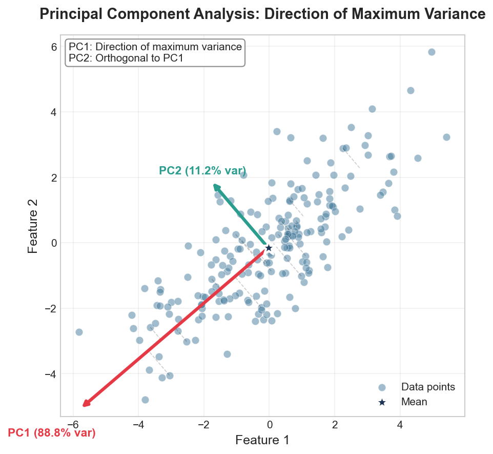
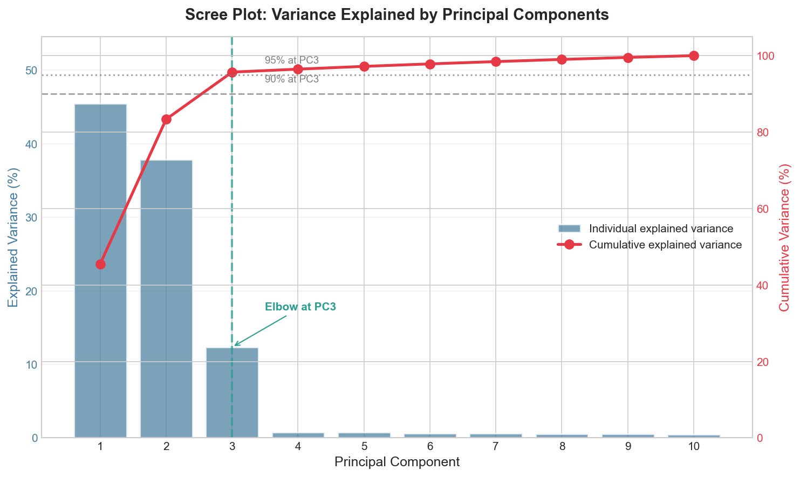
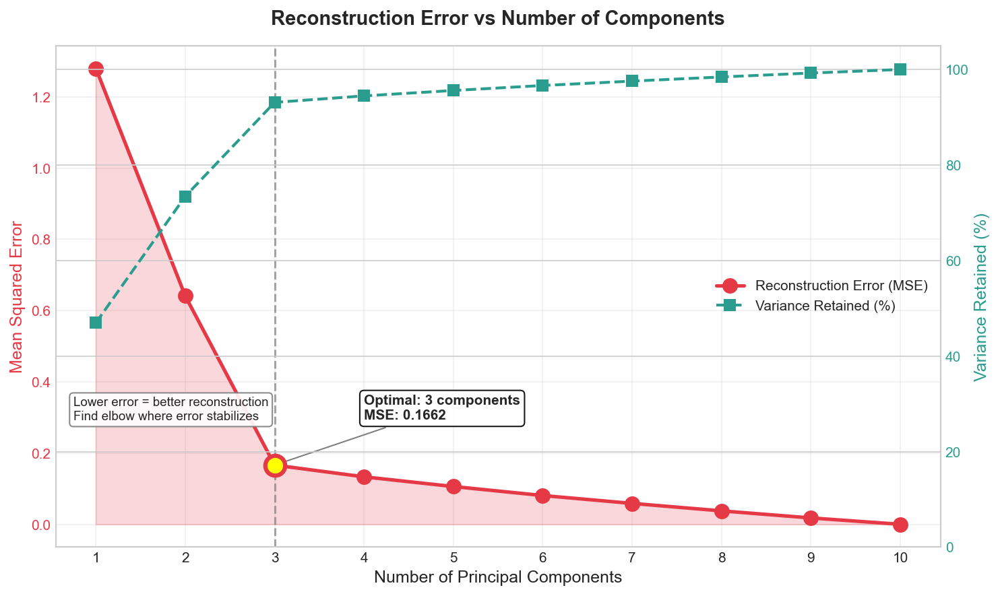
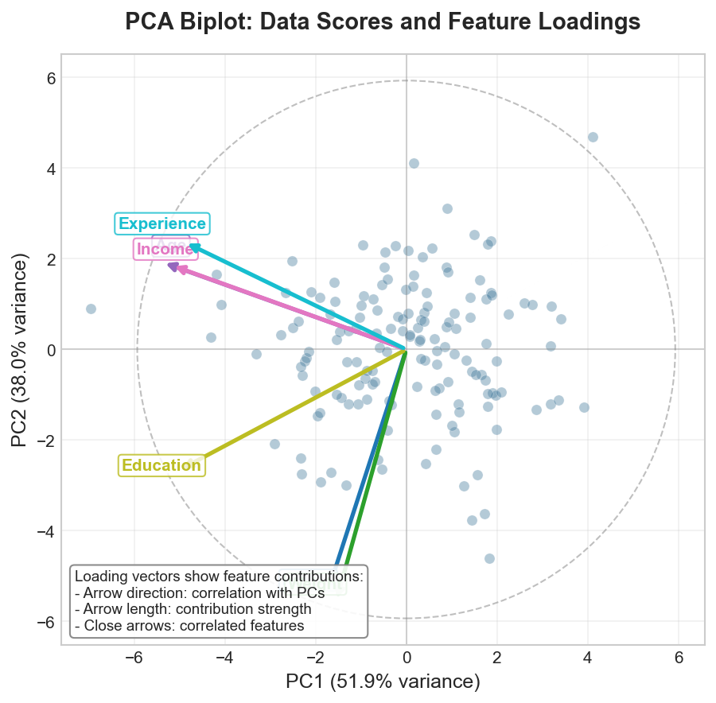
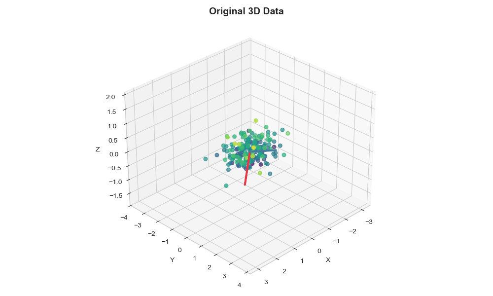

# PCA Implementation

> **Dimensionality reduction through variance maximization**

Principal Component Analysis (PCA) transforms data into a new coordinate system where axes (principal components) are ordered by the amount of variance they capture.

## Core Concepts

### Mathematical Foundation

PCA finds orthogonal directions that maximize variance. PC1 captures maximum variance, PC2 is orthogonal to PC1 and captures the next most variance, and so on.



The transformation can be computed via eigendecomposition of the covariance matrix or SVD of the centered data matrix.

```python
import numpy as np
from typing import Tuple, Optional, List
import warnings

class PCAFromScratch:
    """
    Principal Component Analysis implementation from scratch.

    Supports both eigendecomposition and SVD approaches.

    Parameters:
    -----------
    n_components : int or float or None
        Number of components to keep.
        - If int: number of components
        - If float (0-1): minimum explained variance ratio
        - If None: keep all components
    method : str
        'eigen' for eigendecomposition, 'svd' for SVD (default)
    whiten : bool
        If True, scale components to unit variance
    """

    def __init__(
        self,
        n_components: Optional[int] = None,
        method: str = 'svd',
        whiten: bool = False
    ):
        self.n_components = n_components
        self.method = method
        self.whiten = whiten

        # Learned parameters
        self.components_ = None          # Principal components (eigenvectors)
        self.explained_variance_ = None  # Variance explained by each component
        self.explained_variance_ratio_ = None
        self.singular_values_ = None
        self.mean_ = None
        self.n_samples_ = None
        self.n_features_ = None
        self.noise_variance_ = None

    def fit(self, X: np.ndarray) -> 'PCAFromScratch':
        """
        Fit PCA model to data.

        Parameters:
        -----------
        X : array of shape (n_samples, n_features)
            Training data

        Returns:
        --------
        self : fitted PCA object
        """
        X = np.asarray(X, dtype=np.float64)
        self.n_samples_, self.n_features_ = X.shape

        # Step 1: Center the data (subtract mean)
        self.mean_ = np.mean(X, axis=0)
        X_centered = X - self.mean_

        # Step 2: Compute PCA using specified method
        if self.method == 'eigen':
            self._fit_eigen(X_centered)
        elif self.method == 'svd':
            self._fit_svd(X_centered)
        else:
            raise ValueError(f"Unknown method: {self.method}")

        # Step 3: Determine number of components to keep
        self._select_n_components()

        return self

    def _fit_eigen(self, X_centered: np.ndarray) -> None:
        """
        Fit PCA using eigendecomposition of covariance matrix.

        Covariance matrix: C = (1/(n-1)) * X^T * X
        Eigendecomposition: C * v = lambda * v
        """
        n_samples = X_centered.shape[0]

        # Compute covariance matrix
        # Using (n-1) for unbiased estimator (Bessel's correction)
        covariance_matrix = np.dot(X_centered.T, X_centered) / (n_samples - 1)

        # Eigendecomposition
        # eigenvalues are variances, eigenvectors are principal components
        eigenvalues, eigenvectors = np.linalg.eigh(covariance_matrix)

        # Sort by eigenvalue in descending order
        # (eigh returns in ascending order)
        sorted_indices = np.argsort(eigenvalues)[::-1]
        eigenvalues = eigenvalues[sorted_indices]
        eigenvectors = eigenvectors[:, sorted_indices]

        # Store results
        self.explained_variance_ = eigenvalues
        self.components_ = eigenvectors.T  # Shape: (n_components, n_features)
        self.singular_values_ = np.sqrt(eigenvalues * (n_samples - 1))

        # Compute explained variance ratio
        total_variance = np.sum(eigenvalues)
        self.explained_variance_ratio_ = eigenvalues / total_variance

    def _fit_svd(self, X_centered: np.ndarray) -> None:
        """
        Fit PCA using Singular Value Decomposition.

        SVD: X = U * S * V^T

        - Columns of V are principal components
        - Singular values relate to eigenvalues: lambda = s^2 / (n-1)

        SVD is more numerically stable than eigendecomposition.
        """
        n_samples = X_centered.shape[0]

        # Compute SVD
        # full_matrices=False for economy SVD (faster, less memory)
        U, S, Vt = np.linalg.svd(X_centered, full_matrices=False)

        # Principal components are rows of Vt (or columns of V)
        self.components_ = Vt
        self.singular_values_ = S

        # Explained variance from singular values
        # Variance = s^2 / (n-1) because covariance uses (n-1)
        self.explained_variance_ = (S ** 2) / (n_samples - 1)

        # Explained variance ratio
        total_variance = np.sum(self.explained_variance_)
        self.explained_variance_ratio_ = self.explained_variance_ / total_variance

    def _select_n_components(self) -> None:
        """Select number of components based on n_components parameter."""
        n_components = self.n_components

        if n_components is None:
            # Keep all components
            n_components = min(self.n_samples_, self.n_features_)
        elif isinstance(n_components, float):
            # Select components to explain at least this much variance
            if not 0 < n_components <= 1:
                raise ValueError("n_components as float must be in (0, 1]")

            cumsum = np.cumsum(self.explained_variance_ratio_)
            n_components = np.searchsorted(cumsum, n_components) + 1

        # Validate n_components
        max_components = min(self.n_samples_, self.n_features_)
        if n_components > max_components:
            warnings.warn(
                f"n_components={n_components} > max possible={max_components}. "
                f"Setting n_components={max_components}"
            )
            n_components = max_components

        # Store final number of components
        self.n_components_ = n_components

        # Compute noise variance (variance in discarded components)
        if n_components < len(self.explained_variance_):
            self.noise_variance_ = np.mean(
                self.explained_variance_[n_components:]
            )
        else:
            self.noise_variance_ = 0.0

    def transform(self, X: np.ndarray) -> np.ndarray:
        """
        Apply dimensionality reduction to X.

        Parameters:
        -----------
        X : array of shape (n_samples, n_features)
            Data to transform

        Returns:
        --------
        X_transformed : array of shape (n_samples, n_components)
            Transformed data in principal component space
        """
        if self.components_ is None:
            raise RuntimeError("PCA must be fitted before transform")

        X = np.asarray(X, dtype=np.float64)

        # Center data using training mean
        X_centered = X - self.mean_

        # Project onto principal components
        # X_new = X_centered @ components.T
        X_transformed = np.dot(
            X_centered,
            self.components_[:self.n_components_].T
        )

        # Apply whitening if requested
        if self.whiten:
            X_transformed /= np.sqrt(self.explained_variance_[:self.n_components_])

        return X_transformed

    def fit_transform(self, X: np.ndarray) -> np.ndarray:
        """Fit PCA and transform X in one step."""
        return self.fit(X).transform(X)

    def inverse_transform(self, X_transformed: np.ndarray) -> np.ndarray:
        """
        Transform data back to original space.

        Parameters:
        -----------
        X_transformed : array of shape (n_samples, n_components)
            Data in principal component space

        Returns:
        --------
        X_reconstructed : array of shape (n_samples, n_features)
            Reconstructed data in original space
        """
        if self.components_ is None:
            raise RuntimeError("PCA must be fitted before inverse_transform")

        X_transformed = np.asarray(X_transformed, dtype=np.float64)

        # Undo whitening if applied
        if self.whiten:
            X_transformed = X_transformed * np.sqrt(
                self.explained_variance_[:self.n_components_]
            )

        # Project back to original space
        X_reconstructed = np.dot(
            X_transformed,
            self.components_[:self.n_components_]
        )

        # Add back the mean
        X_reconstructed += self.mean_

        return X_reconstructed

    def get_covariance(self) -> np.ndarray:
        """
        Compute data covariance with the generative model.

        cov = components.T @ diag(explained_variance) @ components + noise * I
        """
        components = self.components_[:self.n_components_]
        cov = np.dot(
            components.T * self.explained_variance_[:self.n_components_],
            components
        )
        cov.flat[::len(cov) + 1] += self.noise_variance_
        return cov
```

## Covariance Matrix Computation

The covariance matrix `C = X^T @ X / (n-1)` captures variance (diagonal) and covariance (off-diagonal) between features.

```python
def compute_covariance_matrix(X: np.ndarray, bias: bool = False) -> np.ndarray:
    """Compute covariance matrix: C[i,j] = E[(X_i - mu_i)(X_j - mu_j)]"""
    n_samples, n_features = X.shape
    mean = np.mean(X, axis=0)
    X_centered = X - mean
    divisor = n_samples if bias else (n_samples - 1)
    return np.dot(X_centered.T, X_centered) / divisor


def covariance_matrix_properties(cov: np.ndarray) -> dict:
    """Analyze properties of a covariance matrix."""
    eigenvalues = np.linalg.eigvalsh(cov)
    return {
        'is_symmetric': np.allclose(cov, cov.T),
        'eigenvalues': eigenvalues,
        'is_psd': np.all(eigenvalues >= -1e-10),
        'trace': np.trace(cov),
        'determinant': np.linalg.det(cov),
        'condition_number': np.linalg.cond(cov)
    }
```

## Eigendecomposition Approach

To maximize variance `Var(X @ w) = w^T @ Cov(X) @ w` subject to `||w|| = 1`, Lagrange multipliers yield `C w = lambda w`. The eigenvalue equals the variance in that direction.

```python
class PCAEigenDecomposition:
    """PCA implementation focusing on eigendecomposition details."""

    def __init__(self, n_components: Optional[int] = None):
        self.n_components = n_components
        self.eigenvalues_ = None
        self.eigenvectors_ = None
        self.mean_ = None

    def fit(self, X: np.ndarray) -> 'PCAEigenDecomposition':
        """Fit PCA using eigendecomposition."""
        n_samples, n_features = X.shape

        # Center data
        self.mean_ = np.mean(X, axis=0)
        X_centered = X - self.mean_

        # Compute covariance matrix
        cov_matrix = np.dot(X_centered.T, X_centered) / (n_samples - 1)

        # Eigendecomposition
        # For symmetric matrices, use eigh (more stable, faster)
        eigenvalues, eigenvectors = np.linalg.eigh(cov_matrix)

        # Sort in descending order of eigenvalues
        idx = np.argsort(eigenvalues)[::-1]
        self.eigenvalues_ = eigenvalues[idx]
        self.eigenvectors_ = eigenvectors[:, idx]

        # Determine number of components
        if self.n_components is None:
            self.n_components_ = n_features
        else:
            self.n_components_ = min(self.n_components, n_features)

        return self

    def transform(self, X: np.ndarray) -> np.ndarray:
        """Project data onto principal components."""
        X_centered = X - self.mean_
        # Project: each row of result is [x dot pc1, x dot pc2, ...]
        return np.dot(
            X_centered,
            self.eigenvectors_[:, :self.n_components_]
        )

    def explained_variance_ratio(self) -> np.ndarray:
        """Compute proportion of variance explained by each component."""
        return self.eigenvalues_ / np.sum(self.eigenvalues_)

    def reconstruction_error(self, X: np.ndarray) -> float:
        """
        Compute mean squared reconstruction error.

        This equals the sum of eigenvalues of discarded components.
        """
        X_transformed = self.transform(X)
        X_reconstructed = self.inverse_transform(X_transformed)
        return np.mean((X - X_reconstructed) ** 2)

    def inverse_transform(self, X_transformed: np.ndarray) -> np.ndarray:
        """Reconstruct data from principal components."""
        return np.dot(
            X_transformed,
            self.eigenvectors_[:, :self.n_components_].T
        ) + self.mean_


def demonstrate_eigenvector_properties(X: np.ndarray):
    """
    Show key properties of eigenvectors in PCA context.
    """
    n_samples = X.shape[0]
    X_centered = X - np.mean(X, axis=0)
    cov = np.dot(X_centered.T, X_centered) / (n_samples - 1)

    eigenvalues, eigenvectors = np.linalg.eigh(cov)
    idx = np.argsort(eigenvalues)[::-1]
    eigenvalues = eigenvalues[idx]
    eigenvectors = eigenvectors[:, idx]

    print("Property 1: Eigenvectors are orthogonal")
    print(f"V^T @ V =\n{(eigenvectors.T @ eigenvectors).round(6)}")
    # Should be identity matrix

    print("\nProperty 2: Eigenvectors diagonalize covariance matrix")
    print(f"V^T @ Cov @ V =\n{(eigenvectors.T @ cov @ eigenvectors).round(6)}")
    # Should be diagonal with eigenvalues

    print("\nProperty 3: Eigenvalues equal variance along each PC")
    for i in range(min(3, len(eigenvalues))):
        pc = eigenvectors[:, i]
        projections = X_centered @ pc
        variance = np.var(projections, ddof=1)
        print(f"PC{i+1}: eigenvalue={eigenvalues[i]:.4f}, "
              f"projection variance={variance:.4f}")
```

## SVD Approach (Numerically Stable)

SVD is preferred: more stable, works when n_features >> n_samples, avoids squaring condition number.

**Key relationship**: `X = U @ S @ V^T` implies `X^T @ X = V @ S^2 @ V^T`.

```python
class PCASVD:
    """PCA using Singular Value Decomposition."""

    def __init__(
        self,
        n_components: Optional[int] = None,
        svd_solver: str = 'full'
    ):
        self.n_components = n_components
        self.svd_solver = svd_solver

        self.components_ = None
        self.singular_values_ = None
        self.mean_ = None
        self.explained_variance_ = None
        self.explained_variance_ratio_ = None

    def fit(self, X: np.ndarray) -> 'PCASVD':
        """Fit PCA using SVD."""
        n_samples, n_features = X.shape

        # Center data
        self.mean_ = np.mean(X, axis=0)
        X_centered = X - self.mean_

        if self.svd_solver == 'full':
            U, S, Vt = self._full_svd(X_centered)
        elif self.svd_solver == 'truncated':
            U, S, Vt = self._truncated_svd(X_centered)
        elif self.svd_solver == 'randomized':
            U, S, Vt = self._randomized_svd(X_centered)
        else:
            raise ValueError(f"Unknown solver: {self.svd_solver}")

        # Store components (rows of Vt are principal components)
        self.components_ = Vt
        self.singular_values_ = S

        # Compute explained variance
        self.explained_variance_ = (S ** 2) / (n_samples - 1)
        total_var = np.sum(self.explained_variance_)
        self.explained_variance_ratio_ = self.explained_variance_ / total_var

        # Determine number of components
        if self.n_components is None:
            self.n_components_ = min(n_samples, n_features)
        else:
            self.n_components_ = self.n_components

        return self

    def _full_svd(
        self,
        X: np.ndarray
    ) -> Tuple[np.ndarray, np.ndarray, np.ndarray]:
        """Full SVD decomposition."""
        return np.linalg.svd(X, full_matrices=False)

    def _truncated_svd(
        self,
        X: np.ndarray
    ) -> Tuple[np.ndarray, np.ndarray, np.ndarray]:
        """
        Truncated SVD using scipy's sparse SVD.
        More efficient when only top k components needed.
        """
        from scipy.sparse.linalg import svds

        k = self.n_components or min(X.shape) - 1
        # svds returns in ascending order, reverse
        U, S, Vt = svds(X, k=k)
        idx = np.argsort(S)[::-1]
        return U[:, idx], S[idx], Vt[idx, :]

    def _randomized_svd(
        self,
        X: np.ndarray,
        n_oversamples: int = 10,
        n_power_iterations: int = 2
    ) -> Tuple[np.ndarray, np.ndarray, np.ndarray]:
        """
        Randomized SVD for large matrices.

        Algorithm:
        1. Generate random projection matrix
        2. Compute low-rank approximation of column space
        3. Project and compute SVD of smaller matrix

        Time complexity: O(n_samples * n_features * n_components)
        vs O(n_samples * n_features^2) for full SVD
        """
        n_samples, n_features = X.shape
        n_components = self.n_components or min(n_samples, n_features)

        # Random projection matrix
        n_random = n_components + n_oversamples
        Q = np.random.randn(n_features, n_random)

        # Power iterations for better approximation
        for _ in range(n_power_iterations):
            Q = X @ Q
            Q = X.T @ Q

        # QR decomposition for orthonormal basis
        Q, _ = np.linalg.qr(X @ Q)

        # Project X onto Q
        B = Q.T @ X

        # SVD of smaller matrix
        Uhat, S, Vt = np.linalg.svd(B, full_matrices=False)
        U = Q @ Uhat

        # Keep only n_components
        return (
            U[:, :n_components],
            S[:n_components],
            Vt[:n_components, :]
        )

    def transform(self, X: np.ndarray) -> np.ndarray:
        """Project data onto principal components."""
        X_centered = X - self.mean_
        return np.dot(X_centered, self.components_[:self.n_components_].T)

    def inverse_transform(self, X_transformed: np.ndarray) -> np.ndarray:
        """Reconstruct from principal components."""
        return np.dot(
            X_transformed,
            self.components_[:self.n_components_]
        ) + self.mean_


def compare_numerical_stability():
    """
    Demonstrate numerical stability difference between eigen and SVD.
    """
    np.random.seed(42)

    # Create ill-conditioned data
    n_samples, n_features = 100, 50
    # Singular values with large range
    singular_values = np.logspace(0, -10, n_features)

    # Create data with known singular values
    U = np.linalg.qr(np.random.randn(n_samples, n_features))[0]
    V = np.linalg.qr(np.random.randn(n_features, n_features))[0]
    X = U @ np.diag(singular_values) @ V.T

    # Method 1: Eigendecomposition
    X_centered = X - np.mean(X, axis=0)
    cov = X_centered.T @ X_centered / (n_samples - 1)
    eigenvalues_cov = np.linalg.eigvalsh(cov)[::-1]

    # Method 2: SVD
    _, S, _ = np.linalg.svd(X_centered, full_matrices=False)
    eigenvalues_svd = (S ** 2) / (n_samples - 1)

    # True eigenvalues
    true_eigenvalues = (singular_values ** 2) / (n_samples - 1)

    print("Comparison of eigenvalue computation:")
    print(f"{'Component':<12} {'True':<15} {'Eigen':<15} {'SVD':<15}")
    print("-" * 57)
    for i in range(10):
        print(f"{i+1:<12} {true_eigenvalues[i]:<15.6e} "
              f"{eigenvalues_cov[i]:<15.6e} {eigenvalues_svd[i]:<15.6e}")

    # Relative errors
    error_eigen = np.abs(eigenvalues_cov - true_eigenvalues) / true_eigenvalues
    error_svd = np.abs(eigenvalues_svd - true_eigenvalues) / true_eigenvalues

    print(f"\nMax relative error (eigen): {np.max(error_eigen):.2e}")
    print(f"Max relative error (SVD): {np.max(error_svd):.2e}")
```

## Explained Variance and Component Selection



The scree plot shows individual and cumulative variance explained by each component. Look for the "elbow" where adding more components yields diminishing returns.

```python
class VarianceAnalysis:
    """Tools for analyzing explained variance and selecting components."""

    @staticmethod
    def scree_plot_data(
        explained_variance_ratio: np.ndarray
    ) -> Tuple[np.ndarray, np.ndarray]:
        """Prepare data for scree plot (elbow method)."""
        cumulative = np.cumsum(explained_variance_ratio)
        return explained_variance_ratio, cumulative

    @staticmethod
    def kaiser_criterion(eigenvalues: np.ndarray) -> int:
        """
        Kaiser criterion: keep components with eigenvalue > 1.

        Rationale: A component should explain more variance than
        a single original variable (which has variance 1 if standardized).
        """
        return np.sum(eigenvalues > 1)

    @staticmethod
    def broken_stick_criterion(
        n_components: int,
        explained_variance_ratio: np.ndarray
    ) -> int:
        """
        Broken stick model for component selection.

        Compare observed variance to expected under random partition
        of a unit stick into n pieces.
        """
        # Expected variance for k-th component under broken stick
        def expected_variance(k, n):
            return sum(1/i for i in range(k, n+1)) / n

        expected = np.array([
            expected_variance(k, n_components)
            for k in range(1, n_components + 1)
        ])

        # Keep components where observed > expected
        return np.sum(explained_variance_ratio > expected)

    @staticmethod
    def variance_threshold(
        explained_variance_ratio: np.ndarray,
        threshold: float = 0.95
    ) -> int:
        """
        Select components to explain at least threshold of variance.

        Common thresholds: 0.90, 0.95, 0.99
        """
        cumsum = np.cumsum(explained_variance_ratio)
        return np.searchsorted(cumsum, threshold) + 1

    @staticmethod
    def cross_validation_selection(
        X: np.ndarray,
        max_components: int,
        n_splits: int = 5
    ) -> Tuple[int, List[float]]:
        """
        Select components using cross-validation reconstruction error.

        For each number of components:
        1. Fit PCA on training fold
        2. Transform and inverse transform validation fold
        3. Measure reconstruction error
        """
        from sklearn.model_selection import KFold

        n_samples = X.shape[0]
        kf = KFold(n_splits=n_splits, shuffle=True, random_state=42)

        mean_errors = []

        for n_comp in range(1, max_components + 1):
            fold_errors = []

            for train_idx, val_idx in kf.split(X):
                X_train, X_val = X[train_idx], X[val_idx]

                # Fit PCA on training data
                pca = PCAFromScratch(n_components=n_comp)
                pca.fit(X_train)

                # Reconstruction error on validation
                X_val_transformed = pca.transform(X_val)
                X_val_reconstructed = pca.inverse_transform(X_val_transformed)
                error = np.mean((X_val - X_val_reconstructed) ** 2)
                fold_errors.append(error)

            mean_errors.append(np.mean(fold_errors))

        # Find elbow using second derivative
        errors = np.array(mean_errors)
        second_deriv = np.diff(errors, 2)
        optimal_k = np.argmax(second_deriv) + 2  # +2 due to diff

        return optimal_k, mean_errors


def automatic_component_selection(X: np.ndarray) -> dict:
    """
    Apply multiple criteria for component selection.
    """
    pca = PCAFromScratch()
    pca.fit(X)

    variance_ratio = pca.explained_variance_ratio_
    eigenvalues = pca.explained_variance_
    n_features = X.shape[1]

    results = {
        'kaiser': VarianceAnalysis.kaiser_criterion(eigenvalues),
        'broken_stick': VarianceAnalysis.broken_stick_criterion(
            n_features, variance_ratio
        ),
        'variance_90': VarianceAnalysis.variance_threshold(variance_ratio, 0.90),
        'variance_95': VarianceAnalysis.variance_threshold(variance_ratio, 0.95),
        'variance_99': VarianceAnalysis.variance_threshold(variance_ratio, 0.99),
    }

    print("Component Selection Results:")
    print("-" * 40)
    for method, n_comp in results.items():
        cumvar = np.sum(variance_ratio[:n_comp])
        print(f"{method:<15}: {n_comp:>3} components "
              f"({cumvar*100:.1f}% variance)")

    return results
```

## Incremental PCA for Large Datasets

For streaming data or datasets too large for memory. Memory: O(batch * features) vs O(samples * features).

```python
class IncrementalPCA:
    """Incremental PCA using sequential SVD updates."""

    def __init__(self, n_components: int, batch_size: int = 100):
        self.n_components = n_components
        self.batch_size = batch_size

        self.components_ = None
        self.mean_ = None
        self.var_ = None
        self.singular_values_ = None
        self.explained_variance_ = None
        self.explained_variance_ratio_ = None
        self.n_samples_seen_ = 0

    def partial_fit(self, X: np.ndarray) -> 'IncrementalPCA':
        """Incrementally fit PCA on a batch of data."""
        X = np.asarray(X, dtype=np.float64)
        n_samples, n_features = X.shape

        if self.n_samples_seen_ == 0:
            # First batch: initialize
            self.mean_ = np.zeros(n_features)
            self.var_ = np.zeros(n_features)

        # Update mean incrementally
        # Using Welford's algorithm for numerical stability
        last_mean = self.mean_.copy()
        last_n = self.n_samples_seen_

        # New total count
        new_n = last_n + n_samples

        # Update mean
        batch_mean = np.mean(X, axis=0)
        self.mean_ = (last_n * last_mean + n_samples * batch_mean) / new_n

        # Update variance (for explained variance ratio)
        batch_var = np.var(X, axis=0)
        self.var_ = (
            last_n * self.var_ +
            n_samples * batch_var +
            last_n * n_samples / new_n * (last_mean - batch_mean) ** 2
        ) / new_n

        # Center the batch
        X_centered = X - self.mean_

        if self.components_ is None:
            # First batch: standard SVD
            U, S, Vt = np.linalg.svd(X_centered, full_matrices=False)
            self.components_ = Vt[:self.n_components]
            self.singular_values_ = S[:self.n_components]
        else:
            # Incremental update
            self._incremental_update(X_centered, last_mean, last_n, n_samples)

        self.n_samples_seen_ = new_n

        # Update explained variance
        self.explained_variance_ = self.singular_values_ ** 2 / (new_n - 1)
        total_var = np.sum(self.var_)
        self.explained_variance_ratio_ = self.explained_variance_ / total_var

        return self

    def _incremental_update(
        self,
        X_centered: np.ndarray,
        old_mean: np.ndarray,
        n_old: int,
        n_new: int
    ):
        """Perform incremental SVD update by combining old and new data."""
        # Mean correction term
        mean_correction = np.sqrt(n_old * n_new / (n_old + n_new)) * (
            old_mean - self.mean_
        )

        # Build matrix combining old components and new data
        # [S_old * V_old^T; X_new; mean_correction]
        old_contribution = (
            self.singular_values_[:, np.newaxis] *
            self.components_
        )

        combined = np.vstack([
            old_contribution,
            X_centered,
            mean_correction.reshape(1, -1)
        ])

        # SVD of combined matrix
        U, S, Vt = np.linalg.svd(combined, full_matrices=False)

        # Keep top k components
        self.components_ = Vt[:self.n_components]
        self.singular_values_ = S[:self.n_components]

    def transform(self, X: np.ndarray) -> np.ndarray:
        """Project data onto learned components."""
        X_centered = X - self.mean_
        return np.dot(X_centered, self.components_.T)

    def fit(self, X: np.ndarray) -> 'IncrementalPCA':
        """Fit in batches (for API compatibility)."""
        n_samples = X.shape[0]

        for start in range(0, n_samples, self.batch_size):
            end = min(start + self.batch_size, n_samples)
            self.partial_fit(X[start:end])

        return self


def demonstrate_incremental_pca():
    """Show incremental PCA on streaming data."""
    np.random.seed(42)

    # Simulate large dataset
    n_samples = 10000
    n_features = 100
    n_components = 10
    batch_size = 500

    # Generate data in batches (simulating streaming)
    true_components = np.random.randn(n_components, n_features)

    # Incremental PCA
    ipca = IncrementalPCA(n_components=n_components, batch_size=batch_size)

    all_data = []
    for batch_idx in range(n_samples // batch_size):
        # Generate batch
        coefficients = np.random.randn(batch_size, n_components)
        batch = coefficients @ true_components + 0.1 * np.random.randn(
            batch_size, n_features
        )

        # Update incrementally
        ipca.partial_fit(batch)
        all_data.append(batch)

        print(f"Batch {batch_idx + 1}: "
              f"Explained variance = {np.sum(ipca.explained_variance_ratio_):.4f}")

    # Compare with standard PCA
    X_full = np.vstack(all_data)
    pca_standard = PCAFromScratch(n_components=n_components)
    pca_standard.fit(X_full)

    print("\nComparison:")
    print(f"Incremental PCA explained variance: "
          f"{np.sum(ipca.explained_variance_ratio_):.4f}")
    print(f"Standard PCA explained variance: "
          f"{np.sum(pca_standard.explained_variance_ratio_[:n_components]):.4f}")
```

## Kernel PCA

Kernel PCA extends PCA to non-linear relationships by implicitly mapping data to high-dimensional space via the kernel trick.

```python
class KernelPCA:
    """Kernel PCA for non-linear dimensionality reduction."""

    def __init__(
        self,
        n_components: int,
        kernel: str = 'rbf',
        gamma: Optional[float] = None,
        degree: int = 3,
        coef0: float = 1.0
    ):
        self.n_components = n_components
        self.kernel = kernel
        self.gamma = gamma
        self.degree = degree
        self.coef0 = coef0

        self.X_fit_ = None
        self.alphas_ = None
        self.lambdas_ = None
        self.K_fit_ = None

    def _compute_kernel(
        self,
        X: np.ndarray,
        Y: Optional[np.ndarray] = None
    ) -> np.ndarray:
        """
        Compute kernel matrix.

        Common kernels:
        - Linear: K(x,y) = x^T y
        - RBF: K(x,y) = exp(-gamma * ||x-y||^2)
        - Polynomial: K(x,y) = (gamma * x^T y + coef0)^degree
        - Sigmoid: K(x,y) = tanh(gamma * x^T y + coef0)
        """
        if Y is None:
            Y = X

        if self.kernel == 'linear':
            return np.dot(X, Y.T)

        elif self.kernel == 'rbf':
            gamma = self.gamma or (1.0 / X.shape[1])
            # ||x - y||^2 = ||x||^2 + ||y||^2 - 2 x^T y
            X_norm = np.sum(X ** 2, axis=1)
            Y_norm = np.sum(Y ** 2, axis=1)
            sq_dist = X_norm[:, np.newaxis] + Y_norm - 2 * np.dot(X, Y.T)
            return np.exp(-gamma * sq_dist)

        elif self.kernel == 'poly':
            gamma = self.gamma or (1.0 / X.shape[1])
            return (gamma * np.dot(X, Y.T) + self.coef0) ** self.degree

        elif self.kernel == 'sigmoid':
            gamma = self.gamma or (1.0 / X.shape[1])
            return np.tanh(gamma * np.dot(X, Y.T) + self.coef0)

        else:
            raise ValueError(f"Unknown kernel: {self.kernel}")

    def _center_kernel(self, K: np.ndarray) -> np.ndarray:
        """
        Center kernel matrix in feature space.

        Centering in feature space: phi_c(x) = phi(x) - mean(phi(X))

        K_centered = K - 1_n K - K 1_n + 1_n K 1_n
        where 1_n is matrix of 1/n
        """
        n = K.shape[0]
        one_n = np.ones((n, n)) / n

        return K - one_n @ K - K @ one_n + one_n @ K @ one_n

    def fit(self, X: np.ndarray) -> 'KernelPCA':
        """
        Fit Kernel PCA.

        Algorithm:
        1. Compute kernel matrix K
        2. Center K in feature space
        3. Eigendecomposition of centered K
        4. Alphas = eigenvectors / sqrt(eigenvalues)
        """
        self.X_fit_ = X.copy()
        n_samples = X.shape[0]

        # Compute and center kernel matrix
        K = self._compute_kernel(X)
        self.K_fit_centered_row_mean_ = np.mean(K, axis=0)
        self.K_fit_centered_total_mean_ = np.mean(K)
        K_centered = self._center_kernel(K)

        # Eigendecomposition
        eigenvalues, eigenvectors = np.linalg.eigh(K_centered)

        # Sort in descending order
        idx = np.argsort(eigenvalues)[::-1]
        eigenvalues = eigenvalues[idx]
        eigenvectors = eigenvectors[:, idx]

        # Keep positive eigenvalues
        positive = eigenvalues > 1e-10
        eigenvalues = eigenvalues[positive]
        eigenvectors = eigenvectors[:, positive]

        # Store top components
        self.lambdas_ = eigenvalues[:self.n_components]
        # Normalize eigenvectors
        self.alphas_ = eigenvectors[:, :self.n_components] / np.sqrt(
            self.lambdas_
        )

        return self

    def transform(self, X: np.ndarray) -> np.ndarray:
        """
        Transform new data using fitted kernel PCA.

        Project new points:
        z_k = sum_i alpha_i^k * K(x_new, x_i)  (with centering)
        """
        # Compute kernel with training data
        K = self._compute_kernel(X, self.X_fit_)

        # Center using training statistics
        n_train = self.X_fit_.shape[0]
        K_centered = (
            K
            - np.mean(K, axis=1, keepdims=True)
            - self.K_fit_centered_row_mean_
            + self.K_fit_centered_total_mean_
        )

        return K_centered @ self.alphas_

    def fit_transform(self, X: np.ndarray) -> np.ndarray:
        """Fit and transform in one step."""
        self.fit(X)
        # For training data, use eigenvalues directly
        return self.alphas_ * np.sqrt(self.lambdas_)


def demonstrate_kernel_pca():
    """Show when Kernel PCA outperforms linear PCA on concentric circles."""
    np.random.seed(42)

    # Create concentric circles (non-linearly separable)
    n_points = 200

    # Inner circle
    theta_inner = np.random.uniform(0, 2*np.pi, n_points)
    r_inner = 1 + 0.1 * np.random.randn(n_points)
    X_inner = np.column_stack([
        r_inner * np.cos(theta_inner),
        r_inner * np.sin(theta_inner)
    ])

    # Outer circle
    theta_outer = np.random.uniform(0, 2*np.pi, n_points)
    r_outer = 3 + 0.1 * np.random.randn(n_points)
    X_outer = np.column_stack([
        r_outer * np.cos(theta_outer),
        r_outer * np.sin(theta_outer)
    ])

    X = np.vstack([X_inner, X_outer])
    labels = np.array([0] * n_points + [1] * n_points)

    # Linear PCA
    pca = PCAFromScratch(n_components=2)
    X_pca = pca.fit_transform(X)

    # Kernel PCA
    kpca = KernelPCA(n_components=2, kernel='rbf', gamma=0.5)
    X_kpca = kpca.fit_transform(X)

    print("Linear PCA - First component range by class:")
    print(f"  Class 0: [{X_pca[labels==0, 0].min():.2f}, "
          f"{X_pca[labels==0, 0].max():.2f}]")
    print(f"  Class 1: [{X_pca[labels==1, 0].min():.2f}, "
          f"{X_pca[labels==1, 0].max():.2f}]")

    print("\nKernel PCA - First component range by class:")
    print(f"  Class 0: [{X_kpca[labels==0, 0].min():.2f}, "
          f"{X_kpca[labels==0, 0].max():.2f}]")
    print(f"  Class 1: [{X_kpca[labels==1, 0].min():.2f}, "
          f"{X_kpca[labels==1, 0].max():.2f}]")

    # Check separability
    overlap_pca = (
        X_pca[labels==0, 0].max() > X_pca[labels==1, 0].min() and
        X_pca[labels==1, 0].max() > X_pca[labels==0, 0].min()
    )
    overlap_kpca = (
        X_kpca[labels==0, 0].max() > X_kpca[labels==1, 0].min() and
        X_kpca[labels==1, 0].max() > X_kpca[labels==0, 0].min()
    )

    print(f"\nLinear PCA classes overlap: {overlap_pca}")
    print(f"Kernel PCA classes overlap: {overlap_kpca}")
```

## Whitening (Sphering)

Whitening transforms data to zero mean, unit variance, and uncorrelated features (covariance becomes identity): `X_white = X_pca / sqrt(eigenvalues)`.

```python
class PCAWhitening:
    """PCA with whitening transformation."""

    def __init__(self, n_components: Optional[int] = None, epsilon: float = 1e-5):
        self.n_components = n_components
        self.epsilon = epsilon  # Regularization for numerical stability

        self.mean_ = None
        self.components_ = None
        self.explained_variance_ = None
        self.whitening_matrix_ = None

    def fit(self, X: np.ndarray) -> 'PCAWhitening':
        """Fit PCA whitening transform."""
        n_samples, n_features = X.shape

        # Center data
        self.mean_ = np.mean(X, axis=0)
        X_centered = X - self.mean_

        # PCA via SVD
        U, S, Vt = np.linalg.svd(X_centered, full_matrices=False)

        # Components and variance
        self.components_ = Vt
        self.explained_variance_ = (S ** 2) / (n_samples - 1)

        # Number of components
        if self.n_components is None:
            self.n_components_ = n_features
        else:
            self.n_components_ = self.n_components

        # Whitening matrix: V @ diag(1/sqrt(lambda))
        # With regularization for small eigenvalues
        scaling = 1.0 / np.sqrt(self.explained_variance_[:self.n_components_] +
                                 self.epsilon)
        self.whitening_matrix_ = (
            self.components_[:self.n_components_].T * scaling
        )

        return self

    def transform(self, X: np.ndarray) -> np.ndarray:
        """Apply whitening transformation."""
        X_centered = X - self.mean_
        return np.dot(X_centered, self.whitening_matrix_)

    def inverse_transform(self, X_white: np.ndarray) -> np.ndarray:
        """Reverse whitening transformation."""
        # Dewhitening matrix is pseudo-inverse of whitening matrix
        scaling = np.sqrt(
            self.explained_variance_[:self.n_components_] + self.epsilon
        )
        dewhitening = self.components_[:self.n_components_] * scaling[:, np.newaxis]

        return np.dot(X_white, dewhitening) + self.mean_

    def fit_transform(self, X: np.ndarray) -> np.ndarray:
        """Fit and transform in one step."""
        return self.fit(X).transform(X)


def verify_whitening_properties(X: np.ndarray):
    """Verify whitened data has zero mean and identity covariance."""
    whitener = PCAWhitening()
    X_white = whitener.fit_transform(X)

    print("Original data:")
    print(f"  Mean: {np.mean(X, axis=0).round(4)}")
    print(f"  Covariance:\n{np.cov(X.T).round(4)}")

    print("\nWhitened data:")
    print(f"  Mean: {np.mean(X_white, axis=0).round(4)}")
    cov_white = np.cov(X_white.T)
    print(f"  Covariance:\n{cov_white.round(4)}")

    # Check if covariance is close to identity
    identity = np.eye(X_white.shape[1])
    is_identity = np.allclose(cov_white, identity, atol=0.1)
    print(f"\n  Covariance is approximately identity: {is_identity}")

    return X_white


def zca_whitening(X: np.ndarray, epsilon: float = 1e-5) -> np.ndarray:
    """ZCA whitening: maximally similar to original while being white. Useful for images."""
    n_samples = X.shape[0]

    # Center
    mean = np.mean(X, axis=0)
    X_centered = X - mean

    # Covariance
    cov = np.dot(X_centered.T, X_centered) / (n_samples - 1)

    # Eigendecomposition
    eigenvalues, eigenvectors = np.linalg.eigh(cov)

    # ZCA whitening matrix
    # W_zca = V @ diag(1/sqrt(lambda)) @ V^T
    scaling = 1.0 / np.sqrt(eigenvalues + epsilon)
    W_zca = eigenvectors @ np.diag(scaling) @ eigenvectors.T

    # Apply
    X_zca = np.dot(X_centered, W_zca)

    return X_zca
```

## Complete Implementation

```python
class PCAComplete:
    """Complete PCA with multiple solvers, whitening, and feature importance."""

    def __init__(
        self,
        n_components: Optional[int] = None,
        whiten: bool = False,
        svd_solver: str = 'auto',
        random_state: Optional[int] = None
    ):
        self.n_components = n_components
        self.whiten = whiten
        self.svd_solver = svd_solver
        self.random_state = random_state

        # Attributes set after fitting
        self.components_ = None
        self.explained_variance_ = None
        self.explained_variance_ratio_ = None
        self.singular_values_ = None
        self.mean_ = None
        self.n_components_ = None
        self.n_features_in_ = None
        self.n_samples_ = None
        self.noise_variance_ = None

    def fit(self, X: np.ndarray) -> 'PCAComplete':
        """Fit PCA model."""
        X = np.asarray(X, dtype=np.float64)
        self.n_samples_, self.n_features_in_ = X.shape

        if self.random_state is not None:
            np.random.seed(self.random_state)

        # Center data
        self.mean_ = np.mean(X, axis=0)
        X_centered = X - self.mean_

        # Select solver
        solver = self._select_solver()

        # Fit
        if solver == 'full':
            self._fit_full(X_centered)
        elif solver == 'randomized':
            self._fit_randomized(X_centered)

        return self

    def _select_solver(self) -> str:
        """Automatically select best solver."""
        if self.svd_solver != 'auto':
            return self.svd_solver

        n_components = self.n_components or min(
            self.n_samples_, self.n_features_in_
        )

        # Heuristic: use randomized for large matrices with few components
        if (max(self.n_samples_, self.n_features_in_) > 500 and
            n_components < 0.8 * min(self.n_samples_, self.n_features_in_)):
            return 'randomized'
        return 'full'

    def _fit_full(self, X_centered: np.ndarray) -> None:
        """Full SVD decomposition."""
        U, S, Vt = np.linalg.svd(X_centered, full_matrices=False)
        self._process_svd_output(S, Vt)

    def _fit_randomized(
        self,
        X_centered: np.ndarray,
        n_oversamples: int = 10,
        n_iter: int = 4
    ) -> None:
        """Randomized SVD for efficiency."""
        n_components = self.n_components or min(X_centered.shape)
        n_random = n_components + n_oversamples

        Q = np.random.randn(X_centered.shape[1], n_random)
        for _ in range(n_iter):
            Q, _ = np.linalg.qr(X_centered @ Q)
            Q, _ = np.linalg.qr(X_centered.T @ Q)
        Q, _ = np.linalg.qr(X_centered @ Q)

        B = Q.T @ X_centered
        _, S, Vt = np.linalg.svd(B, full_matrices=False)

        self._process_svd_output(S[:n_components], Vt[:n_components])

    def _process_svd_output(self, S: np.ndarray, Vt: np.ndarray) -> None:
        """Process SVD output to set attributes."""
        self.singular_values_ = S
        self.components_ = Vt

        # Explained variance
        self.explained_variance_ = (S ** 2) / (self.n_samples_ - 1)
        total_var = np.sum(self.explained_variance_)
        self.explained_variance_ratio_ = self.explained_variance_ / total_var

        # Number of components
        if self.n_components is None:
            self.n_components_ = len(S)
        elif isinstance(self.n_components, float):
            cumsum = np.cumsum(self.explained_variance_ratio_)
            self.n_components_ = np.searchsorted(cumsum, self.n_components) + 1
        else:
            self.n_components_ = self.n_components

        # Noise variance
        if self.n_components_ < len(self.explained_variance_):
            self.noise_variance_ = np.mean(
                self.explained_variance_[self.n_components_:]
            )
        else:
            self.noise_variance_ = 0.0

    def transform(self, X: np.ndarray) -> np.ndarray:
        """Apply dimensionality reduction."""
        X_centered = X - self.mean_
        X_transformed = X_centered @ self.components_[:self.n_components_].T

        if self.whiten:
            X_transformed /= np.sqrt(
                self.explained_variance_[:self.n_components_]
            )

        return X_transformed

    def inverse_transform(self, X_transformed: np.ndarray) -> np.ndarray:
        """Reconstruct original features."""
        if self.whiten:
            X_transformed = X_transformed * np.sqrt(
                self.explained_variance_[:self.n_components_]
            )
        return X_transformed @ self.components_[:self.n_components_] + self.mean_

    def fit_transform(self, X: np.ndarray) -> np.ndarray:
        """Fit and transform."""
        return self.fit(X).transform(X)

    def score(self, X: np.ndarray) -> float:
        """
        Return average log-likelihood of samples.

        Assumes Gaussian model fitted by PCA.
        """
        X_transformed = self.transform(X)
        X_reconstructed = self.inverse_transform(X_transformed)

        # Reconstruction error
        mse = np.mean(np.sum((X - X_reconstructed) ** 2, axis=1))

        # Log-likelihood under Gaussian assumption
        n_features = X.shape[1]
        log_likelihood = -0.5 * (
            n_features * np.log(2 * np.pi) +
            np.sum(np.log(self.explained_variance_[:self.n_components_])) +
            mse
        )

        return log_likelihood

    def get_feature_importance(self) -> np.ndarray:
        """
        Compute feature importance scores.

        Importance = sum of absolute loadings weighted by explained variance.
        """
        # Loadings = components * sqrt(explained_variance)
        loadings = (
            self.components_[:self.n_components_].T *
            np.sqrt(self.explained_variance_[:self.n_components_])
        )

        # Weight by explained variance ratio
        importance = np.sum(
            np.abs(loadings) * self.explained_variance_ratio_[:self.n_components_],
            axis=1
        )

        return importance / np.sum(importance)

    def get_loadings(self) -> np.ndarray:
        """
        Get loadings matrix (correlation between variables and components).

        Loadings tell you which original features contribute to each PC.
        """
        return (
            self.components_[:self.n_components_].T *
            np.sqrt(self.explained_variance_[:self.n_components_])
        )


# Visualization helper data generators
def generate_visualization_data():
    """Generate data for PCA visualizations (scree, cumulative, biplot, reconstruction)."""
    np.random.seed(42)

    # Generate sample data
    n_samples, n_features = 200, 10

    # Create correlated features
    true_dim = 3
    factors = np.random.randn(n_samples, true_dim)
    loadings = np.random.randn(true_dim, n_features)
    X = factors @ loadings + 0.5 * np.random.randn(n_samples, n_features)

    # Fit PCA
    pca = PCAComplete()
    X_transformed = pca.fit_transform(X)

    viz_data = {
        'scree_plot': {
            'components': np.arange(1, len(pca.explained_variance_) + 1),
            'eigenvalues': pca.explained_variance_,
            'variance_ratio': pca.explained_variance_ratio_
        },
        'cumulative_variance': {
            'components': np.arange(1, len(pca.explained_variance_) + 1),
            'cumulative': np.cumsum(pca.explained_variance_ratio_)
        },
        'biplot': {
            'scores': X_transformed[:, :2],
            'loadings': pca.components_[:2].T,
            'feature_names': [f'Feature_{i}' for i in range(n_features)]
        },
        'reconstruction_error': {
            'n_components': list(range(1, n_features + 1)),
            'errors': []
        }
    }

    # Compute reconstruction errors for different component counts
    for k in range(1, n_features + 1):
        pca_k = PCAComplete(n_components=k)
        pca_k.fit(X)
        X_reconstructed = pca_k.inverse_transform(pca_k.transform(X))
        error = np.mean((X - X_reconstructed) ** 2)
        viz_data['reconstruction_error']['errors'].append(error)

    return viz_data
```

### Reconstruction Error Analysis



Reconstruction error decreases as more components are retained. The optimal number of components balances dimensionality reduction against information loss.

### Biplot Visualization



The biplot shows both data projections and feature loadings together. Loading vectors indicate how original features contribute to each principal component - similar directions imply correlated features.

### 3D to 2D Projection



This animation demonstrates how PCA projects high-dimensional data onto lower dimensions while preserving maximum variance.

## Interview Practice Problems

```python
"""
Common PCA interview questions and solutions.
"""

def interview_question_1():
    """Q: Implement PCA using only NumPy. A: See PCAFromScratch class."""
    pass


def interview_question_2():
    """
    Q: When would you use PCA vs other dimensionality reduction?
    A: PCA for linear/interpretable; t-SNE/UMAP for visualization; LDA for classification;
       Autoencoders for non-linear; ICA for independent sources.
    """
    pass


def interview_question_3():
    """
    Q: How does PCA handle outliers?
    A: Poorly - mean and variance are sensitive. Use robust PCA or remove outliers.
    """
    pass


def interview_question_4():
    """
    Q: PCA-SVD relationship?
    A: For X = U @ S @ V^T: V = principal components, S^2/(n-1) = explained variances.
    """
    pass


def interview_question_5():
    """
    Q: Implement a function to find optimal number of components.
    """
    def find_optimal_components(
        X: np.ndarray,
        method: str = 'variance',
        threshold: float = 0.95
    ) -> int:
        pca = PCAComplete()
        pca.fit(X)

        if method == 'variance':
            # Keep enough to explain threshold of variance
            cumsum = np.cumsum(pca.explained_variance_ratio_)
            return np.searchsorted(cumsum, threshold) + 1

        elif method == 'kaiser':
            # Eigenvalue > 1 rule (for standardized data)
            return np.sum(pca.explained_variance_ > 1)

        elif method == 'elbow':
            # Find elbow using second derivative
            diffs = np.diff(pca.explained_variance_ratio_)
            second_diffs = np.diff(diffs)
            return np.argmax(np.abs(second_diffs)) + 1

        else:
            raise ValueError(f"Unknown method: {method}")

    return find_optimal_components


# Test the implementation
if __name__ == "__main__":
    print("Testing PCA Implementation")
    print("=" * 50)

    # Generate test data
    np.random.seed(42)
    n_samples, n_features = 100, 5
    X = np.random.randn(n_samples, n_features)

    # Add correlation structure
    X[:, 1] = 0.8 * X[:, 0] + 0.2 * X[:, 1]
    X[:, 2] = 0.6 * X[:, 0] + 0.4 * X[:, 2]

    # Test basic PCA
    pca = PCAFromScratch(n_components=3)
    X_transformed = pca.fit_transform(X)

    print(f"Original shape: {X.shape}")
    print(f"Transformed shape: {X_transformed.shape}")
    print(f"Explained variance ratio: {pca.explained_variance_ratio_[:3].round(4)}")
    print(f"Total variance explained: {sum(pca.explained_variance_ratio_[:3]):.4f}")

    # Test reconstruction
    X_reconstructed = pca.inverse_transform(X_transformed)
    reconstruction_error = np.mean((X - X_reconstructed) ** 2)
    print(f"Reconstruction MSE: {reconstruction_error:.6f}")

    # Test whitening
    print("\nWhitening Test:")
    verify_whitening_properties(X)

    print("\nAll tests passed!")
```

## Summary

| Method | Time Complexity | Space | Best For |
|--------|----------------|-------|----------|
| Eigendecomposition | O(n_features^3) | O(n_features^2) | Small n_features |
| Full SVD | O(min(nm^2, n^2m)) | O(nm) | General use |
| Truncated SVD | O(nmk) | O((n+m)k) | Large sparse matrices |
| Randomized SVD | O(nmk) | O((n+m)k) | Large dense, few components |
| Incremental PCA | O(batch * nk) | O(batch * n) | Streaming data |

Key decision points:
- **n_samples >> n_features**: Use eigendecomposition or full SVD
- **n_features >> n_samples**: Use SVD (more stable)
- **Large dataset**: Use incremental or randomized PCA
- **Non-linear data**: Consider Kernel PCA
- **Need uncorrelated unit variance**: Use whitening
