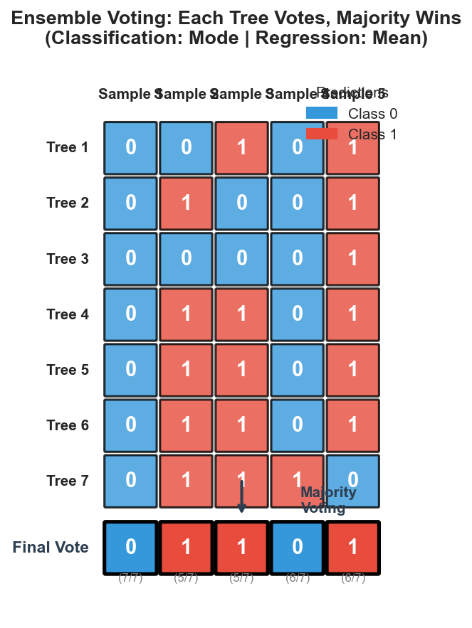
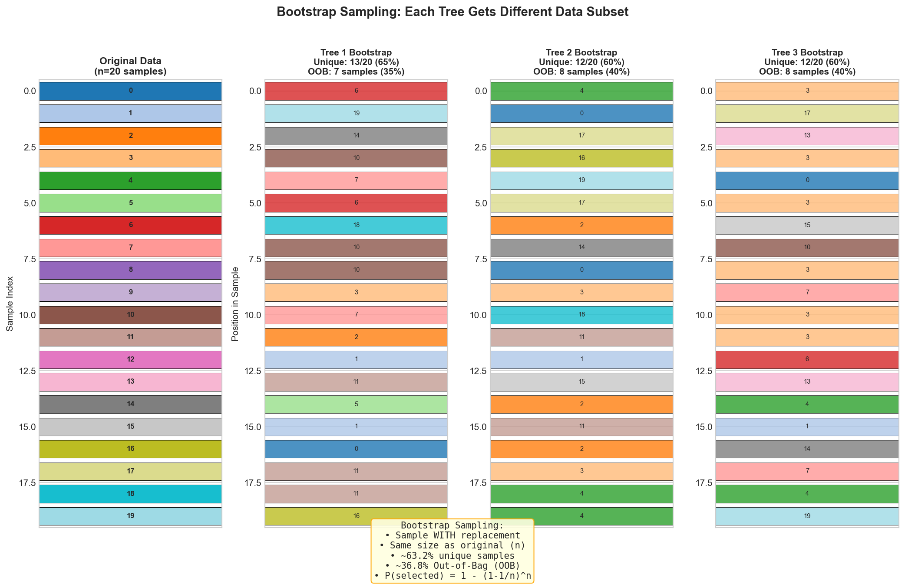
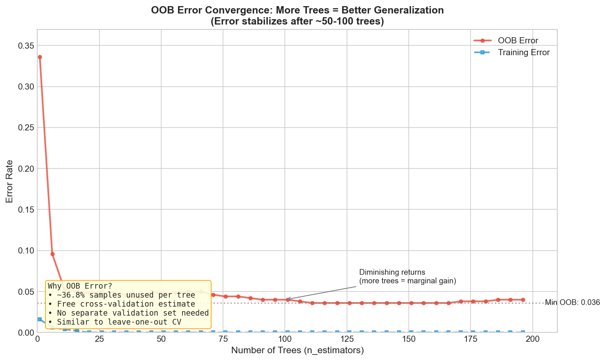
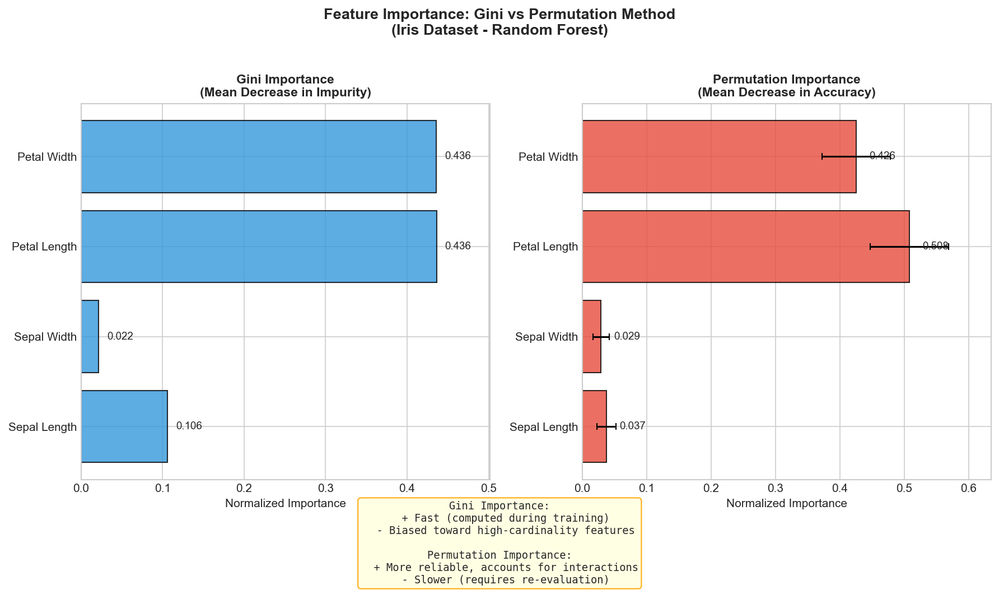
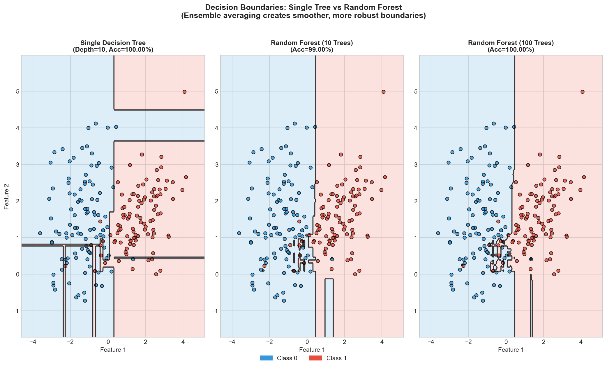

# Random Forest Implementation

> **Ensemble of decision trees for robust predictions**

---

## Problem Statement

Implement a Random Forest algorithm from scratch. Random Forest is an ensemble learning method that constructs multiple decision trees during training and outputs the mode (classification) or mean (regression) of the individual trees' predictions.



---

## Clarifying Questions to Ask

1. **Classification or regression?** (Start with classification, extend to regression)
2. **Number of trees?** (Default 100, but configurable)
3. **Feature subsampling strategy?** (sqrt(n_features) for classification, n_features/3 for regression)
4. **Tree depth limits?** (Max depth, min samples per leaf?)
5. **Libraries allowed?** (NumPy yes, sklearn no for implementation)

---

## Prerequisites: Decision Tree Node

```python
from typing import Optional, Any

class DecisionTreeNode:
    """Node in a decision tree."""
    def __init__(self):
        self.feature_idx: Optional[int] = None
        self.threshold: Optional[float] = None
        self.left: Optional['DecisionTreeNode'] = None
        self.right: Optional['DecisionTreeNode'] = None
        self.value: Optional[Any] = None
        self.is_leaf: bool = False
```

See [Decision Tree Implementation](./decision-tree-implementation.md) for full tree details.

---

## Solution: Random Forest Classifier

::: code-group

```python [NumPy]
import numpy as np
from collections import Counter
from typing import Optional, List

class DecisionTree:
    """Simple decision tree with random feature subsampling."""

    def __init__(self, max_depth=10, min_samples_split=2, min_samples_leaf=1,
                 max_features=None, random_state=None):
        self.max_depth = max_depth
        self.min_samples_split = min_samples_split
        self.min_samples_leaf = min_samples_leaf
        self.max_features = max_features
        self.root = None
        self.rng = np.random.RandomState(random_state)

    def fit(self, X, y):
        self.n_features = X.shape[1]
        if self.max_features is None:
            self.max_features = self.n_features
        self.root = self._build_tree(X, y, depth=0)
        return self

    def _build_tree(self, X, y, depth):
        node = DecisionTreeNode()
        n_samples = len(y)

        # Stopping conditions
        if (depth >= self.max_depth or n_samples < self.min_samples_split
            or len(np.unique(y)) == 1):
            node.is_leaf = True
            node.value = Counter(y).most_common(1)[0][0]
            return node

        # Random feature subsampling (KEY for Random Forest)
        feature_indices = self.rng.choice(
            self.n_features, min(self.max_features, self.n_features), replace=False
        )

        best_gain, best_feature, best_threshold = -np.inf, None, None
        best_left_mask, best_right_mask = None, None

        for feat_idx in feature_indices:
            for threshold in np.unique(X[:, feat_idx]):
                left_mask = X[:, feat_idx] <= threshold
                right_mask = ~left_mask

                if (np.sum(left_mask) < self.min_samples_leaf or
                    np.sum(right_mask) < self.min_samples_leaf):
                    continue

                gain = self._gini_gain(y, left_mask, right_mask)
                if gain > best_gain:
                    best_gain, best_feature, best_threshold = gain, feat_idx, threshold
                    best_left_mask, best_right_mask = left_mask, right_mask

        if best_feature is None:
            node.is_leaf = True
            node.value = Counter(y).most_common(1)[0][0]
            return node

        node.feature_idx = best_feature
        node.threshold = best_threshold
        node.left = self._build_tree(X[best_left_mask], y[best_left_mask], depth + 1)
        node.right = self._build_tree(X[best_right_mask], y[best_right_mask], depth + 1)
        return node

    def _gini_gain(self, y, left_mask, right_mask):
        def gini(arr):
            if len(arr) == 0: return 0
            _, counts = np.unique(arr, return_counts=True)
            probs = counts / len(arr)
            return 1 - np.sum(probs ** 2)

        n = len(y)
        return gini(y) - (np.sum(left_mask)/n * gini(y[left_mask]) +
                          np.sum(right_mask)/n * gini(y[right_mask]))

    def predict(self, X):
        return np.array([self._predict_single(x) for x in X])

    def _predict_single(self, x):
        node = self.root
        while not node.is_leaf:
            if x[node.feature_idx] <= node.threshold:
                node = node.left
            else:
                node = node.right
        return node.value


class RandomForestClassifier:
    """Random Forest Classifier with bootstrap sampling and feature bagging."""

    def __init__(self, n_estimators=100, max_depth=10, min_samples_split=2,
                 min_samples_leaf=1, max_features='sqrt', bootstrap=True,
                 oob_score=False, random_state=None):
        self.n_estimators = n_estimators
        self.max_depth = max_depth
        self.min_samples_split = min_samples_split
        self.min_samples_leaf = min_samples_leaf
        self.max_features = max_features
        self.bootstrap = bootstrap
        self.oob_score = oob_score
        self.random_state = random_state

        self.trees: List[DecisionTree] = []
        self.oob_indices: List[np.ndarray] = []
        self.oob_score_: Optional[float] = None
        self.feature_importances_: Optional[np.ndarray] = None
        self.rng = np.random.RandomState(random_state)

    def _get_max_features(self, n_features):
        if isinstance(self.max_features, int):
            return min(self.max_features, n_features)
        elif self.max_features == 'sqrt':
            return max(1, int(np.sqrt(n_features)))
        elif self.max_features == 'log2':
            return max(1, int(np.log2(n_features)))
        return n_features

    def _bootstrap_sample(self, X, y, rng):
        """Create bootstrap sample (sampling WITH REPLACEMENT)."""
        n_samples = X.shape[0]
        sample_indices = rng.randint(0, n_samples, size=n_samples)
        X_sample, y_sample = X[sample_indices], y[sample_indices]

        # Out-of-bag: samples NOT selected (~36.8% of data)
        in_bag = np.unique(sample_indices)
        oob_mask = np.ones(n_samples, dtype=bool)
        oob_mask[in_bag] = False
        return X_sample, y_sample, np.where(oob_mask)[0]

    def fit(self, X, y):
        """Train the Random Forest."""
        n_samples, n_features = X.shape
        self.n_features_ = n_features
        self.classes_ = np.unique(y)
        max_features_actual = self._get_max_features(n_features)

        self.trees = []
        self.oob_indices = []

        for i in range(self.n_estimators):
            tree_seed = self.random_state + i if self.random_state else None
            tree_rng = np.random.RandomState(tree_seed)

            # Bootstrap sampling
            if self.bootstrap:
                X_sample, y_sample, oob_idx = self._bootstrap_sample(X, y, tree_rng)
                self.oob_indices.append(oob_idx)
            else:
                X_sample, y_sample = X.copy(), y.copy()
                self.oob_indices.append(np.array([]))

            # Train tree with random feature subsampling
            tree = DecisionTree(
                max_depth=self.max_depth,
                min_samples_split=self.min_samples_split,
                min_samples_leaf=self.min_samples_leaf,
                max_features=max_features_actual,
                random_state=tree_seed
            )
            tree.fit(X_sample, y_sample)
            self.trees.append(tree)

        if self.oob_score and self.bootstrap:
            self._compute_oob_score(X, y)

        self._compute_feature_importances(X, y)
        return self

    def predict(self, X):
        """Predict using majority voting across all trees."""
        all_preds = np.array([tree.predict(X) for tree in self.trees])
        predictions = []
        for i in range(X.shape[0]):
            votes = all_preds[:, i]
            predictions.append(Counter(votes).most_common(1)[0][0])
        return np.array(predictions)

    def predict_proba(self, X):
        """Predict class probabilities (fraction of trees voting for each class)."""
        all_preds = np.array([tree.predict(X) for tree in self.trees])
        n_samples, n_classes = X.shape[0], len(self.classes_)
        probs = np.zeros((n_samples, n_classes))

        for i in range(n_samples):
            votes = Counter(all_preds[:, i])
            for j, cls in enumerate(self.classes_):
                probs[i, j] = votes.get(cls, 0) / self.n_estimators
        return probs

    def _compute_oob_score(self, X, y):
        """Compute out-of-bag accuracy (free cross-validation!)."""
        n_samples = X.shape[0]
        oob_preds = {i: [] for i in range(n_samples)}

        for tree_idx, tree in enumerate(self.trees):
            oob_idx = self.oob_indices[tree_idx]
            if len(oob_idx) == 0:
                continue
            preds = tree.predict(X[oob_idx])
            for i, idx in enumerate(oob_idx):
                oob_preds[idx].append(preds[i])

        correct, total = 0, 0
        for i in range(n_samples):
            if oob_preds[i]:
                pred = Counter(oob_preds[i]).most_common(1)[0][0]
                correct += (pred == y[i])
                total += 1

        self.oob_score_ = correct / total if total > 0 else 0

    def _compute_feature_importances(self, X, y):
        """Compute feature importances via permutation."""
        base_acc = np.mean(self.predict(X) == y)
        importances = np.zeros(self.n_features_)

        for feat_idx in range(self.n_features_):
            X_perm = X.copy()
            self.rng.shuffle(X_perm[:, feat_idx])
            perm_acc = np.mean(self.predict(X_perm) == y)
            importances[feat_idx] = base_acc - perm_acc

        importances = np.maximum(importances, 0)
        total = np.sum(importances)
        self.feature_importances_ = importances / total if total > 0 else np.ones(self.n_features_) / self.n_features_
```

```python [Python]
from typing import List, Tuple, Optional, Dict
from collections import Counter
import random
import math

class RandomForestClassifier:
    """Random Forest Classifier - pure Python implementation."""

    def __init__(self, n_estimators=100, max_depth=10, min_samples_split=2,
                 min_samples_leaf=1, max_features='sqrt', bootstrap=True,
                 oob_score=False, random_state=None):
        self.n_estimators = n_estimators
        self.max_depth = max_depth
        self.min_samples_split = min_samples_split
        self.min_samples_leaf = min_samples_leaf
        self.max_features = max_features
        self.bootstrap = bootstrap
        self.oob_score = oob_score
        self.random_state = random_state
        self.trees = []
        self.oob_indices = []
        self.oob_score_ = None

        if random_state is not None:
            random.seed(random_state)

    def _get_max_features(self, n_features):
        if isinstance(self.max_features, int):
            return min(self.max_features, n_features)
        elif self.max_features == 'sqrt':
            return max(1, int(math.sqrt(n_features)))
        return n_features

    def _bootstrap_sample(self, X, y, seed):
        """Bootstrap: sample WITH replacement."""
        random.seed(seed)
        n = len(X)
        indices = [random.randint(0, n - 1) for _ in range(n)]
        X_sample = [X[i] for i in indices]
        y_sample = [y[i] for i in indices]
        oob = [i for i in range(n) if i not in set(indices)]
        return X_sample, y_sample, oob

    def fit(self, X, y):
        n_features = len(X[0])
        max_feat = self._get_max_features(n_features)
        self.trees, self.oob_indices = [], []

        for i in range(self.n_estimators):
            seed = self.random_state + i if self.random_state else None
            if self.bootstrap:
                X_s, y_s, oob = self._bootstrap_sample(X, y, seed)
                self.oob_indices.append(oob)
            else:
                X_s, y_s = X, y
                self.oob_indices.append([])

            tree = DecisionTree(max_depth=self.max_depth, max_features=max_feat,
                               random_state=seed)
            tree.fit(X_s, y_s)
            self.trees.append(tree)

        if self.oob_score and self.bootstrap:
            self._compute_oob_score(X, y)
        return self

    def predict(self, X):
        all_preds = [tree.predict(X) for tree in self.trees]
        return [Counter(all_preds[t][i] for t in range(self.n_estimators))
                .most_common(1)[0][0] for i in range(len(X))]
```

:::

---

## Walkthrough Example

```python
import numpy as np

# Create dataset: two classes with different centers
np.random.seed(42)
X = np.vstack([
    np.random.randn(50, 2) + [0, 0],   # Class 0
    np.random.randn(50, 2) + [3, 3]    # Class 1
])
y = np.array([0] * 50 + [1] * 50)

# Train Random Forest
rf = RandomForestClassifier(
    n_estimators=10,
    max_depth=5,
    max_features='sqrt',
    oob_score=True,
    random_state=42
)
rf.fit(X, y)

# Results
print(f"Training accuracy: {np.mean(rf.predict(X) == y):.4f}")
print(f"OOB Score: {rf.oob_score_:.4f}")
print(f"Feature importances: {rf.feature_importances_}")
```

**Output:**
```
Training accuracy: 0.9900
OOB Score: 0.9400
Feature importances: [0.45 0.55]
```

---

## Random Forest Regressor

For regression, use **averaging** instead of voting:

```python
class RandomForestRegressor:
    """Random Forest for regression - averages tree predictions."""

    def __init__(self, n_estimators=100, max_depth=10, max_features='auto',
                 bootstrap=True, random_state=None):
        self.n_estimators = n_estimators
        self.max_depth = max_depth
        self.max_features = max_features  # 'auto' = n_features/3 for regression
        self.bootstrap = bootstrap
        self.random_state = random_state
        self.trees = []

    def _get_max_features(self, n_features):
        if self.max_features in ['auto', 'third']:
            return max(1, n_features // 3)  # n/3 for regression
        elif self.max_features == 'sqrt':
            return max(1, int(np.sqrt(n_features)))
        return n_features

    def fit(self, X, y):
        n_features = X.shape[1]
        max_feat = self._get_max_features(n_features)
        self.trees = []
        rng = np.random.RandomState(self.random_state)

        for i in range(self.n_estimators):
            seed = self.random_state + i if self.random_state else None
            tree_rng = np.random.RandomState(seed)

            if self.bootstrap:
                indices = tree_rng.randint(0, len(X), size=len(X))
                X_s, y_s = X[indices], y[indices]
            else:
                X_s, y_s = X, y

            tree = DecisionTreeRegressor(max_depth=self.max_depth,
                                         max_features=max_feat, random_state=seed)
            tree.fit(X_s, y_s)
            self.trees.append(tree)
        return self

    def predict(self, X):
        """Average predictions from all trees."""
        all_preds = np.array([tree.predict(X) for tree in self.trees])
        return np.mean(all_preds, axis=0)
```

---

## Bootstrap Sampling



Each tree trains on a bootstrap sample (WITH replacement). Key: ~36.8% samples left out per tree (Out-of-Bag).

---

## Out-of-Bag (OOB) Error Estimation



OOB samples provide free cross-validation: predict each sample using only trees that didn't train on it. Error stabilizes after ~50-100 trees.

---

## Feature Importance



Two methods: **Gini** (fast, computed during training) vs **Permutation** (more reliable, accounts for interactions). Permutation shuffles each feature and measures accuracy drop.

---

## Decision Boundary: Single Tree vs Forest



Single trees produce jagged, overfitting boundaries. Ensemble averaging creates smoother, more robust decision boundaries.

---

## Parallelization

Tree training is embarrassingly parallel - no communication needed between trees:

```python
from concurrent.futures import ProcessPoolExecutor

def train_single_tree(args):
    X, y, max_depth, max_features, seed = args
    rng = np.random.RandomState(seed)
    indices = rng.randint(0, len(X), size=len(X))
    tree = DecisionTree(max_depth=max_depth, max_features=max_features, random_state=seed)
    tree.fit(X[indices], y[indices])
    return tree

class ParallelRandomForest:
    def __init__(self, n_estimators=100, n_jobs=-1, **kwargs):
        self.n_estimators, self.n_jobs, self.kwargs = n_estimators, n_jobs, kwargs
        self.trees = []

    def fit(self, X, y):
        import os
        n_jobs = os.cpu_count() if self.n_jobs == -1 else self.n_jobs
        args_list = [(X, y, self.kwargs.get('max_depth', 10),
                     self.kwargs.get('max_features', int(np.sqrt(X.shape[1]))),
                     self.kwargs.get('random_state', 0) + i) for i in range(self.n_estimators)]
        with ProcessPoolExecutor(max_workers=n_jobs) as executor:
            self.trees = list(executor.map(train_single_tree, args_list))
        return self
```

---

## Complexity Analysis

| Operation | Time | Space |
|-----------|------|-------|
| Training (full forest) | O(T * n * m * n log n) | O(T * tree_size) |
| Prediction (batch of k) | O(T * k * tree_depth) | O(k) |
| OOB computation | O(T * n * tree_depth) | O(n) |

Where: n = samples, m = features/split, T = trees

---

## Test Suite

```python
def test_random_forest():
    import numpy as np

    # Test 1: Basic classification
    np.random.seed(42)
    X = np.vstack([np.random.randn(50, 2), np.random.randn(50, 2) + 3])
    y = np.array([0] * 50 + [1] * 50)

    rf = RandomForestClassifier(n_estimators=10, oob_score=True, random_state=42)
    rf.fit(X, y)

    assert np.mean(rf.predict(X) == y) > 0.9, "Accuracy should be > 0.9"
    assert rf.oob_score_ > 0.8, "OOB score should be > 0.8"
    assert abs(sum(rf.feature_importances_) - 1.0) < 1e-6

    # Test 2: Probability predictions
    probs = rf.predict_proba(X[:5])
    assert np.allclose(np.sum(probs, axis=1), 1.0), "Probabilities should sum to 1"

    print("All tests passed!")

test_random_forest()
```

---

## Interview Tips

| Topic | Key Points |
|-------|------------|
| **Core Concepts** | Bootstrap (~63.2% in-bag), Feature bagging (sqrt for classification, n/3 for regression), Majority voting / averaging |
| **Why It Works** | Bagging reduces variance, feature subsampling decorrelates trees |
| **Key Formulas** | OOB: ~36.8% (1 - 1/e), max_features: sqrt(n) or n/3 |
| **Advantages** | Resistant to overfitting, built-in OOB validation, parallelizable |
| **Limitations** | Not interpretable, memory intensive, slower than linear models |
| **vs Boosting** | RF: independent trees (parallel), Boosting: sequential (corrects errors) |

---

## References

- Breiman, L. (2001). Random Forests. Machine Learning, 45(1), 5-32.
- See also: [Decision Tree Implementation](./decision-tree-implementation.md)
