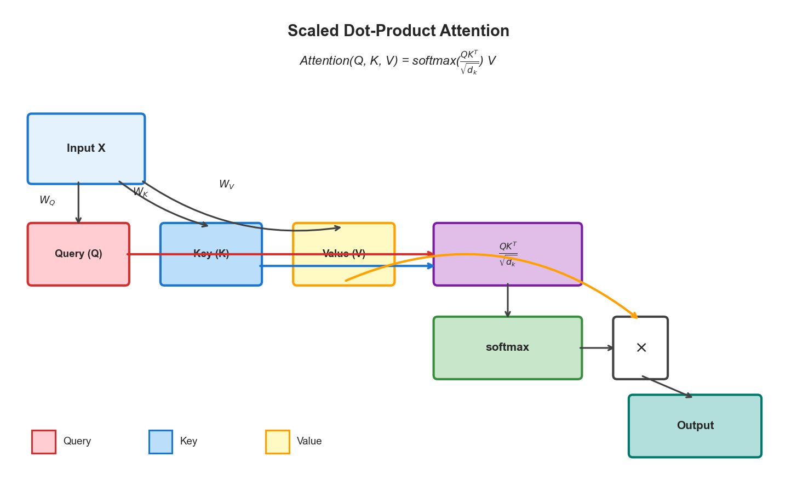
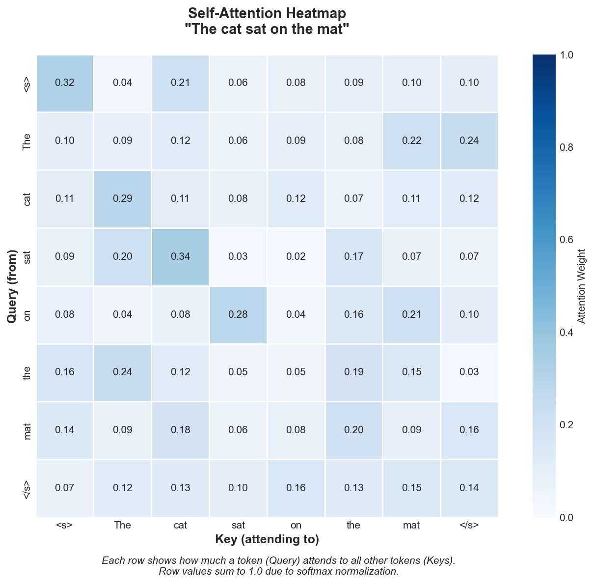
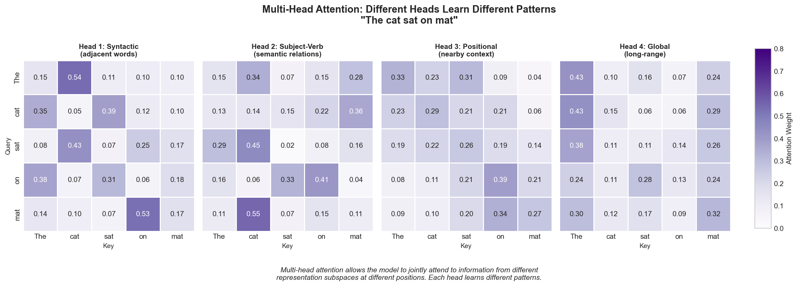
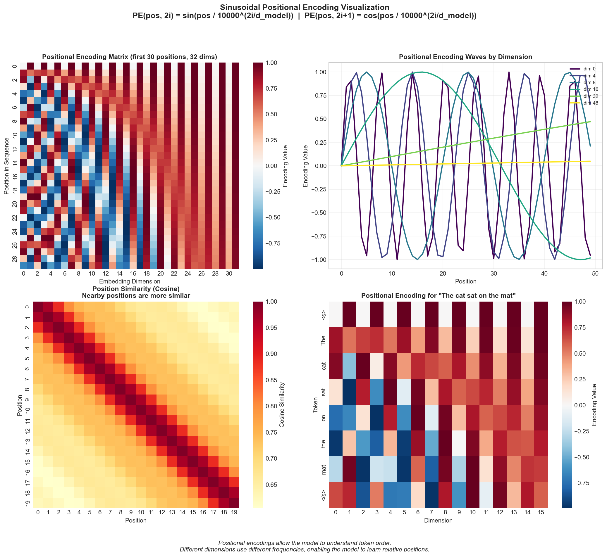
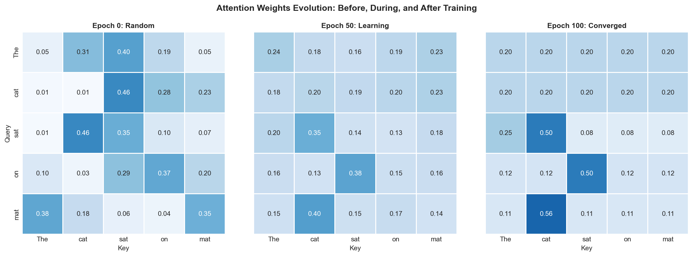
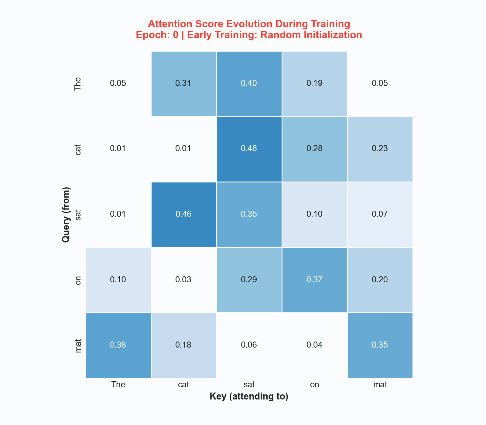

# Self-Attention Implementation

> **The mechanism that powers modern LLMs**

Self-attention is the revolutionary mechanism behind Transformers, GPT, BERT, and virtually every modern large language model. Understanding and implementing it from scratch is **essential** for ML interviews at top companies in 2024-2025.

## Why Self-Attention Matters

```
Interview Frequency: xxxxxxxxxx (Very High - Core ML Concept)
Companies: Google, OpenAI, Anthropic, Meta AI, DeepMind, Microsoft
Variants Asked: Scaled Dot-Product, Multi-Head, Causal/Masked, Cross-Attention
```

---

## Core Concepts

### The Attention Mechanism

Self-attention allows each position in a sequence to attend to all positions, capturing long-range dependencies that RNNs struggle with.



### The Scaled Dot-Product Attention Formula

$$\text{Attention}(Q, K, V) = \text{softmax}\left(\frac{QK^T}{\sqrt{d_k}}\right)V$$

Where:
- **Q** (Query): What we're looking for
- **K** (Key): What we match against
- **V** (Value): What we retrieve
- **d_k**: Dimension of keys (for scaling)

### Self-Attention Heatmap

The heatmap below shows how tokens attend to each other. Each row represents a query token, and each column represents a key token. Higher values indicate stronger attention.



### Multi-Head Attention

Different attention heads learn to focus on different types of relationships:



### Positional Encoding

Since attention is permutation-invariant, we add positional encodings to provide sequence order information:



### Attention Evolution During Training

Attention patterns evolve from random to meaningful during training:





*Animated visualization showing how attention weights evolve across training epochs.*

---

## Implementation 1: NumPy from Scratch

```python
"""
Self-Attention Implementation in NumPy
=====================================
Complete implementation of attention mechanisms from scratch.
No deep learning frameworks - pure NumPy for understanding.
"""

import numpy as np
from typing import Optional, Tuple, List


def softmax(x: np.ndarray, axis: int = -1) -> np.ndarray:
    """
    Numerically stable softmax implementation.

    Args:
        x: Input array
        axis: Axis along which to compute softmax

    Returns:
        Softmax probabilities
    """
    # Subtract max for numerical stability (prevents overflow)
    x_max = np.max(x, axis=axis, keepdims=True)
    exp_x = np.exp(x - x_max)
    return exp_x / np.sum(exp_x, axis=axis, keepdims=True)


def scaled_dot_product_attention(
    query: np.ndarray,
    key: np.ndarray,
    value: np.ndarray,
    mask: Optional[np.ndarray] = None,
    dropout_rate: float = 0.0,
    training: bool = True
) -> Tuple[np.ndarray, np.ndarray]:
    """
    Compute scaled dot-product attention.

    Args:
        query: Query tensor of shape (..., seq_len_q, d_k)
        key: Key tensor of shape (..., seq_len_k, d_k)
        value: Value tensor of shape (..., seq_len_k, d_v)
        mask: Optional mask tensor, 0 for positions to mask
        dropout_rate: Dropout probability for attention weights
        training: Whether in training mode (affects dropout)

    Returns:
        output: Attention output of shape (..., seq_len_q, d_v)
        attention_weights: Attention weights of shape (..., seq_len_q, seq_len_k)
    """
    d_k = query.shape[-1]

    # Compute attention scores: Q @ K^T
    scores = np.matmul(query, key.swapaxes(-2, -1))

    # Scale by sqrt(d_k) to prevent softmax saturation
    scores = scores / np.sqrt(d_k)

    # Apply mask if provided (for causal attention or padding)
    if mask is not None:
        scores = np.where(mask == 0, -1e9, scores)

    # Compute attention weights via softmax
    attention_weights = softmax(scores, axis=-1)

    # Apply dropout during training
    if training and dropout_rate > 0:
        dropout_mask = np.random.binomial(1, 1 - dropout_rate, attention_weights.shape)
        attention_weights = attention_weights * dropout_mask / (1 - dropout_rate)

    # Compute output: weights @ V
    output = np.matmul(attention_weights, value)

    return output, attention_weights


class LinearProjection:
    """Linear projection layer for Q, K, V transformations."""

    def __init__(self, d_in: int, d_out: int, use_bias: bool = True):
        self.d_in = d_in
        self.d_out = d_out
        self.use_bias = use_bias

        # Xavier/Glorot initialization
        limit = np.sqrt(6.0 / (d_in + d_out))
        self.W = np.random.uniform(-limit, limit, (d_in, d_out))
        self.b = np.zeros(d_out) if use_bias else None

    def forward(self, x: np.ndarray) -> np.ndarray:
        output = np.matmul(x, self.W)
        if self.use_bias:
            output = output + self.b
        return output

    def __call__(self, x: np.ndarray) -> np.ndarray:
        return self.forward(x)


class MultiHeadAttention:
    """
    Multi-Head Attention mechanism.

    MultiHead(Q, K, V) = Concat(head_1, ..., head_h) @ W_O
    where head_i = Attention(Q @ W_Q_i, K @ W_K_i, V @ W_V_i)
    """

    def __init__(
        self,
        d_model: int,
        num_heads: int,
        dropout_rate: float = 0.0,
        use_bias: bool = True
    ):
        assert d_model % num_heads == 0, "d_model must be divisible by num_heads"

        self.d_model = d_model
        self.num_heads = num_heads
        self.d_k = d_model // num_heads
        self.d_v = d_model // num_heads
        self.dropout_rate = dropout_rate

        # Combined projections for efficiency
        self.W_q = LinearProjection(d_model, d_model, use_bias)
        self.W_k = LinearProjection(d_model, d_model, use_bias)
        self.W_v = LinearProjection(d_model, d_model, use_bias)
        self.W_o = LinearProjection(d_model, d_model, use_bias)

    def split_heads(self, x: np.ndarray) -> np.ndarray:
        """Split last dimension into (num_heads, d_k)."""
        batch_size, seq_len, _ = x.shape
        x = x.reshape(batch_size, seq_len, self.num_heads, self.d_k)
        return x.transpose(0, 2, 1, 3)

    def merge_heads(self, x: np.ndarray) -> np.ndarray:
        """Merge heads back together."""
        batch_size, _, seq_len, _ = x.shape
        x = x.transpose(0, 2, 1, 3)
        return x.reshape(batch_size, seq_len, self.d_model)

    def forward(
        self,
        query: np.ndarray,
        key: np.ndarray,
        value: np.ndarray,
        mask: Optional[np.ndarray] = None,
        training: bool = True,
        return_attention_weights: bool = False
    ) -> np.ndarray:
        # Linear projections
        Q = self.W_q(query)
        K = self.W_k(key)
        V = self.W_v(value)

        # Split into multiple heads
        Q = self.split_heads(Q)
        K = self.split_heads(K)
        V = self.split_heads(V)

        # Scaled dot-product attention for all heads in parallel
        attn_output, attn_weights = scaled_dot_product_attention(
            Q, K, V, mask=mask, dropout_rate=self.dropout_rate, training=training
        )

        # Merge heads and final projection
        attn_output = self.merge_heads(attn_output)
        output = self.W_o(attn_output)

        if return_attention_weights:
            return output, attn_weights
        return output

    def __call__(self, query, key, value, mask=None, training=True, return_attention_weights=False):
        return self.forward(query, key, value, mask, training, return_attention_weights)


# =============================================================================
# Positional Encoding
# =============================================================================

def sinusoidal_positional_encoding(seq_len: int, d_model: int) -> np.ndarray:
    """
    Generate sinusoidal positional encodings.

    PE(pos, 2i) = sin(pos / 10000^(2i/d_model))
    PE(pos, 2i+1) = cos(pos / 10000^(2i/d_model))
    """
    position = np.arange(seq_len)[:, np.newaxis]
    div_term = np.exp(np.arange(0, d_model, 2) * (-np.log(10000.0) / d_model))

    pe = np.zeros((seq_len, d_model))
    pe[:, 0::2] = np.sin(position * div_term)
    pe[:, 1::2] = np.cos(position * div_term)

    return pe


class PositionalEncoding:
    """Adds positional information to embeddings."""

    def __init__(self, d_model: int, max_seq_len: int = 5000, dropout_rate: float = 0.1):
        self.d_model = d_model
        self.dropout_rate = dropout_rate
        self.pe = sinusoidal_positional_encoding(max_seq_len, d_model)[np.newaxis, :, :]

    def forward(self, x: np.ndarray, training: bool = True) -> np.ndarray:
        seq_len = x.shape[1]
        x = x + self.pe[:, :seq_len, :]

        if training and self.dropout_rate > 0:
            dropout_mask = np.random.binomial(1, 1 - self.dropout_rate, x.shape)
            x = x * dropout_mask / (1 - self.dropout_rate)

        return x

    def __call__(self, x, training=True):
        return self.forward(x, training)


# =============================================================================
# Attention Masks
# =============================================================================

def create_padding_mask(seq: np.ndarray, pad_token: int = 0) -> np.ndarray:
    """Create padding mask: 1 for real tokens, 0 for padding."""
    mask = (seq != pad_token).astype(np.float32)
    return mask[:, np.newaxis, np.newaxis, :]


def create_causal_mask(seq_len: int) -> np.ndarray:
    """Create causal (look-ahead) mask for autoregressive models."""
    mask = np.tril(np.ones((seq_len, seq_len)))
    return mask[np.newaxis, np.newaxis, :, :]


def create_combined_mask(seq: np.ndarray, pad_token: int = 0) -> np.ndarray:
    """Create combined padding and causal mask."""
    seq_len = seq.shape[1]
    padding_mask = create_padding_mask(seq, pad_token)
    causal_mask = create_causal_mask(seq_len)
    return np.minimum(padding_mask, causal_mask)
```

---

## Implementation 2: PyTorch Production-Ready

```python
"""
Self-Attention Implementation in PyTorch
========================================
Production-ready implementation with GPU support.
"""

import torch
import torch.nn as nn
import torch.nn.functional as F
import math
from typing import Optional, Tuple


class ScaledDotProductAttention(nn.Module):
    """Attention(Q, K, V) = softmax(QK^T / sqrt(d_k)) V"""

    def __init__(self, dropout: float = 0.0):
        super().__init__()
        self.dropout = nn.Dropout(dropout)

    def forward(
        self,
        query: torch.Tensor,
        key: torch.Tensor,
        value: torch.Tensor,
        mask: Optional[torch.Tensor] = None,
        return_attention: bool = False
    ) -> Tuple[torch.Tensor, Optional[torch.Tensor]]:
        d_k = query.size(-1)

        scores = torch.matmul(query, key.transpose(-2, -1)) / math.sqrt(d_k)

        if mask is not None:
            scores = scores.masked_fill(mask == 0, float('-inf'))

        attention_weights = F.softmax(scores, dim=-1)
        attention_weights = self.dropout(attention_weights)

        output = torch.matmul(attention_weights, value)

        if return_attention:
            return output, attention_weights
        return output, None


class MultiHeadAttention(nn.Module):
    """Multi-Head Attention mechanism."""

    def __init__(
        self,
        d_model: int,
        num_heads: int,
        dropout: float = 0.0,
        bias: bool = True
    ):
        super().__init__()

        assert d_model % num_heads == 0

        self.d_model = d_model
        self.num_heads = num_heads
        self.d_k = d_model // num_heads

        self.W_q = nn.Linear(d_model, d_model, bias=bias)
        self.W_k = nn.Linear(d_model, d_model, bias=bias)
        self.W_v = nn.Linear(d_model, d_model, bias=bias)
        self.W_o = nn.Linear(d_model, d_model, bias=bias)

        self.attention = ScaledDotProductAttention(dropout)
        self._init_weights()

    def _init_weights(self):
        for module in [self.W_q, self.W_k, self.W_v, self.W_o]:
            nn.init.xavier_uniform_(module.weight)
            if module.bias is not None:
                nn.init.zeros_(module.bias)

    def forward(
        self,
        query: torch.Tensor,
        key: torch.Tensor,
        value: torch.Tensor,
        mask: Optional[torch.Tensor] = None,
        return_attention: bool = False
    ) -> Tuple[torch.Tensor, Optional[torch.Tensor]]:
        batch_size = query.size(0)

        Q = self.W_q(query).view(batch_size, -1, self.num_heads, self.d_k).transpose(1, 2)
        K = self.W_k(key).view(batch_size, -1, self.num_heads, self.d_k).transpose(1, 2)
        V = self.W_v(value).view(batch_size, -1, self.num_heads, self.d_k).transpose(1, 2)

        attn_output, attn_weights = self.attention(Q, K, V, mask, return_attention)

        attn_output = attn_output.transpose(1, 2).contiguous().view(batch_size, -1, self.d_model)
        output = self.W_o(attn_output)

        return output, attn_weights


class CausalSelfAttention(nn.Module):
    """Causal Self-Attention for autoregressive models (GPT-style)."""

    def __init__(
        self,
        d_model: int,
        num_heads: int,
        max_seq_len: int = 2048,
        dropout: float = 0.0,
        bias: bool = True
    ):
        super().__init__()

        self.mha = MultiHeadAttention(d_model, num_heads, dropout, bias)

        mask = torch.tril(torch.ones(max_seq_len, max_seq_len))
        mask = mask.view(1, 1, max_seq_len, max_seq_len)
        self.register_buffer('causal_mask', mask)

    def forward(self, x: torch.Tensor, return_attention: bool = False):
        seq_len = x.size(1)
        mask = self.causal_mask[:, :, :seq_len, :seq_len]
        return self.mha(x, x, x, mask, return_attention)


class PositionalEncoding(nn.Module):
    """Sinusoidal Positional Encoding."""

    def __init__(self, d_model: int, max_seq_len: int = 5000, dropout: float = 0.1):
        super().__init__()

        self.dropout = nn.Dropout(dropout)

        pe = torch.zeros(max_seq_len, d_model)
        position = torch.arange(0, max_seq_len, dtype=torch.float).unsqueeze(1)
        div_term = torch.exp(
            torch.arange(0, d_model, 2).float() * (-math.log(10000.0) / d_model)
        )

        pe[:, 0::2] = torch.sin(position * div_term)
        pe[:, 1::2] = torch.cos(position * div_term)

        pe = pe.unsqueeze(0)
        self.register_buffer('pe', pe)

    def forward(self, x: torch.Tensor) -> torch.Tensor:
        seq_len = x.size(1)
        x = x + self.pe[:, :seq_len, :]
        return self.dropout(x)


class RotaryPositionalEmbedding(nn.Module):
    """Rotary Position Embedding (RoPE) - used in LLaMA, GPT-NeoX."""

    def __init__(self, d_model: int, max_seq_len: int = 2048, base: int = 10000):
        super().__init__()

        self.d_model = d_model
        inv_freq = 1.0 / (base ** (torch.arange(0, d_model, 2).float() / d_model))
        self.register_buffer('inv_freq', inv_freq)
        self._build_cache(max_seq_len)

    def _build_cache(self, seq_len: int):
        t = torch.arange(seq_len, device=self.inv_freq.device).type_as(self.inv_freq)
        freqs = torch.einsum('i,j->ij', t, self.inv_freq)
        emb = torch.cat((freqs, freqs), dim=-1)
        self.register_buffer('cos_cached', emb.cos()[None, None, :, :])
        self.register_buffer('sin_cached', emb.sin()[None, None, :, :])

    def rotate_half(self, x: torch.Tensor) -> torch.Tensor:
        x1, x2 = x.chunk(2, dim=-1)
        return torch.cat((-x2, x1), dim=-1)

    def forward(self, q: torch.Tensor, k: torch.Tensor, seq_len: int):
        cos = self.cos_cached[:, :, :seq_len, :]
        sin = self.sin_cached[:, :, :seq_len, :]

        q_embed = (q * cos) + (self.rotate_half(q) * sin)
        k_embed = (k * cos) + (self.rotate_half(k) * sin)

        return q_embed, k_embed


class TransformerBlock(nn.Module):
    """Complete Transformer block with self-attention and feed-forward."""

    def __init__(
        self,
        d_model: int,
        num_heads: int,
        d_ff: int,
        dropout: float = 0.1,
        activation: str = 'gelu'
    ):
        super().__init__()

        self.attention = MultiHeadAttention(d_model, num_heads, dropout)
        self.ln1 = nn.LayerNorm(d_model)

        self.ffn = nn.Sequential(
            nn.Linear(d_model, d_ff),
            nn.GELU() if activation == 'gelu' else nn.ReLU(),
            nn.Dropout(dropout),
            nn.Linear(d_ff, d_model),
            nn.Dropout(dropout)
        )
        self.ln2 = nn.LayerNorm(d_model)
        self.dropout = nn.Dropout(dropout)

    def forward(self, x: torch.Tensor, mask: Optional[torch.Tensor] = None):
        attn_output, _ = self.attention(self.ln1(x), self.ln1(x), self.ln1(x), mask)
        x = x + self.dropout(attn_output)
        x = x + self.ffn(self.ln2(x))
        return x


# =============================================================================
# Efficient Attention Variants
# =============================================================================

class FlashAttention(nn.Module):
    """Flash Attention using PyTorch 2.0+ optimizations."""

    def __init__(self, d_model: int, num_heads: int, dropout: float = 0.0):
        super().__init__()

        self.d_model = d_model
        self.num_heads = num_heads
        self.d_k = d_model // num_heads

        self.W_qkv = nn.Linear(d_model, 3 * d_model)
        self.W_o = nn.Linear(d_model, d_model)
        self.dropout = nn.Dropout(dropout)

    def forward(self, x: torch.Tensor, mask: Optional[torch.Tensor] = None):
        batch_size, seq_len, _ = x.shape

        qkv = self.W_qkv(x).view(batch_size, seq_len, 3, self.num_heads, self.d_k)
        qkv = qkv.permute(2, 0, 3, 1, 4)
        Q, K, V = qkv[0], qkv[1], qkv[2]

        attn_output = F.scaled_dot_product_attention(
            Q, K, V,
            attn_mask=mask,
            dropout_p=self.dropout.p if self.training else 0.0,
            is_causal=mask is None
        )

        attn_output = attn_output.transpose(1, 2).contiguous().view(batch_size, seq_len, self.d_model)
        return self.W_o(attn_output)


class GroupedQueryAttention(nn.Module):
    """Grouped Query Attention (GQA) - used in LLaMA 2."""

    def __init__(
        self,
        d_model: int,
        num_query_heads: int,
        num_kv_heads: int,
        dropout: float = 0.0
    ):
        super().__init__()

        assert num_query_heads % num_kv_heads == 0

        self.d_model = d_model
        self.num_query_heads = num_query_heads
        self.num_kv_heads = num_kv_heads
        self.num_groups = num_query_heads // num_kv_heads
        self.d_k = d_model // num_query_heads

        self.W_q = nn.Linear(d_model, d_model, bias=False)
        self.W_k = nn.Linear(d_model, num_kv_heads * self.d_k, bias=False)
        self.W_v = nn.Linear(d_model, num_kv_heads * self.d_k, bias=False)
        self.W_o = nn.Linear(d_model, d_model, bias=False)

        self.dropout = nn.Dropout(dropout)

    def forward(self, x: torch.Tensor, mask: Optional[torch.Tensor] = None):
        batch_size, seq_len, _ = x.shape

        Q = self.W_q(x).view(batch_size, seq_len, self.num_query_heads, self.d_k).transpose(1, 2)
        K = self.W_k(x).view(batch_size, seq_len, self.num_kv_heads, self.d_k).transpose(1, 2)
        V = self.W_v(x).view(batch_size, seq_len, self.num_kv_heads, self.d_k).transpose(1, 2)

        K = K.repeat_interleave(self.num_groups, dim=1)
        V = V.repeat_interleave(self.num_groups, dim=1)

        scores = torch.matmul(Q, K.transpose(-2, -1)) / math.sqrt(self.d_k)

        if mask is not None:
            scores = scores.masked_fill(mask == 0, float('-inf'))

        attn_weights = F.softmax(scores, dim=-1)
        attn_weights = self.dropout(attn_weights)

        output = torch.matmul(attn_weights, V)
        output = output.transpose(1, 2).contiguous().view(batch_size, seq_len, self.d_model)

        return self.W_o(output)
```

---

## Interview Questions and Solutions

### Question 1: Why Scale by sqrt(d_k)?

```python
"""
Q: Why do we scale the dot product by sqrt(d_k)?
A: To prevent softmax saturation as dimension grows.
"""

import numpy as np

def demonstrate_scaling_importance():
    np.random.seed(42)
    dims = [8, 64, 512, 2048]

    print("Dot product statistics for unit Gaussian vectors:")
    print("-" * 50)

    for d in dims:
        q = np.random.randn(1000, d)
        k = np.random.randn(1000, d)

        dots = np.sum(q * k, axis=1)
        dots_scaled = dots / np.sqrt(d)

        print(f"d_k = {d:4d}: "
              f"unscaled std = {dots.std():.2f}, "
              f"scaled std = {dots_scaled.std():.2f}")

    print("\nKey insight: Variance of dot product is proportional to d_k")
    print("Scaling by sqrt(d_k) keeps variance ~1, preventing softmax saturation")

demonstrate_scaling_importance()
```

### Question 2: Implement Attention Without nn.Module

```python
"""
Q: Implement multi-head attention using only basic PyTorch operations.
"""

import torch
import torch.nn.functional as F
import math

def multi_head_attention_manual(
    query, key, value, num_heads, W_q, W_k, W_v, W_o, mask=None
):
    batch_size, seq_len_q, d_model = query.shape
    d_k = d_model // num_heads

    # Step 1: Linear projections
    Q = torch.matmul(query, W_q)
    K = torch.matmul(key, W_k)
    V = torch.matmul(value, W_v)

    # Step 2: Reshape to separate heads
    Q = Q.view(batch_size, seq_len_q, num_heads, d_k).transpose(1, 2)
    K = K.view(batch_size, -1, num_heads, d_k).transpose(1, 2)
    V = V.view(batch_size, -1, num_heads, d_k).transpose(1, 2)

    # Step 3: Compute attention scores
    scores = torch.matmul(Q, K.transpose(-2, -1)) / math.sqrt(d_k)

    # Step 4: Apply mask
    if mask is not None:
        scores = scores.masked_fill(mask == 0, float('-inf'))

    # Step 5: Softmax and apply to values
    attention_weights = F.softmax(scores, dim=-1)
    attn_output = torch.matmul(attention_weights, V)

    # Step 6: Reshape and project
    attn_output = attn_output.transpose(1, 2).contiguous().view(batch_size, seq_len_q, d_model)
    return torch.matmul(attn_output, W_o)
```

### Question 3: Complexity Analysis

```
SELF-ATTENTION COMPLEXITY:
==========================

Given: sequence length n, model dimension d

Time Complexity: O(n^2 * d)
- QK^T computation: O(n * n * d)
- Softmax: O(n^2)
- Attention @ V: O(n^2 * d)

Space Complexity: O(n^2 + n*d)
- Attention matrix: O(n^2)
- Q, K, V matrices: O(n * d) each

EFFICIENT ATTENTION VARIANTS:
=============================

1. Flash Attention: O(n^2 * d) time but O(n) memory!
2. Linear Attention: O(n * d^2) time via kernel trick
3. Sparse Attention: O(n * k) via local windows
4. GQA: Reduce KV cache by sharing across heads
```

---

## Common Interview Patterns

### Pattern 1: Attention Score Computation (Most Common!)

```python
def compute_attention_scores(query, key, mask=None):
    d_k = query.shape[-1]

    # Step 1: Dot product
    scores = np.matmul(query, key.swapaxes(-2, -1))

    # Step 2: Scale (CRITICAL - explain why!)
    scores = scores / np.sqrt(d_k)

    # Step 3: Mask (explain causal vs padding)
    if mask is not None:
        scores = np.where(mask == 0, -1e9, scores)

    # Step 4: Softmax
    return softmax(scores, axis=-1)
```

### Pattern 2: KV-Cache for Inference

```python
class CachedAttention:
    """Attention with KV-cache for efficient autoregressive generation."""

    def __init__(self, d_model, num_heads):
        self.d_model = d_model
        self.num_heads = num_heads
        self.d_k = d_model // num_heads
        self.k_cache = None
        self.v_cache = None

    def forward(self, x, W_q, W_k, W_v, W_o, use_cache=True):
        batch_size, seq_len, _ = x.shape

        # Always compute Q for current input
        Q = np.matmul(x, W_q).reshape(batch_size, seq_len, self.num_heads, self.d_k)
        Q = Q.transpose(0, 2, 1, 3)

        if use_cache and self.k_cache is not None:
            # Only compute K, V for new tokens
            K_new = np.matmul(x, W_k).reshape(batch_size, seq_len, self.num_heads, self.d_k)
            V_new = np.matmul(x, W_v).reshape(batch_size, seq_len, self.num_heads, self.d_k)
            K_new, V_new = K_new.transpose(0, 2, 1, 3), V_new.transpose(0, 2, 1, 3)

            # Append to cache
            K = np.concatenate([self.k_cache, K_new], axis=2)
            V = np.concatenate([self.v_cache, V_new], axis=2)
            self.k_cache, self.v_cache = K, V
        else:
            K = np.matmul(x, W_k).reshape(batch_size, seq_len, self.num_heads, self.d_k)
            V = np.matmul(x, W_v).reshape(batch_size, seq_len, self.num_heads, self.d_k)
            K, V = K.transpose(0, 2, 1, 3), V.transpose(0, 2, 1, 3)
            if use_cache:
                self.k_cache, self.v_cache = K, V

        # Standard attention
        scores = np.matmul(Q, K.swapaxes(-2, -1)) / np.sqrt(self.d_k)
        weights = softmax(scores, axis=-1)
        output = np.matmul(weights, V)

        output = output.transpose(0, 2, 1, 3).reshape(batch_size, seq_len, self.d_model)
        return np.matmul(output, W_o)

    def clear_cache(self):
        self.k_cache = self.v_cache = None
```

---

## Quick Reference Card

```
+===================================================================+
|                    SELF-ATTENTION CHEAT SHEET                     |
+===================================================================+
|                                                                   |
|  FORMULA:                                                         |
|  Attention(Q,K,V) = softmax(QK^T / sqrt(d_k)) * V                |
|                                                                   |
|  DIMENSIONS:                                                      |
|  Q, K: (batch, heads, seq, d_k)                                  |
|  V:    (batch, heads, seq, d_v)                                  |
|  QK^T: (batch, heads, seq_q, seq_k)                              |
|  Out:  (batch, heads, seq_q, d_v)                                |
|                                                                   |
|  WHY SCALE?                                                       |
|  - Dot products grow with dimension                              |
|  - Large values -> softmax saturation -> vanishing gradients     |
|  - Scaling keeps variance ~1                                      |
|                                                                   |
|  MASK TYPES:                                                      |
|  - Padding mask: hide PAD tokens                                 |
|  - Causal mask: prevent attending to future (decoder)            |
|  - Combined: both padding + causal                               |
|                                                                   |
|  COMPLEXITY:                                                      |
|  - Time: O(n^2 * d) - quadratic in sequence length               |
|  - Space: O(n^2) for attention matrix                            |
|                                                                   |
|  EFFICIENT VARIANTS:                                              |
|  - Flash Attention: O(n) memory, same compute                    |
|  - Linear Attention: O(n) time via kernel trick                  |
|  - Sparse Attention: O(n*k) via local windows                    |
|  - GQA: reduce KV cache by sharing across heads                  |
|                                                                   |
|  POSITIONAL ENCODING:                                             |
|  - Sinusoidal: fixed, generalizes to longer sequences            |
|  - Learned: more flexible, limited to trained length             |
|  - RoPE: rotary, best of both worlds (LLaMA, etc.)              |
|                                                                   |
+===================================================================+
```

---

## Key Takeaways for Interviews

1. **Know the Formula Cold**: `softmax(QK^T / sqrt(d_k)) * V`

2. **Explain Scaling**: Prevents softmax saturation, maintains gradient flow

3. **Multi-Head Purpose**: Different heads learn different relationship types

4. **Mask Types**: Padding (hide PAD tokens) vs Causal (hide future)

5. **Complexity**: O(n^2) in sequence length - know the trade-offs

6. **Modern Variants**: Flash Attention, GQA, RoPE - know what they solve

7. **KV-Cache**: Critical for efficient inference in autoregressive models

8. **Code It**: Be able to implement from scratch in NumPy AND PyTorch

---

## Further Reading

- [Attention Is All You Need](https://arxiv.org/abs/1706.03762) - Original Transformer paper
- [Flash Attention](https://arxiv.org/abs/2205.14135) - Memory-efficient attention
- [RoFormer](https://arxiv.org/abs/2104.09864) - Rotary Position Embedding
- [GQA Paper](https://arxiv.org/abs/2305.13245) - Grouped Query Attention
