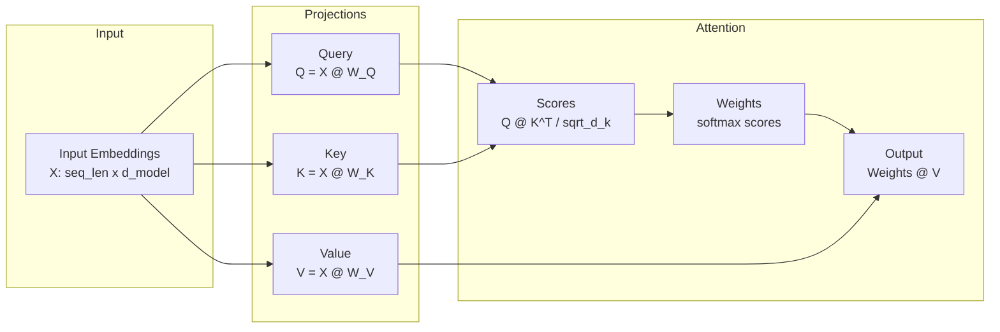
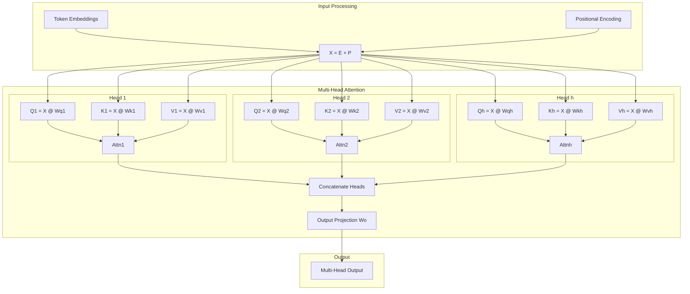

# Self-Attention Implementation

> **The mechanism that powers modern LLMs**

Self-attention is the revolutionary mechanism behind Transformers, GPT, BERT, and virtually every modern large language model. Understanding and implementing it from scratch is **essential** for ML interviews at top companies in 2024-2025.

## Why Self-Attention Matters

```
Interview Frequency: ██████████ (Very High - Core ML Concept)
Companies: Google, OpenAI, Anthropic, Meta AI, DeepMind, Microsoft
Variants Asked: Scaled Dot-Product, Multi-Head, Causal/Masked, Cross-Attention
```

---

## Core Concepts

### The Attention Mechanism

Self-attention allows each position in a sequence to attend to all positions, capturing long-range dependencies that RNNs struggle with.



### The Scaled Dot-Product Attention Formula

$$\text{Attention}(Q, K, V) = \text{softmax}\left(\frac{QK^T}{\sqrt{d_k}}\right)V$$

Where:
- **Q** (Query): What we're looking for
- **K** (Key): What we match against
- **V** (Value): What we retrieve
- **d_k**: Dimension of keys (for scaling)

---

## Implementation 1: NumPy from Scratch

```python
"""
Self-Attention Implementation in NumPy
=====================================
Complete implementation of attention mechanisms from scratch.
No deep learning frameworks - pure NumPy for understanding.
"""

import numpy as np
from typing import Optional, Tuple, List


def softmax(x: np.ndarray, axis: int = -1) -> np.ndarray:
    """
    Numerically stable softmax implementation.

    Args:
        x: Input array
        axis: Axis along which to compute softmax

    Returns:
        Softmax probabilities
    """
    # Subtract max for numerical stability (prevents overflow)
    x_max = np.max(x, axis=axis, keepdims=True)
    exp_x = np.exp(x - x_max)
    return exp_x / np.sum(exp_x, axis=axis, keepdims=True)


def scaled_dot_product_attention(
    query: np.ndarray,
    key: np.ndarray,
    value: np.ndarray,
    mask: Optional[np.ndarray] = None,
    dropout_rate: float = 0.0,
    training: bool = True
) -> Tuple[np.ndarray, np.ndarray]:
    """
    Compute scaled dot-product attention.

    This is the core attention operation used in Transformers.

    Args:
        query: Query tensor of shape (..., seq_len_q, d_k)
        key: Key tensor of shape (..., seq_len_k, d_k)
        value: Value tensor of shape (..., seq_len_k, d_v)
        mask: Optional mask tensor, 0 for positions to mask
        dropout_rate: Dropout probability for attention weights
        training: Whether in training mode (affects dropout)

    Returns:
        output: Attention output of shape (..., seq_len_q, d_v)
        attention_weights: Attention weights of shape (..., seq_len_q, seq_len_k)

    Example:
        >>> q = np.random.randn(2, 4, 64)  # batch=2, seq=4, d_k=64
        >>> k = np.random.randn(2, 4, 64)
        >>> v = np.random.randn(2, 4, 64)
        >>> output, weights = scaled_dot_product_attention(q, k, v)
        >>> print(output.shape)  # (2, 4, 64)
        >>> print(weights.shape)  # (2, 4, 4)
    """
    # Get dimension for scaling
    d_k = query.shape[-1]

    # Compute attention scores: Q @ K^T
    # Shape: (..., seq_len_q, seq_len_k)
    scores = np.matmul(query, key.swapaxes(-2, -1))

    # Scale by sqrt(d_k) to prevent softmax saturation
    # Without scaling, dot products grow large with d_k,
    # pushing softmax into regions with tiny gradients
    scores = scores / np.sqrt(d_k)

    # Apply mask if provided (for causal attention or padding)
    if mask is not None:
        # Use large negative value instead of -inf for numerical stability
        scores = np.where(mask == 0, -1e9, scores)

    # Compute attention weights via softmax
    attention_weights = softmax(scores, axis=-1)

    # Apply dropout during training
    if training and dropout_rate > 0:
        dropout_mask = np.random.binomial(1, 1 - dropout_rate, attention_weights.shape)
        attention_weights = attention_weights * dropout_mask / (1 - dropout_rate)

    # Compute output: weights @ V
    # Shape: (..., seq_len_q, d_v)
    output = np.matmul(attention_weights, value)

    return output, attention_weights


class LinearProjection:
    """
    Linear projection layer for Q, K, V transformations.

    Implements: output = input @ W + b
    """

    def __init__(self, d_in: int, d_out: int, use_bias: bool = True):
        """
        Initialize linear projection.

        Args:
            d_in: Input dimension
            d_out: Output dimension
            use_bias: Whether to include bias term
        """
        self.d_in = d_in
        self.d_out = d_out
        self.use_bias = use_bias

        # Xavier/Glorot initialization for stable gradients
        limit = np.sqrt(6.0 / (d_in + d_out))
        self.W = np.random.uniform(-limit, limit, (d_in, d_out))

        if use_bias:
            self.b = np.zeros(d_out)
        else:
            self.b = None

        # For storing gradients during backprop
        self.grad_W = None
        self.grad_b = None
        self.last_input = None

    def forward(self, x: np.ndarray) -> np.ndarray:
        """
        Forward pass.

        Args:
            x: Input of shape (..., d_in)

        Returns:
            Output of shape (..., d_out)
        """
        self.last_input = x
        output = np.matmul(x, self.W)
        if self.use_bias:
            output = output + self.b
        return output

    def backward(self, grad_output: np.ndarray) -> np.ndarray:
        """
        Backward pass.

        Args:
            grad_output: Gradient w.r.t. output, shape (..., d_out)

        Returns:
            Gradient w.r.t. input, shape (..., d_in)
        """
        # Gradient w.r.t. weights
        # Reshape for batch matrix multiply
        x_flat = self.last_input.reshape(-1, self.d_in)
        grad_flat = grad_output.reshape(-1, self.d_out)
        self.grad_W = np.matmul(x_flat.T, grad_flat)

        # Gradient w.r.t. bias
        if self.use_bias:
            self.grad_b = np.sum(grad_output, axis=tuple(range(grad_output.ndim - 1)))

        # Gradient w.r.t. input
        grad_input = np.matmul(grad_output, self.W.T)

        return grad_input

    def __call__(self, x: np.ndarray) -> np.ndarray:
        return self.forward(x)


class SingleHeadAttention:
    """
    Single-head self-attention mechanism.

    This is the building block for multi-head attention.
    """

    def __init__(self, d_model: int, d_k: int, d_v: int, dropout_rate: float = 0.0):
        """
        Initialize single-head attention.

        Args:
            d_model: Model dimension (input/output size)
            d_k: Key/Query dimension
            d_v: Value dimension
            dropout_rate: Dropout probability
        """
        self.d_model = d_model
        self.d_k = d_k
        self.d_v = d_v
        self.dropout_rate = dropout_rate

        # Linear projections for Q, K, V
        self.W_q = LinearProjection(d_model, d_k)
        self.W_k = LinearProjection(d_model, d_k)
        self.W_v = LinearProjection(d_model, d_v)

        # Output projection
        self.W_o = LinearProjection(d_v, d_model)

        # Cache for backward pass
        self.cache = {}

    def forward(
        self,
        query: np.ndarray,
        key: np.ndarray,
        value: np.ndarray,
        mask: Optional[np.ndarray] = None,
        training: bool = True
    ) -> Tuple[np.ndarray, np.ndarray]:
        """
        Forward pass of single-head attention.

        Args:
            query: Query input of shape (batch, seq_len_q, d_model)
            key: Key input of shape (batch, seq_len_k, d_model)
            value: Value input of shape (batch, seq_len_k, d_model)
            mask: Optional attention mask
            training: Training mode flag

        Returns:
            output: Attention output of shape (batch, seq_len_q, d_model)
            attention_weights: Weights of shape (batch, seq_len_q, seq_len_k)
        """
        # Project to Q, K, V
        Q = self.W_q(query)   # (batch, seq_len_q, d_k)
        K = self.W_k(key)     # (batch, seq_len_k, d_k)
        V = self.W_v(value)   # (batch, seq_len_k, d_v)

        # Compute attention
        attn_output, attn_weights = scaled_dot_product_attention(
            Q, K, V, mask=mask, dropout_rate=self.dropout_rate, training=training
        )

        # Project output
        output = self.W_o(attn_output)  # (batch, seq_len_q, d_model)

        # Cache for backward pass
        self.cache = {
            'Q': Q, 'K': K, 'V': V,
            'attn_weights': attn_weights,
            'attn_output': attn_output
        }

        return output, attn_weights

    def __call__(self, query, key, value, mask=None, training=True):
        return self.forward(query, key, value, mask, training)


class MultiHeadAttention:
    """
    Multi-Head Attention mechanism.

    Allows the model to jointly attend to information from different
    representation subspaces at different positions.

    MultiHead(Q, K, V) = Concat(head_1, ..., head_h) @ W_O
    where head_i = Attention(Q @ W_Q_i, K @ W_K_i, V @ W_V_i)
    """

    def __init__(
        self,
        d_model: int,
        num_heads: int,
        dropout_rate: float = 0.0,
        use_bias: bool = True
    ):
        """
        Initialize multi-head attention.

        Args:
            d_model: Model dimension
            num_heads: Number of attention heads
            dropout_rate: Dropout probability
            use_bias: Whether to use bias in projections
        """
        assert d_model % num_heads == 0, "d_model must be divisible by num_heads"

        self.d_model = d_model
        self.num_heads = num_heads
        self.d_k = d_model // num_heads
        self.d_v = d_model // num_heads
        self.dropout_rate = dropout_rate

        # Combined projections for efficiency
        # Instead of h separate W_Q matrices, use one big matrix
        self.W_q = LinearProjection(d_model, d_model, use_bias)
        self.W_k = LinearProjection(d_model, d_model, use_bias)
        self.W_v = LinearProjection(d_model, d_model, use_bias)
        self.W_o = LinearProjection(d_model, d_model, use_bias)

        self.cache = {}

    def split_heads(self, x: np.ndarray) -> np.ndarray:
        """
        Split the last dimension into (num_heads, d_k).

        Args:
            x: Input of shape (batch, seq_len, d_model)

        Returns:
            Output of shape (batch, num_heads, seq_len, d_k)
        """
        batch_size, seq_len, _ = x.shape

        # Reshape: (batch, seq_len, d_model) -> (batch, seq_len, num_heads, d_k)
        x = x.reshape(batch_size, seq_len, self.num_heads, self.d_k)

        # Transpose: (batch, seq_len, num_heads, d_k) -> (batch, num_heads, seq_len, d_k)
        return x.transpose(0, 2, 1, 3)

    def merge_heads(self, x: np.ndarray) -> np.ndarray:
        """
        Merge heads back together.

        Args:
            x: Input of shape (batch, num_heads, seq_len, d_k)

        Returns:
            Output of shape (batch, seq_len, d_model)
        """
        batch_size, _, seq_len, _ = x.shape

        # Transpose: (batch, num_heads, seq_len, d_k) -> (batch, seq_len, num_heads, d_k)
        x = x.transpose(0, 2, 1, 3)

        # Reshape: (batch, seq_len, num_heads, d_k) -> (batch, seq_len, d_model)
        return x.reshape(batch_size, seq_len, self.d_model)

    def forward(
        self,
        query: np.ndarray,
        key: np.ndarray,
        value: np.ndarray,
        mask: Optional[np.ndarray] = None,
        training: bool = True,
        return_attention_weights: bool = False
    ) -> np.ndarray:
        """
        Forward pass of multi-head attention.

        Args:
            query: Query of shape (batch, seq_len_q, d_model)
            key: Key of shape (batch, seq_len_k, d_model)
            value: Value of shape (batch, seq_len_k, d_model)
            mask: Optional mask of shape (batch, 1, 1, seq_len_k) or
                  (batch, 1, seq_len_q, seq_len_k) for causal mask
            training: Training mode
            return_attention_weights: Whether to return attention weights

        Returns:
            output: Shape (batch, seq_len_q, d_model)
            attention_weights: (optional) Shape (batch, num_heads, seq_len_q, seq_len_k)
        """
        batch_size = query.shape[0]

        # Linear projections
        Q = self.W_q(query)  # (batch, seq_len_q, d_model)
        K = self.W_k(key)    # (batch, seq_len_k, d_model)
        V = self.W_v(value)  # (batch, seq_len_k, d_model)

        # Split into multiple heads
        Q = self.split_heads(Q)  # (batch, num_heads, seq_len_q, d_k)
        K = self.split_heads(K)  # (batch, num_heads, seq_len_k, d_k)
        V = self.split_heads(V)  # (batch, num_heads, seq_len_k, d_v)

        # Scaled dot-product attention for all heads in parallel
        attn_output, attn_weights = scaled_dot_product_attention(
            Q, K, V, mask=mask, dropout_rate=self.dropout_rate, training=training
        )
        # attn_output: (batch, num_heads, seq_len_q, d_v)
        # attn_weights: (batch, num_heads, seq_len_q, seq_len_k)

        # Merge heads
        attn_output = self.merge_heads(attn_output)  # (batch, seq_len_q, d_model)

        # Final linear projection
        output = self.W_o(attn_output)  # (batch, seq_len_q, d_model)

        # Cache for backward pass
        self.cache = {
            'Q': Q, 'K': K, 'V': V,
            'attn_weights': attn_weights,
            'attn_output': attn_output
        }

        if return_attention_weights:
            return output, attn_weights
        return output

    def __call__(self, query, key, value, mask=None, training=True, return_attention_weights=False):
        return self.forward(query, key, value, mask, training, return_attention_weights)


# =============================================================================
# Positional Encoding
# =============================================================================

def sinusoidal_positional_encoding(seq_len: int, d_model: int) -> np.ndarray:
    """
    Generate sinusoidal positional encodings.

    PE(pos, 2i) = sin(pos / 10000^(2i/d_model))
    PE(pos, 2i+1) = cos(pos / 10000^(2i/d_model))

    Args:
        seq_len: Maximum sequence length
        d_model: Model dimension

    Returns:
        Positional encoding of shape (seq_len, d_model)
    """
    position = np.arange(seq_len)[:, np.newaxis]  # (seq_len, 1)
    div_term = np.exp(np.arange(0, d_model, 2) * (-np.log(10000.0) / d_model))  # (d_model/2,)

    pe = np.zeros((seq_len, d_model))
    pe[:, 0::2] = np.sin(position * div_term)  # Even indices
    pe[:, 1::2] = np.cos(position * div_term)  # Odd indices

    return pe


class PositionalEncoding:
    """
    Positional encoding module.

    Adds positional information to embeddings so the model can
    understand sequence order (since attention is permutation invariant).
    """

    def __init__(self, d_model: int, max_seq_len: int = 5000, dropout_rate: float = 0.1):
        """
        Initialize positional encoding.

        Args:
            d_model: Model dimension
            max_seq_len: Maximum sequence length to pre-compute
            dropout_rate: Dropout probability
        """
        self.d_model = d_model
        self.dropout_rate = dropout_rate

        # Pre-compute positional encodings
        self.pe = sinusoidal_positional_encoding(max_seq_len, d_model)
        # Add batch dimension: (1, max_seq_len, d_model)
        self.pe = self.pe[np.newaxis, :, :]

    def forward(self, x: np.ndarray, training: bool = True) -> np.ndarray:
        """
        Add positional encoding to input.

        Args:
            x: Input embeddings of shape (batch, seq_len, d_model)
            training: Training mode

        Returns:
            Output with positional encoding added
        """
        seq_len = x.shape[1]

        # Add positional encoding
        x = x + self.pe[:, :seq_len, :]

        # Apply dropout
        if training and self.dropout_rate > 0:
            dropout_mask = np.random.binomial(1, 1 - self.dropout_rate, x.shape)
            x = x * dropout_mask / (1 - self.dropout_rate)

        return x

    def __call__(self, x, training=True):
        return self.forward(x, training)


class LearnablePositionalEncoding:
    """
    Learnable positional embeddings (like in GPT).

    Instead of fixed sinusoidal patterns, learn position embeddings.
    """

    def __init__(self, d_model: int, max_seq_len: int = 5000):
        """
        Initialize learnable positional encoding.

        Args:
            d_model: Model dimension
            max_seq_len: Maximum sequence length
        """
        self.d_model = d_model
        self.max_seq_len = max_seq_len

        # Learnable position embeddings
        self.pe = np.random.randn(max_seq_len, d_model) * 0.02

        # Gradient storage
        self.grad_pe = None

    def forward(self, x: np.ndarray) -> np.ndarray:
        """
        Add learnable positional encoding.

        Args:
            x: Input of shape (batch, seq_len, d_model)

        Returns:
            Output with positional encoding
        """
        seq_len = x.shape[1]
        return x + self.pe[:seq_len, :]

    def __call__(self, x):
        return self.forward(x)


# =============================================================================
# Attention Masks
# =============================================================================

def create_padding_mask(seq: np.ndarray, pad_token: int = 0) -> np.ndarray:
    """
    Create padding mask for sequences.

    Args:
        seq: Input sequence of shape (batch, seq_len)
        pad_token: Token ID used for padding

    Returns:
        Mask of shape (batch, 1, 1, seq_len) where 1 = attend, 0 = mask
    """
    # Create mask: 1 for real tokens, 0 for padding
    mask = (seq != pad_token).astype(np.float32)
    # Add dimensions for broadcasting: (batch, 1, 1, seq_len)
    return mask[:, np.newaxis, np.newaxis, :]


def create_causal_mask(seq_len: int) -> np.ndarray:
    """
    Create causal (look-ahead) mask for autoregressive models.

    This prevents positions from attending to future positions.

    Args:
        seq_len: Sequence length

    Returns:
        Mask of shape (1, 1, seq_len, seq_len)
        Lower triangular matrix where 1 = attend, 0 = mask

    Example:
        For seq_len=4:
        [[1, 0, 0, 0],
         [1, 1, 0, 0],
         [1, 1, 1, 0],
         [1, 1, 1, 1]]
    """
    # Create lower triangular matrix
    mask = np.tril(np.ones((seq_len, seq_len)))
    # Add batch and head dimensions
    return mask[np.newaxis, np.newaxis, :, :]


def create_combined_mask(seq: np.ndarray, pad_token: int = 0) -> np.ndarray:
    """
    Create combined padding and causal mask.

    Args:
        seq: Input sequence of shape (batch, seq_len)
        pad_token: Padding token ID

    Returns:
        Combined mask of shape (batch, 1, seq_len, seq_len)
    """
    seq_len = seq.shape[1]

    # Padding mask: (batch, 1, 1, seq_len)
    padding_mask = create_padding_mask(seq, pad_token)

    # Causal mask: (1, 1, seq_len, seq_len)
    causal_mask = create_causal_mask(seq_len)

    # Combine: element-wise minimum
    # Broadcasts to (batch, 1, seq_len, seq_len)
    return np.minimum(padding_mask, causal_mask)


# =============================================================================
# Complete Self-Attention Layer (as used in Transformers)
# =============================================================================

class SelfAttentionLayer:
    """
    Complete self-attention layer with residual connection and layer norm.

    This is how attention is typically used in Transformer blocks:
    output = LayerNorm(x + MultiHeadAttention(x, x, x))
    """

    def __init__(
        self,
        d_model: int,
        num_heads: int,
        dropout_rate: float = 0.1,
        pre_norm: bool = False
    ):
        """
        Initialize self-attention layer.

        Args:
            d_model: Model dimension
            num_heads: Number of attention heads
            dropout_rate: Dropout probability
            pre_norm: If True, apply LayerNorm before attention (GPT-2 style)
                     If False, apply after (original Transformer)
        """
        self.d_model = d_model
        self.num_heads = num_heads
        self.dropout_rate = dropout_rate
        self.pre_norm = pre_norm

        # Multi-head attention
        self.mha = MultiHeadAttention(d_model, num_heads, dropout_rate)

        # Layer normalization parameters
        self.gamma = np.ones(d_model)
        self.beta = np.zeros(d_model)
        self.eps = 1e-6

    def layer_norm(self, x: np.ndarray) -> np.ndarray:
        """
        Apply layer normalization.

        Args:
            x: Input of shape (..., d_model)

        Returns:
            Normalized output
        """
        mean = np.mean(x, axis=-1, keepdims=True)
        std = np.std(x, axis=-1, keepdims=True)
        return self.gamma * (x - mean) / (std + self.eps) + self.beta

    def forward(
        self,
        x: np.ndarray,
        mask: Optional[np.ndarray] = None,
        training: bool = True
    ) -> np.ndarray:
        """
        Forward pass.

        Args:
            x: Input of shape (batch, seq_len, d_model)
            mask: Optional attention mask
            training: Training mode

        Returns:
            Output of shape (batch, seq_len, d_model)
        """
        if self.pre_norm:
            # Pre-norm: LN -> Attention -> Residual
            x_norm = self.layer_norm(x)
            attn_output = self.mha(x_norm, x_norm, x_norm, mask, training)
            output = x + attn_output
        else:
            # Post-norm: Attention -> Residual -> LN
            attn_output = self.mha(x, x, x, mask, training)
            output = self.layer_norm(x + attn_output)

        return output

    def __call__(self, x, mask=None, training=True):
        return self.forward(x, mask, training)


# =============================================================================
# Demonstration
# =============================================================================

def demo_numpy_attention():
    """Demonstrate NumPy attention implementation."""
    print("=" * 60)
    print("NumPy Self-Attention Demonstration")
    print("=" * 60)

    # Configuration
    batch_size = 2
    seq_len = 8
    d_model = 64
    num_heads = 8

    print(f"\nConfiguration:")
    print(f"  Batch size: {batch_size}")
    print(f"  Sequence length: {seq_len}")
    print(f"  Model dimension: {d_model}")
    print(f"  Number of heads: {num_heads}")

    # Create random input (simulating word embeddings)
    np.random.seed(42)
    x = np.random.randn(batch_size, seq_len, d_model)
    print(f"\nInput shape: {x.shape}")

    # Add positional encoding
    pos_encoder = PositionalEncoding(d_model)
    x_with_pos = pos_encoder(x, training=False)
    print(f"After positional encoding: {x_with_pos.shape}")

    # Create multi-head attention
    mha = MultiHeadAttention(d_model, num_heads)

    # Self-attention (Q=K=V=x)
    output, weights = mha(x_with_pos, x_with_pos, x_with_pos, return_attention_weights=True)
    print(f"Attention output shape: {output.shape}")
    print(f"Attention weights shape: {weights.shape}")

    # Test with causal mask (for decoder)
    print("\n--- With Causal Mask ---")
    causal_mask = create_causal_mask(seq_len)
    output_masked, weights_masked = mha(
        x_with_pos, x_with_pos, x_with_pos,
        mask=causal_mask, return_attention_weights=True
    )

    print(f"Masked attention weights (head 0, batch 0):")
    print(np.round(weights_masked[0, 0], 3))

    # Verify causality - future positions should have ~0 attention
    print("\nVerifying causal attention:")
    for i in range(min(4, seq_len)):
        future_attention = weights_masked[0, 0, i, i+1:].sum()
        print(f"  Position {i} attention to future: {future_attention:.6f}")


if __name__ == "__main__":
    demo_numpy_attention()
```

---

## Implementation 2: PyTorch Production-Ready

```python
"""
Self-Attention Implementation in PyTorch
========================================
Production-ready implementation with GPU support and proper gradients.
"""

import torch
import torch.nn as nn
import torch.nn.functional as F
import math
from typing import Optional, Tuple


class ScaledDotProductAttention(nn.Module):
    """
    Scaled Dot-Product Attention.

    Attention(Q, K, V) = softmax(QK^T / sqrt(d_k)) V
    """

    def __init__(self, dropout: float = 0.0):
        super().__init__()
        self.dropout = nn.Dropout(dropout)

    def forward(
        self,
        query: torch.Tensor,
        key: torch.Tensor,
        value: torch.Tensor,
        mask: Optional[torch.Tensor] = None,
        return_attention: bool = False
    ) -> Tuple[torch.Tensor, Optional[torch.Tensor]]:
        """
        Forward pass.

        Args:
            query: (batch, ..., seq_len_q, d_k)
            key: (batch, ..., seq_len_k, d_k)
            value: (batch, ..., seq_len_k, d_v)
            mask: Optional mask, 0/False for positions to mask
            return_attention: Whether to return attention weights

        Returns:
            output: (batch, ..., seq_len_q, d_v)
            attention_weights: Optional (batch, ..., seq_len_q, seq_len_k)
        """
        d_k = query.size(-1)

        # Compute attention scores
        # (batch, ..., seq_len_q, d_k) @ (batch, ..., d_k, seq_len_k)
        # -> (batch, ..., seq_len_q, seq_len_k)
        scores = torch.matmul(query, key.transpose(-2, -1)) / math.sqrt(d_k)

        # Apply mask
        if mask is not None:
            scores = scores.masked_fill(mask == 0, float('-inf'))

        # Softmax and dropout
        attention_weights = F.softmax(scores, dim=-1)
        attention_weights = self.dropout(attention_weights)

        # Apply attention to values
        output = torch.matmul(attention_weights, value)

        if return_attention:
            return output, attention_weights
        return output, None


class MultiHeadAttention(nn.Module):
    """
    Multi-Head Attention mechanism.

    Allows the model to jointly attend to information from different
    representation subspaces.
    """

    def __init__(
        self,
        d_model: int,
        num_heads: int,
        dropout: float = 0.0,
        bias: bool = True
    ):
        """
        Initialize multi-head attention.

        Args:
            d_model: Model dimension
            num_heads: Number of attention heads
            dropout: Dropout probability
            bias: Whether to use bias in linear projections
        """
        super().__init__()

        assert d_model % num_heads == 0, "d_model must be divisible by num_heads"

        self.d_model = d_model
        self.num_heads = num_heads
        self.d_k = d_model // num_heads

        # Linear projections
        self.W_q = nn.Linear(d_model, d_model, bias=bias)
        self.W_k = nn.Linear(d_model, d_model, bias=bias)
        self.W_v = nn.Linear(d_model, d_model, bias=bias)
        self.W_o = nn.Linear(d_model, d_model, bias=bias)

        # Attention mechanism
        self.attention = ScaledDotProductAttention(dropout)

        # Initialize weights
        self._init_weights()

    def _init_weights(self):
        """Initialize weights using Xavier uniform."""
        for module in [self.W_q, self.W_k, self.W_v, self.W_o]:
            nn.init.xavier_uniform_(module.weight)
            if module.bias is not None:
                nn.init.zeros_(module.bias)

    def forward(
        self,
        query: torch.Tensor,
        key: torch.Tensor,
        value: torch.Tensor,
        mask: Optional[torch.Tensor] = None,
        return_attention: bool = False
    ) -> Tuple[torch.Tensor, Optional[torch.Tensor]]:
        """
        Forward pass.

        Args:
            query: (batch, seq_len_q, d_model)
            key: (batch, seq_len_k, d_model)
            value: (batch, seq_len_k, d_model)
            mask: Optional mask (batch, 1, seq_len_q, seq_len_k) or
                  (batch, 1, 1, seq_len_k) for broadcasting
            return_attention: Whether to return attention weights

        Returns:
            output: (batch, seq_len_q, d_model)
            attention_weights: Optional (batch, num_heads, seq_len_q, seq_len_k)
        """
        batch_size = query.size(0)

        # Linear projections: (batch, seq_len, d_model)
        Q = self.W_q(query)
        K = self.W_k(key)
        V = self.W_v(value)

        # Reshape for multi-head: (batch, seq_len, num_heads, d_k)
        Q = Q.view(batch_size, -1, self.num_heads, self.d_k)
        K = K.view(batch_size, -1, self.num_heads, self.d_k)
        V = V.view(batch_size, -1, self.num_heads, self.d_k)

        # Transpose for attention: (batch, num_heads, seq_len, d_k)
        Q = Q.transpose(1, 2)
        K = K.transpose(1, 2)
        V = V.transpose(1, 2)

        # Apply attention
        attn_output, attn_weights = self.attention(Q, K, V, mask, return_attention)

        # Reshape back: (batch, seq_len, d_model)
        attn_output = attn_output.transpose(1, 2).contiguous()
        attn_output = attn_output.view(batch_size, -1, self.d_model)

        # Final projection
        output = self.W_o(attn_output)

        return output, attn_weights


class CausalSelfAttention(nn.Module):
    """
    Causal Self-Attention for autoregressive models (GPT-style).

    Automatically applies causal mask to prevent attending to future tokens.
    """

    def __init__(
        self,
        d_model: int,
        num_heads: int,
        max_seq_len: int = 2048,
        dropout: float = 0.0,
        bias: bool = True
    ):
        """
        Initialize causal self-attention.

        Args:
            d_model: Model dimension
            num_heads: Number of attention heads
            max_seq_len: Maximum sequence length (for pre-computed mask)
            dropout: Dropout probability
            bias: Whether to use bias
        """
        super().__init__()

        self.mha = MultiHeadAttention(d_model, num_heads, dropout, bias)

        # Register causal mask as buffer (not a parameter)
        # This creates a lower triangular matrix
        mask = torch.tril(torch.ones(max_seq_len, max_seq_len))
        mask = mask.view(1, 1, max_seq_len, max_seq_len)
        self.register_buffer('causal_mask', mask)

    def forward(
        self,
        x: torch.Tensor,
        return_attention: bool = False
    ) -> Tuple[torch.Tensor, Optional[torch.Tensor]]:
        """
        Forward pass with automatic causal masking.

        Args:
            x: Input of shape (batch, seq_len, d_model)
            return_attention: Whether to return attention weights

        Returns:
            output: (batch, seq_len, d_model)
            attention_weights: Optional attention weights
        """
        seq_len = x.size(1)

        # Get causal mask for current sequence length
        mask = self.causal_mask[:, :, :seq_len, :seq_len]

        return self.mha(x, x, x, mask, return_attention)


class PositionalEncoding(nn.Module):
    """
    Sinusoidal Positional Encoding.

    Adds position information to embeddings using sine and cosine functions.
    """

    def __init__(self, d_model: int, max_seq_len: int = 5000, dropout: float = 0.1):
        super().__init__()

        self.dropout = nn.Dropout(dropout)

        # Create positional encoding matrix
        pe = torch.zeros(max_seq_len, d_model)
        position = torch.arange(0, max_seq_len, dtype=torch.float).unsqueeze(1)
        div_term = torch.exp(
            torch.arange(0, d_model, 2).float() * (-math.log(10000.0) / d_model)
        )

        pe[:, 0::2] = torch.sin(position * div_term)
        pe[:, 1::2] = torch.cos(position * div_term)

        # Add batch dimension and register as buffer
        pe = pe.unsqueeze(0)  # (1, max_seq_len, d_model)
        self.register_buffer('pe', pe)

    def forward(self, x: torch.Tensor) -> torch.Tensor:
        """
        Add positional encoding to input.

        Args:
            x: Input of shape (batch, seq_len, d_model)

        Returns:
            Output with positional encoding added
        """
        seq_len = x.size(1)
        x = x + self.pe[:, :seq_len, :]
        return self.dropout(x)


class RotaryPositionalEmbedding(nn.Module):
    """
    Rotary Position Embedding (RoPE).

    Modern positional encoding used in LLaMA, GPT-NeoX, etc.
    Encodes position through rotation in complex space.
    """

    def __init__(self, d_model: int, max_seq_len: int = 2048, base: int = 10000):
        super().__init__()

        self.d_model = d_model
        self.max_seq_len = max_seq_len
        self.base = base

        # Pre-compute rotation frequencies
        inv_freq = 1.0 / (base ** (torch.arange(0, d_model, 2).float() / d_model))
        self.register_buffer('inv_freq', inv_freq)

        # Pre-compute cos and sin for efficiency
        self._build_cache(max_seq_len)

    def _build_cache(self, seq_len: int):
        """Build cos/sin cache for sequence length."""
        t = torch.arange(seq_len, device=self.inv_freq.device).type_as(self.inv_freq)
        freqs = torch.einsum('i,j->ij', t, self.inv_freq)

        # Concatenate for full dimension
        emb = torch.cat((freqs, freqs), dim=-1)

        self.register_buffer('cos_cached', emb.cos()[None, None, :, :])
        self.register_buffer('sin_cached', emb.sin()[None, None, :, :])

    def rotate_half(self, x: torch.Tensor) -> torch.Tensor:
        """Rotate half the hidden dims of the input."""
        x1, x2 = x.chunk(2, dim=-1)
        return torch.cat((-x2, x1), dim=-1)

    def forward(
        self,
        q: torch.Tensor,
        k: torch.Tensor,
        seq_len: int
    ) -> Tuple[torch.Tensor, torch.Tensor]:
        """
        Apply rotary position embedding to Q and K.

        Args:
            q: Query tensor (batch, num_heads, seq_len, d_k)
            k: Key tensor (batch, num_heads, seq_len, d_k)
            seq_len: Current sequence length

        Returns:
            q_embed: Query with position encoding
            k_embed: Key with position encoding
        """
        cos = self.cos_cached[:, :, :seq_len, :]
        sin = self.sin_cached[:, :, :seq_len, :]

        q_embed = (q * cos) + (self.rotate_half(q) * sin)
        k_embed = (k * cos) + (self.rotate_half(k) * sin)

        return q_embed, k_embed


class MultiHeadAttentionWithRoPE(nn.Module):
    """
    Multi-Head Attention with Rotary Position Embedding.

    Modern attention variant used in state-of-the-art LLMs.
    """

    def __init__(
        self,
        d_model: int,
        num_heads: int,
        max_seq_len: int = 2048,
        dropout: float = 0.0,
        bias: bool = False  # LLaMA style: no bias
    ):
        super().__init__()

        assert d_model % num_heads == 0

        self.d_model = d_model
        self.num_heads = num_heads
        self.d_k = d_model // num_heads

        # Projections
        self.W_q = nn.Linear(d_model, d_model, bias=bias)
        self.W_k = nn.Linear(d_model, d_model, bias=bias)
        self.W_v = nn.Linear(d_model, d_model, bias=bias)
        self.W_o = nn.Linear(d_model, d_model, bias=bias)

        # Rotary positional embedding
        self.rope = RotaryPositionalEmbedding(self.d_k, max_seq_len)

        self.dropout = nn.Dropout(dropout)

    def forward(
        self,
        x: torch.Tensor,
        mask: Optional[torch.Tensor] = None
    ) -> torch.Tensor:
        """
        Forward pass.

        Args:
            x: Input (batch, seq_len, d_model)
            mask: Optional attention mask

        Returns:
            Output (batch, seq_len, d_model)
        """
        batch_size, seq_len, _ = x.shape

        # Project and reshape
        Q = self.W_q(x).view(batch_size, seq_len, self.num_heads, self.d_k).transpose(1, 2)
        K = self.W_k(x).view(batch_size, seq_len, self.num_heads, self.d_k).transpose(1, 2)
        V = self.W_v(x).view(batch_size, seq_len, self.num_heads, self.d_k).transpose(1, 2)

        # Apply RoPE
        Q, K = self.rope(Q, K, seq_len)

        # Attention
        scores = torch.matmul(Q, K.transpose(-2, -1)) / math.sqrt(self.d_k)

        if mask is not None:
            scores = scores.masked_fill(mask == 0, float('-inf'))

        attn_weights = F.softmax(scores, dim=-1)
        attn_weights = self.dropout(attn_weights)

        # Apply to values
        output = torch.matmul(attn_weights, V)

        # Reshape and project
        output = output.transpose(1, 2).contiguous().view(batch_size, seq_len, self.d_model)
        return self.W_o(output)


class TransformerBlock(nn.Module):
    """
    Complete Transformer block with self-attention and feed-forward.

    Pre-norm architecture (more stable training):
    x = x + Attention(LayerNorm(x))
    x = x + FFN(LayerNorm(x))
    """

    def __init__(
        self,
        d_model: int,
        num_heads: int,
        d_ff: int,
        dropout: float = 0.1,
        activation: str = 'gelu'
    ):
        super().__init__()

        # Self-attention
        self.attention = MultiHeadAttention(d_model, num_heads, dropout)
        self.ln1 = nn.LayerNorm(d_model)

        # Feed-forward network
        self.ffn = nn.Sequential(
            nn.Linear(d_model, d_ff),
            nn.GELU() if activation == 'gelu' else nn.ReLU(),
            nn.Dropout(dropout),
            nn.Linear(d_ff, d_model),
            nn.Dropout(dropout)
        )
        self.ln2 = nn.LayerNorm(d_model)

        self.dropout = nn.Dropout(dropout)

    def forward(
        self,
        x: torch.Tensor,
        mask: Optional[torch.Tensor] = None
    ) -> torch.Tensor:
        """
        Forward pass.

        Args:
            x: Input (batch, seq_len, d_model)
            mask: Optional attention mask

        Returns:
            Output (batch, seq_len, d_model)
        """
        # Self-attention with residual
        attn_output, _ = self.attention(
            self.ln1(x), self.ln1(x), self.ln1(x), mask
        )
        x = x + self.dropout(attn_output)

        # FFN with residual
        x = x + self.ffn(self.ln2(x))

        return x


# =============================================================================
# Efficient Attention Variants
# =============================================================================

class FlashAttention(nn.Module):
    """
    Flash Attention approximation.

    Memory-efficient attention using tiling. In practice, use the
    official FlashAttention library, but this shows the concept.
    """

    def __init__(self, d_model: int, num_heads: int, dropout: float = 0.0):
        super().__init__()

        self.d_model = d_model
        self.num_heads = num_heads
        self.d_k = d_model // num_heads
        self.scale = 1.0 / math.sqrt(self.d_k)

        self.W_qkv = nn.Linear(d_model, 3 * d_model)
        self.W_o = nn.Linear(d_model, d_model)
        self.dropout = nn.Dropout(dropout)

    def forward(self, x: torch.Tensor, mask: Optional[torch.Tensor] = None) -> torch.Tensor:
        """
        Forward pass using PyTorch's scaled_dot_product_attention.

        This uses FlashAttention when available (PyTorch 2.0+).
        """
        batch_size, seq_len, _ = x.shape

        # Compute Q, K, V in one go
        qkv = self.W_qkv(x)
        qkv = qkv.view(batch_size, seq_len, 3, self.num_heads, self.d_k)
        qkv = qkv.permute(2, 0, 3, 1, 4)  # (3, batch, heads, seq, d_k)
        Q, K, V = qkv[0], qkv[1], qkv[2]

        # Use PyTorch's optimized attention (FlashAttention when available)
        # This is memory-efficient and fast on modern GPUs
        attn_output = F.scaled_dot_product_attention(
            Q, K, V,
            attn_mask=mask,
            dropout_p=self.dropout.p if self.training else 0.0,
            is_causal=mask is None  # Auto-apply causal mask if no mask given
        )

        # Reshape and project
        attn_output = attn_output.transpose(1, 2).contiguous()
        attn_output = attn_output.view(batch_size, seq_len, self.d_model)

        return self.W_o(attn_output)


class GroupedQueryAttention(nn.Module):
    """
    Grouped Query Attention (GQA).

    Used in LLaMA 2. Multiple query heads share key-value heads,
    reducing KV cache memory for long sequences.
    """

    def __init__(
        self,
        d_model: int,
        num_query_heads: int,
        num_kv_heads: int,
        dropout: float = 0.0
    ):
        """
        Initialize GQA.

        Args:
            d_model: Model dimension
            num_query_heads: Number of query heads
            num_kv_heads: Number of key-value heads (must divide num_query_heads)
        """
        super().__init__()

        assert num_query_heads % num_kv_heads == 0

        self.d_model = d_model
        self.num_query_heads = num_query_heads
        self.num_kv_heads = num_kv_heads
        self.num_groups = num_query_heads // num_kv_heads
        self.d_k = d_model // num_query_heads

        # Q has full heads, K and V have fewer
        self.W_q = nn.Linear(d_model, d_model, bias=False)
        self.W_k = nn.Linear(d_model, num_kv_heads * self.d_k, bias=False)
        self.W_v = nn.Linear(d_model, num_kv_heads * self.d_k, bias=False)
        self.W_o = nn.Linear(d_model, d_model, bias=False)

        self.dropout = nn.Dropout(dropout)

    def forward(
        self,
        x: torch.Tensor,
        mask: Optional[torch.Tensor] = None
    ) -> torch.Tensor:
        """Forward pass with grouped query attention."""
        batch_size, seq_len, _ = x.shape

        # Project
        Q = self.W_q(x).view(batch_size, seq_len, self.num_query_heads, self.d_k)
        K = self.W_k(x).view(batch_size, seq_len, self.num_kv_heads, self.d_k)
        V = self.W_v(x).view(batch_size, seq_len, self.num_kv_heads, self.d_k)

        # Transpose for attention
        Q = Q.transpose(1, 2)  # (batch, num_query_heads, seq, d_k)
        K = K.transpose(1, 2)  # (batch, num_kv_heads, seq, d_k)
        V = V.transpose(1, 2)  # (batch, num_kv_heads, seq, d_k)

        # Repeat K and V for each group
        K = K.repeat_interleave(self.num_groups, dim=1)  # (batch, num_query_heads, seq, d_k)
        V = V.repeat_interleave(self.num_groups, dim=1)

        # Standard attention
        scores = torch.matmul(Q, K.transpose(-2, -1)) / math.sqrt(self.d_k)

        if mask is not None:
            scores = scores.masked_fill(mask == 0, float('-inf'))

        attn_weights = F.softmax(scores, dim=-1)
        attn_weights = self.dropout(attn_weights)

        output = torch.matmul(attn_weights, V)
        output = output.transpose(1, 2).contiguous().view(batch_size, seq_len, self.d_model)

        return self.W_o(output)


# =============================================================================
# Cross-Attention (Encoder-Decoder)
# =============================================================================

class CrossAttention(nn.Module):
    """
    Cross-Attention for encoder-decoder models.

    Query comes from decoder, Key-Value come from encoder.
    Used in machine translation, image captioning, etc.
    """

    def __init__(self, d_model: int, num_heads: int, dropout: float = 0.0):
        super().__init__()
        self.mha = MultiHeadAttention(d_model, num_heads, dropout)

    def forward(
        self,
        decoder_hidden: torch.Tensor,
        encoder_output: torch.Tensor,
        encoder_mask: Optional[torch.Tensor] = None
    ) -> torch.Tensor:
        """
        Forward pass.

        Args:
            decoder_hidden: Decoder state (batch, tgt_len, d_model)
            encoder_output: Encoder output (batch, src_len, d_model)
            encoder_mask: Mask for encoder padding

        Returns:
            Cross-attention output (batch, tgt_len, d_model)
        """
        # Q from decoder, K and V from encoder
        output, _ = self.mha(decoder_hidden, encoder_output, encoder_output, encoder_mask)
        return output


# =============================================================================
# Utility Functions
# =============================================================================

def create_causal_mask(seq_len: int, device: torch.device = None) -> torch.Tensor:
    """Create causal attention mask."""
    mask = torch.tril(torch.ones(seq_len, seq_len, device=device))
    return mask.view(1, 1, seq_len, seq_len)


def create_padding_mask(
    seq: torch.Tensor,
    pad_token_id: int = 0
) -> torch.Tensor:
    """Create padding mask from sequence."""
    mask = (seq != pad_token_id).float()
    return mask.unsqueeze(1).unsqueeze(2)


# =============================================================================
# Demonstration
# =============================================================================

def demo_pytorch_attention():
    """Demonstrate PyTorch attention implementation."""
    print("=" * 60)
    print("PyTorch Self-Attention Demonstration")
    print("=" * 60)

    device = torch.device('cuda' if torch.cuda.is_available() else 'cpu')
    print(f"\nDevice: {device}")

    # Configuration
    batch_size = 4
    seq_len = 16
    d_model = 256
    num_heads = 8
    d_ff = 1024

    print(f"\nConfiguration:")
    print(f"  Batch size: {batch_size}")
    print(f"  Sequence length: {seq_len}")
    print(f"  Model dimension: {d_model}")
    print(f"  Number of heads: {num_heads}")

    # Create random input
    torch.manual_seed(42)
    x = torch.randn(batch_size, seq_len, d_model, device=device)
    print(f"\nInput shape: {x.shape}")

    # Test Multi-Head Attention
    print("\n--- Multi-Head Attention ---")
    mha = MultiHeadAttention(d_model, num_heads).to(device)
    output, weights = mha(x, x, x, return_attention=True)
    print(f"Output shape: {output.shape}")
    print(f"Attention weights shape: {weights.shape}")

    # Test Causal Self-Attention
    print("\n--- Causal Self-Attention ---")
    causal_attn = CausalSelfAttention(d_model, num_heads, seq_len).to(device)
    output_causal, weights_causal = causal_attn(x, return_attention=True)
    print(f"Causal output shape: {output_causal.shape}")

    # Verify causality
    print("\nCausal mask verification (attention should be 0 for future):")
    sample_weights = weights_causal[0, 0].detach().cpu().numpy()
    for i in range(min(4, seq_len)):
        future_attn = sample_weights[i, i+1:].sum()
        print(f"  Position {i} -> future positions: {future_attn:.6f}")

    # Test Transformer Block
    print("\n--- Full Transformer Block ---")
    block = TransformerBlock(d_model, num_heads, d_ff).to(device)
    output_block = block(x)
    print(f"Transformer block output shape: {output_block.shape}")

    # Test with RoPE
    print("\n--- Multi-Head Attention with RoPE ---")
    mha_rope = MultiHeadAttentionWithRoPE(d_model, num_heads, seq_len).to(device)
    output_rope = mha_rope(x)
    print(f"RoPE attention output shape: {output_rope.shape}")

    # Test GQA
    print("\n--- Grouped Query Attention (GQA) ---")
    gqa = GroupedQueryAttention(d_model, num_heads, num_kv_heads=2).to(device)
    output_gqa = gqa(x)
    print(f"GQA output shape: {output_gqa.shape}")
    print(f"Query heads: {num_heads}, KV heads: 2 (4x reduction in KV cache)")

    # Parameter count comparison
    print("\n--- Parameter Counts ---")
    print(f"Standard MHA: {sum(p.numel() for p in mha.parameters()):,}")
    print(f"GQA (8q/2kv): {sum(p.numel() for p in gqa.parameters()):,}")


if __name__ == "__main__":
    demo_pytorch_attention()
```

---

## Attention Flow Visualization



---

## Interview Questions and Solutions

### Question 1: Why Scale by sqrt(d_k)?

```python
"""
Q: Why do we scale the dot product by sqrt(d_k)?

A: To prevent softmax saturation as dimension grows.
"""

import numpy as np
import matplotlib.pyplot as plt

def demonstrate_scaling_importance():
    """Show why scaling is crucial for attention."""

    np.random.seed(42)

    # For high-dimensional vectors, dot products have high variance
    dims = [8, 64, 512, 2048]

    print("Dot product statistics for unit Gaussian vectors:")
    print("-" * 50)

    for d in dims:
        # Create random Q and K vectors
        q = np.random.randn(1000, d)
        k = np.random.randn(1000, d)

        # Compute dot products (unscaled)
        dots = np.sum(q * k, axis=1)

        # Compute scaled dot products
        dots_scaled = dots / np.sqrt(d)

        print(f"d_k = {d:4d}: "
              f"unscaled std = {dots.std():.2f}, "
              f"scaled std = {dots_scaled.std():.2f}")

    print("\n" + "-" * 50)
    print("Key insight: Variance of dot product is proportional to d_k")
    print("Scaling by sqrt(d_k) keeps variance ~1, preventing softmax saturation")
    print("\nWithout scaling, softmax produces near-one-hot distributions")
    print("This causes vanishing gradients and poor learning")

    # Demonstrate softmax saturation
    print("\n\nSoftmax saturation example:")
    print("-" * 50)

    scores_small = np.array([1.0, 0.8, 0.5, 0.2])
    scores_large = scores_small * 10

    def softmax(x):
        exp_x = np.exp(x - np.max(x))
        return exp_x / exp_x.sum()

    print(f"Small scores {scores_small}: softmax = {softmax(scores_small).round(3)}")
    print(f"Large scores {scores_large}: softmax = {softmax(scores_large).round(6)}")
    print("\nLarge scores -> nearly one-hot -> vanishing gradients!")

demonstrate_scaling_importance()
```

### Question 2: Implement Attention Without nn.Module

```python
"""
Q: Implement multi-head attention using only basic PyTorch operations.
   (Common interview question to test understanding)
"""

import torch
import torch.nn.functional as F
import math

def multi_head_attention_manual(
    query: torch.Tensor,
    key: torch.Tensor,
    value: torch.Tensor,
    num_heads: int,
    W_q: torch.Tensor,
    W_k: torch.Tensor,
    W_v: torch.Tensor,
    W_o: torch.Tensor,
    mask: torch.Tensor = None
) -> torch.Tensor:
    """
    Multi-head attention using only basic operations.

    Args:
        query: (batch, seq_len_q, d_model)
        key: (batch, seq_len_k, d_model)
        value: (batch, seq_len_k, d_model)
        num_heads: Number of attention heads
        W_q, W_k, W_v: Weight matrices (d_model, d_model)
        W_o: Output projection (d_model, d_model)
        mask: Optional attention mask

    Returns:
        Output tensor (batch, seq_len_q, d_model)
    """
    batch_size, seq_len_q, d_model = query.shape
    seq_len_k = key.shape[1]
    d_k = d_model // num_heads

    # Step 1: Linear projections
    Q = torch.matmul(query, W_q)  # (batch, seq_len_q, d_model)
    K = torch.matmul(key, W_k)    # (batch, seq_len_k, d_model)
    V = torch.matmul(value, W_v)  # (batch, seq_len_k, d_model)

    # Step 2: Reshape to separate heads
    # (batch, seq_len, d_model) -> (batch, seq_len, num_heads, d_k)
    Q = Q.view(batch_size, seq_len_q, num_heads, d_k)
    K = K.view(batch_size, seq_len_k, num_heads, d_k)
    V = V.view(batch_size, seq_len_k, num_heads, d_k)

    # Step 3: Transpose for batch matrix multiply
    # (batch, seq_len, num_heads, d_k) -> (batch, num_heads, seq_len, d_k)
    Q = Q.transpose(1, 2)
    K = K.transpose(1, 2)
    V = V.transpose(1, 2)

    # Step 4: Compute attention scores
    # Q @ K^T: (batch, heads, seq_q, d_k) @ (batch, heads, d_k, seq_k)
    #        = (batch, heads, seq_q, seq_k)
    scores = torch.matmul(Q, K.transpose(-2, -1))

    # Step 5: Scale
    scores = scores / math.sqrt(d_k)

    # Step 6: Apply mask (if provided)
    if mask is not None:
        scores = scores.masked_fill(mask == 0, float('-inf'))

    # Step 7: Softmax
    attention_weights = F.softmax(scores, dim=-1)

    # Step 8: Apply attention to values
    # weights @ V: (batch, heads, seq_q, seq_k) @ (batch, heads, seq_k, d_k)
    #            = (batch, heads, seq_q, d_k)
    attn_output = torch.matmul(attention_weights, V)

    # Step 9: Reshape back
    # (batch, heads, seq_q, d_k) -> (batch, seq_q, heads, d_k)
    attn_output = attn_output.transpose(1, 2)

    # (batch, seq_q, heads, d_k) -> (batch, seq_q, d_model)
    attn_output = attn_output.contiguous().view(batch_size, seq_len_q, d_model)

    # Step 10: Final projection
    output = torch.matmul(attn_output, W_o)

    return output


# Test the implementation
def test_manual_attention():
    torch.manual_seed(42)

    batch_size, seq_len, d_model, num_heads = 2, 8, 64, 8

    # Create inputs
    x = torch.randn(batch_size, seq_len, d_model)

    # Create weight matrices
    W_q = torch.randn(d_model, d_model) * 0.02
    W_k = torch.randn(d_model, d_model) * 0.02
    W_v = torch.randn(d_model, d_model) * 0.02
    W_o = torch.randn(d_model, d_model) * 0.02

    # Create causal mask
    mask = torch.tril(torch.ones(seq_len, seq_len))
    mask = mask.view(1, 1, seq_len, seq_len)

    # Run manual attention
    output = multi_head_attention_manual(x, x, x, num_heads, W_q, W_k, W_v, W_o, mask)

    print(f"Input shape: {x.shape}")
    print(f"Output shape: {output.shape}")
    print("Manual attention implementation works!")

test_manual_attention()
```

### Question 3: Complexity Analysis

```python
"""
Q: What is the time and space complexity of self-attention?
   How does it compare to RNNs? What are alternatives for long sequences?
"""

def attention_complexity_analysis():
    """Analyze and compare attention complexity."""

    print("=" * 60)
    print("Self-Attention Complexity Analysis")
    print("=" * 60)

    print("""
    STANDARD SELF-ATTENTION:
    ========================

    Given: sequence length n, model dimension d

    Time Complexity: O(n^2 * d)
    - QK^T computation: O(n * n * d) = O(n^2 * d)
    - Softmax: O(n^2)
    - Attention @ V: O(n^2 * d)

    Space Complexity: O(n^2 + n*d)
    - Attention matrix: O(n^2)
    - Q, K, V matrices: O(n * d) each


    COMPARISON WITH RNNs:
    =====================

    RNN/LSTM:
    - Time: O(n * d^2) - sequential, can't parallelize
    - Space: O(d^2) for weights, O(d) for hidden state

    Self-Attention:
    - Time: O(n^2 * d) - but fully parallelizable!
    - Space: O(n^2) attention matrix is the bottleneck

    Trade-off:
    - Short sequences (n < d): Attention is faster
    - Long sequences (n > d): Attention becomes expensive
    - BUT: Attention parallelizes on GPUs, RNNs don't


    EFFICIENT ATTENTION VARIANTS:
    ============================

    1. Linear Attention (Performer, Linear Transformer):
       - Use kernel approximation: softmax(QK^T) ≈ φ(Q)φ(K)^T
       - Time: O(n * d^2) - linear in sequence length!
       - Trade-off: Approximation quality

    2. Sparse Attention (BigBird, Longformer):
       - Only attend to subset of positions
       - Local windows + global tokens + random attention
       - Time: O(n * k) where k << n

    3. Flash Attention:
       - Same O(n^2 * d) time but O(n) memory!
       - Uses tiling to avoid materializing full attention matrix
       - 2-4x speedup from better memory access patterns

    4. Multi-Query/Grouped-Query Attention:
       - Share K,V across heads
       - Reduces KV cache for inference
       - MQA: O(n^2 * d/h) for KV, GQA: in between
    """)

    # Numerical comparison
    print("\nNumerical Example:")
    print("-" * 40)

    import numpy as np

    # Typical configurations
    configs = [
        ("BERT-base", 512, 768),
        ("GPT-2", 1024, 768),
        ("GPT-3 175B", 2048, 12288),
        ("LLaMA 2 (context)", 4096, 4096),
        ("Claude/GPT-4 long", 100000, 8192),
    ]

    print(f"{'Model':<25} {'n':>10} {'d':>10} {'Attn FLOPs':>15} {'Attn Memory':>15}")
    print("-" * 75)

    for name, n, d in configs:
        flops = 2 * n * n * d  # Approximate FLOPs for attention
        memory = n * n * 4  # 4 bytes per float32

        def format_number(x):
            if x >= 1e12:
                return f"{x/1e12:.1f}T"
            elif x >= 1e9:
                return f"{x/1e9:.1f}B"
            elif x >= 1e6:
                return f"{x/1e6:.1f}M"
            elif x >= 1e3:
                return f"{x/1e3:.1f}K"
            return str(x)

        def format_bytes(x):
            if x >= 1e9:
                return f"{x/1e9:.1f}GB"
            elif x >= 1e6:
                return f"{x/1e6:.1f}MB"
            elif x >= 1e3:
                return f"{x/1e3:.1f}KB"
            return f"{x}B"

        print(f"{name:<25} {n:>10,} {d:>10,} {format_number(flops):>15} {format_bytes(memory):>15}")

    print("\n" + "-" * 75)
    print("Note: 100K context with 8K dim needs ~40GB just for attention matrix!")
    print("This is why Flash Attention (O(n) memory) is essential for long context.")

attention_complexity_analysis()
```

---

## Common Interview Patterns

### Pattern 1: Implement Attention Score Computation

```python
def compute_attention_scores(query, key, mask=None):
    """
    Compute scaled dot-product attention scores.

    This is the MOST common interview question!
    """
    d_k = query.shape[-1]

    # Step 1: Dot product
    scores = np.matmul(query, key.swapaxes(-2, -1))

    # Step 2: Scale (CRITICAL - explain why!)
    scores = scores / np.sqrt(d_k)

    # Step 3: Mask (explain causal vs padding)
    if mask is not None:
        scores = np.where(mask == 0, -1e9, scores)

    # Step 4: Softmax
    scores = softmax(scores, axis=-1)

    return scores
```

### Pattern 2: Explain Multi-Head Benefits

```python
"""
Interview Question: Why use multiple attention heads?

Answer with these key points:

1. DIFFERENT REPRESENTATION SUBSPACES
   - Each head can learn different types of relationships
   - Head 1: syntactic relationships (subject-verb)
   - Head 2: semantic similarity
   - Head 3: positional patterns

2. CAPTURES DIVERSE PATTERNS
   - Single head forced to average all patterns
   - Multiple heads can specialize

3. STABILIZES TRAINING
   - Ensemble effect reduces variance
   - More robust gradients

4. EMPIRICAL EVIDENCE
   - Papers show different heads learn interpretable patterns
   - Some heads focus on nearby tokens (local)
   - Some heads focus on specific syntax (global)

5. COMPUTATIONAL EFFICIENCY
   - Same compute as single large head
   - d_k = d_model / num_heads keeps total dimension same
"""
```

### Pattern 3: KV-Cache for Inference

```python
class CachedAttention:
    """
    Attention with KV-cache for efficient autoregressive generation.

    During generation, we don't need to recompute K,V for past tokens.
    """

    def __init__(self, d_model, num_heads):
        self.d_model = d_model
        self.num_heads = num_heads
        self.d_k = d_model // num_heads

        # Cache for past K, V
        self.k_cache = None
        self.v_cache = None

    def forward(self, x, W_q, W_k, W_v, W_o, use_cache=True):
        """
        Forward with optional KV-caching.

        During generation:
        - First call: compute full K, V, cache them
        - Subsequent calls: only compute K, V for new token, append to cache
        """
        batch_size, seq_len, _ = x.shape

        # Always compute Q for current input
        Q = np.matmul(x, W_q)
        Q = Q.reshape(batch_size, seq_len, self.num_heads, self.d_k)
        Q = Q.transpose(0, 2, 1, 3)  # (batch, heads, seq, d_k)

        if use_cache and self.k_cache is not None:
            # Compute K, V only for new tokens
            K_new = np.matmul(x, W_k)
            V_new = np.matmul(x, W_v)

            K_new = K_new.reshape(batch_size, seq_len, self.num_heads, self.d_k)
            V_new = V_new.reshape(batch_size, seq_len, self.num_heads, self.d_k)
            K_new = K_new.transpose(0, 2, 1, 3)
            V_new = V_new.transpose(0, 2, 1, 3)

            # Append to cache
            K = np.concatenate([self.k_cache, K_new], axis=2)
            V = np.concatenate([self.v_cache, V_new], axis=2)

            self.k_cache = K
            self.v_cache = V
        else:
            # First call or no cache: compute full K, V
            K = np.matmul(x, W_k)
            V = np.matmul(x, W_v)

            K = K.reshape(batch_size, seq_len, self.num_heads, self.d_k)
            V = V.reshape(batch_size, seq_len, self.num_heads, self.d_k)
            K = K.transpose(0, 2, 1, 3)
            V = V.transpose(0, 2, 1, 3)

            if use_cache:
                self.k_cache = K
                self.v_cache = V

        # Standard attention computation
        scores = np.matmul(Q, K.swapaxes(-2, -1)) / np.sqrt(self.d_k)
        weights = softmax(scores, axis=-1)
        output = np.matmul(weights, V)

        # Reshape and project
        output = output.transpose(0, 2, 1, 3)
        output = output.reshape(batch_size, seq_len, self.d_model)
        output = np.matmul(output, W_o)

        return output

    def clear_cache(self):
        """Clear KV cache (call between sequences)."""
        self.k_cache = None
        self.v_cache = None
```

---

## Quick Reference Card

```
╔═══════════════════════════════════════════════════════════════════╗
║                    SELF-ATTENTION CHEAT SHEET                     ║
╠═══════════════════════════════════════════════════════════════════╣
║                                                                   ║
║  FORMULA:                                                         ║
║  Attention(Q,K,V) = softmax(QK^T / sqrt(d_k)) * V                ║
║                                                                   ║
║  DIMENSIONS:                                                      ║
║  Q, K: (batch, heads, seq, d_k)                                  ║
║  V:    (batch, heads, seq, d_v)                                  ║
║  QK^T: (batch, heads, seq_q, seq_k)                              ║
║  Out:  (batch, heads, seq_q, d_v)                                ║
║                                                                   ║
║  WHY SCALE?                                                       ║
║  - Dot products grow with dimension                              ║
║  - Large values -> softmax saturation -> vanishing gradients     ║
║  - Scaling keeps variance ~1                                      ║
║                                                                   ║
║  MASK TYPES:                                                      ║
║  - Padding mask: hide PAD tokens                                 ║
║  - Causal mask: prevent attending to future (decoder)            ║
║  - Combined: both padding + causal                               ║
║                                                                   ║
║  COMPLEXITY:                                                      ║
║  - Time: O(n^2 * d) - quadratic in sequence length               ║
║  - Space: O(n^2) for attention matrix                            ║
║                                                                   ║
║  EFFICIENT VARIANTS:                                              ║
║  - Flash Attention: O(n) memory, same compute                    ║
║  - Linear Attention: O(n) time via kernel trick                  ║
║  - Sparse Attention: O(n*k) via local windows                    ║
║  - GQA: reduce KV cache by sharing across heads                  ║
║                                                                   ║
║  POSITIONAL ENCODING:                                             ║
║  - Sinusoidal: fixed, generalizes to longer sequences            ║
║  - Learned: more flexible, limited to trained length             ║
║  - RoPE: rotary, best of both worlds (LLaMA, etc.)              ║
║                                                                   ║
╚═══════════════════════════════════════════════════════════════════╝
```

---

## Testing Your Implementation

```python
def test_attention_implementation():
    """Comprehensive tests for attention implementation."""

    print("Running attention implementation tests...")
    print("=" * 50)

    np.random.seed(42)

    # Test 1: Output shape
    print("\n1. Testing output shapes...")
    batch, seq, d_model, num_heads = 2, 8, 64, 8
    x = np.random.randn(batch, seq, d_model)

    mha = MultiHeadAttention(d_model, num_heads)
    output = mha(x, x, x)

    assert output.shape == (batch, seq, d_model), f"Shape mismatch: {output.shape}"
    print("   PASSED: Output shape correct")

    # Test 2: Causal mask prevents future attention
    print("\n2. Testing causal masking...")
    causal_mask = create_causal_mask(seq)
    _, weights = mha(x, x, x, mask=causal_mask, return_attention_weights=True)

    # Check that future positions have zero attention
    for i in range(seq):
        future_attn = weights[0, 0, i, i+1:].sum()
        assert future_attn < 1e-6, f"Future attention not zero at position {i}"
    print("   PASSED: Causal mask working")

    # Test 3: Attention weights sum to 1
    print("\n3. Testing attention weight normalization...")
    _, weights = mha(x, x, x, return_attention_weights=True)
    weight_sums = weights.sum(axis=-1)
    assert np.allclose(weight_sums, 1.0), "Weights don't sum to 1"
    print("   PASSED: Attention weights normalized")

    # Test 4: Gradient flow (basic check)
    print("\n4. Testing gradient computation...")
    # Simple gradient check: output should change with input
    x1 = np.random.randn(batch, seq, d_model)
    x2 = x1 + 0.001 * np.random.randn(batch, seq, d_model)

    out1 = mha(x1, x1, x1)
    out2 = mha(x2, x2, x2)

    diff = np.abs(out1 - out2).mean()
    assert diff > 0, "Output doesn't change with input"
    print(f"   PASSED: Gradient flows (mean diff: {diff:.6f})")

    # Test 5: Positional encoding
    print("\n5. Testing positional encoding...")
    pe = sinusoidal_positional_encoding(100, 64)

    # Check shape
    assert pe.shape == (100, 64), f"PE shape mismatch: {pe.shape}"

    # Check that positions are different
    assert not np.allclose(pe[0], pe[1]), "Positions 0 and 1 are identical"

    # Check that values are bounded
    assert pe.min() >= -1 and pe.max() <= 1, "PE values out of [-1, 1] range"
    print("   PASSED: Positional encoding correct")

    print("\n" + "=" * 50)
    print("All tests passed!")

    return True

# Run tests
if __name__ == "__main__":
    test_attention_implementation()
```

---

## Key Takeaways for Interviews

1. **Know the Formula Cold**: `softmax(QK^T / sqrt(d_k)) * V`

2. **Explain Scaling**: Prevents softmax saturation, maintains gradient flow

3. **Multi-Head Purpose**: Different heads learn different relationship types

4. **Mask Types**: Padding (hide PAD tokens) vs Causal (hide future)

5. **Complexity**: O(n^2) in sequence length - know the trade-offs

6. **Modern Variants**: Flash Attention, GQA, RoPE - know what they solve

7. **KV-Cache**: Critical for efficient inference in autoregressive models

8. **Code It**: Be able to implement from scratch in NumPy AND PyTorch

---

## Further Reading

- [Attention Is All You Need](https://arxiv.org/abs/1706.03762) - Original Transformer paper
- [Flash Attention](https://arxiv.org/abs/2205.14135) - Memory-efficient attention
- [RoFormer](https://arxiv.org/abs/2104.09864) - Rotary Position Embedding
- [GQA Paper](https://arxiv.org/abs/2305.13245) - Grouped Query Attention
