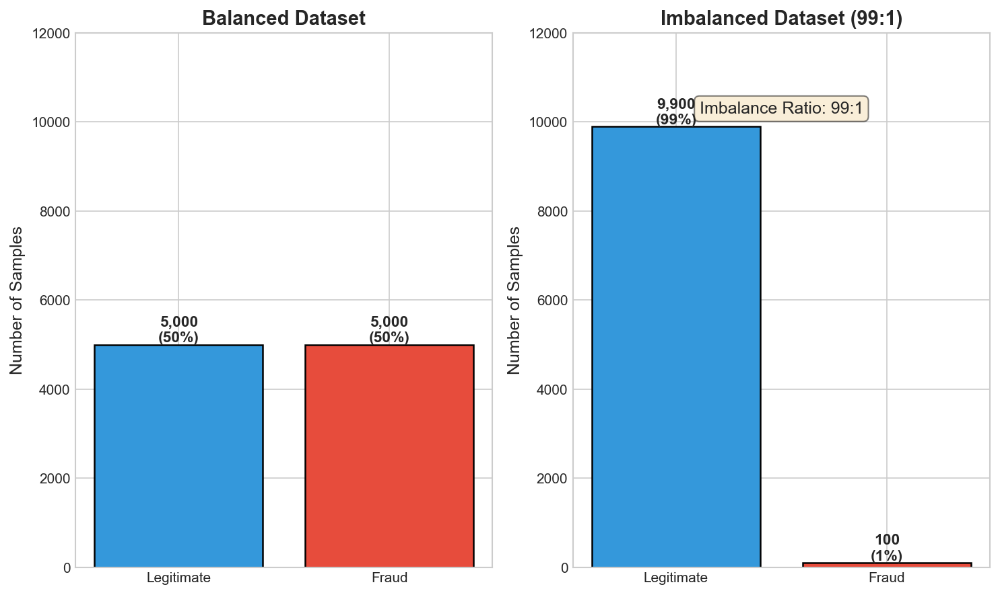
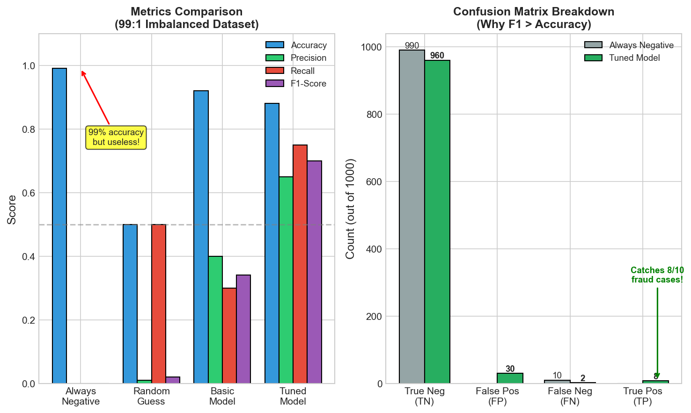
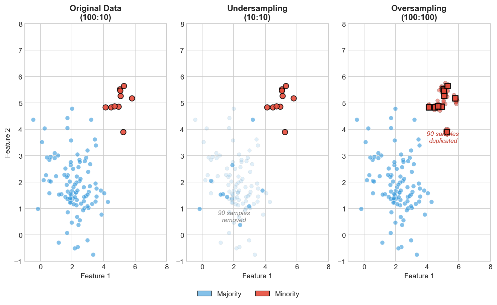
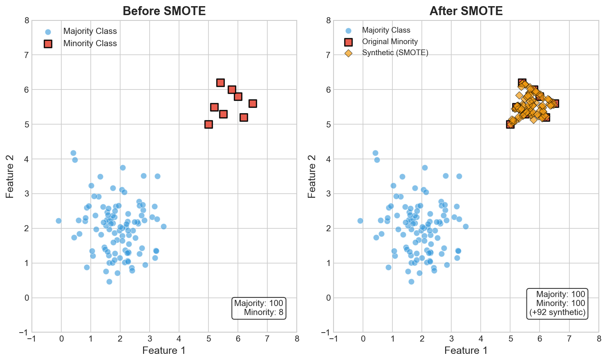
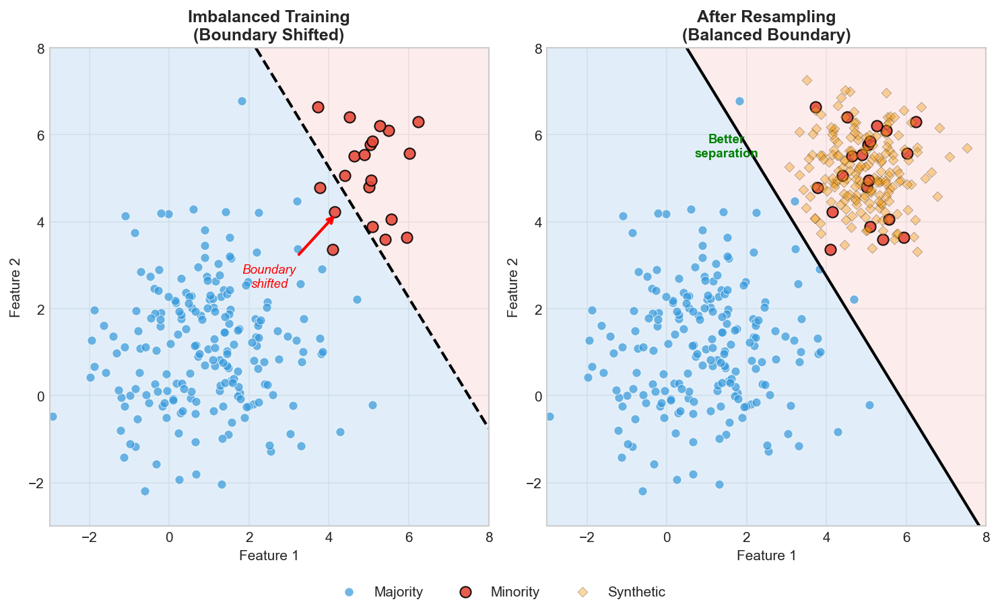

# Class Imbalance Interview FAQ

> **Handle skewed class distributions effectively**

Class imbalance is one of the most common challenges in real-world machine learning applications. This FAQ covers essential concepts, techniques, and best practices that frequently appear in ML interviews.

---

## Fundamental Concepts

### Q1: What is class imbalance and why is it a problem?

**Answer:** Class imbalance occurs when the distribution of classes in a dataset is significantly skewed, with one or more classes having far fewer samples than others.



**Why it's problematic:**

1. **Biased Learning**: Models favor the majority class to minimize overall error
2. **Misleading Accuracy**: A model predicting only the majority class achieves high accuracy while being useless
3. **Poor Minority Class Detection**: The minority class (often the class of interest) gets underrepresented
4. **Decision Boundary Issues**: The learned boundary shifts toward the minority class

**Real-world impact:** Missing 90% of fraud cases while reporting 99% accuracy, failing to detect rare diseases, or missing critical security threats.

---

### Q2: What causes class imbalance in real datasets?

**Answer:** Class imbalance arises from various natural and artificial sources:

**Natural Causes:**
1. **Rare Events**: Fraud, equipment failures, rare diseases are inherently uncommon
2. **Selection Bias**: Data collection may favor certain outcomes
3. **Temporal Factors**: Some events occur less frequently over time

**Artificial Causes:**
1. **Sampling Methods**: Non-representative sampling strategies
2. **Labeling Costs**: Expensive or difficult annotation of minority cases
3. **Data Privacy**: Sensitive minority class data may be restricted

**Imbalance Severity Levels:**
```
Mild imbalance:    1:4 to 1:10 ratio
Moderate imbalance: 1:10 to 1:100 ratio
Severe imbalance:   1:100 to 1:1000+ ratio
```

---

### Q3: How do you identify and measure class imbalance?

**Answer:**

**Identification Methods:**

```python
import pandas as pd
import numpy as np

# Check class distribution
def analyze_imbalance(y):
    class_counts = pd.Series(y).value_counts()
    class_ratios = class_counts / len(y)

    print("Class Distribution:")
    for cls, count in class_counts.items():
        print(f"  Class {cls}: {count} samples ({class_ratios[cls]:.2%})")

    # Imbalance ratio
    majority = class_counts.max()
    minority = class_counts.min()
    imbalance_ratio = majority / minority
    print(f"\nImbalance Ratio: {imbalance_ratio:.1f}:1")

    return imbalance_ratio

# Example
y = [0]*9500 + [1]*500  # 95% vs 5%
analyze_imbalance(y)
```

**Imbalance Metrics:**
1. **Imbalance Ratio (IR)**: `majority_count / minority_count`
2. **Shannon Entropy**: Measures distribution uniformity
3. **Gini Index**: Measures class purity

---

## Evaluation Metrics

### Q4: Why is accuracy misleading for imbalanced datasets?

**Answer:** Accuracy measures overall correctness but ignores class-specific performance.



**The Accuracy Paradox:** A model predicting only the majority class achieves 99% accuracy on a 99:1 imbalanced dataset while detecting 0% of the minority class. A tuned model with 88% accuracy but 75% recall is far more useful.

**Key Insight:** When classes are imbalanced, accuracy is dominated by majority class performance. Use F1-score, precision, recall, or AUC-PR instead.

---

### Q5: What metrics should you use for imbalanced datasets?

**Answer:** Use metrics that account for class-specific performance:

**1. Precision, Recall, and F1-Score:**
```python
from sklearn.metrics import precision_score, recall_score, f1_score

# Precision: Of predicted positives, how many are correct?
precision = TP / (TP + FP)

# Recall (Sensitivity): Of actual positives, how many detected?
recall = TP / (TP + FN)

# F1-Score: Harmonic mean of precision and recall
f1 = 2 * (precision * recall) / (precision + recall)
```

**2. Area Under Precision-Recall Curve (AUC-PR):**
```python
from sklearn.metrics import precision_recall_curve, auc

precision, recall, thresholds = precision_recall_curve(y_true, y_scores)
auc_pr = auc(recall, precision)
```

**Why AUC-PR over AUC-ROC for imbalanced data:**
- ROC curves can be overly optimistic when negatives dominate
- PR curves focus on positive class performance
- More sensitive to changes in positive class predictions

**3. Matthews Correlation Coefficient (MCC):**
```python
from sklearn.metrics import matthews_corrcoef

# MCC considers all four confusion matrix values
# Range: -1 (worst) to +1 (best), 0 = random
mcc = matthews_corrcoef(y_true, y_pred)
```

**4. Balanced Accuracy:**
```python
from sklearn.metrics import balanced_accuracy_score

# Average of recall for each class
balanced_acc = balanced_accuracy_score(y_true, y_pred)
```

**5. Cohen's Kappa:**
```python
from sklearn.metrics import cohen_kappa_score

# Measures agreement above chance
kappa = cohen_kappa_score(y_true, y_pred)
```

---

### Q6: When should you use F1-score vs AUC-PR vs AUC-ROC?

**Answer:**

| Metric | Best Use Case | Limitations |
|--------|---------------|-------------|
| **F1-Score** | Single threshold decision, balanced precision-recall tradeoff | Threshold-dependent, ignores true negatives |
| **AUC-PR** | Severe imbalance, positive class focus, ranking evaluation | Harder to interpret, threshold-independent |
| **AUC-ROC** | Moderate imbalance, overall discrimination ability | Can be misleading with severe imbalance |
| **MCC** | Single balanced metric, all classes matter | Threshold-dependent |

**Decision Framework:**
```
Is positive class rare and important?
├── Yes → Use AUC-PR or F1
└── No → AUC-ROC may be acceptable

Do you need a specific operating point?
├── Yes → Use F1, precision@k, recall@k
└── No → Use area-under-curve metrics

Are false positives and false negatives equally costly?
├── Yes → Use F1 or MCC
└── No → Use precision or recall based on cost ratio
```

---

### Q7: How do you interpret and visualize performance on imbalanced data?

**Answer:**

**Confusion Matrix Analysis:**
```python
from sklearn.metrics import confusion_matrix, ConfusionMatrixDisplay
import matplotlib.pyplot as plt

# Normalized confusion matrix shows percentages
cm = confusion_matrix(y_true, y_pred, normalize='true')
disp = ConfusionMatrixDisplay(cm, display_labels=['Negative', 'Positive'])
disp.plot(cmap='Blues')
plt.title('Normalized Confusion Matrix')
```

**Precision-Recall Curve:**
```python
from sklearn.metrics import precision_recall_curve
import matplotlib.pyplot as plt

precision, recall, thresholds = precision_recall_curve(y_true, y_scores)

plt.figure(figsize=(8, 6))
plt.plot(recall, precision, 'b-', linewidth=2)
plt.fill_between(recall, precision, alpha=0.3)
plt.xlabel('Recall')
plt.ylabel('Precision')
plt.title(f'Precision-Recall Curve (AUC = {auc_pr:.3f})')

# Add baseline (random classifier)
baseline = sum(y_true) / len(y_true)
plt.axhline(y=baseline, color='r', linestyle='--', label='Random')
```

**Classification Report:**
```python
from sklearn.metrics import classification_report

print(classification_report(y_true, y_pred,
                          target_names=['Negative', 'Positive']))
```

---

## Resampling Strategies

### Q8: What is oversampling and when should you use it?

**Answer:** Oversampling increases minority class samples to balance the dataset.



**Random Oversampling:**
```python
from imblearn.over_sampling import RandomOverSampler

ros = RandomOverSampler(random_state=42)
X_resampled, y_resampled = ros.fit_resample(X, y)
```

| Pros | Cons |
|------|------|
| Simple to implement | Can lead to overfitting |
| No information loss | Increases training time |
| Works with any classifier | Doesn't add new information |

**When to Use:** Small datasets where losing samples is costly, or combined with data augmentation.

---

### Q9: What is undersampling and what are its tradeoffs?

**Answer:** Undersampling reduces majority class samples to balance the dataset (see comparison above).

**Random Undersampling:**
```python
from imblearn.under_sampling import RandomUnderSampler

rus = RandomUnderSampler(random_state=42)
X_resampled, y_resampled = rus.fit_resample(X, y)
```

**Advanced Methods:** Tomek Links, Edited Nearest Neighbors, Condensed NN, NearMiss.

| Pros | Cons |
|------|------|
| Reduces training time | Loses valuable information |
| Removes noisy samples | May remove important patterns |
| Works well with ensembles | Increases prediction variance |

**When to Use:** Large datasets where training time matters, or with ensemble methods (EasyEnsemble).

---

### Q10: What is SMOTE and how does it work?

**Answer:** SMOTE (Synthetic Minority Over-sampling Technique) creates synthetic minority samples by interpolating between existing ones.



**Algorithm:**
1. For each minority sample, find k nearest minority neighbors
2. Randomly select one of the k neighbors
3. Create synthetic sample along the line connecting them: `x_new = x_i + rand(0,1) * (x_neighbor - x_i)`

```python
from imblearn.over_sampling import SMOTE

smote = SMOTE(random_state=42, k_neighbors=5)
X_resampled, y_resampled = smote.fit_resample(X, y)
```

| Pros | Cons |
|------|------|
| Creates new, diverse samples | Can create noisy samples in overlapping regions |
| Reduces overfitting vs random oversampling | Assumes linear interpolation is meaningful |
| Expands minority class decision region | Sensitive to k_neighbors parameter |

---

### Q11: What are SMOTE variants and when to use each?

**Answer:** Different SMOTE variants address specific challenges. Resampling shifts the decision boundary to better separate classes:



**1. Borderline-SMOTE:**
Only generates synthetic samples for minority instances near the decision boundary.

```python
from imblearn.over_sampling import BorderlineSMOTE

# kind='borderline-1': Only dangerous samples
# kind='borderline-2': Dangerous and safe samples
bsmote = BorderlineSMOTE(kind='borderline-1', random_state=42)
X_res, y_res = bsmote.fit_resample(X, y)
```

**2. SMOTE-ENN (SMOTE + Edited Nearest Neighbors):**
Combines oversampling with cleaning.

```python
from imblearn.combine import SMOTEENN

smote_enn = SMOTEENN(random_state=42)
X_res, y_res = smote_enn.fit_resample(X, y)
```

**3. SMOTE-Tomek:**
Removes Tomek links after SMOTE.

```python
from imblearn.combine import SMOTETomek

smote_tomek = SMOTETomek(random_state=42)
X_res, y_res = smote_tomek.fit_resample(X, y)
```

**4. ADASYN (Adaptive Synthetic Sampling):**
Generates more samples for harder-to-learn minority instances.

```python
from imblearn.over_sampling import ADASYN

adasyn = ADASYN(random_state=42)
X_res, y_res = adasyn.fit_resample(X, y)
```

**Comparison:**
| Method | Best For | Avoids |
|--------|----------|--------|
| SMOTE | General use | - |
| Borderline-SMOTE | Clear class boundaries | Interior interpolation |
| SMOTE-ENN | Noisy data | Mislabeled samples |
| SMOTE-Tomek | Cleaner boundaries | Ambiguous samples |
| ADASYN | Hard minority examples | Easy sample oversampling |

---

### Q12: How do you handle categorical features with SMOTE?

**Answer:** Standard SMOTE assumes continuous features. For categorical data:

**SMOTE-NC (Nominal Continuous):**
```python
from imblearn.over_sampling import SMOTENC

# Specify which columns are categorical
categorical_features = [0, 2, 5]  # column indices

smotenc = SMOTENC(
    categorical_features=categorical_features,
    random_state=42
)
X_res, y_res = smotenc.fit_resample(X, y)
```

**SMOTE-N (Nominal only):**
For purely categorical data, use mode-based approaches.

**Alternative Approaches:**
1. **One-hot encode, then SMOTE, then decode**
2. **Use CTGAN** for complex categorical distributions
3. **Random oversampling** for categorical features

---

## Class Weights and Cost-Sensitive Learning

### Q13: How do class weights work in machine learning models?

**Answer:** Class weights adjust the loss function to penalize misclassification of minority classes more heavily.

**Implementation in Scikit-learn:**
```python
from sklearn.linear_model import LogisticRegression
from sklearn.ensemble import RandomForestClassifier
from sklearn.utils.class_weight import compute_class_weight

# Automatic balanced weights
model = LogisticRegression(class_weight='balanced')

# Manual weights
model = LogisticRegression(class_weight={0: 1, 1: 10})

# Compute balanced weights
classes = np.unique(y)
weights = compute_class_weight('balanced', classes=classes, y=y)
weight_dict = dict(zip(classes, weights))
# For 95% negative, 5% positive:
# weights = {0: 0.526, 1: 10.0}
```

**Mathematical Effect:**
```
Standard loss:     L = -sum(log(p_i))
Weighted loss:     L = -sum(w_i * log(p_i))

For minority class (weight=10):
  Misclassifying a positive costs 10x more than a negative
```

**Deep Learning Implementation:**
```python
import torch
import torch.nn as nn

# Calculate class weights
class_counts = [950, 50]
total = sum(class_counts)
weights = torch.tensor([total/c for c in class_counts])
weights = weights / weights.sum()  # normalize

# Weighted cross-entropy loss
criterion = nn.CrossEntropyLoss(weight=weights)

# For binary classification
pos_weight = torch.tensor([950/50])  # ratio
criterion = nn.BCEWithLogitsLoss(pos_weight=pos_weight)
```

---

### Q14: What is cost-sensitive learning?

**Answer:** Cost-sensitive learning incorporates different misclassification costs directly into the learning algorithm.

**Cost Matrix:**
```
                  Predicted
                  Neg    Pos
Actual   Neg   [  0,    C_FP ]
         Pos   [ C_FN,   0   ]

C_FP: Cost of false positive
C_FN: Cost of false negative

Example (Fraud Detection):
C_FP = $10  (investigating legitimate transaction)
C_FN = $500 (missing actual fraud)
```

**Implementation Approaches:**

**1. Threshold Adjustment:**
```python
# Adjust threshold based on cost ratio
cost_ratio = C_FN / C_FP  # e.g., 500/10 = 50
optimal_threshold = 1 / (1 + cost_ratio)  # = 0.0196
```

**2. Sample Weighting:**
```python
# Weight samples by misclassification cost
sample_weights = np.where(y == 1, C_FN, C_FP)
model.fit(X, y, sample_weight=sample_weights)
```

**3. Cost-Sensitive Algorithms:**
```python
# MetaCost: Relabels instances based on cost
from costcla.models import CostSensitiveLogisticRegression

# Cost matrix per sample
cost_matrix = np.array([[0, C_FP], [C_FN, 0]])
model = CostSensitiveLogisticRegression()
model.fit(X, y, cost_matrix)
```

---

### Q15: How do you choose appropriate class weights?

**Answer:**

**Method 1: Inverse Frequency Weighting**
```python
# Weight inversely proportional to class frequency
weights = total_samples / (n_classes * class_counts)

# Example: 950 negative, 50 positive
w_neg = 1000 / (2 * 950) = 0.526
w_pos = 1000 / (2 * 50) = 10.0
```

**Method 2: Effective Number of Samples**
```python
# From "Class-Balanced Loss" paper
beta = 0.9999
effective_num = (1 - beta**n) / (1 - beta)
weights = 1 / effective_num
```

**Method 3: Cross-Validation Search**
```python
from sklearn.model_selection import GridSearchCV

param_grid = {
    'class_weight': [
        {0: 1, 1: 5},
        {0: 1, 1: 10},
        {0: 1, 1: 20},
        'balanced'
    ]
}

grid_search = GridSearchCV(
    LogisticRegression(),
    param_grid,
    scoring='f1',
    cv=5
)
grid_search.fit(X, y)
```

**Method 4: Business-Driven Costs**
```python
# Based on actual business impact
# Example: Medical diagnosis
cost_false_negative = 100000  # Missing a disease
cost_false_positive = 1000    # Unnecessary test

weight_positive = cost_false_negative / cost_false_positive
```

---

## Threshold Tuning

### Q16: How does threshold tuning help with imbalanced data?

**Answer:** Most classifiers output probabilities. The default threshold (0.5) may not be optimal for imbalanced data.

**Threshold Impact:**
```
Lower threshold (e.g., 0.2):
  - More positive predictions
  - Higher recall, lower precision
  - Good when missing positives is costly

Higher threshold (e.g., 0.8):
  - Fewer positive predictions
  - Lower recall, higher precision
  - Good when false alarms are costly
```

**Finding Optimal Threshold:**

```python
from sklearn.metrics import precision_recall_curve, f1_score
import numpy as np

def find_optimal_threshold(y_true, y_proba, metric='f1'):
    """Find threshold that maximizes the given metric."""

    thresholds = np.arange(0.1, 0.9, 0.01)
    scores = []

    for thresh in thresholds:
        y_pred = (y_proba >= thresh).astype(int)
        if metric == 'f1':
            score = f1_score(y_true, y_pred)
        scores.append(score)

    best_idx = np.argmax(scores)
    return thresholds[best_idx], scores[best_idx]

# Using precision-recall curve
precision, recall, thresholds = precision_recall_curve(y_true, y_proba)
f1_scores = 2 * (precision * recall) / (precision + recall + 1e-10)
best_threshold = thresholds[np.argmax(f1_scores[:-1])]
```

**Threshold Selection Strategies:**

| Strategy | Formula | Use Case |
|----------|---------|----------|
| F1-Optimal | Max F1 score | Balanced precision-recall |
| Cost-Optimal | Min expected cost | Known misclassification costs |
| Precision@k | Top k predictions | Limited review capacity |
| Recall@threshold | Fixed recall target | Must catch X% of positives |

---

### Q17: How do you validate threshold selection?

**Answer:** Proper validation prevents threshold overfitting.

```python
from sklearn.model_selection import cross_val_predict

# Get out-of-fold predictions
y_proba = cross_val_predict(
    model, X, y,
    cv=5,
    method='predict_proba'
)[:, 1]

# Find threshold on these unbiased predictions
optimal_thresh, _ = find_optimal_threshold(y, y_proba)

# For final model
model.fit(X_train, y_train)
y_pred = (model.predict_proba(X_test)[:, 1] >= optimal_thresh).astype(int)
```

**Nested Cross-Validation for Threshold:**
```python
from sklearn.model_selection import StratifiedKFold

outer_cv = StratifiedKFold(n_splits=5)
inner_cv = StratifiedKFold(n_splits=3)

final_scores = []
for train_idx, test_idx in outer_cv.split(X, y):
    X_train, X_test = X[train_idx], X[test_idx]
    y_train, y_test = y[train_idx], y[test_idx]

    # Inner CV for threshold selection
    inner_proba = cross_val_predict(
        model, X_train, y_train,
        cv=inner_cv, method='predict_proba'
    )[:, 1]
    threshold, _ = find_optimal_threshold(y_train, inner_proba)

    # Evaluate on outer fold
    model.fit(X_train, y_train)
    y_proba = model.predict_proba(X_test)[:, 1]
    y_pred = (y_proba >= threshold).astype(int)
    final_scores.append(f1_score(y_test, y_pred))
```

---

## Ensemble Methods

### Q18: How can ensemble methods handle class imbalance?

**Answer:** Ensembles combine multiple models to improve minority class performance.

**1. Balanced Random Forest:**
```python
from imblearn.ensemble import BalancedRandomForestClassifier

# Each tree trained on balanced bootstrap sample
brf = BalancedRandomForestClassifier(
    n_estimators=100,
    random_state=42
)
brf.fit(X_train, y_train)
```

**2. EasyEnsemble:**
```python
from imblearn.ensemble import EasyEnsembleClassifier

# Multiple balanced subsets + AdaBoost
easy_ensemble = EasyEnsembleClassifier(
    n_estimators=10,
    random_state=42
)
easy_ensemble.fit(X_train, y_train)
```

**3. RUSBoost (Random Undersampling + Boosting):**
```python
from imblearn.ensemble import RUSBoostClassifier

rusboost = RUSBoostClassifier(
    n_estimators=50,
    random_state=42
)
rusboost.fit(X_train, y_train)
```

**4. Balanced Bagging:**
```python
from imblearn.ensemble import BalancedBaggingClassifier
from sklearn.tree import DecisionTreeClassifier

bagging = BalancedBaggingClassifier(
    estimator=DecisionTreeClassifier(),
    n_estimators=50,
    random_state=42
)
bagging.fit(X_train, y_train)
```

**Comparison:**
| Method | Mechanism | Best For |
|--------|-----------|----------|
| Balanced RF | Per-tree balanced sampling | General purpose |
| EasyEnsemble | Multiple balanced subsets | Severe imbalance |
| RUSBoost | Undersampling + boosting | Large datasets |
| BalancedBagging | Bootstrap + undersampling | Any base classifier |

---

### Q19: How does XGBoost/LightGBM handle imbalanced data?

**Answer:** Gradient boosting frameworks have built-in imbalance handling.

**XGBoost:**
```python
import xgboost as xgb

# Method 1: scale_pos_weight
scale = len(y[y==0]) / len(y[y==1])  # negative/positive ratio

model = xgb.XGBClassifier(
    scale_pos_weight=scale,
    eval_metric='auc',
    random_state=42
)

# Method 2: Custom sample weights
sample_weights = np.where(y == 1, scale, 1)
model.fit(X_train, y_train, sample_weight=sample_weights)
```

**LightGBM:**
```python
import lightgbm as lgb

# Method 1: is_unbalance
model = lgb.LGBMClassifier(
    is_unbalance=True,
    random_state=42
)

# Method 2: scale_pos_weight
model = lgb.LGBMClassifier(
    scale_pos_weight=scale,
    random_state=42
)

# Method 3: class_weight
model = lgb.LGBMClassifier(
    class_weight='balanced',
    random_state=42
)
```

**Focal Loss for Extreme Imbalance:**
```python
def focal_loss(y_true, y_pred, gamma=2.0, alpha=0.25):
    """
    Focal loss focuses on hard examples by down-weighting easy ones.
    """
    p = y_pred
    ce_loss = -y_true * np.log(p) - (1 - y_true) * np.log(1 - p)
    focal_weight = alpha * y_true * (1 - p)**gamma + \
                   (1 - alpha) * (1 - y_true) * p**gamma
    return focal_weight * ce_loss
```

---

## Anomaly Detection Approach

### Q20: When should you treat imbalanced classification as anomaly detection?

**Answer:** When the minority class is extremely rare (<1%), anomaly detection may outperform classification.

**Key Differences:**
```
Classification:
- Learns decision boundary between classes
- Needs labeled examples of both classes
- Assumes both classes have learnable patterns

Anomaly Detection:
- Models "normal" behavior, flags deviations
- Can work with only majority class labels
- Better for extreme imbalance (>1:1000)
```

**When to Use Anomaly Detection:**
1. Minority class ratio < 1%
2. Normal behavior is well-defined
3. Anomalies are diverse/unpredictable
4. Limited minority class samples

**Common Algorithms:**

```python
# Isolation Forest
from sklearn.ensemble import IsolationForest

iso_forest = IsolationForest(
    contamination=0.01,  # expected anomaly ratio
    random_state=42
)
iso_forest.fit(X_train)  # Can train on normal data only
anomaly_scores = iso_forest.decision_function(X_test)

# One-Class SVM
from sklearn.svm import OneClassSVM

ocsvm = OneClassSVM(nu=0.01, kernel='rbf')
ocsvm.fit(X_train_normal)  # Only normal samples
predictions = ocsvm.predict(X_test)

# Local Outlier Factor
from sklearn.neighbors import LocalOutlierFactor

lof = LocalOutlierFactor(n_neighbors=20, contamination=0.01)
predictions = lof.fit_predict(X)

# Autoencoder-based
from tensorflow import keras

encoder = keras.Sequential([
    keras.layers.Dense(64, activation='relu'),
    keras.layers.Dense(32, activation='relu'),
    keras.layers.Dense(16, activation='relu'),
])
decoder = keras.Sequential([
    keras.layers.Dense(32, activation='relu'),
    keras.layers.Dense(64, activation='relu'),
    keras.layers.Dense(input_dim, activation='linear'),
])

# Anomalies have high reconstruction error
reconstruction = decoder(encoder(X_test))
error = np.mean((X_test - reconstruction)**2, axis=1)
```

---

## Real-World Applications

### Q21: How do you handle class imbalance in fraud detection?

**Answer:** Fraud detection is a classic imbalanced problem (fraud rate typically 0.1-2%).

**Complete Pipeline:**
```python
import pandas as pd
import numpy as np
from sklearn.model_selection import train_test_split, StratifiedKFold
from sklearn.preprocessing import StandardScaler
from imblearn.pipeline import Pipeline as ImbPipeline
from imblearn.over_sampling import SMOTE
from sklearn.ensemble import RandomForestClassifier
from sklearn.metrics import classification_report, roc_auc_score

# 1. Load and prepare data
df = pd.read_csv('transactions.csv')
X = df.drop('is_fraud', axis=1)
y = df['is_fraud']

# Check imbalance
print(f"Fraud rate: {y.mean():.4%}")

# 2. Time-aware split (fraud patterns change over time)
# Don't use random split for time-series fraud data!
split_idx = int(len(df) * 0.8)
X_train, X_test = X[:split_idx], X[split_idx:]
y_train, y_test = y[:split_idx], y[split_idx:]

# 3. Build pipeline with SMOTE
pipeline = ImbPipeline([
    ('scaler', StandardScaler()),
    ('smote', SMOTE(random_state=42)),
    ('classifier', RandomForestClassifier(
        n_estimators=100,
        class_weight='balanced',
        random_state=42
    ))
])

# 4. Train and evaluate
pipeline.fit(X_train, y_train)
y_pred = pipeline.predict(X_test)
y_proba = pipeline.predict_proba(X_test)[:, 1]

# 5. Evaluate with appropriate metrics
print(classification_report(y_test, y_pred))
print(f"AUC-ROC: {roc_auc_score(y_test, y_proba):.4f}")

# 6. Optimize for business metric (e.g., precision at fixed recall)
from sklearn.metrics import precision_recall_curve

precision, recall, thresholds = precision_recall_curve(y_test, y_proba)
# Find threshold for 80% recall
idx = np.argmax(recall <= 0.80)
business_threshold = thresholds[idx]
```

**Key Considerations:**
- Use time-based splits, not random splits
- Consider investigation capacity (precision at top-k)
- Monitor for concept drift
- Balance automation vs. human review

---

### Q22: How do you handle imbalance in medical diagnosis?

**Answer:** Medical diagnosis requires high recall (don't miss diseases) while managing false positives.

**Example: Rare Disease Detection**
```python
from sklearn.model_selection import StratifiedKFold
from sklearn.calibration import CalibratedClassifierCV
from sklearn.metrics import recall_score, precision_score

# Medical data often has extreme imbalance
# Disease prevalence might be 0.1%

# 1. Stratified sampling is critical
cv = StratifiedKFold(n_splits=5, shuffle=True, random_state=42)

# 2. Use calibrated probabilities for risk scores
base_model = RandomForestClassifier(class_weight='balanced')
calibrated_model = CalibratedClassifierCV(base_model, cv=cv)
calibrated_model.fit(X_train, y_train)

# 3. Threshold for high sensitivity (recall)
y_proba = calibrated_model.predict_proba(X_test)[:, 1]

# Find threshold for 95% sensitivity
for thresh in np.arange(0.01, 0.5, 0.01):
    y_pred = (y_proba >= thresh).astype(int)
    sensitivity = recall_score(y_test, y_pred)
    specificity = recall_score(y_test, y_pred, pos_label=0)
    if sensitivity >= 0.95:
        print(f"Threshold: {thresh:.2f}")
        print(f"Sensitivity: {sensitivity:.2%}")
        print(f"Specificity: {specificity:.2%}")
        break

# 4. Report confidence intervals
from scipy import stats

def bootstrap_metric(y_true, y_pred, metric_fn, n_iterations=1000):
    scores = []
    for _ in range(n_iterations):
        indices = np.random.randint(0, len(y_true), len(y_true))
        scores.append(metric_fn(y_true[indices], y_pred[indices]))
    return np.percentile(scores, [2.5, 97.5])
```

---

### Q23: What are best practices for production systems with imbalanced data?

**Answer:**

**1. Monitoring and Alerting:**
```python
class ImbalanceMonitor:
    def __init__(self, expected_positive_rate, tolerance=0.1):
        self.expected_rate = expected_positive_rate
        self.tolerance = tolerance

    def check_distribution(self, y_pred):
        actual_rate = np.mean(y_pred)
        drift = abs(actual_rate - self.expected_rate) / self.expected_rate

        if drift > self.tolerance:
            alert(f"Prediction distribution drift: {drift:.2%}")

    def check_performance(self, y_true, y_pred):
        # Track metrics over time
        metrics = {
            'precision': precision_score(y_true, y_pred),
            'recall': recall_score(y_true, y_pred),
            'f1': f1_score(y_true, y_pred)
        }
        log_metrics(metrics)
```

**2. A/B Testing Considerations:**
```python
# Need larger sample sizes for minority class metrics
from scipy.stats import norm

def required_sample_size(baseline_rate, min_detectable_effect,
                         alpha=0.05, power=0.8):
    """Calculate sample size for imbalanced A/B test."""
    z_alpha = norm.ppf(1 - alpha/2)
    z_beta = norm.ppf(power)

    p1 = baseline_rate
    p2 = baseline_rate * (1 + min_detectable_effect)

    n = (z_alpha + z_beta)**2 * (p1*(1-p1) + p2*(1-p2)) / (p2-p1)**2
    return int(n / baseline_rate)  # Adjust for imbalance
```

**3. Retraining Strategy:**
```python
# Continuously collect minority class examples
# Retrain when significant new minority data available

class IncrementalTrainer:
    def __init__(self, model, min_new_positives=100):
        self.model = model
        self.min_new_positives = min_new_positives
        self.new_positive_count = 0

    def add_labeled_sample(self, x, y):
        if y == 1:
            self.new_positive_count += 1

        if self.new_positive_count >= self.min_new_positives:
            self.retrain()
            self.new_positive_count = 0
```

---

## Common Interview Questions Summary

### Q24: Walk through your approach to an imbalanced classification problem.

**Answer:** Here's a systematic approach:

**Step 1: Understand the Problem**
- What's the imbalance ratio?
- What are the costs of false positives vs false negatives?
- What metric matters most for the business?

**Step 2: Establish Baselines**
- Train a model without any imbalance handling
- Evaluate with appropriate metrics (F1, AUC-PR)
- This is your baseline to improve upon

**Step 3: Choose Techniques Based on Context**
```
Small dataset + moderate imbalance:
  → SMOTE + class weights

Large dataset + severe imbalance:
  → Undersampling ensembles (EasyEnsemble)

Extreme imbalance (>1:1000):
  → Anomaly detection approach

Clear business costs:
  → Cost-sensitive learning + threshold tuning
```

**Step 4: Build and Validate**
- Use stratified cross-validation
- Optimize threshold on validation set
- Report confidence intervals

**Step 5: Deploy and Monitor**
- Set up distribution monitoring
- Track minority class metrics
- Plan for model updates

---

### Q25: What mistakes do people commonly make with imbalanced data?

**Answer:**

**1. Data Leakage with Resampling:**
```python
# WRONG: Resample before split
X_resampled, y_resampled = SMOTE().fit_resample(X, y)
X_train, X_test = train_test_split(X_resampled, y_resampled)
# Test set contains synthetic samples created from training samples!

# CORRECT: Resample only training data
X_train, X_test, y_train, y_test = train_test_split(X, y, stratify=y)
X_train_res, y_train_res = SMOTE().fit_resample(X_train, y_train)
```

**2. Using Wrong Metrics:**
```python
# WRONG: Optimizing for accuracy
model = GridSearchCV(clf, params, scoring='accuracy')

# CORRECT: Use appropriate metric
model = GridSearchCV(clf, params, scoring='f1')
```

**3. Ignoring Class Distribution in CV:**
```python
# WRONG: Regular k-fold
cv = KFold(n_splits=5)

# CORRECT: Stratified k-fold preserves class ratios
cv = StratifiedKFold(n_splits=5)
```

**4. Over-relying on SMOTE:**
- SMOTE doesn't work well with high-dimensional data
- Can create unrealistic synthetic samples
- May not help with fundamentally hard problems

**5. Not Considering Business Context:**
- Technical metrics don't always align with business goals
- Always translate to business impact

---

This comprehensive FAQ covers the essential concepts, techniques, and best practices for handling class imbalance in machine learning. Understanding these topics thoroughly will prepare you for both technical interviews and real-world applications.
