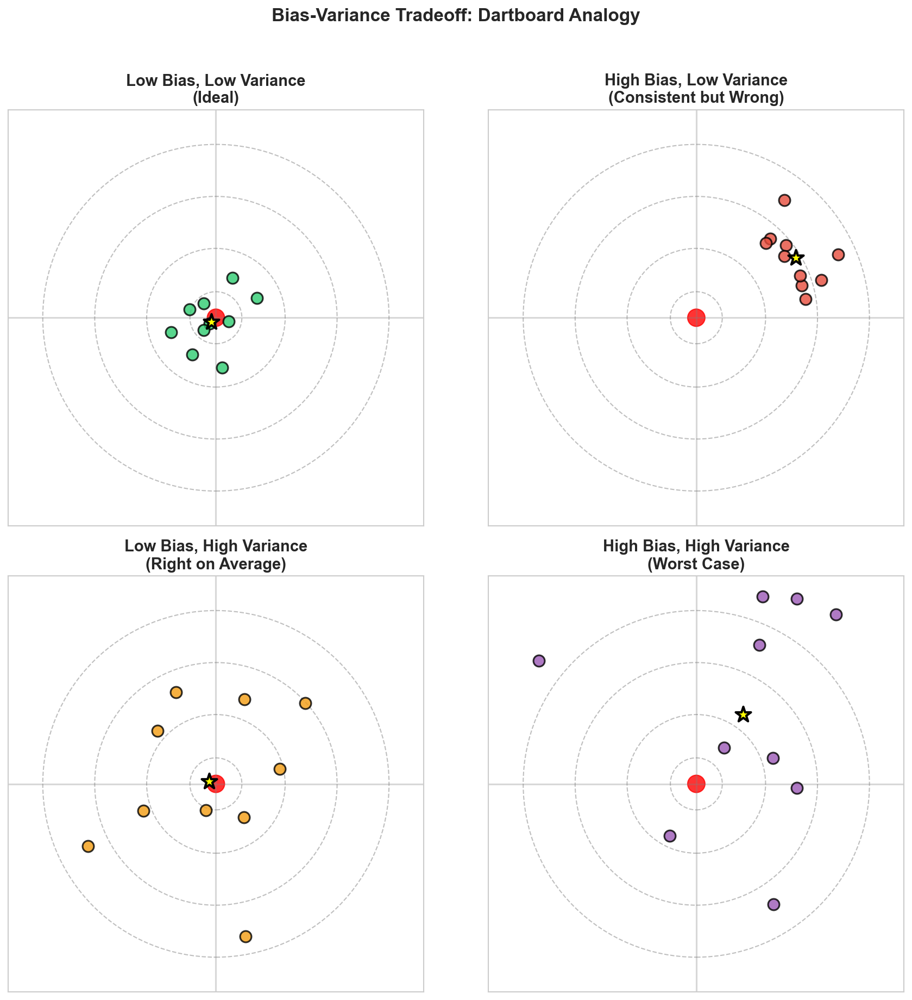
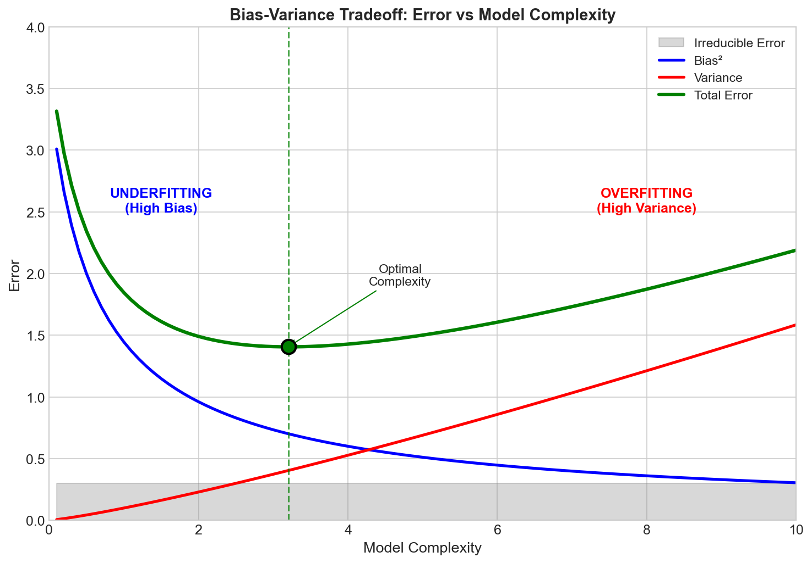
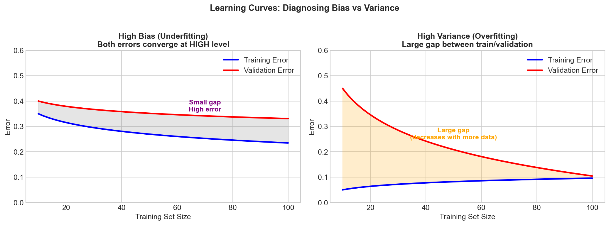
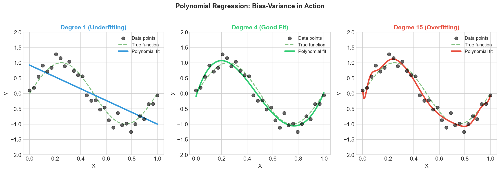
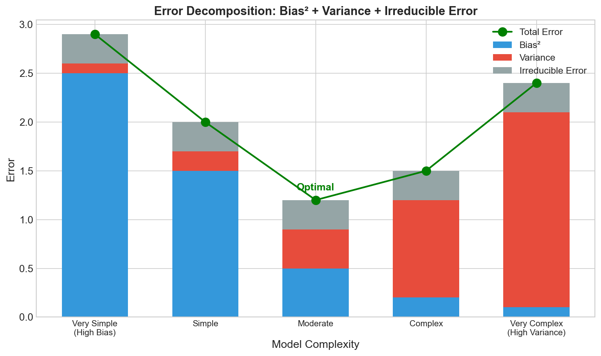

# Bias-Variance Tradeoff - Interview FAQ

## Overview

The **bias-variance tradeoff** is one of the most fundamental concepts in machine learning that explains the tension between two sources of error that affect model performance. Understanding this tradeoff is essential for building models that generalize well to unseen data.

In essence:
- **Bias** measures how far off the model's predictions are from the correct values on average
- **Variance** measures how much the model's predictions vary for different training sets

A model cannot simultaneously minimize both bias and variance—reducing one typically increases the other. The goal is to find the optimal balance that minimizes **total error**.

---

## Interview Questions and Answers

### Q1: What is bias in machine learning?

**Answer:**

Bias refers to the error introduced by approximating a complex real-world problem with a simplified model. It represents the difference between the average prediction of our model and the correct value we are trying to predict.

**Key characteristics of high bias:**
- The model makes strong assumptions about the data
- It consistently misses relevant relationships between features and target outputs
- Results in **underfitting**—the model is too simple to capture the underlying pattern
- Training error is high, and the model performs poorly even on training data

**Example:** Using a linear regression model to fit data that has a quadratic relationship. No matter how much data you provide, a straight line cannot capture the curve, leading to systematic errors.

---

### Q2: What is variance in machine learning?

**Answer:**

Variance refers to the model's sensitivity to small fluctuations in the training data. It measures how much the model's predictions would change if we trained it on a different dataset.

**Key characteristics of high variance:**
- The model is highly flexible and learns the noise in the training data
- Small changes in training data lead to significantly different predictions
- Results in **overfitting**—the model memorizes training data instead of learning general patterns
- Training error is low, but test/validation error is high

**Example:** A decision tree with no depth limit that creates a unique path for almost every training example. It achieves near-perfect training accuracy but fails dramatically on new data.

---

### Q3: What is the bias-variance tradeoff?

**Answer:**

The bias-variance tradeoff describes the fundamental tension in machine learning: as you decrease bias, you typically increase variance, and vice versa.

**The Total Error Decomposition:**

**Total Error = Bias² + Variance + Irreducible Error**

Where:
- **Bias²**: Error from incorrect assumptions in the learning algorithm
- **Variance**: Error from sensitivity to small fluctuations in the training set
- **Irreducible Error**: Noise inherent in the data that no model can eliminate

**The tradeoff explained:**
- **Simple models** (e.g., linear regression) have high bias but low variance
- **Complex models** (e.g., deep neural networks) have low bias but high variance
- The optimal model complexity is where the sum of bias² and variance is minimized

**Interview tip:** Draw the U-shaped curve showing how total error first decreases then increases with model complexity—this demonstrates deep understanding.

---

### Q4: How do you detect high bias (underfitting)?

**Answer:**

**Indicators of high bias:**

1. **Training error is high** - The model cannot even fit the training data well
2. **Validation/test error is also high** - Poor performance across all data
3. **Training and validation errors are close** - Both are high and similar
4. **Learning curve plateau** - Adding more training data does not significantly reduce error

**Diagnostic approach:**
- Plot learning curves (error vs. training set size)
- If both training and validation curves plateau at a high error, you have high bias
- The gap between training and validation error is small

**Common causes:**
- Model is too simple for the complexity of the data
- Important features are missing
- Excessive regularization

---

### Q5: How do you detect high variance (overfitting)?

**Answer:**

**Indicators of high variance:**

1. **Training error is very low** - Model fits training data nearly perfectly
2. **Validation/test error is significantly higher** - Large gap between train and test performance
3. **Large gap between training and validation errors** - Classic overfitting signature
4. **Model performance is sensitive to training data** - Different random splits yield very different results

**Diagnostic approach:**
- Plot learning curves (error vs. training set size)
- If there is a large gap between training error (low) and validation error (high), you have high variance
- The gap may decrease as you add more training data

**Common causes:**
- Model is too complex relative to the amount of training data
- Insufficient regularization
- Training for too many epochs (in neural networks)

---

### Q6: How do you fix high bias?

**Answer:**

**Strategies to reduce bias:**

1. **Increase model complexity**
   - Add more layers/neurons in neural networks
   - Use higher-degree polynomials
   - Increase tree depth in decision trees

2. **Add more features**
   - Feature engineering to capture relevant patterns
   - Include interaction terms or polynomial features
   - Use domain knowledge to create meaningful features

3. **Reduce regularization**
   - Decrease L1/L2 regularization strength
   - Reduce dropout rate in neural networks

4. **Use a more powerful algorithm**
   - Switch from linear models to ensemble methods
   - Try more expressive model architectures

5. **Train longer**
   - Increase number of epochs (neural networks)
   - Allow more iterations for convergence

**What does NOT help high bias:**
- Adding more training data (the model is fundamentally incapable of fitting the pattern)
- More aggressive cross-validation

---

### Q7: How do you fix high variance?

**Answer:**

**Strategies to reduce variance:**

1. **Get more training data**
   - The most reliable solution when available
   - Reduces the model's ability to memorize specific examples

2. **Reduce model complexity**
   - Fewer layers/neurons in neural networks
   - Limit tree depth or number of leaves
   - Use simpler model architectures

3. **Add regularization**
   - L1 (Lasso): Promotes sparsity, performs feature selection
   - L2 (Ridge): Penalizes large weights
   - Dropout: Randomly deactivates neurons during training
   - Early stopping: Stop training before overfitting occurs

4. **Feature selection**
   - Remove irrelevant or noisy features
   - Use techniques like recursive feature elimination

5. **Ensemble methods**
   - Bagging (e.g., Random Forest): Averages multiple models to reduce variance
   - Cross-validation for model selection

6. **Data augmentation**
   - Artificially increase training set size
   - Especially effective for image and text data

---

### Q8: Which algorithms tend to have high bias vs. high variance?

**Answer:**

**High Bias (Low Variance) Algorithms:**

| Algorithm | Why High Bias |
|-----------|---------------|
| Linear Regression | Assumes linear relationship |
| Logistic Regression | Linear decision boundary |
| Naive Bayes | Strong independence assumptions |
| Linear SVM | Linear separating hyperplane |
| Single Decision Stump | Very simple model |

**High Variance (Low Bias) Algorithms:**

| Algorithm | Why High Variance |
|-----------|-------------------|
| Decision Trees (unpruned) | Can create arbitrarily complex boundaries |
| k-NN (small k) | Very sensitive to local noise |
| Deep Neural Networks | Millions of parameters to fit |
| SVM with RBF kernel | Can create complex decision boundaries |
| Random Forest (many deep trees) | High expressiveness |

**Interview tip:** Mention that regularization and hyperparameter tuning can shift an algorithm along the bias-variance spectrum. For example, a regularized neural network has higher bias but lower variance than an unregularized one.

---

### Q9: How does model complexity affect the bias-variance tradeoff?

**Answer:**

Model complexity is the primary lever for controlling the bias-variance tradeoff:

**Low Complexity (Simple Models):**
- High bias: Cannot capture complex patterns
- Low variance: Consistent predictions across different training sets
- Risk: Underfitting

**High Complexity (Flexible Models):**
- Low bias: Can capture intricate patterns
- High variance: Predictions vary significantly with training data
- Risk: Overfitting

**The Sweet Spot:**
- Optimal complexity minimizes total error (bias² + variance)
- Found through cross-validation and hyperparameter tuning
- Depends on the amount and quality of training data

**Factors that increase effective model complexity:**
- More parameters (neurons, depth, polynomial degree)
- Less regularization
- More training epochs
- Lower k in k-NN

**Practical approach:**
1. Start with a simple model to establish a baseline
2. Gradually increase complexity while monitoring validation error
3. Stop when validation error starts increasing (sign of overfitting)

---

### Q10: Explain the bias-variance tradeoff using the dartboard analogy.

**Answer:**

The dartboard analogy is an excellent way to visualize bias and variance:

**Imagine throwing darts at a target (bullseye = true value):**

| Scenario | Bias | Variance | Description |
|----------|------|----------|-------------|
| Low Bias, Low Variance | Darts clustered around bullseye | Ideal model - accurate and consistent |
| Low Bias, High Variance | Darts scattered but centered on bullseye | On average correct, but inconsistent |
| High Bias, Low Variance | Darts clustered away from bullseye | Consistently wrong in the same way |
| High Bias, High Variance | Darts scattered and off-center | Worst case - inaccurate and inconsistent |

**Connecting to ML:**
- **Bullseye** = True underlying function
- **Each dart throw** = Model trained on different training set
- **Cluster center** = Average prediction (bias measures distance from bullseye)
- **Cluster spread** = Variance in predictions

**Key insight:** We want low bias AND low variance, but there is a tradeoff. A model that is too flexible (trying to hit bullseye exactly) may scatter its darts, while a model that is too rigid (always throwing the same way) may consistently miss.

---

### Q11: What is irreducible error and how does it relate to the tradeoff?

**Answer:**

**Irreducible error** (also called noise or Bayes error) is the inherent randomness in the data that cannot be reduced by any model.

**Sources of irreducible error:**
- Measurement noise in data collection
- Missing features that influence the outcome
- Inherent randomness in the process being modeled
- Labeling errors in the training data

**Total Error Formula:**

**Total Error = Bias² + Variance + Irreducible Error**

**Key implications:**

1. **Lower bound on error**: No matter how perfect your model, you cannot achieve error below the irreducible error
2. **Model selection goal**: Minimize bias² + variance (the reducible error)
3. **Overfitting danger**: Trying to reduce error below the irreducible level leads to fitting noise

**Interview insight:** When asked about minimum achievable error, always mention irreducible error. A model that achieves zero training error is likely overfitting to noise.

---

### Q12: How do learning curves help diagnose bias vs. variance issues?

**Answer:**

Learning curves plot model performance (error) against training set size and are powerful diagnostic tools.

**High Bias Learning Curve:**
- Both training and validation errors are high
- Errors converge quickly to a similar (high) value
- Adding more data does not significantly help
- Curves plateau early

**High Variance Learning Curve:**
- Training error is low, validation error is high
- Large gap between training and validation curves
- Gap decreases as training data increases
- More data can help reduce the gap

**How to interpret:**

| Observation | Diagnosis | Solution |
|-------------|-----------|----------|
| Both curves high, small gap | High bias | Increase model complexity |
| Training low, validation high, large gap | High variance | More data, regularization |
| Both curves low, small gap | Good fit | Model is well-calibrated |

**Practical use:**
1. Plot learning curves during model development
2. If curves are converging with a gap, more data will help
3. If curves have plateaued together at high error, try a more complex model

---

## Visual Concepts

### The Dartboard Analogy

This visualization shows how bias and variance manifest as patterns on a dartboard, making the abstract concept concrete:

### Model Complexity and Error

The U-shaped curve showing how total error changes with model complexity is a classic interview diagram:

### Learning Curves for Diagnosis

Learning curves reveal whether your model suffers from high bias or high variance:

### Polynomial Fitting Example

A practical example showing underfitting, optimal fit, and overfitting with polynomial regression:

### Error Decomposition

Visual breakdown of how total error decomposes into bias, variance, and irreducible error:

---

## Key Formulas

### Total Error Decomposition

**Expected Prediction Error = Bias² + Variance + Irreducible Error**

Where for a model f-hat predicting target y:

- **Bias[f-hat(x)]** = E[f-hat(x)] - f(x)
  - Difference between expected prediction and true value

- **Variance[f-hat(x)]** = E[(f-hat(x) - E[f-hat(x)])²]
  - Expected squared deviation from mean prediction

- **Irreducible Error** = Var(epsilon)
  - Variance of the noise term

### Mean Squared Error (MSE) Decomposition

**MSE = E[(y - f-hat(x))²] = Bias² + Variance + sigma²**

This formula mathematically proves that MSE can be decomposed into these three components.

---

## Quick Reference Table

| Aspect | High Bias (Underfitting) | High Variance (Overfitting) |
|--------|--------------------------|------------------------------|
| **Training Error** | High | Low |
| **Validation Error** | High | High |
| **Gap (Val - Train)** | Small | Large |
| **Model Complexity** | Too simple | Too complex |
| **Symptom** | Cannot fit training data | Fits training data too well |
| **Learning Curve** | Both curves plateau high | Large gap between curves |
| **Fix: Data** | More data won't help much | More data helps |
| **Fix: Model** | Increase complexity | Decrease complexity |
| **Fix: Features** | Add features | Remove features |
| **Fix: Regularization** | Reduce regularization | Increase regularization |

---

## Common Interview Follow-ups

**"How would you balance bias and variance in practice?"**
- Use cross-validation to find optimal model complexity
- Start simple, increase complexity gradually
- Monitor both training and validation metrics
- Use regularization techniques appropriate for your model

**"Can you ever have both high bias AND high variance?"**
- Yes, though less common
- Example: A small neural network trained with too much dropout
- Or a model with wrong assumptions AND insufficient regularization

**"How does the amount of training data affect the tradeoff?"**
- More data allows for more complex models without overfitting
- With limited data, prefer simpler models
- The optimal complexity point shifts right as data increases

**"What is the relationship between regularization and bias-variance?"**
- Regularization increases bias but decreases variance
- It constrains the model, preventing overfitting
- Too much regularization causes underfitting
- Finding the right regularization strength is part of the tradeoff

---

## Summary

The bias-variance tradeoff is central to machine learning success:

1. **Bias** = systematic error from model assumptions (underfitting)
2. **Variance** = sensitivity to training data fluctuations (overfitting)
3. **Goal** = minimize total error = bias² + variance + irreducible error
4. **Diagnosis** = use learning curves and train/validation gap
5. **Solution** = adjust model complexity, regularization, and data quantity

Master this concept to demonstrate deep understanding of why models succeed or fail in ML interviews.
