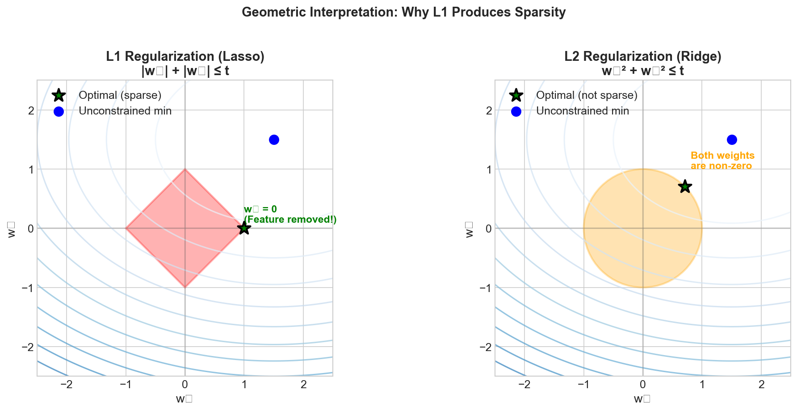
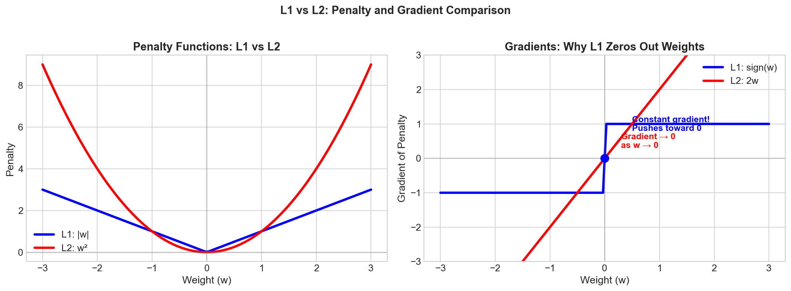
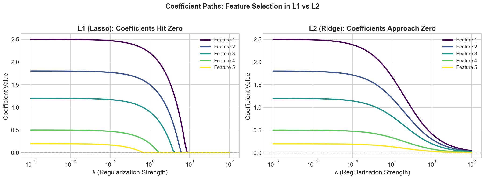
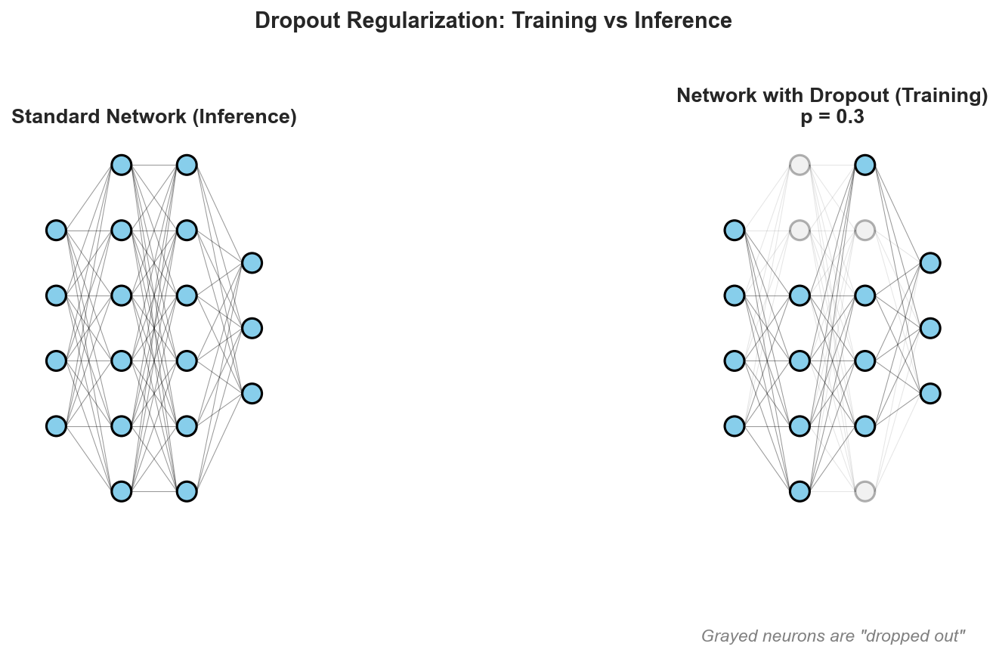
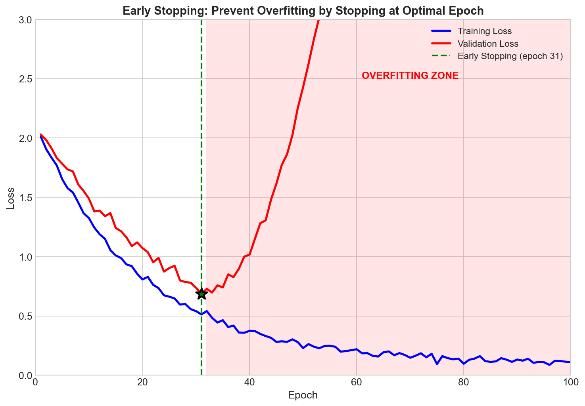
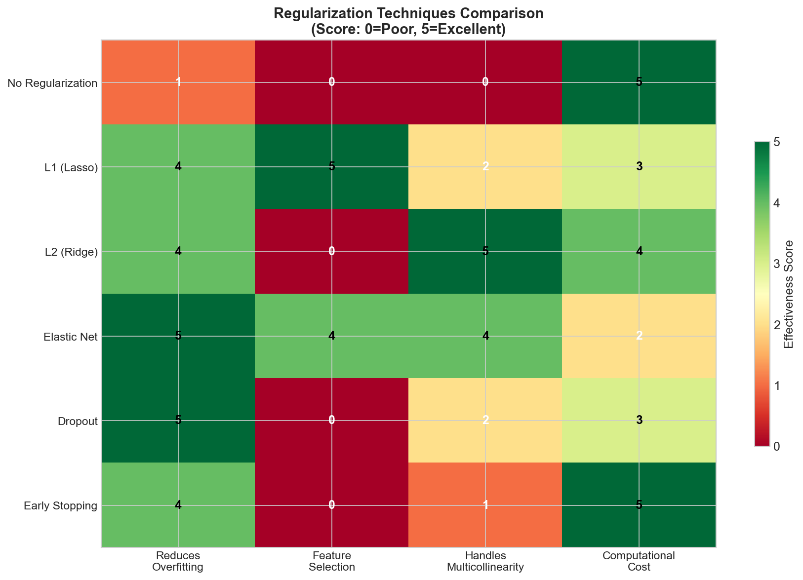

# Regularization Techniques - Interview FAQ

## Overview

Regularization is a fundamental technique in machine learning used to prevent overfitting by adding a penalty term to the loss function. This penalty discourages the model from learning overly complex patterns that may not generalize well to unseen data. Understanding regularization is critical for ML interviews, as it demonstrates knowledge of the bias-variance tradeoff and model optimization.

**Why Regularization Matters:**
- Reduces overfitting by constraining model complexity
- Improves generalization to new, unseen data
- Helps with feature selection (especially L1 regularization)
- Essential for high-dimensional datasets where features exceed samples

---

## Common Interview Questions

### Q1: What is regularization and why do we need it?

**Answer:**

Regularization is a technique that adds a penalty term to the loss function to constrain the model's complexity. The primary purpose is to prevent overfitting, which occurs when a model learns the training data too well, including its noise and outliers, resulting in poor performance on new data.

**Key reasons we need regularization:**

1. **Bias-Variance Tradeoff:** Regularization increases bias slightly but significantly reduces variance, leading to better generalization.

2. **Preventing Overfitting:** Complex models with many parameters can memorize training data. Regularization constrains parameter magnitudes, forcing simpler solutions.

3. **Handling High-Dimensional Data:** When the number of features exceeds the number of samples, regularization helps prevent the model from fitting to noise.

4. **Numerical Stability:** Regularization can improve the conditioning of optimization problems, making them more numerically stable.

The regularized loss function takes the form:

**Regularized Loss = Original Loss + lambda * Penalty Term**

Where lambda (also called alpha) controls the strength of regularization.

---

### Q2: What is the difference between L1 and L2 regularization?

**Answer:**

L1 and L2 regularization differ in their penalty terms, geometric interpretations, and effects on model parameters.

| Aspect | L1 (Lasso) | L2 (Ridge) |
|--------|------------|------------|
| Penalty Term | Sum of absolute values of weights | Sum of squared weights |
| Geometric Shape | Diamond (rhombus) constraint region | Circular constraint region |
| Sparsity | Produces sparse solutions (many zeros) | Shrinks all weights but rarely to zero |
| Feature Selection | Built-in feature selection | No automatic feature selection |
| Correlated Features | Arbitrarily selects one feature | Distributes weight among correlated features |
| Solution Uniqueness | May have multiple solutions | Always has a unique solution |
| Computational Complexity | More complex (non-differentiable at zero) | Simpler (closed-form solution exists) |

**L1 Regularization (Lasso):**
- Loss = Original Loss + lambda * sum of absolute values of weights
- Encourages sparsity by driving some weights exactly to zero
- Useful for feature selection and interpretable models

**L2 Regularization (Ridge):**
- Loss = Original Loss + lambda * sum of squared weights
- Shrinks all weights proportionally but keeps them non-zero
- Better when all features are expected to be relevant

---

### Q3: Why does L1 regularization produce sparse solutions while L2 does not?

**Answer:**

This is a classic interview question that tests understanding of optimization geometry. The answer lies in the shape of the constraint regions and how they interact with the loss function's contours.

**Geometric Explanation:**

- **L1 Constraint Region:** Forms a diamond (rhombus) shape with corners on the axes. The corners represent sparse solutions where one or more weights are exactly zero.

- **L2 Constraint Region:** Forms a circle (or hypersphere in higher dimensions) with no corners.

When minimizing the loss function subject to these constraints, the solution occurs where the loss function's contour first touches the constraint region.

**Why L1 Produces Sparsity:**

1. **Corner Intersections:** The diamond's corners lie on the coordinate axes. Since elliptical loss contours are more likely to first touch a corner than a flat edge, L1 solutions often land on corners where some weights are exactly zero.

2. **Gradient Behavior:** The L1 penalty has a constant gradient magnitude regardless of weight magnitude. Even small weights receive the same "push" toward zero as large weights.

3. **Non-Smooth Penalty:** The L1 penalty is non-differentiable at zero, creating a "kink" that makes weights more likely to land exactly at zero during optimization.

**Why L2 Does Not Produce Sparsity:**

1. **No Corners:** The circular constraint has no corners, so intersections typically occur at points where all weights are non-zero.

2. **Proportional Gradient:** The L2 penalty gradient is proportional to the weight magnitude. As weights approach zero, the regularization pressure decreases proportionally, making it unlikely for weights to reach exactly zero.

---

### Q4: What is Elastic Net regularization?

**Answer:**

Elastic Net is a hybrid regularization technique that combines both L1 and L2 penalties. It was designed to overcome limitations of pure L1 regularization while retaining its benefits.

**Formula:**

Elastic Net Loss = Original Loss + lambda1 * L1 Penalty + lambda2 * L2 Penalty

Or equivalently with a mixing parameter alpha (0 to 1):

Elastic Net Loss = Original Loss + lambda * (alpha * L1 + (1-alpha) * L2)

**Advantages of Elastic Net:**

1. **Handles Correlated Features:** Unlike L1, which arbitrarily selects one feature from a group of correlated features, Elastic Net tends to select or reject groups together.

2. **Sparsity with Stability:** Retains the sparsity benefit of L1 while having the stability of L2.

3. **No Limitation on Selected Features:** L1 can select at most n features when n less than p (samples less than features). Elastic Net does not have this limitation.

4. **Grouping Effect:** Highly correlated features tend to have similar coefficients.

**When to Use Elastic Net:**

- When you have many correlated features
- When you want sparsity but L1 alone is unstable
- When the number of features significantly exceeds the number of samples
- When you want to balance feature selection with grouped feature handling

---

### Q5: What is dropout and how does it prevent overfitting?

**Answer:**

Dropout is a regularization technique specifically designed for neural networks. During training, it randomly "drops" (sets to zero) a proportion of neurons in each layer with probability p (typically 0.2-0.5).

**How Dropout Works:**

1. **During Training:** For each training example, randomly select neurons to drop. Forward and backward passes proceed as normal, but dropped neurons do not contribute.

2. **During Inference:** Use all neurons but scale their outputs by (1-p) to account for the fact that more neurons are active than during training. Alternatively, use inverted dropout where activations are scaled by 1/(1-p) during training so no adjustment is needed at inference.

**Why Dropout Prevents Overfitting:**

1. **Ensemble Effect:** Dropout can be viewed as training an ensemble of 2^n different networks (where n is the number of neurons) that share weights. The final prediction averages over all these sub-networks.

2. **Prevents Co-adaptation:** Without dropout, neurons can develop complex co-dependencies on each other. Dropout forces neurons to be useful independently, leading to more robust features.

3. **Noise Injection:** Adding noise during training is a form of regularization. Dropout adds structured noise that helps the network generalize.

4. **Approximate Bayesian Inference:** Dropout has been shown to approximate Bayesian inference over network weights, providing uncertainty estimates.

**Practical Considerations:**

- Typical dropout rates: 0.2-0.5 for hidden layers, 0.1-0.2 for input layers
- Higher dropout for larger layers, lower for smaller layers
- Not typically used with batch normalization (though recent research shows they can be combined)
- Increase training time as convergence is slower with dropout

---

### Q6: What is early stopping and how does it relate to regularization?

**Answer:**

Early stopping is an implicit regularization technique that halts training when validation performance stops improving, even if training loss continues to decrease.

**How Early Stopping Works:**

1. **Monitor Validation Loss:** Track model performance on a held-out validation set during training.

2. **Patience Parameter:** Define a patience value (e.g., 10 epochs). If validation performance does not improve for this many consecutive epochs, stop training.

3. **Best Model Checkpoint:** Save the model weights at the point of best validation performance and restore them at the end of training.

**Why Early Stopping is a Form of Regularization:**

1. **Limits Model Complexity:** By stopping before the model fully converges on training data, early stopping implicitly constrains the effective capacity of the model.

2. **Equivalent to L2 Regularization:** There is a theoretical connection showing that early stopping in gradient descent is approximately equivalent to L2 regularization, with the number of training steps inversely related to the regularization strength.

3. **Prevents Memorization:** As training progresses, models transition from learning general patterns to memorizing specific training examples. Early stopping prevents this transition.

**Advantages of Early Stopping:**

- No additional hyperparameter (beyond patience) to tune
- Computationally efficient (saves training time)
- Works with any loss function and architecture
- Can be combined with other regularization techniques

**Disadvantages:**

- Requires a validation set (reduces training data)
- May stop too early if validation loss is noisy
- Does not provide the same explicit control as L1/L2 regularization

---

### Q7: How do you choose the regularization strength (lambda/alpha)?

**Answer:**

Choosing the right regularization strength is crucial. Too little regularization leads to overfitting; too much leads to underfitting.

**Methods for Choosing Lambda:**

1. **Cross-Validation:**
   - The most reliable method
   - Try a logarithmic grid of values (e.g., 10^-4, 10^-3, 10^-2, 10^-1, 1, 10)
   - Use k-fold cross-validation to evaluate each value
   - Select the lambda with best average validation performance

2. **Regularization Path:**
   - Compute solutions for a range of lambda values efficiently
   - Algorithms like LARS (Least Angle Regression) can compute the entire L1 regularization path
   - Examine how coefficients change with lambda to understand feature importance

3. **Information Criteria:**
   - AIC (Akaike Information Criterion) or BIC (Bayesian Information Criterion)
   - Balance model fit with complexity
   - Faster than cross-validation but makes assumptions about data distribution

4. **Bayesian Approaches:**
   - Treat lambda as a hyperparameter with a prior distribution
   - Use empirical Bayes or full Bayesian inference to estimate optimal value

**Practical Guidelines:**

- Start with a wide range and narrow down based on cross-validation results
- The "1 standard error rule": Select the simplest model within one standard error of the best performance
- Consider the interpretability-accuracy tradeoff when selecting lambda
- Higher lambda for simpler, more interpretable models; lower for maximum accuracy

---

### Q8: When should you use L1 vs L2 regularization?

**Answer:**

The choice between L1 and L2 depends on the problem characteristics and desired outcomes.

**Use L1 (Lasso) When:**

1. **Feature Selection is Needed:** L1 automatically selects important features by driving irrelevant feature weights to zero.

2. **Interpretability is Important:** Sparse models are easier to interpret and explain.

3. **Many Irrelevant Features:** When you suspect most features are noise, L1 can identify the signal.

4. **Memory/Speed Constraints:** Sparse models require less storage and compute faster at inference time.

5. **High-Dimensional Sparse Problems:** Natural language processing, genomics, and other domains with many features but few relevant ones.

**Use L2 (Ridge) When:**

1. **All Features are Relevant:** When domain knowledge suggests all features contribute, L2 shrinks them appropriately without eliminating any.

2. **Correlated Features:** L2 handles multicollinearity better by distributing weight among correlated features.

3. **Numerical Stability:** L2 ensures the optimization problem is well-conditioned and has a unique solution.

4. **Predictive Accuracy is Primary:** L2 often achieves slightly better prediction when all features are informative.

5. **Smooth Optimization:** L2's differentiability makes optimization simpler and more stable.

**Use Elastic Net When:**

- You need sparsity but have correlated feature groups
- L1 is too aggressive in feature selection
- You want a balance between L1's sparsity and L2's stability

---

### Q9: How is regularization applied in neural networks?

**Answer:**

Neural networks employ various regularization techniques beyond the traditional L1/L2 approaches.

**Weight Regularization (L1/L2):**

- Applied to the weight matrices of each layer
- L2 regularization (weight decay) is most common
- Typically applied only to weights, not biases
- Added to the loss function as: Total Loss = Data Loss + lambda * Weight Penalty

**Dropout:**

- Most popular neural network regularization
- Randomly zeros activations during training
- Typical rates: 0.2-0.5 for hidden layers
- Variants include DropConnect, Spatial Dropout, and Variational Dropout

**Batch Normalization:**

- Normalizes layer inputs during training
- Has regularization effects through mini-batch noise
- Reduces need for dropout in many cases

**Data Augmentation:**

- Creates modified versions of training examples
- Acts as regularization by increasing effective dataset size
- Examples: image rotation, flipping, color jittering, text paraphrasing

**Label Smoothing:**

- Softens hard labels (e.g., 1.0 becomes 0.9)
- Prevents the model from becoming overconfident
- Regularizes by reducing the target distribution's entropy

**Early Stopping:**

- Monitors validation loss during training
- Stops when validation performance degrades
- Implicitly regularizes by limiting training iterations

**Noise Injection:**

- Adding noise to inputs, weights, or gradients
- Dropout is a specific form of noise injection
- Gaussian noise on weights is another approach

**Practical Neural Network Regularization Strategy:**

1. Start with batch normalization and modest dropout (0.2-0.3)
2. Add weight decay (L2) with lambda around 10^-4 to 10^-2
3. Use data augmentation appropriate to the domain
4. Implement early stopping as a safety net
5. Tune regularization hyperparameters via validation performance

---

### Q10: What are the mathematical formulas for common regularization techniques?

**Answer:**

Understanding the mathematical foundations is essential for ML interviews.

**L1 Regularization (Lasso):**

Loss_L1 = (1/n) * sum(y_i - f(x_i))^2 + lambda * sum(|w_j|)

The penalty is the sum of absolute values of weights, creating a diamond-shaped constraint region.

**L2 Regularization (Ridge):**

Loss_L2 = (1/n) * sum(y_i - f(x_i))^2 + lambda * sum(w_j^2)

The penalty is the sum of squared weights, creating a circular constraint region.

**Elastic Net:**

Loss_EN = (1/n) * sum(y_i - f(x_i))^2 + lambda * [alpha * sum(|w_j|) + (1-alpha) * sum(w_j^2)]

Combines L1 and L2 with mixing parameter alpha in range 0 to 1.

**Dropout:**

During training for each neuron: output = input * mask / (1-p)

Where mask is Bernoulli(1-p) and p is the dropout probability.

**Weight Decay (equivalent to L2 for SGD):**

w_new = w_old - learning_rate * (gradient + lambda * w_old)

This shrinks weights by factor (1 - learning_rate * lambda) at each step.

---

### Q11: How does regularization affect the bias-variance tradeoff?

**Answer:**

Regularization directly manages the bias-variance tradeoff by controlling model complexity.

**Without Regularization (lambda = 0):**
- Low bias: Model can fit training data closely
- High variance: Small changes in training data cause large changes in model
- Risk: Overfitting

**With Strong Regularization (large lambda):**
- High bias: Model is constrained to simple solutions
- Low variance: Model is stable across different training samples
- Risk: Underfitting

**Optimal Regularization:**
- Balanced bias and variance
- Minimizes total expected error (bias^2 + variance + irreducible error)
- Found through cross-validation

**Intuition:**

Think of regularization as a constraint on how "flexible" the model can be. A highly flexible model can contort to fit any training data perfectly but may not generalize. Regularization reduces this flexibility, accepting slightly worse training performance for better generalization.

---

### Q12: Can you explain the Bayesian interpretation of regularization?

**Answer:**

From a Bayesian perspective, regularization corresponds to placing prior distributions on model parameters.

**L2 Regularization = Gaussian Prior:**

- L2 penalty is equivalent to Maximum A Posteriori (MAP) estimation with a Gaussian (normal) prior on weights
- Prior: w ~ Normal(0, 1/lambda)
- Larger lambda means a tighter prior centered at zero

**L1 Regularization = Laplace Prior:**

- L1 penalty is equivalent to MAP estimation with a Laplace (double exponential) prior
- Prior: w ~ Laplace(0, 1/lambda)
- The Laplace distribution's sharp peak at zero explains L1's sparsity-inducing property

**Why This Matters:**

1. **Principled Regularization Strength:** The Bayesian view suggests that lambda should reflect our prior belief about weight magnitudes.

2. **Uncertainty Quantification:** Full Bayesian inference (not just MAP) provides uncertainty estimates on predictions.

3. **Automatic Relevance Determination:** Some Bayesian methods automatically determine appropriate regularization per feature.

4. **Model Selection:** Bayesian evidence can help compare different regularization approaches.

**Interview Tip:** Demonstrating understanding of this connection shows deep knowledge of both frequentist and Bayesian perspectives.

---

## Visual Concepts

### L1 vs L2 Geometry

The geometric interpretation of regularization shows why L1 produces sparse solutions. The diamond-shaped L1 constraint has corners on the axes, making solutions more likely to have zero coefficients.

### Penalty Curves

The penalty curves illustrate how L1 and L2 penalties behave differently as weight values change. Note how L1 has a constant slope while L2's slope decreases as weights approach zero.

### Coefficient Paths

Regularization paths show how coefficients change as the regularization strength varies. L1 paths show coefficients going to exactly zero, while L2 paths shrink continuously.

### Dropout Mechanism

Dropout randomly deactivates neurons during training, forcing the network to learn redundant representations and preventing co-adaptation between neurons.

### Early Stopping

Early stopping monitors validation loss and halts training when it begins to increase, even if training loss continues to decrease. This prevents the model from overfitting to the training data.

### Regularization Methods Comparison

A comprehensive comparison of different regularization techniques showing their relative strengths in terms of sparsity, stability, and computational efficiency.

---

## Key Formulas Summary

| Technique | Formula | Key Property |
|-----------|---------|--------------|
| L1 (Lasso) | Loss + lambda * sum of absolute values of w | Sparsity, feature selection |
| L2 (Ridge) | Loss + lambda * sum of w squared | Stability, handles multicollinearity |
| Elastic Net | Loss + lambda * (alpha * L1 + (1-alpha) * L2) | Combines benefits of both |
| Dropout | Keep probability = 1 - p | Ensemble effect, prevents co-adaptation |
| Weight Decay | w = w - lr * (grad + lambda * w) | Shrinks weights each step |

---

## Comparison Table

| Aspect | L1 (Lasso) | L2 (Ridge) | Elastic Net | Dropout | Early Stopping |
|--------|------------|------------|-------------|---------|----------------|
| Type | Explicit | Explicit | Explicit | Implicit | Implicit |
| Sparsity | Yes | No | Partial | No | No |
| Feature Selection | Yes | No | Yes | No | No |
| Closed-form Solution | No | Yes | No | N/A | N/A |
| Handles Correlation | Poorly | Well | Well | N/A | N/A |
| Neural Network Use | Common | Very Common | Less Common | Standard | Standard |
| Computational Cost | Moderate | Low | Moderate | Low | Low |
| Hyperparameters | lambda | lambda | lambda, alpha | drop rate | patience |

---

## Interview Tips

1. **Be ready to derive:** Know how to show L1 produces sparsity geometrically.

2. **Understand tradeoffs:** Always discuss when each technique is appropriate.

3. **Connect to Bayesian:** Mentioning the prior interpretation shows depth.

4. **Practical experience:** Be ready to discuss how you've tuned regularization in real projects.

5. **Modern context:** Know how regularization applies to deep learning beyond just L1/L2.

6. **Mathematical fluency:** Be comfortable writing out and explaining the loss function formulas.

---

## Additional Resources

- Elements of Statistical Learning (Hastie, Tibshirani, Friedman) - Chapters 3 and 7
- Deep Learning (Goodfellow, Bengio, Courville) - Chapter 7
- Pattern Recognition and Machine Learning (Bishop) - Chapter 3

---

*Last Updated: January 2026*
