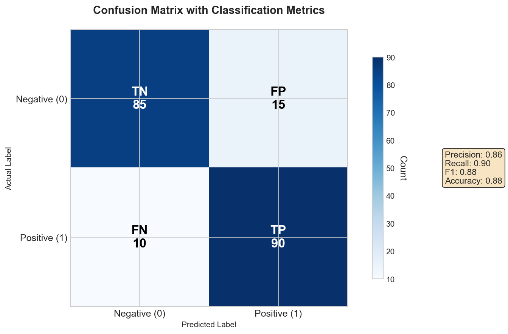
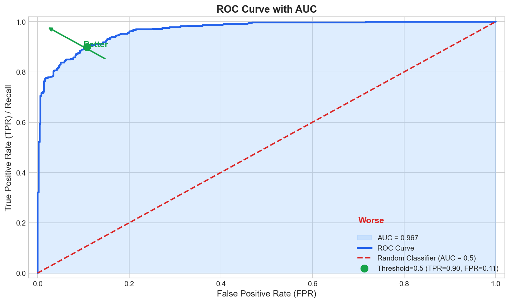
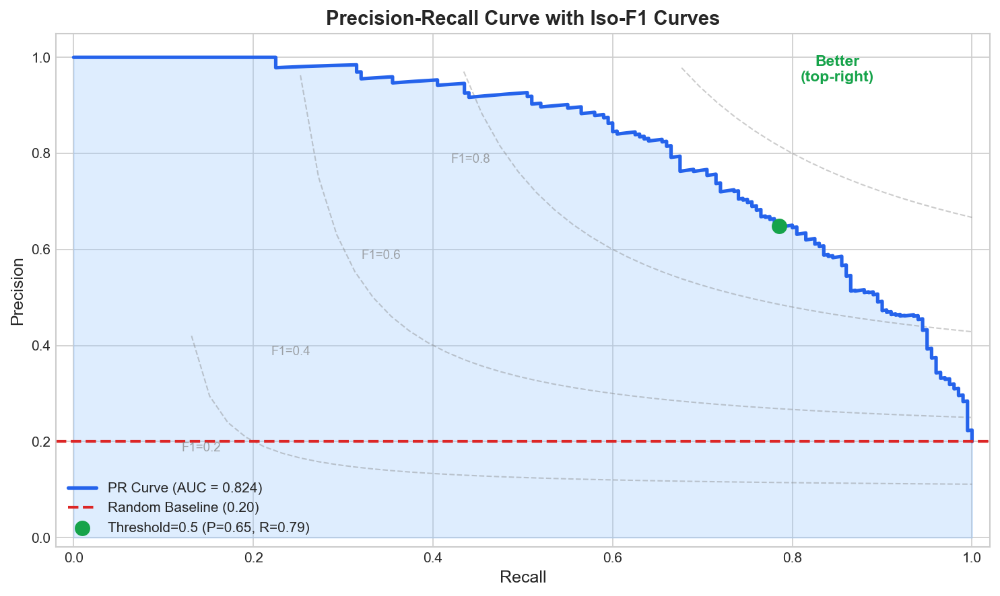
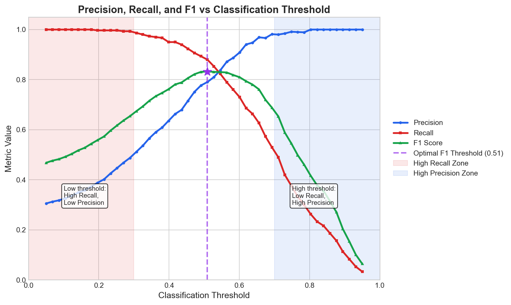
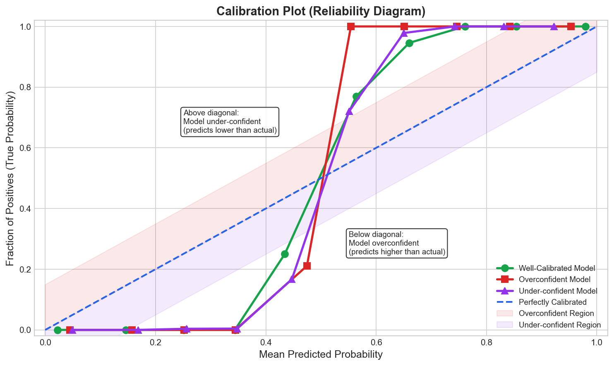

# Evaluation Metrics Interview FAQ

> **Choose the right metric for your problem**

Understanding evaluation metrics is critical for any ML interview. Choosing the wrong metric can lead to models that perform well on paper but fail in production.

---

## Quick Navigation

| Section | Topics Covered | Difficulty |
|---------|---------------|------------|
| [Classification Metrics](#classification-metrics) | Accuracy, Precision, Recall, F1, AUC | Fundamental |
| [Precision vs Recall](#precision-vs-recall-deep-dive) | When to prioritize which metric | Intermediate |
| [ROC vs PR Curves](#roc-vs-precision-recall-curves) | Curve comparison and interpretation | Intermediate |
| [Regression Metrics](#regression-metrics) | MSE, RMSE, MAE, R-squared, MAPE | Fundamental |
| [MAE vs RMSE](#mae-vs-rmse-deep-dive) | When to use which error metric | Intermediate |
| [Ranking Metrics](#ranking-metrics) | NDCG, MAP, MRR | Advanced |
| [Imbalanced Data](#metrics-for-imbalanced-data) | Handling class imbalance | Intermediate |
| [Micro vs Macro Averaging](#micro-vs-macro-averaging) | Multi-class metric aggregation | Intermediate |
| [Calibration](#calibration-and-brier-score) | Probability calibration metrics | Advanced |

---

## Classification Metrics

### Q1: What is accuracy and when should you NOT use it?

**Accuracy** = (TP + TN) / Total

**When NOT to use:**
- **Imbalanced datasets**: 99% negative class means "always negative" gets 99% accuracy
- **Different error costs**: Missing cancer (FN) vs false alarm (FP)
- **Rare event detection**: Fraud, anomalies, rare diseases

---

### Q2: Explain Precision and Recall with examples.



**Precision** = TP / (TP + FP) - "When I predict positive, am I right?"

**Recall** = TP / (TP + FN) - "Did I find all the positives?"

| Metric | Example |
|--------|---------|
| **Precision** | 90 of 100 flagged spam emails were actually spam = 90% |
| **Recall** | Caught 80 of 100 actual spam emails = 80% |

---

### Q3: What is the F1 Score and why use it?

**F1 Score** is the harmonic mean of precision and recall:

$$F1 = 2 \cdot \frac{\text{Precision} \cdot \text{Recall}}{\text{Precision} + \text{Recall}}$$

**Why harmonic mean?** It penalizes extreme imbalances:

| Precision | Recall | Arithmetic Mean | F1 (Harmonic) |
|-----------|--------|-----------------|---------------|
| 1.0 | 0.0 | 0.5 | 0.0 |
| 0.9 | 0.1 | 0.5 | 0.18 |
| 0.7 | 0.7 | 0.7 | 0.7 |

**F-beta Score:** Generalizes F1 with configurable weighting:
- **F0.5**: Weights precision higher (FP cost > FN)
- **F2**: Weights recall higher (FN cost > FP)

---

### Q4: What is AUC-ROC and how do you interpret it?



**ROC Curve** plots TPR (Recall) vs FPR at all thresholds. **AUC-ROC** = Area Under Curve.

| AUC Value | Meaning |
|-----------|---------|
| 0.5 | Random guessing |
| 0.7-0.8 | Acceptable |
| 0.8-0.9 | Good |
| 0.9+ | Excellent |

**Probabilistic Interpretation:** AUC = P(random positive scored higher than random negative)

---

### Q5: What is AUC-PR and when should you use it?



**PR Curve** plots Precision vs Recall. The iso-F1 curves show constant F1 score contours.

| Aspect | ROC Curve | PR Curve |
|--------|-----------|----------|
| Uses TN | Yes (in FPR) | No |
| Class imbalance | Less sensitive | Directly reflects it |
| Baseline | Diagonal (0.5) | Positive class % |
| Best for | Balanced | Imbalanced |

**Rule:** Use PR-AUC when positive class is rare.

---

### Q6: What is Log Loss?

**Log Loss** (Cross-Entropy) measures quality of predicted probabilities:

$$\text{Log Loss} = -\frac{1}{N}\sum_{i=1}^{N}[y_i \log(p_i) + (1-y_i)\log(1-p_i)]$$

**Key Properties:**
- Range: 0 to infinity (lower is better)
- Penalizes confident wrong predictions severely
- Requires probability outputs (not just hard labels)

**Use when:** Confidence of predictions matters, not just correctness.

---

## Precision vs Recall Deep Dive



The visualization above shows how precision, recall, and F1 change with classification threshold.

### Q7: When should you prioritize Precision?

**Prioritize Precision when FP costly:** Spam filtering, drug recommendations, automated blocking, alert systems.

---

### Q8: When should you prioritize Recall?

**Prioritize Recall when FN costly:** Cancer screening, fraud detection, security threats, manufacturing defects.

---

### Q9: How do you choose in practice?

1. **Quantify error costs** with stakeholders
2. **Calculate cost ratio:** Cost(FN) / Cost(FP)
3. **Choose threshold** from the metrics curve above

| Cost Ratio | Strategy |
|------------|----------|
| FN >> FP | Low threshold (high recall zone) |
| FP >> FN | High threshold (high precision zone) |
| FN = FP | Optimal F1 threshold |

---

## ROC vs Precision-Recall Curves

### Q10: Compare ROC and PR curves.

See the ROC and PR curve visualizations in Q4 and Q5 above.

| Aspect | ROC Curve | PR Curve |
|--------|-----------|----------|
| **Axes** | TPR vs FPR | Precision vs Recall |
| **Random baseline** | Diagonal (AUC=0.5) | Horizontal at positive % |
| **Perfect classifier** | Top-left corner | Top-right corner |
| **Imbalanced data** | Can be overly optimistic | More informative |

**Example on imbalanced data (1% positive):** Same model: ROC-AUC=0.95 (looks great!) vs PR-AUC=0.30 (reveals truth).

**Interview Tip:** ROC misleads for imbalanced data because large TN inflates FPR denominator.

---

## Regression Metrics

### Q11: Explain MSE and RMSE.

**MSE:** $\text{MSE} = \frac{1}{n}\sum(y_i - \hat{y}_i)^2$

**RMSE:** $\text{RMSE} = \sqrt{\text{MSE}}$

| Property | MSE | RMSE |
|----------|-----|------|
| Units | Squared | Same as target |
| Outlier sensitivity | Very high | High |
| Interpretability | Harder | Easier |

**Why square errors?** Makes all positive, penalizes large errors, differentiable everywhere.

---

### Q12: Explain MAE and when to prefer it.

**MAE:** $\text{MAE} = \frac{1}{n}\sum|y_i - \hat{y}_i|$

| Aspect | MAE | RMSE |
|--------|-----|------|
| Outlier sensitivity | Robust | Sensitive |
| Error weighting | Equal | Large errors weighted more |
| Interpretation | "Average error" | "Typical error" |

**Key Relationship:** MAE <= RMSE. If RMSE >> MAE, there are outliers.

---

### Q13: What is R-squared and its limitations?

**R-squared:** $R^2 = 1 - \frac{SS_{res}}{SS_{tot}}$

Proportion of variance explained by the model (0 to 1, can be negative).

**Limitations (critical for interviews):**

| Limitation | Explanation |
|------------|-------------|
| Always increases with features | Adding noise still increases R-squared |
| Doesn't indicate causation | High R-squared != good causal model |
| Scale-dependent | Can't compare across datasets |
| Can be negative | When worse than mean baseline |

**Adjusted R-squared** penalizes adding unhelpful features.

---

### Q14: What is MAPE?

**MAPE:** $\text{MAPE} = \frac{100\%}{n}\sum\left|\frac{y_i - \hat{y}_i}{y_i}\right|$

| Advantage | Limitation |
|-----------|------------|
| Scale-independent | Division by zero when y=0 |
| Easy to interpret | Asymmetric (penalizes over-predictions more) |
| Comparable across datasets | Biased toward under-predictions |

---

## MAE vs RMSE Deep Dive

### Q15: When should you use MAE vs RMSE?

| Use MAE When | Use RMSE When |
|--------------|---------------|
| Outliers present | Data is clean |
| All errors matter equally | Large errors especially bad |
| Robust estimate needed | Statistical properties important |
| Business cares about average error | Business cares about worst-case |

**Practical Examples:**

| Scenario | Better Metric | Reasoning |
|----------|---------------|-----------|
| House prices | MAE | Luxury homes are outliers |
| Weather forecast | RMSE | Large errors are dangerous |
| Stock returns | MAE | Outliers common |
| Manufacturing | RMSE | Large deviations cause issues |

---

### Q16: How do outliers affect MAE vs RMSE?

Errors: [10, 10, 10, 10, 50] (one outlier)

| Metric | Result | Outlier Contribution |
|--------|--------|---------------------|
| MAE | 18 | 56% of total |
| RMSE | 24.1 | 86% of total |

**Key Insight:** RMSE is disproportionately affected by outliers due to squaring.

---

## Ranking Metrics

### Q17: What is NDCG?

**NDCG** (Normalized Discounted Cumulative Gain) measures ranking quality with position discounting.

**DCG:** $DCG_k = \sum_{i=1}^{k} \frac{rel_i}{\log_2(i+1)}$

**NDCG:** $NDCG_k = \frac{DCG_k}{IDCG_k}$ (normalized by ideal ranking)

| Property | Value |
|----------|-------|
| Range | 0 to 1 |
| Perfect ranking | 1.0 |
| Position-aware | Yes (log discount) |
| Graded relevance | Yes |

---

### Q18: What is Mean Average Precision (MAP)?

**AP** for one query: Average of precision values at positions where relevant items appear.

$$AP = \frac{1}{|R|}\sum_{k=1}^{n} P(k) \cdot rel(k)$$

**MAP:** Mean of AP across all queries.

**Example:** Results [1, 0, 1, 0, 1] (1=relevant)

| Position | P@k | Contribution |
|----------|-----|--------------|
| 1 | 1.0 | 1.0 |
| 3 | 0.67 | 0.67 |
| 5 | 0.6 | 0.6 |

AP = (1.0 + 0.67 + 0.6) / 3 = 0.76

---

### Q19: What is MRR?

**MRR** (Mean Reciprocal Rank): Average of 1/rank of first relevant result.

$$MRR = \frac{1}{|Q|}\sum_{i=1}^{|Q|} \frac{1}{rank_i}$$

**Use when:** Only the first relevant result matters (Q&A systems).

**Ranking Metrics Comparison:**

| Metric | Position Discount | Graded Relevance | Use Case |
|--------|-------------------|------------------|----------|
| NDCG | Logarithmic | Yes | General ranking |
| MAP | Linear (via AP) | No (binary) | Document retrieval |
| MRR | Only first | No | First-result focused |

---

## Metrics for Imbalanced Data

### Q20: Why is accuracy misleading for imbalanced data?

Fraud detection with 0.1% fraud rate:

| Model | Strategy | Accuracy | Recall |
|-------|----------|----------|--------|
| A | Always "not fraud" | 99.9% | 0% |
| B | Actual ML model | 98% | 70% |

Model A has higher accuracy but is useless.

**Better Metrics:**
- Precision, Recall, F1
- PR-AUC
- Balanced Accuracy
- Cohen's Kappa

---

### Q21: What is Balanced Accuracy?

$$\text{Balanced Accuracy} = \frac{TPR + TNR}{2}$$

Gives equal weight to each class regardless of size. Random classifier achieves 0.5.

---

### Q22: What is Cohen's Kappa?

$$\kappa = \frac{p_o - p_e}{1 - p_e}$$

Measures agreement beyond chance.

| Kappa | Agreement Level |
|-------|-----------------|
| 0.0 - 0.2 | Slight |
| 0.4 - 0.6 | Moderate |
| 0.8 - 1.0 | Almost perfect |

---

## Micro vs Macro Averaging

### Q23: Explain Micro vs Macro averaging.

**Macro:** Calculate metric per class, then average (equal weight per class).

**Micro:** Aggregate TP/FP/FN across classes, then calculate (weight by frequency).

| Aspect | Macro | Micro |
|--------|-------|-------|
| Class weighting | Equal per class | By frequency |
| Small class impact | High | Low |
| When to use | All classes equally important | Overall performance |

**Example:**

| Class | Size | F1 |
|-------|------|-----|
| A | 1000 | 0.96 |
| B | 100 | 0.75 |
| C | 10 | 0.44 |

- Macro-F1 = 0.72
- Micro-F1 = ~0.94 (dominated by class A)

---

### Q24: When to use each?

**Use Macro:** All classes equally important, rare classes matter, fairness required.

**Use Micro:** Overall performance matters, balanced classes, per-instance importance.

---

## Calibration and Brier Score

### Q25: What is probability calibration?



A **well-calibrated** model's predicted 70% means actual 70% frequency. The reliability diagram above shows how different models can be overconfident, under-confident, or well-calibrated.

**Why It Matters:** Medical diagnosis (risk must be accurate), insurance pricing, ensemble methods.

---

### Q26: What is the Brier Score?

$$\text{Brier Score} = \frac{1}{N}\sum(p_i - y_i)^2$$

| Property | Value |
|----------|-------|
| Range | 0 to 1 (lower is better) |
| Perfect | 0 |
| Random baseline | 0.25 |

**vs Log Loss:** Brier is bounded (0-1) and penalizes extreme predictions less.

---

### Q27: How do you measure calibration?

**Reliability Diagram:** Plot predicted vs actual probability (see visualization above). Perfect = diagonal.

**Expected Calibration Error (ECE):** Weighted average of calibration error per bin.

**Calibration Methods:** Platt Scaling, Temperature Scaling, Isotonic Regression.

---

## Quick Reference Tables

### Classification Metrics

| Metric | Formula | Best For |
|--------|---------|----------|
| Accuracy | (TP+TN)/Total | Balanced classes |
| Precision | TP/(TP+FP) | FP costly |
| Recall | TP/(TP+FN) | FN costly |
| F1 | 2PR/(P+R) | Balance P and R |
| AUC-ROC | Area under ROC | Balanced classes |
| AUC-PR | Area under PR | Imbalanced classes |

### Regression Metrics

| Metric | Formula | Outlier Robust |
|--------|---------|----------------|
| MSE | mean((y-y_hat)^2) | No |
| RMSE | sqrt(MSE) | No |
| MAE | mean(abs(y-y_hat)) | Yes |
| R-squared | 1 - SS_res/SS_tot | No |
| MAPE | mean(abs((y-y_hat)/y)) | Somewhat |

### Ranking Metrics

| Metric | Position Aware | Graded Relevance |
|--------|----------------|------------------|
| NDCG | Yes (log discount) | Yes |
| MAP | Yes (via AP) | No |
| MRR | Only first | No |

### Metric Selection Guide

| Problem | Class Balance | Concern | Recommended |
|---------|---------------|---------|-------------|
| Binary | Balanced | Overall | Accuracy, F1 |
| Binary | Imbalanced | Detect positives | Recall, PR-AUC |
| Binary | Imbalanced | Confident positives | Precision |
| Multi-class | Balanced | Overall | Micro-F1 |
| Multi-class | Imbalanced | All classes | Macro-F1 |
| Regression | Clean | Large errors bad | RMSE |
| Regression | Outliers | Robust | MAE |

---

## Common Interview Follow-ups

**"95% accuracy but business says it doesn't work?"**
- Check class imbalance
- Wrong metric (they care about recall)
- Poor performance on key segments
- Train-test distribution shift

**"Highly imbalanced dataset?"**
- Use PR-AUC, F1, balanced accuracy
- Resampling, class weights, threshold tuning

**"When does calibration matter?"**
- When probabilities drive decisions
- Risk scoring, medical diagnosis
- Combining multiple models

**"MAE vs RMSE?"**
- Outliers noise? Use MAE
- Outliers signal? Use RMSE
- Ask stakeholder what matters

---

## Formula Cheat Sheet

```
CLASSIFICATION
Precision   = TP / (TP + FP)
Recall      = TP / (TP + FN)
F1          = 2 * P * R / (P + R)

REGRESSION
MSE   = (1/n) * sum((y - y_hat)^2)
RMSE  = sqrt(MSE)
MAE   = (1/n) * sum(|y - y_hat|)
R^2   = 1 - SS_res / SS_tot

RANKING
DCG@k  = sum(rel_i / log2(i + 1))
NDCG@k = DCG@k / IDCG@k
MRR    = (1/Q) * sum(1 / rank_i)

CALIBRATION
Brier = (1/N) * sum((p - y)^2)
```

---

*Last updated: January 2026*
