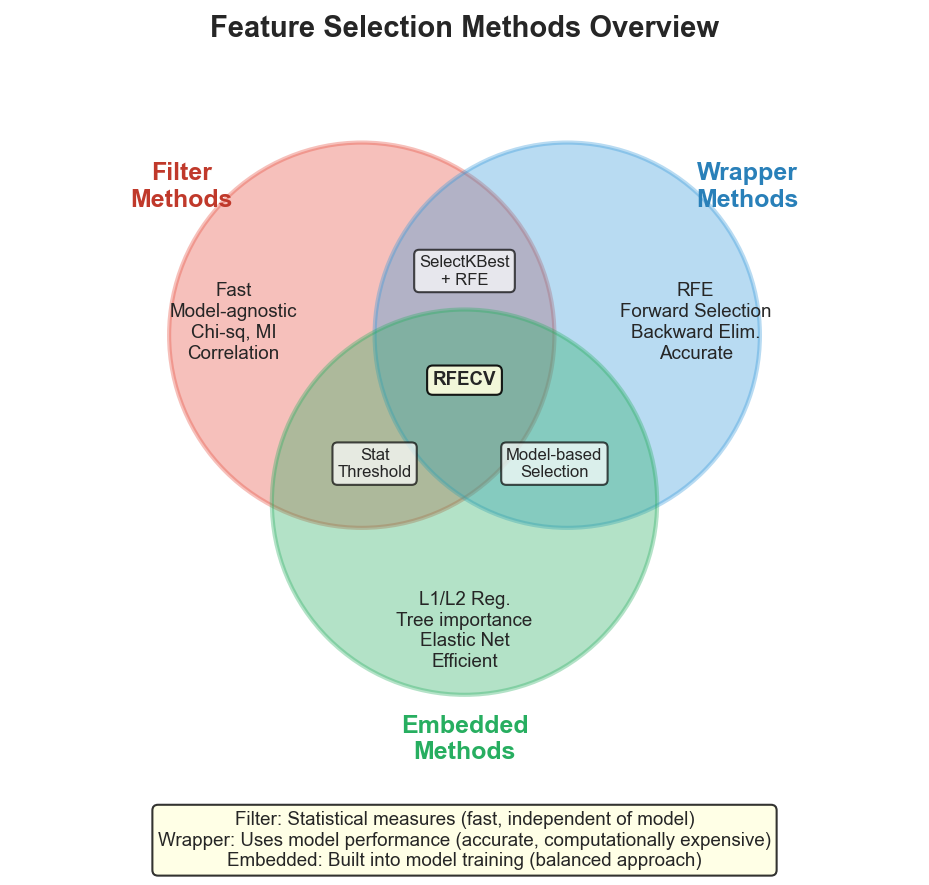
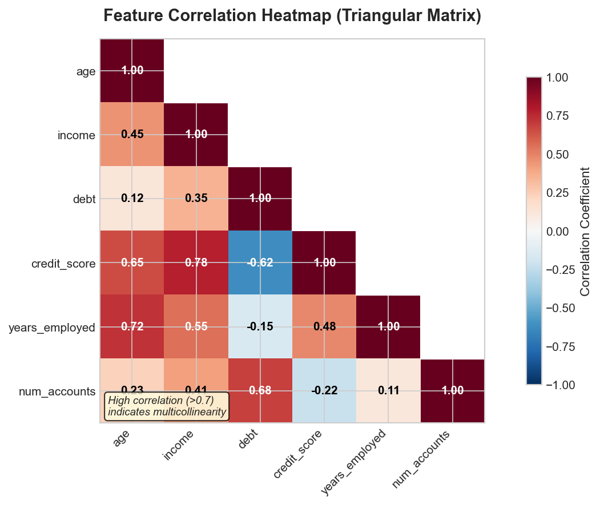
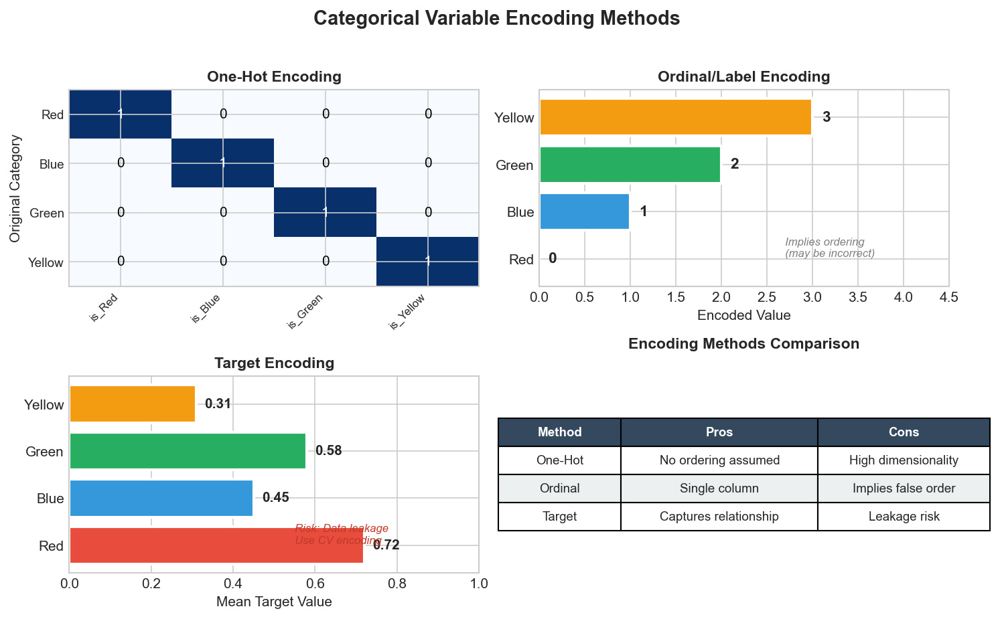
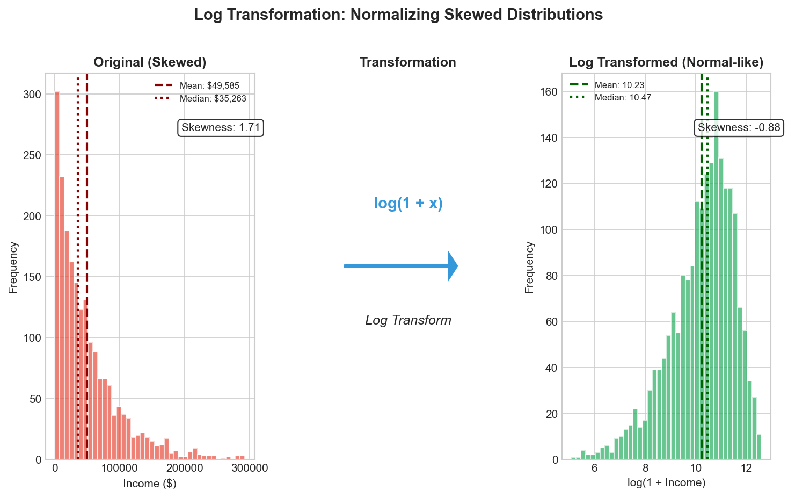
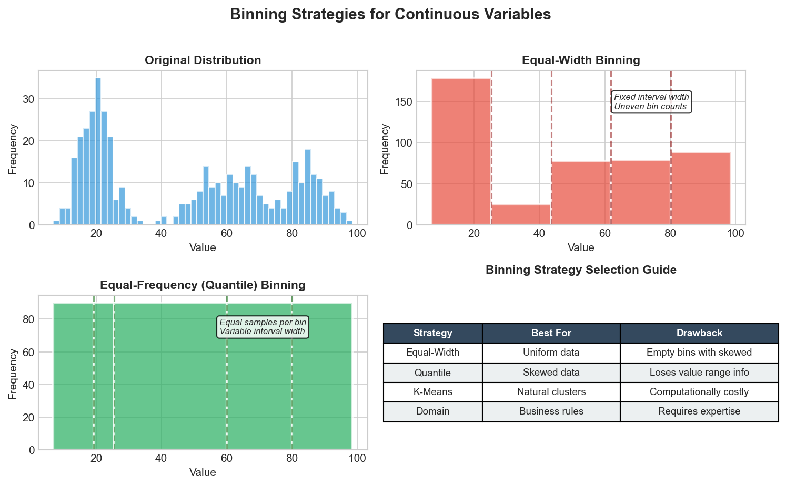
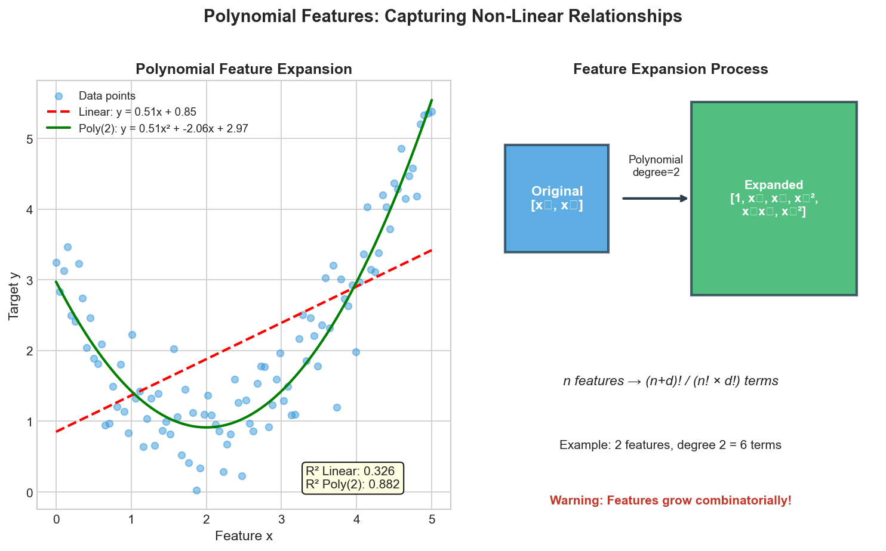

# Feature Engineering Interview FAQ

> **Transform raw data into predictive features**

Feature engineering is often considered the most critical step in the machine learning pipeline. This FAQ covers essential interview questions about creating, selecting, and transforming features to improve model performance.

---

## Fundamentals of Feature Engineering

### Q: What is feature engineering and why is it important?

**Sample Answer:**

Feature engineering is the process of using domain knowledge to extract, transform, and create new features from raw data that make machine learning algorithms work more effectively. It bridges the gap between raw data and the patterns that models can learn.

**Why it's important:**

1. **Model Performance**: Good features can dramatically improve model accuracy. The saying "garbage in, garbage out" applies directly here.

2. **Algorithm Efficiency**: Well-engineered features can make simpler models perform as well as complex ones, reducing computational costs.

3. **Interpretability**: Meaningful features make models easier to understand and explain to stakeholders.

4. **Data Representation**: Raw data often isn't in a format that algorithms can use effectively. Feature engineering transforms data into a usable representation.

**Example:**
```python
# Raw data: timestamp
# Feature engineered versions:
import pandas as pd

df['timestamp'] = pd.to_datetime(df['timestamp'])
df['hour'] = df['timestamp'].dt.hour
df['day_of_week'] = df['timestamp'].dt.dayofweek
df['is_weekend'] = df['day_of_week'].isin([5, 6]).astype(int)
df['is_business_hours'] = df['hour'].between(9, 17).astype(int)
```

**Follow-up Questions:**
- How do you decide which features to engineer?
- What's the relationship between feature engineering and domain expertise?
- How has deep learning changed the importance of feature engineering?

---

### Q: What's the difference between feature engineering and feature selection?

**Sample Answer:**

**Feature Engineering** is the process of creating new features or transforming existing ones:
- Creating interaction terms
- Extracting date components
- Encoding categorical variables
- Applying mathematical transformations

**Feature Selection** is the process of choosing a subset of existing features:
- Removing redundant features
- Identifying most predictive features
- Reducing dimensionality

```python
# Feature Engineering: Creating new features
df['price_per_sqft'] = df['price'] / df['square_feet']
df['age'] = 2024 - df['year_built']

# Feature Selection: Choosing which features to keep
from sklearn.feature_selection import SelectKBest, f_classif

selector = SelectKBest(f_classif, k=10)
X_selected = selector.fit_transform(X, y)
selected_features = X.columns[selector.get_support()]
```

**Key Distinction:**
- Feature engineering increases the feature space (creates options)
- Feature selection reduces the feature space (makes choices)

Both are essential: engineer many potential features, then select the best ones.

**Follow-up Questions:**
- When would you do feature selection before feature engineering?
- How do you balance creating many features vs. computational constraints?

---

## Feature Selection Methods

### Q: Explain the three main categories of feature selection methods.

**Sample Answer:**



**1. Filter Methods:**
- Evaluate features independently of the model
- Use statistical measures to score features
- Fast and scalable

```python
from sklearn.feature_selection import SelectKBest, chi2, f_classif, mutual_info_classif

# Chi-squared for categorical features
chi2_selector = SelectKBest(chi2, k=10)

# ANOVA F-value for numerical features
f_selector = SelectKBest(f_classif, k=10)

# Mutual Information (works for both)
mi_selector = SelectKBest(mutual_info_classif, k=10)

# Correlation-based filtering
correlation_matrix = df.corr()
highly_correlated = correlation_matrix[correlation_matrix > 0.9]
```

**2. Wrapper Methods:**
- Use model performance to evaluate feature subsets
- More accurate but computationally expensive

```python
from sklearn.feature_selection import RFE, RFECV
from sklearn.ensemble import RandomForestClassifier

# Recursive Feature Elimination
model = RandomForestClassifier()
rfe = RFE(model, n_features_to_select=10)
X_rfe = rfe.fit_transform(X, y)

# RFE with Cross-Validation
rfecv = RFECV(model, step=1, cv=5, scoring='accuracy')
X_rfecv = rfecv.fit_transform(X, y)
print(f"Optimal features: {rfecv.n_features_}")
```

**3. Embedded Methods:**
- Feature selection built into the model training
- Balance between filter and wrapper methods

```python
from sklearn.linear_model import LassoCV
from sklearn.ensemble import RandomForestClassifier

# L1 Regularization (Lasso)
lasso = LassoCV(cv=5)
lasso.fit(X, y)
important_features = X.columns[lasso.coef_ != 0]

# Tree-based importance
rf = RandomForestClassifier()
rf.fit(X, y)
importances = pd.Series(rf.feature_importances_, index=X.columns)
top_features = importances.nlargest(10)
```

**Comparison Table:**

| Method   | Speed | Accuracy | Model-Agnostic |
|----------|-------|----------|----------------|
| Filter   | Fast  | Lower    | Yes            |
| Wrapper  | Slow  | Higher   | No             |
| Embedded | Medium| High     | No             |

**Follow-up Questions:**
- When would you choose each method?
- How do you handle the computational cost of wrapper methods on large datasets?
- What are the pros and cons of using model-specific embedded methods?

---

### Q: How do you handle multicollinearity in feature selection?

**Sample Answer:**

Multicollinearity occurs when features are highly correlated, causing unstable coefficients and redundant information.



**Detection Methods:**

```python
import pandas as pd
import numpy as np
from statsmodels.stats.outliers_influence import variance_inflation_factor

# 1. Correlation Matrix - visualize as triangular heatmap
corr_matrix = df.corr().abs()
upper_triangle = corr_matrix.where(
    np.triu(np.ones(corr_matrix.shape), k=1).astype(bool)
)
high_corr_features = [col for col in upper_triangle.columns
                      if any(upper_triangle[col] > 0.85)]

# 2. Variance Inflation Factor (VIF) - VIF > 10 indicates problems
def calculate_vif(X):
    vif_data = pd.DataFrame()
    vif_data["feature"] = X.columns
    vif_data["VIF"] = [variance_inflation_factor(X.values, i)
                       for i in range(X.shape[1])]
    return vif_data
```

**Handling Strategies:**
- **Remove correlated pairs** - Drop one feature from highly correlated pairs
- **PCA** - Create uncorrelated components
- **Regularization** - L1/L2 automatically handles multicollinearity

**Follow-up Questions:**
- What VIF threshold indicates problematic multicollinearity?
- How does multicollinearity affect tree-based models vs. linear models?

---

## Handling Categorical Variables

### Q: Explain different methods for encoding categorical variables.

**Sample Answer:**



**1. One-Hot Encoding:** Best for nominal categories with low cardinality.
```python
from sklearn.preprocessing import OneHotEncoder
encoder = OneHotEncoder(sparse_output=False, drop='first')
encoded = encoder.fit_transform(df[['color']])
```

**2. Label/Ordinal Encoding:** Best for ordinal categories or tree-based models.
```python
from sklearn.preprocessing import OrdinalEncoder
oe = OrdinalEncoder(categories=[['S', 'M', 'L', 'XL']])
df['size_encoded'] = oe.fit_transform(df[['size']])
```

**3. Target Encoding:** Best for high cardinality categories. Use smoothing to prevent overfitting.
```python
from category_encoders import TargetEncoder
encoder = TargetEncoder(smoothing=1.0)
df['city_encoded'] = encoder.fit_transform(df['city'], df['target'])
```

**4. Frequency Encoding:**
```python
freq_map = df['category'].value_counts(normalize=True)
df['category_freq'] = df['category'].map(freq_map)
```

**Follow-up Questions:**
- How do you handle unseen categories at prediction time?
- When would target encoding cause data leakage?
- How do you choose between encoding methods?

---

### Q: How do you handle high cardinality categorical features?

**Sample Answer:**

High cardinality features pose challenges: dimensionality explosion with one-hot and overfitting risks.

**Key Strategies:**

| Strategy | Use Case | Example |
|----------|----------|---------|
| Grouping | Reduce rare categories | Top N + "Other" |
| Target Encoding | High cardinality | City, ZIP code |
| Hash Encoding | Very high cardinality | User IDs |
| Embeddings | Deep learning | Neural network inputs |

```python
# Grouping rare categories
top_n = df['category'].value_counts().nlargest(10).index
df['category_grouped'] = df['category'].where(df['category'].isin(top_n), 'Other')

# Target encoding with CV (prevents leakage)
from category_encoders import TargetEncoder
encoder = TargetEncoder(smoothing=10)
df['encoded'] = encoder.fit_transform(df['high_card'], y)

# Hash encoding for very high cardinality
from category_encoders import HashingEncoder
encoder = HashingEncoder(cols=['high_card'], n_components=8)
```

**Follow-up Questions:**
- What's the trade-off between grouping and target encoding?
- How do you handle new categories in production?

---

## Handling Missing Data

### Q: What are different strategies for handling missing data?

**Sample Answer:**

**1. Deletion Methods:**

```python
# Listwise deletion (remove rows)
df_clean = df.dropna()

# Column deletion (remove features with too many missing)
threshold = 0.5  # 50% missing
df_clean = df.dropna(axis=1, thresh=len(df) * (1 - threshold))
```

**2. Simple Imputation:**

```python
from sklearn.impute import SimpleImputer

# Numerical: mean, median, constant
mean_imputer = SimpleImputer(strategy='mean')
median_imputer = SimpleImputer(strategy='median')
constant_imputer = SimpleImputer(strategy='constant', fill_value=0)

# Categorical: mode, constant
mode_imputer = SimpleImputer(strategy='most_frequent')
```

**3. Advanced Imputation:**

```python
from sklearn.impute import KNNImputer, IterativeImputer

# KNN Imputation
knn_imputer = KNNImputer(n_neighbors=5)
X_imputed = knn_imputer.fit_transform(X)

# Iterative (MICE-like) Imputation
from sklearn.experimental import enable_iterative_imputer
iterative_imputer = IterativeImputer(max_iter=10, random_state=42)
X_imputed = iterative_imputer.fit_transform(X)
```

**4. Missing Indicator Feature:**

```python
from sklearn.impute import SimpleImputer, MissingIndicator
from sklearn.pipeline import FeatureUnion

# Add binary indicator for missingness
transformer = FeatureUnion([
    ('imputer', SimpleImputer(strategy='median')),
    ('indicator', MissingIndicator())
])
X_transformed = transformer.fit_transform(X)
```

**5. Model-Based Imputation:**

```python
from sklearn.ensemble import RandomForestRegressor

def model_based_imputation(df, target_col):
    # Use complete cases to train
    train = df[df[target_col].notna()]
    test = df[df[target_col].isna()]

    feature_cols = [c for c in df.columns if c != target_col]

    model = RandomForestRegressor()
    model.fit(train[feature_cols], train[target_col])

    df.loc[df[target_col].isna(), target_col] = model.predict(test[feature_cols])
    return df
```

**Choosing Strategy Based on Missing Mechanism:**

| Mechanism | Description | Recommended Strategy |
|-----------|-------------|---------------------|
| MCAR | Missing Completely at Random | Any method works |
| MAR | Missing at Random | Model-based, MICE |
| MNAR | Missing Not at Random | Domain-specific, indicator |

**Follow-up Questions:**
- How do you determine if data is MCAR, MAR, or MNAR?
- When would you prefer deletion over imputation?
- How do you handle missing data in production pipelines?

---

### Q: How do you handle missing data in a production ML pipeline?

**Sample Answer:**

**Key Principles:**

1. **Consistency**: Use the same imputation values from training in production
2. **Robustness**: Handle edge cases (all missing, new patterns)
3. **Monitoring**: Track missing data patterns over time

**Implementation:**

```python
from sklearn.pipeline import Pipeline
from sklearn.compose import ColumnTransformer
from sklearn.impute import SimpleImputer
import joblib

# Build pipeline that saves imputation parameters
numeric_transformer = Pipeline([
    ('imputer', SimpleImputer(strategy='median')),
    ('scaler', StandardScaler())
])

categorical_transformer = Pipeline([
    ('imputer', SimpleImputer(strategy='constant', fill_value='missing')),
    ('encoder', OneHotEncoder(handle_unknown='ignore'))
])

preprocessor = ColumnTransformer([
    ('num', numeric_transformer, numeric_features),
    ('cat', categorical_transformer, categorical_features)
])

# Full pipeline
pipeline = Pipeline([
    ('preprocessor', preprocessor),
    ('model', RandomForestClassifier())
])

# Fit and save
pipeline.fit(X_train, y_train)
joblib.dump(pipeline, 'model_pipeline.pkl')

# In production
pipeline = joblib.load('model_pipeline.pkl')
predictions = pipeline.predict(X_new)  # Handles missing automatically
```

**Production Safeguards:**

```python
class RobustPreprocessor:
    def __init__(self, imputer, expected_columns):
        self.imputer = imputer
        self.expected_columns = expected_columns

    def transform(self, X):
        # Add missing columns with NaN
        for col in self.expected_columns:
            if col not in X.columns:
                X[col] = np.nan

        # Remove unexpected columns
        X = X[self.expected_columns]

        # Log missing data statistics
        missing_pct = X.isnull().mean()
        if (missing_pct > 0.5).any():
            logger.warning(f"High missing rate: {missing_pct[missing_pct > 0.5]}")

        return self.imputer.transform(X)
```

**Follow-up Questions:**
- How do you monitor for data drift in missing patterns?
- What happens if a feature is 100% missing in a production batch?

---

## Feature Scaling

### Q: When and why should you scale features?

**Sample Answer:**

**When to Scale:**
- Distance-based algorithms (KNN, K-means, SVM)
- Gradient-based optimization (Neural networks, logistic regression)
- Regularized models (Lasso, Ridge)
- PCA

**NOT Required for:** Tree-based models, Naive Bayes

**Log Transformation for Skewed Data:**



**Choosing the Right Scaler:**

| Scenario | Recommended Scaler |
|----------|-------------------|
| General purpose | StandardScaler |
| Neural networks | MinMaxScaler |
| Data with outliers | RobustScaler |
| Sparse data | MaxAbsScaler |
| Skewed distributions | PowerTransformer or log |

```python
from sklearn.preprocessing import StandardScaler, RobustScaler, PowerTransformer

# Standard scaling (fit on train only!)
X_train, X_test = train_test_split(X, ...)
scaler = StandardScaler()
X_train_scaled = scaler.fit_transform(X_train)
X_test_scaled = scaler.transform(X_test)  # Only transform!

# For skewed data
power = PowerTransformer(method='yeo-johnson')
X_normalized = power.fit_transform(X_train)
```

**Follow-up Questions:**
- How do you handle scaling with new data in production?
- What happens if you don't scale features for SVM?

---

### Q: When and how should you bin continuous variables?

**Sample Answer:**

Binning (discretization) converts continuous variables into categorical bins, useful for capturing non-linear relationships and reducing noise.



```python
import pandas as pd
import numpy as np

# Equal-width binning
df['age_bins'] = pd.cut(df['age'], bins=5, labels=['Very Young', 'Young', 'Middle', 'Senior', 'Elderly'])

# Quantile (equal-frequency) binning
df['income_quantiles'] = pd.qcut(df['income'], q=5, labels=['Q1', 'Q2', 'Q3', 'Q4', 'Q5'])

# Custom domain-driven bins
df['age_group'] = pd.cut(df['age'], bins=[0, 18, 35, 50, 65, 100],
                         labels=['Minor', 'Young Adult', 'Adult', 'Middle Age', 'Senior'])
```

**Follow-up Questions:**
- When would quantile binning be better than equal-width?
- How does binning affect tree-based vs. linear models?

---

## Feature Importance

### Q: How do you determine feature importance?

**Sample Answer:**

**1. Tree-Based Importance (Impurity Decrease):**

```python
from sklearn.ensemble import RandomForestClassifier
import matplotlib.pyplot as plt

rf = RandomForestClassifier(n_estimators=100, random_state=42)
rf.fit(X_train, y_train)

# Get importance scores
importance = pd.DataFrame({
    'feature': X_train.columns,
    'importance': rf.feature_importances_
}).sort_values('importance', ascending=False)

# Visualize
plt.figure(figsize=(10, 6))
plt.barh(importance['feature'][:20], importance['importance'][:20])
plt.xlabel('Feature Importance')
plt.title('Random Forest Feature Importance')
plt.gca().invert_yaxis()
plt.tight_layout()
```

**2. Permutation Importance:**

```python
from sklearn.inspection import permutation_importance

# Model-agnostic importance
perm_importance = permutation_importance(
    rf, X_test, y_test,
    n_repeats=10,
    random_state=42,
    n_jobs=-1
)

importance_df = pd.DataFrame({
    'feature': X_test.columns,
    'importance_mean': perm_importance.importances_mean,
    'importance_std': perm_importance.importances_std
}).sort_values('importance_mean', ascending=False)
```

**3. SHAP Values (Best for Interpretability):**

```python
import shap

# Create explainer
explainer = shap.TreeExplainer(rf)
shap_values = explainer.shap_values(X_test)

# Summary plot
shap.summary_plot(shap_values[1], X_test)

# Feature importance from SHAP
shap_importance = pd.DataFrame({
    'feature': X_test.columns,
    'importance': np.abs(shap_values[1]).mean(axis=0)
}).sort_values('importance', ascending=False)
```

**4. Coefficient-Based (Linear Models):**

```python
from sklearn.linear_model import LogisticRegression

lr = LogisticRegression(penalty='l1', solver='saga')
lr.fit(X_train_scaled, y_train)

# Coefficients as importance (after scaling!)
coef_importance = pd.DataFrame({
    'feature': X_train.columns,
    'coefficient': np.abs(lr.coef_[0])
}).sort_values('coefficient', ascending=False)
```

**Comparison of Methods:**

| Method | Pros | Cons |
|--------|------|------|
| Impurity-based | Fast, built-in | Biased toward high cardinality |
| Permutation | Model-agnostic, unbiased | Slower, affected by correlated features |
| SHAP | Local + global, theoretically grounded | Computationally expensive |
| Coefficients | Interpretable, fast | Only for linear models |

**Follow-up Questions:**
- Why might impurity-based importance be misleading?
- How do you handle correlated features in importance analysis?
- When would you use SHAP over simpler methods?

---

### Q: What is permutation importance and when should you use it?

**Sample Answer:**

Permutation importance measures feature importance by randomly shuffling each feature and measuring how much model performance decreases. A feature is important if shuffling it causes a large drop in performance.

**How It Works:**

```python
from sklearn.inspection import permutation_importance

def manual_permutation_importance(model, X, y, metric, n_repeats=10):
    """Manual implementation for understanding"""
    baseline_score = metric(y, model.predict(X))
    importances = {}

    for col in X.columns:
        scores = []
        for _ in range(n_repeats):
            X_permuted = X.copy()
            X_permuted[col] = np.random.permutation(X_permuted[col])
            score = metric(y, model.predict(X_permuted))
            scores.append(baseline_score - score)
        importances[col] = {
            'mean': np.mean(scores),
            'std': np.std(scores)
        }

    return importances

# Using sklearn
perm_imp = permutation_importance(
    model, X_test, y_test,
    n_repeats=30,
    random_state=42,
    scoring='accuracy'
)
```

**Advantages:**
- Model-agnostic (works with any model)
- Computed on held-out data (measures generalization)
- Not biased by feature cardinality
- Accounts for feature interactions

**Disadvantages:**
- Computationally expensive
- Affected by correlated features (importance is split)
- Randomness requires multiple repeats

**When to Use:**
- When you need unbiased importance estimates
- For model comparison (same metric across models)
- When using non-tree-based models
- When you want to evaluate on test set

**Handling Correlated Features:**

```python
# Group correlated features and permute together
def grouped_permutation_importance(model, X, y, feature_groups):
    baseline = model.score(X, y)
    group_importance = {}

    for group_name, features in feature_groups.items():
        X_permuted = X.copy()
        for feature in features:
            X_permuted[feature] = np.random.permutation(X_permuted[feature])
        score = model.score(X_permuted, y)
        group_importance[group_name] = baseline - score

    return group_importance
```

**Follow-up Questions:**
- How does permutation importance handle feature interactions?
- What's the difference between training and test set permutation importance?

---

## Time-Based Features

### Q: How do you create features from datetime data?

**Sample Answer:**

**1. Basic Datetime Components:**

```python
import pandas as pd

df['datetime'] = pd.to_datetime(df['datetime'])

# Cyclical components
df['hour'] = df['datetime'].dt.hour
df['day'] = df['datetime'].dt.day
df['month'] = df['datetime'].dt.month
df['year'] = df['datetime'].dt.year
df['dayofweek'] = df['datetime'].dt.dayofweek
df['quarter'] = df['datetime'].dt.quarter
df['dayofyear'] = df['datetime'].dt.dayofyear
df['weekofyear'] = df['datetime'].dt.isocalendar().week
```

**2. Cyclical Encoding (for periodicity):**

```python
import numpy as np

def cyclical_encode(df, col, max_val):
    """Encode cyclical features using sin/cos transformation"""
    df[f'{col}_sin'] = np.sin(2 * np.pi * df[col] / max_val)
    df[f'{col}_cos'] = np.cos(2 * np.pi * df[col] / max_val)
    return df

# Hour is cyclical (0-23)
df = cyclical_encode(df, 'hour', 24)

# Day of week is cyclical (0-6)
df = cyclical_encode(df, 'dayofweek', 7)

# Month is cyclical (1-12)
df = cyclical_encode(df, 'month', 12)
```

**3. Business/Domain Features:**

```python
import holidays

# Weekend indicator
df['is_weekend'] = df['dayofweek'].isin([5, 6]).astype(int)

# Business hours
df['is_business_hours'] = ((df['hour'] >= 9) & (df['hour'] <= 17)).astype(int)

# Holiday indicator
us_holidays = holidays.US()
df['is_holiday'] = df['datetime'].dt.date.apply(lambda x: x in us_holidays).astype(int)

# Days until/since holiday
def days_to_holiday(date, holiday_list):
    future_holidays = [h for h in holiday_list if h >= date]
    if future_holidays:
        return (min(future_holidays) - date).days
    return -1
```

**4. Lag Features (for time series):**

```python
# Lag features
for lag in [1, 7, 30]:
    df[f'value_lag_{lag}'] = df['value'].shift(lag)

# Rolling statistics
for window in [7, 30]:
    df[f'value_rolling_mean_{window}'] = df['value'].rolling(window).mean()
    df[f'value_rolling_std_{window}'] = df['value'].rolling(window).std()
    df[f'value_rolling_min_{window}'] = df['value'].rolling(window).min()
    df[f'value_rolling_max_{window}'] = df['value'].rolling(window).max()

# Expanding statistics
df['value_expanding_mean'] = df['value'].expanding().mean()
```

**5. Time Since Event:**

```python
# Time since last purchase
df = df.sort_values(['user_id', 'datetime'])
df['time_since_last'] = df.groupby('user_id')['datetime'].diff().dt.total_seconds()

# Recency features
df['days_since_signup'] = (df['datetime'] - df['signup_date']).dt.days
```

**Follow-up Questions:**
- Why is cyclical encoding important for time features?
- How do you handle time zones in feature engineering?
- What's the risk of using future information in time-based features?

---

## Text Features

### Q: How do you create features from text data?

**Sample Answer:**

**1. Bag of Words / Count Vectorization:**

```python
from sklearn.feature_extraction.text import CountVectorizer

vectorizer = CountVectorizer(
    max_features=1000,
    stop_words='english',
    ngram_range=(1, 2)  # Unigrams and bigrams
)
X_counts = vectorizer.fit_transform(df['text'])
```

**2. TF-IDF (Term Frequency-Inverse Document Frequency):**

```python
from sklearn.feature_extraction.text import TfidfVectorizer

tfidf = TfidfVectorizer(
    max_features=5000,
    stop_words='english',
    ngram_range=(1, 3),
    min_df=5,  # Minimum document frequency
    max_df=0.95  # Maximum document frequency
)
X_tfidf = tfidf.fit_transform(df['text'])
```

**3. Word Embeddings (Word2Vec, GloVe):**

```python
import gensim.downloader as api
import numpy as np

# Load pre-trained embeddings
word_vectors = api.load('glove-wiki-gigaword-100')

def get_document_embedding(text, model, dim=100):
    """Average word embeddings for document"""
    words = text.lower().split()
    vectors = [model[word] for word in words if word in model]
    if vectors:
        return np.mean(vectors, axis=0)
    return np.zeros(dim)

df['text_embedding'] = df['text'].apply(
    lambda x: get_document_embedding(x, word_vectors)
)
```

**4. Sentence Embeddings (BERT, Sentence Transformers):**

```python
from sentence_transformers import SentenceTransformer

model = SentenceTransformer('all-MiniLM-L6-v2')
embeddings = model.encode(df['text'].tolist())

# Add as features
embedding_df = pd.DataFrame(
    embeddings,
    columns=[f'emb_{i}' for i in range(embeddings.shape[1])]
)
df = pd.concat([df, embedding_df], axis=1)
```

**5. Statistical Text Features:**

```python
import re
from textblob import TextBlob

# Length features
df['char_count'] = df['text'].str.len()
df['word_count'] = df['text'].str.split().str.len()
df['avg_word_length'] = df['char_count'] / df['word_count']

# Special character counts
df['exclamation_count'] = df['text'].str.count('!')
df['question_count'] = df['text'].str.count('\\?')
df['capital_ratio'] = df['text'].apply(
    lambda x: sum(1 for c in x if c.isupper()) / len(x) if len(x) > 0 else 0
)

# Sentiment features
df['polarity'] = df['text'].apply(lambda x: TextBlob(x).sentiment.polarity)
df['subjectivity'] = df['text'].apply(lambda x: TextBlob(x).sentiment.subjectivity)
```

**Comparison:**

| Method | Dimensions | Semantics | Speed |
|--------|------------|-----------|-------|
| Bag of Words | Vocabulary size | None | Fast |
| TF-IDF | Vocabulary size | None | Fast |
| Word2Vec/GloVe | 100-300 | Word-level | Medium |
| BERT/Transformers | 768+ | Contextual | Slow |

**Follow-up Questions:**
- When would you use TF-IDF over word embeddings?
- How do you handle out-of-vocabulary words?
- What's the trade-off between pre-trained and custom embeddings?

---

## Interaction Features

### Q: What are interaction features and when should you create them?

**Sample Answer:**

Interaction features capture combined effects of features that may not be captured independently.



**Types of Interactions:**

```python
# Manual interactions (domain-driven)
df['area'] = df['length'] * df['width']
df['price_per_sqft'] = df['price'] / df['square_feet']
df['bedroom_ratio'] = df['bedrooms'] / df['total_rooms']

# Polynomial Features (automated)
from sklearn.preprocessing import PolynomialFeatures
poly = PolynomialFeatures(degree=2, interaction_only=True, include_bias=False)
X_interactions = poly.fit_transform(df[['feature1', 'feature2', 'feature3']])
```

**When to Create Interactions:**
- **Domain Knowledge**: You know features interact (e.g., age and income)
- **Linear Models**: Can't capture interactions automatically
- **Business Logic**: Combined features have meaning (revenue = price x quantity)

**Caution:** Features grow combinatorially! Only create interactions for top important features.

**Follow-up Questions:**
- How do tree-based models capture interactions differently?
- What's the risk of creating too many interaction features?

---

## Data Leakage in Feature Engineering

### Q: What is data leakage and how do you prevent it in feature engineering?

**Sample Answer:**

Data leakage occurs when information from outside the training dataset is used to create features, leading to overly optimistic performance estimates that don't generalize.

**Types of Data Leakage:**

**1. Target Leakage (most common):**

```python
# BAD: Using future information
df['next_day_price'] = df['price'].shift(-1)  # Future data!

# BAD: Using target-derived features
df['avg_purchase'] = df.groupby('user_id')['purchased'].transform('mean')
# This includes the current row's target!

# GOOD: Use only past information
df['historical_avg_purchase'] = df.groupby('user_id')['purchased'].transform(
    lambda x: x.shift(1).expanding().mean()
)
```

**2. Train-Test Contamination:**

```python
# BAD: Fitting on all data before split
from sklearn.preprocessing import StandardScaler

scaler = StandardScaler()
X_scaled = scaler.fit_transform(X)  # Leakage!
X_train, X_test = train_test_split(X_scaled, ...)

# GOOD: Fit only on training data
X_train, X_test = train_test_split(X, ...)
scaler = StandardScaler()
X_train_scaled = scaler.fit_transform(X_train)
X_test_scaled = scaler.transform(X_test)  # transform only!
```

**3. Target Encoding Leakage:**

```python
# BAD: Simple target encoding
df['category_target_mean'] = df.groupby('category')['target'].transform('mean')

# GOOD: Leave-one-out or cross-validation encoding
def leave_one_out_target_encode(df, col, target):
    global_mean = df[target].mean()
    n = df.groupby(col)[target].transform('count')
    mean = df.groupby(col)[target].transform('mean')

    # Leave-one-out: exclude current row
    loo_mean = (mean * n - df[target]) / (n - 1)
    loo_mean = loo_mean.fillna(global_mean)
    return loo_mean

# Or use cross-validation
from category_encoders import TargetEncoder
from sklearn.model_selection import KFold

def cv_target_encode(X, y, col, n_splits=5):
    encoded = pd.Series(index=X.index, dtype=float)
    kf = KFold(n_splits=n_splits, shuffle=True, random_state=42)

    for train_idx, val_idx in kf.split(X):
        encoder = TargetEncoder(cols=[col], smoothing=1.0)
        encoder.fit(X.iloc[train_idx], y.iloc[train_idx])
        encoded.iloc[val_idx] = encoder.transform(X.iloc[val_idx])[col]

    return encoded
```

**4. Time Series Leakage:**

```python
# BAD: Random split for time series
X_train, X_test = train_test_split(X, test_size=0.2, random_state=42)

# GOOD: Temporal split
split_date = '2023-06-01'
train = df[df['date'] < split_date]
test = df[df['date'] >= split_date]

# GOOD: Time series cross-validation
from sklearn.model_selection import TimeSeriesSplit

tscv = TimeSeriesSplit(n_splits=5)
for train_idx, test_idx in tscv.split(X):
    X_train, X_test = X.iloc[train_idx], X.iloc[test_idx]
```

**Prevention Checklist:**

1. Always split data before any feature engineering
2. Use pipelines to ensure proper fit/transform sequence
3. Be suspicious of features with unusually high importance
4. Validate with proper cross-validation (temporal for time series)
5. Check if any features are directly derived from target

```python
# Use sklearn Pipeline for leak-proof processing
from sklearn.pipeline import Pipeline
from sklearn.compose import ColumnTransformer

preprocessor = ColumnTransformer([
    ('num', StandardScaler(), numeric_features),
    ('cat', OneHotEncoder(), categorical_features)
])

pipeline = Pipeline([
    ('preprocessor', preprocessor),
    ('model', LogisticRegression())
])

# This ensures fit_transform only on training data
pipeline.fit(X_train, y_train)
predictions = pipeline.predict(X_test)
```

**Follow-up Questions:**
- How do you detect data leakage in an existing model?
- What's the difference between target leakage and feature leakage?
- How do you handle feature engineering in production to prevent leakage?

---

## Advanced Topics

### Q: How do you handle feature engineering for different types of ML problems?

**Sample Answer:**

**Classification vs. Regression:**

```python
# For classification: Consider class-specific features
# Target encoding works well for classification
from category_encoders import TargetEncoder, WOEEncoder

# Weight of Evidence (for binary classification)
woe_encoder = WOEEncoder(cols=['category'])
X_woe = woe_encoder.fit_transform(X, y)

# For regression: Consider transformations for linearity
from sklearn.preprocessing import PowerTransformer, QuantileTransformer

# Handle skewed targets
power_transformer = PowerTransformer(method='yeo-johnson')
y_transformed = power_transformer.fit_transform(y.reshape(-1, 1))
```

**Structured vs. Unstructured Data:**

```python
# Structured: Traditional feature engineering
# - Aggregations, ratios, interactions

# Unstructured (Images):
from tensorflow.keras.applications import VGG16

# Transfer learning features
base_model = VGG16(weights='imagenet', include_top=False)
image_features = base_model.predict(images)

# Unstructured (Text):
# Use embeddings (discussed earlier)
```

**Online vs. Batch Learning:**

```python
# Batch: Can use expensive features
from sklearn.feature_extraction.text import TfidfVectorizer

# Online: Need incremental features
from sklearn.feature_extraction.text import HashingVectorizer

# HashingVectorizer is stateless - no fit needed
hasher = HashingVectorizer(n_features=2**10)
# Can transform new data without fitting
```

**Imbalanced Classification:**

```python
# Create features that help distinguish minority class
# - SMOTE creates synthetic features
from imblearn.over_sampling import SMOTE

smote = SMOTE(random_state=42)
X_resampled, y_resampled = smote.fit_resample(X, y)

# - Focus on features with different distributions per class
for col in X.columns:
    class_0_mean = X[y == 0][col].mean()
    class_1_mean = X[y == 1][col].mean()
    print(f"{col}: Class difference = {abs(class_0_mean - class_1_mean):.3f}")
```

**Follow-up Questions:**
- How does feature engineering differ for deep learning vs. traditional ML?
- What features are important for anomaly detection?

---

### Q: How do you automate feature engineering?

**Sample Answer:**

**1. Featuretools (Deep Feature Synthesis):**

```python
import featuretools as ft

# Create entity set
es = ft.EntitySet(id='sales')

# Add entities (tables)
es = es.add_dataframe(
    dataframe_name='transactions',
    dataframe=transactions_df,
    index='transaction_id',
    time_index='timestamp'
)

es = es.add_dataframe(
    dataframe_name='customers',
    dataframe=customers_df,
    index='customer_id'
)

# Add relationships
es = es.add_relationship(
    'customers', 'customer_id',
    'transactions', 'customer_id'
)

# Generate features automatically
features, feature_names = ft.dfs(
    entityset=es,
    target_dataframe_name='customers',
    max_depth=2,
    agg_primitives=['sum', 'mean', 'count', 'max', 'min'],
    trans_primitives=['month', 'year', 'weekday']
)
```

**2. Feature Engine:**

```python
from feature_engine.creation import CyclicalFeatures
from feature_engine.encoding import RareLabelEncoder
from feature_engine.imputation import MeanMedianImputer
from feature_engine.selection import DropCorrelatedFeatures

# Pipeline-ready transformers
pipeline = Pipeline([
    ('imputer', MeanMedianImputer(variables=['age', 'income'])),
    ('rare_labels', RareLabelEncoder(variables=['city'], tol=0.05)),
    ('cyclical', CyclicalFeatures(variables=['hour', 'month'])),
    ('drop_corr', DropCorrelatedFeatures(threshold=0.9))
])
```

**3. AutoML Feature Engineering (TPOT, Auto-sklearn):**

```python
from tpot import TPOTClassifier

# TPOT explores feature engineering + model selection
tpot = TPOTClassifier(
    generations=5,
    population_size=50,
    verbosity=2,
    config_dict='TPOT sparse'  # Includes feature selection
)
tpot.fit(X_train, y_train)

# Export the best pipeline
tpot.export('best_pipeline.py')
```

**4. Custom Automated Feature Generation:**

```python
def auto_feature_engineer(df, numeric_cols, categorical_cols):
    """Generate common features automatically"""
    features = df.copy()

    # Numeric interactions
    for i, col1 in enumerate(numeric_cols):
        for col2 in numeric_cols[i+1:]:
            features[f'{col1}_x_{col2}'] = df[col1] * df[col2]
            features[f'{col1}_div_{col2}'] = df[col1] / (df[col2] + 1e-8)

    # Numeric aggregations
    for col in numeric_cols:
        features[f'{col}_log'] = np.log1p(df[col])
        features[f'{col}_sqrt'] = np.sqrt(np.abs(df[col]))
        features[f'{col}_squared'] = df[col] ** 2

    # Categorical counts
    for col in categorical_cols:
        freq = df[col].value_counts(normalize=True)
        features[f'{col}_freq'] = df[col].map(freq)

    return features
```

**Follow-up Questions:**
- What are the limitations of automated feature engineering?
- How do you balance automated vs. manual feature engineering?
- How do you ensure automated features are interpretable?

---

## Summary: Feature Engineering Best Practices

1. **Start with domain knowledge** - Understand the business problem before engineering features

2. **Create many features, then select** - It's easier to remove features than to know which ones to create

3. **Prevent data leakage** - Use pipelines, proper cross-validation, and temporal splits

4. **Match features to algorithms** - Scale for distance-based models, encode appropriately for each algorithm

5. **Validate feature importance** - Use multiple methods (permutation, SHAP) to confirm feature value

6. **Monitor in production** - Track feature distributions and missing patterns over time

7. **Document everything** - Feature definitions, transformations, and assumptions for reproducibility

```python
# Example complete feature engineering pipeline
from sklearn.pipeline import Pipeline
from sklearn.compose import ColumnTransformer
from sklearn.preprocessing import StandardScaler, OneHotEncoder
from sklearn.impute import SimpleImputer
from sklearn.feature_selection import SelectFromModel
from sklearn.ensemble import RandomForestClassifier

# Define transformers
numeric_transformer = Pipeline([
    ('imputer', SimpleImputer(strategy='median')),
    ('scaler', StandardScaler())
])

categorical_transformer = Pipeline([
    ('imputer', SimpleImputer(strategy='constant', fill_value='missing')),
    ('encoder', OneHotEncoder(handle_unknown='ignore', sparse_output=False))
])

# Combine in ColumnTransformer
preprocessor = ColumnTransformer([
    ('num', numeric_transformer, numeric_features),
    ('cat', categorical_transformer, categorical_features)
])

# Full pipeline with feature selection
pipeline = Pipeline([
    ('preprocessor', preprocessor),
    ('feature_selection', SelectFromModel(RandomForestClassifier(), threshold='median')),
    ('classifier', RandomForestClassifier())
])

# Fit and predict
pipeline.fit(X_train, y_train)
predictions = pipeline.predict(X_test)
```

---

## Quick Reference Card

| Task | Method | Key Consideration |
|------|--------|-------------------|
| Categorical (low cardinality) | One-hot encoding | Avoid for tree-based models |
| Categorical (high cardinality) | Target encoding | Prevent leakage with CV |
| Missing values | Imputation + indicator | Match strategy to mechanism |
| Scaling | StandardScaler/RobustScaler | Fit on train only |
| Feature selection | Permutation importance | Use held-out data |
| Time features | Cyclical encoding | Prevent future leakage |
| Text features | TF-IDF or embeddings | Match to problem scale |
| Interactions | Domain-guided | Avoid combinatorial explosion |
