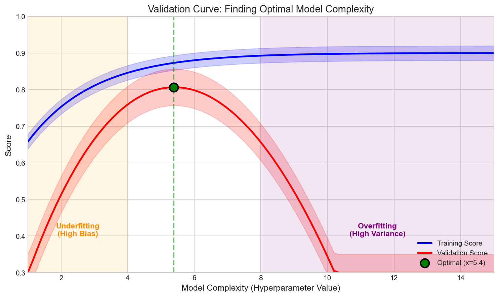
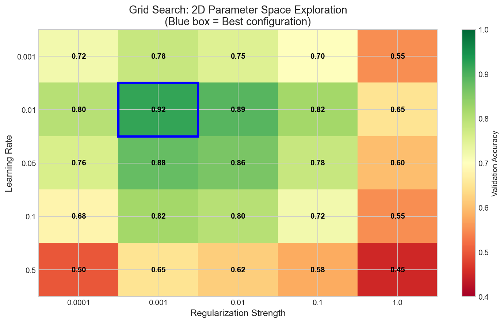
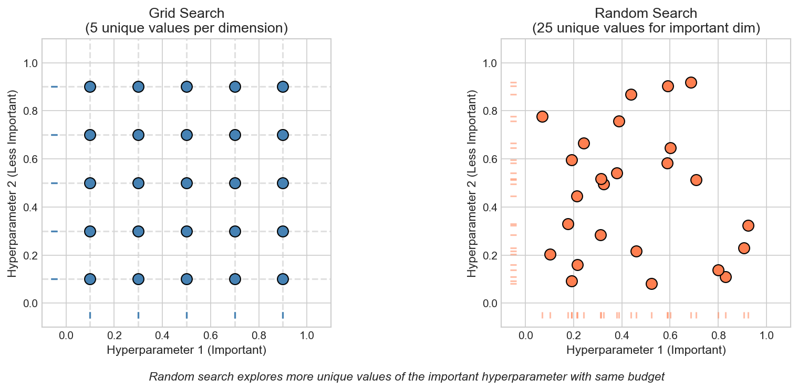
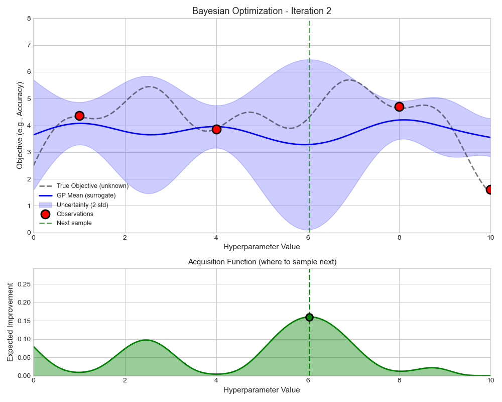
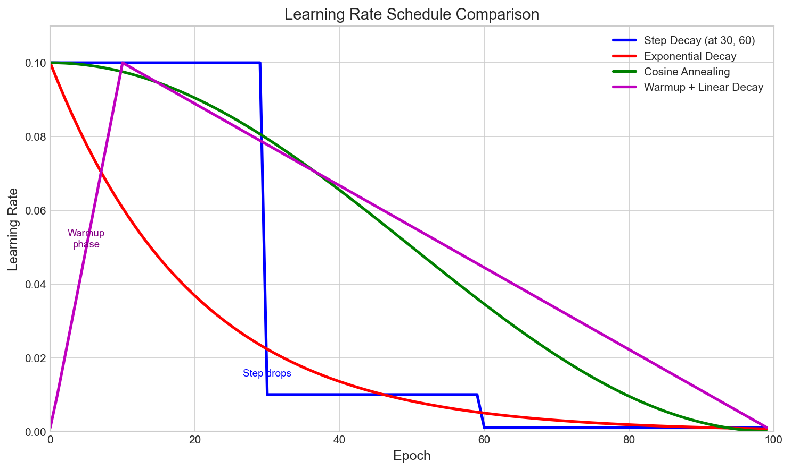
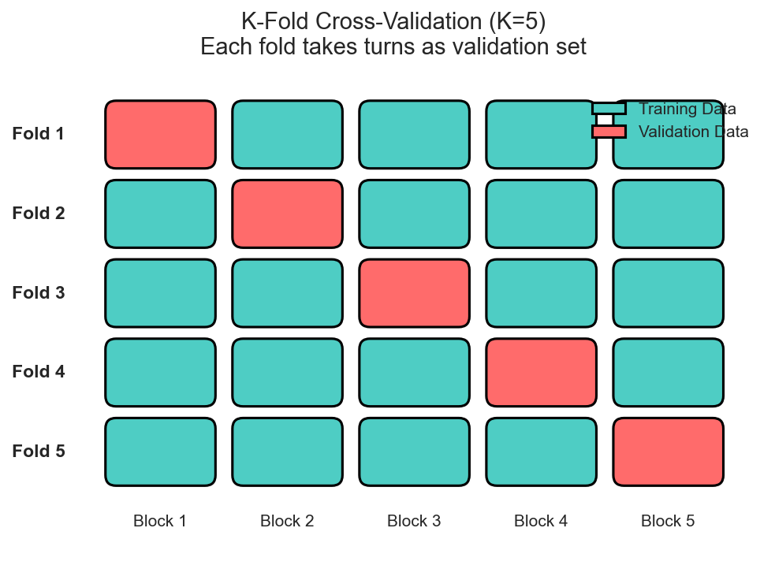

# Hyperparameter Tuning Interview FAQ

> **Find optimal model configurations**

## Overview

Hyperparameter tuning finds the optimal configuration of model settings that are not learned from data. Unlike model parameters, hyperparameters are set before training and directly influence model architecture and learning.



**Why Hyperparameter Tuning Matters:**
- Prevents underfitting (high bias) and overfitting (high variance)
- Finding the optimal point maximizes generalization
- Essential for production-ready ML systems

---

## Common Interview Questions

### Q1: What is the difference between parameters and hyperparameters?

**Answer:**

**Parameters:**
- Learned automatically from the training data
- Internal to the model; optimized during training via gradient descent
- Examples: neural network weights, linear regression coefficients

**Hyperparameters:**
- Set before training begins; external to the model
- Optimized through experimentation or automated search
- Examples: learning rate, number of hidden layers, regularization strength, batch size

| Aspect | Parameters | Hyperparameters |
|--------|------------|-----------------|
| When Set | During training | Before training |
| How Optimized | Gradient descent | Grid/random search, Bayesian optimization |
| Examples | Weights, biases | Learning rate, tree depth |

**Interview Tip:** Give concrete examples from models you have worked with. For a neural network, parameters are layer weights; hyperparameters include layer count, neurons per layer, and learning rate.

---

### Q2: What is Grid Search and what are its advantages and disadvantages?

**Answer:**

Grid Search evaluates all possible combinations of hyperparameter values from predefined discrete grids.



**Advantages:**
- Exhaustive coverage within the defined grid
- Simple to implement and parallelize
- Deterministic and reproducible

**Disadvantages:**
- Computational cost grows exponentially with dimensions
- Wastes resources on uninformative regions
- No learning between trials

**When to Use:** Small number of hyperparameters (2-3), discrete values, abundant compute.

---

### Q3: What is Random Search and why is it often better than Grid Search?

**Answer:**

Random Search samples hyperparameter values randomly from specified distributions (Bergstra and Bengio, 2012).



**Key Insight:** Not all hyperparameters are equally important. Random search explores more unique values of important hyperparameters, while grid search wastes evaluations on unimportant variations (see axis projections above).

| Aspect | Grid Search | Random Search |
|--------|-------------|---------------|
| Efficiency | Exponential in dimensions | Linear in dimensions |
| Continuous Parameters | Requires discretization | Natural handling |
| Important Dimensions | Wastes evaluations | Efficient exploration |

**When Random May Not Be Optimal:** All hyperparameters equally important, very small search space, strong hyperparameter interactions.

---

### Q4: How does Bayesian Optimization work for hyperparameter tuning?

**Answer:**

Bayesian Optimization uses probabilistic models to intelligently explore the hyperparameter space, balancing exploration with exploitation.



**Key Components:**

**1. Surrogate Model:** Approximates the objective function with uncertainty estimates.
- Gaussian Processes (GP), Tree-structured Parzen Estimators (TPE), Random Forests

**2. Acquisition Function:** Determines where to sample next (shown in green above).
- Expected Improvement (EI), Upper Confidence Bound (UCB), Probability of Improvement (PI)

**Algorithm:** Initialize randomly, then iterate: fit surrogate to observations, use acquisition function to select next point, evaluate, update model.

**Advantages:** Sample efficient, handles expensive evaluations, uncertainty-aware

**Disadvantages:** Overhead per iteration, difficult to parallelize, struggles with high dimensions (>10-20)

**Popular Libraries:** Optuna, Hyperopt, Scikit-Optimize, Ray Tune

---

### Q5: How can early stopping be used as a hyperparameter tuning strategy?

**Answer:**

Early stopping can efficiently allocate resources by terminating unpromising trials before full training.

**Successive Halving Algorithm:**
1. Start with many configurations, small budget each
2. Train all for fixed iterations
3. Keep only top half (or top 1/3)
4. Double budget for remaining configurations
5. Repeat until one remains

**Example:**
- Start: 64 configs, 1 epoch each
- Round 1: Keep top 32, train 2 epochs
- Round 2: Keep top 16, train 4 epochs
- ... continue halving until final selection

**Hyperband:** Extends successive halving by running multiple brackets with different exploration/exploitation tradeoffs.

**Benefits:**
- Massive speedup by eliminating poor configurations early
- Allocates more resources to promising configurations
- Can integrate with random search or Bayesian optimization

**When It May Fail:** Learning curves cross (initially poor configs become good later), stochastic training with high variance.

---

### Q6: What are the common learning rate scheduling strategies?

**Answer:**

Learning rate schedules dynamically adjust the learning rate during training.



| Schedule | Best For |
|----------|----------|
| Step Decay | CNNs (ResNet training) |
| Exponential Decay | General use |
| Cosine Annealing | Modern deep learning |
| Warmup + Decay | Transformers, large batch |
| Reduce on Plateau | Unknown training length |
| One-Cycle | Fast convergence |

**Learning Rate Finder:** Start with very small LR, gradually increase each batch, plot loss vs. LR, select rate where loss decreases most rapidly.

---

### Q7: How should cross-validation be used in hyperparameter tuning?

**Answer:**

Cross-validation provides robust performance estimates less susceptible to overfitting to a single validation set.



**Process:** For each hyperparameter configuration, train on K-1 folds, validate on the remaining fold, repeat K times. Select configuration with best average score, then retrain on all data.

**Why It Matters:**
- Reduces variance in performance estimates
- Less likely to overfit to single validation split
- Provides confidence intervals across folds

**Common Mistakes:**
- Data leakage: preprocessing must happen within each fold
- Using test set for tuning (leads to optimistic estimates)

**CV Strategies by Data Type:**

| Data Type | Recommended Strategy |
|-----------|---------------------|
| Classification | Stratified K-Fold |
| Time Series | Time Series Split |
| Grouped Data | Group K-Fold |

---

### Q8: What is nested cross-validation and when should you use it?

**Answer:**

Nested CV provides an unbiased estimate of model performance when hyperparameters are tuned.

**The Problem:** Using CV to both select hyperparameters and estimate performance leads to optimistically biased estimates (double dipping).

**How Nested CV Works:**

**Outer Loop:** Splits data into K_outer folds for final performance estimation
**Inner Loop:** For each outer training set, perform K_inner-fold CV to select hyperparameters

```
Outer Fold 1: [Train + Tune]  [Test]
               |-- Inner CV --|

Outer Fold 2: [Test]  [Train + Tune]
                      |-- Inner CV --|
```

**When to Use:**
- Unbiased performance estimation required
- Comparing different model families fairly
- Small datasets (cannot afford separate test set)
- Academic work requiring rigor

**When It May Be Overkill:**
- Large datasets with separate validation/test sets
- Computational constraints
- Early exploratory analysis

---

### Q9: What are the common hyperparameters for popular machine learning models?

**Answer:**

**Neural Networks:**

| Hyperparameter | Typical Range | Impact |
|---------------|---------------|--------|
| Learning rate | 1e-5 to 1e-1 | Most critical |
| Batch size | 16 to 512 | Gradient noise, memory |
| Number of layers | 1 to 100+ | Model capacity |
| Dropout rate | 0.1 to 0.5 | Regularization |
| Weight decay | 1e-6 to 1e-2 | L2 regularization |

**Random Forest:**

| Hyperparameter | Typical Range |
|---------------|---------------|
| n_estimators | 50 to 1000 |
| max_depth | 5 to unlimited |
| min_samples_split | 2 to 20 |
| max_features | sqrt, log2, 0.3-0.7 |

**Gradient Boosting (XGBoost/LightGBM):**

| Hyperparameter | Typical Range |
|---------------|---------------|
| learning_rate | 0.01 to 0.3 |
| n_estimators | 100 to 10000 |
| max_depth | 3 to 10 |
| subsample | 0.5 to 1.0 |

**Tuning Priority:** Start with most impactful (learning rate for NNs, n_estimators for trees), use good defaults, tune related hyperparameters together.

---

### Q10: What is AutoML and how does it relate to hyperparameter tuning?

**Answer:**

AutoML encompasses automated systems handling various ML pipeline aspects, with hyperparameter tuning as a core component.

**Components of AutoML:**
- Automated Feature Engineering
- Model Selection
- Hyperparameter Optimization
- Neural Architecture Search (NAS)
- Ensemble Construction

**Key Approaches:**

**CASH (Combined Algorithm and Hyperparameter Selection):** Jointly optimizes which algorithm and what hyperparameters.

**Meta-Learning:** Uses experience from previous datasets to initialize search in promising regions.

**Population-Based Training (PBT):** Trains models in parallel, periodically exploits best performers and mutates hyperparameters.

**Popular Systems:**

| System | Key Features |
|--------|--------------|
| Auto-sklearn | Meta-learning, ensemble, Bayesian optimization |
| AutoGluon | State-of-the-art tabular performance |
| H2O AutoML | Stacked ensembles |
| TPOT | Genetic programming |

**When to Use AutoML:** Establishing baselines, non-expert practitioners, exploring new domains, time-constrained projects.

---

## Comparison Tables

### Search Strategy Comparison

| Aspect | Grid Search | Random Search | Bayesian Opt | Hyperband |
|--------|-------------|---------------|--------------|-----------|
| Exploration | Exhaustive | Random | Intelligent | Multi-fidelity |
| Parallelization | Easy | Easy | Difficult | Moderate |
| Sample Efficiency | Low | Moderate | High | High |
| Best For | Small spaces | General use | Expensive evals | Deep learning |

### Cross-Validation Methods

| Method | Use Case | Pros | Cons |
|--------|----------|------|------|
| Hold-out | Large data | Fast | High variance |
| K-Fold | Standard | Balanced | K times training |
| Nested CV | Unbiased eval | Rigorous | Very expensive |
| Time Series Split | Temporal data | Respects time | Limited folds |

---

## Key Formulas

### Grid Search Complexity
```
Total Evaluations = |grid_1| x |grid_2| x ... x |grid_n|
With K-fold CV: K x Total Evaluations
```

### Expected Improvement (Bayesian Optimization)
```
EI(x) = E[max(0, f(x) - f(x_best))]
```

### Successive Halving
```
Round k: n/eta^k configurations, B*eta^k/n budget each
```

---

## Quick Reference for Interviews

**Five Most Important Points:**

1. **Hyperparameters vs. Parameters:** Hyperparameters set before training; parameters learned during training

2. **Random Search > Grid Search:** Often more efficient because it explores more unique values of important hyperparameters

3. **Bayesian Optimization:** Uses surrogate model to predict promising configurations, balancing exploration and exploitation

4. **Cross-Validation for Tuning:** K-fold CV for reliable estimates; nested CV for unbiased performance evaluation

5. **Early Stopping as Tuning:** Hyperband efficiently allocates resources to promising configurations

**Common Follow-up Questions:**
- How would you handle tuning with limited computational resources?
- What is the exploration-exploitation tradeoff in Bayesian optimization?
- When would you use nested CV vs. simple train/validation split?
- How do you prevent overfitting to validation set during extensive tuning?

---

## Interview Tips

1. **Know the tradeoffs:** Every strategy has pros/cons; discuss when each is appropriate
2. **Emphasize efficiency:** Show awareness of computational costs
3. **Discuss practical experience:** Share specific tuning decisions from projects
4. **Connect to generalization:** Explain how tuning relates to overfitting
5. **Mention modern tools:** Familiarity with Optuna, Ray Tune shows practical experience

---

## Additional Resources

- Bergstra & Bengio (2012): "Random Search for Hyper-Parameter Optimization"
- Li et al. (2018): "Hyperband: A Novel Bandit-Based Approach"
- Libraries: Optuna, Ray Tune, Hyperopt

---

*Last Updated: January 2026*
