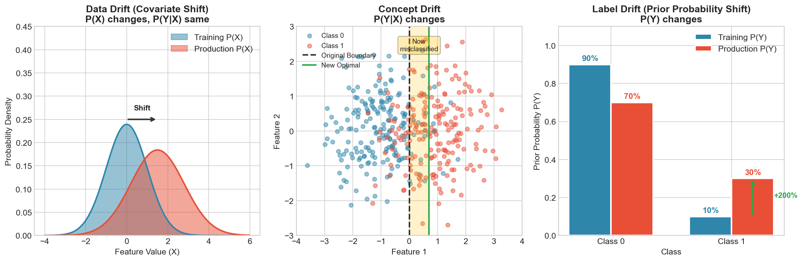
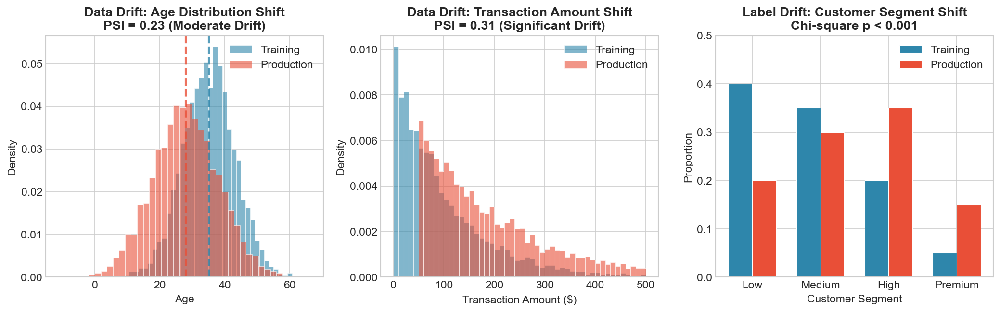
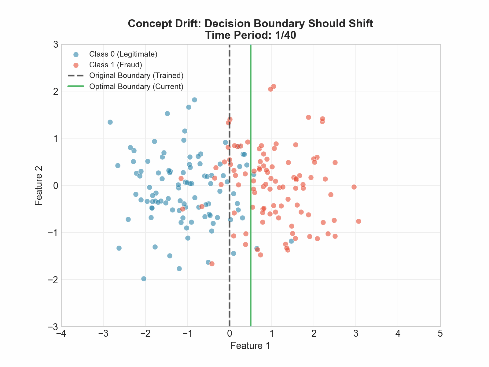
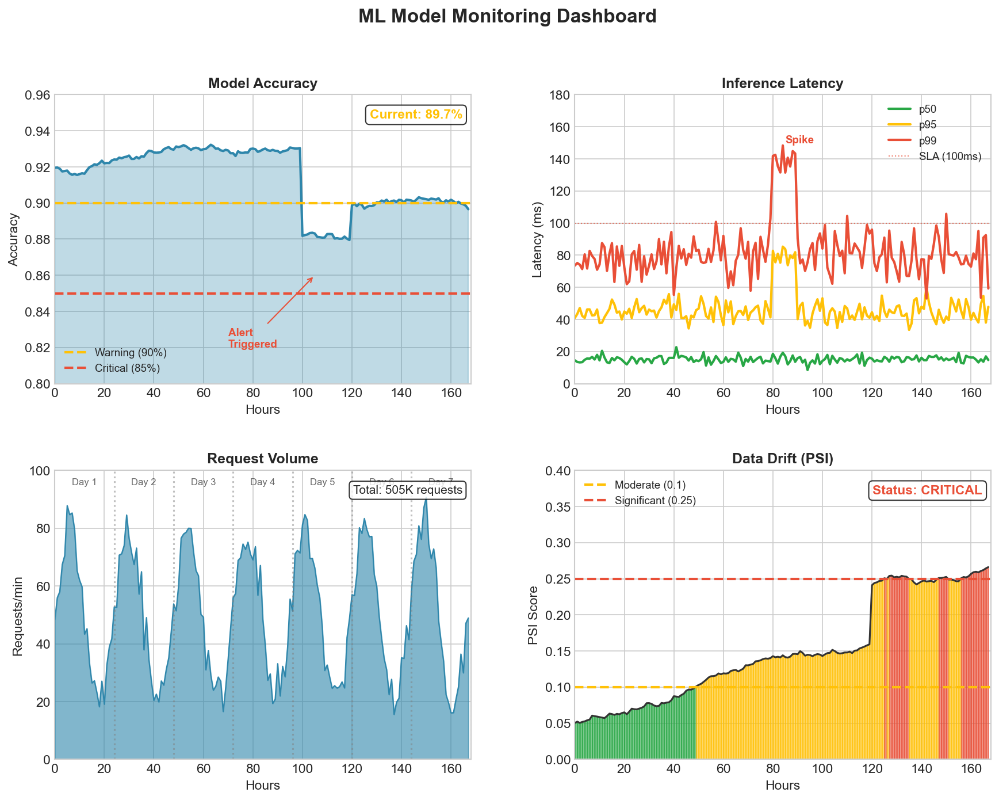
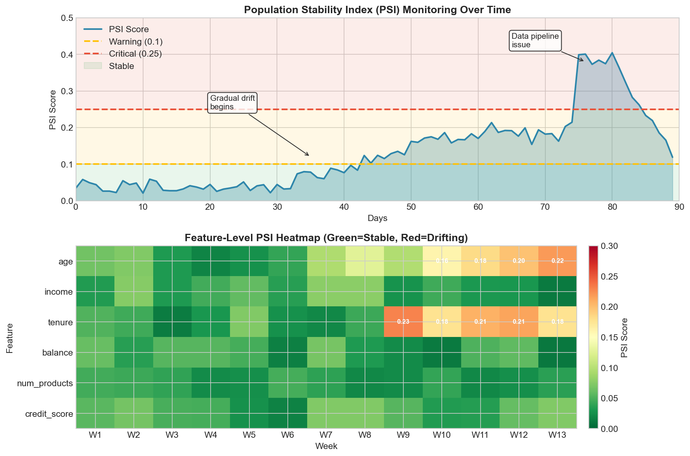
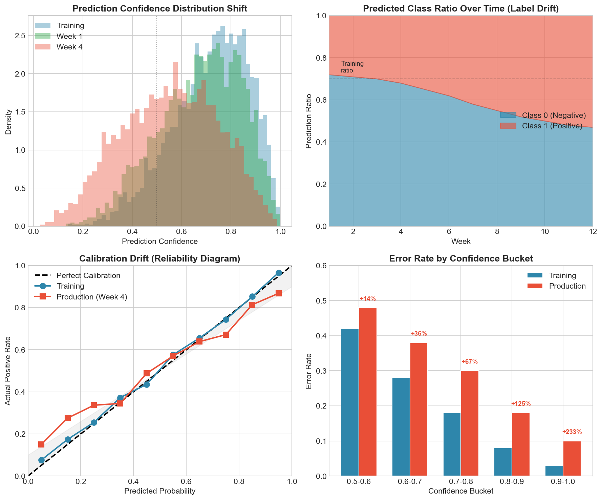

# Model Drift and Monitoring Interview FAQ

> **Keep models performing well in production**

Production ML systems require constant vigilance. Models that perform brilliantly at deployment can silently degrade over time. This FAQ covers the essential concepts for detecting, diagnosing, and addressing model drift in production environments.

---

## Fundamental Concepts

### Q: What is model drift?

**A:** Model drift refers to the degradation of a machine learning model's performance over time in production. It occurs when the statistical properties of the data the model encounters differ from the data it was trained on.

**Key characteristics:**
- **Gradual or sudden**: Drift can happen slowly over months or abruptly due to external events
- **Often invisible**: Without proper monitoring, drift goes undetected until business metrics suffer
- **Inevitable**: In dynamic environments, some degree of drift is expected

**Why it matters in interviews:** Understanding drift shows you think beyond model training to the full ML lifecycle.

---

### Q: What are the main types of drift?

**A:** There are three primary types of drift, each with distinct causes and detection methods:



| Type | What Changes | Detection Method | Example |
|------|-------------|------------------|---------|
| **Data Drift** | P(X) | Feature distribution monitoring | User demographics shift |
| **Concept Drift** | P(Y\|X) | Performance metric degradation | Spam patterns evolve |
| **Label Drift** | P(Y) | Target distribution monitoring | Seasonal demand changes |

**Key insight:** Data drift affects *what* the model sees; concept drift affects *how* it should respond; label drift affects *how often* each outcome occurs.

---

### Q: What causes model drift?

**A:** Multiple factors contribute to drift in production systems:

| Category | Examples |
|----------|----------|
| **External** | Seasonality, market changes, user behavior evolution, regulatory changes, global events |
| **Internal** | Data pipeline issues, feature engineering changes, third-party data source modifications |
| **Adversarial** | Users gaming the system, fraud pattern evolution, bot behavior changes |

---

## Drift Detection Methods

### Q: How do you detect data drift using statistical tests?

**A:** Several statistical tests can quantify distribution differences between training and production data:



| Test | Best For | Interpretation |
|------|----------|----------------|
| **KS Test** | Continuous features | p-value < 0.05 indicates drift |
| **PSI** | Industry standard | < 0.1 stable, 0.1-0.25 moderate, > 0.25 significant |
| **Chi-Square** | Categorical features | p-value < 0.05 indicates drift |
| **JS Divergence** | Symmetric comparison | 0 = identical, 1 = completely different |

```python
def calculate_psi(reference, production, bins=10):
    """
    Calculate Population Stability Index.
    PSI < 0.1: No significant shift
    PSI 0.1-0.25: Moderate shift, investigate
    PSI > 0.25: Significant shift, action required
    """
    breakpoints = np.percentile(reference, np.linspace(0, 100, bins + 1))
    breakpoints[0], breakpoints[-1] = -np.inf, np.inf

    ref_props = np.histogram(reference, breakpoints)[0] / len(reference)
    prod_props = np.histogram(production, breakpoints)[0] / len(production)

    ref_props = np.clip(ref_props, 0.0001, None)
    prod_props = np.clip(prod_props, 0.0001, None)

    return np.sum((prod_props - ref_props) * np.log(prod_props / ref_props))
```

---

### Q: How do you detect concept drift?

**A:** Concept drift requires monitoring model performance, not just input distributions. The decision boundary that was optimal at training time may no longer be optimal:



**Detection approaches:**

| Approach | Description | Use Case |
|----------|-------------|----------|
| **Performance-Based** | Track accuracy/F1 degradation over time | Labeled feedback available |
| **Sliding Window** | Compare metrics across time windows | Detect sudden changes |
| **ADWIN** | Adaptive window sizing | Streaming data |

```python
def sliding_window_drift_detection(predictions, actuals, window_size=1000):
    """Compare model accuracy across sliding windows."""
    accuracies = []
    for i in range(len(predictions) - window_size):
        accuracy = (predictions[i:i+window_size] == actuals[i:i+window_size]).mean()
        accuracies.append(accuracy)

    baseline_acc = np.mean(accuracies[:100])
    current_acc = np.mean(accuracies[-10:])

    return {
        'baseline_accuracy': baseline_acc,
        'current_accuracy': current_acc,
        'drift_detected': (baseline_acc - current_acc) > 0.05
    }
```

---

## Production Monitoring Strategies

### Q: What metrics should you monitor in production ML systems?

**A:** A comprehensive monitoring strategy covers multiple layers. Here is a typical monitoring dashboard:



**Key metric categories:**

| Category | Metrics | Alert Thresholds |
|----------|---------|------------------|
| **Performance** | Accuracy, Precision, Recall, F1, AUC | > 10% degradation from baseline |
| **Data Quality** | Null rates, schema violations, outliers | Any unexpected values |
| **Operational** | Latency (p50/p95/p99), throughput, errors | SLA violations |
| **Drift** | PSI, KS statistic, JS divergence | PSI > 0.1 warning, > 0.25 critical |

---

### Q: How do you implement alerting for model drift?

**A:** Effective alerting requires tiered thresholds and actionable notifications:



| Severity | Threshold | Action | Example |
|----------|-----------|--------|---------|
| **Info** | < 5% degradation | Log only | Minor fluctuations |
| **Warning** | 5-15% degradation | Slack notification | Investigate data changes |
| **Critical** | > 15% degradation | PagerDuty alert | Consider rollback/retrain |

**Best practices:**
- Set per-metric thresholds based on business impact
- Include recommended actions in alerts
- Track alert patterns to tune thresholds and reduce fatigue

---

## Model Retraining Strategies

### Q: When should you retrain a model?

**A:** Retraining decisions should be based on multiple signals:

| Trigger Type | Signal | Example Threshold |
|--------------|--------|-------------------|
| **Performance** | Accuracy/F1 degradation | < 90% of baseline |
| **Drift** | PSI score | > 0.25 |
| **Time** | Model age | > 30 days |

**Retraining strategies:**

| Strategy | Description | Use Case |
|----------|-------------|----------|
| **Scheduled** | Retrain on fixed schedule (daily, weekly) | Stable domains with predictable drift |
| **Triggered** | Retrain when metrics cross thresholds | Variable drift patterns |
| **Continuous** | Online learning with streaming data | High-velocity environments |
| **Incremental** | Fine-tune on new data only | Limited compute resources |

---

## Deployment Strategies

### Q: What is A/B testing for model deployment?

**A:** A/B testing compares model versions by splitting production traffic:

```python
class ABTestManager:
    """
    Manage A/B tests for model deployment.
    """

    def __init__(self, experiment_config):
        self.control_model = experiment_config['control']
        self.treatment_model = experiment_config['treatment']
        self.traffic_split = experiment_config['traffic_split']  # e.g., 0.5
        self.metrics_to_track = experiment_config['metrics']

    def route_request(self, user_id, request):
        """
        Route request to appropriate model variant.
        Uses consistent hashing for user stickiness.
        """
        # Deterministic assignment based on user_id
        hash_value = hash(user_id) % 100

        if hash_value < self.traffic_split * 100:
            variant = 'treatment'
            prediction = self.treatment_model.predict(request)
        else:
            variant = 'control'
            prediction = self.control_model.predict(request)

        # Log for analysis
        self.log_experiment_event(user_id, variant, prediction)

        return prediction

    def analyze_results(self):
        """
        Statistical analysis of A/B test results.
        """
        control_metrics = self.get_variant_metrics('control')
        treatment_metrics = self.get_variant_metrics('treatment')

        results = {}
        for metric in self.metrics_to_track:
            # Two-sample t-test
            t_stat, p_value = stats.ttest_ind(
                control_metrics[metric],
                treatment_metrics[metric]
            )

            lift = (
                (np.mean(treatment_metrics[metric]) - np.mean(control_metrics[metric]))
                / np.mean(control_metrics[metric])
            ) * 100

            results[metric] = {
                'control_mean': np.mean(control_metrics[metric]),
                'treatment_mean': np.mean(treatment_metrics[metric]),
                'lift_pct': lift,
                'p_value': p_value,
                'significant': p_value < 0.05
            }

        return results
```

**Key considerations:**
- Sample size calculation for statistical power
- User-level randomization for consistency
- Guardrail metrics to catch regressions
- Duration based on traffic volume

---

### Q: What is shadow deployment?

**A:** Shadow deployment runs a new model in parallel without affecting users:

```python
class ShadowDeployment:
    """
    Shadow mode deployment for safe model testing.
    """

    def __init__(self, production_model, shadow_model):
        self.production = production_model
        self.shadow = shadow_model
        self.comparison_log = []

    async def predict(self, request):
        """
        Run both models, return production result,
        log shadow result for analysis.
        """
        # Production prediction (returned to user)
        prod_start = time.time()
        prod_result = await self.production.predict(request)
        prod_latency = time.time() - prod_start

        # Shadow prediction (not returned, just logged)
        shadow_start = time.time()
        shadow_result = await self.shadow.predict(request)
        shadow_latency = time.time() - shadow_start

        # Log comparison
        self.comparison_log.append({
            'timestamp': datetime.now(),
            'request_id': request.id,
            'production_result': prod_result,
            'shadow_result': shadow_result,
            'results_match': prod_result == shadow_result,
            'production_latency': prod_latency,
            'shadow_latency': shadow_latency
        })

        return prod_result  # Only production result goes to user

    def analyze_shadow_performance(self):
        """
        Compare shadow model against production.
        """
        df = pd.DataFrame(self.comparison_log)

        return {
            'agreement_rate': df['results_match'].mean(),
            'shadow_avg_latency': df['shadow_latency'].mean(),
            'production_avg_latency': df['production_latency'].mean(),
            'latency_overhead': (
                df['shadow_latency'].mean() / df['production_latency'].mean()
            )
        }
```

**Benefits:**
- Zero risk to users
- Real production traffic testing
- Performance comparison under actual load
- Catch issues before any user impact

---

### Q: What is canary deployment?

**A:** Canary deployment gradually rolls out a new model to increasing traffic:

```python
class CanaryDeployment:
    """
    Gradual rollout with automatic rollback.
    """

    def __init__(self, config):
        self.stages = config['stages']  # e.g., [1, 5, 25, 50, 100]
        self.current_stage = 0
        self.success_criteria = config['success_criteria']
        self.rollback_criteria = config['rollback_criteria']

    def execute_rollout(self):
        """
        Execute staged rollout with monitoring.
        """
        for stage_pct in self.stages:
            print(f"Rolling out to {stage_pct}% of traffic...")

            self.set_traffic_percentage(stage_pct)

            # Wait for metrics to stabilize
            time.sleep(self.observation_period)

            # Check health
            metrics = self.collect_stage_metrics()

            if self.should_rollback(metrics):
                print(f"Rollback triggered at {stage_pct}%")
                self.rollback()
                return {'success': False, 'stage': stage_pct}

            if not self.meets_success_criteria(metrics):
                print(f"Pausing at {stage_pct}%, criteria not met")
                continue

            print(f"Stage {stage_pct}% successful")

        return {'success': True, 'stage': 100}

    def should_rollback(self, metrics):
        """
        Check if rollback is needed.
        """
        for metric, threshold in self.rollback_criteria.items():
            if metrics[metric] > threshold:
                return True
        return False

    def rollback(self):
        """
        Immediately revert to previous model.
        """
        self.set_traffic_percentage(0)
        self.restore_previous_model()
        self.alert_team("Canary rollback executed")
```

**Typical canary stages:**
1. 1% - Initial test with minimal impact
2. 5% - Early validation
3. 25% - Broader testing
4. 50% - Half traffic
5. 100% - Full rollout

---

## Logging and Observability

### Q: What should you log for ML observability?

**A:** Comprehensive logging enables debugging and auditing. Track prediction distributions over time to detect drift:



**Key logging fields:**

| Category | Fields |
|----------|--------|
| **Request** | timestamp, request_id, model_version |
| **Features** | feature_values (sanitized), feature_hash |
| **Output** | prediction, confidence, probabilities |
| **Performance** | inference_latency_ms, preprocessing_latency_ms |
| **Context** | user_segment, experiment_variant |

**Key logging principles:**
- Structured JSON format for queryability
- Request IDs for tracing
- Feature hashing for privacy
- Separate prediction and outcome logs
- Include model version for debugging

---

### Q: How do you build an ML observability dashboard?

**A:** Essential dashboard components (see monitoring dashboard above):

```python
dashboard_config = {
    'performance_panel': {  # Accuracy, precision, recall over time
        'metrics': ['accuracy', 'precision', 'recall', 'f1', 'auc'],
        'visualization': 'time_series'
    },
    'data_quality_panel': {  # Null rates, schema violations by feature
        'metrics': ['null_rate', 'schema_violations', 'outlier_rate'],
        'visualization': 'heatmap'
    },
    'drift_panel': {  # PSI, KS with threshold lines
        'metrics': ['psi_score', 'ks_statistic', 'js_divergence'],
        'alert_lines': [0.1, 0.25]
    },
    'operational_panel': {
        'metrics': ['latency_p50', 'latency_p99', 'error_rate', 'throughput'],
        'visualization': 'multi_line',
        'sla_lines': True
    },

    'prediction_distribution_panel': {
        'visualization': 'histogram',
        'comparison': 'training_distribution',
        'update_frequency': 'real_time'
    }
}
```

---

## Feature Stores and Data Quality

### Q: How do feature stores help with monitoring?

**A:** Feature stores centralize feature management and enable consistent monitoring:

| Capability | Monitoring Benefit |
|------------|-------------------|
| **Feature Registry** | Track expected types, ranges, allowed values |
| **Version Control** | Detect when upstream features change |
| **Statistics Store** | Baseline distributions for drift detection |
| **Validation** | Automatic checks on retrieval |

---

### Q: How do you ensure data quality in ML pipelines?

**A:** Implement validation at multiple pipeline stages:

| Check Type | What It Validates | Example |
|------------|-------------------|---------|
| **Schema** | Expected columns and types | Missing feature, wrong dtype |
| **Completeness** | Null rates within bounds | > 5% nulls in required field |
| **Validity** | Values within valid ranges | Age < 0 or > 150 |
| **Consistency** | Cross-field relationships | End date before start date |
| **Freshness** | Data recency | Stale data older than 24 hours |

---

## Interview Tips

### Q: How would you design a monitoring system from scratch?

**A:** Structure your answer around these six layers:

| Layer | Components | Tools |
|-------|------------|-------|
| **1. Data Collection** | Prediction logging, ground truth collection, feature statistics | Custom logging |
| **2. Storage** | Time-series metrics, feature distributions, logs | InfluxDB, Prometheus, ELK |
| **3. Analysis** | Drift detection, performance computation, anomaly detection | Custom + ML libraries |
| **4. Alerting** | Threshold, trend, and anomaly-based alerts | PagerDuty, Slack |
| **5. Action** | Retraining triggers, rollback, escalation | Airflow, custom pipelines |
| **6. Visualization** | Real-time dashboards, historical analysis | Grafana, custom UI |

---

### Q: What are common pitfalls in production ML monitoring?

**A:** Be prepared to discuss these challenges:

| Pitfall | Description | Mitigation |
|---------|-------------|------------|
| **Delayed ground truth** | Labels may take days/weeks to arrive | Use proxy metrics, confidence monitoring |
| **Alert fatigue** | Too many false positives | Tune thresholds, aggregate alerts |
| **Metric gaming** | Optimizing monitored metrics only | Multiple complementary metrics |
| **Cold start** | New models lack baseline | Use holdout set performance |
| **Seasonal patterns** | Normal variation mistaken for drift | Seasonal baselines |
| **Multivariate drift** | Joint distribution shift | Monitor feature correlations |
| **Feedback loops** | Predictions influence future data | Log prediction/outcome separately |

```python
class DelayedFeedbackMonitor:
    """Track predictions awaiting ground truth."""

    def log_prediction(self, request_id, prediction, timestamp):
        self.pending[request_id] = {'prediction': prediction, 'timestamp': timestamp}

    def receive_feedback(self, request_id, ground_truth):
        if request_id in self.pending:
            pred_info = self.pending.pop(request_id)
            self.metrics_store.add(pred_info['prediction'], ground_truth)

    def check_missing_feedback(self):
        """Alert on predictions missing expected feedback."""
        overdue = [rid for rid, info in self.pending.items()
                   if (datetime.now() - info['timestamp']).hours > self.expected_delay]
        if len(overdue) > self.threshold:
            self.alert(f"{len(overdue)} predictions missing feedback")
```

---

## Key Takeaways

1. **Drift is inevitable** - Plan for it from day one
2. **Monitor multiple signals** - Performance, data quality, and operations
3. **Automate responses** - Manual monitoring doesn't scale
4. **Balance sensitivity** - Too many alerts cause fatigue
5. **Design for debugging** - Good logging pays dividends
6. **Test deployment strategies** - Shadow, canary, and A/B reduce risk
7. **Feature stores help** - Centralized management improves consistency
8. **Close the feedback loop** - Connect predictions to outcomes

Production ML is as much about operations as it is about algorithms. Demonstrating awareness of these challenges shows interview readiness for real-world ML roles.
