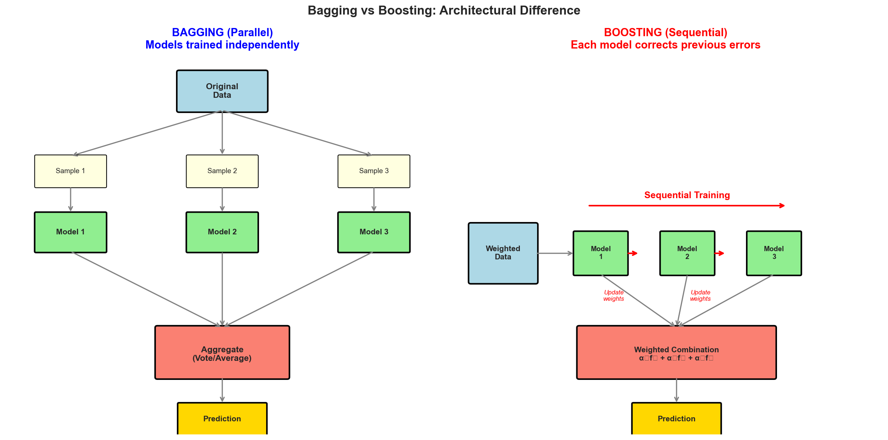
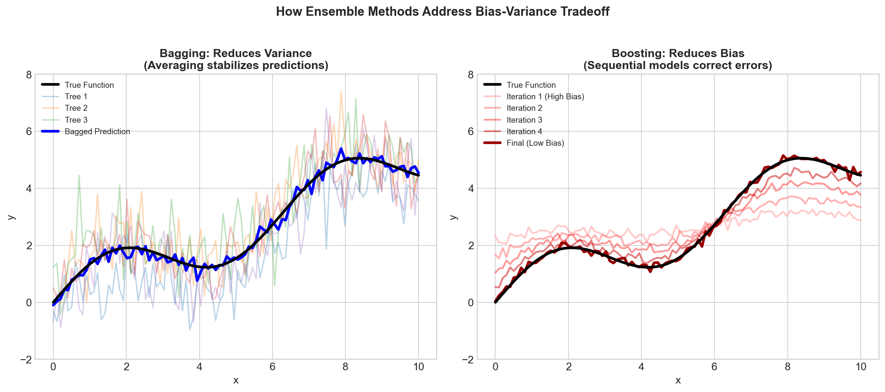
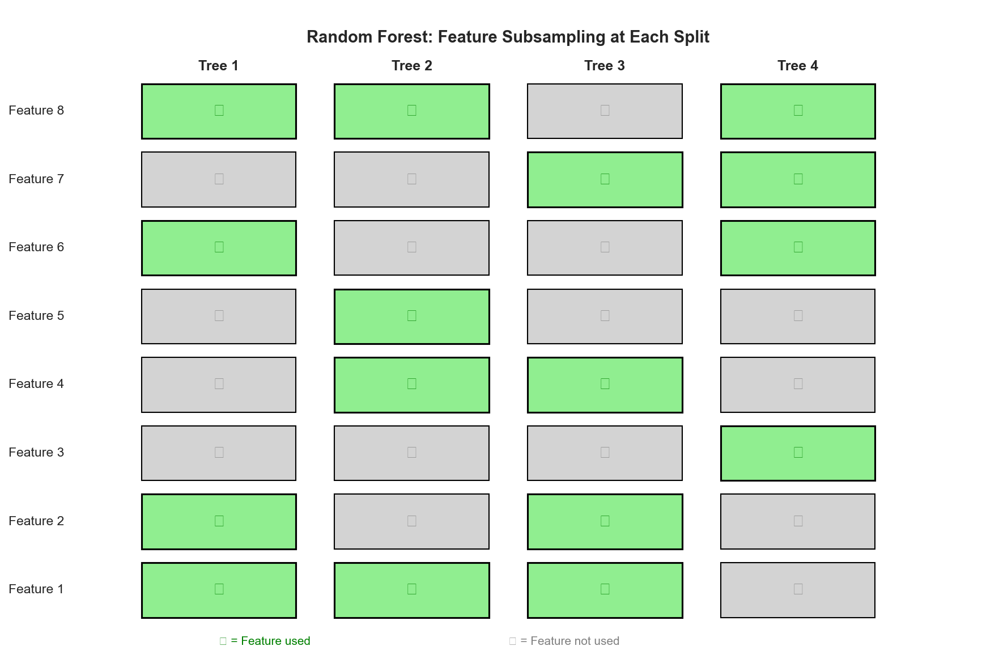
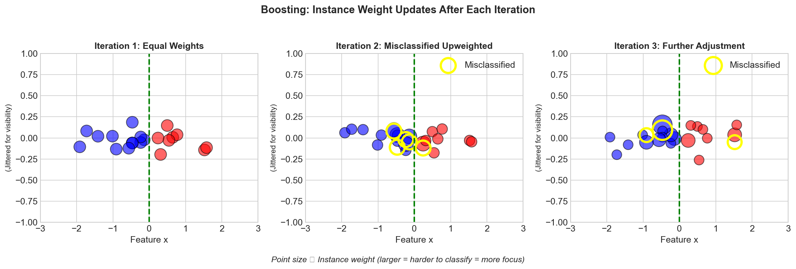
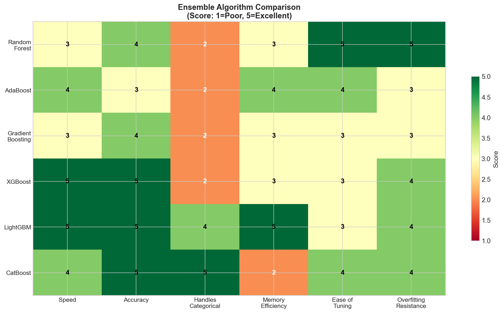

# Ensemble Methods (Bagging vs Boosting) - Interview FAQ

## Overview

Ensemble methods are machine learning techniques that combine multiple models to produce a single, more robust prediction. The fundamental principle is that a group of "weak learners" can come together to form a "strong learner." This approach leverages the wisdom of crowds concept - by aggregating diverse opinions, we can often arrive at a more accurate and stable prediction than any individual model could provide.

The two primary ensemble strategies are **bagging** (Bootstrap Aggregating) and **boosting**, which differ fundamentally in how they construct and combine their constituent models. Understanding these differences is crucial for ML interviews, as they reveal deep insights into bias-variance tradeoffs, model stability, and practical algorithm selection.

---

## Common Interview Questions

### Q1: What is the difference between bagging and boosting?

**Sample Answer:**

Bagging and boosting are both ensemble techniques that combine multiple models, but they differ fundamentally in their approach:

**Bagging (Bootstrap Aggregating):**
- Trains models **in parallel** on different bootstrap samples of the data
- Each model is independent and has no knowledge of other models
- Combines predictions through **averaging** (regression) or **voting** (classification)
- Primary goal: **Reduce variance** while maintaining bias
- Works best with high-variance, low-bias base learners (like deep decision trees)
- Example: Random Forest

**Boosting:**
- Trains models **sequentially**, where each model learns from the errors of previous models
- Each subsequent model focuses on the samples that were misclassified or had high residuals
- Combines predictions through **weighted voting** based on model accuracy
- Primary goal: **Reduce bias** while controlling variance
- Works best with high-bias, low-variance base learners (like shallow decision trees/stumps)
- Examples: AdaBoost, Gradient Boosting, XGBoost

**Key Insight for Interviews:** Bagging reduces variance by averaging predictions from diverse models trained on different data subsets, while boosting reduces bias by iteratively correcting errors, effectively creating a more complex model that can capture patterns individual weak learners miss.

---

### Q2: How does Random Forest work?

**Sample Answer:**

Random Forest is a bagging ensemble that combines multiple decision trees with an additional layer of randomness through feature sampling. Here is how it works:

**Training Process:**
1. **Bootstrap Sampling:** For each of the N trees, create a bootstrap sample (random sample with replacement) from the training data, typically containing about 63% unique samples
2. **Feature Randomization:** At each node split, randomly select a subset of m features (typically sqrt(p) for classification, p/3 for regression, where p is total features)
3. **Tree Growing:** Grow each tree to maximum depth (or until minimum samples per leaf) without pruning
4. **No Interaction:** Trees are built independently and in parallel

**Prediction Process:**
- **Classification:** Each tree votes for a class; the majority vote wins
- **Regression:** Average the predictions from all trees

**Why Feature Randomization Matters:**
- Decorrelates the trees, increasing ensemble diversity
- Prevents dominant features from appearing in every tree
- Reduces the correlation between tree predictions, which improves variance reduction

**Hyperparameters to Know:**
- n_estimators: Number of trees (more is generally better until diminishing returns)
- max_features: Number of features to consider at each split
- max_depth: Maximum depth of trees
- min_samples_split/leaf: Controls tree complexity

---

### Q3: How does AdaBoost work?

**Sample Answer:**

AdaBoost (Adaptive Boosting) is a boosting algorithm that iteratively trains weak learners, giving more weight to misclassified samples in each subsequent iteration.

**Algorithm Steps:**

1. **Initialize Weights:** Assign equal weights to all training samples (w_i = 1/N)

2. **For each iteration t = 1 to T:**
   - Train a weak learner (typically a decision stump) on the weighted data
   - Calculate the weighted error rate: sum of weights of misclassified samples divided by total weight
   - Calculate learner weight (alpha): based on error rate, better learners get higher weights
   - Update sample weights: increase weights for misclassified samples, decrease for correctly classified
   - Normalize weights to sum to 1

3. **Final Prediction:** Weighted vote of all weak learners, where each learner's vote is weighted by its alpha value

**Key Properties:**
- Focuses increasingly on "hard" examples that previous learners struggled with
- Weak learners must perform better than random (error rate less than 0.5)
- Can overfit if too many iterations or if data is noisy
- Very sensitive to outliers (they keep getting higher weights)

**Interview Tip:** AdaBoost can be viewed as an algorithm that greedily minimizes exponential loss. This connection to optimization theory is important for understanding its behavior and limitations.

---

### Q4: How does Gradient Boosting work?

**Sample Answer:**

Gradient Boosting builds an additive model by sequentially fitting new models to the negative gradient (pseudo-residuals) of the loss function.

**Core Concept:**
Instead of reweighting samples like AdaBoost, Gradient Boosting directly fits new models to the residual errors of the current ensemble, effectively performing gradient descent in function space.

**Algorithm Steps:**

1. **Initialize:** Start with a simple model (often the mean for regression, log-odds for classification)

2. **For each iteration m = 1 to M:**
   - Compute pseudo-residuals: the negative gradient of the loss function with respect to predictions
   - Fit a new weak learner (decision tree) to these pseudo-residuals
   - Find the optimal step size (learning rate) through line search
   - Update the model by adding the new learner scaled by the learning rate

3. **Final Model:** Sum of all weak learners, each scaled by the learning rate

**Why Pseudo-Residuals:**
- For squared error loss, pseudo-residuals equal actual residuals (y - prediction)
- For other losses (log loss, huber loss), pseudo-residuals point in the direction of steepest improvement
- This flexibility allows Gradient Boosting to optimize various loss functions

**Key Hyperparameters:**
- **Learning rate (shrinkage):** Smaller values require more trees but often achieve better performance
- **n_estimators:** Number of boosting rounds
- **max_depth:** Usually kept small (3-8) since we want weak learners
- **subsample:** Row sampling per iteration (introduces randomness like bagging)

---

### Q5: What are the differences between XGBoost, LightGBM, and CatBoost?

**Sample Answer:**

These are all modern gradient boosting implementations with different optimizations:

**XGBoost (eXtreme Gradient Boosting):**
- Uses regularized learning objective (L1/L2 on leaf weights)
- Implements **approximate split finding** using histograms
- **Level-wise** tree growth (grows all nodes at same depth before moving deeper)
- Handles missing values natively by learning optimal split direction
- Supports parallel processing at the feature level
- Sparsity-aware algorithm for sparse data

**LightGBM (Light Gradient Boosting Machine):**
- Uses **Gradient-based One-Side Sampling (GOSS):** keeps samples with large gradients, randomly samples from small gradients
- **Exclusive Feature Bundling (EFB):** bundles mutually exclusive features to reduce dimensions
- **Leaf-wise** tree growth (grows leaf with max delta loss) - often faster but can overfit
- Generally faster training than XGBoost on large datasets
- Lower memory usage due to histogram-based algorithm
- Native support for categorical features

**CatBoost (Categorical Boosting):**
- **Ordered boosting:** prevents target leakage by using permutation-driven approach
- **Native categorical feature handling:** uses target statistics with special encoding
- Often requires less hyperparameter tuning
- Robust to overfitting by design
- Generally best out-of-the-box performance on datasets with many categorical features
- Slower training than LightGBM but often better default performance

**Quick Comparison for Interviews:**
- Speed: LightGBM > XGBoost > CatBoost (generally)
- Categorical features: CatBoost > LightGBM > XGBoost
- Ease of tuning: CatBoost > XGBoost > LightGBM
- Community/Documentation: XGBoost > LightGBM > CatBoost

---

### Q6: Random Forest vs XGBoost - When should you use each?

**Sample Answer:**

**Choose Random Forest when:**
- You need a quick baseline that works well out-of-the-box
- Interpretability through feature importance is critical
- Training time is a constraint and you cannot tune extensively
- Data has many noisy features (RF handles noise better)
- You want minimal hyperparameter tuning
- Parallelization during training is important
- Risk of overfitting is a major concern

**Choose XGBoost when:**
- Maximum predictive performance is the priority
- You have time and resources for hyperparameter tuning
- Data is structured/tabular with clear signal
- You need to handle missing values elegantly
- Competition or production setting where every bit of accuracy matters
- You have enough data to prevent overfitting with regularization
- Custom loss functions are needed

**Practical Guidelines:**
- Start with Random Forest for baseline, then try XGBoost if you need better performance
- On small datasets (less than 1000 samples), Random Forest often generalizes better
- On large datasets with tuning budget, XGBoost typically wins
- For real-time inference where latency matters, Random Forest's parallel prediction can be faster
- If model needs to be retrained frequently, Random Forest's simpler tuning is advantageous

**Interview Insight:** In practice, the performance gap between well-tuned Random Forest and XGBoost is often smaller than expected. The choice often comes down to project constraints like time, interpretability requirements, and deployment considerations.

---

### Q7: How does bagging reduce variance?

**Sample Answer:**

Bagging reduces variance through the statistical principle of averaging independent estimates.

**Mathematical Intuition:**
If you have N independent random variables, each with variance sigma squared, their average has variance sigma squared divided by N. This is why averaging predictions from multiple models reduces variance.

**However, trees are not truly independent.** They are all trained on samples from the same underlying distribution. If two models have correlation rho, the variance reduction is limited by this correlation.

**Bagging's Strategy:**
1. **Bootstrap Sampling:** Creates different training sets, introducing diversity
2. **Different Trees:** Each tree sees different data, making different splits
3. **Averaging:** Combines predictions, smoothing out individual tree variance

**Why It Works:**
- Individual decision trees are **high-variance** models (small changes in data lead to very different trees)
- By training on different bootstrap samples, trees make different errors on different samples
- When averaged, these errors tend to cancel out
- The ensemble variance is lower than individual tree variance

**Key Limitation:**
- Bagging does NOT reduce bias - if all base learners consistently underfit or miss patterns, the average will too
- This is why bagging works best with low-bias, high-variance base learners (fully grown trees)

**Random Forest Enhancement:**
Feature randomization further decorrelates trees, reducing the correlation term and enabling even greater variance reduction.

---

### Q8: How does boosting reduce bias?

**Sample Answer:**

Boosting reduces bias by sequentially building a complex model from simple base learners, where each learner corrects errors made by the previous ensemble.

**Why Weak Learners Have High Bias:**
Simple models like decision stumps or shallow trees have high bias - they are too simple to capture complex patterns and systematically underfit the data.

**How Boosting Addresses This:**

1. **Error Focus:** Each new learner specifically targets the residual errors (bias) of the current model
2. **Additive Complexity:** The final model is a sum of many weak learners, creating a complex decision boundary
3. **Gradient Descent Analogy:** In function space, each iteration moves toward the true function by following the gradient of the loss

**Intuitive Explanation:**
- First learner captures the main trend (but misses details)
- Second learner captures what the first missed
- Third learner refines further, and so on
- The sum of many simple approximations can approximate complex functions

**Mathematical View:**
Boosting effectively increases model capacity by adding basis functions. A single stump can only make one split, but 100 stumps combined can create complex decision boundaries with many regions.

**Trade-off:**
- As boosting reduces bias, variance tends to increase (more complex model)
- Regularization (learning rate, early stopping, subsampling) helps control this trade-off
- Too many iterations leads to overfitting

---

### Q9: What are bootstrap samples and why are they used?

**Sample Answer:**

A bootstrap sample is a sample drawn **with replacement** from the original dataset, where the sample size equals the original dataset size.

**Properties of Bootstrap Samples:**
- On average, each bootstrap sample contains about **63.2%** unique observations
- Approximately **36.8%** of original samples are left out (Out-of-Bag samples)
- Some samples appear multiple times, others not at all

**Mathematical Explanation:**
The probability that a specific sample is NOT selected in any of N draws is (1 - 1/N)^N, which approaches 1/e (approximately 0.368) as N grows large.

**Why Bootstrap Sampling in Bagging:**

1. **Creates Diversity:** Different training sets lead to different models
2. **Free Validation Set:** Out-of-Bag (OOB) samples provide unbiased error estimates without needing a separate validation set
3. **Statistical Foundation:** Bootstrap is a resampling technique with strong theoretical guarantees
4. **Variance Estimation:** Can estimate uncertainty in predictions using prediction variance across trees

**OOB Error Estimation:**
- For each sample, predict using only trees where that sample was OOB
- Average error across all samples gives OOB error
- Typically within 1-2% of cross-validation error
- Computationally free since OOB samples exist naturally

**Interview Insight:** The OOB error is a key practical advantage of Random Forest - it provides built-in validation without sacrificing training data.

---

### Q10: How is feature importance calculated in ensemble methods?

**Sample Answer:**

There are several methods for calculating feature importance in ensembles:

**1. Mean Decrease in Impurity (MDI) / Gini Importance:**
- For each feature, sum the impurity decrease (Gini or entropy reduction) at all nodes using that feature
- Average across all trees in the ensemble
- Pros: Fast, computed during training
- Cons: Biased toward high-cardinality features, affected by feature scale

**2. Permutation Importance:**
- For each feature, randomly shuffle its values and measure the decrease in model performance
- The larger the performance drop, the more important the feature
- Pros: Model-agnostic, unbiased, measures true impact on predictions
- Cons: Computationally expensive, correlated features share importance

**3. SHAP (SHapley Additive exPlanations):**
- Based on game theory's Shapley values
- Computes the average contribution of each feature across all possible feature coalitions
- Provides both global and local (per-prediction) importance
- TreeSHAP is an efficient implementation for tree-based models
- Pros: Theoretically grounded, handles feature interactions
- Cons: Can be computationally expensive for non-tree models

**4. Gain-based Importance (XGBoost):**
- Sum of improvement in loss function at all splits using that feature
- Similar to MDI but specific to gradient boosting

**Best Practices for Interviews:**
- Use permutation importance for unbiased feature selection
- Use SHAP for detailed explanations and interaction effects
- MDI is useful for quick exploration but interpret carefully
- Always consider feature correlations when interpreting importance

---

### Q11: How do you handle overfitting in boosting algorithms?

**Sample Answer:**

Boosting is prone to overfitting, especially with many iterations. Here are the key strategies:

**1. Learning Rate (Shrinkage):**
- Scale each tree's contribution by a small factor (0.01 to 0.1)
- Requires more trees but leads to better generalization
- Trade-off: lower learning rate needs more iterations

**2. Early Stopping:**
- Monitor validation error during training
- Stop when validation error stops improving (patience parameter)
- Most practical and effective regularization technique

**3. Tree Constraints:**
- **max_depth:** Limit tree depth (typically 3-8 for boosting vs. unlimited for bagging)
- **min_samples_leaf:** Require minimum samples at leaf nodes
- **max_leaf_nodes:** Directly limit number of leaves

**4. Subsampling (Stochastic Gradient Boosting):**
- Use only a fraction of samples for each tree (subsample parameter)
- Introduces bagging-like variance reduction
- Also speeds up training

**5. Column (Feature) Subsampling:**
- Randomly select features for each tree or each split
- Decorrelates trees similar to Random Forest
- Parameters: colsample_bytree, colsample_bylevel, colsample_bynode

**6. Explicit Regularization:**
- **L1 (alpha):** Encourages sparse leaf weights
- **L2 (lambda):** Penalizes large leaf weights
- **gamma:** Minimum loss reduction required for further splits

**Practical Tuning Order:**
1. Start with conservative parameters (low learning rate, limited depth)
2. Enable early stopping with validation set
3. Tune number of trees with early stopping
4. Adjust learning rate and tree complexity together
5. Add regularization if still overfitting

---

### Q12: What is the effect of increasing the number of trees in Random Forest vs Gradient Boosting?

**Sample Answer:**

The behavior differs fundamentally between these two approaches:

**Random Forest (Bagging):**
- **More trees = Better performance, then plateau**
- Performance improves initially as averaging becomes more stable
- Eventually reaches diminishing returns with no risk of overfitting
- 100-500 trees is typically sufficient; 1000+ rarely helps
- Computational cost increases linearly with trees
- Safe to use many trees - there is no penalty except compute time

**Gradient Boosting:**
- **More trees = Better performance, then overfitting**
- Each tree adds model complexity
- With enough trees, the model memorizes training data
- Must use validation set or cross-validation to find optimal number
- Learning rate interacts with number of trees (lower learning rate needs more trees)
- More trees without regularization leads to worse generalization

**Why the Difference:**
- **Bagging:** Trees are independent; averaging more independent estimates reduces variance
- **Boosting:** Trees are dependent; each tree specifically fits residuals, creating increasingly complex function

**Practical Implications:**
- Random Forest: Set high number of trees (500-1000) and forget about it
- Gradient Boosting: Use early stopping to find optimal number, or tune via cross-validation

**Interview Tip:** This question tests understanding of the fundamental difference between parallel (bagging) and sequential (boosting) ensemble construction. The independence vs. dependence of base learners is the key insight.

---

### Q13: How do you handle class imbalance in ensemble methods?

**Sample Answer:**

Class imbalance requires special attention in ensemble methods:

**Random Forest Approaches:**
- **class_weight parameter:** Inversely proportional to class frequencies
- **Balanced bootstrap:** Sample equal numbers from each class
- **SMOTE/Oversampling:** Generate synthetic minority samples before training
- **Undersampling:** Use balanced subsets in each tree

**Boosting Approaches:**
- **scale_pos_weight (XGBoost):** Ratio of negative to positive samples
- **class_weight parameter:** Built into most implementations
- **Focal Loss:** Down-weights easy (majority) examples, focuses on hard (minority) examples
- **Custom loss functions:** Design loss that penalizes minority class errors more heavily

**General Strategies:**
- **Stratified sampling:** Ensure each bootstrap/subsample maintains class ratios
- **Cost-sensitive learning:** Assign different misclassification costs
- **Threshold tuning:** Adjust decision threshold based on precision-recall trade-off
- **Ensemble of resampled datasets:** Train multiple models on different resampled versions

**Evaluation Considerations:**
- Do not use accuracy; use precision, recall, F1, AUC-ROC, or AUC-PR
- For severe imbalance, AUC-PR is more informative than AUC-ROC
- Consider business impact: what is the cost of false positives vs false negatives?

**Interview Tip:** Always ask about class distribution when given a classification problem. The best handling strategy depends on the degree of imbalance and the business context.

---

### Q14: Explain the concept of out-of-bag (OOB) error and its advantages.

**Sample Answer:**

Out-of-bag error is a built-in validation mechanism unique to bagging methods.

**What is OOB:**
- For each tree, approximately 36.8% of samples are not used in training (out-of-bag)
- To predict for sample x, use only trees where x was OOB
- OOB error is the average prediction error using only OOB trees

**How OOB Prediction Works:**
1. For sample i, identify all trees where i was not in the bootstrap sample
2. Get predictions from only those trees
3. Aggregate predictions (vote for classification, average for regression)
4. Compare to true label

**Advantages:**
1. **No data wasted:** All samples used for both training and validation
2. **Computationally free:** OOB samples exist naturally from bootstrap
3. **Unbiased estimate:** Each prediction uses only trees that did not see that sample
4. **Similar to cross-validation:** Typically within 1-2% of CV error
5. **Built-in during training:** No need for separate validation split

**When to Use OOB vs Cross-Validation:**
- OOB is sufficient for Random Forest hyperparameter tuning
- Use CV when comparing Random Forest to other model types
- OOB can estimate feature importance through permutation within OOB samples
- For small datasets where you cannot afford a validation split, OOB is invaluable

**Limitation:**
- Only applicable to bagging methods, not boosting
- Requires enough trees for each sample to have sufficient OOB trees

---

## Visual Concepts

### Bagging vs Boosting Architecture

The following diagram illustrates the fundamental architectural difference between bagging and boosting approaches:

Notice how bagging trains models independently in parallel, while boosting creates a sequential chain where each model depends on previous ones.

### Bias-Variance in Ensembles

Understanding how each ensemble method addresses the bias-variance tradeoff is crucial:

Bagging primarily reduces variance while maintaining bias, whereas boosting primarily reduces bias while carefully managing variance through regularization.

### Random Forest Feature Sampling

The feature randomization process in Random Forest creates diversity among trees:

By considering only a random subset of features at each split, trees are forced to explore different patterns in the data.

### Boosting Weight Updates

Visualizing how sample weights evolve during boosting iterations:

Misclassified samples receive higher weights, forcing subsequent learners to focus on the difficult cases.

### Algorithm Comparison

A comprehensive comparison of popular ensemble algorithms:

---

## Key Algorithm Comparison Table

| Aspect | Random Forest | XGBoost | LightGBM | CatBoost |
|--------|--------------|---------|----------|----------|
| **Ensemble Type** | Bagging | Boosting | Boosting | Boosting |
| **Training** | Parallel | Sequential | Sequential | Sequential |
| **Tree Growth** | Full depth | Level-wise | Leaf-wise | Level-wise |
| **Primary Goal** | Reduce variance | Reduce bias | Reduce bias | Reduce bias |
| **Speed** | Fast training | Medium | Fastest | Slower |
| **Memory** | Higher | Medium | Lowest | Medium |
| **Default Performance** | Good | Good | Medium | Best |
| **Tuning Required** | Minimal | Moderate | High | Minimal |
| **Categorical Handling** | Encoding needed | Encoding needed | Native support | Best native support |
| **Missing Values** | Imputation needed | Native handling | Native handling | Native handling |
| **Overfitting Risk** | Low | Medium-High | High | Low |
| **Interpretability** | Good | Medium | Medium | Medium |
| **Parallelization** | Tree-level | Feature-level | Feature-level | Feature-level |

---

## Decision Guide for Algorithm Selection

### Start Here: Quick Decision Framework

**1. What is your primary constraint?**
- **Time/Resources limited:** Random Forest (minimal tuning, good defaults)
- **Maximum accuracy needed:** XGBoost or LightGBM (with proper tuning)
- **Many categorical features:** CatBoost (best native handling)

**2. What is your dataset size?**
- **Small (under 10K samples):** Random Forest (less overfitting risk)
- **Medium (10K-1M samples):** Any algorithm works; choose based on other factors
- **Large (over 1M samples):** LightGBM (fastest training) or XGBoost (with histogram mode)

**3. What is your prediction latency requirement?**
- **Real-time (under 10ms):** Random Forest (parallel tree evaluation) or smaller boosting models
- **Batch processing:** Any algorithm; optimize for accuracy

**4. How important is interpretability?**
- **Critical:** Random Forest (simpler feature importance) or use SHAP with any model
- **Nice to have:** Any algorithm with feature importance analysis
- **Not important:** Optimize for accuracy

### Detailed Selection Criteria

**Choose Random Forest when:**
- You need a reliable baseline quickly
- Overfitting is a major concern
- Feature importance needs to be straightforward
- Training time is limited
- Data has many noisy or irrelevant features
- Parallel training infrastructure is available

**Choose XGBoost when:**
- You need proven production-grade performance
- Extensive documentation and community support is valuable
- Custom loss functions are required
- Handling missing values natively is important
- You have moderate tuning time available

**Choose LightGBM when:**
- Training speed is critical
- Memory efficiency is important
- Dataset is very large
- You are comfortable with careful hyperparameter tuning
- GPU acceleration is available and needed

**Choose CatBoost when:**
- Data has many categorical features
- You want good performance with minimal tuning
- Robustness to overfitting is important
- GPU training is available
- Ordered boosting benefits your use case (small data, target leakage concerns)

### Hybrid Approaches

For production systems, consider:
- **Stacking:** Use predictions from multiple ensemble methods as features for a meta-learner
- **Blending:** Simple averaging of predictions from Random Forest and XGBoost often works well
- **Cascade:** Use Random Forest for quick filtering, XGBoost for final prediction on hard cases

---

## Summary: Key Interview Takeaways

1. **Bagging vs Boosting:** Bagging reduces variance through parallel training and averaging; boosting reduces bias through sequential error correction

2. **Random Forest Magic:** Bootstrap sampling plus feature randomization creates diverse, decorrelated trees that average out individual errors

3. **Boosting Intuition:** Each model learns from previous mistakes, gradually building a complex decision boundary from simple components

4. **XGBoost Success Factors:** Regularization, clever handling of missing values, and efficient implementation make it a go-to choice

5. **Algorithm Selection:** Match the algorithm to your constraints - time, data size, categorical features, and accuracy requirements

6. **Overfitting Management:** Boosting requires careful regularization (learning rate, early stopping, tree constraints); bagging is naturally resistant

7. **Feature Importance:** Understand the differences between MDI, permutation importance, and SHAP - each has strengths and limitations

8. **Practical Wisdom:** Start with Random Forest baseline, tune XGBoost for competitions, use CatBoost for categorical-heavy data, LightGBM for speed
