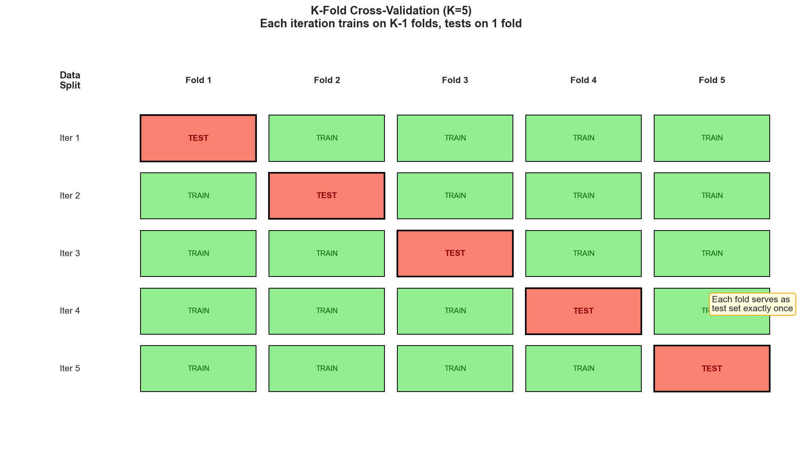
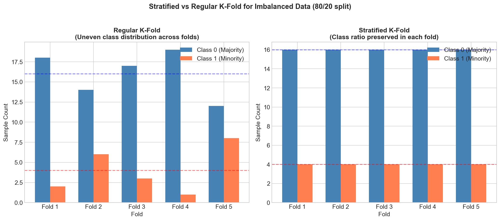
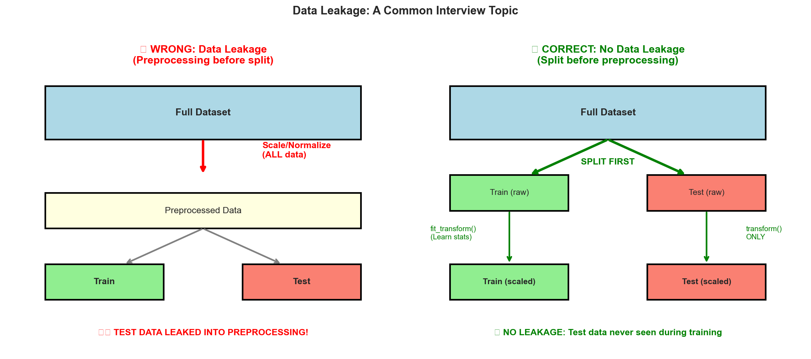
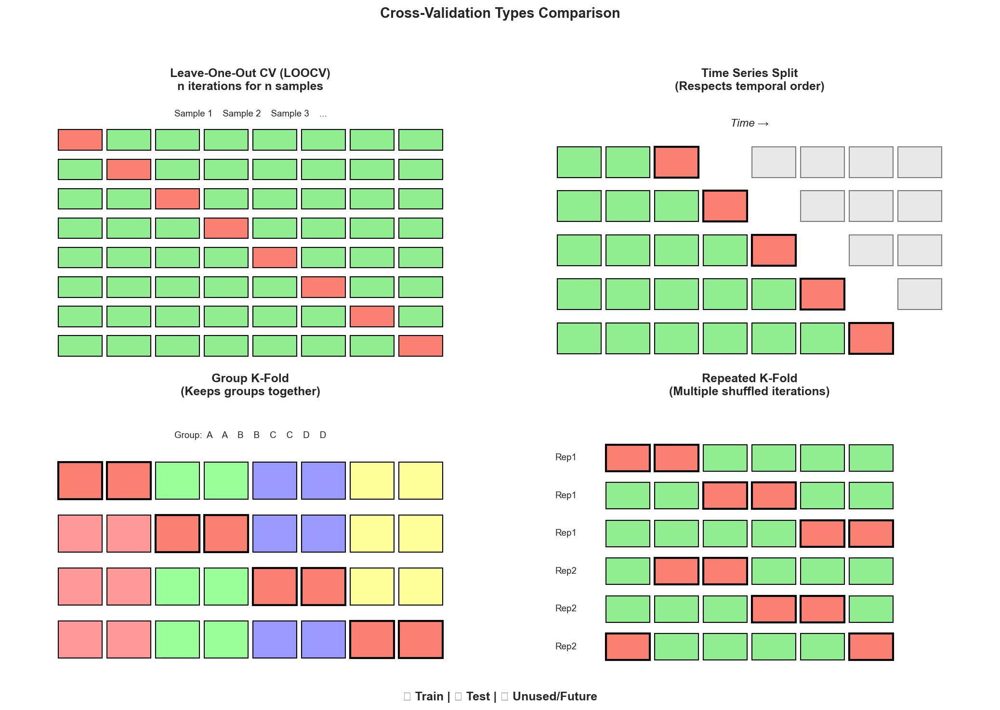
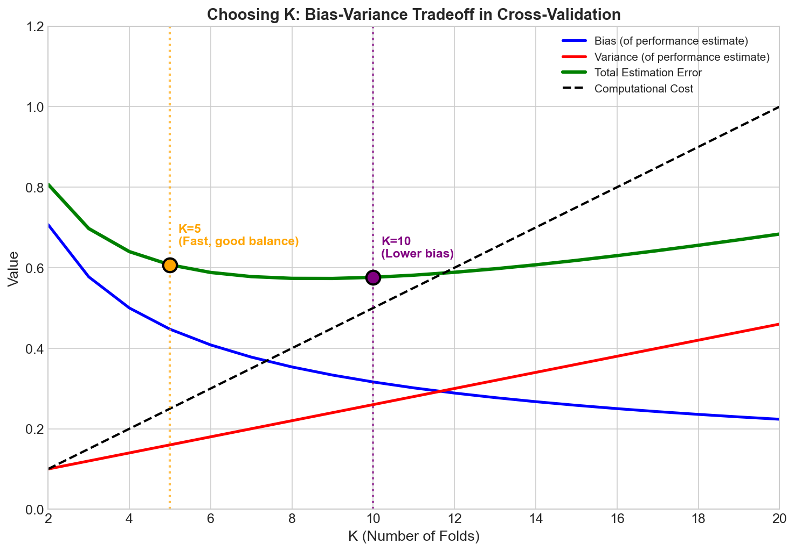

# Cross-Validation - Interview FAQ

## Overview

Cross-validation is a statistical technique used to evaluate machine learning models by testing their ability to generalize to independent datasets. It is one of the most important concepts in machine learning for model selection, hyperparameter tuning, and preventing overfitting. In interviews, demonstrating a deep understanding of cross-validation signals that you understand the fundamental challenges of building reliable ML systems.

The core idea is simple: instead of relying on a single train-test split, we systematically rotate through multiple splits to get a more robust estimate of model performance. This helps us answer the critical question: "How well will this model perform on data it has never seen?"

---

## Common Interview Questions

### Q1: What is cross-validation and why do we use it?

**Sample Answer:**

Cross-validation is a resampling technique that assesses how well a statistical model will generalize to an independent dataset. Instead of using a single train-test split, cross-validation partitions the data into multiple subsets and trains/evaluates the model multiple times using different partitions.

**Why we use it:**

1. **More reliable performance estimates**: A single train-test split can be lucky or unlucky. Cross-validation averages across multiple splits, giving us a more stable estimate with confidence intervals.

2. **Better use of limited data**: Especially with small datasets, we cannot afford to set aside a large validation set. Cross-validation lets every data point be used for both training and validation.

3. **Model selection**: When comparing different algorithms or hyperparameters, cross-validation helps identify which configuration truly performs better, not just which happened to work on one particular split.

4. **Detecting overfitting**: A large gap between training performance and cross-validation performance indicates overfitting.

**Interview Tip**: Mention that cross-validation gives us both a mean performance metric and its variance, which helps in making statistically sound decisions about model selection.

---

### Q2: Explain K-Fold cross-validation in detail.

**Sample Answer:**

K-Fold cross-validation divides the dataset into K equal-sized partitions (folds). The model is trained K times, each time using K-1 folds for training and the remaining fold for validation. The final performance metric is the average across all K iterations.

**The process:**

1. Shuffle the dataset randomly (important for avoiding order bias)
2. Split into K equal folds
3. For each fold i from 1 to K:
   - Use fold i as the validation set
   - Use all other folds as the training set
   - Train the model and record the validation score
4. Calculate the mean and standard deviation of the K validation scores

**Key characteristics:**

- Every data point appears in the validation set exactly once
- Every data point appears in the training set exactly K-1 times
- The training set size is (K-1)/K of the total data in each iteration

**Why K typically equals 5 or 10:**

- K=5: Each training set is 80% of data; good balance of bias and variance
- K=10: Each training set is 90% of data; lower bias but higher computational cost
- Trade-off: Higher K means more training data per fold (lower bias) but more correlated training sets (higher variance of the estimate)

---

### Q3: What is the difference between Stratified K-Fold and regular K-Fold?

**Sample Answer:**

**Regular K-Fold** randomly assigns samples to folds without considering the target variable distribution. This can lead to folds with very different class proportions, especially with imbalanced datasets.

**Stratified K-Fold** ensures that each fold maintains the same proportion of samples for each class as the original dataset. This is achieved by performing K-Fold separately within each class and then combining the results.

**When to use Stratified K-Fold:**

1. **Classification problems**: Almost always prefer stratified splitting
2. **Imbalanced datasets**: Critical to ensure minority classes appear in all folds
3. **Small datasets**: Random variation in class distribution is more impactful
4. **Multi-class problems**: Ensures rare classes are not accidentally excluded from some folds

**Example scenario:**

Imagine a dataset with 95% negative and 5% positive samples. With regular K-Fold (K=5), one fold might randomly get 8% positive while another gets 2%. This creates inconsistent evaluation conditions and unreliable performance estimates.

With Stratified K-Fold, each fold would have approximately 5% positive samples, making the validation more consistent and meaningful.

**Interview Tip**: For regression problems, you can use "binned stratification" where you discretize the continuous target into bins and stratify based on those bins.

---

### Q4: Explain Leave-One-Out Cross-Validation (LOOCV). What are its pros and cons?

**Sample Answer:**

Leave-One-Out Cross-Validation is a special case of K-Fold where K equals the number of samples (N). In each iteration, the model is trained on N-1 samples and validated on a single sample.

**Advantages:**

1. **Maximum training data**: Each model sees N-1 samples, nearly all available data
2. **Deterministic**: No randomness in fold assignment; results are reproducible
3. **Low bias**: The training set is almost identical to the full dataset
4. **Useful for very small datasets**: When you have only 50-100 samples, LOOCV extracts maximum information

**Disadvantages:**

1. **Computationally expensive**: Requires training N separate models
2. **High variance**: Each training set differs by only one sample, leading to highly correlated models and high variance in the performance estimate
3. **Cannot stratify**: With one sample per fold, stratification is impossible
4. **Sensitive to outliers**: A single outlier can dramatically affect one fold's result

**When to use LOOCV:**

- Very small datasets (less than 100 samples)
- When computational cost is not a concern
- When you need a nearly unbiased estimate
- For model comparison in domains where training is fast (e.g., simple linear models)

**Interview Tip**: Mention that the bias-variance trade-off of LOOCV versus K-Fold is nuanced. LOOCV has low bias but can have higher variance than 10-fold CV because the training sets are highly overlapping.

---

### Q5: Explain the purpose of train, validation, and test splits. Why do we need all three?

**Sample Answer:**

**Training Set**: Used to train the model parameters. The model learns patterns from this data.

**Validation Set**: Used during model development to tune hyperparameters, perform feature selection, and choose between different model architectures. The model does not learn from this data, but our decisions do.

**Test Set**: A completely held-out dataset used only once at the very end to get an unbiased estimate of the final model's performance on new data. Never used for any decision-making during development.

**Why we need all three:**

The critical insight is that any data used to make decisions becomes part of the training process in a broader sense.

1. **If we only had train and test**: We would tune hyperparameters on the test set. The test set would no longer give an unbiased estimate because we optimized for it. This is called "test set leakage."

2. **The validation set absorbs overfitting**: When we try many hyperparameters and pick the best one based on validation performance, we are implicitly overfitting to the validation set. The test set provides the final reality check.

**Cross-validation's role:**

Cross-validation replaces the need for a fixed validation set by creating multiple validation splits from the training data. However, you still need a held-out test set for final evaluation.

**Practical workflow:**

1. Split data into train+validation (e.g., 80%) and test (20%)
2. Use cross-validation on train+validation for hyperparameter tuning
3. Train final model on all of train+validation with best hyperparameters
4. Evaluate once on test set and report that score

---

### Q6: What is data leakage and how can you prevent it in cross-validation?

**Sample Answer:**

Data leakage occurs when information from outside the training data is used to create the model, leading to overly optimistic performance estimates that do not generalize to new data.

**Common types of leakage in cross-validation:**

1. **Feature leakage**: Including features that contain information about the target that would not be available at prediction time.

2. **Preprocessing leakage**: Fitting transformations (scaling, PCA, imputation) on the entire dataset before splitting.

3. **Target leakage**: Using features derived from future data or the target variable itself.

4. **Temporal leakage**: Using future data to predict past events in time series.

**How to prevent leakage:**

1. **Fit preprocessing only on training folds**: All transformations (standardization, one-hot encoding, imputation, feature selection) must be fit only on the training fold and applied to the validation fold.

2. **Use pipelines**: Combine preprocessing and model into a single pipeline that is fit fresh on each fold.

3. **Be suspicious of perfect results**: If cross-validation shows near-perfect accuracy, investigate for leakage before celebrating.

4. **Validate feature engineering**: Ask yourself: "Could I compute this feature at prediction time without knowing the target?"

5. **For time series**: Never use future data to predict the past; use time-based splits.

**Interview Tip**: A common interview question presents a scenario and asks you to identify the leakage. Practice identifying subtle forms of leakage, such as using the mean of all data for imputation before splitting.

---

### Q7: How does cross-validation work for time series data?

**Sample Answer:**

Standard K-Fold cross-validation is not appropriate for time series data because it violates the temporal order. Using future data to predict the past leads to data leakage and overly optimistic estimates.

**Time Series Cross-Validation approaches:**

**1. Rolling/Expanding Window:**
- Train on data up to time t, validate on time t+1 to t+h
- Move the window forward and repeat
- Two variants:
  - **Expanding**: Training set grows (all data up to time t)
  - **Sliding**: Training set is fixed size (only recent history)

**2. Time-Based K-Fold:**
- Divide time into K consecutive blocks
- For fold i, train on blocks 1 to i-1 and validate on block i
- Each fold only uses past data for training

**Key principles:**

1. **Respect temporal order**: Training data must always precede validation data
2. **Gap period**: Sometimes include a gap between training and validation to simulate real-world prediction delays
3. **Multiple horizons**: Evaluate at different forecast horizons if relevant

**When to use each approach:**

- **Expanding window**: When all historical data is relevant and patterns are stable
- **Sliding window**: When recent data is more relevant (concept drift) or when training becomes too slow with all historical data
- **Time-based K-Fold**: When you want multiple validation periods to assess consistency

**Interview Tip**: Discuss how seasonality affects the choice of validation strategy. If there are yearly patterns, ensure each validation period covers similar seasonal conditions.

---

### Q8: How do you choose the value of K in K-Fold cross-validation?

**Sample Answer:**

Choosing K involves a trade-off between computational cost, bias, and variance of the performance estimate.

**Factors to consider:**

**1. Dataset size:**
- Small datasets (less than 500 samples): Use higher K (10 or LOOCV) to maximize training data
- Medium datasets (500-10,000 samples): K=5 or K=10 is standard
- Large datasets (more than 10,000 samples): Even K=3 or a single holdout may suffice

**2. Computational cost:**
- K models must be trained
- If training is expensive, use smaller K (5 or 3)
- If training is cheap, use larger K (10+)

**3. Bias-variance trade-off:**
- Higher K = larger training sets = lower bias
- Higher K = more similar training sets = higher variance of the estimate
- K=10 is often cited as a good balance

**4. Stability of the model:**
- Unstable models (trees, neural networks) benefit from more folds to average out variance
- Stable models (linear regression) may not need as many folds

**Common choices and reasoning:**

- **K=5**: Good for large datasets; 80% training data per fold; computationally efficient
- **K=10**: Industry standard; 90% training data; good bias-variance balance
- **K=N (LOOCV)**: For very small datasets; highest computational cost
- **Repeated K-Fold**: Run K-fold multiple times with different random splits and average; reduces variance further

**Interview Tip**: Mention that the literature (Kohavi 1995, Breiman and Spector 1992) suggests K=10 provides a good trade-off, but the optimal K depends on the specific context.

---

### Q9: What is nested cross-validation and when should you use it?

**Sample Answer:**

Nested cross-validation is a technique that uses two layers of cross-validation: an outer loop for unbiased performance estimation and an inner loop for hyperparameter tuning.

**Structure:**

**Outer Loop**: Splits data into training and test folds for final performance estimation.

**Inner Loop**: For each outer fold, performs cross-validation on the training portion to tune hyperparameters.

**Why it is necessary:**

When you use cross-validation for both hyperparameter tuning AND performance estimation, you introduce optimistic bias. The selected hyperparameters were chosen because they performed well on the validation data, so reporting that same validation performance is biased.

Nested CV provides an unbiased estimate by separating the data used for hyperparameter selection from the data used for performance evaluation.

**When to use nested CV:**

1. **When reporting final model performance**: Especially in academic papers or when claims need to be rigorous
2. **Small datasets**: Where overfitting to the validation set is more likely
3. **When comparing many hyperparameter configurations**: The more configurations tested, the more likely we are to "get lucky" on the validation set
4. **Fair model comparison**: When comparing different algorithms where each has its own hyperparameter search

**Computational cost:**

If the outer loop has K1 folds and the inner loop has K2 folds with H hyperparameter configurations, you train K1 x K2 x H models. This can be very expensive.

**Practical considerations:**

- Use 5-fold outer and 3-fold inner as a compromise
- Consider using a simpler hyperparameter search (random search) to reduce cost
- For extremely large datasets, the bias from regular CV may be acceptable

---

### Q10: What is GroupKFold and when would you use it?

**Sample Answer:**

GroupKFold is a variant of K-Fold cross-validation that ensures all samples from the same group are in the same fold. Groups never span multiple folds.

**Use cases:**

**1. Multiple samples per subject:**
- Medical imaging: Multiple scans from the same patient
- User behavior: Multiple sessions from the same user
- Audio: Multiple clips from the same speaker

**2. Hierarchical data:**
- Students within schools
- Transactions within companies
- Products within categories

**3. Repeated measurements:**
- Time series with multiple observations per entity
- Longitudinal studies

**Why it matters:**

If samples from the same group appear in both training and validation, the model might learn group-specific patterns rather than generalizable patterns. This leads to data leakage and overly optimistic performance estimates.

**Example:**

In speaker recognition, if the same speaker's voice samples appear in both training and validation, the model might recognize that specific speaker rather than learning generalizable voice patterns. At deployment, the model would face speakers it has never heard, and performance would drop.

**Variants:**

- **GroupKFold**: Basic group-aware splitting
- **StratifiedGroupKFold**: Combines group-awareness with stratification
- **LeaveOneGroupOut**: Like LOOCV but for groups; each group is held out once

**Interview Tip**: When discussing any ML problem in an interview, consider whether there are natural groups in the data. Mentioning GroupKFold shows you understand the nuances of proper validation.

---

## Visual Concepts

### K-Fold Cross-Validation Structure

This visualization shows how data is partitioned in K-Fold cross-validation. Each iteration uses a different fold as the validation set while the remaining folds form the training set. Notice that every data point serves as validation exactly once.

---

### Stratified vs Regular K-Fold

The comparison between regular and stratified K-Fold demonstrates the importance of maintaining class distributions. In imbalanced datasets, regular K-Fold can create folds with very different class proportions, leading to inconsistent and unreliable evaluation.

---

### Data Leakage in Cross-Validation

This diagram illustrates how data leakage occurs and how to prevent it. The key principle is that any data transformation or feature engineering must be fit only on training data and applied to validation data, never the reverse.

---

### Cross-Validation Types Comparison

Different cross-validation strategies are suited for different scenarios. This comparison helps visualize when to use each approach based on data characteristics and computational constraints.

---

### Choosing K: The Trade-offs

The choice of K involves balancing multiple factors. This visualization shows how bias, variance, and computational cost change with K, helping you make informed decisions for your specific context.

---

## Best Practices

### Do:

1. **Always shuffle your data** before splitting (unless it is time series data)
2. **Use stratified splitting** for classification problems
3. **Fit preprocessing inside cross-validation** to prevent data leakage
4. **Report both mean and standard deviation** of cross-validation scores
5. **Use a separate held-out test set** for final evaluation
6. **Consider group structure** in your data (users, subjects, etc.)
7. **Match your CV strategy to your deployment scenario** (time series needs temporal splitting)
8. **Use pipelines** to encapsulate preprocessing and modeling
9. **Repeat K-Fold with different random seeds** for more stable estimates
10. **Validate on a similar distribution** to what you expect in production

### Common Pitfalls:

1. **Preprocessing before splitting**: Computing means, scaling, or feature selection on the full dataset before cross-validation introduces leakage

2. **Ignoring group structure**: Splitting data randomly when there are natural groups leads to overly optimistic estimates

3. **Using future data for time series**: Standard K-Fold does not respect temporal order

4. **Reporting validation scores as final performance**: The test set should be touched only once at the very end

5. **Using the same data for tuning and final evaluation**: This leads to optimistic bias; use nested CV or a proper holdout

6. **Ignoring class imbalance**: Regular K-Fold can create unrepresentative folds

7. **Choosing K arbitrarily**: Consider your dataset size and computational budget

8. **Not examining fold-by-fold results**: Large variance across folds may indicate unstable models or data quality issues

9. **Overfitting to the validation set**: Testing too many hyperparameter combinations can lead to validation set overfitting

10. **Forgetting to retrain on full data**: After hyperparameter selection, retrain the final model on all available training data

---

## Quick Reference Table

| CV Method | Training Size | When to Use | Considerations |
|-----------|---------------|-------------|----------------|
| K-Fold (K=5) | 80% per fold | Medium to large datasets; general purpose | Fast; may have higher bias for small data |
| K-Fold (K=10) | 90% per fold | Standard choice; good bias-variance trade-off | Industry standard; slightly slower than K=5 |
| Stratified K-Fold | Same as K-Fold | Classification; imbalanced data | Maintains class proportions in each fold |
| LOOCV | N-1 samples | Very small datasets; need maximum training data | High variance; computationally expensive |
| Time Series Split | Varies | Temporal data; forecasting | Respects temporal order; prevents leakage |
| GroupKFold | Varies | Multiple samples per group; hierarchical data | Keeps groups together; prevents leakage |
| Nested CV | Outer x Inner folds | Unbiased hyperparameter tuning + evaluation | Computationally expensive; rigorous |
| Repeated K-Fold | Same as K-Fold | Need stable estimates; reduce variance | Multiple runs with different seeds |
| Monte Carlo CV | User-defined | Flexible train/test ratios; large datasets | Random splits; may repeat test samples |
| Leave-P-Out | N-P samples | Small datasets; exhaustive evaluation | Combinatorially expensive for P more than 1 |

---

## Key Interview Takeaways

1. **Understand the purpose**: Cross-validation is about getting reliable estimates of generalization performance, not about training a model.

2. **Know the trade-offs**: Every choice (K value, CV type, computational budget) involves trade-offs. Be prepared to discuss them.

3. **Prevent leakage**: This is perhaps the most important practical skill. Always ask yourself: "Would this information be available at prediction time?"

4. **Match method to data**: Time series needs temporal splitting; grouped data needs group-aware splitting; imbalanced data needs stratification.

5. **Report uncertainty**: Cross-validation gives you a distribution of scores. Report the mean and standard deviation, not just the mean.

6. **Remember the test set**: Cross-validation is for model development. The final evaluation should be on a truly held-out test set.

7. **Consider computational cost**: In practice, you often need to balance rigor with resource constraints. Know when simpler approaches are acceptable.

8. **Think about deployment**: Your validation strategy should mimic how the model will be used in production as closely as possible.
