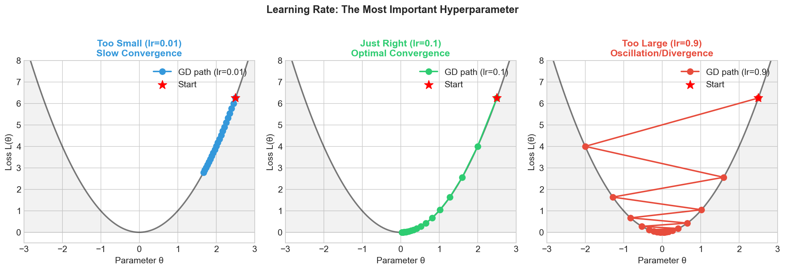
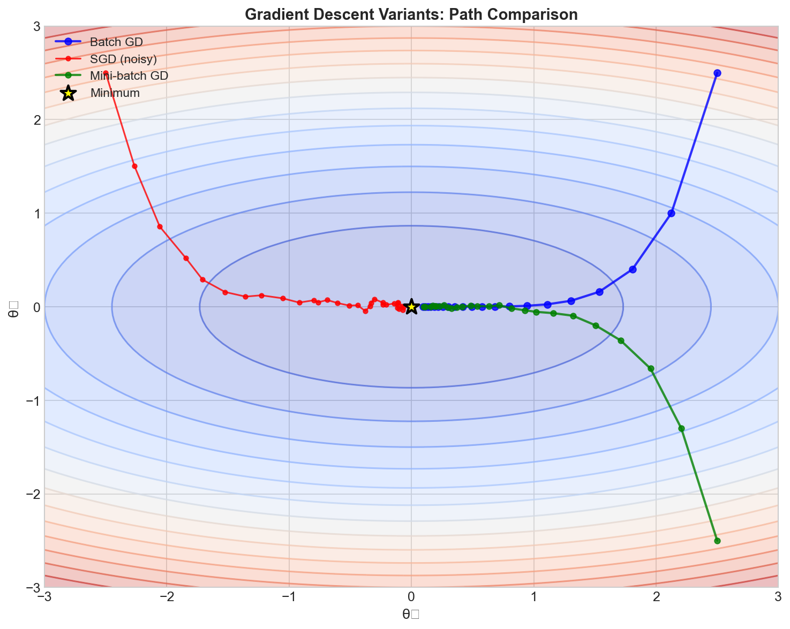
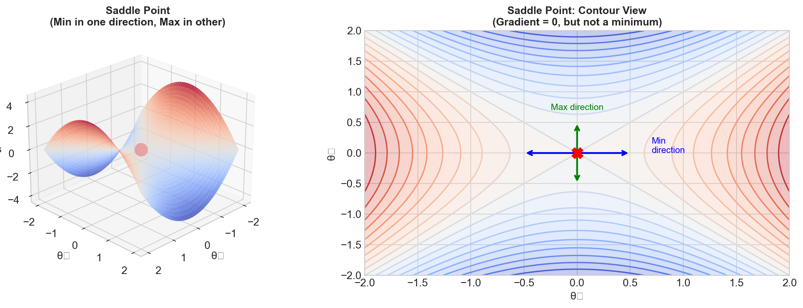
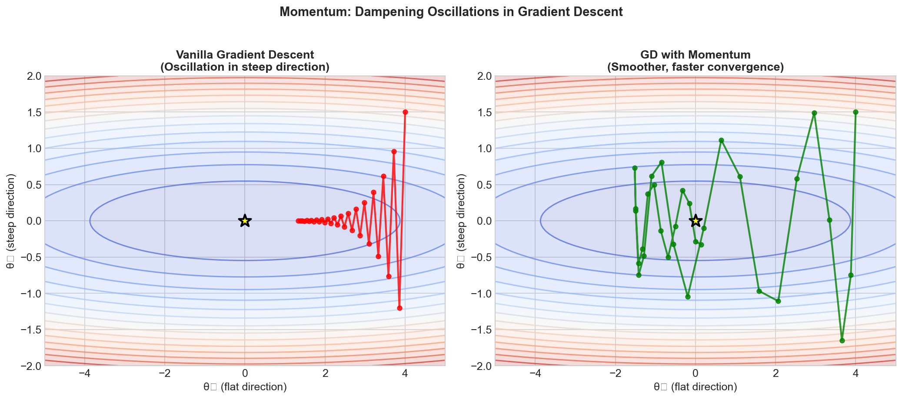
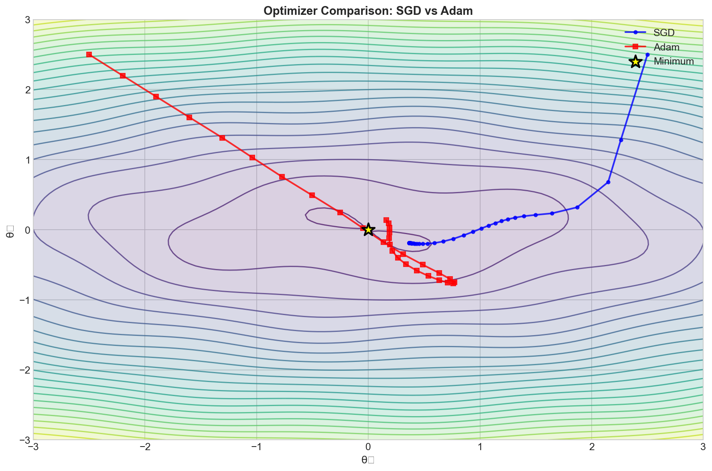

# Gradient Descent & Optimization - Interview FAQ

## Overview

Gradient descent is the cornerstone optimization algorithm in machine learning. It iteratively adjusts model parameters by moving in the direction of steepest descent of the loss function. Understanding gradient descent and its variants is essential for any ML interview, as it directly impacts model training, convergence, and performance.

The core idea is simple: to minimize a function, take steps proportional to the negative of its gradient. In practice, this involves computing partial derivatives of the loss with respect to each parameter and updating them accordingly.

---

## Common Interview Questions

### Q1: What is gradient descent and how does it work?

**Answer:**

Gradient descent is an iterative optimization algorithm used to minimize a differentiable function by following the direction of steepest descent. In machine learning, we use it to find the optimal parameters that minimize the loss function.

**Key Concepts:**
- The gradient points in the direction of steepest increase
- We move in the opposite direction (negative gradient) to decrease the loss
- The learning rate controls the step size
- The process repeats until convergence or a stopping criterion is met

**Intuition:** Imagine standing on a mountain in dense fog. To descend, you feel the slope beneath your feet and take a step in the steepest downhill direction. Repeat this process, and you will eventually reach a valley.

**Practical Considerations:**
- Convergence depends on the loss landscape (convex vs non-convex)
- Initialization matters for non-convex functions
- The algorithm may find local minima rather than the global minimum

---

### Q2: What are the differences between Batch GD, Stochastic GD, and Mini-batch GD?

**Answer:**

| Variant | Data Used Per Update | Characteristics |
|---------|---------------------|-----------------|
| Batch GD | Entire dataset | Stable gradients, slow for large datasets, guaranteed convergence for convex |
| SGD | Single sample | Fast updates, noisy gradients, can escape local minima |
| Mini-batch GD | Subset (typically 32-512) | Balanced approach, leverages GPU parallelism, most commonly used |

**Batch Gradient Descent:**
- Computes gradient using all training examples
- Provides accurate gradient estimate but computationally expensive
- Memory intensive for large datasets
- Smooth convergence path

**Stochastic Gradient Descent (SGD):**
- Uses one random sample per update
- Very noisy updates but fast iterations
- The noise can help escape shallow local minima
- Requires careful learning rate tuning

**Mini-batch Gradient Descent:**
- Best of both worlds: reduced variance with computational efficiency
- Batch sizes of 32, 64, 128, or 256 are common
- Enables efficient GPU utilization
- The standard choice in modern deep learning

**Interview Tip:** When discussing trade-offs, mention that mini-batch is preferred because it balances gradient accuracy with computational efficiency and naturally fits GPU architectures.

---

### Q3: How does the learning rate affect training?

**Answer:**

The learning rate is arguably the most important hyperparameter in gradient descent. It determines the step size at each iteration.

**Too High Learning Rate:**
- Large oscillations around the minimum
- May overshoot and diverge (loss increases or becomes NaN)
- Training becomes unstable
- Updates may never converge

**Too Low Learning Rate:**
- Extremely slow convergence
- May get stuck in poor local minima
- Wastes computational resources
- May stop improving before reaching a good solution

**Optimal Learning Rate:**
- Achieves fast convergence without instability
- Typically found through experimentation or learning rate finders
- Often starts higher and decreases during training (learning rate scheduling)

**Practical Guidelines:**
- Common starting points: 0.1, 0.01, 0.001, or 0.0001
- Use learning rate warmup for transformers and large models
- Learning rate finders can systematically identify good values
- Monitor training loss for signs of learning rate issues

---

### Q4: What is momentum and why is it useful?

**Answer:**

Momentum is a technique that accelerates gradient descent by accumulating a velocity vector that builds up speed in consistent gradient directions while dampening oscillations.

**Why Momentum Helps:**

1. **Accelerates convergence in ravines:** When the loss surface has elongated valleys (high curvature in one direction, low in another), standard GD oscillates across the valley. Momentum smooths these oscillations and moves faster along the valley floor.

2. **Dampens oscillations:** By averaging gradients over time, momentum reduces the impact of noisy or inconsistent gradients.

3. **Helps escape local minima:** The accumulated velocity can carry the optimizer past shallow local minima and saddle points.

**Analogy:** Think of a ball rolling down a hill. Without momentum, it would move strictly based on the local slope. With momentum, it accumulates speed and can roll through small bumps and dips, ultimately settling in deeper valleys.

**Typical Settings:**
- Momentum coefficient (beta) is usually set to 0.9 or 0.99
- Higher values mean more smoothing but potentially slower adaptation
- Nesterov momentum (a variant) looks ahead before computing gradients

---

### Q5: Explain the Adam optimizer and why it is so popular.

**Answer:**

Adam (Adaptive Moment Estimation) combines the benefits of two other optimizers: momentum (first moment) and RMSprop (second moment).

**Key Components:**

1. **First Moment (Mean):** Tracks the exponential moving average of gradients, similar to momentum. This provides direction and helps accelerate learning in consistent gradient directions.

2. **Second Moment (Variance):** Tracks the exponential moving average of squared gradients. This provides per-parameter adaptive learning rates, scaling down updates for parameters with large gradients.

3. **Bias Correction:** Corrects for initialization bias in the moving averages, especially important in early training steps.

**Why Adam is Popular:**

- **Adaptive learning rates:** Each parameter gets its own effective learning rate
- **Works well out-of-the-box:** Less sensitive to hyperparameter choices
- **Handles sparse gradients:** Effective for embeddings and NLP tasks
- **Fast convergence:** Combines benefits of momentum and adaptive methods

**Default Hyperparameters:**
- Learning rate: 0.001
- Beta1 (momentum): 0.9
- Beta2 (squared gradients): 0.999
- Epsilon: 1e-8 (for numerical stability)

**Limitations:**
- May generalize worse than SGD with momentum on some vision tasks
- Can converge to sharper minima with poorer generalization
- Higher memory usage (stores two moments per parameter)

---

### Q6: When should you use SGD vs Adam?

**Answer:**

**Use SGD with Momentum When:**
- Training CNNs for image classification (ResNet, VGG, etc.)
- Maximum generalization performance is critical
- You have computational budget for hyperparameter tuning
- The task is well-studied with known good hyperparameters
- Training large-scale vision models where final accuracy matters most

**Use Adam When:**
- Training transformers and attention-based models
- Working with sparse gradients (embeddings, NLP)
- Rapid prototyping and experimentation
- Limited time for hyperparameter tuning
- Training GANs or other sensitive architectures
- Fine-tuning pre-trained models

**Research Findings:**

Multiple studies have shown that SGD with momentum often achieves better final generalization on image classification benchmarks, while Adam converges faster initially. This has led to hybrid approaches:

- Start with Adam for fast initial progress
- Switch to SGD for final fine-tuning
- Use learning rate warmup with both

**Interview Insight:** Demonstrate awareness that optimizer choice is task-dependent. The best optimizer depends on architecture, dataset, and whether you prioritize convergence speed or final performance.

---

### Q7: What are saddle points and local minima? Why do they matter?

**Answer:**

**Local Minima:**
- Points where the function is lower than all nearby points
- In low dimensions, they can trap optimization
- In high-dimensional neural networks, most local minima have similar loss values to the global minimum
- Less problematic than traditionally thought for deep learning

**Saddle Points:**
- Points where the gradient is zero but the point is neither a minimum nor maximum
- The function curves up in some directions and down in others
- Far more common than local minima in high-dimensional spaces
- Can significantly slow down training

**Why Saddle Points Are More Problematic:**

In a high-dimensional space with d parameters, a critical point (gradient = 0) is a local minimum only if the Hessian is positive definite in all d directions. The probability of this decreases exponentially with dimension. Most critical points are saddle points.

**How Modern Optimizers Address This:**

1. **SGD noise:** Stochastic gradients can bounce the optimizer away from saddle points
2. **Momentum:** Accumulated velocity can carry past flat regions
3. **Adam:** Adaptive learning rates prevent getting stuck in flat directions

**Interview Tip:** Mention that modern deep learning research has shifted focus from local minima to saddle points, as they are the more prevalent challenge in high-dimensional optimization.

---

### Q8: What are vanishing and exploding gradients?

**Answer:**

**Vanishing Gradients:**

Gradients become exponentially small as they propagate backward through many layers, causing early layers to learn extremely slowly or not at all.

**Causes:**
- Saturating activation functions (sigmoid, tanh) that squash gradients
- Very deep networks without skip connections
- Improper weight initialization

**Solutions:**
- Use ReLU or variants (LeakyReLU, ELU, GELU)
- Skip connections (ResNet, DenseNet)
- Proper initialization (Xavier, He initialization)
- Batch normalization

**Exploding Gradients:**

Gradients become exponentially large, causing unstable updates and numerical overflow.

**Causes:**
- Poor weight initialization (too large)
- Long sequences in RNNs
- Deep networks without normalization

**Solutions:**
- Gradient clipping (most direct fix)
- Proper weight initialization
- Layer normalization or batch normalization
- LSTM/GRU architectures for sequences
- Learning rate reduction

**How to Detect:**
- Loss becomes NaN or infinity (exploding)
- Loss plateaus early and model does not learn (vanishing)
- Monitor gradient norms during training
- Very deep layers have near-zero gradients (vanishing)

---

### Q9: What are learning rate schedules and why are they used?

**Answer:**

Learning rate schedules systematically adjust the learning rate during training, typically decreasing it over time to enable fine-grained convergence.

**Common Schedules:**

**Step Decay:**
- Reduce learning rate by a factor at specific epochs
- Example: Multiply by 0.1 every 30 epochs
- Simple and effective, commonly used in vision

**Exponential Decay:**
- Continuously decrease learning rate exponentially
- Smooth reduction over training

**Cosine Annealing:**
- Learning rate follows a cosine curve from initial value to near zero
- Popular in modern deep learning
- Often combined with warm restarts

**Warmup:**
- Start with very low learning rate and gradually increase
- Essential for transformers and large batch training
- Helps stabilize early training dynamics

**Reduce on Plateau:**
- Monitor validation metric and reduce LR when it stops improving
- Adaptive and requires no schedule tuning
- Commonly used in practice

**Why Schedules Help:**
- High initial LR enables fast progress through easy optimization
- Low final LR enables precise convergence to minima
- Warmup prevents early training instability
- Can escape local minima through restarts

---

### Q10: What is gradient clipping and when should it be used?

**Answer:**

Gradient clipping limits the magnitude of gradients during backpropagation to prevent exploding gradients.

**Two Main Approaches:**

**Clip by Value:**
- Clips each gradient component independently to a range
- Simple but can change gradient direction
- Less commonly used

**Clip by Norm (Preferred):**
- Scales the entire gradient vector if its norm exceeds a threshold
- Preserves gradient direction
- More principled approach

**When to Use Gradient Clipping:**

1. **RNNs and LSTMs:** Essential for training recurrent networks on long sequences
2. **Transformers:** Standard practice, especially for large models
3. **Deep networks:** When experiencing training instability
4. **GANs:** Helps stabilize discriminator training

**Typical Threshold Values:**
- Norm clipping: 1.0, 5.0, or 10.0
- The optimal value is model and task dependent
- Too aggressive clipping can slow learning

**Interview Insight:** Gradient clipping is a safety mechanism, not a fix for underlying architecture problems. If you need very aggressive clipping, consider whether the architecture or initialization needs adjustment.

---

### Q11: How do you diagnose and fix optimization problems in practice?

**Answer:**

**Common Symptoms and Solutions:**

**Loss Not Decreasing:**
- Learning rate too low: Increase LR or use LR finder
- Learning rate too high: Decrease LR (loss might be oscillating)
- Bug in code: Verify gradients are flowing correctly
- Data issue: Check labels and preprocessing

**Loss Decreasing Then Plateauing:**
- Stuck in local minimum or saddle point: Try momentum or Adam
- Learning rate too high for fine convergence: Implement LR schedule
- Insufficient model capacity: Increase model size

**Loss Exploding (NaN/Inf):**
- Learning rate too high: Reduce immediately
- Exploding gradients: Add gradient clipping
- Numerical issues: Check for division by zero, log(0), etc.
- Bad initialization: Use proper initialization scheme

**Training Unstable (Oscillating Loss):**
- Learning rate too high: Reduce LR
- Batch size too small: Increase batch size or decrease LR
- No normalization: Add batch norm or layer norm

**Debugging Checklist:**
1. Verify model can overfit a small batch (proves learning capacity)
2. Monitor gradient norms (should be reasonable, not zero or huge)
3. Check weight distributions across layers
4. Visualize loss curves for both training and validation
5. Try known-good hyperparameters from literature first

---

### Q12: What are second-order optimization methods and why are they not commonly used in deep learning?

**Answer:**

**Second-Order Methods:**

These methods use second-derivative information (the Hessian matrix) in addition to gradients. Examples include Newtons method, L-BFGS, and natural gradient descent.

**Advantages:**
- Faster convergence (fewer iterations needed)
- Better handling of ill-conditioned problems
- No learning rate hyperparameter in pure form
- Can navigate saddle points more effectively

**Why They Are Rarely Used in Deep Learning:**

1. **Computational Cost:** The Hessian has O(n squared) parameters for n weights. For a model with millions of parameters, storing and computing the Hessian is infeasible.

2. **Memory Requirements:** Even approximations like L-BFGS require storing history of gradients and updates.

3. **Batch Computation Issues:** Second-order methods assume access to the true Hessian, but stochastic approximations introduce complications.

4. **Saddle Point Attraction:** Pure Newtons method can be attracted to saddle points (where the Hessian is indefinite).

**Approximations Used in Practice:**
- Adam and RMSprop use diagonal approximations to the Hessian
- K-FAC approximates the Fisher information matrix
- Shampoo uses block-diagonal approximations
- These provide some second-order benefits at manageable cost

---

## Visual Concepts

The following visualizations illustrate key concepts in gradient descent optimization:

### Learning Rate Effects

This visualization demonstrates how different learning rates affect convergence. A well-chosen learning rate reaches the minimum efficiently, while too-high rates cause divergence and too-low rates result in slow progress.

### Gradient Descent Variants

Comparison of Batch GD, Mini-batch GD, and SGD trajectories. Notice how batch GD has a smooth path while SGD is noisy. Mini-batch provides a balance between the two extremes.

### Saddle Points in Optimization

Visualization of a saddle point, where the gradient is zero but the surface curves up in one direction and down in another. These are common in high-dimensional optimization landscapes.

### Momentum vs Standard GD

Comparison showing how momentum accelerates convergence through narrow valleys by building up velocity in consistent directions while dampening oscillations.

### Optimizer Trajectories

Side-by-side comparison of different optimizers (SGD, Momentum, RMSprop, Adam) on the same loss landscape, demonstrating their different convergence behaviors.

---

## Key Formulas

### Standard Gradient Descent Update

**Parameter Update:** theta(t+1) = theta(t) - alpha * gradient of L with respect to theta

Where alpha is the learning rate and L is the loss function.

### Momentum Update

**Velocity:** v(t+1) = beta * v(t) + gradient of L

**Parameter Update:** theta(t+1) = theta(t) - alpha * v(t+1)

Typical beta = 0.9

### Nesterov Momentum

**Look-ahead Gradient:** Compute gradient at theta(t) - beta * v(t)

**Velocity:** v(t+1) = beta * v(t) + gradient at look-ahead position

**Parameter Update:** theta(t+1) = theta(t) - alpha * v(t+1)

### RMSprop Update

**Squared Gradient Average:** s(t+1) = beta * s(t) + (1 - beta) * gradient squared

**Parameter Update:** theta(t+1) = theta(t) - alpha * gradient / (sqrt(s(t+1)) + epsilon)

Typical beta = 0.999, epsilon = 1e-8

### Adam Update

**First Moment:** m(t+1) = beta1 * m(t) + (1 - beta1) * gradient

**Second Moment:** v(t+1) = beta2 * v(t) + (1 - beta2) * gradient squared

**Bias Correction:** m_hat = m(t+1) / (1 - beta1^t), v_hat = v(t+1) / (1 - beta2^t)

**Parameter Update:** theta(t+1) = theta(t) - alpha * m_hat / (sqrt(v_hat) + epsilon)

Typical beta1 = 0.9, beta2 = 0.999, epsilon = 1e-8

### Gradient Clipping (by Norm)

**If** norm of gradient > threshold:

**Then** gradient = gradient * threshold / norm of gradient

---

## Optimizer Selection Guide

| Scenario | Recommended Optimizer | Reasoning |
|----------|----------------------|-----------|
| Image Classification (CNN) | SGD + Momentum + LR Schedule | Best generalization, well-studied hyperparameters |
| Natural Language Processing | Adam or AdamW | Handles sparse gradients, fast convergence |
| Transformer Models | AdamW with Warmup | Standard practice, weight decay important |
| Recurrent Networks (RNN/LSTM) | Adam + Gradient Clipping | Adaptive LR helps with varying gradient scales |
| GANs | Adam with low beta1 (0.5) | Stability crucial, momentum can cause oscillations |
| Fine-tuning Pre-trained Models | Adam with low LR | Quick adaptation without destroying learned features |
| Rapid Prototyping | Adam | Fast convergence, minimal tuning required |
| Competition/Maximum Accuracy | SGD + Momentum | Often achieves best final performance |
| Small Datasets | SGD + Momentum | Less prone to overfitting than Adam |
| Large Batch Training | LAMB or LARS | Specialized for distributed training |

### General Guidelines

1. **Start with Adam** for new projects - it works well across most domains
2. **Switch to SGD** for final training if maximum accuracy is needed
3. **Always use learning rate warmup** for transformers and large batches
4. **Monitor gradient norms** - they reveal optimization health
5. **Use weight decay** (L2 regularization) for better generalization
6. **Try multiple optimizers** if one is not working - the landscape matters

---

## Quick Reference for Interviews

**The Three Most Important Points:**

1. Gradient descent minimizes loss by iteratively stepping in the negative gradient direction
2. Learning rate is the most critical hyperparameter - too high causes divergence, too low causes slow convergence
3. Adam is the default choice for most applications; SGD with momentum for maximum accuracy on vision tasks

**Common Follow-up Questions:**

- Why does batch normalization help optimization? (Smooths loss landscape, allows higher learning rates)
- How do you choose batch size? (Balance between gradient accuracy and computational efficiency)
- What is the difference between weight decay and L2 regularization? (Equivalent for SGD, different for Adam)

---

*This FAQ covers the essential gradient descent and optimization concepts commonly tested in ML interviews. Focus on understanding the intuition behind each concept and be prepared to discuss trade-offs and practical considerations.*
