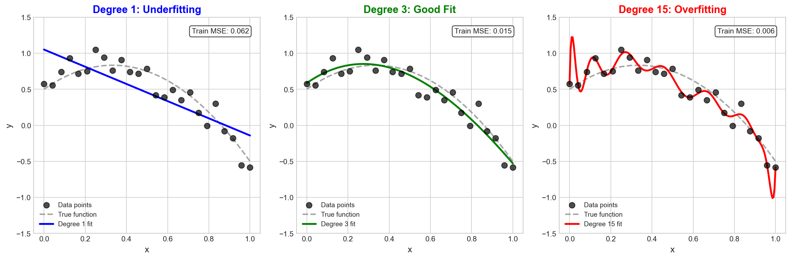
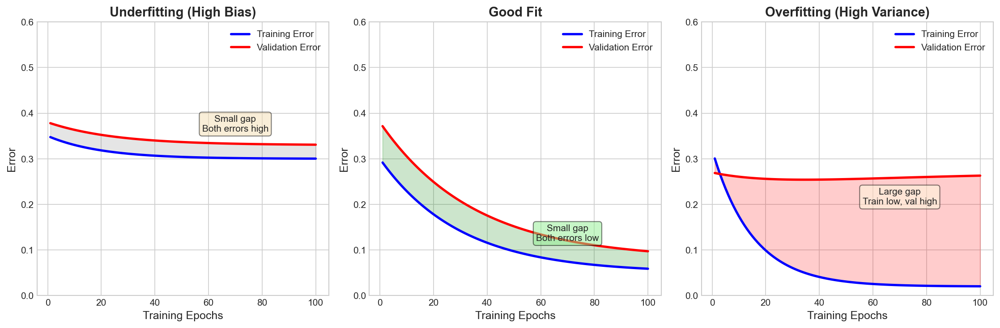
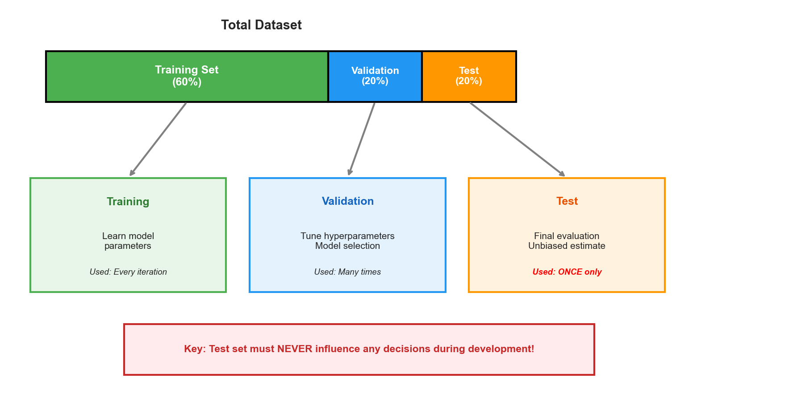
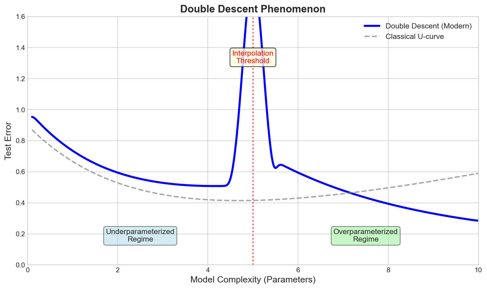
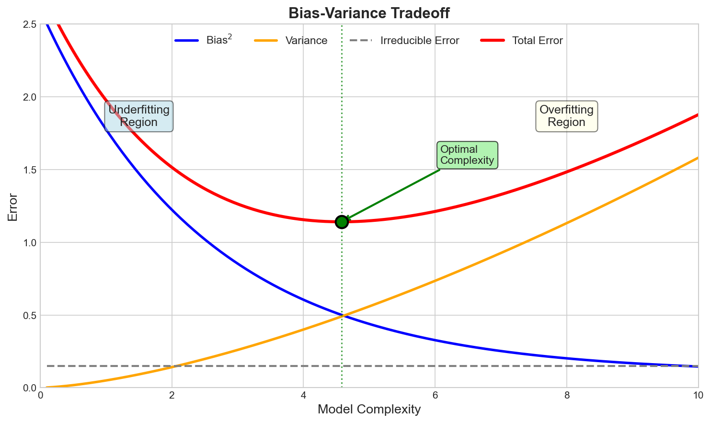
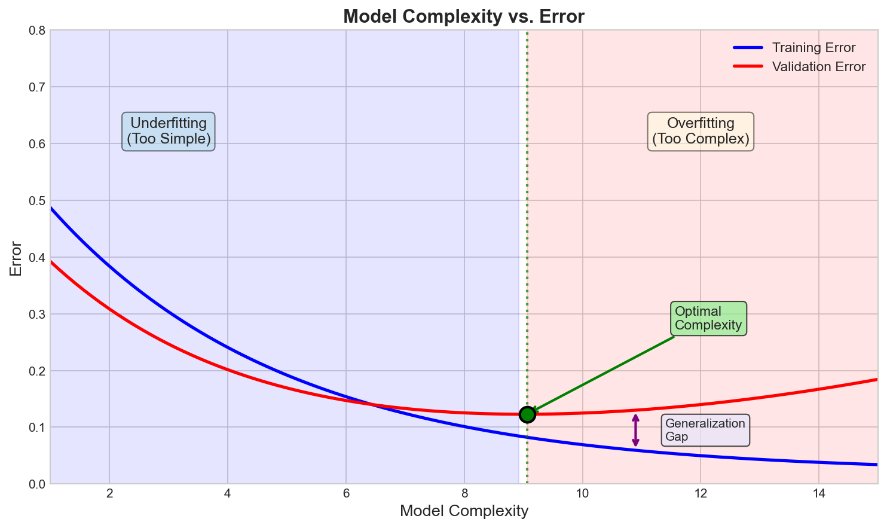

# Overfitting and Underfitting Interview FAQ

> **Achieve the right model complexity**

## Overview

Overfitting and underfitting are two fundamental challenges in machine learning that directly impact model generalization. Understanding these concepts is essential for building models that perform well not just on training data but on unseen data in production. This FAQ covers the core concepts, detection methods, and practical solutions that are frequently tested in ML interviews at top tech companies.

**Why This Matters:**
- Models that overfit memorize noise and fail in production
- Models that underfit miss important patterns and underperform
- The balance between overfitting and underfitting determines real-world model success
- This topic connects to bias-variance tradeoff, regularization, and model selection

---

## Common Interview Questions

### Q1: What is overfitting and how do you detect it?

**Answer:**

Overfitting occurs when a model learns the training data too well, including noise and random fluctuations, resulting in poor generalization to unseen data.



*The degree-15 polynomial (right panel) demonstrates overfitting: it achieves the lowest training MSE (0.006) by fitting every point, but the erratic curve would generalize poorly to new data.*

**Key characteristics:**

| Indicator | Description |
|-----------|-------------|
| Training performance | Very low (near-zero) error |
| Test/validation performance | Significant degradation |
| Generalization gap | Large (test - train error) |
| Sensitivity | Small data changes cause large prediction changes |

**Detection methods:**

1. **Train-validation gap:** Large gap (low train, high validation error)
2. **Learning curves:** Diverging curves as training progresses
3. **Cross-validation:** High variance across folds, CV score much worse than training
4. **Holdout test:** Significant drop from validation to test performance

**Example:** A decision tree with no depth limit achieves 99.9% training accuracy but only 65% test accuracy. The 35% gap clearly indicates overfitting.

**Interview Tip:** Always mention the generalization gap as the primary diagnostic.

---

### Q2: What is underfitting and how do you detect it?

**Answer:**

Underfitting occurs when a machine learning model is too simple to capture the underlying structure of the data. The model fails to learn the relevant patterns even from the training data, resulting in poor performance across both training and test sets.

**Key characteristics of underfitting:**

1. **Poor training performance**: The model cannot fit the training data well
2. **Poor test/validation performance**: Test error is also high
3. **Small generalization gap**: Both training and validation errors are high and similar
4. **Consistent underperformance**: The model systematically misses patterns

**Detection methods:**

1. **Training error analysis:**
   - If training error is high, the model may be underfitting
   - The model cannot even learn the patterns in data it has seen

2. **Learning curves:**
   - Both training and validation curves plateau at a high error
   - Adding more data does not significantly improve performance
   - Curves converge quickly to a similar (high) value

3. **Residual analysis:**
   - Systematic patterns in residuals indicate the model is missing structure
   - Non-random error distribution suggests underfitting

4. **Comparison with baselines:**
   - If the model performs similarly to or worse than simple baselines, it may be underfitting
   - A linear model performing no better than predicting the mean is likely underfitting

**Example scenario:**

A linear regression model trying to fit data with a clear quadratic relationship achieves R-squared of 0.3 on both training and test sets. The consistently poor performance indicates underfitting.

**Interview Tip:** Emphasize that underfitting is characterized by high error on both training and test sets with a small gap between them. This distinguishes it from overfitting where only test error is high.

---

### Q3: How do you interpret learning curves to diagnose overfitting vs. underfitting?

**Answer:**

Learning curves plot error against training epochs or dataset size, providing powerful diagnostics for model behavior.



**Interpreting the three patterns:**

| Pattern | Key Characteristics | Diagnosis | Action |
|---------|---------------------|-----------|--------|
| **Underfitting** | Both curves plateau high, small gap | High bias | Increase model complexity, add features |
| **Good Fit** | Both curves converge low, small gap | Balanced | Model appropriately calibrated |
| **Overfitting** | Train low, validation high, large gap | High variance | Regularization, more data, simpler model |

**Interview Tip:** Be prepared to sketch learning curves on a whiteboard. The ability to visually explain these concepts demonstrates deep understanding.

---

### Q4: What are the solutions for overfitting?

**Answer:**

There are multiple strategies to combat overfitting, and the best approach often combines several techniques.

**1. Regularization:**

Add penalty terms to the loss function to constrain model complexity.

- **L2 Regularization (Ridge):** Penalizes large weights, shrinks all coefficients
- **L1 Regularization (Lasso):** Promotes sparsity, sets some weights to zero
- **Elastic Net:** Combines L1 and L2 for balanced regularization

**How it helps:** Prevents the model from fitting noise by limiting the magnitude of learned parameters.

**2. Dropout (for Neural Networks):**

Randomly deactivate neurons during training with probability p (typically 0.2-0.5).

**How it helps:**
- Creates an ensemble effect by training many sub-networks
- Prevents neurons from co-adapting and becoming over-specialized
- Forces the network to learn redundant representations

**3. Early Stopping:**

Monitor validation performance during training and stop when it starts degrading.

**How it helps:**
- Prevents the model from continuing to fit noise after learning useful patterns
- Implicitly regularizes by limiting effective model complexity
- No additional hyperparameters beyond patience value

**4. Data Augmentation:**

Create modified versions of training examples to artificially increase dataset size.

**Examples:**
- Images: rotation, flipping, cropping, color jittering
- Text: synonym replacement, back-translation, paraphrasing
- Audio: time stretching, pitch shifting, noise injection

**How it helps:** Exposes the model to more variations, making it harder to memorize specific examples.

**5. More Training Data:**

The most reliable solution when available.

**How it helps:**
- Reduces the ability to memorize individual examples
- Forces the model to learn general patterns
- Increases effective complexity of the learning problem

**6. Reduce Model Complexity:**

- Fewer layers or neurons in neural networks
- Limit tree depth in decision trees
- Fewer polynomial features
- Use simpler model architectures

**7. Ensemble Methods:**

Combine predictions from multiple models.

- **Bagging (e.g., Random Forest):** Averages predictions from models trained on bootstrap samples
- **Stacking:** Uses meta-learner to combine diverse models

**How it helps:** Averaging reduces variance without significantly increasing bias.

**8. Cross-Validation for Model Selection:**

Use k-fold cross-validation to select hyperparameters and model architecture.

**How it helps:** Provides more robust estimate of generalization performance, reducing the chance of selecting an overfit configuration.

**When to use which technique:**

| Situation | Recommended Solutions |
|-----------|----------------------|
| Limited data | Data augmentation, regularization, simpler model |
| Neural networks | Dropout, early stopping, batch normalization |
| Decision trees | Limit depth, minimum samples per leaf, pruning |
| High-dimensional data | L1 regularization, feature selection |
| Sufficient compute | Ensemble methods, more cross-validation |

**Interview Tip:** Discuss multiple solutions and explain when each is most appropriate. Interviewers value practical judgment about which techniques to apply in different scenarios.

---

### Q5: What are the solutions for underfitting?

**Answer:**

Underfitting requires increasing model capacity or providing the model with better information to learn from.

**1. Increase Model Complexity:**

Give the model more capacity to learn complex patterns.

- Add more layers or neurons to neural networks
- Increase tree depth in decision trees
- Use higher-degree polynomial features
- Switch to more powerful model architectures (e.g., linear to neural network)

**How it helps:** A more complex model can capture intricate patterns that simpler models miss.

**2. Add More Features:**

Provide the model with more informative inputs.

- Feature engineering based on domain knowledge
- Include interaction terms (feature1 * feature2)
- Add polynomial features (feature^2, feature^3)
- Extract features from raw data (e.g., text embeddings, image features)

**How it helps:** Better features make the underlying patterns more apparent to the model.

**3. Reduce Regularization:**

If regularization is too strong, reduce its strength.

- Decrease L1/L2 regularization coefficient (lambda)
- Lower dropout rate in neural networks
- Remove or reduce weight decay

**How it helps:** Excessive regularization prevents the model from fitting even valid patterns. Reducing it allows more flexibility.

**4. Train Longer:**

Allow the model more time to learn.

- Increase number of epochs
- Adjust learning rate schedule
- Ensure convergence has been reached

**How it helps:** The model may not have had enough iterations to learn the patterns. Underfitting can occur if training stops prematurely.

**5. Use a Different Algorithm:**

Some algorithms are inherently better suited for certain data types.

- Switch from linear models to ensemble methods
- Use kernel methods (SVM with RBF kernel) for non-linear data
- Try gradient boosting for tabular data
- Use neural networks for complex, high-dimensional data

**How it helps:** Different algorithms have different inductive biases and may naturally capture patterns that others miss.

**6. Better Data Preprocessing:**

Ensure the data is properly prepared for the model.

- Handle missing values appropriately
- Scale/normalize features to appropriate ranges
- Encode categorical variables effectively
- Remove or handle outliers

**How it helps:** Poor preprocessing can obscure patterns and make them harder to learn.

**7. Remove Noise from Labels:**

If possible, improve label quality.

- Clean noisy labels through manual review
- Use label smoothing techniques
- Apply semi-supervised methods to leverage unlabeled data

**How it helps:** Noisy labels create conflicting signals that confuse the model.

**What does NOT help underfitting:**

- Adding more training data (the model cannot learn patterns regardless of data quantity)
- More aggressive cross-validation (the model fundamentally lacks capacity)
- Increasing regularization (makes underfitting worse)

**Decision flow for underfitting:**

1. First, verify you have sufficient training data
2. Try increasing model complexity
3. Engineer or add more features
4. Reduce any regularization
5. Ensure adequate training time
6. Consider a more powerful algorithm

**Interview Tip:** Emphasize that adding more data generally does not solve underfitting because the model lacks the capacity to learn even from existing data. This is a common misconception to address.

---

### Q6: Why do we need train, validation, and test splits?

**Answer:**

The three-way split serves distinct purposes in the ML workflow.



| Set | Purpose | Usage Frequency |
|-----|---------|-----------------|
| **Training** | Learn model parameters | Every iteration |
| **Validation** | Tune hyperparameters, model selection | Many times during development |
| **Test** | Final unbiased performance estimate | **ONCE** at the very end |

**Why all three are necessary:**

- **Problem with only train/test:** Using test data for hyperparameter tuning causes optimistic bias
- **Validation absorbs overfitting:** When selecting the best configuration, you "overfit" to validation data; the test set provides unbiased final check

**Analogy:** Training = study materials, Validation = practice tests, Test = final exam

**Cross-validation workflow:**
1. Split: 80% train+val, 20% test
2. Use CV on train+val for hyperparameter tuning
3. Train final model on all train+val data
4. Evaluate once on test set

**Common mistakes:** Using test data during development, reporting validation as final performance, repeated test evaluation, data leakage during preprocessing

**Interview Tip:** Emphasize that any data used to make decisions becomes part of the training process in a broader sense.

---

### Q7: What is the double descent phenomenon?

**Answer:**

Double descent is a phenomenon where test error follows a double-U-shaped curve as model complexity increases, contradicting the classical monotonic U-shaped prediction.



**The three regimes:**

| Regime | Behavior | Explanation |
|--------|----------|-------------|
| **Underparameterized** | Classical U-curve behavior | Test error decreases then increases |
| **Interpolation threshold** | Sharp spike in test error | Model barely fits training data perfectly |
| **Overparameterized** | Test error decreases again | More parameters than samples, yet generalizes well |

**Why double descent occurs:**
- **Implicit regularization:** SGD biases toward simpler solutions among many that fit
- **Benign overfitting:** High-dimensional models can memorize noise without degrading signal
- **Solution geometry:** The set of interpolating solutions changes qualitatively with capacity

**Types of double descent:**
- **Model-wise:** Varying model size
- **Epoch-wise:** During training of fixed model
- **Sample-wise:** Varying dataset size (adding data can temporarily hurt)

**Practical implications:**
1. Do not stop at the interpolation threshold - try larger models
2. Modern deep learning operates in the overparameterized regime
3. Regularization shifts the threshold and smooths the curve

**Interview Tip:** This advanced topic demonstrates awareness of recent ML research (Belkin et al., 2019).

---

### Q8: How does overfitting/underfitting relate to the bias-variance tradeoff?

**Answer:**

The bias-variance tradeoff provides the theoretical framework for understanding overfitting and underfitting.



**The fundamental decomposition:**

```
Total Error = Bias^2 + Variance + Irreducible Error
```

| Component | Definition | Effect |
|-----------|------------|--------|
| **Bias** | Systematic error from model assumptions | High when underfitting |
| **Variance** | Sensitivity to training data fluctuations | High when overfitting |
| **Irreducible** | Noise inherent in data | Cannot be reduced |

**The tradeoff in action:**

| Model State | Bias | Variance | Training Error | Test Error | Gap |
|-------------|------|----------|----------------|------------|-----|
| Underfitting | High | Low | High | High | Small |
| Optimal | Medium | Medium | Medium | Medium | Small |
| Overfitting | Low | High | Low | High | Large |

**How interventions affect the tradeoff:**

| Action | Bias | Variance | Effect |
|--------|------|----------|--------|
| Increase complexity | Decreases | Increases | Toward overfitting |
| Add regularization | Increases | Decreases | Toward underfitting |
| Add training data | Unchanged | Decreases | Reduces overfitting only |

**Dartboard Analogy:**
- **Underfitting:** Darts clustered but off-target (high bias, low variance)
- **Overfitting:** Darts scattered with some near bullseye (low bias, high variance)
- **Optimal:** Darts clustered near bullseye (low bias, low variance)

**Interview Tip:** Drawing the bias-variance curve and explaining how model complexity and regularization affect it demonstrates comprehensive understanding.

---

### Q9: How does model complexity affect overfitting and underfitting?

**Answer:**

Model complexity is the primary lever for controlling the balance between overfitting and underfitting.



**What is model complexity?**

Measured by: number of parameters, polynomial degree, tree depth, number of features, or inverse of regularization strength.

**Low vs. High Complexity:**

| Aspect | Low Complexity | High Complexity |
|--------|----------------|-----------------|
| **Examples** | Linear regression, shallow trees | Deep networks, unpruned trees |
| **Bias** | High | Low |
| **Variance** | Low | High |
| **Risk** | Underfitting | Overfitting |
| **Predictions** | Consistent but potentially wrong | Can capture complexity but inconsistent |

**Finding optimal complexity:**
1. Start simple (baseline)
2. Gradually increase complexity
3. Monitor validation error
4. Stop when validation degrades

**Factors affecting optimal complexity:**

| Factor | Effect on Optimal Complexity |
|--------|------------------------------|
| More training data | Can support higher complexity |
| More noise in data | Lower complexity preferred |
| Stronger regularization | Reduces effective complexity |

**Interview Tip:** Note that the relationship is not strictly monotonic (see double descent), but classical intuition holds for most practical scenarios.

---

### Q10: What is the role of cross-validation in detecting overfitting?

**Answer:**

Cross-validation serves as a robust diagnostic tool for detecting and preventing overfitting during model development.

**How cross-validation detects overfitting:**

1. **Multiple validation estimates:**
   - Instead of a single train-test split, CV provides K estimates
   - High variance across folds suggests overfitting

2. **More reliable generalization estimate:**
   - Averages across multiple validation sets
   - Less likely to be fooled by a "lucky" split

3. **Every point validates:**
   - Each data point serves as validation exactly once
   - Provides comprehensive assessment across the full dataset

**Interpreting CV results for overfitting:**

**Indicators of overfitting:**
- Large standard deviation across fold scores
- CV score much worse than training score
- Performance varies dramatically based on which data is held out
- Model changes significantly with small data changes

**Indicators of good generalization:**
- Low standard deviation across fold scores
- CV score close to training score
- Consistent performance across all folds

**Using CV for hyperparameter tuning:**

Cross-validation helps select hyperparameters that generalize well:

1. For each hyperparameter configuration:
   - Run k-fold cross-validation
   - Record mean and std of validation scores
2. Select the configuration with best mean CV score
3. Consider the "one standard error rule": choose simplest model within one std of best

**Nested cross-validation for unbiased evaluation:**

When using CV for both hyperparameter tuning AND performance estimation:

- **Outer loop:** Estimates generalization performance
- **Inner loop:** Tunes hyperparameters

This prevents optimistic bias from using the same data for selection and evaluation.

**CV diagnostics for different model states:**

| CV Observation | Likely Issue | Solution |
|----------------|--------------|----------|
| High train score, low CV score | Overfitting | Regularize, simpler model |
| Low train score, low CV score | Underfitting | More complex model |
| High variance across folds | Overfitting or unstable data | Regularize, more data, check data quality |
| Consistent low scores | Underfitting | Increase capacity |

**Limitations of CV for detecting overfitting:**

1. Does not prevent overfitting to the CV procedure itself (validation set overfitting)
2. Computationally expensive for large models
3. May not catch temporal or distributional shifts
4. Still need a held-out test set for final evaluation

**Interview Tip:** Emphasize that CV is for model development and comparison. Final performance should still be evaluated on a truly held-out test set that was never used in any decision-making.

---

### Q11: How do ensemble methods help with overfitting?

**Answer:**

Ensemble methods combine multiple models to reduce variance and improve generalization. Different ensemble strategies address overfitting in different ways.

**Bagging (Bootstrap Aggregating):**

**Mechanism:**
1. Create multiple bootstrap samples (random sampling with replacement)
2. Train a separate model on each bootstrap sample
3. Average predictions (regression) or vote (classification)

**How it reduces overfitting:**
- Each model sees a slightly different dataset
- Individual model errors tend to cancel out when averaged
- Reduces variance without significantly increasing bias

**Example:** Random Forest
- Ensemble of decision trees, each trained on bootstrap sample
- Additional randomness through random feature subsets
- Dramatically reduces overfitting compared to single deep tree

**Boosting:**

**Mechanism:**
1. Train models sequentially
2. Each model focuses on errors of previous models
3. Combine predictions with weights

**Relationship to overfitting:**
- Can reduce bias by focusing on hard examples
- May increase variance if too many iterations
- Needs careful regularization (learning rate, number of rounds)

**Example:** XGBoost, LightGBM
- Built-in regularization parameters
- Early stopping based on validation performance
- Shrinkage (learning rate) prevents overfitting

**Stacking:**

**Mechanism:**
1. Train diverse base models
2. Use their predictions as features for a meta-model
3. Meta-model learns optimal combination

**How it reduces overfitting:**
- Diversity among base models captures different aspects of data
- Meta-model can discount overfit base models
- Cross-validation in training prevents data leakage

**Why ensembles reduce variance:**

Consider independent models with variance sigma^2:
- Single model variance: sigma^2
- Average of n models: sigma^2 / n

The variance reduction is proportional to 1/n, assuming independence. In practice, models are correlated, so reduction is less dramatic but still significant.

**Practical considerations:**

| Method | Variance Reduction | Bias Impact | Overfitting Risk |
|--------|-------------------|-------------|------------------|
| Bagging | High | Minimal | Low |
| Boosting | Medium | Decreases | Medium (needs regularization) |
| Stacking | Medium | Decreases | Medium (needs careful CV) |

**When ensembles do not help:**

- If base models are underfitting, ensembling will not help
- If models are highly correlated, variance reduction is limited
- Computational cost may not justify marginal improvement

**Interview Tip:** Explain that bagging reduces variance (helps overfitting) while boosting primarily reduces bias (helps underfitting). This shows you understand the different mechanisms.

---

### Q12: What are practical signs of overfitting in production ML systems?

**Answer:**

Detecting overfitting in production requires monitoring beyond training metrics. Here are key indicators and monitoring strategies.

**Production overfitting indicators:**

**1. Training vs. Production Performance Gap:**
- Model performs significantly worse in production than in offline evaluation
- Metrics degrade over time as production data diverges from training data

**2. Sensitivity to Minor Changes:**
- Small changes in input format cause large prediction changes
- Model behaves erratically on edge cases

**3. Overconfidence:**
- Model predictions are highly confident even when wrong
- Calibration is poor (predicted probabilities do not match actual frequencies)

**4. Degradation on Subgroups:**
- Performance varies dramatically across user segments
- Model may have overfit to majority group patterns

**5. Distribution Shift Detection:**
- Input feature distributions differ from training
- Prediction distribution changes unexpectedly

**Monitoring strategies:**

**1. Shadow Mode Deployment:**
- Run new model alongside production model
- Compare predictions without affecting users
- Detect discrepancies before full deployment

**2. A/B Testing:**
- Split traffic between models
- Measure real business metrics
- Detect overfitting to offline metrics

**3. Feature Monitoring:**
- Track input feature distributions over time
- Alert when distributions shift significantly
- Detect when training data becomes stale

**4. Prediction Monitoring:**
- Track prediction distribution over time
- Monitor calibration continuously
- Alert on sudden changes

**5. Performance Tracking by Cohort:**
- Segment performance by user groups, time periods, regions
- Identify where model overfits vs. generalizes

**Production overfitting scenarios:**

| Scenario | Symptom | Cause | Solution |
|----------|---------|-------|----------|
| Data drift | Gradual performance decay | Training data becomes stale | Retrain on recent data |
| Concept drift | Sudden performance drop | Underlying patterns changed | Detect and adapt model |
| Feedback loops | Model influences its own training data | Model predictions affect future labels | Break loop, use historical data |
| Evaluation mismatch | Good offline, bad online | Offline metric does not reflect production | Align metrics, A/B test |

**Prevention strategies:**

1. **Regular retraining:** Keep model fresh with recent data
2. **Diverse training data:** Include edge cases and rare events
3. **Robust validation:** Use time-based splits for temporal data
4. **Uncertainty quantification:** Know when the model does not know
5. **Human-in-the-loop:** Review model decisions on uncertain cases

**Interview Tip:** Discussing production monitoring shows practical ML engineering experience beyond just model training. Interviewers at tech companies value this production mindset.

---

## Visual Concepts

### Learning Curves for Diagnosis


The key is observing the gap between training and validation curves: small gap with high error indicates underfitting (high bias), while large gap indicates overfitting (high variance).

---

### Model Complexity vs. Error


The generalization gap (purple arrow) grows with overfitting. The optimal complexity minimizes validation error.

---

### Bias-Variance Tradeoff


Total error = Bias^2 + Variance + Irreducible Error. The optimal point balances bias and variance.

---

### Polynomial Degree Comparison


Visual demonstration: Degree 1 underfits (misses pattern), Degree 3 captures the true relationship, Degree 15 overfits (memorizes noise).

---

### Double Descent Phenomenon


Modern phenomenon contradicting classical wisdom: test error can decrease again in the overparameterized regime.

---

### Train/Validation/Test Split


Critical: Test set must never influence any decisions during development.

---

## Quick Reference Tables

### Overfitting vs. Underfitting Comparison

| Aspect | Underfitting | Overfitting |
|--------|--------------|-------------|
| Training Error | High | Low |
| Test/Validation Error | High | High |
| Error Gap (Test - Train) | Small | Large |
| Bias | High | Low |
| Variance | Low | High |
| Model Complexity | Too low | Too high |
| Learning Curve Pattern | Both curves plateau high | Large gap between curves |
| More Data Helps? | No | Yes |
| Primary Fix | Increase complexity | Regularization, simplify |

### Solutions Summary

| Problem | Solutions |
|---------|-----------|
| Overfitting | Regularization (L1, L2, dropout), early stopping, data augmentation, more training data, simpler model, ensemble methods |
| Underfitting | More complex model, more features, less regularization, train longer, different algorithm |

### Detection Methods

| Method | What It Reveals |
|--------|----------------|
| Train-val comparison | Gap indicates overfitting |
| Learning curves | Bias vs. variance diagnosis |
| Cross-validation | Robust performance estimate |
| Holdout test set | Final unbiased evaluation |
| Residual analysis | Systematic errors indicate underfitting |

---

## Key Formulas

### Bias-Variance Decomposition

```
Total Error = Bias^2 + Variance + Irreducible Error
```

### Generalization Gap

```
Generalization Gap = Test Error - Training Error
```

- Large gap suggests overfitting
- Small gap with high error suggests underfitting

### Regularized Loss Function

```
L_regularized = L_original + lambda * R(w)

Where:
- L1: R(w) = sum(|w_i|)
- L2: R(w) = sum(w_i^2)
```

---

## Common Interview Follow-ups

**"How would you approach a model that is both underfitting and overfitting?"**

This can happen when:
- Model is wrong in some regions (underfitting) but memorizes others (overfitting)
- Solution: Feature engineering, model redesign, or separate models for different regions

**"What if you cannot get more training data?"**

- Data augmentation to artificially expand dataset
- Transfer learning from related domain
- Semi-supervised learning with unlabeled data
- Stronger regularization
- Simpler model architecture

**"How do you choose between adding regularization vs. simplifying the model?"**

- Regularization: When you want to keep model expressiveness but control it
- Simplification: When computational cost matters or interpretability is needed
- Often use both in combination

**"Can a model overfit to the validation set?"**

Yes, if you:
- Test too many hyperparameter configurations
- Repeatedly evaluate and adjust based on validation
- Solution: Use nested cross-validation or a separate final test set

**"How does batch size affect overfitting?"**

- Small batches: Add noise, implicit regularization, can reduce overfitting
- Large batches: Converge to sharper minima, may overfit more
- Sweet spot depends on model and dataset

---

## Summary

Understanding overfitting and underfitting is fundamental to building successful ML systems:

1. **Overfitting** = model memorizes training data, fails on new data (high variance)
2. **Underfitting** = model cannot capture patterns, fails on all data (high bias)
3. **Diagnosis** = use learning curves, train-val gap, cross-validation
4. **Solutions for overfitting** = regularization, dropout, early stopping, more data, simpler model
5. **Solutions for underfitting** = more complex model, more features, less regularization
6. **Train/val/test split** = essential for unbiased model development and evaluation
7. **Connection to bias-variance** = overfitting is high variance, underfitting is high bias

Master these concepts to demonstrate strong ML fundamentals in any technical interview.

---

*Last updated: January 2026*
