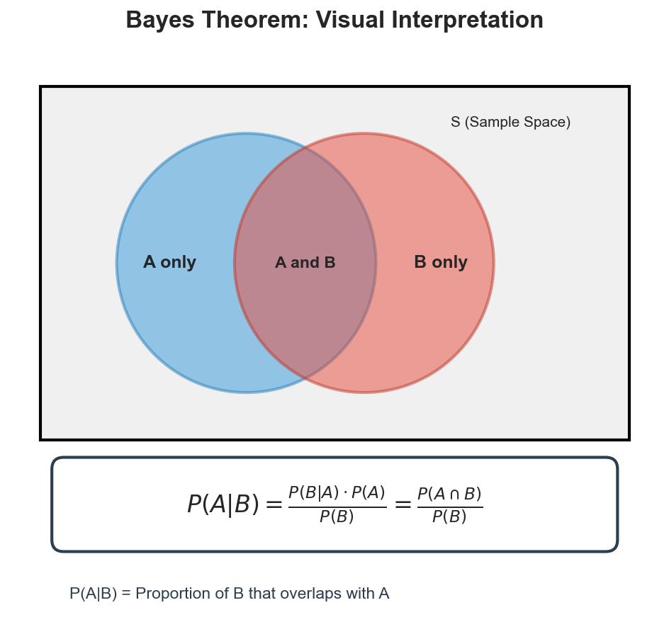
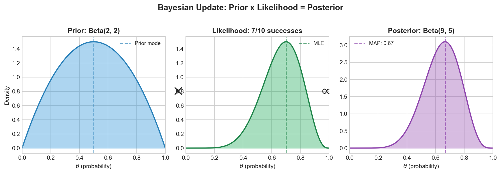
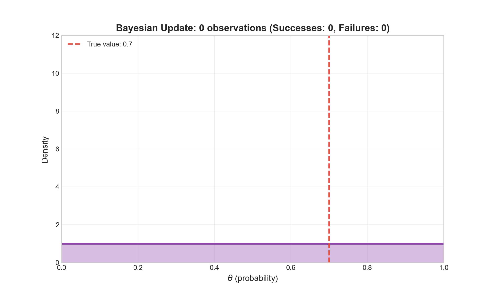
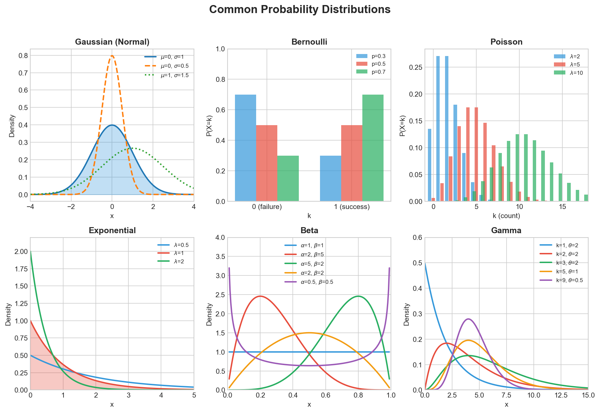
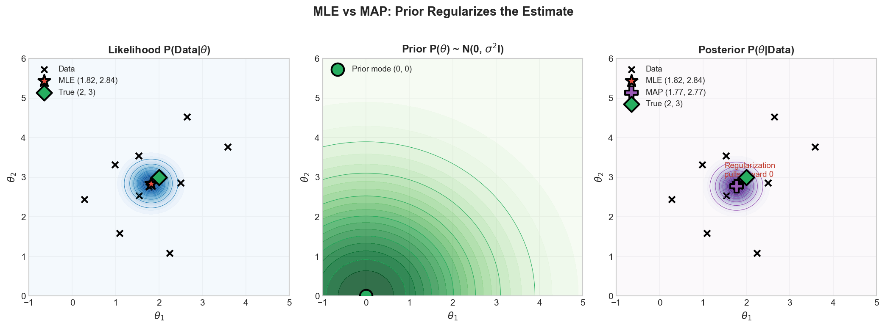
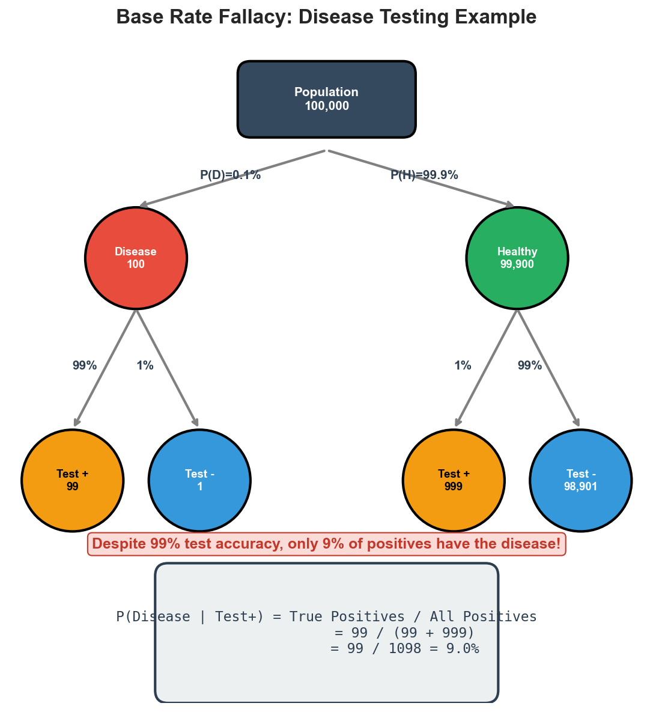

# Probability and Bayes Theorem Interview FAQ

> **Foundation of probabilistic machine learning**

Probability theory and Bayesian reasoning form the mathematical foundation of machine learning. Understanding these concepts is essential for ML interviews at top tech companies.

---

## Bayes Theorem

### Q1: What is Bayes Theorem and what is its formula?

**Answer:**

Bayes Theorem describes how to update the probability of a hypothesis based on new evidence.



| Term | Name | Description |
|------|------|-------------|
| P(A\|B) | Posterior | Probability of hypothesis A given evidence B |
| P(B\|A) | Likelihood | Probability of evidence B given hypothesis A is true |
| P(A) | Prior | Initial probability of hypothesis A before seeing evidence |
| P(B) | Evidence | Total probability of observing evidence B |

**Interview tip:** Derive from conditional probability: P(A|B) = P(A and B) / P(B).

---

### Q2: How is Bayes Theorem applied in machine learning?

**Answer:**

Bayes Theorem is foundational to many ML algorithms:

1. **Naive Bayes Classifier:** P(class|features) proportional to P(features|class) * P(class)
2. **Bayesian Neural Networks:** Learn distributions over weights for uncertainty quantification
3. **Probabilistic Graphical Models:** Bayesian networks encode conditional dependencies
4. **Bayesian Optimization:** Hyperparameter tuning with probabilistic surrogate models
5. **Gaussian Processes:** Non-parametric Bayesian regression with uncertainty estimates

**Example:** In spam classification, P(spam) is the prior belief about spam frequency, P(words|spam) captures word likelihoods in spam, and Bayes Theorem computes P(spam|words).

---

## Core Terminology

### Q3: What are prior, likelihood, posterior, and evidence?

**Answer:**

The Bayesian update process combines prior beliefs with observed data to produce updated beliefs.



| Term | Formula | Description |
|------|---------|-------------|
| Prior | P(theta) | Belief BEFORE seeing data |
| Likelihood | P(D\|theta) | How well parameters explain data |
| Posterior | P(theta\|D) | Updated belief AFTER seeing data |
| Evidence | P(D) | Normalizing constant (often intractable) |

**Key relationship:** `Posterior = (Likelihood x Prior) / Evidence`



**Interview insight:** Evidence intractability requires MCMC or variational inference.

---

### Q4: How do you choose an appropriate prior?

**Answer:**

| Prior Type | Description | When to Use |
|------------|-------------|-------------|
| Uninformative | Minimal assumptions (Uniform, Jeffreys) | Large data, objectivity needed |
| Conjugate | Same family as posterior (Beta-Bernoulli) | Computational convenience |
| Informative | Domain knowledge encoded | Limited data, strong expertise |
| Weakly Informative | Regularizes without dominating | Bayesian deep learning |
| Empirical Bayes | Estimated from data | Hierarchical models |

**Common conjugate pairs:**
- Gaussian likelihood + Gaussian prior = Gaussian posterior
- Bernoulli likelihood + Beta prior = Beta posterior
- Poisson likelihood + Gamma prior = Gamma posterior

---

## Probability Distributions

### Q5-Q8: Key Distributions for ML

**Answer:**



| Distribution | Domain | Mean | Variance | Key ML Use Case |
|--------------|--------|------|----------|-----------------|
| **Gaussian** | (-inf, inf) | mu | sigma^2 | Regression, VAEs, weight init |
| **Bernoulli** | {0, 1} | p | p(1-p) | Binary classification, dropout |
| **Poisson** | {0,1,2,...} | lambda | lambda | Count data, anomaly detection |
| **Exponential** | [0, inf) | 1/lambda | 1/lambda^2 | Time between events, survival |
| **Beta** | [0, 1] | a/(a+b) | complex | A/B testing, Bernoulli prior |
| **Gamma** | [0, inf) | k*theta | k*theta^2 | Poisson rate prior, positive values |

**Key Properties:**

- **Gaussian:** Central Limit Theorem, 68-95-99.7 rule, maximum entropy for given mean/variance
- **Bernoulli/Binomial:** Binary outcomes; Binomial = sum of n Bernoullis
- **Poisson:** Mean = Variance; use Negative Binomial if variance >> mean
- **Beta:** Conjugate prior for Bernoulli; flexible shape on [0,1]

---

## Estimation Methods

### Q9-Q11: MLE vs MAP Estimation

**Answer:**



| Method | Formula | Description |
|--------|---------|-------------|
| **MLE** | argmax P(D\|theta) | Maximize likelihood only |
| **MAP** | argmax P(D\|theta) * P(theta) | Maximize posterior (likelihood + prior) |
| **Bayesian** | P(theta\|D) | Compute full posterior distribution |

**MAP = Regularization:**

| Prior Distribution | Equivalent Regularization |
|-------------------|---------------------------|
| Gaussian N(0, sigma^2) | L2 (Ridge) |
| Laplace(0, b) | L1 (Lasso) |

**When to Use Each:**

| Factor | MLE | MAP | Full Bayesian |
|--------|-----|-----|---------------|
| Computation | Fast | Fast | Slow |
| Overfitting risk | High | Medium | Low |
| Uncertainty | None | None | Full |
| Best for | Large data, deep learning | Limited data, regularization | Critical decisions, small samples |

**Deep Learning Connection:** Cross-entropy loss = negative log-likelihood = MLE.

---

## Bayesian vs Frequentist Approaches

### Q12: What is the fundamental difference?

**Answer:**

**Frequentist:**
- Probability = long-run frequency
- Parameters are fixed constants
- Data is random
- Output: point estimates, confidence intervals, p-values

**Bayesian:**
- Probability = degree of belief
- Parameters are random variables
- Data is fixed
- Output: posterior distributions, credible intervals

**Key Difference - Confidence vs Credible Intervals:**
- Frequentist: "95% of intervals would contain true value"
- Bayesian: "95% probability true value is in interval" (often what people want)

---

### Q13: Advantages of each approach?

**Answer:**

**Bayesian Advantages:**
- Intuitive probability statements
- Incorporates prior knowledge
- Natural uncertainty quantification
- Works well with small samples
- Sequential learning (posterior becomes prior)

**Frequentist Advantages:**
- Objectivity (no subjective prior)
- Computational simplicity
- Well-established theory
- Regulatory acceptance

**Practical Guidance:**

| Situation | Approach |
|-----------|----------|
| Strong prior knowledge | Bayesian |
| Small samples | Bayesian |
| Need uncertainty | Bayesian |
| Regulatory requirements | Frequentist |
| Large scale ML | Frequentist (MLE with regularization) |

---

## Conditional Probability and Independence

### Q14: What is conditional probability?

**Answer:**

Probability of A given B has occurred:

```
P(A|B) = P(A and B) / P(B)
```

**Key Properties:**
- Chain Rule: P(A,B) = P(A|B) * P(B)
- Law of Total Probability: P(A) = Sum_i P(A|Bi) * P(Bi)

**Common Pitfall:** P(A|B) does NOT equal P(B|A)!

Example: P(wet ground|rain) is high, but P(rain|wet ground) is lower.

---

### Q15: Independence vs Conditional Independence?

**Answer:**

**Independence:** P(A,B) = P(A) * P(B) - knowing B tells nothing about A.

**Conditional Independence:** P(A,B|C) = P(A|C) * P(B|C) - given C, B adds no info about A.

**Critical:** Independence does NOT imply conditional independence, and vice versa.

**Example - Conditionally independent but NOT independent:**
- C = "raining", A = "person 1 has umbrella", B = "person 2 has umbrella"
- A and B are dependent (both more likely when raining)
- Given C, A and B become independent

**ML Applications:** Naive Bayes assumes conditional independence given class. Bayesian networks encode conditional independence structure.

---

### Q16: Explain the Naive Bayes independence assumption.

**Answer:**

**Assumption:** Features conditionally independent given class:

```
P(x1,...,xn|y) = Product_i P(xi|y)
```

**Why "Naive":** Almost never true, yet often works well.

**Classification Rule:**
```
y_pred = argmax_y P(y) * Product_i P(xi|y)
```

**Types:**

| Type | Features | Use Case |
|------|----------|----------|
| Gaussian NB | Continuous | General |
| Multinomial NB | Counts | Text (word counts) |
| Bernoulli NB | Binary | Text (word presence) |

**Why it works:** Classification needs correct ranking, not calibrated probabilities. Errors may cancel out.

**Limitation:** Probabilities are miscalibrated.

---

## Classic Interview Problems

### Q17: The Disease Testing Problem (Base Rate Fallacy)

**Answer:**

**Problem:** Test is 99% sensitive/specific. Disease prevalence: 0.1%. If positive, what's P(disease)?



**ML Implications:** Same issue occurs with imbalanced classification (fraud, anomalies). Always consider both precision and recall; model calibration is critical with class imbalance.

---

### Q18: The Monty Hall Problem

**Answer:**

**Setup:** 3 doors, 1 car, 2 goats. You pick door 1. Host opens door 3 (goat). Should you switch?

**Answer:** YES! Switching gives 2/3 chance, staying gives 1/3.

**Intuition:**
- Initial pick: 1/3 chance of car
- Other doors combined: 2/3 chance
- Host reveals goat, concentrating 2/3 on remaining door

**Formal (Bayes):**
```
P(C1|H3) = 1/3    (staying)
P(C2|H3) = 2/3    (switching)
```

**Key insight:** Host's action is NOT random - he cannot open the car door. This non-random information transfer is why switching helps.

**Common misconception:** "It's 50-50 after door opens" - WRONG because opening was not random.

---

### Q19: Two Children Problem

**Answer:**

**Problem:** A couple has two children. Given at least one is a boy, P(both boys)?

**Solution:** Sample space: BB, BG, GB, GG. Eliminate GG.
- Remaining: BB, BG, GB
- P(BB | at least one boy) = 1/3

**Subtle variant:** If we meet one specific child and it's a boy:
- P(both boys | specific child is boy) = 1/2

**Key insight:** Exact conditioning event matters. How information was obtained affects the answer.

---

## Probability in Classification

### Q20: What is probability calibration?

**Answer:**

**Definition:** A model is calibrated if P(positive)=0.8 means 80% of such predictions are actually positive.

**Why it matters:**
- Decision thresholds require accurate probabilities
- Expected value calculations need calibration
- Ensemble methods need calibrated inputs

**Common issues:**

| Model | Problem |
|-------|---------|
| Neural Networks | Overconfident |
| Random Forest | Pushed toward 0.5 |
| Naive Bayes | Extreme probabilities |

**Calibration methods:**
- Platt Scaling: sigmoid mapping (good for SVMs)
- Isotonic Regression: non-parametric (needs more data)
- Temperature Scaling: divide logits by T (neural networks)

---

### Q21: Cross-entropy loss and MLE connection?

**Answer:**

Cross-entropy IS negative log-likelihood.

**Binary case:**
```
CE = -[y*log(p) + (1-y)*log(1-p)]
```
This equals -log P(y|p) under Bernoulli distribution.

**Multi-class:** CE = -log(p_true_class) = NLL under Categorical.

**Implications:**
- Cross-entropy is principled (MLE derivation)
- Optimizes actual probability estimates
- MLE framework suggests calibration, but deep networks often miscalibrate

**Connection to KL Divergence:**
```
CE(p,q) = H(p) + KL(p||q)
```
Minimizing CE = minimizing KL divergence to true distribution.

---

## Quick Reference

### Key Formulas

```
Bayes:           P(A|B) = P(B|A) * P(A) / P(B)
Total Prob:      P(A) = Sum_i P(A|Bi) * P(Bi)
Chain Rule:      P(A,B,C) = P(A) * P(B|A) * P(C|A,B)
Independence:    P(A,B) = P(A) * P(B)
MLE:             argmax_theta P(D|theta)
MAP:             argmax_theta P(D|theta) * P(theta)
```

### Interview Checklist

1. Derive Bayes Theorem from conditional probability (see Venn diagram above)
2. Solve disease testing problem step-by-step (see tree diagram above)
3. Explain Monty Hall intuitively and formally
4. Compare MLE vs MAP with regularization connection (see contour plot above)
5. Define calibration and improvement methods
6. Distinguish independence types with examples
7. Know common distributions (see gallery above)
8. Connect cross-entropy to MLE for classification

---

*Last updated: January 2026*
