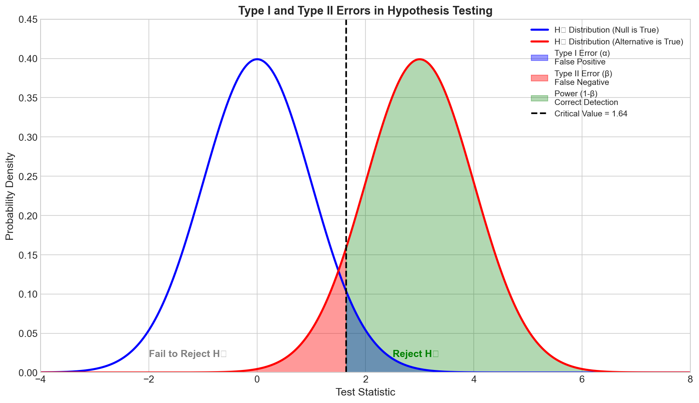
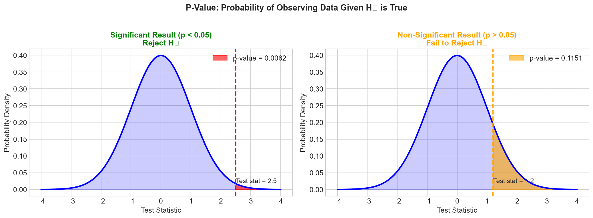
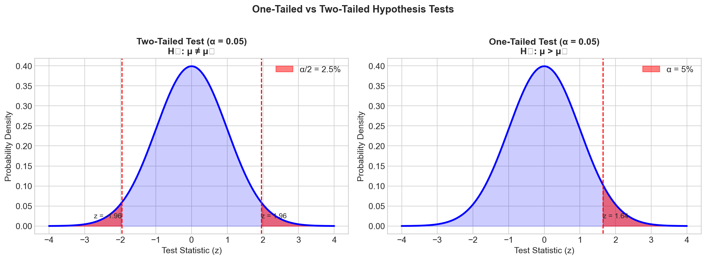
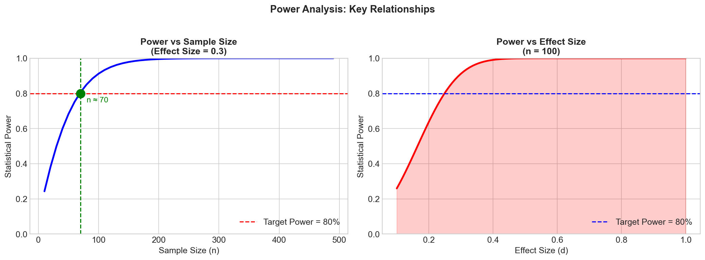
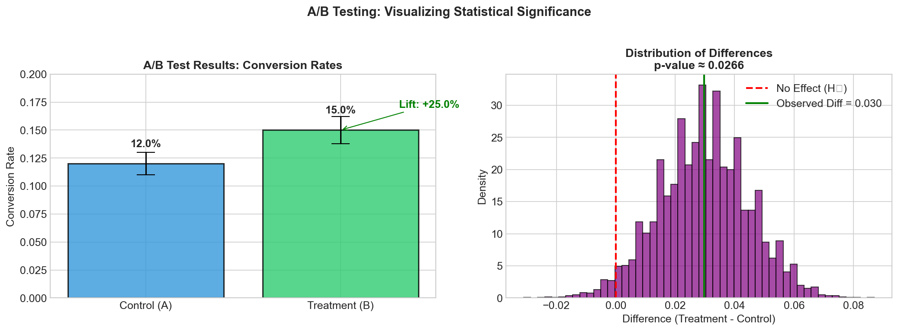
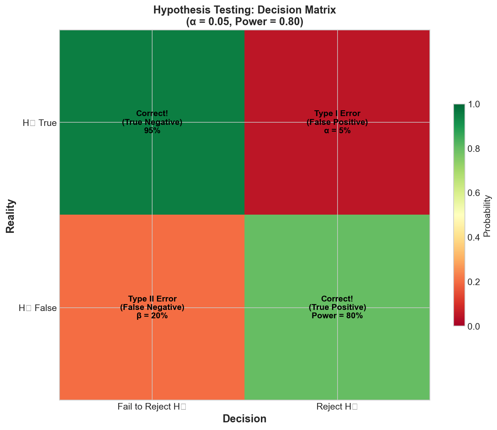

# Hypothesis Testing & A/B Testing - Interview FAQ

## Overview

Hypothesis testing is a fundamental statistical framework used to make data-driven decisions. In the context of machine learning and tech industry interviews, understanding hypothesis testing is crucial for designing experiments, validating model improvements, and making product decisions through A/B testing.

### Core Concepts

**Null Hypothesis (H0):** The default assumption that there is no effect, no difference, or no relationship between variables. It represents the status quo that we attempt to reject with evidence.

**Alternative Hypothesis (H1 or Ha):** The claim we want to provide evidence for. It represents what we believe to be true if the null hypothesis is false.

**P-Value:** The probability of observing results at least as extreme as the observed results, assuming the null hypothesis is true. A small p-value suggests that the observed data is unlikely under the null hypothesis.

**Significance Level (alpha):** The threshold (commonly 0.05) below which we reject the null hypothesis. It represents our tolerance for Type I errors.

---

## Common Interview Questions

### Question 1: What is the null hypothesis and why is it important?

**Sample Answer:**

The null hypothesis (H0) is the default statement that assumes no effect, no difference, or no relationship exists between the variables being studied. It serves as the baseline assumption that we test against.

**Why it matters in practice:**

- **A/B Testing Example:** If testing whether a new checkout button color increases conversions, the null hypothesis states: "The new button color has no effect on conversion rate compared to the original."

- **Model Comparison:** When comparing two ML models, the null hypothesis might be: "There is no significant difference in accuracy between Model A and Model B."

The null hypothesis is important because:

1. **Provides a clear decision framework** - We either reject or fail to reject H0 based on evidence
2. **Controls false positive rate** - By setting a significance level, we limit how often we incorrectly claim an effect exists
3. **Forces rigorous thinking** - We must provide sufficient evidence to overturn the default assumption

**Key Interview Tip:** Always frame your null hypothesis as "no effect" or "no difference" - this is the conservative position that requires evidence to overturn.

---

### Question 2: What is a p-value and how do you interpret it?

**Sample Answer:**

A p-value is the probability of observing data as extreme as (or more extreme than) what was actually observed, assuming the null hypothesis is true.

**Correct Interpretation:**

- P-value = 0.03 means: "If there truly is no effect, there is a 3% chance of seeing results this extreme by random chance alone."

**Common Misinterpretations to Avoid:**

- A p-value is NOT the probability that the null hypothesis is true
- A p-value is NOT the probability that the results occurred by chance
- A p-value does NOT measure the size or importance of an effect

**Practical Decision Framework:**

| P-Value Range | Interpretation | Action |
|---------------|----------------|--------|
| p < 0.01 | Strong evidence against H0 | Reject H0 with high confidence |
| 0.01 <= p < 0.05 | Moderate evidence against H0 | Reject H0 (at alpha = 0.05) |
| 0.05 <= p < 0.10 | Weak evidence against H0 | Borderline; consider context |
| p >= 0.10 | Insufficient evidence | Fail to reject H0 |

**A/B Test Example:** If testing a new recommendation algorithm and obtaining p = 0.02 for the difference in click-through rate, we have strong evidence that the new algorithm performs differently from the control.

---

### Question 3: What are Type I and Type II errors? Give examples.

**Sample Answer:**

**Type I Error (False Positive):**
- Rejecting the null hypothesis when it is actually true
- Probability = alpha (significance level, typically 0.05)
- Example: Concluding a new feature increases engagement when it actually has no effect, leading to unnecessary development resources being allocated

**Type II Error (False Negative):**
- Failing to reject the null hypothesis when it is actually false
- Probability = beta (related to statistical power)
- Example: Failing to detect that a new search algorithm genuinely improves results, causing the company to miss a valuable improvement

**Real-World A/B Testing Scenario:**

| Error Type | Scenario | Business Impact |
|------------|----------|-----------------|
| Type I | Launching a feature that appeared to increase revenue but actually does not | Wasted resources, potential negative user experience |
| Type II | Not launching a feature that would have increased revenue | Missed opportunity, competitive disadvantage |

**Trade-off Consideration:**

Reducing Type I error rate (making alpha smaller) increases Type II error rate (and vice versa). The optimal balance depends on the costs of each error in your specific context.

**Interview Insight:** When asked about this trade-off, mention that in medical testing, we often prioritize reducing Type II errors (we do not want to miss a disease), while in A/B testing for product features, we often prioritize reducing Type I errors (we do not want to ship ineffective changes).

---

### Question 4: What is statistical power and why does it matter?

**Sample Answer:**

Statistical power is the probability of correctly rejecting the null hypothesis when it is false. In other words, it is the probability of detecting a true effect when one exists.

**Formula:** Power = 1 - beta (where beta is the Type II error rate)

**Standard Threshold:** Power >= 0.80 (80%) is the conventional minimum acceptable level

**Factors Affecting Power:**

1. **Sample Size (n):** Larger samples increase power
2. **Effect Size:** Larger true effects are easier to detect
3. **Significance Level (alpha):** Higher alpha increases power (but also Type I error)
4. **Variance:** Lower variance in data increases power

**Why Power Matters in A/B Testing:**

- **Underpowered tests** may fail to detect real improvements, leading to abandoning effective features
- **Overpowered tests** waste resources by running experiments longer than necessary

**Practical Example:**

If an A/B test has 80% power to detect a 5% improvement in conversion rate, this means:
- If the true improvement is 5% or larger, we have an 80% chance of detecting it
- We have a 20% chance of missing this real effect (Type II error)

**Interview Tip:** Always ask about effect size and power when discussing experiment design. A common mistake is running underpowered experiments and concluding "no effect" when the test simply lacked the ability to detect smaller effects.

---

### Question 5: What is the difference between one-tailed and two-tailed tests?

**Sample Answer:**

**Two-Tailed Test:**
- Tests for any difference (positive or negative)
- H0: Treatment effect = 0
- H1: Treatment effect is not equal to 0
- Critical region split between both tails
- More conservative; harder to achieve significance

**One-Tailed Test:**
- Tests for a difference in a specific direction
- H0: Treatment effect <= 0 (or >= 0)
- H1: Treatment effect > 0 (or < 0)
- All critical region in one tail
- Less conservative; easier to achieve significance in predicted direction

**When to Use Each:**

| Test Type | Use Case | Example |
|-----------|----------|---------|
| Two-Tailed | Effect could go either direction | Testing if a new UI affects engagement (could help or hurt) |
| One-Tailed | Strong prior belief in direction | Testing if a bug fix reduces error rate (it will not increase errors) |

**A/B Testing Recommendation:**

In most product A/B tests, use two-tailed tests because:
1. Unexpected negative effects are valuable to detect
2. It is more conservative and defensible
3. Stakeholders may question one-tailed test choices

**Interview Nuance:** If you use a one-tailed test, you must specify the direction before seeing the data. Choosing the direction after seeing results is a form of p-hacking.

---

### Question 6: How do you design an A/B test from start to finish?

**Sample Answer:**

**Step 1: Define Objectives and Metrics**
- Primary metric: The main KPI you are trying to improve (e.g., conversion rate)
- Secondary metrics: Other important metrics to monitor (e.g., revenue, engagement)
- Guardrail metrics: Metrics that should not degrade (e.g., page load time)

**Step 2: Formulate Hypotheses**
- H0: New variant has no effect on primary metric
- H1: New variant improves primary metric
- Define the minimum detectable effect (MDE) that is practically significant

**Step 3: Calculate Sample Size**
- Inputs needed: baseline conversion rate, MDE, alpha (0.05), power (0.80)
- Use power analysis to determine required sample size per variant
- Estimate test duration based on traffic

**Step 4: Randomization and Assignment**
- Randomly assign users to control or treatment groups
- Ensure proper randomization unit (user-level, session-level, etc.)
- Consider stratification for important segments

**Step 5: Run the Experiment**
- Do NOT peek at results repeatedly (leads to inflated false positive rate)
- Run for the pre-determined duration
- Monitor for technical issues, not statistical significance

**Step 6: Analyze Results**
- Calculate test statistic and p-value
- Check for practical significance, not just statistical significance
- Segment analysis: Check if effect varies across user groups
- Verify no degradation in guardrail metrics

**Step 7: Make Decision and Document**
- Ship, iterate, or abandon based on results
- Document learnings for future reference

**Key Interview Points:**
- Emphasize pre-registration of hypotheses and sample size
- Mention novelty effects and network effects as potential confounders
- Discuss the importance of running experiments for full weeks to capture day-of-week effects

---

### Question 7: What is the multiple testing problem and how do you address it?

**Sample Answer:**

**The Problem:**

When performing multiple statistical tests, the probability of finding at least one false positive increases substantially.

- 1 test at alpha = 0.05: 5% chance of false positive
- 10 tests at alpha = 0.05: 40% chance of at least one false positive
- 20 tests at alpha = 0.05: 64% chance of at least one false positive

**Real-World Scenarios Where This Occurs:**

1. Testing multiple metrics in an A/B test
2. Comparing a treatment to multiple control groups
3. Testing the same hypothesis across multiple segments
4. Running many A/B tests company-wide

**Solutions:**

| Method | Description | When to Use |
|--------|-------------|-------------|
| Bonferroni Correction | Divide alpha by number of tests (alpha/n) | Conservative; few tests |
| Holm-Bonferroni | Sequential correction, less conservative | Moderate number of tests |
| Benjamini-Hochberg (FDR) | Controls false discovery rate | Many tests; exploratory analysis |
| Pre-registration | Specify primary metric in advance | Always recommended |

**Practical A/B Testing Approach:**

1. Designate ONE primary metric before the experiment
2. Use Bonferroni correction for a small number of secondary metrics
3. Consider FDR control for exploratory segment analysis
4. Clearly distinguish confirmatory vs. exploratory analyses in reports

**Interview Example:**

"If I am running an A/B test with 1 primary metric and 4 secondary metrics, I would:
- Apply alpha = 0.05 to the primary metric
- Apply Bonferroni correction (alpha = 0.05/4 = 0.0125) to secondary metrics
- Report any exploratory findings with appropriate caveats"

---

### Question 8: How do you determine the right sample size for an A/B test?

**Sample Answer:**

**Key Inputs for Sample Size Calculation:**

1. **Baseline conversion rate (p1):** Current performance of control
2. **Minimum detectable effect (MDE):** Smallest improvement worth detecting
3. **Significance level (alpha):** Typically 0.05
4. **Statistical power (1-beta):** Typically 0.80

**Simplified Formula for Proportions:**

n = 2 * [(Z_alpha/2 + Z_beta)^2 * p * (1-p)] / (MDE)^2

Where:
- Z_alpha/2 = 1.96 for alpha = 0.05 (two-tailed)
- Z_beta = 0.84 for power = 0.80
- p = pooled proportion estimate

**Practical Considerations:**

| Factor | Effect on Sample Size |
|--------|----------------------|
| Smaller MDE | Requires larger n |
| Higher power | Requires larger n |
| Lower alpha | Requires larger n |
| Higher variance | Requires larger n |

**Common Pitfalls:**

1. **MDE too small:** Results in impractically long experiments
2. **MDE too large:** May miss meaningful improvements
3. **Ignoring multiple comparisons:** Underestimates required n
4. **Not accounting for dropout:** Plan for some attrition

**Interview Answer Framework:**

"To determine sample size, I would:
1. Discuss with stakeholders what effect size is practically meaningful
2. Check historical data for baseline rate and variance
3. Use power analysis with alpha=0.05 and power=0.80
4. Add a buffer for potential issues (typically 10-20%)
5. Calculate expected test duration based on traffic"

---

### Question 9: What is the difference between statistical significance and practical significance?

**Sample Answer:**

**Statistical Significance:**
- Indicates that an observed effect is unlikely due to chance alone
- Determined by p-value relative to alpha threshold
- Can be achieved with any effect size given sufficient sample size

**Practical Significance:**
- Indicates that an effect is large enough to matter in the real world
- Determined by business context and cost-benefit analysis
- Independent of sample size

**The Danger of Focusing Only on Statistical Significance:**

With large sample sizes (common at big tech companies), even tiny, meaningless differences become statistically significant.

**Example:**
- A/B test shows new checkout flow increases conversion from 3.00% to 3.01%
- With 10 million users, this is statistically significant (p < 0.001)
- But is a 0.01% improvement worth the development cost?

**Best Practice: Consider Both**

| Scenario | Statistically Significant | Practically Significant | Decision |
|----------|--------------------------|------------------------|----------|
| A | Yes | Yes | Ship the change |
| B | Yes | No | Do not ship; effect too small |
| C | No | Unknown | Increase sample size or accept uncertainty |
| D | No | No | Do not ship |

**Interview Tip:** Always discuss effect size and confidence intervals, not just p-values. A 95% CI of [0.1%, 0.3%] improvement tells you much more than "p < 0.05."

---

### Question 10: How do you handle situations where an A/B test is inconclusive?

**Sample Answer:**

**Understanding "Inconclusive":**

An inconclusive test typically means p-value > alpha, so we fail to reject the null hypothesis. This does NOT mean the null is true; it means we lack sufficient evidence.

**Possible Reasons for Inconclusive Results:**

1. **Underpowered test:** Sample size too small to detect the true effect
2. **No true effect:** The treatment genuinely has no impact
3. **High variance:** Noisy data obscures the signal
4. **Wrong metric:** Measuring something unrelated to the change

**Decision Framework:**

| Situation | Evidence | Recommendation |
|-----------|----------|----------------|
| Power was low | CI includes meaningful positive effects | Extend test or increase traffic |
| Power was adequate | CI is narrow around zero | Accept null; treatment has no meaningful effect |
| High variance | Wide CI | Investigate variance sources; consider metric refinement |
| Stakeholder pressure | "We need to ship something" | Hold firm; do not lower standards |

**Actionable Next Steps:**

1. **Review power analysis:** Was the test adequately powered?
2. **Examine confidence intervals:** What effects can we rule out?
3. **Segment analysis:** Is there an effect for specific user groups?
4. **Qualitative research:** Conduct user interviews to understand why
5. **Iterate on treatment:** Make a bolder change and retest

**Interview Response Example:**

"If a test is inconclusive, I would first verify the test was properly powered. If it was, the narrow confidence interval tells us the true effect is likely small. If it was underpowered, I would consider extending the test. I would also examine segments to see if specific user groups responded differently, which could inform a targeted rollout or further iteration."

---

### Question 11: What is Simpson's Paradox and how can it affect A/B tests?

**Sample Answer:**

**Definition:**

Simpson's Paradox occurs when a trend that appears in aggregated data reverses or disappears when the data is split into subgroups.

**A/B Testing Example:**

| Device | Control CTR | Treatment CTR | Winner |
|--------|-------------|---------------|--------|
| Mobile | 2.0% | 2.5% | Treatment |
| Desktop | 4.0% | 4.5% | Treatment |
| **Overall** | **3.5%** | **3.0%** | **Control** |

How is this possible? If the treatment group happened to have more mobile users (who have lower CTR in general), the overall average can flip.

**Why This Happens in A/B Tests:**

1. **Imbalanced randomization:** Uneven distribution of important covariates
2. **Different segment sizes:** Treatment and control have different composition
3. **Time-varying effects:** Traffic patterns change during the test

**How to Prevent and Detect:**

| Strategy | Implementation |
|----------|----------------|
| Stratified randomization | Balance key segments across variants |
| Covariate checks | Verify balance on important dimensions |
| Segment analysis | Always check major segments separately |
| Randomization check | Run AA tests to verify randomization |

**Interview Tip:** When discussing A/B test results, always mention that you would check key segments to ensure the aggregate result is not masking opposite effects in subgroups.

---

### Question 12: What are common pitfalls in A/B testing?

**Sample Answer:**

**1. Peeking at Results (Repeated Significance Testing)**
- Problem: Checking p-values repeatedly inflates false positive rate
- Solution: Pre-specify test duration or use sequential testing methods

**2. Stopping Early**
- Problem: Stopping when you see significance leads to biased estimates
- Solution: Run for full planned duration unless using valid early stopping rules

**3. Underpowered Tests**
- Problem: Cannot detect real effects, leading to false negatives
- Solution: Conduct power analysis before starting

**4. Multiple Comparisons Without Correction**
- Problem: Inflated false positive rate across multiple metrics
- Solution: Apply Bonferroni or FDR corrections

**5. Ignoring Novelty Effects**
- Problem: Users react differently to any change initially
- Solution: Run tests long enough for novelty to wear off

**6. Network Effects**
- Problem: User behavior depends on other users' treatment assignment
- Solution: Use cluster randomization or model interference

**7. Survivorship Bias**
- Problem: Analyzing only users who completed the experiment
- Solution: Intent-to-treat analysis; include all randomized users

**8. HARKing (Hypothesizing After Results are Known)**
- Problem: Creating hypotheses to explain observed patterns
- Solution: Pre-register hypotheses; clearly label exploratory analysis

**9. Selection Bias in Assignment**
- Problem: Non-random assignment to treatment groups
- Solution: Proper randomization; check for balance

**10. External Validity Issues**
- Problem: Test conditions do not reflect real deployment
- Solution: Consider seasonality, special events, and gradual rollout

---

## Visual Concepts

The following visualizations illustrate key hypothesis testing concepts:

### Type I and Type II Errors

This diagram shows the relationship between the null and alternative hypothesis distributions, highlighting the regions corresponding to Type I errors (false positives) and Type II errors (false negatives).

### P-Value Visualization

The p-value represents the probability of observing data as extreme as what was observed, assuming the null hypothesis is true. The shaded region illustrates this probability.

### One-Tailed vs Two-Tailed Tests

This comparison shows how critical regions differ between one-tailed and two-tailed tests, and why two-tailed tests are more conservative.

### Power Analysis

Statistical power increases with sample size, effect size, and significance level. This visualization shows how these factors interact.

### A/B Testing Example

A practical example of A/B test results, showing the distribution of outcomes for control and treatment groups.

### Decision Matrix

This matrix summarizes the four possible outcomes when making a decision about the null hypothesis, including correct decisions and both types of errors.

---

## Key Formulas and Thresholds

### Standard Thresholds

| Parameter | Standard Value | Description |
|-----------|---------------|-------------|
| Alpha (significance level) | 0.05 | Maximum acceptable Type I error rate |
| Beta (Type II error rate) | 0.20 | Maximum acceptable Type II error rate |
| Power | 0.80 | Minimum acceptable power (1 - beta) |

### Important Formulas

**Z-score for sample proportion:**

Z = (p_observed - p_null) / sqrt(p_null * (1 - p_null) / n)

**Confidence interval for proportion:**

CI = p_hat +/- Z_alpha/2 * sqrt(p_hat * (1 - p_hat) / n)

**Sample size for comparing two proportions:**

n = 2 * [(Z_alpha/2 + Z_beta)^2 * p_bar * (1 - p_bar)] / delta^2

Where:
- p_bar = (p1 + p2) / 2 (pooled proportion)
- delta = |p1 - p2| (effect size)

**Chi-squared test statistic:**

chi^2 = sum[(O_i - E_i)^2 / E_i]

Where O_i = observed frequency, E_i = expected frequency

---

## Quick Reference Table

| Concept | Definition | Key Points |
|---------|------------|------------|
| Null Hypothesis (H0) | Default assumption of no effect | Always assume no effect until proven otherwise |
| Alternative Hypothesis (H1) | What we want to prove | Must be specified before collecting data |
| P-value | P(data or more extreme given H0 is true) | Small p-value = evidence against H0 |
| Alpha | Significance threshold | Typically 0.05; controls Type I error |
| Type I Error | Rejecting true H0 (false positive) | Probability = alpha |
| Type II Error | Failing to reject false H0 (false negative) | Probability = beta |
| Power | Probability of detecting true effect | Power = 1 - beta; aim for >= 0.80 |
| One-tailed test | Tests effect in one direction | Use only with strong prior justification |
| Two-tailed test | Tests effect in either direction | Default choice for most A/B tests |
| MDE | Minimum Detectable Effect | Smallest effect size you want to detect |
| Confidence Interval | Range of plausible effect sizes | More informative than p-value alone |
| Bonferroni Correction | Divide alpha by number of tests | Controls family-wise error rate |
| FDR | False Discovery Rate | Less conservative than Bonferroni |
| Effect Size | Magnitude of the difference | Distinguish from statistical significance |

---

## Summary: Interview Success Tips

1. **Always define hypotheses clearly** before discussing test design

2. **Know the difference** between statistical and practical significance

3. **Emphasize sample size planning** and power analysis

4. **Discuss trade-offs** between Type I and Type II errors in context

5. **Mention guardrail metrics** when designing A/B tests

6. **Address multiple testing** when analyzing many metrics or segments

7. **Use confidence intervals** to communicate uncertainty, not just p-values

8. **Consider practical constraints** like novelty effects, network effects, and seasonality

9. **Pre-register** your primary hypothesis and analysis plan

10. **Document and share learnings** even from failed experiments
