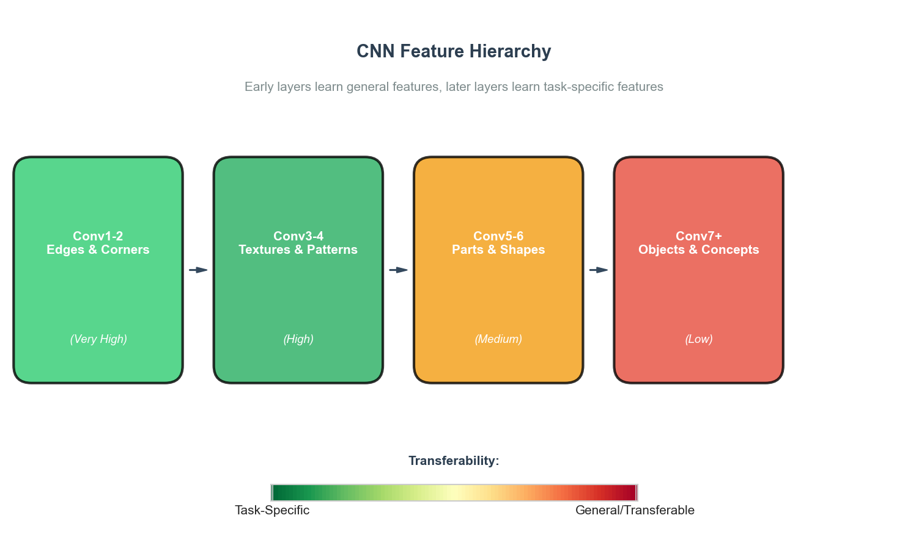
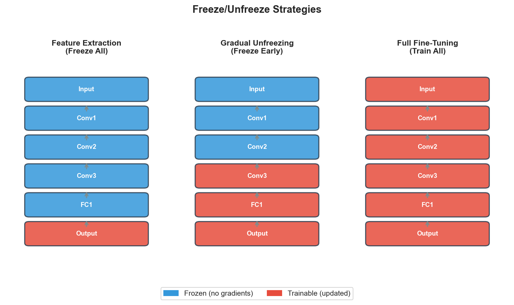
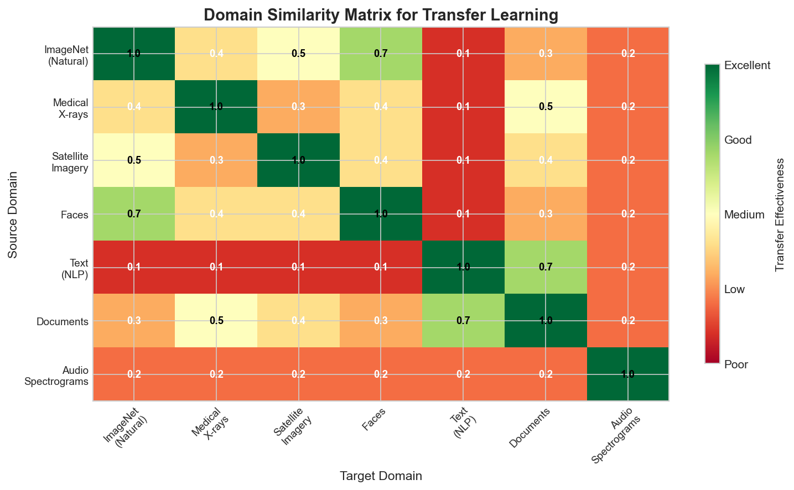
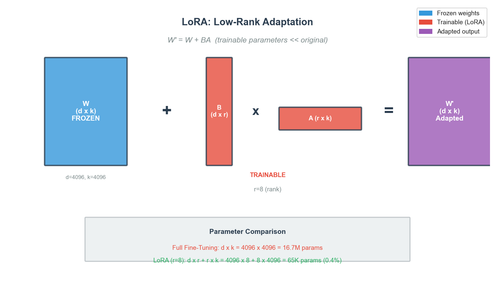
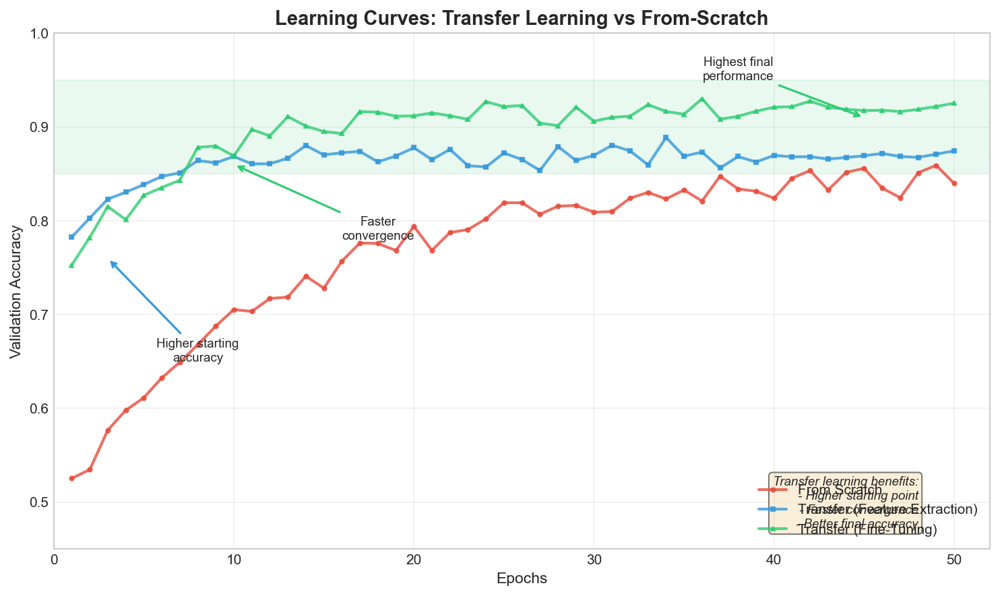

# Transfer Learning Interview FAQ

> **Leverage pre-trained models for new tasks**

## Overview

**Transfer learning** reuses a model trained on one task as the starting point for a different but related task, dramatically reducing training time, data requirements, and computational costs.



The key insight shown above: early layers learn general, transferable features while later layers become increasingly task-specific.

---

## Interview Questions and Answers

### Q1: What is transfer learning and when should you use it?

**Answer:**

Transfer learning uses a model trained on one task (the **source task**) as the starting point for a different task (the **target task**).

**When to use:**
- **Limited labeled data** - Small target dataset but related task has abundant data
- **Computational constraints** - Training from scratch is too expensive
- **Similar domains** - Source and target share underlying patterns
- **State-of-the-art performance** - Pre-trained models often outperform from-scratch training

**When NOT to use:**
- **Very different domains** - Features do not transfer well
- **Abundant target data** - Enough data to train from scratch
- **Negative transfer risk** - Source domain hurts target performance

---

### Q2: What is the difference between feature extraction and fine-tuning?

**Answer:**



| Aspect | Feature Extraction | Fine-Tuning |
|--------|-------------------|-------------|
| Layers trained | Classifier head only | Some/all layers |
| Training time | Fast | Slower |
| Data required | Very little | More |
| Overfitting risk | Lower | Higher |
| Performance ceiling | Lower | Higher |

**Workflow:** Start with feature extraction baseline, then progressively fine-tune if needed.

---

### Q3: Which layers should you freeze and why?

**Answer:**

Early layers learn general features (most transferable), later layers learn task-specific features (least transferable). Strategy depends on data size and domain similarity:

| Scenario | Data | Domain Similarity | Strategy |
|----------|------|-------------------|----------|
| A | Small | High | Freeze all, train classifier only |
| B | Small | Low | Freeze early, fine-tune later layers |
| C | Large | High | Fine-tune all with small LR |
| D | Large | Low | Fine-tune all, possibly larger LR |

```python
# Freeze all layers, then selectively unfreeze
for param in model.parameters():
    param.requires_grad = False
for param in model.layer4.parameters():  # Unfreeze last block
    param.requires_grad = True
```

---

### Q4: What is domain adaptation?

**Answer:**

**Domain adaptation** addresses **distribution shift** between source and target domains.



**Types of domain shift:** Covariate (input distributions differ), Prior (label distributions differ), Concept (input-output relationships differ)

**Key techniques:**
1. **Feature alignment** - MMD, DANN, CORAL
2. **Instance weighting** - Weight samples by similarity to target
3. **Domain adversarial training** - Feature extractor fools domain discriminator
4. **Self-training** - Pseudo-labels from target predictions

**Examples:** Sim-to-real robotics, cross-camera adaptation, cross-lingual NLP.

---

### Q5: What are the major pre-trained models?

**Answer:**

**Computer Vision:**

| Model | Parameters | Best For |
|-------|------------|----------|
| ResNet-50 | 25M | Reliable baseline |
| EfficientNet | 5-66M | Accuracy/efficiency tradeoff |
| ViT | 86-632M | Large datasets |
| CLIP | 400M | Zero-shot classification |

**NLP:**

| Model | Parameters | Best For |
|-------|------------|----------|
| BERT | 110-340M | Classification, NER, QA |
| GPT-2/3 | 117M-175B | Text generation |
| T5 | 60M-11B | Text-to-text tasks |
| LLaMA | 7B-70B | Open-source NLP |

**Selection criteria:** Task type, resource constraints, data availability, latency requirements, domain match.

---

### Q6: What are effective fine-tuning strategies?

**Answer:**

**Learning Rate:**
- Use 10-100x smaller LR than from-scratch (1e-5 to 1e-4)
- **Discriminative LR**: Earlier layers get smaller LR, later layers get larger
- **Warmup**: Start very small, gradually increase (5-10% of training)

**Unfreezing schedules:**
```
Gradual: Epoch 1-2 head only -> Epoch 3-4 last block -> progressively unfreeze
All-at-once: Fine-tune all from start with very low LR + discriminative rates
```

**Regularization:**
- Dropout in new layers
- Lower weight decay than from-scratch
- Early stopping on validation loss
- Data augmentation (essential for small datasets)

**Optimizers:** AdamW for transformers, SGD with momentum for CNNs.

---

### Q7: When does transfer learning fail (negative transfer)?

**Answer:**

**Negative transfer** occurs when pre-trained model hurts performance vs. from-scratch.

**Causes:**
- Domain mismatch (ImageNet to medical X-rays)
- Task mismatch (classification to dense prediction)
- Label space mismatch (fine-grained to coarse)
- Data quality differences

**Detection:**
- Compare against from-scratch baseline
- Monitor if loss decreases but accuracy stalls
- Visualize features (t-SNE)

**Mitigation:**
- Choose better source model closer to target domain
- Partial transfer (only early layers)
- Regularize toward pre-trained weights (L2-SP, EWC)
- Domain-adaptive pre-training

---

### Q8: What is multi-task learning?

**Answer:**

**Multi-task learning (MTL)** trains one model on multiple related tasks simultaneously, allowing shared representations.

| Aspect | Transfer Learning | Multi-Task Learning |
|--------|------------------|---------------------|
| Training | Sequential | Simultaneous |
| Goal | Improve target | Improve all tasks |
| Knowledge flow | One direction | Bidirectional |

**Architectures:**
- **Hard sharing**: Shared hidden layers, task-specific heads
- **Soft sharing**: Separate models with similarity regularization

**Benefits:** Implicit data augmentation, regularization, efficiency.

**Challenges:** Task balancing, negative transfer between tasks, conflicting gradients.

**Examples:** BERT (MLM + NSP), T5 (unified text-to-text), multi-task CNNs.

---

### Q9: Explain zero-shot and few-shot learning.

**Answer:**

**Zero-Shot Learning:**
- Classify samples from classes never seen during training
- Requires side information (attributes, text descriptions, embeddings)
- Example: CLIP matches images to text descriptions like "a photo of a zebra"

**Few-Shot Learning:**
- Learn new classes from K examples (typically K=1,5,10)
- K-shot N-way: K examples per class, N classes

**Approaches:**
1. **Metric learning** - Prototypical/Siamese networks learn similarity
2. **Meta-learning** - MAML learns to adapt quickly
3. **Large model transfer** - In-context learning (GPT-3)

| Aspect | Zero-Shot | Few-Shot |
|--------|-----------|----------|
| Training examples | 0 | 1-10 per class |
| Side info required | Yes | No |
| Accuracy | Lower | Higher |

---

### Q10: What is LoRA and parameter-efficient fine-tuning?

**Answer:**

**PEFT** updates only a small subset of parameters, keeping most frozen. Essential for large models where full fine-tuning is prohibitively expensive.



**LoRA** decomposes weight updates into low-rank matrices, reducing trainable parameters by 10,000x with no inference latency (merge after training).

**PEFT Methods Comparison:**

| Method | Parameters Added |
|--------|------------------|
| LoRA | 0.1-1% |
| QLoRA | Even fewer (4-bit base) |
| Adapters | ~3% |
| Prefix Tuning | ~0.1% |
| Prompt Tuning | <0.01% |

```python
from peft import LoraConfig, get_peft_model

lora_config = LoraConfig(r=8, lora_alpha=32, target_modules=["q_proj", "v_proj"])
model = get_peft_model(base_model, lora_config)
```

---

### Q11: How do you handle catastrophic forgetting?

**Answer:**

**Catastrophic forgetting:** Model forgets source knowledge when learning target task.

**Mitigation strategies:**

1. **Regularization-based:**
   - **EWC**: Penalize changing important weights (Fisher information)
   - **L2-SP**: L2 regularization toward pre-trained weights

2. **Replay:** Mix source data with target data during fine-tuning

3. **Architecture-based:** Adapters, progressive networks (add modules, freeze old)

4. **Knowledge distillation:** Use original model outputs as soft targets

```python
def l2_sp_loss(model, original_params, lambda_sp=0.01):
    l2_sp = sum(((p - original_params[n]) ** 2).sum()
                for n, p in model.named_parameters() if n in original_params)
    return lambda_sp * l2_sp
```

---

### Q12: How do you evaluate transfer learning effectiveness?

**Answer:**



**Key comparisons:**
- Performance delta: Transfer vs. from-scratch accuracy
- Data efficiency: Target data needed to reach X% accuracy
- Time to convergence

**Evaluation Protocol:**
1. Train from-scratch baseline
2. Feature extraction baseline
3. Fine-tuning with various strategies
4. Compare all approaches

**Best practices:** Always include from-scratch baseline, report confidence intervals, test with varying target data amounts.

---

### Q13: What is contrastive learning and self-supervised pre-training?

**Answer:**

**Self-supervised learning** creates pre-trained models without labels.

**Contrastive Learning:**
- Pull similar samples (positive pairs) closer
- Push dissimilar samples (negative pairs) apart

**Key methods:**
- **SimCLR**: Augmented views of same image are positives
- **MoCo**: Memory queue of negatives
- **CLIP**: Contrast images with text descriptions

**InfoNCE Loss:**
```
L = -log(exp(sim(z_i, z_j)/tau) / sum_k(exp(sim(z_i, z_k)/tau)))
```

**Other self-supervised tasks:** Masked language modeling (BERT), next token prediction (GPT), masked autoencoders (MAE).

---

### Q14: How do you choose between transfer learning approaches?

**Answer:**

**Decision framework:**

| Factor | Recommendation |
|--------|----------------|
| Data < 1K | Feature extraction or heavy regularization |
| Data 1K-10K | Gradual unfreezing |
| Data > 10K | Full fine-tuning or from-scratch comparison |
| Same domain | Aggressive fine-tuning |
| Different domain | Careful layer selection, check negative transfer |
| Limited compute | Feature extraction or PEFT |

**Checklist:**
1. Define target task and metrics
2. Assess target data quantity/quality
3. Identify closest pre-trained model
4. Start with feature extraction baseline
5. Try progressive fine-tuning
6. Compare against from-scratch
7. Check for negative transfer

---

## Quick Reference Tables

### Transfer Learning Methods

| Method | Data Required | Compute | Best For |
|--------|---------------|---------|----------|
| Feature Extraction | Very low | Low | Quick baseline, tiny datasets |
| Fine-tuning | Medium | Medium | Most scenarios |
| Domain Adaptation | Low-Medium | Medium | Distribution shift |
| PEFT (LoRA) | Low | Very low | Large models, limited resources |

### Learning Rate Guidelines

| Approach | Typical LR |
|----------|------------|
| From scratch | 1e-3 to 1e-2 |
| Fine-tuning (full) | 1e-5 to 1e-4 |
| Fine-tuning (head only) | 1e-3 to 1e-2 |
| PEFT methods | 1e-4 to 1e-3 |

---

## Key Formulas

**LoRA:** `W' = W + BA` (r << d, k)

**EWC:** `L = L_task + (lambda/2) * sum(F_i * (theta_i - theta*_i)^2)`

**InfoNCE:** `L = -log(exp(sim(z_i, z_j)/tau) / sum_k(exp(sim(z_i, z_k)/tau)))`

---

## Common Follow-ups

**"How would you transfer from ImageNet to medical imaging?"**
1. Start with feature extraction baseline
2. Fine-tune later layers with low LR
3. Consider domain-specific pre-trained models
4. Heavy data augmentation
5. Monitor for negative transfer

**"When would you NOT use transfer learning?"**
- Abundant target data
- Very different domains
- Real-time constraints prohibit large models
- Privacy concerns with pre-trained weights

**"LoRA vs full fine-tuning?"**
- LoRA: Limited GPU, multiple tasks, rapid iteration
- Full: Maximum performance needed, sufficient compute

---

## Summary

1. **Core concept**: Reuse pre-trained knowledge for new tasks
2. **Two approaches**: Feature extraction (freeze all) vs fine-tuning (train some/all)
3. **Layer selection**: Early = general, later = task-specific
4. **Domain adaptation**: Handle distribution shift
5. **PEFT**: LoRA, adapters for efficient large model fine-tuning
6. **Key risks**: Negative transfer, catastrophic forgetting
7. **Evaluation**: Always compare against from-scratch baseline

---

*Last updated: January 2026*
