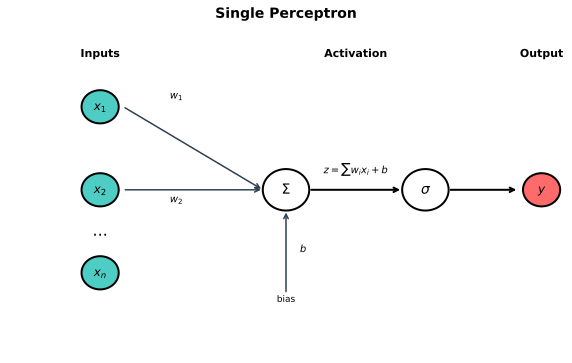
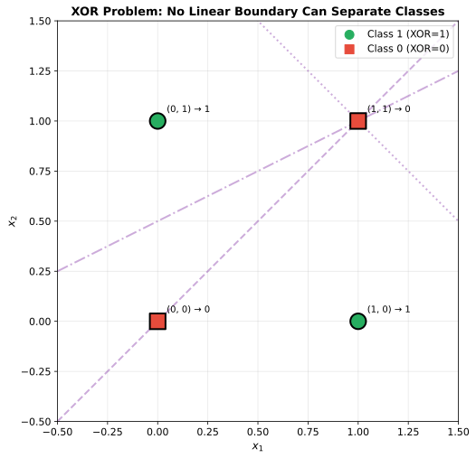
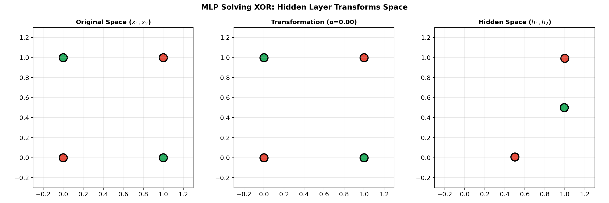
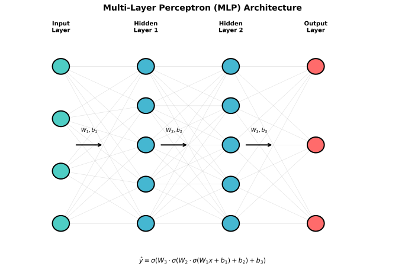
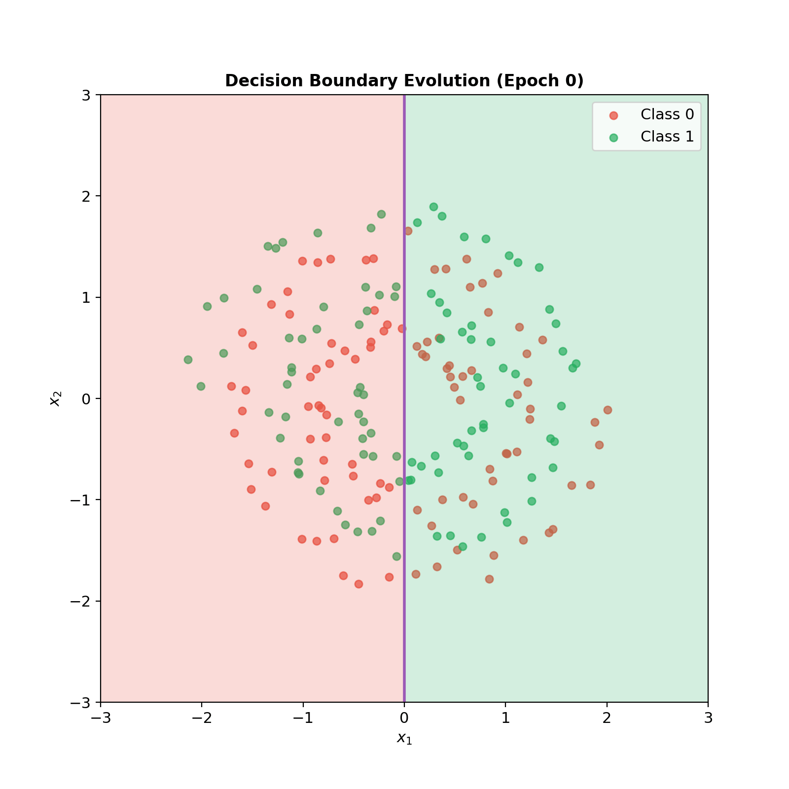

# Perceptrons & MLPs

> **The building blocks of neural networks** — from single neurons to universal function approximators

---

## The Perceptron

The perceptron, introduced by Frank Rosenblatt in 1958, is the simplest neural network unit. It models a biological neuron that "fires" when its inputs exceed a threshold.

### Mathematical Formulation

A perceptron computes a weighted sum of inputs and applies a step function:

$$y = \text{sign}(\mathbf{w} \cdot \mathbf{x} + b) = \text{sign}\left(\sum_{i=1}^{n} w_i x_i + b\right)$$

Where:
- $\mathbf{x} = [x_1, x_2, \ldots, x_n]$ are input features
- $\mathbf{w} = [w_1, w_2, \ldots, w_n]$ are learnable weights
- $b$ is the bias term
- $\text{sign}(z)$ returns +1 if $z > 0$, else -1



### The Perceptron Learning Algorithm

The perceptron learns through a simple update rule:

```
For each training example (x, y):
    prediction = sign(w · x + b)
    if prediction != y:
        w = w + y * x
        b = b + y
```

**Key insight**: The perceptron converges to a solution in finite steps *if the data is linearly separable*. This is the **Perceptron Convergence Theorem**.

### What a Perceptron Can Learn

A single perceptron can only learn **linear decision boundaries** — hyperplanes that separate classes:
- AND gate: learnable
- OR gate: learnable
- NOT gate: learnable

---

## The XOR Problem

In 1969, Minsky and Papert showed that a single perceptron **cannot learn XOR**, dealing a major blow to neural network research.

### Why XOR Fails

| $x_1$ | $x_2$ | XOR |
|-------|-------|-----|
| 0 | 0 | 0 |
| 0 | 1 | 1 |
| 1 | 0 | 1 |
| 1 | 1 | 0 |



No single line can separate the positive (1) examples from the negative (0) examples. XOR is **not linearly separable**.

### The Solution: Hidden Layers

By adding a **hidden layer**, we can first transform the input space to make it linearly separable, then separate with a second layer.



The hidden layer learns to map:
- $(0,0) \rightarrow$ point A
- $(0,1) \rightarrow$ point B
- $(1,0) \rightarrow$ point C
- $(1,1) \rightarrow$ point D

In this transformed space, the classes become linearly separable.

---

## Multi-Layer Perceptrons (MLPs)

An MLP stacks multiple layers of neurons, each fully connected to the next.

### Architecture

```
Input Layer    Hidden Layer(s)    Output Layer
    x₁  ─────┐
    x₂  ─────┼──►  h₁  ───┐
    x₃  ─────┤     h₂  ───┼──►  y₁
    ...      │     h₃  ───┤     y₂
    xₙ  ─────┘     ...    │     ...
                   hₘ  ───┘     yₖ
```

### Mathematical Formulation

For an L-layer MLP:

$$\mathbf{z}^{[l]} = \mathbf{W}^{[l]} \mathbf{a}^{[l-1]} + \mathbf{b}^{[l]}$$
$$\mathbf{a}^{[l]} = g(\mathbf{z}^{[l]})$$

Where:
- $\mathbf{a}^{[0]} = \mathbf{x}$ (input)
- $g(\cdot)$ is the activation function
- $\mathbf{a}^{[L]} = \hat{\mathbf{y}}$ (output)



### Why Depth Matters

| Property | Wide (1 hidden layer) | Deep (many layers) |
|----------|----------------------|-------------------|
| **Expressiveness** | Universal approximator | Also universal approximator |
| **Efficiency** | May need exponentially many neurons | Often fewer parameters for same function |
| **Representation** | Flat features | Hierarchical features |
| **Training** | Easier optimization | Harder (vanishing gradients) |

**Key insight**: Deep networks learn hierarchical representations — early layers learn simple features (edges), later layers learn complex features (objects).

---

## Universal Approximation Theorem

**Theorem**: A feedforward network with a single hidden layer containing a finite number of neurons can approximate any continuous function on compact subsets of $\mathbb{R}^n$, to any desired precision.

### What This Means

- MLPs are **universal function approximators**
- A single hidden layer is *theoretically* sufficient
- The theorem says nothing about:
  - How many neurons are needed
  - How to find the right weights
  - Whether training will converge

### Practical Implications

In practice, deep networks (multiple layers) are often more efficient than wide networks (single huge layer) for learning complex functions.

---

## Decision Boundaries

Hidden layers allow networks to learn complex, non-linear decision boundaries.



| Network Depth | Decision Boundary |
|---------------|-------------------|
| 0 hidden layers | Linear (hyperplane) |
| 1 hidden layer | Piecewise linear / smooth curves |
| 2+ hidden layers | Arbitrarily complex shapes |

### How Hidden Layers Create Complex Boundaries

Each hidden neuron creates a linear boundary. The combination of many linear boundaries, composed through layers, creates complex non-linear boundaries.

---

## Forward Pass Implementation

```python
import numpy as np

def forward_pass(X, weights, biases, activation='relu'):
    """
    Forward pass through an MLP.

    Args:
        X: Input data (batch_size, input_dim)
        weights: List of weight matrices
        biases: List of bias vectors
        activation: Activation function ('relu', 'sigmoid', 'tanh')

    Returns:
        Output and cached activations for backprop
    """
    activations = {'relu': lambda z: np.maximum(0, z),
                   'sigmoid': lambda z: 1 / (1 + np.exp(-z)),
                   'tanh': np.tanh}

    g = activations[activation]

    a = X
    cache = [a]

    for W, b in zip(weights[:-1], biases[:-1]):
        z = a @ W + b
        a = g(z)
        cache.append(a)

    # Output layer (linear for regression, softmax for classification)
    z = a @ weights[-1] + biases[-1]
    output = z  # or softmax(z) for classification

    return output, cache
```

---

## Interview Questions

### Q1: "Why can't a single perceptron solve XOR?"

> **A single perceptron can only learn linear decision boundaries (hyperplanes). XOR is not linearly separable — no single line can separate the positive examples ((0,1), (1,0)) from the negative examples ((0,0), (1,1)).**
>
> **The solution is adding a hidden layer.** The first layer transforms the input space to make the classes linearly separable. For example, one hidden neuron can compute $h_1 = (x_1 \text{ AND } x_2)$ and another $h_2 = (x_1 \text{ OR } x_2)$. In this transformed space $(h_1, h_2)$, XOR becomes $h_2 \text{ AND NOT } h_1$, which is linearly separable.
>
> **This illustrates the key insight**: hidden layers learn representations that make the problem easier for subsequent layers.

### Q2: "What is the universal approximation theorem and what are its limitations?"

> **The theorem states**: A feedforward network with a single hidden layer can approximate any continuous function on a compact domain to arbitrary precision, given enough hidden neurons and appropriate activation functions.
>
> **Limitations**:
> 1. **Doesn't specify how many neurons** — may need exponentially many
> 2. **Doesn't say how to find weights** — just that they exist
> 3. **Doesn't guarantee training will converge** — optimization may fail
> 4. **Doesn't address generalization** — only approximation on training domain
>
> **Practical implication**: Deep networks often achieve the same approximation with fewer parameters than wide networks, and they learn more meaningful hierarchical features.

### Q3: "How does adding depth help neural networks?"

> **Depth enables hierarchical feature learning**:
> - **Layer 1**: Low-level features (edges, textures)
> - **Layer 2**: Mid-level features (shapes, parts)
> - **Layer 3+**: High-level features (objects, concepts)
>
> **Efficiency**: Some functions require exponentially many neurons in a shallow network but only polynomial neurons in a deep network.
>
> **Trade-off**: Deeper networks are harder to train due to vanishing gradients, but techniques like residual connections, normalization, and careful initialization have largely solved this.
>
> **Example**: A 10-layer CNN can recognize ImageNet objects with ~25M parameters. A 1-layer network would need vastly more.

---

## Key Takeaways

1. **Perceptrons are linear classifiers** — they can only learn linearly separable problems.

2. **The XOR problem** demonstrates the need for hidden layers to learn non-linear decision boundaries.

3. **MLPs are universal approximators** — but the theorem doesn't guarantee efficient learning.

4. **Depth enables hierarchical representations** — each layer builds on features from the previous layer.

5. **Hidden layers transform the input space** — making complex problems linearly separable at the output layer.
