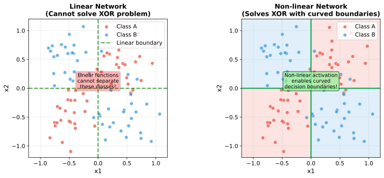
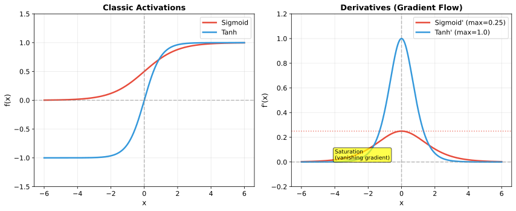
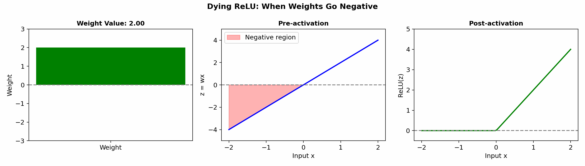
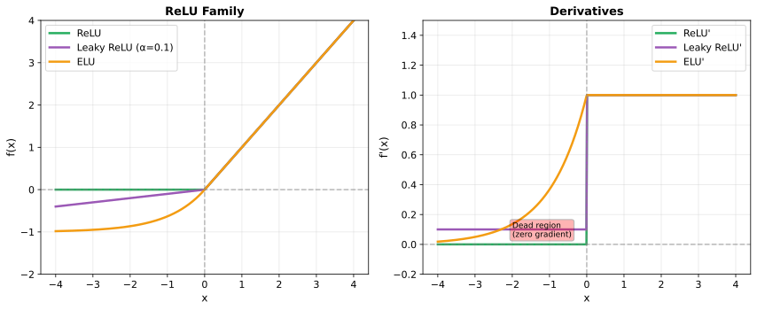
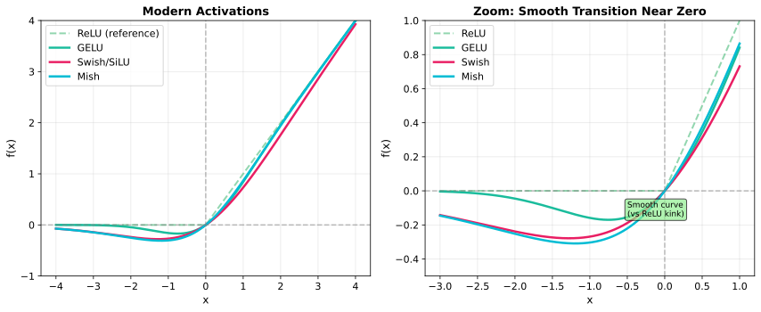
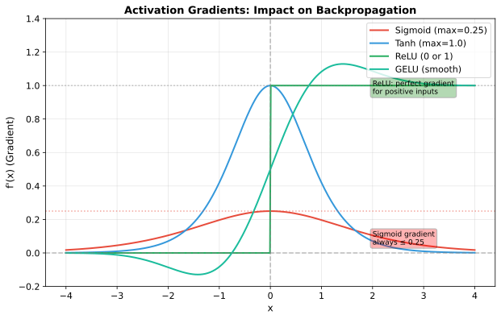

# Activation Functions

> **The source of non-linearity** — why neural networks can learn complex functions

---

## Why Non-linearity is Essential

Without activation functions, a neural network is just a series of linear transformations — and the composition of linear functions is still linear.

### The Linear Collapse Problem

Consider a 2-layer network without activations:
$$\mathbf{y} = \mathbf{W}_2(\mathbf{W}_1 \mathbf{x}) = (\mathbf{W}_2 \mathbf{W}_1) \mathbf{x} = \mathbf{W}' \mathbf{x}$$

No matter how many layers, the result is equivalent to a single linear transformation. **Non-linear activation functions break this limitation**.



---

## Classic Activations

### Sigmoid

$$\sigma(x) = \frac{1}{1 + e^{-x}}$$

| Property | Value |
|----------|-------|
| **Range** | (0, 1) |
| **Derivative** | $\sigma(x)(1 - \sigma(x))$ |
| **Max gradient** | 0.25 (at x=0) |

**Pros**: Smooth, bounded, interpretable as probability

**Cons**:
- **Vanishing gradients**: gradient $\leq 0.25$, compounds through layers
- **Not zero-centered**: outputs always positive, causing zig-zag gradients
- **Computationally expensive**: exponential function

### Tanh

$$\tanh(x) = \frac{e^x - e^{-x}}{e^x + e^{-x}} = 2\sigma(2x) - 1$$

| Property | Value |
|----------|-------|
| **Range** | (-1, 1) |
| **Derivative** | $1 - \tanh^2(x)$ |
| **Max gradient** | 1.0 (at x=0) |

**Pros**: Zero-centered (better than sigmoid), stronger gradients

**Cons**: Still saturates for large inputs, vanishing gradients persist



---

## The ReLU Family

### ReLU (Rectified Linear Unit)

$$f(x) = \max(0, x)$$

| Property | Value |
|----------|-------|
| **Range** | $[0, \infty)$ |
| **Derivative** | 1 if x > 0, else 0 |
| **Computation** | Very fast (just max) |

**Pros**:
- No vanishing gradient for positive inputs
- Computationally efficient
- Promotes sparsity (many zeros)
- Converges faster in practice

**Cons**:
- **Dying ReLU problem** (see below)
- Not zero-centered
- Unbounded (can cause exploding activations)

### The Dying ReLU Problem



When a neuron's weights produce negative inputs for all training examples:
1. ReLU outputs 0 for all inputs
2. Gradient is 0, so weights don't update
3. Neuron is "dead" — permanently stuck

**Causes**:
- Large learning rate pushing weights too negative
- Poor initialization
- Large negative bias

**Solutions**:
- Leaky ReLU variants
- Proper initialization (He initialization)
- Batch normalization
- Lower learning rates

### Leaky ReLU

$$f(x) = \begin{cases} x & \text{if } x > 0 \\ \alpha x & \text{if } x \leq 0 \end{cases}$$

Typically $\alpha = 0.01$. Allows small gradient for negative inputs.

### Parametric ReLU (PReLU)

Same as Leaky ReLU, but $\alpha$ is learned during training.

### ELU (Exponential Linear Unit)

$$f(x) = \begin{cases} x & \text{if } x > 0 \\ \alpha(e^x - 1) & \text{if } x \leq 0 \end{cases}$$

Smooth negative region, pushes mean activations toward zero.



---

## Modern Activations

### GELU (Gaussian Error Linear Unit)

$$\text{GELU}(x) = x \cdot \Phi(x) = x \cdot \frac{1}{2}\left[1 + \text{erf}\left(\frac{x}{\sqrt{2}}\right)\right]$$

Approximation: $\text{GELU}(x) \approx 0.5x\left(1 + \tanh\left[\sqrt{2/\pi}(x + 0.044715x^3)\right]\right)$

**Key insight**: GELU weights inputs by their probability under a Gaussian distribution. Inputs with higher magnitude are more likely to be "kept".

| Property | Value |
|----------|-------|
| **Range** | $(-0.17, \infty)$ |
| **Smoothness** | Everywhere differentiable |
| **Use case** | Transformers (BERT, GPT) |

**Why transformers use GELU**:
- Smooth gradients help deep network optimization
- Probabilistic interpretation suits attention mechanisms
- Empirically outperforms ReLU in transformers

### Swish / SiLU

$$f(x) = x \cdot \sigma(x) = \frac{x}{1 + e^{-x}}$$

Self-gated activation — the input gates itself through a sigmoid.

### Mish

$$f(x) = x \cdot \tanh(\text{softplus}(x)) = x \cdot \tanh(\ln(1 + e^x))$$

Smooth, non-monotonic, shows good results in vision models.



---

## Output Layer Activations

The output layer activation depends on the task:

| Task | Activation | Output | Loss Function |
|------|------------|--------|---------------|
| Binary classification | Sigmoid | P(y=1) | Binary cross-entropy |
| Multi-class (single label) | Softmax | P(y=k) for each class | Categorical cross-entropy |
| Multi-label | Sigmoid (per output) | P(y_k=1) per label | Binary CE per label |
| Regression | None (linear) | Real values | MSE |

### Softmax

$$\text{softmax}(x_i) = \frac{e^{x_i}}{\sum_j e^{x_j}}$$

Converts logits to probabilities that sum to 1. **Key**: assumes mutually exclusive classes.

### Numerical Stability

For softmax, subtract max before exponentiating:
```python
def stable_softmax(x):
    exp_x = np.exp(x - np.max(x, axis=-1, keepdims=True))
    return exp_x / np.sum(exp_x, axis=-1, keepdims=True)
```

---

## Choosing Activations

### Hidden Layers

| Scenario | Recommended | Rationale |
|----------|-------------|-----------|
| **Default choice** | ReLU | Fast, effective, well-understood |
| **Dying ReLU issues** | Leaky ReLU or ELU | Maintains gradient for negative inputs |
| **Transformers** | GELU | Smooth, matches architecture well |
| **Very deep CNNs** | ReLU + BatchNorm | Normalization prevents dead neurons |

### Decision Flowchart

```
Is this a transformer?
  └─ Yes → GELU
  └─ No → Is this the output layer?
          └─ Yes → Task-specific (sigmoid/softmax/linear)
          └─ No → Are neurons dying?
                  └─ Yes → Leaky ReLU or ELU
                  └─ No → ReLU
```

---

## Gradient Flow Comparison



| Activation | Gradient at x=0 | Gradient at x=5 | Gradient at x=-5 |
|------------|-----------------|-----------------|------------------|
| Sigmoid | 0.25 | ~0 (saturated) | ~0 (saturated) |
| Tanh | 1.0 | ~0 (saturated) | ~0 (saturated) |
| ReLU | undefined (0 or 1) | 1.0 | 0 |
| GELU | 0.5 | ~1.0 | ~0 |

---

## Interview Questions

### Q1: "Explain the dying ReLU problem and how to fix it."

> **The dying ReLU problem** occurs when neurons consistently output 0 for all training inputs. Since ReLU's gradient is 0 for negative inputs, these neurons receive no gradient and cannot update their weights — they're "dead."
>
> **Causes**:
> - Large learning rates pushing weights too negative
> - Poor weight initialization
> - Large negative bias terms
>
> **Solutions**:
> 1. **Leaky ReLU**: $f(x) = \max(0.01x, x)$ — small gradient for negative inputs
> 2. **He initialization**: $\text{Var}(W) = 2/n_{in}$ — keeps activations in good range
> 3. **Batch normalization**: normalizes inputs, reducing extreme values
> 4. **Lower learning rate**: prevents drastic weight changes
> 5. **Gradient clipping**: bounds updates during training

### Q2: "Why do transformers use GELU instead of ReLU?"

> **GELU** (Gaussian Error Linear Unit) weights inputs by their "probability" under a Gaussian:
> $$\text{GELU}(x) = x \cdot \Phi(x)$$
>
> **Why it works for transformers**:
> 1. **Smooth gradients**: Unlike ReLU's sharp corner at 0, GELU is smooth everywhere, helping optimization in very deep networks (transformers have 12-96 layers)
> 2. **Probabilistic interpretation**: Inputs are weighted by their likelihood of being "important" — aligns with attention's soft weighting
> 3. **Non-monotonic**: Small negative values aren't completely zeroed, preserving some gradient signal
> 4. **Empirical results**: GELU consistently outperforms ReLU in transformer architectures (BERT, GPT showed this)
>
> **Trade-off**: GELU is more expensive to compute than ReLU, but this cost is negligible compared to attention computation in transformers.

### Q3: "When would you use sigmoid vs softmax in the output layer?"

> **Sigmoid** for **multi-label classification**:
> - Each class is independent
> - Multiple labels can be true simultaneously
> - Example: Image tags (beach, sunset, people — all can be true)
> - Output: Independent probabilities for each class
>
> **Softmax** for **multi-class classification**:
> - Classes are mutually exclusive
> - Exactly one label is correct
> - Example: ImageNet (exactly one object category)
> - Output: Probability distribution summing to 1
>
> **Key difference**: Softmax enforces competition between classes (if P(cat) increases, P(dog) must decrease). Sigmoid treats each output independently.
>
> **Code difference**:
> ```python
> # Multi-label: sigmoid per output + binary CE
> loss = sum(BCE(sigmoid(logits[i]), labels[i]) for i in classes)
>
> # Multi-class: softmax + categorical CE
> loss = CE(softmax(logits), one_hot_label)
> ```

---

## Key Takeaways

1. **Non-linearity is essential** — without it, any deep network collapses to a single linear transformation.

2. **ReLU dominates** — simple, fast, and effective for most applications.

3. **Dying ReLU is real** — use Leaky ReLU, proper initialization, or normalization to prevent it.

4. **GELU for transformers** — smooth gradients and probabilistic interpretation suit attention-based architectures.

5. **Output activation matches the task** — sigmoid for multi-label, softmax for multi-class, linear for regression.
