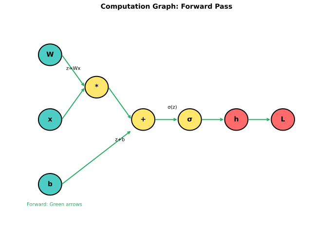
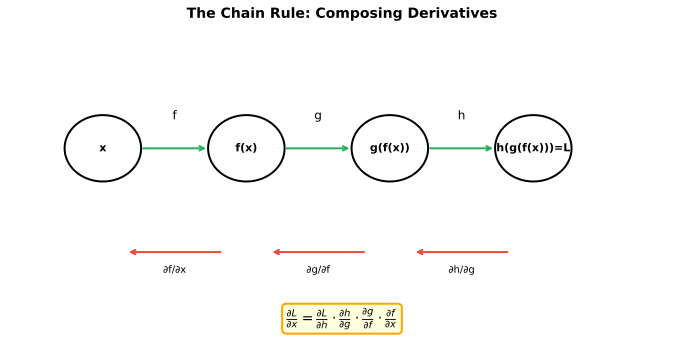
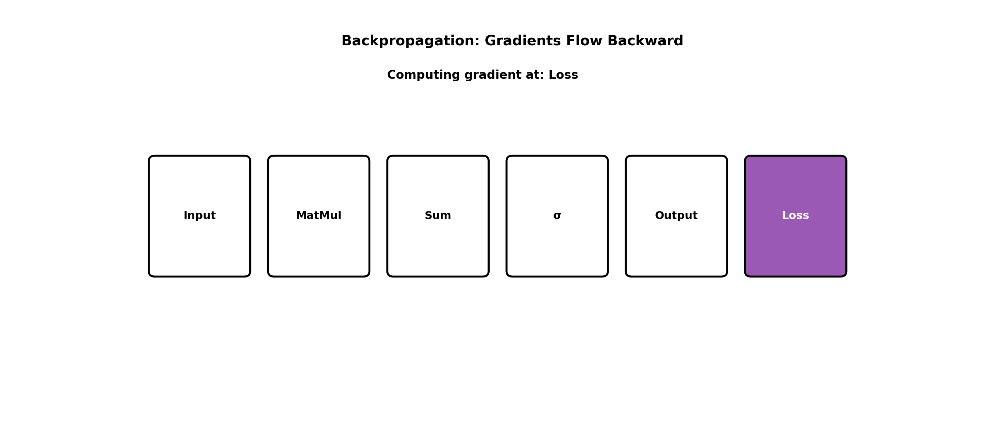
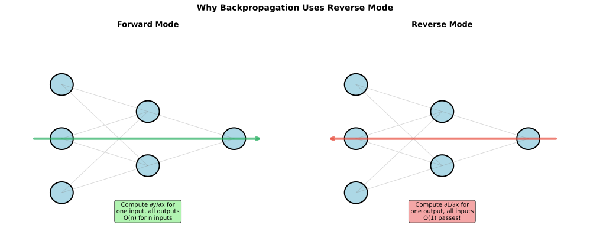

# Backpropagation

> **The algorithm that enables deep learning** — efficiently computing gradients through neural networks

---

## The Problem: Computing Gradients

To train a neural network with gradient descent, we need gradients of the loss with respect to every weight:

$$\theta^{new} = \theta^{old} - \alpha \frac{\partial L}{\partial \theta}$$

**The challenge**: A network with 1 million weights needs 1 million partial derivatives. How do we compute them efficiently?

### Naive Approach: Numerical Gradients

Perturb each weight and measure the change in loss:

$$\frac{\partial L}{\partial w_i} \approx \frac{L(w_i + \epsilon) - L(w_i - \epsilon)}{2\epsilon}$$

**Problem**: Requires 2 forward passes per weight. For 1M weights, that's 2M forward passes per update — far too slow.

### The Solution: Backpropagation

Backpropagation computes all gradients in **one forward pass + one backward pass**, regardless of network size.

---

## Computation Graphs

Neural networks can be represented as **directed acyclic graphs (DAGs)** where:
- Nodes = operations (add, multiply, activation)
- Edges = data flow



### Example: Simple Network

For $y = \sigma(w_2 \cdot \sigma(w_1 \cdot x + b_1) + b_2)$:

```
x ──┬──→ [*w₁] ──→ [+b₁] ──→ [σ] ──→ [*w₂] ──→ [+b₂] ──→ [σ] ──→ y
    │                         │
    └─── w₁                   h₁
```

Each node has:
- Forward: compute output from inputs
- Backward: compute gradient of loss w.r.t. inputs, given gradient w.r.t. output

---

## The Chain Rule

Backpropagation is the chain rule applied systematically through the computation graph.

### Single Variable Chain Rule

If $y = f(g(x))$:
$$\frac{dy}{dx} = \frac{dy}{dg} \cdot \frac{dg}{dx}$$

### Multivariate Chain Rule

If $L = L(y_1, y_2)$ where $y_1 = f_1(x)$ and $y_2 = f_2(x)$:
$$\frac{\partial L}{\partial x} = \frac{\partial L}{\partial y_1}\frac{\partial y_1}{\partial x} + \frac{\partial L}{\partial y_2}\frac{\partial y_2}{\partial x}$$

**Key insight**: Gradients **sum** when paths merge, and **multiply** along paths.



---

## Backpropagation Algorithm

### Forward Pass

Compute activations layer by layer, **caching intermediate values**:

```python
def forward(x, weights, biases):
    cache = {'a0': x}
    a = x
    for l, (W, b) in enumerate(zip(weights, biases)):
        z = a @ W + b
        cache[f'z{l+1}'] = z
        a = relu(z)  # or other activation
        cache[f'a{l+1}'] = a
    return a, cache
```

### Backward Pass

Propagate gradients from output to input using cached values:

```python
def backward(y_pred, y_true, cache, weights):
    grads = {}
    L = len(weights)

    # Output layer gradient
    dL_da = y_pred - y_true  # for softmax + cross-entropy

    for l in reversed(range(1, L+1)):
        # Gradient through activation
        dL_dz = dL_da * relu_derivative(cache[f'z{l}'])

        # Gradient for weights and biases
        grads[f'dW{l}'] = cache[f'a{l-1}'].T @ dL_dz
        grads[f'db{l}'] = np.sum(dL_dz, axis=0)

        # Propagate to previous layer
        dL_da = dL_dz @ weights[l-1].T

    return grads
```



---

## Full Derivation: 2-Layer Network

Consider: Input $\mathbf{x}$ → Hidden $\mathbf{h}$ → Output $\hat{\mathbf{y}}$

### Forward Pass

$$\mathbf{z}_1 = \mathbf{W}_1 \mathbf{x} + \mathbf{b}_1$$
$$\mathbf{h} = \sigma(\mathbf{z}_1)$$
$$\mathbf{z}_2 = \mathbf{W}_2 \mathbf{h} + \mathbf{b}_2$$
$$\hat{\mathbf{y}} = \text{softmax}(\mathbf{z}_2)$$

### Loss

Cross-entropy: $L = -\sum_i y_i \log \hat{y}_i$

### Backward Pass

**Step 1**: Output layer gradient (softmax + cross-entropy simplifies nicely)
$$\frac{\partial L}{\partial \mathbf{z}_2} = \hat{\mathbf{y}} - \mathbf{y} \equiv \boldsymbol{\delta}_2$$

**Step 2**: Output weight gradients
$$\frac{\partial L}{\partial \mathbf{W}_2} = \mathbf{h}^T \boldsymbol{\delta}_2$$
$$\frac{\partial L}{\partial \mathbf{b}_2} = \boldsymbol{\delta}_2$$

**Step 3**: Propagate to hidden layer
$$\frac{\partial L}{\partial \mathbf{h}} = \boldsymbol{\delta}_2 \mathbf{W}_2^T$$

**Step 4**: Through activation
$$\frac{\partial L}{\partial \mathbf{z}_1} = \frac{\partial L}{\partial \mathbf{h}} \odot \sigma'(\mathbf{z}_1) \equiv \boldsymbol{\delta}_1$$

**Step 5**: Hidden weight gradients
$$\frac{\partial L}{\partial \mathbf{W}_1} = \mathbf{x}^T \boldsymbol{\delta}_1$$
$$\frac{\partial L}{\partial \mathbf{b}_1} = \boldsymbol{\delta}_1$$

### The Pattern

For any layer $l$:
$$\boldsymbol{\delta}_l = \boldsymbol{\delta}_{l+1} \mathbf{W}_{l+1}^T \odot g'(\mathbf{z}_l)$$
$$\nabla_{\mathbf{W}_l} L = \mathbf{a}_{l-1}^T \boldsymbol{\delta}_l$$

---

## Forward Mode vs Reverse Mode Autodiff

| Mode | Direction | Efficiency |
|------|-----------|------------|
| **Forward mode** | Input → Output | O(1) for one input, all outputs |
| **Reverse mode** | Output → Input | O(1) for one output, all inputs |

### Why Reverse Mode for Neural Networks?

Neural networks have:
- Many inputs (millions of weights)
- One output (scalar loss)

**Forward mode**: O(n) passes for n weights
**Reverse mode (backprop)**: O(1) passes regardless of weight count



---

## Implementation Details

### Gradient Checking

Verify backprop implementation by comparing to numerical gradients:

```python
def gradient_check(f, x, epsilon=1e-7):
    """Check analytical gradient against numerical gradient."""
    analytical_grad = f.backward(x)
    numerical_grad = np.zeros_like(x)

    for i in range(x.size):
        x_plus = x.copy()
        x_plus.flat[i] += epsilon
        x_minus = x.copy()
        x_minus.flat[i] -= epsilon

        numerical_grad.flat[i] = (f(x_plus) - f(x_minus)) / (2 * epsilon)

    error = np.linalg.norm(analytical_grad - numerical_grad)
    error /= np.linalg.norm(analytical_grad) + np.linalg.norm(numerical_grad)

    return error < 1e-5  # Should be very small
```

### Numerical Stability

**Problem**: Softmax can overflow for large inputs

**Solution**: Subtract max before exponentiating
```python
def stable_softmax(z):
    z_shifted = z - np.max(z, axis=-1, keepdims=True)
    exp_z = np.exp(z_shifted)
    return exp_z / np.sum(exp_z, axis=-1, keepdims=True)
```

### Vectorized Implementation

Always work with batches for efficiency:

```python
# Bad: loop over samples
for i in range(batch_size):
    grad_W += x[i:i+1].T @ delta[i:i+1]

# Good: vectorized
grad_W = x.T @ delta  # (input_dim, batch) @ (batch, output_dim)
```

---

## Why Cache Activations?

To compute $\nabla_{\mathbf{W}_l} L = \mathbf{a}_{l-1}^T \boldsymbol{\delta}_l$, we need $\mathbf{a}_{l-1}$.

**Options**:
1. Recompute: Run forward pass again (slow)
2. Cache: Store during forward pass (memory-intensive)

**Trade-off**: Training uses ~2x memory of inference because we cache activations.

**Gradient checkpointing**: Recompute some activations to trade compute for memory — useful for very large models.

---

## Interview Questions

### Q1: "Walk through backpropagation for a 2-layer network."

> **Forward pass**:
> 1. $\mathbf{z}_1 = \mathbf{W}_1 \mathbf{x} + \mathbf{b}_1$ (linear)
> 2. $\mathbf{a}_1 = \sigma(\mathbf{z}_1)$ (activation)
> 3. $\mathbf{z}_2 = \mathbf{W}_2 \mathbf{a}_1 + \mathbf{b}_2$ (linear)
> 4. $\hat{\mathbf{y}} = \text{softmax}(\mathbf{z}_2)$ (output)
>
> **Loss**: $L = -\sum y_i \log \hat{y}_i$
>
> **Backward pass**:
> 1. $\boldsymbol{\delta}_2 = \hat{\mathbf{y}} - \mathbf{y}$ (output gradient)
> 2. $\nabla_{\mathbf{W}_2} = \mathbf{a}_1^T \boldsymbol{\delta}_2$ (output weight gradient)
> 3. $\nabla_{\mathbf{a}_1} = \boldsymbol{\delta}_2 \mathbf{W}_2^T$ (propagate back)
> 4. $\boldsymbol{\delta}_1 = \nabla_{\mathbf{a}_1} \odot \sigma'(\mathbf{z}_1)$ (through activation)
> 5. $\nabla_{\mathbf{W}_1} = \mathbf{x}^T \boldsymbol{\delta}_1$ (hidden weight gradient)
>
> **Update**: $\mathbf{W} \leftarrow \mathbf{W} - \alpha \nabla_{\mathbf{W}}$

### Q2: "Why do we cache activations during forward pass?"

> **We cache activations because we need them for gradient computation.**
>
> The gradient w.r.t. weights at layer $l$ is:
> $$\nabla_{\mathbf{W}_l} L = \mathbf{a}_{l-1}^T \boldsymbol{\delta}_l$$
>
> We need $\mathbf{a}_{l-1}$ (the previous layer's activation) to compute this.
>
> **Trade-offs**:
> - **Cache everything**: Training uses ~2x inference memory
> - **Recompute**: Slower, but saves memory
> - **Gradient checkpointing**: Hybrid — cache some, recompute others
>
> This is why training large models requires much more memory than inference.

### Q3: "What's the difference between forward and reverse mode autodiff?"

> **Forward mode** propagates derivatives input → output:
> - Efficient for: Few inputs, many outputs
> - Complexity: O(n) passes for n inputs
>
> **Reverse mode** (backpropagation) propagates derivatives output → input:
> - Efficient for: Many inputs, few outputs
> - Complexity: O(m) passes for m outputs
>
> **Neural networks**: Millions of weights (inputs to loss), one scalar loss (output). Reverse mode computes all gradients in **one backward pass** — that's why we use backpropagation.
>
> Forward mode would require millions of passes. The efficiency difference is the reason deep learning is computationally feasible.

---

## Key Takeaways

1. **Backpropagation is the chain rule** applied systematically through a computation graph.

2. **Reverse mode autodiff** computes all gradients in O(1) backward passes — essential for efficiency.

3. **Cache activations** during forward pass for use in backward pass (trade memory for speed).

4. **Gradient checking** validates implementations by comparing to numerical gradients.

5. **The pattern**: $\boldsymbol{\delta}_l = \boldsymbol{\delta}_{l+1} \mathbf{W}_{l+1}^T \odot g'(\mathbf{z}_l)$ — gradients flow backward, multiplying by weights and activation derivatives.
