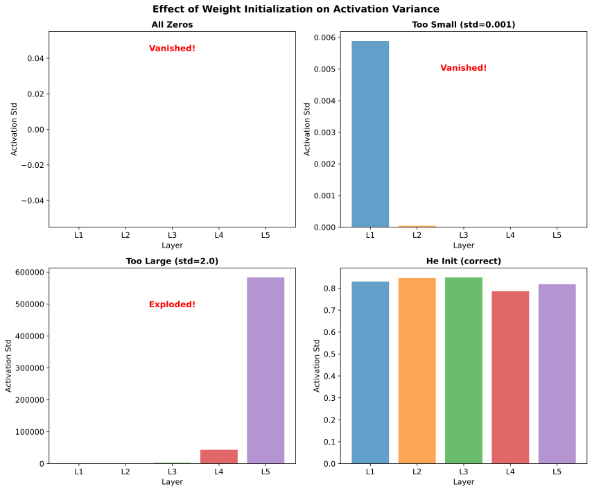
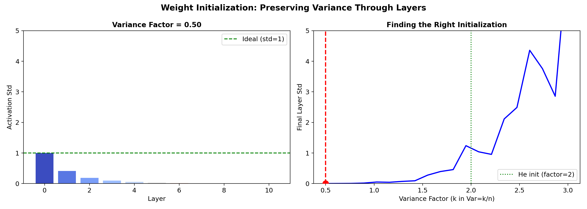
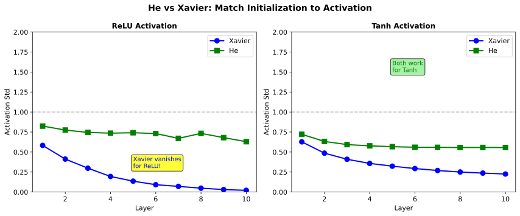

# Weight Initialization

> **Starting right** — why proper initialization is critical for training deep networks

---

## Why Initialization Matters

Weight initialization determines the starting point for gradient descent. Poor initialization can cause:
- **Training failure** (no learning at all)
- **Vanishing/exploding activations**
- **Extremely slow convergence**

### Symmetry Breaking

If all weights are initialized identically, all neurons in a layer compute the same output, receive the same gradient, and update identically. They remain symmetric forever.

**Result**: A layer with 100 neurons behaves like a layer with 1 neuron.

**Solution**: Random initialization breaks symmetry — each neuron learns different features.

---

## Bad Initializations

### All Zeros

```python
W = np.zeros((input_dim, output_dim))
```

**Problem**: All neurons output zero, all gradients are zero, nothing ever changes.

### All Same Value

```python
W = np.ones((input_dim, output_dim)) * 0.1
```

**Problem**: Symmetry is never broken — neurons stay identical.

### Too Large

```python
W = np.random.randn(input_dim, output_dim) * 10
```

**Problem**: Activations explode through layers, gradients explode, NaN losses.

### Too Small

```python
W = np.random.randn(input_dim, output_dim) * 0.001
```

**Problem**: Activations shrink to zero, gradients vanish, no learning.



---

## The Variance Problem

Consider a layer: $z = \sum_{i=1}^{n_{in}} w_i x_i$

If weights and inputs are independent with zero mean:
$$\text{Var}(z) = n_{in} \cdot \text{Var}(w) \cdot \text{Var}(x)$$

### Through Multiple Layers

For a network with $L$ layers:
$$\text{Var}(a^{[L]}) = \left(\prod_{l=1}^{L} n_{in}^{[l]} \cdot \text{Var}(w^{[l]})\right) \cdot \text{Var}(x)$$

If $n_{in} \cdot \text{Var}(w) > 1$: activations **explode** exponentially

If $n_{in} \cdot \text{Var}(w) < 1$: activations **vanish** exponentially

**Goal**: Keep $n_{in} \cdot \text{Var}(w) \approx 1$ so variance stays stable.



---

## Xavier/Glorot Initialization

**For sigmoid/tanh activations** (Glorot & Bengio, 2010)

### Derivation

To maintain variance through both forward and backward passes:
- Forward: $\text{Var}(w) = 1/n_{in}$
- Backward: $\text{Var}(w) = 1/n_{out}$

**Compromise**: Use the harmonic mean:

$$\text{Var}(w) = \frac{2}{n_{in} + n_{out}}$$

### Implementation

```python
# Xavier uniform
limit = np.sqrt(6 / (n_in + n_out))
W = np.random.uniform(-limit, limit, (n_in, n_out))

# Xavier normal
std = np.sqrt(2 / (n_in + n_out))
W = np.random.randn(n_in, n_out) * std
```

### When to Use

- Sigmoid activations
- Tanh activations
- Linear activations

---

## He/Kaiming Initialization

**For ReLU activations** (He et al., 2015)

### Why Xavier Fails for ReLU

ReLU zeros out ~50% of activations on average. If input variance is $\text{Var}(x)$:

$$\text{Var}(\text{ReLU}(z)) = \frac{1}{2} \cdot \text{Var}(z)$$

This extra factor of 1/2 causes variance to shrink through layers with Xavier init.

### Derivation

To compensate for ReLU killing half the values:

$$\text{Var}(w) = \frac{2}{n_{in}}$$

The factor of 2 accounts for ReLU's halving effect.

### Implementation

```python
# He uniform
limit = np.sqrt(6 / n_in)
W = np.random.uniform(-limit, limit, (n_in, n_out))

# He normal (most common)
std = np.sqrt(2 / n_in)
W = np.random.randn(n_in, n_out) * std
```

### When to Use

- ReLU activations
- Leaky ReLU
- ELU
- GELU (usually works well)



---

## Other Initialization Schemes

### LeCun Initialization

For SELU (self-normalizing) activations:

$$\text{Var}(w) = \frac{1}{n_{in}}$$

### Orthogonal Initialization

Initialize weight matrices as orthogonal matrices:

```python
W, _ = np.linalg.qr(np.random.randn(n_in, n_out))
```

**Benefits**: Preserves gradient norm during backprop, useful for RNNs.

### LSUV (Layer-Sequential Unit-Variance)

1. Initialize with orthogonal weights
2. Forward pass on a batch
3. Rescale each layer to have unit variance

**Benefit**: Data-dependent initialization, works for any architecture.

---

## Framework Defaults

Modern frameworks have sensible defaults:

| Framework | Default for Linear/Dense |
|-----------|-------------------------|
| PyTorch | Kaiming uniform (for Linear), Xavier for others |
| TensorFlow/Keras | Glorot uniform |
| JAX | Lecun normal |

**Usually you don't need to change these** — but knowing why they work helps debugging.

---

## Diagnosing Initialization Problems

### Signs of Bad Initialization

| Symptom | Likely Cause |
|---------|--------------|
| Loss is NaN | Exploding activations (init too large) |
| Loss doesn't decrease | Vanishing gradients (init too small) or symmetry |
| All outputs are same | Symmetry not broken |
| Some neurons never activate | Dead ReLUs (init caused negative region) |

### Debugging Steps

1. **Print activation statistics** at each layer:
```python
for name, layer in model.named_modules():
    print(f"{name}: mean={activations.mean():.4f}, std={activations.std():.4f}")
```

2. **Check gradient norms**:
```python
for name, param in model.named_parameters():
    if param.grad is not None:
        print(f"{name}: grad_norm={param.grad.norm():.6f}")
```

3. **Visualize activation distributions**:


---

## Practical Guidance

### Rules of Thumb

| Activation | Initialization | Formula |
|------------|---------------|---------|
| Sigmoid/Tanh | Xavier | $\text{Var} = \frac{2}{n_{in} + n_{out}}$ |
| ReLU/variants | He | $\text{Var} = \frac{2}{n_{in}}$ |
| SELU | LeCun | $\text{Var} = \frac{1}{n_{in}}$ |
| Linear | Xavier | $\text{Var} = \frac{2}{n_{in} + n_{out}}$ |

### Special Cases

- **ResNets**: Scale final layer of each residual block by $1/\sqrt{2}$ or $1/\sqrt{L}$
- **Transformers**: Often use $1/\sqrt{d_{model}}$ scaling
- **Batch Norm**: Initialization matters less because BN normalizes

---

## Interview Questions

### Q1: "Why can't we initialize all weights to zero?"

> **All neurons would compute the same output**, because they have identical weights. During backpropagation, they all receive the **same gradient** and update identically. This symmetry is never broken — the neurons remain identical forever.
>
> **Result**: A layer with 100 neurons effectively acts like a single neuron. The network cannot learn diverse features.
>
> **Solution**: Random initialization breaks symmetry. Each neuron starts with different weights, computes different outputs, receives different gradients, and learns different features.
>
> **Note**: Biases can be initialized to zero because they don't break symmetry (each neuron still has unique weights).

### Q2: "Derive He initialization for ReLU."

> **Goal**: Keep activation variance stable through layers.
>
> For a layer $z = \sum_{i=1}^{n} w_i x_i$ with independent inputs:
> $$\text{Var}(z) = n \cdot \text{Var}(w) \cdot \text{Var}(x)$$
>
> **ReLU's effect**: $\text{Var}(\text{ReLU}(z)) = \frac{1}{2}\text{Var}(z)$ (zeros half the values)
>
> For stable variance through layers:
> $$n \cdot \text{Var}(w) \cdot \frac{1}{2} = 1$$
> $$\text{Var}(w) = \frac{2}{n}$$
>
> **He initialization**: Sample from $\mathcal{N}(0, 2/n_{in})$ or $\text{Uniform}(-\sqrt{6/n_{in}}, \sqrt{6/n_{in}})$
>
> The factor of 2 compensates for ReLU killing half the activations.

### Q3: "How would you debug a network that isn't learning?"

> **Step 1: Check activation distributions at each layer**
> - Near zero everywhere → init too small, vanishing activations
> - Very large/NaN → init too large, exploding activations
> - All same value → symmetry not broken
>
> **Step 2: Check gradient norms**
> - Very small (< 1e-7) → vanishing gradients
> - Very large or NaN → exploding gradients
>
> **Step 3: Verify initialization matches activation**
> - ReLU needs He init ($\text{Var} = 2/n$)
> - Sigmoid/Tanh needs Xavier ($\text{Var} = 2/(n_{in} + n_{out})$)
>
> **Step 4: Other checks**
> - Learning rate too high/low?
> - Loss function appropriate for task?
> - Data preprocessing correct?
> - Bug in model architecture?
>
> **Quick fix**: Add BatchNorm — it's more forgiving of initialization.

---

## Key Takeaways

1. **Random initialization breaks symmetry** — essential for neurons to learn different features.

2. **Variance must be preserved** through layers to prevent vanishing/exploding activations.

3. **Use He for ReLU** ($\text{Var} = 2/n_{in}$) — the factor of 2 compensates for ReLU killing half the values.

4. **Use Xavier for sigmoid/tanh** ($\text{Var} = 2/(n_{in} + n_{out})$) — balances forward and backward variance.

5. **Diagnosis**: Print activation means/stds and gradient norms layer by layer to identify problems.
